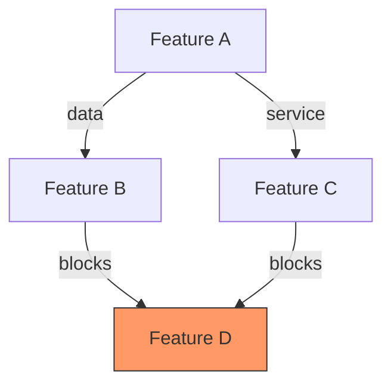
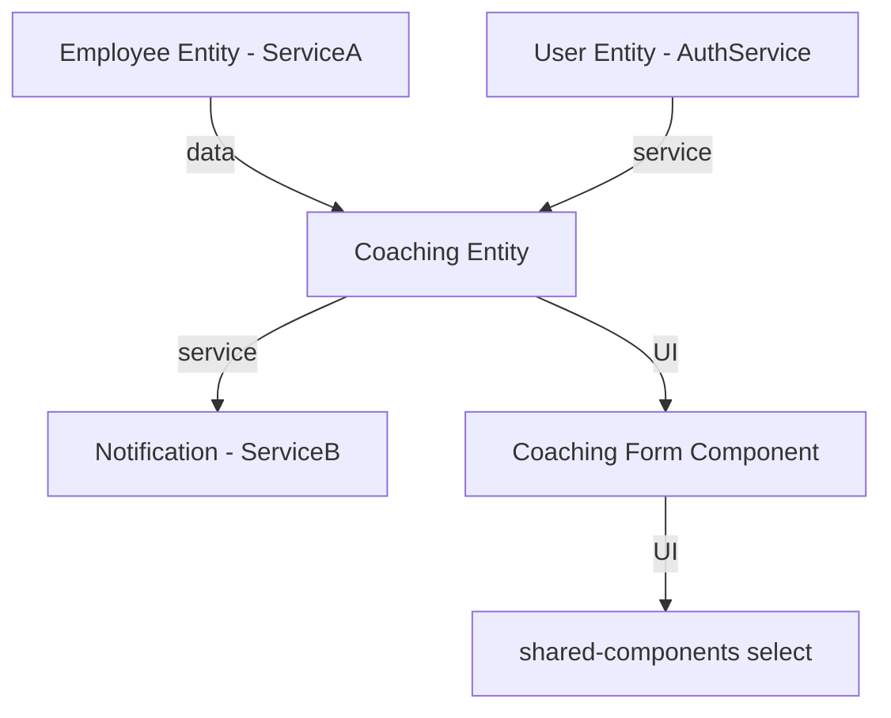
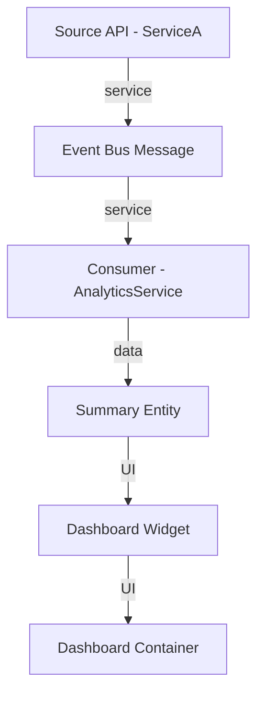

> Codex compatibility note:
>
> - Invoke repository skills with `$skill-name` in Codex; this mirrored copy rewrites legacy Claude `/skill-name` references.
> - Task tracker mandate: BEFORE executing any workflow or skill step, create/update task tracking for all steps and keep it synchronized as progress changes.
> - User-question prompts mean to ask the user directly in Codex.
> - Ignore Claude-specific mode-switch instructions when they appear.
> - Strict execution contract: when a user explicitly invokes a skill, execute that skill protocol as written.
> - Subagent authorization: when a skill is user-invoked or AI-detected and its protocol requires subagents, that skill activation authorizes use of the required `spawn_agent` subagent(s) for that task.
> - Do not skip, reorder, or merge protocol steps unless the user explicitly approves the deviation first.
> - For workflow skills, execute each listed child-skill step explicitly and report step-by-step evidence.
> - If a required step/tool cannot run in this environment, stop and ask the user before adapting.

<!-- CODEX:PROJECT-REFERENCE-LOADING:START -->

## Codex Project-Reference Loading (No Hooks)

Codex does not receive Claude hook-based doc injection.
When coding, planning, debugging, testing, or reviewing, open project docs explicitly using this routing.

**Always read:**

- `docs/project-config.json` (project-specific paths, commands, modules, and workflow/test settings)
- `docs/project-reference/docs-index-reference.md` (routes to the full `docs/project-reference/*` catalog)
- `docs/project-reference/lessons.md` (always-on guardrails and anti-patterns)

**Situation-based docs:**

- Backend/CQRS/API/domain/entity changes: `backend-patterns-reference.md`, `domain-entities-reference.md`, `project-structure-reference.md`
- Frontend/UI/styling/design-system: `frontend-patterns-reference.md`, `scss-styling-guide.md`, `design-system/README.md`
- Spec/test-case planning or TC mapping: `feature-docs-reference.md`
- Integration test implementation/review: `integration-test-reference.md`
- E2E test implementation/review: `e2e-test-reference.md`
- Code review/audit work: `code-review-rules.md` plus domain docs above based on changed files

Do not read all docs blindly. Start from `docs-index-reference.md`, then open only relevant files for the task.

<!-- CODEX:PROJECT-REFERENCE-LOADING:END -->

## Quick Summary

**Goal:** Analyze and visualize dependencies between features, services, or work items to identify blockers and critical paths.

**Workflow:**

1. **Identify Scope** — Single feature, module, or full release
2. **Classify Dependencies** — Data, Service, UI, or Infrastructure types
3. **Build Graph** — Create Mermaid dependency diagram
4. **Find Critical Path** — Longest blocking chain; mark ready-to-start items
5. **Deliver Report** — Summary, graph, critical path, risks

**Key Rules:**

- Respect microservice boundaries (cross-service = message bus only)
- Flag circular dependencies as errors
- Not for package/npm upgrades (use `package-upgrade` instead)

**Be skeptical. Apply critical thinking, sequential thinking. Every claim needs traced proof, confidence percentages (Idea should be more than 80%).**

# Dependency Mapping

## Purpose

Analyze and visualize dependencies between features, services, modules, or work items to identify blockers, critical paths, and safe execution order.

## When to Use

- Planning feature implementation sequence across modules
- Identifying what blocks a specific feature or work item
- Mapping cross-service dependencies (backend-to-backend, frontend-to-backend)
- Understanding critical path for a release or milestone
- Analyzing impact of changing a shared module or entity

## When NOT to Use

- Single-service code changes with no cross-boundary impact -- just implement directly
- Performance analysis -- use `arch-performance-optimization` instead
- Security dependency auditing -- use `arch-security-review` instead
- Package/npm dependency upgrades -- use `package-upgrade` instead

## Prerequisites

- Read the feature/PBI/plan files to understand scope
- Access to `docs/project-reference/project-structure-reference.md` for service boundary reference
- Understand the project's microservice boundaries (search `src/Services/` for service list)

## Workflow

### Step 1: Identify Scope

Determine what to map:

- **Single feature**: Find all files, services, and entities it touches
- **Module/service**: Map all inbound and outbound dependencies
- **Release/milestone**: Map all features and their inter-dependencies

### Step 2: Classify Dependencies

For each dependency found, classify by type:

| Type               | Direction                      | Description                                 | Example                                           |
| ------------------ | ------------------------------ | ------------------------------------------- | ------------------------------------------------- |
| **Data**           | Entity A requires Entity B     | Foreign key, navigation property, shared ID | Employee requires Company                         |
| **Service**        | Service A calls Service B      | Message bus, API call, event consumer       | Service A consumes entity events from Service B   |
| **UI**             | Component A embeds Component B | Shared component, library dependency        | Feature form uses shared component library select |
| **Infrastructure** | Feature needs infra change     | Database migration, config, new queue       | New feature needs Redis cache key                 |

### Step 3: Build Dependency Graph

Use Mermaid syntax for visualization:



### Step 4: Identify Critical Path

- Find the longest chain of blocking dependencies
- Mark items with no blockers as "ready to start"
- Flag circular dependencies as errors

### Step 5: Deliver Report

Output structured dependency report (see Output Format).

## Output Format

```markdown
## Dependency Map: [Feature/Module Name]

### Summary

- Total items: N
- Ready to start: N (no blockers)
- Blocked: N
- Critical path length: N steps

### Dependency Graph

[Mermaid diagram]

### Critical Path

1. [Item A] -- no blockers, estimated: Xd
2. [Item B] -- blocked by: A, estimated: Xd
3. [Item C] -- blocked by: B, estimated: Xd

### Dependency Details

| Item | Type                  | Depends On | Blocks | Status        |
| ---- | --------------------- | ---------- | ------ | ------------- |
| ...  | data/service/UI/infra | ...        | ...    | ready/blocked |

### Risks

- [Circular dependency / tight coupling / single point of failure]
```

## Examples

### Example 1: Backend Cross-Service Feature

**Input**: "Map dependencies for adding a new Coaching feature in {ServiceA}"

**Analysis**:



**Critical path**: Employee Entity -> Coaching Entity -> Coaching API -> Coaching Form
**Ready to start**: Employee Entity already exists, shared component select exists
**Blocked**: Coaching Entity creation, then API, then UI

### Example 2: Frontend Module Dependency

**Input**: "What blocks the new Dashboard widget in {AnalyticsService}?"

**Analysis**:



**Blockers identified**:

1. Event Bus Message producer must exist in ServiceA (exists: yes)
2. Consumer must be created in AnalyticsService (exists: no -- BLOCKER)
3. Summary Entity for aggregated data (exists: no -- BLOCKER)

## Related Skills

- `project-manager` -- for sprint planning and status tracking
- `feature-implementation` -- for implementing features after dependency analysis
- `arch-cross-service-integration` -- for designing cross-service communication
- `package-upgrade` -- for npm/NuGet package dependency upgrades

---

> **[IMPORTANT]** Use task tracking to break ALL work into small tasks BEFORE starting — including tasks for each file read. This prevents context loss from long files. For simple tasks, AI MUST ATTENTION ask user whether to skip.

**Prerequisites:** **MUST ATTENTION READ** before executing:

<!-- SYNC:ai-mistake-prevention -->

> **AI Mistake Prevention** — Failure modes to avoid on every task:
>
> **Check downstream references before deleting.** Deleting components causes documentation and code staleness cascades. Map all referencing files before removal.
> **Verify AI-generated content against actual code.** AI hallucinates APIs, class names, and method signatures. Always grep to confirm existence before documenting or referencing.
> **Trace full dependency chain after edits.** Changing a definition misses downstream variables and consumers derived from it. Always trace the full chain.
> **Trace ALL code paths when verifying correctness.** Confirming code exists is not confirming it executes. Always trace early exits, error branches, and conditional skips — not just happy path.
> **When debugging, ask "whose responsibility?" before fixing.** Trace whether bug is in caller (wrong data) or callee (wrong handling). Fix at responsible layer — never patch symptom site.
> **Assume existing values are intentional — ask WHY before changing.** Before changing any constant, limit, flag, or pattern: read comments, check git blame, examine surrounding code.
> **Verify ALL affected outputs, not just the first.** Changes touching multiple stacks require verifying EVERY output. One green check is not all green checks.
> **Holistic-first debugging — resist nearest-attention trap.** When investigating any failure, list EVERY precondition first (config, env vars, DB names, endpoints, DI registrations, data preconditions), then verify each against evidence before forming any code-layer hypothesis.
> **Surgical changes — apply the diff test.** Bug fix: every changed line must trace directly to the bug. Don't restyle or improve adjacent code. Enhancement task: implement improvements AND announce them explicitly.
> **Surface ambiguity before coding — don't pick silently.** If request has multiple interpretations, present each with effort estimate and ask. Never assume all-records, file-based, or more complex path.

<!-- /SYNC:ai-mistake-prevention -->

<!-- SYNC:critical-thinking-mindset -->

> **Critical Thinking Mindset** — Apply critical thinking, sequential thinking. Every claim needs traced proof, confidence >80% to act.
> **Anti-hallucination:** Never present guess as fact — cite sources for every claim, admit uncertainty freely, self-check output for errors, cross-reference independently, stay skeptical of own confidence — certainty without evidence root of all hallucination.

<!-- /SYNC:critical-thinking-mindset -->

<!-- SYNC:understand-code-first -->

> **Understand Code First** — HARD-GATE: Do NOT write, plan, or fix until you READ existing code.
>
> 1. Search 3+ similar patterns (`grep`/`glob`) — cite `file:line` evidence
> 2. Read existing files in target area — understand structure, base classes, conventions
> 3. Run `python .claude/scripts/code_graph trace <file> --direction both --json` when `.code-graph/graph.db` exists
> 4. Map dependencies via `connections` or `callers_of` — know what depends on your target
> 5. Write investigation to `.ai/workspace/analysis/` for non-trivial tasks (3+ files)
> 6. Re-read analysis file before implementing — never work from memory alone. — why: long context drifts from the file; the file is ground truth
> 7. NEVER invent new patterns when existing ones work — match exactly or document deviation. — why: divergent patterns fragment the codebase and slow every future reader
>
> **BLOCKED until:** `- [ ]` Read target files `- [ ]` Grep 3+ patterns `- [ ]` Graph trace (if graph.db exists) `- [ ]` Assumptions verified with evidence

<!-- /SYNC:understand-code-first -->

<!-- SYNC:understand-code-first:reminder -->

- **MANDATORY IMPORTANT MUST ATTENTION** search 3+ existing patterns and read code BEFORE any modification. Run graph trace when graph.db exists.
    <!-- /SYNC:understand-code-first:reminder -->

<!-- SYNC:critical-thinking-mindset:reminder -->

**MUST ATTENTION** apply critical thinking — every claim needs traced proof, confidence >80% to act. Anti-hallucination: never present guess as fact.

<!-- /SYNC:critical-thinking-mindset:reminder -->

<!-- SYNC:ai-mistake-prevention:reminder -->

**MUST ATTENTION** apply AI mistake prevention — holistic-first debugging, fix at responsible layer, surface ambiguity before coding, re-read files after compaction.

<!-- /SYNC:ai-mistake-prevention:reminder -->

## Closing Reminders

- **MANDATORY IMPORTANT MUST ATTENTION** break work into small todo tasks using task tracking BEFORE starting
- **MANDATORY IMPORTANT MUST ATTENTION** search codebase for 3+ similar patterns before creating new code
- **MANDATORY IMPORTANT MUST ATTENTION** cite `file:line` evidence for every claim (confidence >80% to act)
- **MANDATORY IMPORTANT MUST ATTENTION** add a final review todo task to verify work quality
  **MANDATORY IMPORTANT MUST ATTENTION** READ the following files before starting:

**[TASK-PLANNING]** Before acting, analyze task scope and systematically break it into small todo tasks and sub-tasks using task tracking.

<!-- CODEX:SYNC-PROMPT-PROTOCOLS:START -->

## Hookless Prompt Protocol Mirror (Auto-Synced)

Source: `.claude/hooks/lib/prompt-injections.cjs` + `.claude/.ck.json`

## [WORKFLOW-EXECUTION-PROTOCOL] [BLOCKING] Workflow Execution Protocol — MANDATORY IMPORTANT MUST CRITICAL. Do not skip for any reason.

**Generic portability boundary:** Reusable skills and protocol text stay project-neutral; project-specific conventions are discovered from docs/project-config.json and docs/project-reference/. Apply shared AI-SDD from `shared/sdd-artifact-contract.md`. Read `docs/project-config.json` and `docs/project-reference/docs-index-reference.md`, then open the project reference docs named there. Any supported AI tool may execute when this shared context and local docs are available.

1. **DETECT:** Match prompt against workflow catalog
2. **ANALYZE:** Find best-match workflow AND evaluate if a custom step combination would fit better
3. **ASK (REQUIRED FORMAT):** Use a direct user question with this structure unless the user explicitly invoked a workflow/skill and the local protocol treats explicit invocation as confirmation:
    - Question: "Which workflow do you want to activate?"
    - Option 1: "Activate **[BestMatch Workflow]** (Recommended)"
    - Option 2: "Activate custom workflow: **[step1 → step2 → ...]**" (include one-line rationale)
4. **ACTIVATE (if confirmed):** Call `$workflow-start <workflowId>` for standard; sequence custom steps manually
5. **CREATE TASKS:** task tracking for ALL workflow steps
6. **EXECUTE:** Follow each step in sequence
   **[CRITICAL-THINKING-MINDSET]** Apply critical thinking, sequential thinking. Every claim needs traced proof, confidence >80% to act.
   **Anti-hallucination principle:** Never present guess as fact — cite sources for every claim, admit uncertainty freely, self-check output for errors, cross-reference independently, stay skeptical of own confidence — certainty without evidence root of all hallucination.
   **AI Attention principle (Primacy-Recency):** Put the 3 most critical rules at both top and bottom of long prompts/protocols so instruction adherence survives long context windows.
   **Goal-driven execution:** Define success criteria first, loop until verified, and stop only when observable checks pass.
   **Tests verify intent:** Tests must protect business rules/invariants and fail when the protected intent breaks, not only mirror current behavior.

## [LESSON-LEARNED-REMINDER] [BLOCKING] Task Planning & Continuous Improvement — MANDATORY. Do not skip.

Break work into small tasks (task tracking) before starting. Add final task: "Analyze AI mistakes & lessons learned".

**Extract lessons — ROOT CAUSE ONLY, not symptom fixes:**

1. Name the FAILURE MODE (reasoning/assumption failure), not symptom — "assumed API existed without reading source" not "used wrong enum value".
2. Generality test: does this failure mode apply to ≥3 contexts/codebases? If not, abstract one level up.
3. Write as a universal rule — strip project-specific names/paths/classes. Useful on any codebase.
4. Consolidate: multiple mistakes sharing one failure mode → ONE lesson.
5. **Recurrence gate:** "Would this recur in future session WITHOUT this reminder?" — No → skip `$learn`.
6. **Auto-fix gate:** "Could `$code-review`/`$code-simplifier`/`$security`/`$lint` catch this?" — Yes → improve review skill instead.
7. BOTH gates pass → ask user to run `$learn`.
   **[TASK-PLANNING] [MANDATORY]** BEFORE executing any workflow or skill step, create/update task tracking for all planned steps, then keep it synchronized as each step starts/completes.

<!-- CODEX:SYNC-PROMPT-PROTOCOLS:END -->
