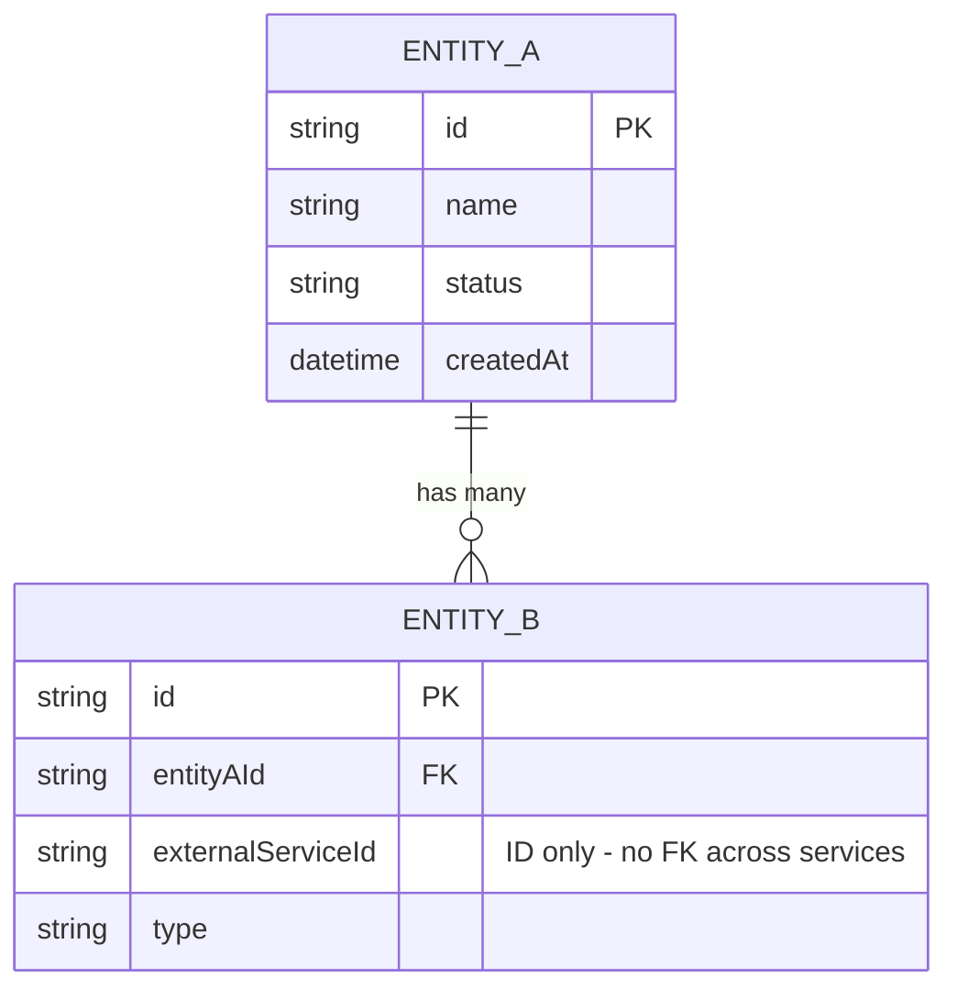

> Codex compatibility note:
>
> - Invoke repository skills with `$skill-name` in Codex; this mirrored copy rewrites legacy Claude `/skill-name` references.
> - Task tracker mandate: BEFORE executing any workflow or skill step, create/update task tracking for all steps and keep it synchronized as progress changes.
> - User-question prompts mean to ask the user directly in Codex.
> - Ignore Claude-specific mode-switch instructions when they appear.
> - Strict execution contract: when a user explicitly invokes a skill, execute that skill protocol as written.
> - Subagent authorization: when a skill is user-invoked or AI-detected and its protocol requires subagents, that skill activation authorizes use of the required `spawn_agent` subagent(s) for that task.
> - Do not skip, reorder, or merge protocol steps unless the user explicitly approves the deviation first.
> - For workflow skills, execute each listed child-skill step explicitly and report step-by-step evidence.
> - If a required step/tool cannot run in this environment, stop and ask the user before adapting.

<!-- CODEX:PROJECT-REFERENCE-LOADING:START -->

## Codex Project-Reference Loading (No Hooks)

Codex does not receive Claude hook-based doc injection.
When coding, planning, debugging, testing, or reviewing, open project docs explicitly using this routing.

**Always read:**

- `docs/project-config.json` (project-specific paths, commands, modules, and workflow/test settings)
- `docs/project-reference/docs-index-reference.md` (routes to the full `docs/project-reference/*` catalog)
- `docs/project-reference/lessons.md` (always-on guardrails and anti-patterns)

**Missing/stale context route:** If `docs/project-config.json`, the docs index, `lessons.md`, `CLAUDE.md`, `AGENTS.md`, or any task-required reference doc is missing or stale, auto-run `$project-init` or the narrow setup route (`$project-config`, `$docs-init`, `$scan-all`, `$scan --target=<key>`, `$claude-md-init`) before ordinary project-specific work. If Codex mirrors or `AGENTS.md` are missing/stale, ask the user to run `$sync-codex`; do not auto-run it.

**Situation-based docs:**

- Backend/CQRS/API/domain/entity changes: `backend-patterns-reference.md`, `domain-entities-reference.md`, `project-structure-reference.md`
- Frontend/UI/styling/design-system: `frontend-patterns-reference.md`, `scss-styling-guide.md`, `design-system/README.md`
- Spec authoring, `docs/specs/` pathing, or TC format: `feature-spec-reference.md`, `spec-system-reference.md`, `spec-principles.md`
- Behavior/public-contract changes or spec-test-code sync: `workflow-spec-test-code-cycle-reference.md` plus the spec docs above
- Derived spec indexes/ERDs/reimplementation guides: `spec-system-reference.md` and source Feature Specs under `docs/specs/`
- Integration test implementation/review: `integration-test-reference.md`
- E2E test implementation/review: `e2e-test-reference.md`
- Code review/audit work: `code-review-rules.md` plus domain docs above based on changed files

Do not read all docs blindly. Start from `docs-index-reference.md`, then open only relevant files for the task.

<!-- CODEX:PROJECT-REFERENCE-LOADING:END -->

<!-- PROMPT-ENHANCE:STEP-TASK-ANCHOR:START -->

> **[BLOCKING]** Execute skill steps in declared order. NEVER skip, reorder, or merge steps without explicit user approval.
> **[BLOCKING]** Before each step or sub-skill call, update task tracking: set `in_progress` when step starts, set `completed` when step ends.
> **[BLOCKING]** Every completed/skipped step MUST include brief evidence or explicit skip reason.
> **[BLOCKING]** If Task tools are unavailable, create and maintain an equivalent step-by-step plan tracker with the same status transitions.

<!-- PROMPT-ENHANCE:STEP-TASK-ANCHOR:END -->

## Quick Summary

**Goal:** Analyze business domain (bounded contexts, aggregates, entities, VOs, domain events, cross-context relationships) and generate a domain model report + ERD — producing a user-validated DDD domain model with correct bounded contexts, aggregate boundaries, and event flows so downstream implementation builds on the right invariants and avoids costly boundary rework after consumers depend on them.

**Workflow:**

1. **Load Business Context** — Read idea, business evaluation, refined PBI artifacts + domain-entities-reference.md
2. **Identify Bounded Contexts** — Group related concepts, define context boundaries
3. **Model Entities & Aggregates** — Define aggregates, entities, value objects per context
4. **Map Relationships** — Entity relationships, cross-context integration points
5. **Domain Events** — Identify events crossing context boundaries
6. **Generate ERD** — Mermaid ER diagram with all entities and relationships
7. **User Validation** — Present model, ask 5-8 questions, confirm decisions
8. **Domain Entity Change Assessment** — Compare against domain-entities-reference.md, update if needed

**Key Rules:**

- **MANDATORY IMPORTANT MUST ATTENTION** validate every bounded context boundary with user
- **MANDATORY IMPORTANT MUST ATTENTION** include Mermaid ERD diagram in report
- **MANDATORY IMPORTANT MUST ATTENTION** run user validation interview at end (NEVER skip)
- Every entity belongs to exactly one bounded context
- Cross-context communication via domain events only — NEVER direct references

**Be skeptical. Every claim needs traced proof, confidence percentages >80% to act.**

---

## DDD Reference: Strategic Design

### Bounded Context Rules

| Signal                                     | Action                                 |
| ------------------------------------------ | -------------------------------------- |
| Same term, different meaning across teams  | Separate bounded contexts              |
| Different data lifecycles for same concept | Separate contexts                      |
| Different invariants on same entity        | Separate contexts                      |
| Team ownership conflict (Conway's Law)     | Separate contexts                      |
| Shared DB table touched by two services    | Extract shared kernel or introduce ACL |

**Ubiquitous Language Rules:**

- Every noun in codebase matches domain expert vocabulary exactly (not "User" when the domain says "Customer")
- Class/method/variable names reflect ubiquitous language — zero translation layers inside bounded context
- Developers say "we call it X but domain means Y" → model is wrong, fix it

### Context Map Pattern Decision Table

| Situation                                              | Pattern                                |
| ------------------------------------------------------ | -------------------------------------- |
| Two teams, joint success/failure, equal power          | Partnership                            |
| Small shared code nucleus, joint governance acceptable | Shared Kernel                          |
| Downstream can influence upstream roadmap              | Customer-Supplier                      |
| Downstream has no influence on upstream                | Conformist                             |
| External/legacy system with hostile or polluting model | Anti-Corruption Layer (ACL)            |
| One upstream, many downstream consumers                | Open Host Service + Published Language |
| Integration cost exceeds integration value             | Separate Ways                          |

**ACL — when to use:** Upstream is external/legacy/third-party (Salesforce, SAP, Workday). Upstream types NEVER cross ACL into domain model.

**Shared Kernel — when NOT to use:** Teams cannot coordinate on every change → use Customer-Supplier + Published Language instead.

---

## DDD Reference: Entity vs Value Object

### Decision Matrix

| Question                                          | Entity | Value Object |
| ------------------------------------------------- | ------ | ------------ |
| Has identity beyond its attributes?               | YES    | no           |
| Can two instances with same data be distinct?     | YES    | no           |
| Has a lifecycle (created, modified, deleted)?     | YES    | no           |
| Identified by an ID in any downstream system?     | YES    | no           |
| Measured or described (quantity, address, money)? | no     | YES          |
| Replaced rather than modified on change?          | no     | YES          |
| Must be found independently of parent?            | YES    | no           |

**Fast heuristics:**

- Replace with equal-valued copy → breaks nothing? → **Value Object**
- Must be tracked across time or fetched by ID? → **Entity**
- Always retrieved as part of another object? → likely **Value Object**
- Two instances with same data are interchangeable? → **Value Object**

### Canonical Value Objects

| VO            | Attributes                          | Key Invariants                                                     |
| ------------- | ----------------------------------- | ------------------------------------------------------------------ |
| `Money`       | amount: Decimal, currency: Currency | amount ≥ 0, valid ISO currency; Add/Subtract require same currency |
| `Email`       | value: string                       | RFC 5322 format, normalized to lowercase                           |
| `Address`     | street, city, country, postalCode   | All fields non-empty; composed of Country + PostalCode VOs         |
| `DateRange`   | start: DateOnly, end: DateOnly      | start ≤ end; operations: Contains, Overlaps, Duration              |
| `PhoneNumber` | countryCode, number                 | E.164 format                                                       |
| `Percentage`  | value: int                          | 0 ≤ value ≤ 100                                                    |

### Primitive Obsession → Value Object Mapping

| Primitive Usage                          | Replace With                          |
| ---------------------------------------- | ------------------------------------- |
| `string orderId`                         | `OrderId` typed wrapper               |
| `decimal amount, string currency`        | `Money { amount, currency }`          |
| `string street, string city, string zip` | `Address { ... }`                     |
| `DateTime start, DateTime end`           | `DateRange { start, end }`            |
| `string email`                           | `Email { value }`                     |
| `int percentage`                         | `Percentage { value }`                |
| `string phoneNumber`                     | `PhoneNumber { countryCode, number }` |

**Rule:** Primitive with validation rules, formatting, or always passed grouped with other primitives → missing Value Object.

### Value Object Construction Pattern

A VO is self-validating: invariants enforced at construction via a factory (no public constructor that can produce an invalid instance), immutable, and equality-by-value. The base class and factory names below are one illustrative instantiation — translate to your language's equivalents.

**Example (illustrative — adapt to your language):**

```csharp
// Self-validating VO — never an invalid instance in memory
public sealed class Email : ValueObject<Email>
{
    private Email(string value) { Value = value; }
    public string Value { get; }

    public static Email Of(string raw)
    {
        var normalized = raw?.Trim().ToLowerInvariant();
        if (string.IsNullOrWhiteSpace(normalized) || !IsValidFormat(normalized))
            throw new DomainException($"Invalid email: {raw}");
        return new Email(normalized);
    }
}
```

**Rules:**

- No public constructor without validation — factory method (`Of()` / `Create()`) enforces invariants
- VOs can reference other VOs; VOs NEVER reference entities (lifecycle coupling)
- Mutation means replacement: `email = Email.Of(newValue)`, NEVER `email.Value = newValue`

### VO Persistence Strategies

| Strategy                | When to Use                                  | Trade-offs                               |
| ----------------------- | -------------------------------------------- | ---------------------------------------- |
| Owned types (EF Core)   | VO maps to same table as owning entity       | Simple, no FK, nullable columns possible |
| Embedded document store | VO stored as subdocument                     | Natural fit, no joins                    |
| JSON column             | Complex VO, low query frequency on VO fields | Flexible, not queryable by parts         |
| Serialized string       | Simple VOs (Email, PostalCode)               | Compact, unqueryable by parts            |

**Rule:** VOs NEVER have own table with primary key — that makes them entities by infrastructure.

---

## DDD Reference: Entity Design

### Identity Strategies

| Strategy           | When to Use                                       | Trade-offs                                |
| ------------------ | ------------------------------------------------- | ----------------------------------------- |
| **ULID** (default) | New entities in distributed system                | Sortable, URL-safe, monotonic, 128-bit    |
| **UUID v4**        | True randomness / security-sensitive IDs          | Not sortable, fragmented indexes          |
| **UUID v7**        | Sortable UUID needed                              | Time-ordered, good index locality         |
| **Natural key**    | Domain guarantees permanent uniqueness (SSN, EAN) | Unstable — domain can change              |
| **Surrogate int**  | Legacy/single-DB sequences                        | No distributed generation                 |
| **Composite key**  | Relationship/join table                           | Harder to reference from other aggregates |

**Rules:**

- Prefer ULID for new entities — sortable, no coordination overhead
- NEVER use email/username as PK — users change them
- Cross-service references use same ID type as the owning service

### Rich vs Anemic Domain Model

| Anemic (Anti-Pattern)                    | Rich (Correct)                              |
| ---------------------------------------- | ------------------------------------------- |
| Entity is data bag, logic in services    | Entity contains behavior + invariants       |
| `public set` on all properties           | Private setters, mutation via named methods |
| `OrderService.Confirm(order)`            | `order.Confirm()`                           |
| Service checks rules then mutates entity | Entity refuses invalid state transitions    |
| Logic duplicated across services         | Single authoritative location in entity     |

**Tell Don't Ask Principle:**

- BAD: `if (order.Status == Confirmed) { order.Status = OnHold; }` (external ask + mutate)
- GOOD: `order.Hold(reason)` (entity enforces its own invariants)

### Entity Invariant Enforcement

A rich entity guards its own state: a private constructor reserved for ORM/persistence hydration, named factory methods for valid creation, and intent-named mutation methods that reject invalid transitions and emit domain events. The base class, guard helper, and ID generator below are one illustrative instantiation — substitute your language's equivalents.

**Example (illustrative — adapt to your language):**

```csharp
public class Order : AuditedAggregateRoot<Order, string>
{
    private Order() { }  // ORM hydration only

    public static Order Create(string name, Email email, WarehouseId warehouseId)
    {
        Guard.NotNullOrWhitespace(name, nameof(name));
        Guard.NotNull(email, nameof(email));
        return new Order
        {
            Id = Ulid.NewUlid().ToString(),
            Name = name,
            Email = email,
            WarehouseId = warehouseId,
            Status = OrderStatus.Confirmed
        };
    }

    public void Cancel(string reason, DateOnly cancellationDate)
    {
        if (Status == OrderStatus.Cancelled)
            throw new DomainException("Order already cancelled");
        if (cancellationDate < DateOnly.FromDateTime(DateTime.UtcNow))
            throw new DomainException("Cancellation date cannot be in the past");

        Status = OrderStatus.Cancelled;
        CancellationReason = reason;
        CancellationDate = cancellationDate;
        AddDomainEvent(new OrderCancelledDomainEvent(Id, cancellationDate));
    }
}
```

### Entity Lifecycle State Machines

Document ALL transitions explicitly. Unmodeled transitions throw `DomainException`.

```
Draft → Submitted (Submit())
Submitted → Approved (Approve(approverId))
Submitted → Rejected (Reject(reason))
Approved → Active (Activate())
Active → Suspended (Suspend(reason))
Suspended → Active (Reinstate())
Active → Archived (Archive())
```

| Pattern                          | When to Use                                              |
| -------------------------------- | -------------------------------------------------------- |
| Status enum + transition methods | Simple linear/branching lifecycles (most cases)          |
| State pattern (class per state)  | Complex per-state behavior, many states                  |
| Event sourcing                   | Full audit trail + point-in-time reconstruction required |

### Domain Validation Layers

| Layer                   | What It Validates                               | Failure Signal (per stack)                                                       |
| ----------------------- | ----------------------------------------------- | -------------------------------------------------------------------------------- |
| **Value Object**        | Single-value format/range invariants            | Construction failure (raised error or result type)                               |
| **Entity method**       | Aggregate consistency rules, state transitions  | Domain rule violation (e.g. `DomainException`)                                   |
| **Application service** | Cross-aggregate rules, authorization, existence | Structured validation result (e.g. `ValidationResult` / problem-details payload) |
| **Infrastructure**      | DB constraints (last resort, NEVER first line)  | Persistence-layer error (last-resort constraint)                                 |

**Decision rule:**

- Rule requires loading another aggregate? → Application service
- Rule needs only data within aggregate? → Entity method
- Rule concerns single value's format? → Value Object constructor

### Factory Methods on Entities

Use when: construction requires domain logic, multiple paths, raises domain events, or object graph initialization.

**Naming:**

- `Order.Create(...)` — primary creation
- `Order.Place(...)` — semantically loaded creation (domain language)
- Private constructor — ORM hydration only, NEVER called directly

### Temporal (Bi-Temporal) Entities

Two time axes: **valid time** (fact true in real world) + **transaction time** (recorded in system).

```
ProductPrice {
    validFrom: DateOnly     // valid time: price effective from
    validTo: DateOnly       // valid time: price effective until
    recordedAt: DateTime    // transaction time: when entered into system
}
```

Use when: regulatory compliance, retroactive corrections, "as-of" queries.

---

## DDD Reference: Aggregate Design

### Aggregate Boundary Rules

1. **Invariant scope** — boundary = objects needed to enforce invariants atomically
2. **Transaction boundary** — exactly one database transaction per aggregate operation
3. **Consistency scope** — must be consistent atomically? same aggregate. Eventual consistency acceptable? separate aggregates
4. **Small aggregates preferred** — fewer members = fewer transaction conflicts = better scalability

### Aggregate Size Heuristics

| Heuristic                  | Guideline                                                            |
| -------------------------- | -------------------------------------------------------------------- |
| Default                    | Start with single-entity aggregate unless invariant demands more     |
| Add member                 | Only when invariant requires atomic consistency across root + member |
| Max size                   | > 5 entities → redesign; likely missing sub-aggregates               |
| Concurrent writes conflict | Reduce aggregate size                                                |

### Aggregate Root Responsibilities

1. Maintain all invariants across all members
2. All mutation paths go through root (child entities NEVER directly accessible from outside)
3. Emit domain events for significant state changes
4. Control creation of child entities (factory methods on root)
5. Assign IDs to child entities

**Rule:** Outside code NEVER holds direct reference to non-root entity within aggregate.

### Cross-Aggregate References

| Rule                                      | Detail                                                            |
| ----------------------------------------- | ----------------------------------------------------------------- |
| Reference by ID only                      | NEVER `order.Customer.Name` — load separately                     |
| No FK object navigation                   | `CustomerId` field, NEVER `Customer Customer` navigation property |
| Cross-aggregate transactions are eventual | Need them in same transaction → boundaries are wrong              |
| Deletion cascade                          | Domain event → handler → compensating action in other aggregate   |

### Aggregate Invariant Enforcement

All mutation flows through the aggregate root, which checks every invariant before applying a change and recomputes derived state so no member can be left inconsistent. The throw-on-violation idiom below is one illustrative instantiation — your language may surface invariant breaches differently (exceptions, result types).

**Example (illustrative — adapt to your language):**

```csharp
public void AddLineItem(ProductId productId, int quantity, Money unitPrice)
{
    if (Status != OrderStatus.Draft)
        throw new DomainException("Cannot modify confirmed order");
    if (LineItems.Count >= 50)
        throw new DomainException("Order cannot exceed 50 line items");

    var item = OrderLineItem.Create(productId, quantity, unitPrice);
    _lineItems.Add(item);
    RecalculateTotal();  // invariant: Total == sum(lineItems)
}
```

### Aggregate Design Patterns

| Pattern                 | When to Use                                                  |
| ----------------------- | ------------------------------------------------------------ |
| Single-entity aggregate | Default — most entities are their own aggregate              |
| Nested aggregate        | Invariant requires atomic consistency across root + children |
| Aggregate with VOs      | Root + embedded value objects (no IDs, no own table)         |

### When to Break Aggregate Rules (Pragmatic DDD)

| Situation                          | Acceptable Pragmatism                                            |
| ---------------------------------- | ---------------------------------------------------------------- |
| ORM limitation (EF owned entities) | Allow private owned collections even if not strictly necessary   |
| Performance — 1-query load         | Embed child data as VO/owned type rather than separate aggregate |
| Legacy schema migration            | Accept cross-aggregate FK temporarily, document as debt          |

**Rule:** Breaking aggregate rules acceptable ONLY when explicitly documented as technical debt with mitigation plan.

---

## DDD Reference: ERD Design

### Cardinality Types

| Cardinality | Mermaid    | When to Use                                                    |
| ----------- | ---------- | -------------------------------------------------------------- |
| 1:1         | `\|o--o\|` | Same-table extension, optional sub-type, shared lifecycle      |
| 1:N         | `\|o--{`   | Parent-child, one entity owns many dependent records           |
| M:N         | `}o--o{`   | Peer relationship; ALWAYS use explicit join/association entity |

**M:N rule:** Relationship has attributes (date joined, role) → make join table explicit named entity.

**1:1 decision:** Same concept with optional attributes → same table. Different concepts with independent lifecycles → separate tables with FK.

### Normalization Targets

| Normal Form  | Rule                                   | Use For                        |
| ------------ | -------------------------------------- | ------------------------------ |
| 1NF          | Atomic values, no repeating groups     | Always — baseline              |
| 2NF          | No partial dependency on composite key | Composite PKs only             |
| 3NF          | No transitive dependencies             | OLTP — standard target         |
| BCNF         | Every determinant is a candidate key   | When 3NF still has anomalies   |
| Denormalized | Intentional redundancy                 | Read models, projections, OLAP |

**Rule:** 3NF for OLTP write models; denormalize only in read models/projections with documented justification.

### Identifying vs Non-Identifying Relationships

| Type            | FK in Child PK?            | Child Existence                                             |
| --------------- | -------------------------- | ----------------------------------------------------------- |
| Identifying     | YES (FK is part of PK)     | Child cannot exist without parent (line item without order) |
| Non-identifying | NO (FK is separate column) | Child can exist independently (order without warehouse)     |

**Mapping to DDD:** Identifying relationship → child entity inside parent aggregate. Non-identifying FK → likely separate aggregates.

### ERD for Microservices

- Each bounded context has its OWN ERD — NEVER cross-service entity arrows
- Cross-service references shown as `ExternalEntityId (string/ULID)` — ID only, no relationship line
- Shared data shown as replicated/synced data note, NEVER shared table
- Event-sourced aggregates: ERD shows current state projection, not event stream

### ERD Anti-Patterns

| Anti-Pattern                      | Problem                                | Fix                                                |
| --------------------------------- | -------------------------------------- | -------------------------------------------------- |
| God table (50+ columns)           | Every feature adds more columns        | Extract sub-entities, decompose by bounded context |
| Cross-service FK                  | Direct FK across microservice schemas  | Replicate needed data, use events to sync          |
| Polymorphic association           | `entityType + entityId` columns        | Separate tables per concrete type or JSON column   |
| EAV (Entity-Attribute-Value)      | Key-value rows replacing typed columns | JSON column or explicit schema with migration      |
| Implicit M:N (two FK cols, no PK) | Hard to add relationship attributes    | Explicit join table with surrogate PK              |
| Nullable FK everywhere            | Unclear cardinality                    | Separate optional relationship into explicit table |

### ERD to Aggregate Mapping

| ERD Pattern                                | DDD Mapping                                          |
| ------------------------------------------ | ---------------------------------------------------- |
| Parent-child with identifying relationship | Child entity inside parent aggregate                 |
| Parent-child with non-identifying FK       | Likely separate aggregates (independent lifecycle)   |
| M:N join table with no extra attributes    | Both sides separate aggregates, IDs in domain events |
| M:N join table with attributes             | Association entity as separate aggregate             |
| Strong entity + many weak dependents       | Root entity + owned collection aggregate             |

---

## DDD Reference: Domain Events

### Event Naming Conventions

**Format:** `{AggregateNoun}{PastTenseVerb}` — what happened, not what to do.

| Good                | Bad                                |
| ------------------- | ---------------------------------- |
| `OrderCancelled`    | `CancelOrder` (command naming)     |
| `OrderConfirmed`    | `OrderStatusChanged` (too generic) |
| `PaymentProcessed`  | `PaymentComplete` (not past tense) |
| `SalaryBandUpdated` | `SalaryChanged` (vague)            |

### Event Payload Design Rules

| Decision               | Rule                                                                                   |
| ---------------------- | -------------------------------------------------------------------------------------- |
| Minimal vs fat         | **Minimal (default):** AggregateId + what changed. Consumer queries for rest if needed |
| Fat event              | Accept when: round-trip cost high AND consumers known AND staleness acceptable         |
| Required fields always | `AggregateId`, `OccurredOn` (UTC timestamp), `Version`, `CorrelationId`                |
| No mutable references  | Payload contains value copies, not object references                                   |

### Domain Events vs Integration Events

| Dimension        | Domain Event               | Integration Event                           |
| ---------------- | -------------------------- | ------------------------------------------- |
| Scope            | Within one bounded context | Across bounded contexts                     |
| Delivery         | In-process, post-commit    | Via configured message bus or event stream  |
| Schema ownership | Domain owns, internal      | Published Language contract                 |
| Versioning       | Internal refactor freely   | Versioned, backward-compatible              |
| Failure handling | Transaction rollback       | At-least-once delivery, idempotent consumer |

**Rule:** Domain event raised → in-process handlers fire → if cross-service needed, handler publishes integration event to message bus.

### Event Versioning Strategies

| Strategy          | Mechanism                                      | Trade-offs                              |
| ----------------- | ---------------------------------------------- | --------------------------------------- |
| Additive only     | NEVER remove/rename fields, only add           | Simple, payload bloats over time        |
| Multiple versions | `OrderConfirmedV1`, `OrderConfirmedV2`         | Clear versioning, consumers handle both |
| Upcasting         | Transform old events to new on deserialization | Transparent to consumers, complex infra |

**Backward compatibility rules:**

- Adding optional field → backward compatible
- Removing or renaming field → breaking
- Changing field type → breaking

---

## DDD Reference: Repository Pattern

### Interface Design Principles

1. One repository per aggregate root — NEVER one for child entities
2. Domain language in methods — `GetConfirmedOrdersInWarehouse()` not `FindAll(e => e.Status == Active)`
3. Return domain objects — repositories return entities, not DTOs
4. No infrastructure concerns — no leaked query/ORM types or connection strings in the interface.
5. Async-first — methods return the configured runtime's async primitive.

### Repository vs DAO

| Repository                       | DAO                                 |
| -------------------------------- | ----------------------------------- |
| Domain-oriented interface        | Data-oriented interface             |
| Returns entities/VOs             | Returns DTOs or raw data            |
| Used in application/domain layer | Used in infrastructure layer        |
| Hides persistence mechanism      | Often tied to persistence mechanism |

### Query Objects — When to Use Specification

Use when: rule used in multiple places, warrants naming + testing, needs composition.

A specification names a query predicate as a reusable, composable, testable unit owned by the domain. The expression-tree form below is one illustrative instantiation — your language may model it as a predicate function, query builder, or specification object.

**Example (illustrative — adapt to your language):**

```csharp
// Static expression on entity — composable, testable
public static Expression<Func<Order, bool>> ByWarehouseExpression(string warehouseId)
    => o => o.WarehouseId == warehouseId && o.Status == OrderStatus.Confirmed;
```

**When NOT to use Specification:** Simple single-use predicate → inline lambda. Rule only used once → repository method directly.

---

## DDD Reference: Anti-Patterns Quick Reference

| Anti-Pattern                | Detection Signal                                                   | Fix                                        |
| --------------------------- | ------------------------------------------------------------------ | ------------------------------------------ |
| **Anemic domain model**     | Services have entity-specific logic; entity has all public setters | Move logic to entity                       |
| **God aggregate**           | Aggregate > 5 entities or 100+ ms load time                        | Extract sub-aggregates                     |
| **Leaky aggregate**         | External code mutates child entities directly                      | Private setters + root mutation methods    |
| **Primitive obsession**     | 3+ primitives always travel together as group                      | Introduce Value Object                     |
| **Implicit concept**        | Domain expert names it, code doesn't model it                      | Explicit class                             |
| **Feature envy**            | Method uses more of B's data than A's                              | Move method to B                           |
| **Getter/setter entity**    | All mutation via property assignment, no intent-named methods      | Replace with `Cancel()`, `Approve()`, etc. |
| **Cross-aggregate loading** | Full aggregate loaded just to read one field                       | Pass scalar; resolve in app service        |
| **Side effects in handler** | Command handler calls multiple services after save                 | Domain event + separate handlers           |
| **Cross-service FK**        | Database FK across microservice schemas                            | ID reference + event-driven sync           |
| **Shared Kernel overuse**   | Two teams, one shared model, constant coordination overhead        | Split to Customer-Supplier                 |
| **Missing ACL**             | External model types bleed into domain classes                     | ACL at integration boundary                |

---

## Skill Workflow

### Step 0: Locate Active Plan & Domain Reference (MANDATORY)

1. Glob `plans/*/plan.md` sorted by modification time — find active plan directory
2. Read `plan.md` — project scope, goals, prior decisions
3. Read all `{plan-dir}/research/*.md` — avoid duplicating prior work
4. Read `docs/project-reference/domain-entities-reference.md` (if exists) — project's single source of truth for domain entities (read directly when relevant; do not rely on hook-injected conversation text)
5. Set `{plan-dir}` variable — all outputs write to this directory

If no plan directory, create using naming convention from session context.

**MUST ATTENTION update `{plan-dir}/plan.md`** with domain model summary section after completing analysis.

### Step 1: Load Business Context

Read artifacts from prior workflow steps (search `plans/` + `team-artifacts/`):

- Active plan (`{plan-dir}/plan.md`) — scope, goals, constraints
- Business evaluation report — value proposition, customer segments
- Refined PBI — acceptance criteria, user stories, features
- Discovery interview notes — problem statement, user roles

Extract and list:

- **Nouns** — Candidate entities (user, order, product, etc.)
- **Verbs** — Candidate domain events (created, approved, assigned, etc.)
- **Roles** — User types with different permissions/views
- **Processes** — Business workflows (application flow, review cycle, etc.)

### Step 2: Identify Bounded Contexts

Group related entities using DDD principles. Apply context boundary signals from reference table above.

```markdown
### Bounded Context: {Name}

**Purpose:** {What this context owns — one sentence}
**Classification:** Core domain / Supporting / Generic
**Key Responsibility:** {primary business capability}
**Team ownership:** {suggested team or role}
**Ubiquitous language:** {key terms and their meaning in this context}
```

**Context boundary tests:**

- Same term used by two teams with different meanings? → separate contexts
- Two entities with same name but different invariants? → separate contexts
- Can this context be worked on without understanding the other? → good separation

**MANDATORY IMPORTANT MUST ATTENTION** present identified contexts to user via a direct user question:

- "I identified {N} bounded contexts: {list}. Does this grouping make sense?"
- Options: Agree (Recommended) | Merge {X} and {Y} | Split {Z} | Add missing context

### Step 3: Model Entities & Aggregates

Per bounded context: classify each concept using Entity vs VO matrix above, then apply aggregate boundary rules.

```markdown
### {Context Name}

**Aggregate Root:** {EntityName}
**Identity:** {ULID / UUID / Natural key — justify}
**Lifecycle states:** {Draft → Active → Archived, etc.}

- **Child Entities:** {list — share aggregate boundary, identifying FK}
- **Value Objects:** {list — immutable, no identity, embedded}
- **Invariants:** {business rules this aggregate enforces atomically}
- **Factory method:** {Order.Create(...) / Order.Place(...)}

**Other Aggregates in this Context:**

- {Entity} — {purpose, identity strategy, lifecycle}
```

### Entity Detail Template

| Entity | Classification                         | Identity                | Key Fields | Lifecycle States | Invariants       |
| ------ | -------------------------------------- | ----------------------- | ---------- | ---------------- | ---------------- |
| {Name} | Aggregate Root / Entity / Value Object | ULID / UUID / Composite | {fields}   | {states}         | {business rules} |

**VO Composition — MUST ATTENTION verify:**

- 3+ primitives always travel together? → extract VO
- String field has format rules? → extract VO (Email, PhoneNumber)
- Numeric field has range rules? → extract VO (Percentage, Money)
- Concept named by domain experts but not modeled? → make explicit class

**Aggregate Boundary — MUST ATTENTION verify:**

- All entities in aggregate enforced in one transaction?
- Cross-aggregate references use ID only (no navigation properties)?
- Aggregate root is sole entry point for ALL mutations?
- Aggregate ≤ 5 entities? If not — justify or decompose

### Step 4: Map Relationships

#### Intra-Context Relationships

```markdown
| From  | To      | Type | Cardinality   | Relationship Kind       | Description             |
| ----- | ------- | ---- | ------------- | ----------------------- | ----------------------- |
| Order | Product | M:N  | via OrderLine | Non-identifying (assoc) | Orders contain products |
```

Apply identifying vs non-identifying rule:

- Identifying relationship (child FK is part of PK) → child entity inside parent aggregate
- Non-identifying FK → likely separate aggregates

#### Cross-Context Integration (Context Map)

```markdown
| Upstream Context | Downstream Context | Pattern | Integration Point  | Sync Mechanism |
| ---------------- | ------------------ | ------- | ------------------ | -------------- |
| Sales            | Order              | ACL     | Cart becomes Order | Domain event   |
```

Integration patterns to apply (see context map reference table above):

- **Anti-Corruption Layer** — external/hostile upstream model
- **Customer-Supplier** — downstream can negotiate with upstream
- **Open Host Service** — one upstream, many consumers
- **Conformist** — no negotiating power with upstream

### Step 5: Domain Events

Identify events crossing bounded context boundaries. Apply naming: `{AggregateNoun}{PastTenseVerb}`.

| Event         | Source Context | Target Context(s)  | Payload (minimal)             | Trigger            |
| ------------- | -------------- | ------------------ | ----------------------------- | ------------------ |
| `OrderPlaced` | Sales          | Order, Fulfillment | cartId, productId, placedDate | Checkout completed |

**Event design — MUST ATTENTION verify:**

- Name is past tense + includes aggregate noun?
- Payload includes AggregateId, OccurredOn (UTC), Version?
- Payload minimal — just what changed + correlation IDs?
- Version field included for schema evolution?
- Domain event vs integration event clearly classified?

### Step 6: Generate ERD

Produce Mermaid ER diagram. Apply ERD-to-Aggregate mapping + anti-patterns from reference above.

````markdown

````

**ERD requirements:**

- Group entities by bounded context (use Mermaid comments `%% Context: ...`)
- Show PK/FK fields and key business fields (not all fields)
- Show cardinality (1:1, 1:N, M:N) using Crow's Foot notation
- Cross-service references: string/ULID field with comment, no relationship line
- Identify association entities for M:N relationships

**ERD — MUST ATTENTION verify before finalizing:**

- No God tables (>20 columns — consider decomposing)?
- No cross-service FK arrows?
- All M:N through explicit named join entity?
- No nullable FK everywhere (clarify optional relationships)?

### Step 7: User Validation Interview

**MANDATORY IMPORTANT MUST ATTENTION** present domain model and ask 5-8 questions via a direct user question:

#### Required Questions

1. **Context boundaries** — "Are these {N} bounded contexts correct? Any missing or misplaced?"
    - Options: Correct (Recommended) | Need changes | Not sure, explain more
2. **Aggregate roots** — "Is {Entity} the right aggregate root for {Context}? It controls {child entities}."
3. **Entity vs VO** — "I modeled {concept} as a Value Object because it has no independent identity. Does that match the business model?"
4. **Relationship verification** — "The {Entity A} to {Entity B} relationship is {type/cardinality}. Is that correct?"
5. **Missing entities** — "Are there business concepts — workflows, roles, rules — I haven't captured as explicit domain objects?"
6. **Event verification** — "When {event} happens, should {contexts} be notified? What data do they need?"

#### Deep-Dive Questions (pick 2-3 based on complexity)

- "Should {Entity} be a separate aggregate or part of {Aggregate}? [separating = eventual consistency between them]"
- "Is {field} really a Value Object or does it need its own identity and lifecycle?"
- "How does {process} work step-by-step? What state transitions are involved?"
- "What happens when {edge case}? Which invariant prevents the bad state?"
- "Which entities change most frequently under concurrent load? (impacts aggregate design)"
- "Any concepts domain experts name that I haven't modeled explicitly?"

After user confirms, update report with final decisions and mark as `status: confirmed`.

### Step 8: Domain Entity Change Assessment (MANDATORY)

**MANDATORY IMPORTANT MUST ATTENTION** compare domain analysis results against `docs/project-reference/domain-entities-reference.md` (if exists):

1. **Identify new entities** — in analysis but not in reference doc
2. **Identify modified entities** — changed fields, relationships, or bounded context assignment
3. **Identify deprecated entities** — in reference doc but no longer needed by feature
4. **Present changes to user** via a direct user question:
    - "Domain entity changes detected: {N} new, {N} modified, {N} deprecated. Proceed with updating domain-entities-reference.md?"
    - Options: Approve all (Recommended) | Review each change | Skip update

If `docs/project-reference/domain-entities-reference.md` does NOT exist, ask user:

- "No domain-entities-reference.md found. Create it with all entities from this analysis?"
- Options: Yes, create it (Recommended) | No, skip

**After user confirms:** update/create `docs/project-reference/domain-entities-reference.md` following existing format. Append new entities to appropriate bounded context section. Update field lists + relationships for modified entities.

### Step 9: Update Main Plan (MANDATORY)

Read `{plan-dir}/plan.md`, append/update `## Domain Model` section:

```markdown
## Domain Model

- **Bounded Contexts:** {N} — {list names with context map patterns between them}
- **Total Entities:** {N} ({N} aggregates, {N} child entities, {N} value objects)
- **Domain Events:** {N} cross-context events
- **Key Aggregates:** {list with invariant summaries}
- **Key Relationships:** {summary of critical relationships}
- **ERD:** See `phase-01-domain-model.md`
- **Full Analysis:** See `research/domain-analysis.md`
```

---

## Output

```
{plan-dir}/research/domain-analysis.md          # Full domain analysis report
{plan-dir}/phase-01-domain-model.md             # Confirmed domain model with ERD
{plan-dir}/plan.md                              # Updated with domain model summary
docs/project-reference/domain-entities-reference.md  # Updated/created with new/modified entities
```

Report structure:

1. Executive summary (bounded contexts + entity count + key decisions)
2. Context map (bounded contexts with integration patterns)
3. Per-context entity/aggregate detail with identity strategy and invariants
4. Relationship tables (intra + cross-context, identifying vs non-identifying)
5. Value Objects catalog (VO type, attributes, invariants)
6. Domain events catalog (with payload design)
7. Mermaid ERD diagram
8. Anti-pattern warnings (any detected issues in model)
9. Unresolved questions

Report must be **≤250 lines**. Use tables over prose.

---

**MANDATORY IMPORTANT MUST ATTENTION** break work into small todo tasks using task tracking BEFORE starting.
**MANDATORY IMPORTANT MUST ATTENTION** validate EVERY bounded context and key relationship with user via a direct user question.
**MANDATORY IMPORTANT MUST ATTENTION** include Mermaid ERD and confidence % for all architectural decisions.
**MANDATORY IMPORTANT MUST ATTENTION** add a final review todo task to verify work quality.

---

## Next Steps

**MANDATORY IMPORTANT MUST ATTENTION — NO EXCEPTIONS** after completing this skill, use a direct user question to present these options:

- **"$review-domain-entities (Recommended)"** — Review DDD quality of entities modeled/modified in this analysis (anemic model, VO classification, invariant enforcement, aggregate boundaries)
- **"$tech-stack-research"** — Research tech stack based on domain model
- **"$plan"** — If tech stack already decided and entity quality already reviewed
- **"Skip, continue manually"** — user decides

### Council escalation (always-offer, second prompt)

After the existing `## Next Steps` prompt above resolves, present a **second**, independent a direct user question call (do NOT merge into the first):

- **"Skip council — proceed with model (Recommended)"** — Continue with the bounded contexts / aggregate boundaries as drawn. Recommended default.
- **"Escalate to $llm-council"** — Run 11 sub-agent council (5 advisors + 5 reviewers + chairman). Best applied when bounded-context splits or aggregate boundaries are contested (multiple defensible cuts), the model touches >=3 services, or invariants span aggregates. DDD boundary decisions are hard to reverse once consumers depend on them. Cheaper alternatives: `$why-review`, `$plan-validate` (run these first if you haven't).

---

**MANDATORY IMPORTANT MUST ATTENTION** use task tracking to break ALL work into small tasks BEFORE starting.
**MANDATORY IMPORTANT MUST ATTENTION** use a direct user question at EVERY decision point — validate every bounded context and entity relationship with user.
**MANDATORY IMPORTANT MUST ATTENTION** produce ERD diagram (Mermaid) and domain model report with confidence %.

> **External Memory:** For complex or lengthy work (research, analysis, scan, review), write intermediate findings and final results to a report file in `plans/reports/` — prevents context loss and serves as deliverable.

> **Evidence Gate:** MANDATORY IMPORTANT MUST ATTENTION — every claim, finding, and recommendation requires `file:line` proof or traced evidence with confidence percentage (>80% to act, <80% must verify first).

---

<!-- SYNC:ai-mistake-prevention -->

> **AI Mistake Prevention** — Failure modes to avoid on every task:
>
> **Check downstream references before deleting.** Deleting components causes documentation and code staleness cascades. Map all referencing files before removal.
> **Verify AI-generated content against actual code.** AI hallucinates APIs, class names, and method signatures. Always grep to confirm existence before documenting or referencing.
> **Trace full dependency chain after edits.** Changing a definition misses downstream variables and consumers derived from it. Always trace the full chain.
> **Trace ALL code paths when verifying correctness.** Confirming code exists is not confirming it executes. Always trace early exits, error branches, and conditional skips — not just happy path.
> **When debugging, ask "whose responsibility?" before fixing.** Trace whether bug is in caller (wrong data) or callee (wrong handling). Fix at responsible layer — never patch symptom site.
> **Assume existing values are intentional — ask WHY before changing.** Before changing any constant, limit, flag, or pattern: read comments, check git blame, examine surrounding code.
> **Verify ALL affected outputs, not just the first.** Changes touching multiple stacks require verifying EVERY output. One green check is not all green checks.
> **Holistic-first debugging — resist nearest-attention trap.** When investigating any failure, list EVERY precondition first (config, env vars, DB names, endpoints, DI registrations, data preconditions), then verify each against evidence before forming any code-layer hypothesis.
> **Surgical changes — apply the diff test.** Bug fix: every changed line must trace directly to the bug. Don't restyle or improve adjacent code. Enhancement task: implement improvements AND announce them explicitly.
> **Surface ambiguity before coding — don't pick silently.** If request has multiple interpretations, present each with effort estimate and ask. Never assume all-records, file-based, or more complex path.
> **Keep domain concepts out of generic/shared/infrastructure layers.** A reusable layer (shared library, framework, infra module) must reference NO consumer-specific domain concept — tenant/customer/product IDs, business entities, feature rules. The leak compiles and runs, so it passes review silently while coupling the "reusable" layer to one consumer. Push domain fields/logic down into the consumer via subclass or composition.

<!-- /SYNC:ai-mistake-prevention -->

<!-- SYNC:critical-thinking-mindset -->

> **Critical Thinking Mindset** — Apply critical thinking, sequential thinking. Every claim needs traced proof, confidence >80% to act.
> **Anti-hallucination:** Never present guess as fact — cite sources for every claim, admit uncertainty freely, self-check output for errors, cross-reference independently, stay skeptical of own confidence — certainty without evidence root of all hallucination.

<!-- /SYNC:critical-thinking-mindset -->

<!-- SYNC:critical-thinking-mindset:reminder -->

**MUST ATTENTION** apply critical thinking — every claim needs traced proof, confidence >80% to act. Anti-hallucination: never present guess as fact.

<!-- /SYNC:critical-thinking-mindset:reminder -->

<!-- SYNC:ai-mistake-prevention:reminder -->

**MUST ATTENTION** apply AI mistake prevention — holistic-first debugging, fix at responsible layer, surface ambiguity before coding, re-read files after compaction.

<!-- /SYNC:ai-mistake-prevention:reminder -->

<!-- PROMPT-ENHANCE:STEP-TASK-CLOSING:START -->

## Prompt-Enhance Closing Anchors

**IMPORTANT MUST ATTENTION** follow declared step order for this skill; NEVER skip, reorder, or merge steps without explicit user approval
**IMPORTANT MUST ATTENTION** for every step/sub-skill call: set `in_progress` before execution, set `completed` after execution
**IMPORTANT MUST ATTENTION** every skipped step MUST include explicit reason; every completed step MUST include concise evidence
**IMPORTANT MUST ATTENTION** if Task tools unavailable, maintain an equivalent step-by-step plan tracker with synchronized statuses

<!-- PROMPT-ENHANCE:STEP-TASK-CLOSING:END -->

## Closing Reminders

**IMPORTANT MUST ATTENTION Goal:** Produce a user-validated DDD domain model — correct bounded contexts, aggregate boundaries, and event flows — so downstream implementation builds on the right invariants and avoids costly boundary rework after consumers depend on them.
**MUST ATTENTION** task tracking ALL tasks BEFORE starting — never begin without task breakdown
**MUST ATTENTION** validate EVERY bounded context + key relationship with user via a direct user question — never auto-decide
**MUST ATTENTION** domain events ALWAYS follow `{AggregateNoun}{PastTenseVerb}` naming — NEVER command-style
**MUST ATTENTION** NEVER have cross-service FK in ERD — ID reference + event-driven sync only
**MUST ATTENTION** entity vs VO classification: replace with equal-valued copy breaks nothing? → VO. Else → Entity
**MUST ATTENTION** add final review task to verify work quality

**[TASK-PLANNING]** Before acting, analyze task scope and systematically break it into small todo tasks and sub-tasks using task tracking.

> **[IMPORTANT]** Analyze how big the task is and break it into many small todo tasks systematically before starting — this is very important.

<!-- CODEX:SYNC-PROMPT-PROTOCOLS:START -->

## Hookless Prompt Protocol Mirror (Auto-Synced)

Source: `.claude/hooks/lib/prompt-injections.cjs` + `.claude/.ck.json`

## [WORKFLOW-EXECUTION-PROTOCOL] [BLOCKING] Workflow Execution Protocol — MANDATORY IMPORTANT MUST CRITICAL. Do not skip for any reason.

**Generic portability boundary:** Reusable skills and protocol text stay project-neutral; project-specific conventions are discovered from docs/project-config.json and docs/project-reference/. Apply shared AI-SDD from `shared/sdd-artifact-contract.md`. Read `docs/project-config.json` and `docs/project-reference/docs-index-reference.md`, then open the project reference docs named there. For spec, test-case, behavior-change, public-contract, or `docs/specs/` work, route through the local spec docs named by the docs index: `feature-spec-reference.md`, `spec-system-reference.md`, `spec-principles.md`, and `workflow-spec-test-code-cycle-reference.md` when specs/tests/code must stay synchronized. If either file or a required reference doc is missing or stale, auto-run `$project-init` (or the narrow lower-level route such as `$project-config`, `$docs-init`, `$scan-all`, or `$scan --target=<key>`) before ordinary project-specific work. Any supported AI tool may execute when this shared context and local docs are available.

1. **DETECT:** If the prompt starts with an explicit slash skill/workflow command, execute it directly. Otherwise match the prompt against the workflow catalog and skill list.
2. **ANALYZE:** Choose the best option: execute directly, invoke a skill, activate a standard workflow, or compose a custom step combination.
3. **AUTO-SELECT:** Pick the best option yourself. Do not ask the user to choose between direct execution, skill, standard workflow, or custom workflow.
4. **ACTIVATE:** For a selected workflow, call `$start-workflow <workflowId>`; for a selected skill, invoke that skill; for a custom workflow, sequence custom steps directly; for direct execution, proceed with the task.
5. **CREATE TASKS:** task tracking for ALL workflow/skill/custom steps before execution when the selected path has multiple steps.
6. **EXECUTE:** Advance per the **Workflow Step Advancement & Parallel Phases** rule in your context instructions — model-driven; a sub-agent completion advances a step identically to an inline call; a parallel-phase group is an all-return barrier (advance only after ALL members return, never serialize it)
   **[CRITICAL-THINKING-MINDSET]** Apply critical thinking, sequential thinking. Every claim needs traced proof, confidence >80% to act.
   **Anti-hallucination principle:** Never present guess as fact — cite sources for every claim, admit uncertainty freely, self-check output for errors, cross-reference independently, stay skeptical of own confidence — certainty without evidence root of all hallucination.
   **AI Attention principle (Primacy-Recency):** Put the 3 most critical rules at both top and bottom of long prompts/protocols so instruction adherence survives long context windows.
   **Goal-driven execution:** Define success criteria first, loop until verified, and stop only when observable checks pass.
   **Tests verify intent:** Tests must protect business rules/invariants and fail when the protected intent breaks, not only mirror current behavior.

## [LESSON-LEARNED-REMINDER] [BLOCKING] Task Planning & Continuous Improvement — MANDATORY. Do not skip.

Break work into small tasks (task tracking) before starting. Add final task: "Analyze AI mistakes & lessons learned".

**Extract lessons — ROOT CAUSE ONLY, not symptom fixes:**

1. Name the FAILURE MODE (reasoning/assumption failure), not symptom — "assumed API existed without reading source" not "used wrong enum value".
2. Generality test: does this failure mode apply to ≥3 contexts/codebases? If not, abstract one level up.
3. Write as a universal rule — strip project-specific names/paths/classes. Useful on any codebase.
4. Consolidate: multiple mistakes sharing one failure mode → ONE lesson.
5. **Recurrence gate:** "Would this recur in future session WITHOUT this reminder?" — No → skip `$learn`.
6. **Auto-fix gate:** "Could `$code-review`/`$code-simplifier`/`$security-review`/`$lint` catch this?" — Yes → improve review skill instead.
7. BOTH gates pass → ask user to run `$learn`.
   **[TASK-PLANNING] [MANDATORY]** BEFORE executing any workflow or skill step, create/update task tracking for all planned steps, then keep it synchronized as each step starts/completes.

<!-- CODEX:SYNC-PROMPT-PROTOCOLS:END -->
