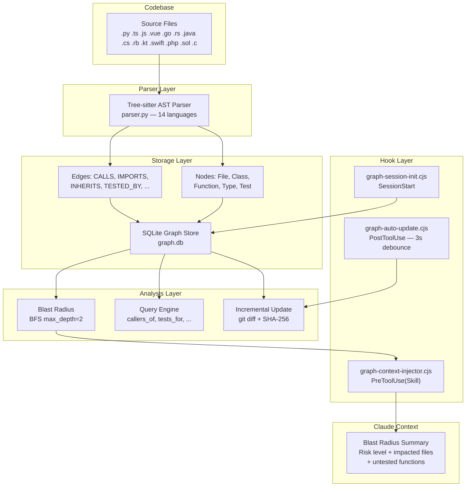
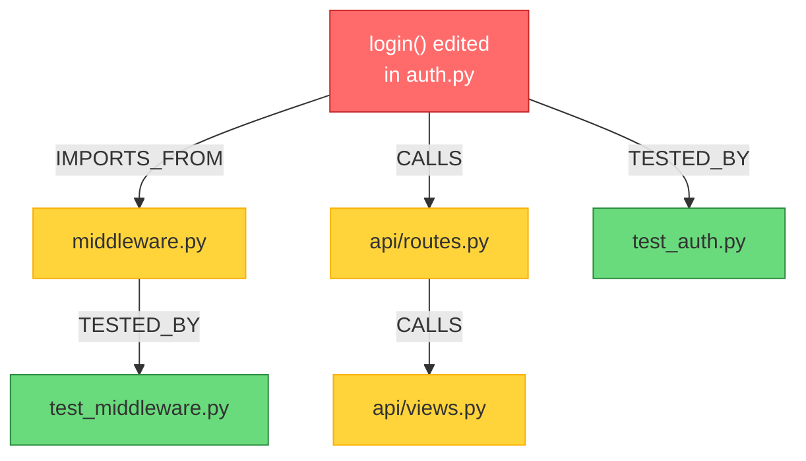
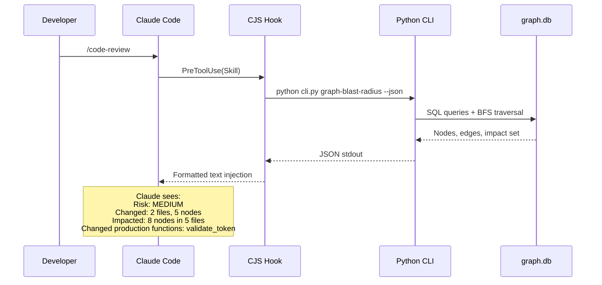
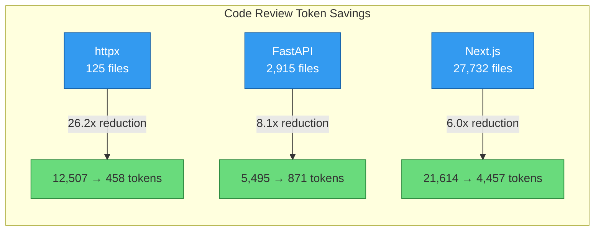
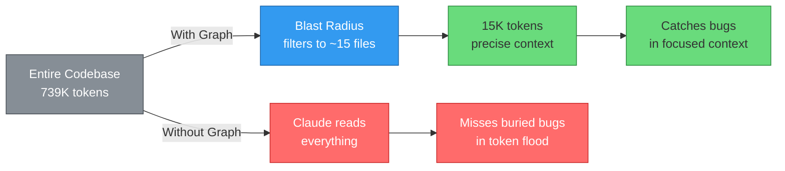
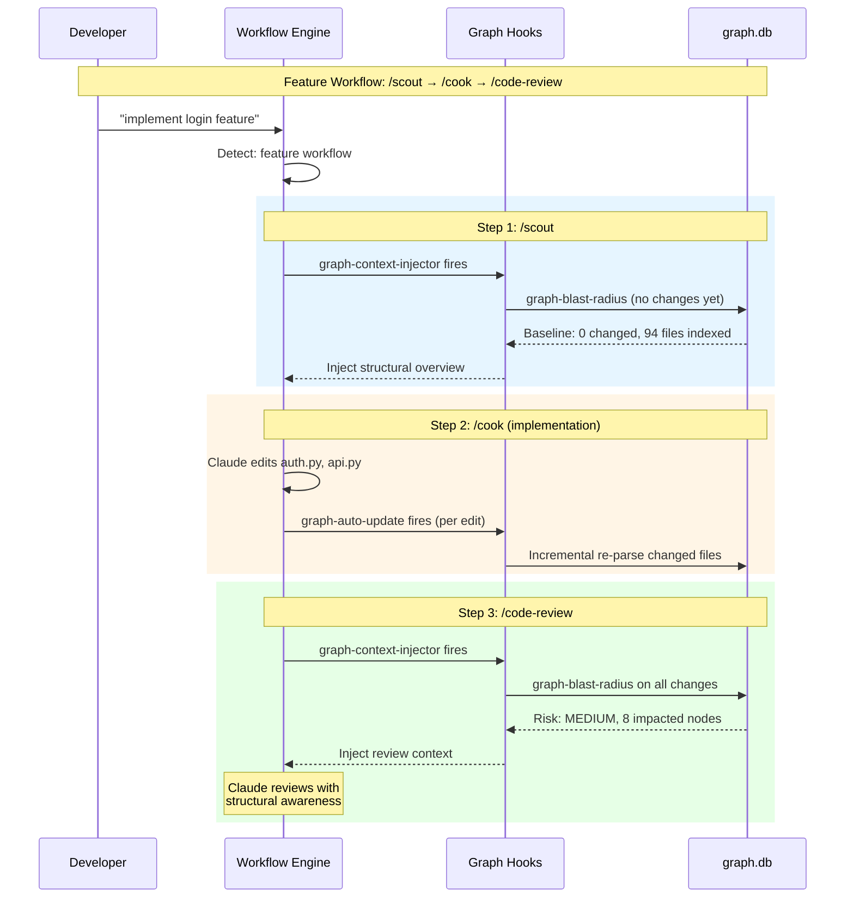
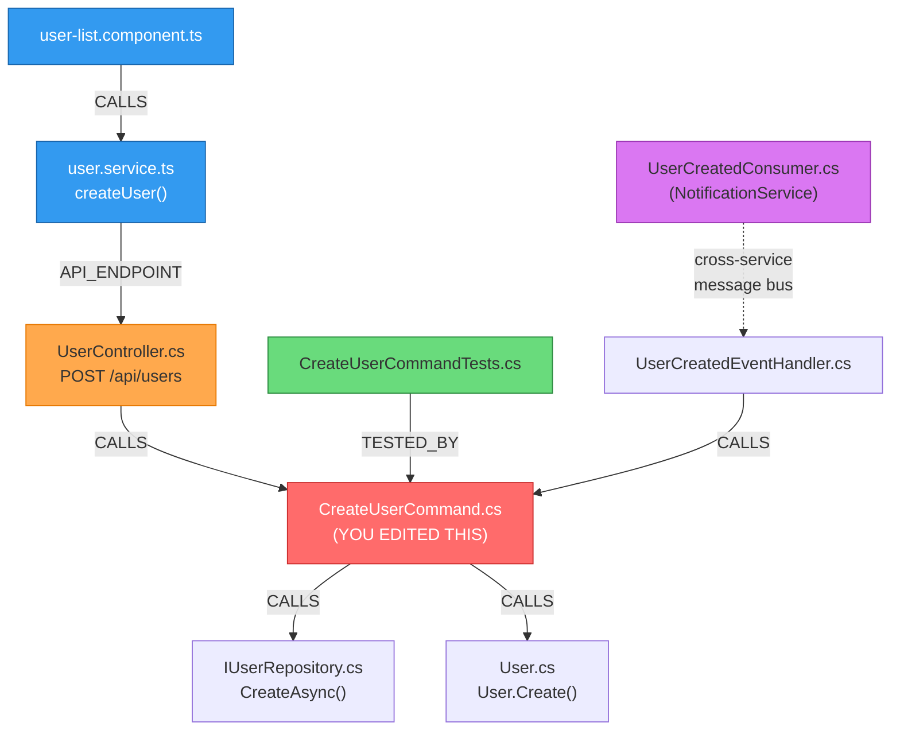
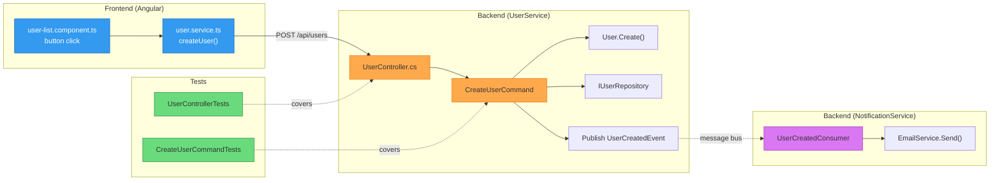

# Code Review Graph — How It Works

> Comprehensive guide to the structural code intelligence system integrated into easy-claude.

## Overview

The Code Review Graph builds a **persistent knowledge graph** of your codebase using Tree-sitter **AST (Abstract Syntax Tree)** parsing — a technique that reads source code structure (functions, classes, imports) without executing it, similar to how a compiler understands your code. It stores functions, classes, imports, calls, inheritance, and test relationships in a SQLite database. When you make changes, it computes a **blast radius** — the set of files, functions, and tests affected by your change (borrowed from incident response: "how far does the damage spread?") — and injects this structural context into Claude's workflow automatically.

**Key benefit:** Claude knows what your change breaks _before_ reviewing the code. No full-project scan needed.

## Architecture

```
┌────────────────────────────────────────────────────────────────────┐
│                         Your Codebase                              │
│  .py .ts .js .vue .go .rs .java .cs .rb .kt .swift .php .sol .c  │
└───────────────────────────┬────────────────────────────────────────┘
                            │ Tree-sitter parses each file
                            ▼
┌────────────────────────────────────────────────────────────────────┐
│                    Parser (parser.py)                               │
│  Walks AST → extracts nodes (File, Class, Function, Type, Test)    │
│           → extracts edges (CALLS, IMPORTS, INHERITS, CONTAINS,    │
│                              TESTED_BY, IMPLEMENTS, DEPENDS_ON)    │
└───────────────────────────┬────────────────────────────────────────┘
                            │ Nodes + edges stored
                            ▼
┌────────────────────────────────────────────────────────────────────┐
│              SQLite Graph Store (graph.py)                          │
│  .code-graph/graph.db                                       │
│  Tables: nodes (id, kind, name, qualified_name, file_path,         │
│                 line_start, line_end, language, file_hash)          │
│          edges (id, kind, source_qualified, target_qualified)       │
│          metadata (key, value)                                      │
│  Indexes on: qualified_name, file_path, source, target             │
└───────────────────────────┬────────────────────────────────────────┘
                            │ Queried by tools
                            ▼
┌────────────────────────────────────────────────────────────────────┐
│                    Tools (tools.py)                                 │
│  build_or_update_graph  — full/incremental build                   │
│  get_impact_radius      — BFS blast radius from changed files      │
│  query_graph            — callers_of, tests_for, inheritors_of...  │
│  get_review_context     — token-optimized review context           │
│  search_nodes           — keyword search across all nodes          │
│  find_large_functions   — find oversized code by line count        │
└───────────────────────────┬────────────────────────────────────────┘
                            │ Invoked by CJS hooks
                            ▼
┌────────────────────────────────────────────────────────────────────┐
│              CJS Hook Layer (.claude/hooks/)                       │
│                                                                    │
│  SessionStart → graph-session-init.cjs                             │
│    Checks: Python? → tree-sitter? → graph.db?                     │
│    Outputs: status message to Claude's context                     │
│                                                                    │
│  PreToolUse(Skill) → graph-context-injector.cjs                    │
│    When: /code-review, /review-changes, /scout, /debug, etc.       │
│    Runs: graph-blast-radius → injects summary into Claude's context      │
│                                                                    │
│  PostToolUse(Edit) → graph-auto-update.cjs                         │
│    When: after every file edit                                      │
│    Runs: incremental update (debounced 3s)                         │
└────────────────────────────────────────────────────────────────────┘
```

### Architecture Pipeline (Mermaid)



## How Change Detection Works

The graph does **NOT** scan your entire project on every update. It uses `git diff` + SHA-256 hash comparison.

### Incremental Update Flow

```
1. git diff --name-only HEAD~1
   → Returns: ["src/auth.py", "src/api.py"]    (< 100ms, any project size)

2. For each changed file, find DEPENDENTS in graph:
   Query: SELECT * FROM edges WHERE target_qualified = 'src/auth.py' AND kind = 'IMPORTS_FROM'
   → Returns: ["src/middleware.py", "tests/test_auth.py"]

3. Combined set: changed + dependents = 4 files to check

4. For each file:
   Read bytes → SHA-256 hash → Compare with stored file_hash in graph.db
   If hash matches → SKIP (unchanged)
   If hash differs → Re-parse with Tree-sitter → Update nodes/edges in SQLite

5. Done. Touched 4 files, skipped 496.
```

### When Each Method Is Used

| Scenario                    | Method                               | Speed              |
| --------------------------- | ------------------------------------ | ------------------ |
| First time (`/graph-build`) | Full build: parse ALL files          | ~10s for 500 files |
| After editing a file        | Incremental: `git diff` + hash check | <2s for any size   |
| After branch switch         | Full rebuild recommended             | ~10s               |
| No changes detected         | Skip entirely                        | <100ms             |

## How Blast Radius Analysis Works

Blast radius uses **Breadth-First Search (BFS)** through the graph.

### Algorithm

```
Input: changed files (from git diff)

1. SEED: Get all qualified_names in changed files
   e.g., ["src/auth.py::login", "src/auth.py::AuthService", "src/auth.py"]

2. BFS with max_depth=2:
   Hop 0: seed nodes
   Hop 1: direct callers + callees + importers + inheritors + tests
   Hop 2: callers of callers, etc.

3. For each hop:
   - Follow FORWARD edges (what this node affects)
   - Follow REVERSE edges (what depends on this node)
   - Cap at max_nodes=500 to prevent explosion

4. Output:
   - changed_nodes: directly modified functions/classes
   - impacted_nodes: reachable via edges within 2 hops
   - impacted_files: unique files containing impacted nodes
   - edges: connecting relationships
```

### Example

You edit `login()` in `auth.py`:

```
                    ┌─────────────────┐
                    │  login() edited  │  ← Seed
                    └────────┬────────┘
                             │
              ┌──────────────┼──────────────┐
              ▼              ▼              ▼
        middleware.py   api/routes.py   test_auth.py
        (IMPORTS)       (CALLS login)   (TESTED_BY)
              │              │
              ▼              ▼
        test_middleware.py  api/views.py
        (TESTED_BY)        (CALLS routes)
```

Blast radius: 5 impacted files, 8 impacted nodes. Risk: MEDIUM.

### Blast Radius Visualization (Mermaid)



## How Context Injection Works

The graph data (binary SQLite) is **never read directly by Claude**. It flows through a translation chain:

```
.code-graph/graph.db (binary SQLite)
        │
        │  Python reads via SQL queries, runs BFS
        ▼
python .claude/scripts/code_graph graph-blast-radius --json
        │
        │  Outputs JSON to stdout
        ▼
graph-context-injector.cjs (CJS hook) captures JSON, formats text
        │
        │  console.log() — injected into Claude's context
        ▼
Claude sees:
  [code-graph] Blast Radius Analysis (auto-injected for /code-review)
  Risk: MEDIUM | Changed: 2 files, 5 nodes | Impacted: 8 nodes in 5 files
  Changed files: src/auth.py, src/api.py
  Impacted files: middleware.py, test_auth.py, api/routes.py, ...
  Changed production functions: login, validate_token
```

### When Injection Happens

| Event                     | Hook                         | What's Injected                                                     |
| ------------------------- | ---------------------------- | ------------------------------------------------------------------- |
| Session start             | `graph-session-init.cjs`     | Status: "Graph active. 94 files, 875 nodes" or install instructions |
| `/code-review` invoked    | `graph-context-injector.cjs` | Blast radius summary, risk level, impacted files                    |
| `/review-changes` invoked | `graph-context-injector.cjs` | Same as above                                                       |
| `/scout` invoked          | `graph-context-injector.cjs` | Structural overview for exploration                                 |
| `/debug` invoked          | `graph-context-injector.cjs` | Dependency context for tracing                                      |
| `/sre-review` invoked     | `graph-context-injector.cjs` | Impact assessment for prod readiness                                |
| `/investigate` invoked    | (in-skill RECOMMENDED)       | Callers, imports, tests, inheritance queries for target             |
| `/feature-investigation`  | (in-skill RECOMMENDED)       | Same graph queries for workflow-driven investigation                |
| `/graph-query` invoked    | (standalone skill)           | Natural language graph queries, 8 patterns                          |
| `/graph-sync` invoked     | (standalone skill)           | Git-aware sync: diff last_synced_commit vs HEAD, re-parse changed   |
| Session starts            | `graph-session-init.cjs`     | Auto-sync with git state, report stale files                        |
| File edited               | `graph-auto-update.cjs`      | Nothing visible — silently updates graph.db                         |

### Context Injection Flow (Mermaid)



## Supported Languages

14 languages via Tree-sitter grammars:

| Language   | Extensions                 | Node Types Extracted                               |
| ---------- | -------------------------- | -------------------------------------------------- |
| Python     | `.py`                      | classes, functions, imports, calls, inheritance    |
| TypeScript | `.ts`, `.tsx`              | classes, functions, imports, calls, inheritance    |
| JavaScript | `.js`, `.jsx`              | classes, functions, imports, calls                 |
| Vue        | `.vue`                     | SFC script sections parsed as JS/TS                |
| Go         | `.go`                      | types, functions, imports, calls                   |
| Rust       | `.rs`                      | structs, enums, impl, functions, calls             |
| Java       | `.java`                    | classes, interfaces, methods, calls, inheritance   |
| C#         | `.cs`                      | classes, interfaces, structs, methods, inheritance |
| Ruby       | `.rb`                      | classes, modules, methods, calls                   |
| Kotlin     | `.kt`                      | classes, objects, functions, calls                 |
| Swift      | `.swift`                   | classes, structs, protocols, functions             |
| PHP        | `.php`                     | classes, interfaces, functions, calls              |
| Solidity   | `.sol`                     | contracts, interfaces, libraries, functions        |
| C/C++      | `.c`, `.h`, `.cpp`, `.hpp` | structs, classes, functions, calls                 |

## Graph Schema

### Nodes Table

| Column           | Type    | Description                                     |
| ---------------- | ------- | ----------------------------------------------- |
| `id`             | INTEGER | Auto-increment primary key                      |
| `kind`           | TEXT    | File, Class, Function, Type, Test               |
| `name`           | TEXT    | Short name (e.g., `login`)                      |
| `qualified_name` | TEXT    | Unique: `file_path::ClassName.method_name`      |
| `file_path`      | TEXT    | Absolute path to source file                    |
| `line_start`     | INTEGER | Start line number                               |
| `line_end`       | INTEGER | End line number                                 |
| `language`       | TEXT    | Detected language                               |
| `parent_name`    | TEXT    | Parent class/file name (nullable)               |
| `params`         | TEXT    | Function parameters (nullable)                  |
| `return_type`    | TEXT    | Return type annotation (nullable)               |
| `modifiers`      | TEXT    | Access modifiers (nullable)                     |
| `is_test`        | INTEGER | 1 if test function/class                        |
| `file_hash`      | TEXT    | SHA-256 of file contents (for change detection) |
| `extra`          | TEXT    | JSON blob for extensible metadata (nullable)    |
| `updated_at`     | REAL    | Timestamp of last update                        |

### Edges Table

| Column             | Type    | Description                                                                              |
| ------------------ | ------- | ---------------------------------------------------------------------------------------- |
| `id`               | INTEGER | Auto-increment primary key                                                               |
| `kind`             | TEXT    | CALLS, IMPORTS_FROM, INHERITS, IMPLEMENTS, CONTAINS, TESTED_BY, DEPENDS_ON, API_ENDPOINT |
| `source_qualified` | TEXT    | Caller/importer/child qualified name                                                     |
| `target_qualified` | TEXT    | Callee/imported/parent qualified name                                                    |
| `file_path`        | TEXT    | File where the edge was found                                                            |
| `line`             | INTEGER | Line number of the reference                                                             |
| `extra`            | TEXT    | JSON blob for extensible metadata (nullable)                                             |
| `updated_at`       | REAL    | Timestamp of last update                                                                 |

### Edge Types

| Edge                     | Meaning                                          | Example                                              |
| ------------------------ | ------------------------------------------------ | ---------------------------------------------------- |
| `CALLS`                  | Function A calls function B                      | `api.py::handler` → `auth.py::login`                 |
| `IMPORTS_FROM`           | File A imports from file B                       | `api.py` → `auth.py`                                 |
| `INHERITS`               | Class A extends class B                          | `AdminUser` → `User`                                 |
| `IMPLEMENTS`             | Class implements interface                       | `AuthService` → `IAuthService`                       |
| `CONTAINS`               | File/class contains function                     | `auth.py` → `auth.py::login`                         |
| `TESTED_BY`              | Function is tested by test                       | `login` → `test_login`                               |
| `DEPENDS_ON`             | Module depends on library/type                   | `auth.cs` → `Microsoft.Identity`                     |
| `API_ENDPOINT`           | Frontend HTTP call matches backend route         | `user.service.ts` → `UserController.cs`              |
| `TRIGGERS_EVENT`         | Entity CRUD triggers event handler               | `CreateUser` → `UserCreatedEventHandler`             |
| `PRODUCES_EVENT`         | Event handler triggers bus producer              | `UserCreatedEventHandler` → `UserCreatedBusProducer` |
| `MESSAGE_BUS`            | Bus message producer to consumer (cross-service) | `UserSavedMsg` → `AccountUserSavedConsumer`          |
| `TRIGGERS_COMMAND_EVENT` | Command triggers command event handler           | `CreateUserCommand` → `CommandEventHandler`          |

## Frontend↔Backend API Auto-Detection (Zero-Config)

The API connector automatically detects frontend and backend frameworks without any configuration. It scans for marker files (e.g., `angular.json`, `*.csproj`, `package.json` dependencies) and creates `API_ENDPOINT` edges by matching HTTP calls to route definitions.

### Matching Strategies (5 levels, highest confidence first)

| #   | Strategy              | Confidence | Example                                             |
| --- | --------------------- | ---------- | --------------------------------------------------- |
| 1   | Exact match           | 1.0        | FE `/api/users` = BE `/api/users`                   |
| 2   | Prefix-augmented      | 0.95       | FE `/users` + prefix `api` → `/api/users`           |
| 3   | Suffix match          | 0.9        | BE `/api/users` stripped → `/users` = FE `/users`   |
| 4   | Deep strip            | 0.85       | BE `/api/{param}/users` → `/users` = FE `/users`    |
| 5   | Controller resolution | —          | .NET `[controller]` → resolved to actual class name |

### Auto-Run on Every Graph Operation

The connector runs automatically:

- After `build`, `update`, `sync` via `_auto_connect()` in `cli.py`
- On first `trace`, `query`, `connections` via `_ensure_connectors_ran()` (metadata timestamp check, <1ms)

### Trace BFS Connector Edge Bridge

The BFS trace algorithm (`tools.py:trace_connections`) follows both structural edges (CALLS, IMPORTS) and connector edges (API_ENDPOINT, MESSAGE_BUS). Since connector edges use file paths as source/target (not qualified node names), the BFS includes a file-path lookup step: for each node visited, it also fetches edges where `source_qualified` or `target_qualified` matches the node's `file_path`. This bridges the gap between structural and connector edge namespaces, enabling a single `trace` command to show the full flow from frontend → backend → cross-service consumers.

## Security Features

| Feature                             | Purpose                                                            |
| ----------------------------------- | ------------------------------------------------------------------ |
| `_validate_repo_root()`             | Prevents path traversal via repo_root parameter                    |
| `_sanitize_name()`                  | Strips control chars, caps at 256 chars — prompt injection defense |
| Parameterized SQL (`?`)             | No SQL injection — all queries use placeholders                    |
| No `eval()`, `exec()`, `shell=True` | Security invariant verified by grep                                |
| `execFileSync` (not `execSync`)     | CJS hooks avoid shell injection                                    |
| SRI hash on CDN scripts             | Visualization HTML integrity                                       |

## File Inventory

### Python Package (`.claude/scripts/code_graph/`)

| File                  | Lines | Purpose                                                                                                                                                                        |
| --------------------- | ----- | ------------------------------------------------------------------------------------------------------------------------------------------------------------------------------ |
| `parser.py`           | ~1240 | Tree-sitter AST walker, 14 language mappings                                                                                                                                   |
| `graph.py`            | ~619  | SQLite GraphStore, BFS impact analysis, NetworkX caching                                                                                                                       |
| `incremental.py`      | ~514  | git diff detection, full/incremental build, watch mode                                                                                                                         |
| `tools.py`            | ~980  | 8 query/analysis tool functions (incl. find_path, search_nodes)                                                                                                                |
| `cli.py`              | ~400  | CLI with 15 subcommands (incl. search, find-path, describe) and `--json` output. `--node-mode` option on trace/connections/query: `file`, `function`, `class`, `all` (default) |
| `mermaid_exporter.py` | ~150  | Export single-file graph as Mermaid flowchart markdown                                                                                                                         |
| `api_connector.py`    | ~300  | Detect frontend-backend API connections via graph                                                                                                                              |
| `api_patterns.py`     | ~85   | Framework-specific HTTP call and route patterns                                                                                                                                |
| `__init__.py`         | ~10   | Package init with MIT attribution                                                                                                                                              |
| `__main__.py`         | ~15   | Entry point for `python .claude/scripts/code_graph`                                                                                                                            |
| `LICENSE`             | MIT   | License from code-graph v1.8.4                                                                                                                                                 |

### CJS Hooks (`.claude/hooks/`)

| File                         | Event                    | Purpose                                                                 |
| ---------------------------- | ------------------------ | ----------------------------------------------------------------------- |
| `lib/graph-utils.cjs`        | (library)                | Python detection, availability check, graph invocation                  |
| `graph-session-init.cjs`     | SessionStart             | Check graph status, inject guidance                                     |
| `graph-auto-update.cjs`      | PostToolUse              | Incremental update after edits (3s debounce)                            |
| `graph-context-injector.cjs` | PreToolUse(Skill\|Agent) | Auto-inject blast radius for review skills + graph CLI hints for agents |
| `graph-grep-suggester.cjs`   | PostToolUse(Grep)        | Suggest graph queries when grep finds important entry-point files       |

### Skills (`.claude/skills/`)

| Skill                  | Purpose                                           |
| ---------------------- | ------------------------------------------------- |
| `graph-build`          | Build or update the knowledge graph               |
| `graph-blast-radius`   | Analyze structural impact of changes              |
| `graph-export`         | Export full graph to JSON file                    |
| `graph-export-mermaid` | Export single-file graph as Mermaid diagram       |
| `graph-query`          | Natural language graph queries (8 query patterns) |
| `graph-connect-api`    | Detect frontend-backend API connections via graph |

**Skills with graph integration** (RECOMMENDED if graph.db exists):
scout, debug, code-review, review-changes, sre-review, investigate, feature-investigation

## Example Workflow: Bug Fix with Graph

```
1. User: "fix the login timeout bug"

2. Claude detects: bugfix workflow → /scout
   PreToolUse fires → graph-context-injector.cjs
   → Injects: "Risk: LOW | Changed: 0 files | No changes detected"
   (No changes yet — graph provides baseline)

3. Claude investigates, finds bug in auth.py, edits it
   PostToolUse fires → graph-auto-update.cjs
   → Incremental update: re-parses auth.py + dependents

4. User: /code-review
   PreToolUse fires → graph-context-injector.cjs
   → Runs graph-blast-radius on the fix
   → Injects: "Risk: MEDIUM | Changed: 1 file, 3 nodes | Impacted: 8 nodes in 5 files"
   → "Impacted files: middleware.py, api/routes.py, test_auth.py"
   → "Changed production functions: validate_token"

5. Claude reviews with structural context:
   - Knows middleware.py calls the changed function → checks it
   - Knows test_auth.py tests login → verifies test still valid
   - Flags validate_token has no test coverage
```

## Benchmarks & ROI

Based on tests against real open-source repositories:



| Metric                   | Without Graph | With Graph |     Improvement |
| ------------------------ | ------------: | ---------: | --------------: |
| Avg code review tokens   |        13,205 |      1,928 |  **6.8x fewer** |
| Review quality score     |        7.2/10 |     8.8/10 | **+22% higher** |
| Live coding tokens (avg) |             — |          — | **14.1x fewer** |
| Monorepo peak savings    |       739,352 |     15,049 |   **49x fewer** |

### Why Fewer Tokens = Better Reviews



## How the Graph Helps in Workflows

The graph integrates into easy-claude workflows through 3 hooks that fire automatically:



### Workflow Integration Map

| Workflow          | Steps Where Graph Activates                                             | What Graph Provides                                                |
| ----------------- | ----------------------------------------------------------------------- | ------------------------------------------------------------------ |
| **feature**       | /scout, /cook (auto-update), /code-review, /review-changes, /sre-review | Structural overview, incremental tracking, blast radius for review |
| **bugfix**        | /scout, /debug, /fix (auto-update), /code-review                        | Dependency tracing for root cause, impact assessment of fix        |
| **refactor**      | /scout, /code (auto-update), /code-review, /sre-review                  | Ensures refactoring doesn't break callers/dependents               |
| **hotfix**        | /scout, /fix (auto-update), /review-changes, /sre-review                | Fast blast radius to verify minimal production impact              |
| **investigation** | /scout, /feature-investigation                                          | Structural map for understanding code relationships                |

### Graph-Powered Skills

| Skill                   | How Graph Enhances It                                                     |
| ----------------------- | ------------------------------------------------------------------------- |
| `/graph-build`          | Builds the knowledge graph from scratch or updates incrementally          |
| `/graph-blast-radius`   | Direct blast radius analysis — shows impacted files, functions, test gaps |
| `/graph-query`          | Natural language queries: "who calls login?", "tests for AuthService?"    |
| `/graph-export`         | Export full graph to JSON for external analysis                           |
| `/graph-export-mermaid` | Export single-file graph as Mermaid diagram                               |
| `/graph-connect-api`    | Detect frontend-backend API connections via graph edges                   |
| `/code-review`          | Auto-receives blast radius context when graph exists                      |
| `/scout`                | Auto-receives structural overview when graph exists                       |
| `/debug`                | Auto-receives dependency context for tracing                              |
| `/sre-review`           | Auto-receives impact assessment for prod readiness                        |

## Real-World Use Cases (Angular + .NET Microservices)

Imagine a monorepo with an Angular frontend and multiple .NET backend services:

```
my-enterprise-app/
├── src/
│   ├── WebApp/                      # Angular 17 frontend
│   │   ├── src/app/
│   │   │   ├── users/
│   │   │   │   ├── user-list.component.ts
│   │   │   │   ├── user-detail.component.ts
│   │   │   │   └── user.service.ts          # HTTP calls to backend
│   │   │   ├── shared/
│   │   │   │   ├── auth.interceptor.ts
│   │   │   │   └── base-api.service.ts
│   │   │   └── app.routes.ts
│   │   └── ...
│   ├── Services/
│   │   ├── UserService/             # .NET 8 microservice
│   │   │   ├── Controllers/UserController.cs
│   │   │   ├── UseCaseCommands/CreateUser/CreateUserCommand.cs
│   │   │   ├── UseCaseEvents/UserCreated/UserCreatedEventHandler.cs
│   │   │   ├── Entities/User.cs
│   │   │   └── Repositories/IUserRepository.cs
│   │   ├── NotificationService/     # .NET 8 microservice
│   │   │   ├── Consumers/UserCreatedConsumer.cs
│   │   │   └── Services/EmailService.cs
│   │   └── ...
│   └── Tests/
│       ├── UserService.Tests/
│       │   ├── CreateUserCommandTests.cs
│       │   └── UserControllerTests.cs
│       └── WebApp.Tests/
│           └── user-list.component.spec.ts
```

**After `/graph-build`, the graph contains ~350 nodes and ~1,200 edges.**

---

### Use Case 1: Bug Fix — "CreateUser throws 500 error"

You edit `CreateUserCommand.cs` to fix a validation bug.

**What the graph knows (before you even ask):**



**What Claude sees when `/code-review` fires:**

```
[code-graph] Blast Radius Analysis
Risk: MEDIUM | Changed: 1 file, 2 nodes | Impacted: 9 nodes in 7 files

Changed files:
  - Services/UserService/UseCaseCommands/CreateUser/CreateUserCommand.cs

Impacted files (2-hop reach):
  - Controllers/UserController.cs          (CALLS CreateUserCommand)
  - Entities/User.cs                       (CALLS User.Create)
  - UseCaseEvents/UserCreated/...          (triggered after command)
  - Tests/CreateUserCommandTests.cs        (TESTED_BY)
  - Tests/UserControllerTests.cs           (tests the caller)

Cross-boundary impact:
  - WebApp/user.service.ts                 (API_ENDPOINT → UserController)
  - WebApp/user-list.component.ts          (CALLS user.service)

Changed production functions: none (CreateUserCommand has test coverage)
```

**Without graph:** Claude reviews only `CreateUserCommand.cs`. Misses that `UserController` and the Angular frontend call this endpoint.

**With graph:** Claude knows the full chain — backend command → controller → Angular service → component. Reviews the entire impact path.

---

### Use Case 2: Investigation — "How does user creation work end-to-end?"

User asks: `/investigate how does user creation work?`

**Without graph:** Claude greps for "user" across 350 files. Finds 47 matches. Reads them one by one. Burns tokens. Misses the cross-service event handler.

**With graph:** Claude runs targeted queries after initial grep:

```
Step 1: grep finds UserController.cs as entry point

Step 2: Graph queries (precise, no guessing):
  $ query callees_of "UserController.cs::CreateUser" --json
  → CreateUserCommand, CreateUserCommandValidator

  $ query callees_of "CreateUserCommand::Handle" --json
  → User.Create(), IUserRepository.CreateAsync(), IPublisher.Publish()

  $ query importers_of "Entities/User.cs" --json
  → 12 files import User entity

  $ query tests_for "CreateUserCommand" --json
  → CreateUserCommandTests.cs (3 test methods)
```

**Result:** Complete call chain mapped in 4 targeted queries instead of reading 47 files.



---

### Use Case 3: Plan Review — "Does our plan miss any files?"

A plan says: "Modify `User.cs` to add `PhoneNumber` property."

**Without graph:** Plan lists 3 files. Developer discovers 2 more broken files during implementation.

**With graph:** `/plan-review` runs `importers_of User.cs`:

```
$ query importers_of "Entities/User.cs" --json
→ 12 files import User.cs

Files in plan: User.cs, CreateUserCommand.cs, UserDto.cs
Files NOT in plan but importing User.cs:
  ⚠️ UpdateUserCommand.cs        — may need PhoneNumber mapping
  ⚠️ UserCreatedEventHandler.cs  — publishes User data to bus
  ⚠️ UserSeeder.cs               — seed data may need update
  ⚠️ user-detail.component.ts    — displays User fields (frontend)
```

**Result:** 4 potentially missed files flagged before implementation starts. No surprise breakages.

---

### Use Case 4: Refactoring — "Rename `AuthService` to `IdentityService`"

```
$ query callers_of "AuthService" --json
→ 8 functions call AuthService methods

$ query inheritors_of "IAuthService" --json
→ AuthService implements IAuthService

$ query importers_of "AuthService.cs" --json
→ 14 files import AuthService
```

**What Claude sees:**

```
[code-graph] Blast Radius Analysis
Risk: HIGH | Changed: 1 file | Impacted: 22 nodes in 14 files

⚠️ High blast radius — consider splitting this refactor:
  - 8 callers need updating
  - 14 importers need path changes
  - 1 interface (IAuthService) may need renaming
  - Frontend auth.interceptor.ts depends on auth endpoint
```

**Without graph:** Claude renames the class, misses 3 importers in a different service. Build breaks.

**With graph:** Claude knows every caller, importer, and inheritor before touching a single file.

---

### How the Graph Affects Claude's Prompt (The AI Perspective)

Claude Code works by reading instructions (skills, hooks) and using tools (Read, Grep, Bash) to explore code. Without the graph, Claude must **guess** which files matter — reading too many (token waste) or too few (missed bugs).

**The graph changes Claude's reasoning from "search everywhere" to "query precisely":**

```
WITHOUT GRAPH (Claude's internal reasoning):
  User: "review my changes to CreateUserCommand.cs"

  Claude thinks: "I need to find related files..."
    → Grep for "CreateUser" across entire repo
    → 47 matches found
    → Read each file to check if relevant
    → 23 files read, 18 were irrelevant
    → ~45,000 tokens consumed
    → STILL missed UserCreatedConsumer in NotificationService
      (different service, no "CreateUser" in the filename)

WITH GRAPH (Claude's internal reasoning):
  Hook auto-injects BEFORE Claude even starts:

  "[code-graph] Blast Radius Analysis
   Risk: MEDIUM | Changed: 1 file, 2 nodes
   Impacted: 9 nodes in 7 files
   Impacted files: UserController.cs, User.cs,
     UserCreatedEventHandler.cs, CreateUserCommandTests.cs,
     user.service.ts, user-list.component.ts
   Changed production functions: none"

  Claude thinks: "I know exactly which 7 files to review"
    → Read only the 7 impacted files
    → ~8,000 tokens consumed
    → Found the cross-service consumer immediately
    → Review complete, nothing missed
```

**Why injecting MORE context SAVES tokens:**

The graph injects ~200-500 tokens of structured context (the blast radius summary). This prevents Claude from spending 5,000-50,000 tokens on unfocused grep/read cycles:

```
Graph injection cost:    ~300 tokens (blast radius summary)
Tokens saved:            ~35,000 tokens (avoided blind searching)
Net savings:             ~34,700 tokens per review
```

It's like a GPS navigator: the map data costs a few KB, but saves hours of driving in circles.

**When exactly does injection happen?**

| Phase          | Trigger                                 | What's injected                                    | Cost       | Savings                                                 |
| -------------- | --------------------------------------- | -------------------------------------------------- | ---------- | ------------------------------------------------------- |
| Session start  | `graph-session-init.cjs` fires once     | "Graph active. 350 files, 1200 edges" (~30 tokens) | 30 tokens  | Claude knows graph exists, uses queries instead of grep |
| `/scout` runs  | `graph-context-injector.cjs` auto-fires | Baseline structural overview (~200 tokens)         | 200 tokens | Claude maps code area in seconds vs minutes of grepping |
| File edited    | `graph-auto-update.cjs` fires silently  | Nothing visible — graph.db updated in background   | 0 tokens   | Graph stays current. No manual rebuild needed           |
| `/code-review` | `graph-context-injector.cjs` auto-fires | Full blast radius report (~300 tokens)             | 300 tokens | Claude reviews 7 files instead of grepping 350          |
| `/investigate` | Skill RECOMMENDED section               | Claude runs targeted graph queries (~500 tokens)   | 500 tokens | 4 queries replace reading 47 grep matches               |
| `/plan-review` | Completeness checklist item             | `importers_of` per planned file (~200 tokens)      | 200 tokens | Catches missed dependents before implementation         |

**How the graph prevents missed updates and stale information:**

| Problem                        | Without Graph                                                                   | With Graph                                                                             |
| ------------------------------ | ------------------------------------------------------------------------------- | -------------------------------------------------------------------------------------- |
| Missed dependent files         | Claude greps, misses files that don't contain the search term                   | Graph traces CALLS/IMPORTS edges — finds all dependents regardless of naming           |
| Cross-service impact invisible | Each service is a separate folder. Claude won't grep across services by default | Graph has API_ENDPOINT edges connecting frontend HTTP calls to backend routes          |
| Tests not checked              | Claude may forget to verify test coverage                                       | Blast radius lists untested changed functions explicitly                               |
| Plan misses files              | Developer lists 3 files, misses 4 importers                                     | `/plan-review` runs `importers_of` on each planned file, flags unlisted dependents     |
| Stale after edits              | If Claude edits a file, relationships change but Claude doesn't re-analyze      | `graph-auto-update.cjs` re-parses after every edit — graph always matches current code |
| Refactoring breaks callers     | Rename a class, miss 3 importers in another module                              | `callers_of` and `importers_of` list every consumer before the rename starts           |

### What Gets Injected Into Claude's Context (Summary)

| Scenario                 | What Claude sees automatically         | How it helps                                  |
| ------------------------ | -------------------------------------- | --------------------------------------------- |
| Session starts           | "Graph active. 350 files, 1,200 edges" | Claude knows graph is available               |
| `/scout` runs            | Structural overview of target area     | Faster discovery than blind grep              |
| File edited              | _(silent)_ graph updates in background | Always current for next query                 |
| `/code-review` runs      | Full blast radius with risk level      | Reviews impacted files, not just changed ones |
| `/investigate` runs      | Targeted callers/imports/tests queries | Maps call chains in seconds vs minutes        |
| `/plan-review` runs      | Importers of planned files             | Catches missed dependents before coding       |
| User asks "who calls X?" | `/graph-query` skill activates         | Direct answer with file:line locations        |

---

### Use Case 5: Bug Fix with Implicit Connections — "Email not sent after user creation"

The bug: users are created successfully but the notification email never arrives. The code path crosses 3 services with zero direct references between them.

**Implicit connection chain (configured in `project-config.json`):**

```
CreateUserCommand.cs
  → calls IUserRepository.CreateAsync(user)
    → TRIGGERS_EVENT → UserCreatedEventHandler.cs     [Rule: repo-crud-to-event-handlers]
      → calls EntityEventBusMessageProducer<User>
        → PRODUCES_EVENT → MESSAGE_BUS edge            [Rule: entity-event-producers]
          → MESSAGE_BUS → UserCreatedConsumer.cs       [Rule: bus-message-producers-to-consumers]
            → calls EmailService.Send()
```

**Without graph:** Claude searches for "email" — finds `EmailService.cs` but has no idea what triggers it. The `UserCreatedConsumer` has no import of `CreateUserCommand`. The event handler has no import of the consumer. These are loosely coupled via message bus — invisible to grep.

**With graph + implicit connections:**

```
$ query callers_of "EmailService::Send" --json
→ UserCreatedConsumer.cs (CALLS)

$ query callers_of "UserCreatedConsumer.cs" --json
→ UserCreatedEventHandler.cs (MESSAGE_BUS — implicit edge)

$ query callers_of "UserCreatedEventHandler.cs" --json
→ CreateUserCommand.cs (TRIGGERS_EVENT — implicit edge)
```

Claude traces the full chain in 3 queries: Command → Event Handler → Message Bus → Consumer → EmailService. The bug is in the event handler — it swallows an exception silently.

**Token comparison:**

- Without graph: ~25,000 tokens grepping across 3 services for "email", "notification", "user created"
- With graph: ~2,000 tokens for 3 targeted queries + reading 4 files in the chain

---

### Use Case 6: Multi-File Code Review with batch-query

You've changed 8 files across 2 services. Instead of querying each file individually:

```bash
# Single call, deduplicated results
$ batch-query \
    Services/UserService/Commands/CreateUser.cs \
    Services/UserService/Commands/UpdateUser.cs \
    Services/UserService/Entities/User.cs \
    Services/UserService/Events/UserCreatedHandler.cs \
    Services/NotificationService/Consumers/UserCreatedConsumer.cs \
    WebApp/src/app/users/user.service.ts \
    WebApp/src/app/users/user-list.component.ts \
    WebApp/src/app/users/user-detail.component.ts \
    --json

→ 8 files, 42 nodes, 23 edges (deduplicated)
```

**Why batch matters:** If queried individually, shared edges (e.g., `User.cs` imported by both `CreateUser.cs` and `UpdateUser.cs`) would appear twice. Batch query deduplicates — single SQLite connection, single JSON response.

---

## How the Graph Auto-Maintains Itself

The graph stays in sync with your code through 4 automatic mechanisms:

### 1. Post-Edit Auto-Update (Every Claude Edit)

```
You: "Fix the validation in CreateUserCommand.cs"
Claude: Edit(CreateUserCommand.cs)
  ↓
PostToolUse hook fires → graph-auto-update.cjs
  ↓
Checks: wasRecentlyUpdated()? → debounce (3s) + lock check
  ↓
If not recently updated: acquireUpdateLock() → python update --json
  ↓
Python re-parses CreateUserCommand.cs → updates nodes/edges in graph.db
  ↓
releaseUpdateLock() → graph.db mtime updated
  ↓
Next edit within 3s → debounce skips (no duplicate work)
```

**Race condition protection:** Atomic directory-based lock prevents concurrent Python subprocesses. 30s stale lock auto-cleanup prevents permanent lock if Claude crashes.

### 2. Session-Start Git Sync (Every New Session)

```
Developer A: git pull origin main (gets 15 new files from Developer B)
Developer A: opens new Claude session
  ↓
SessionStart hook fires → graph-session-init.cjs
  ↓
invokeGraph("sync") → sync_with_git()
  ↓
Reads last_synced_commit from graph metadata: "abc123"
Gets current HEAD: "def456"
  ↓
git diff --name-status abc123..def456
  → 12 files modified, 3 files added, 2 files deleted
  ↓
Parses 15 changed files + their dependents (hash-based skip for unchanged)
Removes 2 deleted files from graph
Stores "def456" as new last_synced_commit
  ↓
"[code-graph] Auto-synced graph with git: Synced 17 files"
```

**Edge cases handled:**

- **First sync (no stored commit):** Scans all files on disk, adds missing ones to graph
- **Unreachable commit (rebase/force-push):** Falls back to full rebuild automatically
- **No git in workspace:** Skips sync silently
- **Large diff after long absence:** Hash-based skip prevents re-parsing unchanged content

### 3. Build Stores Git Commit Hash

Every `build`, `update`, and `sync` command stores the current HEAD commit hash in graph metadata:

```python
store.set_metadata("last_synced_commit", get_current_head(repo_root))
```

This is the anchor for the next session's sync — "what changed since I last built?"

### 4. Full Rebuild as Safety Net

If the graph ever gets out of sync (corrupted DB, manual file moves), `/graph-build` does a complete rebuild:

```
$ python code_graph build --json
→ Purges stale files from graph (deleted from disk but still in DB)
→ Re-parses every source file
→ Stores fresh last_synced_commit
→ Auto-runs graph-connect-api and connect-implicit if configured
```

**The maintenance is invisible:** Users never think about graph freshness. It just works.

## Setup

See [code-graph-setup.md](./code-graph-setup.md) for installation instructions.

**Quick start:**

```bash
pip install tree-sitter tree-sitter-language-pack networkx
python .claude/scripts/code_graph build --json
```

## Attribution

Based on [code-graph](https://github.com/tirth8205/code-graph) v1.8.4 by Tirth Kanani (MIT License).
