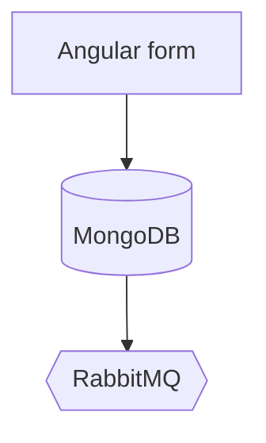

# Evidence Carriers

This specification documents the order flow in tech-agnostic prose.

[Source: src/Services/Order/PlatformOrderRepository.cs] confirms persistence to MongoDB.

**Evidence**: the consumer publishes to RabbitMQ after each accepted submission.

**IntegrationTest**: OrderSubmissionTests asserts the Angular form rejects invalid input.

