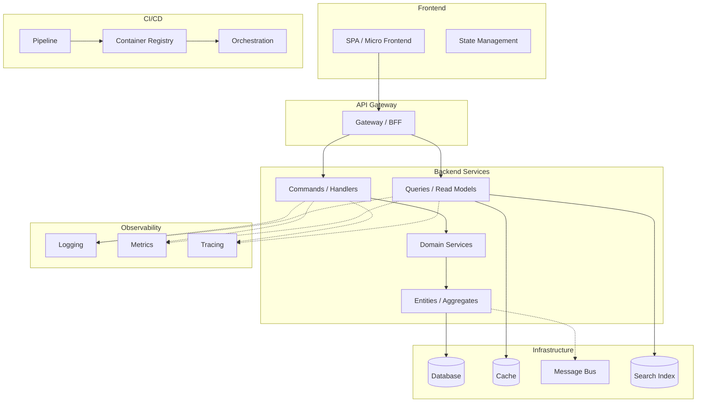

**MANDATORY IMPORTANT MUST** use `TaskCreate` to break ALL work into small tasks BEFORE starting.
**MANDATORY IMPORTANT MUST** use `AskUserQuestion` at EVERY decision point — never assume user preferences.
**MANDATORY IMPORTANT MUST** research top 3 options per architecture concern, compare with evidence, present report with recommendation + confidence %.

## Quick Summary

**Goal:** Act as a solution architect — research, critically analyze, and recommend the complete technical architecture for a project or feature. Cover ALL architecture concerns: backend, frontend, design patterns, library ecosystem, testing strategy, CI/CD, deployment, monitoring, code quality, and dependency management. Produce a comprehensive comparison report with actionable recommendations.

**Workflow (12 steps):**

1. **Load Context** — Read domain model, tech stack, business evaluation, refined PBI
2. **Derive Architecture Requirements** — Map business/domain complexity to architecture constraints
3. **Backend Architecture** — Research top 3 backend architecture styles + design patterns
4. **Frontend Architecture** — Research top 3 frontend architecture styles + design patterns
5. **Library Ecosystem Research** — Best-practice libraries per concern (validation, caching, logging, utils, etc.)
6. **Testing Architecture** — Unit, integration, E2E, performance testing frameworks + strategy
7. **CI/CD & Deployment** — Pipeline design, containerization, orchestration, IaC
8. **Observability & Monitoring** — Logging, metrics, tracing, alerting stack
9. **Code Quality & Clean Code** — Linters, analyzers, formatters, enforcement tooling
10. **Dependency Risk Assessment** — Package health, obsolescence risk, maintenance cost
11. **Generate Report** — Full architecture decision report with all recommendations
12. **User Validation** — Present findings, ask 8-12 questions, confirm all decisions

**Key Rules:**

- **MANDATORY IMPORTANT MUST** research minimum 3 options per architecture concern with web evidence
- **MANDATORY IMPORTANT MUST** include confidence % with evidence for every recommendation
- **MANDATORY IMPORTANT MUST** run user validation interview at end (never skip)
- Delegate to `solution-architect` agent for complex architecture decisions
- All claims must cite sources (URL, benchmark, case study, or codebase evidence)
- Never recommend based on familiarity alone — evidence required

**Be skeptical. Apply critical thinking, sequential thinking. Every claim needs traced proof, confidence percentages (Idea should be more than 80%).**

---

## Step 1: Load Context

Read artifacts from prior workflow steps (search in `plans/` and `team-artifacts/`):

- Domain model / ERD (complexity, bounded contexts, aggregate count)
- Tech stack decisions (confirmed languages, frameworks, databases)
- Business evaluation (scale, constraints, compliance)
- Refined PBI (scope, acceptance criteria)
- Discovery interview (team skills, experience level)

Extract and summarize:

| Signal                  | Value        | Source           |
| ----------------------- | ------------ | ---------------- |
| Bounded contexts        | ...          | domain model     |
| Aggregate count         | ...          | domain model     |
| Cross-context events    | ...          | domain model     |
| Confirmed tech stack    | ...          | tech stack phase |
| Expected scale          | ...          | business eval    |
| Team architecture exp.  | ...          | discovery        |
| Compliance requirements | ...          | business eval    |
| Real-time needs         | Yes/No       | refined PBI      |
| Integration complexity  | Low/Med/High | domain model     |
| Deployment target       | ...          | business eval    |

---

## Step 2: Derive Architecture Requirements

Map signals to architecture constraints:

| Signal                      | Architecture Requirement                                  | Priority |
| --------------------------- | --------------------------------------------------------- | -------- |
| Many bounded contexts       | Clear module boundaries, context isolation                | Must     |
| High scale                  | Horizontal scaling, stateless services, caching strategy  | Must     |
| Complex domain              | Rich domain model, separation of domain from infra        | Must     |
| Cross-context events        | Event-driven communication, eventual consistency          | Must     |
| Small team                  | Low ceremony, fewer layers, convention over configuration | Should   |
| Compliance                  | Audit trail, immutable events, access control layers      | Must     |
| Real-time                   | Event sourcing or pub/sub, WebSocket/SSE support          | Should   |
| High integration complexity | Anti-corruption layers, adapter pattern, API gateway      | Should   |

**MANDATORY IMPORTANT MUST** validate derived requirements with user via `AskUserQuestion` before proceeding.

---

## Step 3: Backend Architecture

### 3A: Architecture Styles

WebSearch top 3 backend architecture styles. Candidates:

| Style                       | Best For                                 | Research Focus                            |
| --------------------------- | ---------------------------------------- | ----------------------------------------- |
| **Clean Architecture**      | Complex domains, long-lived projects     | Dependency rule, testability, flexibility |
| **Hexagonal (Ports+Adapt)** | Integration-heavy, multiple I/O adapters | Port contracts, adapter isolation         |
| **Vertical Slice**          | Feature-focused teams, rapid delivery    | Slice isolation, code locality            |
| **Modular Monolith**        | Starting simple, eventual decomposition  | Module boundaries, migration path         |
| **Microservices**           | Large teams, independent deployment      | Service boundaries, operational overhead  |
| **CQRS + Event Sourcing**   | Audit-heavy, complex queries             | Read/write separation, event store        |
| **Layered (N-Tier)**        | Simple CRUD, small teams                 | Layer responsibilities, coupling risk     |

### 3B: Backend Design Patterns

Evaluate applicability per layer:

| Pattern             | Layer          | When to Apply                                     |
| ------------------- | -------------- | ------------------------------------------------- |
| **Repository**      | Data Access    | Abstract data store, enable testing               |
| **CQRS**            | Application    | Separate read/write models, complex queries       |
| **Mediator**        | Application    | Decouple handlers from controllers                |
| **Strategy**        | Domain/App     | Multiple interchangeable algorithms               |
| **Observer/Events** | Domain         | Cross-aggregate side effects                      |
| **Factory**         | Domain         | Complex object creation with invariants           |
| **Decorator**       | Cross-cutting  | Add behavior without modifying (logging, caching) |
| **Adapter**         | Infrastructure | Isolate external dependencies                     |
| **Specification**   | Domain         | Composable business rules, complex filtering      |
| **Unit of Work**    | Data Access    | Transaction management across repositories        |
| **Saga/Orchestr.**  | Cross-service  | Distributed transactions, compensating actions    |
| **Outbox**          | Messaging      | Reliable event publishing with DB transactions    |
| **Circuit Breaker** | Infrastructure | External service resilience                       |

For each recommended pattern, document: **Apply to**, **Why**, **Example**, **Risk if skipped**.

---

## Step 4: Frontend Architecture

### 4A: Architecture Styles

WebSearch top 3 frontend architecture styles. Candidates:

| Style                       | Best For                                    | Research Focus                            |
| --------------------------- | ------------------------------------------- | ----------------------------------------- |
| **MVVM**                    | Data-binding heavy, forms-over-data apps    | ViewModel responsibility, two-way binding |
| **MVC**                     | Server-rendered, traditional web apps       | Controller routing, view separation       |
| **Component Architecture**  | Modern SPA (React, Angular, Vue)            | Component isolation, props/events, reuse  |
| **Reactive Store (Redux)**  | Complex state, multi-component sync         | Single source of truth, immutable state   |
| **Signal-based Reactivity** | Fine-grained reactivity (Angular 19, Solid) | Granular updates, no zone.js overhead     |
| **Micro Frontends**         | Multiple teams, independent deployment      | Module federation, routing, shared state  |
| **Feature-based Modules**   | Large monolith SPA, lazy loading            | Feature boundaries, route-level splitting |
| **Server Components (RSC)** | SEO, initial load performance               | Server/client boundary, streaming         |

### 4B: Frontend Design Patterns

| Pattern                      | Layer       | When to Apply                                    |
| ---------------------------- | ----------- | ------------------------------------------------ |
| **Container/Presentational** | Component   | Separate logic from UI rendering                 |
| **Reactive Store**           | State       | Centralized state, cross-component communication |
| **Facade Service**           | Service     | Simplify complex API interactions                |
| **Adapter/Mapper**           | Data        | Transform API response to view model             |
| **Observer (RxJS)**          | Async       | Event streams, real-time data, debounce/throttle |
| **Strategy (renderers)**     | UI          | Conditional rendering strategies per entity type |
| **Composite (components)**   | UI          | Tree structures, recursive components            |
| **Command (undo/redo)**      | UX          | Form wizards, canvas editors, undoable actions   |
| **Lazy Loading**             | Performance | Route/module-level code splitting                |
| **Virtual Scrolling**        | Performance | Large lists, infinite scroll                     |

---

## Step 5: Library Ecosystem Research

For EACH concern below, WebSearch top 3 library options for the confirmed tech stack. Evaluate: maturity, community, bundle size, maintenance activity, license, learning curve.

### Library Concerns Checklist

| Concern                     | What to Research                                            | Evaluation Criteria                            |
| --------------------------- | ----------------------------------------------------------- | ---------------------------------------------- |
| **Validation**              | Input validation, schema validation, form validation        | Type safety, composability, error messages     |
| **HTTP Client / API Layer** | REST client, GraphQL client, API code generation            | Interceptors, retry, caching, type generation  |
| **State Management**        | Global store, local state, server state caching             | DevTools, SSR support, bundle size             |
| **Utilities / Helpers**     | Date/time, collections, deep clone, string manipulation     | Tree-shakability, size, native alternatives    |
| **Caching**                 | In-memory cache, distributed cache, HTTP cache, query cache | TTL, invalidation, persistence                 |
| **Logging**                 | Structured logging, log levels, log aggregation             | Structured output, transports, performance     |
| **Error Handling**          | Global error boundary, error tracking, crash reporting      | Source maps, breadcrumbs, alerting integration |
| **Authentication / AuthZ**  | JWT, OAuth, RBAC/ABAC, session management                   | Standards compliance, SSO, token refresh       |
| **File Upload / Storage**   | Multipart upload, cloud storage SDK, image processing       | Streaming, resumable, size limits              |
| **Real-time**               | WebSocket, SSE, SignalR, Socket.io                          | Reconnection, scaling, protocol support        |
| **Internationalization**    | i18n, l10n, pluralization, date/number formatting           | ICU support, lazy loading, extraction tools    |
| **PDF / Export**            | PDF generation, Excel export, CSV                           | Server-side vs client-side, template support   |

### Per-Library Evaluation Template

```markdown
### {Concern}: Top 3 Options

| Criteria         | Option A          | Option B | Option C |
| ---------------- | ----------------- | -------- | -------- |
| GitHub Stars     | ...               | ...      | ...      |
| Last Release     | ...               | ...      | ...      |
| Bundle Size      | ...               | ...      | ...      |
| Weekly Downloads | ...               | ...      | ...      |
| License          | ...               | ...      | ...      |
| Maintenance      | Active/Slow/Stale | ...      | ...      |
| Learning Curve   | Low/Med/High      | ...      | ...      |

**Recommendation:** {Option} — Confidence: {X}%
```

---

## Step 6: Testing Architecture

Research best testing tools and strategy for the confirmed tech stack:

| Testing Layer           | What to Research                                  | Top Candidates to Compare                    |
| ----------------------- | ------------------------------------------------- | -------------------------------------------- |
| **Unit Testing**        | Test runner, assertion library, mocking framework | Jest/Vitest/xUnit/NUnit, mocking             |
| **Integration Testing** | API testing, DB testing, service testing          | Supertest, TestContainers, WebAppFactory     |
| **E2E Testing**         | Browser automation, BDD, visual regression        | Playwright/Cypress/Selenium, SpecFlow        |
| **Performance Testing** | Load testing, stress testing, benchmarking        | k6/Artillery/JMeter/NBomber, BenchmarkDotNet |
| **Contract Testing**    | API contract validation between services          | Pact, Dredd, Spectral                        |
| **Mutation Testing**    | Test quality validation                           | Stryker, PITest                              |
| **Coverage**            | Code coverage collection, reporting, enforcement  | Istanbul/Coverlet, SonarQube                 |
| **Test Data**           | Factories, fixtures, seeders, fakers              | Bogus/AutoFixture/Faker.js                   |

### Test Strategy Template

```markdown
### Test Pyramid

- **Unit (70%):** {framework} — {what to test}
- **Integration (20%):** {framework} — {what to test}
- **E2E (10%):** {framework} — {what to test}

### Coverage Targets

- Unit: {X}% | Integration: {X}% | E2E: critical paths only
- Enforcement: {tool} in CI pipeline, fail build below threshold
```

---

## Step 7: CI/CD & Deployment

Research deployment architecture and CI/CD tooling:

| Concern                 | What to Research                                     | Top Candidates to Compare                     |
| ----------------------- | ---------------------------------------------------- | --------------------------------------------- |
| **CI/CD Platform**      | Pipeline orchestration, parallelism, caching         | GitHub Actions/Azure DevOps/GitLab CI/Jenkins |
| **Containerization**    | Container runtime, image building, registry          | Docker/Podman, BuildKit, ACR/ECR/GHCR         |
| **Orchestration**       | Container orchestration, service mesh, scaling       | Kubernetes/Docker Compose/ECS/Nomad           |
| **IaC (Infra as Code)** | Infrastructure provisioning, drift detection         | Terraform/Pulumi/Bicep/CDK                    |
| **Artifact Management** | Package registry, versioning, vulnerability scanning | NuGet/npm/Artifactory/GitHub Packages         |
| **Feature Flags**       | Progressive rollout, A/B testing, kill switches      | LaunchDarkly/Unleash/Flagsmith                |
| **Secret Management**   | Vault, key rotation, environment variables           | Azure KeyVault/HashiCorp Vault/SOPS           |
| **Database Migration**  | Schema versioning, rollback, seed data               | EF Migrations/Flyway/Liquibase/dbmate         |

### Deployment Strategy Comparison

| Strategy          | Risk | Downtime | Complexity | Best For                 |
| ----------------- | ---- | -------- | ---------- | ------------------------ |
| **Blue-Green**    | Low  | Zero     | Medium     | Critical services        |
| **Canary**        | Low  | Zero     | High       | Gradual rollout          |
| **Rolling**       | Med  | Zero     | Low        | Stateless services       |
| **Recreate**      | High | Yes      | Low        | Dev/staging environments |
| **Feature Flags** | Low  | Zero     | Medium     | Feature-level control    |

---

## Step 8: Observability & Monitoring

| Concern                 | What to Research                                         | Top Candidates to Compare              |
| ----------------------- | -------------------------------------------------------- | -------------------------------------- |
| **Structured Logging**  | Log format, correlation IDs, log levels, aggregation     | Serilog/NLog/Winston/Pino              |
| **Log Aggregation**     | Centralized log search, dashboards, alerts               | ELK/Loki+Grafana/Datadog/Seq           |
| **Metrics**             | Application metrics, custom counters, histograms         | Prometheus/OpenTelemetry/App Insights  |
| **Distributed Tracing** | Request tracing across services, span visualization      | Jaeger/Zipkin/OpenTelemetry/Tempo      |
| **APM**                 | Application performance monitoring, auto-instrumentation | Datadog/New Relic/App Insights/Elastic |
| **Alerting**            | Threshold alerts, anomaly detection, on-call routing     | PagerDuty/OpsGenie/Grafana Alerting    |
| **Health Checks**       | Liveness, readiness, startup probes                      | AspNetCore.Diagnostics/Terminus        |
| **Uptime Monitoring**   | External availability monitoring, SLA tracking           | UptimeRobot/Pingdom/Checkly            |

### Observability Decision: 3 Pillars

```markdown
### Recommended Observability Stack

| Pillar   | Tool   | Why         |
| -------- | ------ | ----------- |
| Logs     | {tool} | {rationale} |
| Metrics  | {tool} | {rationale} |
| Traces   | {tool} | {rationale} |
| Alerting | {tool} | {rationale} |
```

---

## Step 9: Code Quality & Clean Code Enforcement

Research and recommend tooling for automated code quality:

| Concern                    | What to Research                                   | Top Candidates to Compare                     |
| -------------------------- | -------------------------------------------------- | --------------------------------------------- |
| **Linter (Backend)**       | Static analysis, code style, bug detection         | Roslyn Analyzers/SonarQube/StyleCop/ReSharper |
| **Linter (Frontend)**      | JS/TS linting, accessibility, complexity           | ESLint/Biome/oxlint                           |
| **Formatter**              | Auto-formatting, consistent style                  | Prettier/dotnet-format/EditorConfig           |
| **Code Analyzer**          | Security scanning, complexity metrics, duplication | SonarQube/CodeClimate/Codacy                  |
| **Pre-commit Hooks**       | Git hooks, staged file validation                  | Husky+lint-staged/pre-commit/Lefthook         |
| **Editor Config**          | Cross-IDE consistency                              | .editorconfig/IDE-specific configs            |
| **Architecture Rules**     | Layer dependency enforcement, naming conventions   | ArchUnit/NetArchTest/Dependency-Cruiser       |
| **API Design Standards**   | OpenAPI validation, naming, versioning             | Spectral/Redocly/swagger-lint                 |
| **Commit Conventions**     | Commit message format, changelog generation        | Commitlint/Conventional Commits               |
| **Code Review Automation** | Automated PR review, suggestion bots               | Danger.js/Reviewdog/CodeRabbit                |

### Enforcement Strategy

```markdown
### Code Quality Gates

| Gate        | Tool   | Trigger        | Fail Criteria         |
| ----------- | ------ | -------------- | --------------------- |
| Pre-commit  | {tool} | git commit     | Lint errors, format   |
| PR Check    | {tool} | Pull request   | Coverage < X%, issues |
| CI Pipeline | {tool} | Push to branch | Build fail, test fail |
| Scheduled   | {tool} | Weekly/nightly | Security vulns, debt  |
```

---

## Step 10: Dependency Risk Assessment

For EVERY recommended library/package, evaluate maintenance and obsolescence risk:

### Package Health Scorecard

| Criteria                  | Score (1-5) | How to Verify                                    |
| ------------------------- | ----------- | ------------------------------------------------ |
| **Last Release Date**     | ...         | npm/NuGet page — stale if >12 months             |
| **Open Issues Ratio**     | ...         | GitHub issues open vs closed                     |
| **Maintainer Count**      | ...         | Bus factor — single maintainer = high risk       |
| **Breaking Change Freq.** | ...         | Changelog — frequent major versions = churn cost |
| **Dependency Depth**      | ...         | `npm ls --depth` / dependency graph depth        |
| **Known Vulnerabilities** | ...         | Snyk/npm audit/GitHub Dependabot                 |
| **License Compatibility** | ...         | SPDX identifier — check viral licenses (GPL)     |
| **Community Activity**    | ...         | Monthly commits, PR merge rate, Discord/forums   |
| **Migration Path**        | ...         | Can swap to alternative if abandoned?            |
| **Framework Alignment**   | ...         | Official recommendation by framework team?       |

### Risk Categories

| Risk Level   | Criteria                                          | Action                                 |
| ------------ | ------------------------------------------------- | -------------------------------------- |
| **Low**      | Active, >3 maintainers, recent release, no CVEs   | Use freely                             |
| **Medium**   | 1-2 maintainers, release <6mo, minor CVEs patched | Use with monitoring plan               |
| **High**     | Single maintainer, >12mo stale, open CVEs         | Find alternative or plan exit strategy |
| **Critical** | Abandoned, unpatched CVEs, deprecated             | DO NOT USE — find replacement          |

### Dependency Maintenance Strategy

```markdown
### Recommended Practices

1. **Automated scanning:** {tool} (Dependabot/Renovate/Snyk) — weekly PR for updates
2. **Lock file strategy:** Commit lock files, pin major versions, allow patch auto-update
3. **Audit schedule:** Monthly `npm audit` / `dotnet list package --vulnerable`
4. **Vendor policy:** Max {N} dependencies per concern, prefer well-maintained alternatives
5. **Exit strategy:** For each High-risk dependency, document migration path to alternative
```

---

## Step 11: Generate Report

Write report to `{plan-dir}/research/architecture-design.md` with sections:

1. Executive summary (recommended architecture in 8-10 lines)
2. Architecture requirements table (from Step 2)
3. Backend architecture — style comparison + recommended patterns (Steps 3)
4. Frontend architecture — style comparison + recommended patterns (Step 4)
5. Library ecosystem — per-concern recommendations with alternatives (Step 5)
6. Testing architecture — pyramid, tools, coverage targets (Step 6)
7. CI/CD & deployment — pipeline design, deployment strategy (Step 7)
8. Observability stack — 3 pillars + alerting (Step 8)
9. Code quality — enforcement gates, tooling (Step 9)
10. Dependency risk matrix — high-risk packages, mitigation (Step 10)
11. Architecture diagram (Mermaid — showing all layers and data flow)
12. Risk assessment for overall architecture
13. Unresolved questions

### Architecture Diagram Template

````markdown

````

---

## Step 12: User Validation Interview

**MANDATORY IMPORTANT MUST** present findings and ask 8-12 questions via `AskUserQuestion`:

### Required Questions

1. **Backend architecture** — "I recommend {style}. Agree?"
2. **Frontend architecture** — "I recommend {style} with {state management}. Agree?"
3. **Design patterns** — "Recommended backend patterns: {list}. Frontend patterns: {list}. Any to add/remove?"
4. **Key libraries** — "For {concern}, I recommend {lib} over {alternatives}. Agree?"
5. **Testing strategy** — "Test pyramid: {unit}%/{integration}%/{E2E}% using {frameworks}. Appropriate?"
6. **CI/CD** — "Pipeline: {tool} with {deployment strategy}. Fits your infra?"
7. **Observability** — "Monitoring stack: {logs}/{metrics}/{traces}. Sufficient?"
8. **Code quality** — "Enforcement: {linter + formatter + pre-commit hooks}. Team ready?"
9. **Dependency risk** — "Found {N} high-risk dependencies. Accept or find alternatives?"
10. **Complexity check** — "This architecture has {N} concerns addressed. Appropriate for team size?"

### Optional Deep-Dive Questions (pick 2-3)

- "Should we use event sourcing or traditional state-based persistence?"
- "Monolith-first or start with service boundaries?"
- "Micro frontends or monolith SPA?"
- "How important is framework independence for this project?"
- "Self-hosted observability or managed SaaS?"
- "Strict lint rules from day 1 or gradual adoption?"

After user confirms, update report with final decisions and mark as `status: confirmed`.

---

## Best Practices Audit (applied across all steps)

Validate architecture against these principles — flag violations in report:

| Principle                      | Check                                                      | Status |
| ------------------------------ | ---------------------------------------------------------- | ------ |
| **Single Responsibility (S)**  | Each class/module has one reason to change                 | ✅/⚠️  |
| **Open/Closed (O)**            | Extensible without modifying existing code                 | ✅/⚠️  |
| **Liskov Substitution (L)**    | Subtypes substitutable for base types                      | ✅/⚠️  |
| **Interface Segregation (I)**  | No forced dependency on unused interfaces                  | ✅/⚠️  |
| **Dependency Inversion (D)**   | High-level modules depend on abstractions, not concretions | ✅/⚠️  |
| **DRY**                        | No duplicated business logic across layers                 | ✅/⚠️  |
| **KISS**                       | Simplest architecture that meets requirements              | ✅/⚠️  |
| **YAGNI**                      | No speculative layers or patterns for future needs         | ✅/⚠️  |
| **Separation of Concerns**     | Clear boundaries between domain, application, infra        | ✅/⚠️  |
| **IoC / Dependency Injection** | All dependencies injected, no `new` in business logic      | ✅/⚠️  |
| **Technical Agnosticism**      | Domain layer has zero framework/infra dependencies         | ✅/⚠️  |
| **Testability**                | Architecture supports unit + integration testing           | ✅/⚠️  |
| **12-Factor App**              | Config in env, stateless processes, port binding           | ✅/⚠️  |
| **Fail-Fast**                  | Validate early, fail with clear errors                     | ✅/⚠️  |

---

## Output

```
{plan-dir}/research/architecture-design.md     # Full architecture analysis report
{plan-dir}/phase-02b-architecture.md           # Confirmed architecture decisions
```

---

**MANDATORY IMPORTANT MUST** break work into small todo tasks using `TaskCreate` BEFORE starting.
**MANDATORY IMPORTANT MUST** validate EVERY architecture recommendation with user via `AskUserQuestion` — never auto-decide.
**MANDATORY IMPORTANT MUST** include confidence % and evidence citations for all claims.
**MANDATORY IMPORTANT MUST** add a final review todo task to verify work quality.
