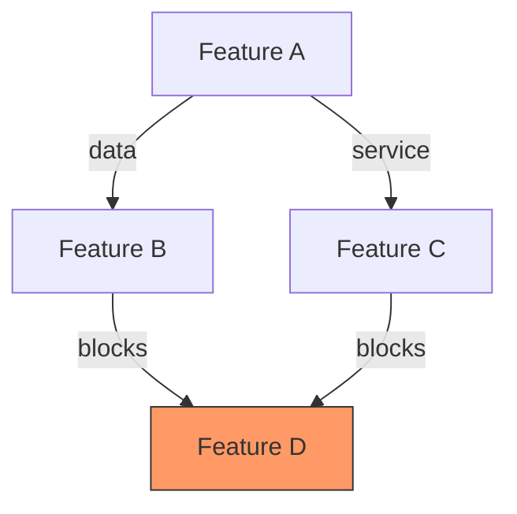
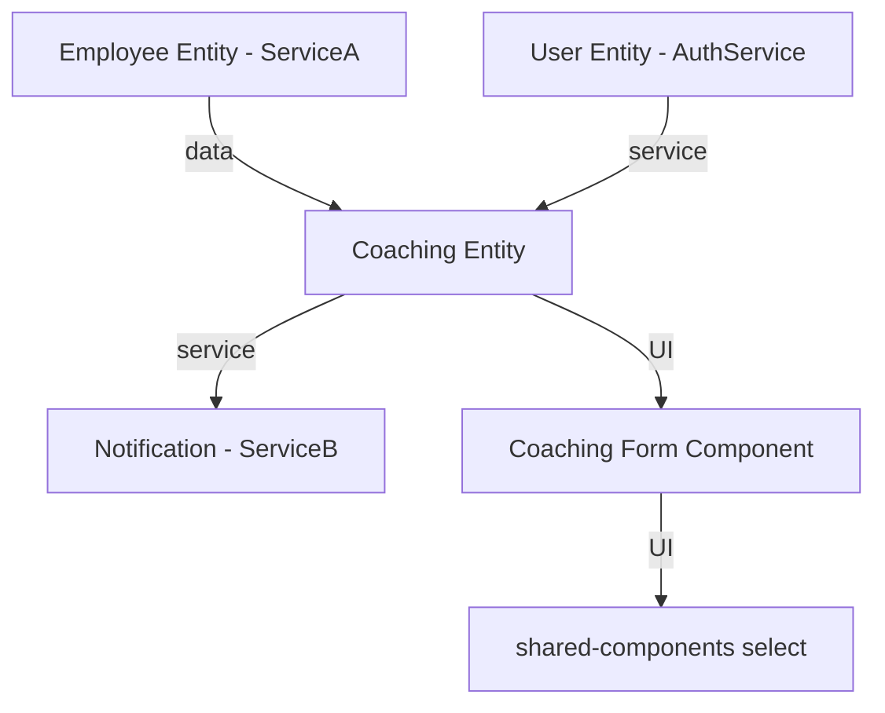
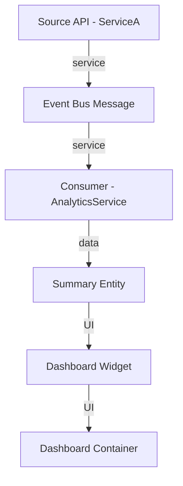

> **[IMPORTANT]** Use `TaskCreate` to break ALL work into small tasks BEFORE starting — including tasks for each file read. This prevents context loss from long files. For simple tasks, AI MUST ask user whether to skip.

**Prerequisites:** **MUST READ** before executing:

- `.claude/skills/shared/understand-code-first-protocol.md`
- `.claude/skills/shared/evidence-based-reasoning-protocol.md`

## Quick Summary

**Goal:** Analyze and visualize dependencies between features, services, or work items to identify blockers and critical paths.

**Workflow:**

1. **Identify Scope** — Single feature, module, or full release
2. **Classify Dependencies** — Data, Service, UI, or Infrastructure types
3. **Build Graph** — Create Mermaid dependency diagram
4. **Find Critical Path** — Longest blocking chain; mark ready-to-start items
5. **Deliver Report** — Summary, graph, critical path, risks

**Key Rules:**

- Respect microservice boundaries (cross-service = message bus only)
- Flag circular dependencies as errors
- Not for package/npm upgrades (use `package-upgrade` instead)

# Dependency Mapping

## Purpose

Analyze and visualize dependencies between features, services, modules, or work items to identify blockers, critical paths, and safe execution order.

## When to Use

- Planning feature implementation sequence across modules
- Identifying what blocks a specific feature or work item
- Mapping cross-service dependencies (backend-to-backend, frontend-to-backend)
- Understanding critical path for a release or milestone
- Analyzing impact of changing a shared module or entity

## When NOT to Use

- Single-service code changes with no cross-boundary impact -- just implement directly
- Performance analysis -- use `arch-performance-optimization` instead
- Security dependency auditing -- use `arch-security-review` instead
- Package/npm dependency upgrades -- use `package-upgrade` instead

## Prerequisites

- Read the feature/PBI/plan files to understand scope
- Access to `docs/claude/architecture.md` for service boundary reference
- Understand the project's microservice boundaries (search `src/Services/` for service list)

## Workflow

### Step 1: Identify Scope

Determine what to map:

- **Single feature**: Find all files, services, and entities it touches
- **Module/service**: Map all inbound and outbound dependencies
- **Release/milestone**: Map all features and their inter-dependencies

### Step 2: Classify Dependencies

For each dependency found, classify by type:

| Type               | Direction                      | Description                                 | Example                                                |
| ------------------ | ------------------------------ | ------------------------------------------- | ------------------------------------------------------ |
| **Data**           | Entity A requires Entity B     | Foreign key, navigation property, shared ID | Employee requires Company                              |
| **Service**        | Service A calls Service B      | Message bus, API call, event consumer       | Service A consumes entity events from Service B |
| **UI**             | Component A embeds Component B | Shared component, library dependency        | Feature form uses shared component library select |
| **Infrastructure** | Feature needs infra change     | Database migration, config, new queue       | New feature needs Redis cache key                      |

### Step 3: Build Dependency Graph

Use Mermaid syntax for visualization:



### Step 4: Identify Critical Path

- Find the longest chain of blocking dependencies
- Mark items with no blockers as "ready to start"
- Flag circular dependencies as errors

### Step 5: Deliver Report

Output structured dependency report (see Output Format).

## Output Format

```markdown
## Dependency Map: [Feature/Module Name]

### Summary

- Total items: N
- Ready to start: N (no blockers)
- Blocked: N
- Critical path length: N steps

### Dependency Graph

[Mermaid diagram]

### Critical Path

1. [Item A] -- no blockers, estimated: Xd
2. [Item B] -- blocked by: A, estimated: Xd
3. [Item C] -- blocked by: B, estimated: Xd

### Dependency Details

| Item | Type                  | Depends On | Blocks | Status        |
| ---- | --------------------- | ---------- | ------ | ------------- |
| ...  | data/service/UI/infra | ...        | ...    | ready/blocked |

### Risks

- [Circular dependency / tight coupling / single point of failure]
```

## Examples

### Example 1: Backend Cross-Service Feature

**Input**: "Map dependencies for adding a new Coaching feature in {ServiceA}"

**Analysis**:



**Critical path**: Employee Entity -> Coaching Entity -> Coaching API -> Coaching Form
**Ready to start**: Employee Entity already exists, shared component select exists
**Blocked**: Coaching Entity creation, then API, then UI

### Example 2: Frontend Module Dependency

**Input**: "What blocks the new Dashboard widget in {AnalyticsService}?"

**Analysis**:



**Blockers identified**:

1. Event Bus Message producer must exist in ServiceA (exists: yes)
2. Consumer must be created in AnalyticsService (exists: no -- BLOCKER)
3. Summary Entity for aggregated data (exists: no -- BLOCKER)

## Related Skills

- `project-manager` -- for sprint planning and status tracking
- `feature-implementation` -- for implementing features after dependency analysis
- `arch-cross-service-integration` -- for designing cross-service communication
- `package-upgrade` -- for npm/NuGet package dependency upgrades

---

**IMPORTANT Task Planning Notes (MUST FOLLOW)**

- Always plan and break work into many small todo tasks
- Always add a final review todo task to verify work quality and identify fixes/enhancements
