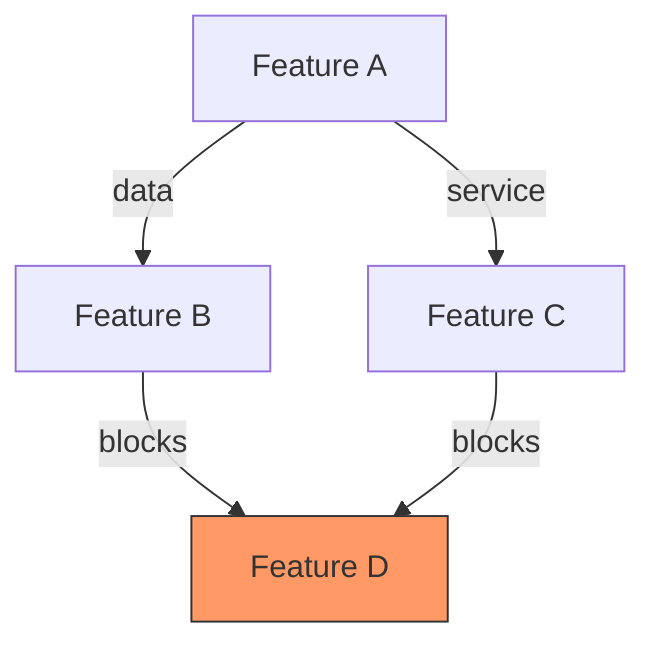
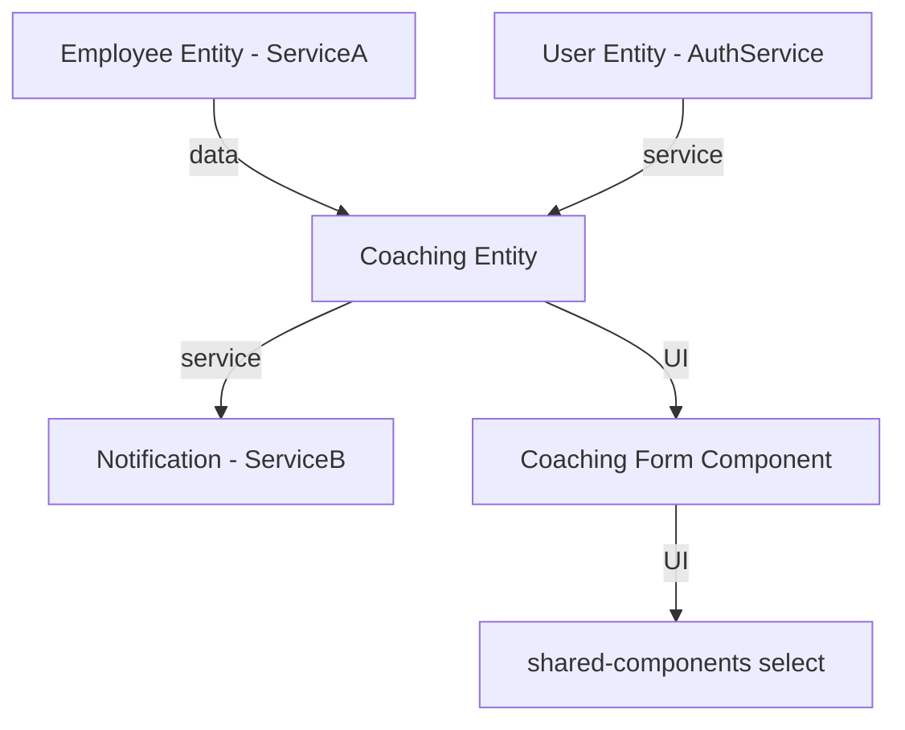
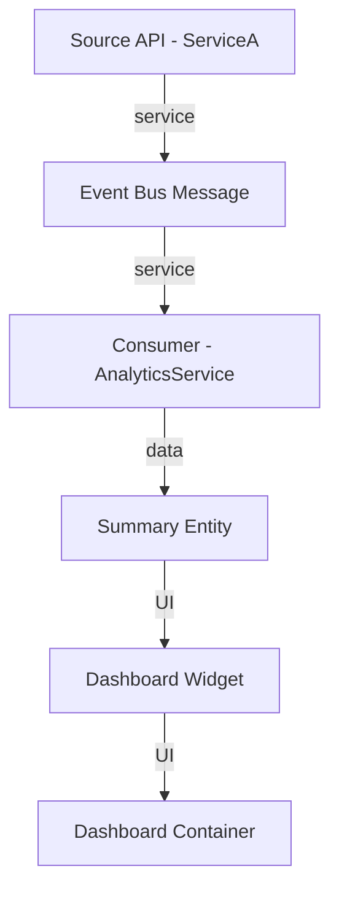

> **[IMPORTANT]** Use `TaskCreate` to break ALL work into small tasks BEFORE starting — including tasks for each file read. This prevents context loss from long files. For simple tasks, AI MUST ATTENTION ask user whether to skip.

<!-- SYNC:critical-thinking-mindset -->

> **Critical Thinking Mindset** — Apply critical thinking, sequential thinking. Every claim needs traced proof, confidence >80% to act.
> **Anti-hallucination:** Never present guess as fact — cite sources for every claim, admit uncertainty freely, self-check output for errors, cross-reference independently, stay skeptical of own confidence — certainty without evidence root of all hallucination.

<!-- /SYNC:critical-thinking-mindset -->

<!-- SYNC:ai-mistake-prevention -->

> **AI Mistake Prevention** — Failure modes to avoid on every task:
>
> - **Check downstream references before deleting.** Deleting components causes documentation and code staleness cascades. Map all referencing files before removal.
> - **Verify AI-generated content against actual code.** AI hallucinates APIs, class names, and method signatures. Always grep to confirm existence before documenting or referencing.
> - **Trace full dependency chain after edits.** Changing a definition misses downstream variables and consumers derived from it. Always trace the full chain.
> - **Trace ALL code paths when verifying correctness.** Confirming code exists is not confirming it executes. Always trace early exits, error branches, and conditional skips — not just happy path.
> - **When debugging, ask "whose responsibility?" before fixing.** Trace whether bug is in caller (wrong data) or callee (wrong handling). Fix at responsible layer — never patch symptom site.
> - **Assume existing values are intentional — ask WHY before changing.** Before changing any constant, limit, flag, or pattern: read comments, check git blame, examine surrounding code.
> - **Verify ALL affected outputs, not just the first.** Changes touching multiple stacks require verifying EVERY output. One green check is not all green checks.
> - **Holistic-first debugging — resist nearest-attention trap.** When investigating any failure, list EVERY precondition first (config, env vars, DB names, endpoints, DI registrations, data preconditions), then verify each against evidence before forming any code-layer hypothesis.
> - **Surgical changes — apply the diff test.** Bug fix: every changed line must trace directly to the bug. Don't restyle or improve adjacent code. Enhancement task: implement improvements AND announce them explicitly.
> - **Surface ambiguity before coding — don't pick silently.** If request has multiple interpretations, present each with effort estimate and ask. Never assume all-records, file-based, or more complex path.

<!-- /SYNC:ai-mistake-prevention -->

**Prerequisites:** **MUST ATTENTION READ** before executing:

<!-- SYNC:understand-code-first -->

> **Understand Code First** — HARD-GATE: Do NOT write, plan, or fix until you READ existing code.
>
> 1. Search 3+ similar patterns (`grep`/`glob`) — cite `file:line` evidence
> 2. Read existing files in target area — understand structure, base classes, conventions
> 3. Run `python .claude/scripts/code_graph trace <file> --direction both --json` when `.code-graph/graph.db` exists
> 4. Map dependencies via `connections` or `callers_of` — know what depends on your target
> 5. Write investigation to `.ai/workspace/analysis/` for non-trivial tasks (3+ files)
> 6. Re-read analysis file before implementing — never work from memory alone
> 7. NEVER invent new patterns when existing ones work — match exactly or document deviation
>
> **BLOCKED until:** `- [ ]` Read target files `- [ ]` Grep 3+ patterns `- [ ]` Graph trace (if graph.db exists) `- [ ]` Assumptions verified with evidence

<!-- /SYNC:understand-code-first -->

## Quick Summary

**Goal:** Analyze and visualize dependencies between features, services, or work items to identify blockers and critical paths.

**Workflow:**

1. **Identify Scope** — Single feature, module, or full release
2. **Classify Dependencies** — Data, Service, UI, or Infrastructure types
3. **Build Graph** — Create Mermaid dependency diagram
4. **Find Critical Path** — Longest blocking chain; mark ready-to-start items
5. **Deliver Report** — Summary, graph, critical path, risks

**Key Rules:**

- Respect microservice boundaries (cross-service = message bus only)
- Flag circular dependencies as errors
- Not for package/npm upgrades (use `package-upgrade` instead)

**Be skeptical. Apply critical thinking, sequential thinking. Every claim needs traced proof, confidence percentages (Idea should be more than 80%).**

# Dependency Mapping

## Purpose

Analyze and visualize dependencies between features, services, modules, or work items to identify blockers, critical paths, and safe execution order.

## When to Use

- Planning feature implementation sequence across modules
- Identifying what blocks a specific feature or work item
- Mapping cross-service dependencies (backend-to-backend, frontend-to-backend)
- Understanding critical path for a release or milestone
- Analyzing impact of changing a shared module or entity

## When NOT to Use

- Single-service code changes with no cross-boundary impact -- just implement directly
- Performance analysis -- use `arch-performance-optimization` instead
- Security dependency auditing -- use `arch-security-review` instead
- Package/npm dependency upgrades -- use `package-upgrade` instead

## Prerequisites

- Read the feature/PBI/plan files to understand scope
- Access to `docs/project-reference/project-structure-reference.md` for service boundary reference
- Understand the project's microservice boundaries (search `src/Services/` for service list)

## Workflow

### Step 1: Identify Scope

Determine what to map:

- **Single feature**: Find all files, services, and entities it touches
- **Module/service**: Map all inbound and outbound dependencies
- **Release/milestone**: Map all features and their inter-dependencies

### Step 2: Classify Dependencies

For each dependency found, classify by type:

| Type               | Direction                      | Description                                 | Example                                           |
| ------------------ | ------------------------------ | ------------------------------------------- | ------------------------------------------------- |
| **Data**           | Entity A requires Entity B     | Foreign key, navigation property, shared ID | Employee requires Company                         |
| **Service**        | Service A calls Service B      | Message bus, API call, event consumer       | Service A consumes entity events from Service B   |
| **UI**             | Component A embeds Component B | Shared component, library dependency        | Feature form uses shared component library select |
| **Infrastructure** | Feature needs infra change     | Database migration, config, new queue       | New feature needs Redis cache key                 |

### Step 3: Build Dependency Graph

Use Mermaid syntax for visualization:


```mermaid
graph TD
    A[Feature A] -->|data| B[Feature B]
    A -->|service| C[Feature C]
    B -->|blocks| D[Feature D]
    C -->|blocks| D
    style D fill:#f96,stroke:#333
```

### Step 4: Identify Critical Path

- Find the longest chain of blocking dependencies
- Mark items with no blockers as "ready to start"
- Flag circular dependencies as errors

### Step 5: Deliver Report

Output structured dependency report (see Output Format).

## Output Format

```markdown
## Dependency Map: [Feature/Module Name]

### Summary

- Total items: N
- Ready to start: N (no blockers)
- Blocked: N
- Critical path length: N steps

### Dependency Graph

[Mermaid diagram]

### Critical Path

1. [Item A] -- no blockers, estimated: Xd
2. [Item B] -- blocked by: A, estimated: Xd
3. [Item C] -- blocked by: B, estimated: Xd

### Dependency Details

| Item | Type                  | Depends On | Blocks | Status        |
| ---- | --------------------- | ---------- | ------ | ------------- |
| ...  | data/service/UI/infra | ...        | ...    | ready/blocked |

### Risks

- [Circular dependency / tight coupling / single point of failure]
```

## Examples

### Example 1: Backend Cross-Service Feature

**Input**: "Map dependencies for adding a new Coaching feature in {ServiceA}"

**Analysis**:


```mermaid
graph TD
    E[Employee Entity - ServiceA] -->|data| C[Coaching Entity]
    U[User Entity - AuthService] -->|service| C
    C -->|service| N[Notification - ServiceB]
    C -->|UI| CF[Coaching Form Component]
    CF -->|UI| BC[shared-components select]
```

**Critical path**: Employee Entity -> Coaching Entity -> Coaching API -> Coaching Form
**Ready to start**: Employee Entity already exists, shared component select exists
**Blocked**: Coaching Entity creation, then API, then UI

### Example 2: Frontend Module Dependency

**Input**: "What blocks the new Dashboard widget in {AnalyticsService}?"

**Analysis**:


```mermaid
graph TD
    GA[Source API - ServiceA] -->|service| GE[Event Bus Message]
    GE -->|service| GC[Consumer - AnalyticsService]
    GC -->|data| GS[Summary Entity]
    GS -->|UI| GW[Dashboard Widget]
    GW -->|UI| DC[Dashboard Container]
```

**Blockers identified**:

1. Event Bus Message producer must exist in ServiceA (exists: yes)
2. Consumer must be created in AnalyticsService (exists: no -- BLOCKER)
3. Summary Entity for aggregated data (exists: no -- BLOCKER)

## Related Skills

- `project-manager` -- for sprint planning and status tracking
- `feature-implementation` -- for implementing features after dependency analysis
- `arch-cross-service-integration` -- for designing cross-service communication
- `package-upgrade` -- for npm/NuGet package dependency upgrades

---

## Closing Reminders

- **MANDATORY IMPORTANT MUST ATTENTION** break work into small todo tasks using `TaskCreate` BEFORE starting
- **MANDATORY IMPORTANT MUST ATTENTION** search codebase for 3+ similar patterns before creating new code
- **MANDATORY IMPORTANT MUST ATTENTION** cite `file:line` evidence for every claim (confidence >80% to act)
- **MANDATORY IMPORTANT MUST ATTENTION** add a final review todo task to verify work quality
  **MANDATORY IMPORTANT MUST ATTENTION** READ the following files before starting:
      <!-- SYNC:understand-code-first:reminder -->
- **MANDATORY IMPORTANT MUST ATTENTION** search 3+ existing patterns and read code BEFORE any modification. Run graph trace when graph.db exists.
    <!-- /SYNC:understand-code-first:reminder -->
    <!-- SYNC:critical-thinking-mindset:reminder -->
- **MUST ATTENTION** apply critical thinking — every claim needs traced proof, confidence >80% to act. Anti-hallucination: never present guess as fact.
    <!-- /SYNC:critical-thinking-mindset:reminder -->
    <!-- SYNC:ai-mistake-prevention:reminder -->
- **MUST ATTENTION** apply AI mistake prevention — holistic-first debugging, fix at responsible layer, surface ambiguity before coding, re-read files after compaction.
    <!-- /SYNC:ai-mistake-prevention:reminder -->

**[TASK-PLANNING]** Before acting, analyze task scope and systematically break it into small todo tasks and sub-tasks using TaskCreate.
