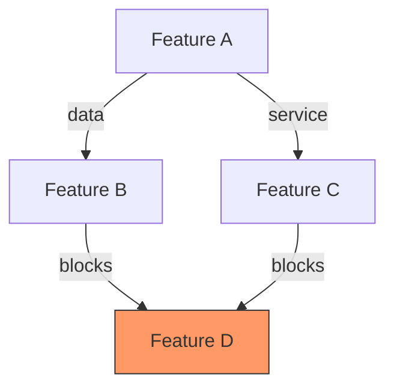
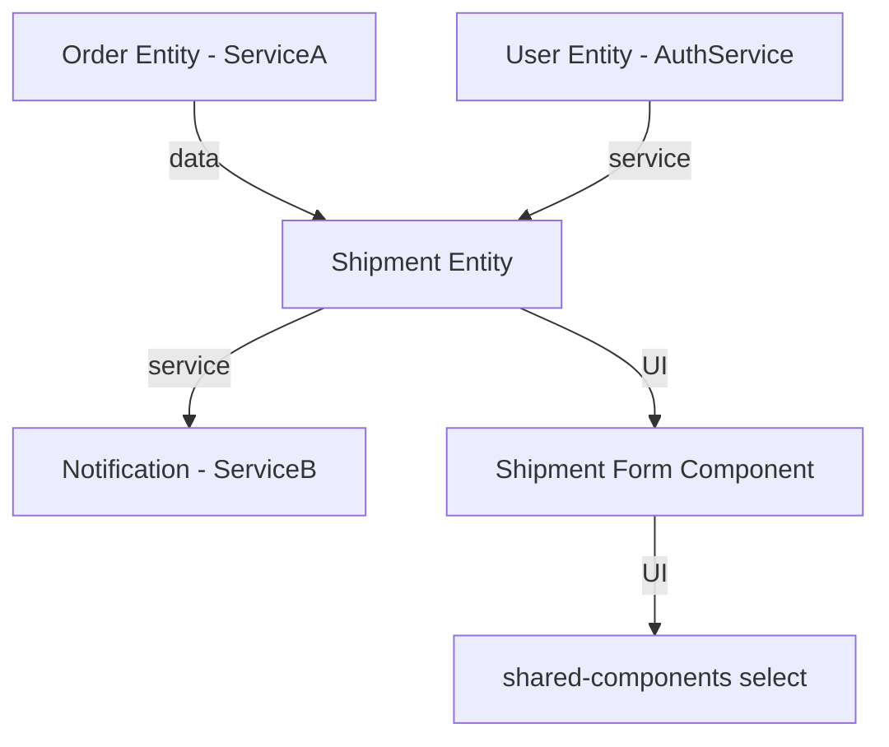
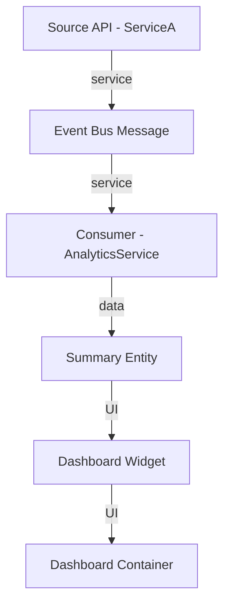

## Quick Summary

**Goal:** Analyze and visualize dependencies between features, services, or work items to identify blockers and critical paths.

**Workflow:**

1. **Identify Scope** — Single feature, module, or full release
2. **Classify Dependencies** — Data, Service, UI, or Infrastructure types
3. **Build Graph** — Create Mermaid dependency diagram
4. **Find Critical Path** — Longest blocking chain; mark ready-to-start items
5. **Deliver Report** — Summary, graph, critical path, risks

**Key Rules:**

- Respect microservice boundaries (cross-service = message bus only)
- Flag circular dependencies as errors
- Not for package/npm upgrades (use `package-upgrade` instead)

**Be skeptical. Apply critical thinking, sequential thinking. Every claim needs traced proof, confidence percentages (Idea should be more than 80%).**

# Dependency Mapping

## Purpose

Analyze and visualize dependencies between features, services, modules, or work items to identify blockers, critical paths, and safe execution order.

## When to Use

- Planning feature implementation sequence across modules
- Identifying what blocks a specific feature or work item
- Mapping cross-service dependencies (backend-to-backend, frontend-to-backend)
- Understanding critical path for a release or milestone
- Analyzing impact of changing a shared module or entity

## When NOT to Use

- Single-service code changes with no cross-boundary impact -- just implement directly
- Performance analysis -- use `performance` instead
- Security dependency auditing -- use `security-review` instead
- Package/npm dependency upgrades -- use `package-upgrade` instead

## Prerequisites

- Read the feature/PBI/plan files to understand scope
- Access to `docs/project-reference/project-structure-reference.md` for service boundary reference
- Understand the project's microservice boundaries (read the project's structure reference / `docs/project-config.json` for the service-root location, then list the services under it)

## Workflow

### Step 1: Identify Scope

Determine what to map:

- **Single feature**: Find all files, services, and entities it touches
- **Module/service**: Map all inbound and outbound dependencies
- **Release/milestone**: Map all features and their inter-dependencies

### Step 2: Classify Dependencies

For each dependency found, classify by type:

| Type               | Direction                      | Description                                 | Example                                           |
| ------------------ | ------------------------------ | ------------------------------------------- | ------------------------------------------------- |
| **Data**           | Entity A requires Entity B     | Foreign key, navigation property, shared ID | Order requires Customer                           |
| **Service**        | Service A calls Service B      | Message bus, API call, event consumer       | Service A consumes entity events from Service B   |
| **UI**             | Component A embeds Component B | Shared component, library dependency        | Feature form uses shared component library select |
| **Infrastructure** | Feature needs infra change     | Database migration, config, new queue       | New feature needs Redis cache key                 |

### Step 3: Build Dependency Graph

Use Mermaid syntax for visualization:


```mermaid
graph TD
    A[Feature A] -->|data| B[Feature B]
    A -->|service| C[Feature C]
    B -->|blocks| D[Feature D]
    C -->|blocks| D
    style D fill:#f96,stroke:#333
```

### Step 4: Identify Critical Path

- Find the longest chain of blocking dependencies
- Mark items with no blockers as "ready to start"
- Flag circular dependencies as errors

### Step 5: Deliver Report

Output structured dependency report (see Output Format).

## Output Format

```markdown
## Dependency Map: [Feature/Module Name]

### Summary

- Total items: N
- Ready to start: N (no blockers)
- Blocked: N
- Critical path length: N steps

### Dependency Graph

[Mermaid diagram]

### Critical Path

1. [Item A] -- no blockers, estimated: Xd
2. [Item B] -- blocked by: A, estimated: Xd
3. [Item C] -- blocked by: B, estimated: Xd

### Dependency Details

| Item | Type                  | Depends On | Blocks | Status        |
| ---- | --------------------- | ---------- | ------ | ------------- |
| ...  | data/service/UI/infra | ...        | ...    | ready/blocked |

### Risks

- [Circular dependency / tight coupling / single point of failure]
```

## Examples

### Example 1: Backend Cross-Service Feature

**Input**: "Map dependencies for adding a new Shipment feature in {ServiceA}"

**Analysis**:


```mermaid
graph TD
    E[Order Entity - ServiceA] -->|data| C[Shipment Entity]
    U[User Entity - AuthService] -->|service| C
    C -->|service| N[Notification - ServiceB]
    C -->|UI| CF[Shipment Form Component]
    CF -->|UI| BC[shared-components select]
```

**Critical path**: Order Entity -> Shipment Entity -> Shipment API -> Shipment Form
**Ready to start**: Order Entity already exists, shared component select exists
**Blocked**: Shipment Entity creation, then API, then UI

### Example 2: Frontend Module Dependency

**Input**: "What blocks the new Dashboard widget in {AnalyticsService}?"

**Analysis**:


```mermaid
graph TD
    GA[Source API - ServiceA] -->|service| GE[Event Bus Message]
    GE -->|service| GC[Consumer - AnalyticsService]
    GC -->|data| GS[Summary Entity]
    GS -->|UI| GW[Dashboard Widget]
    GW -->|UI| DC[Dashboard Container]
```

**Blockers identified**:

1. Event Bus Message producer must exist in ServiceA (exists: yes)
2. Consumer must be created in AnalyticsService (exists: no -- BLOCKER)
3. Summary Entity for aggregated data (exists: no -- BLOCKER)

## Related Skills

- `project-manager` -- for sprint planning and status tracking
- `workflow-feature` -- for implementing features after dependency analysis
- `package-upgrade` -- for npm/NuGet package dependency upgrades

---

> **[IMPORTANT]** Use `TaskCreate` to break ALL work into small tasks BEFORE starting — including tasks for each file read. This prevents context loss from long files. For simple tasks, AI MUST ATTENTION ask user whether to skip.

**Prerequisites:** **MUST ATTENTION READ** before executing:

<!-- SYNC:ai-mistake-prevention -->

> **AI Mistake Prevention** — Failure modes to avoid on every task:
>
> **Re-read files after context changes.** Context compaction, resume, or long-running work can make memory stale; verify current files before acting.
> **Verify generated content against source evidence.** AI hallucinates APIs, names, claims, and document facts. Check the relevant source before documenting or referencing.
> **Check downstream references before deleting or renaming.** Removing an artifact can stale docs, generated mirrors, configs, and callers; map references first.
> **Trace the full impact chain after edits.** Changing a definition can miss derived outputs and consumers. Follow the affected chain before declaring done.
> **Verify ALL affected outputs, not just the first.** One green check is not all green checks; validate every output surface the change can affect.
> **Assume existing values are intentional — ask WHY before changing.** Before changing a constant, limit, flag, wording, or pattern, read nearby context and history.
> **Surface ambiguity before acting — don't pick silently.** Multiple valid interpretations require an explicit question or stated assumption with risk.
> **Keep shared guidance role-relevant.** Universal guidance must help every receiving skill or agent; code-specific obligations belong only in code-specific protocols.

<!-- /SYNC:ai-mistake-prevention -->

<!-- SYNC:critical-thinking-mindset -->

> **Critical Thinking Mindset** — Apply critical thinking, sequential thinking. Every claim needs traced proof, confidence >80% to act.
> **Anti-hallucination:** Never present guess as fact — cite sources for every claim, admit uncertainty freely, self-check output for errors, cross-reference independently, stay skeptical of own confidence — certainty without evidence root of all hallucination.

<!-- /SYNC:critical-thinking-mindset -->

<!-- SYNC:understand-code-first -->

> **Understand Code First** — HARD-GATE: Do NOT write, plan, or fix until you READ existing code.
>
> 1. Search 3+ similar patterns (`grep`/`glob`) — cite `file:line` evidence
> 2. Read existing files in target area — understand structure, base classes, conventions
> 3. Run `python .claude/scripts/code_graph trace <file> --direction both --json` when `.code-graph/graph.db` exists
> 4. Map dependencies via `connections` or `callers_of` — know what depends on your target
> 5. Write investigation to `.ai/workspace/analysis/` for non-trivial tasks (3+ files)
> 6. Re-read analysis file before implementing — never work from memory alone. — why: long context drifts from the file; the file is ground truth
> 7. NEVER invent new patterns when existing ones work — match exactly or document deviation. — why: divergent patterns fragment the codebase and slow every future reader
>
> **BLOCKED until:** `- [ ]` Read target files `- [ ]` Grep 3+ patterns `- [ ]` Graph trace (if graph.db exists) `- [ ]` Assumptions verified with evidence

<!-- /SYNC:understand-code-first -->

<!-- SYNC:understand-code-first:reminder -->

- **MANDATORY IMPORTANT MUST ATTENTION** search 3+ existing patterns and read code BEFORE any modification. Run graph trace when graph.db exists.
  <!-- /SYNC:understand-code-first:reminder -->

<!-- SYNC:evidence-based-reasoning:reminder -->

- **MANDATORY IMPORTANT MUST ATTENTION** cite `file:line` evidence for every claim. Confidence >80% to act, <60% = do NOT recommend.
  <!-- /SYNC:evidence-based-reasoning:reminder -->

<!-- SYNC:critical-thinking-mindset:reminder -->

**MUST ATTENTION** apply critical + sequential thinking — every claim needs appropriate traced evidence (`file:line` for repo/code claims; source URL or artifact section for research, product, content, and docs claims); confidence >80% to act, <60% DO NOT recommend. Anti-hallucination: never present guess as fact, admit uncertainty freely, cross-reference independently, stay skeptical of own confidence.

<!-- /SYNC:critical-thinking-mindset:reminder -->

<!-- SYNC:ai-mistake-prevention:reminder -->

**MUST ATTENTION** apply AI mistake prevention — verify generated content against evidence, trace downstream references before deleting or renaming, verify all affected outputs, re-read files after context loss, and surface ambiguity before acting.

<!-- /SYNC:ai-mistake-prevention:reminder -->

## Closing Reminders

**Protocols in force (concise digest of the SYNC/shared blocks this skill carries):**

- **AI Mistakes:** holistic-first debug, fix at responsible layer, surgical diff, verify all outputs.
- **Critical Thinking:** traced proof per claim, confidence >80% to act, NEVER guess.
- **Understand Code:** read code and grep 3+ patterns before any modification.

- **MANDATORY IMPORTANT MUST ATTENTION** break work into small todo tasks using `TaskCreate` BEFORE starting
- **MANDATORY IMPORTANT MUST ATTENTION** search codebase for 3+ similar patterns before creating new code
- **MANDATORY IMPORTANT MUST ATTENTION** cite `file:line` evidence for every claim (confidence >80% to act)
- **MANDATORY IMPORTANT MUST ATTENTION** add a final review todo task to verify work quality
  **MANDATORY IMPORTANT MUST ATTENTION** READ the following files before starting:

**[TASK-PLANNING]** Before acting, analyze task scope and systematically break it into small todo tasks and sub-tasks using TaskCreate.
