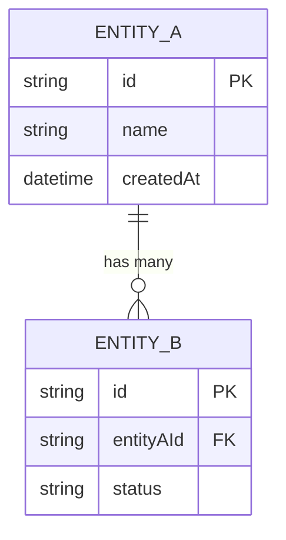

**MANDATORY IMPORTANT MUST** use `TaskCreate` to break ALL work into small tasks BEFORE starting.
**MANDATORY IMPORTANT MUST** use `AskUserQuestion` at EVERY decision point — validate every bounded context and entity relationship with user.
**MANDATORY IMPORTANT MUST** produce ERD diagram (Mermaid) and domain model report with confidence %.

## Quick Summary

**Goal:** Analyze business domain using DDD principles. Identify bounded contexts, aggregates, entities, value objects, domain events, and cross-context relationships. Generate domain model report with ERD diagram.

**Workflow:**

1. **Load Business Context** — Read idea, business evaluation, refined PBI artifacts
2. **Identify Bounded Contexts** — Group related concepts, define context boundaries
3. **Model Entities & Aggregates** — Define aggregates, entities, value objects per context
4. **Map Relationships** — Entity relationships, cross-context integration points
5. **Domain Events** — Identify events that cross context boundaries
6. **Generate ERD** — Mermaid ER diagram with all entities and relationships
7. **User Validation** — Present model, ask 5-8 questions, confirm decisions

**Key Rules:**

- **MANDATORY IMPORTANT MUST** validate every bounded context boundary with user
- **MANDATORY IMPORTANT MUST** include Mermaid ERD diagram in report
- **MANDATORY IMPORTANT MUST** run user validation interview at end (never skip)
- Every entity must belong to exactly one bounded context
- Cross-context communication via domain events only (no direct references)

**Be skeptical. Apply critical thinking, sequential thinking. Every claim needs traced proof, confidence percentages (Idea should be more than 80%).**

## Step 1: Load Business Context

Read artifacts from prior workflow steps (search in `plans/` and `team-artifacts/`):

- Business evaluation report (value proposition, customer segments)
- Refined PBI (acceptance criteria, user stories, features)
- Discovery interview notes (problem statement, user roles)

Extract and list:

- **Nouns** — Candidate entities (user, order, product, etc.)
- **Verbs** — Candidate domain events (created, approved, assigned, etc.)
- **Roles** — User types with different permissions/views
- **Processes** — Business workflows (application flow, review cycle, etc.)

## Step 2: Identify Bounded Contexts

Group related entities into bounded contexts using DDD principles:

```markdown
### Bounded Context: {Name}

**Purpose:** {What this context owns — one sentence}
**Core domain / Supporting / Generic:** {classification}
**Key Responsibility:** {primary business capability}
**Team ownership:** {suggested team or role}
```

Rules for context boundaries:

- Each context has its own ubiquitous language
- Entities with same name but different meaning = different contexts
- Minimize cross-context dependencies
- Consider team structure (Conway's Law)

**MANDATORY IMPORTANT MUST** present identified contexts to user via `AskUserQuestion`:

- "I identified {N} bounded contexts: {list}. Does this grouping make sense?"
- Options: Agree (Recommended) | Merge {X} and {Y} | Split {Z} | Add missing context

## Step 3: Model Entities & Aggregates

For each bounded context, define:

```markdown
### {Context Name}

**Aggregate Root:** {EntityName}

- **Entities:** {list with descriptions}
- **Value Objects:** {list — immutable, no identity}
- **Invariants:** {business rules this aggregate enforces}

**Other Entities:**

- {Entity} — {purpose, key fields}
```

### Entity Detail Template

| Entity | Type                                   | Key Fields | Relationships | Notes            |
| ------ | -------------------------------------- | ---------- | ------------- | ---------------- |
| {Name} | Aggregate Root / Entity / Value Object | {fields}   | {relations}   | {business rules} |

## Step 4: Map Relationships

### Intra-Context Relationships

```markdown
| From | To        | Type | Cardinality     | Description              |
| ---- | --------- | ---- | --------------- | ------------------------ |
| Job  | Candidate | M:N  | via Application | Candidates apply to jobs |
```

### Cross-Context Integration (Context Map)

```markdown
| Upstream Context | Downstream Context | Pattern | Integration Point          |
| ---------------- | ------------------ | ------- | -------------------------- |
| Recruitment      | Employee           | ACL     | Candidate becomes Employee |
```

Integration patterns to consider:

- **Shared Kernel** — shared model between contexts
- **Customer-Supplier** — upstream publishes, downstream consumes
- **Anti-Corruption Layer (ACL)** — translation between contexts
- **Published Language** — shared API contract
- **Conformist** — downstream conforms to upstream model

## Step 5: Domain Events

Identify events that cross bounded context boundaries:

| Event          | Source Context | Target Context(s)    | Payload            | Trigger        |
| -------------- | -------------- | -------------------- | ------------------ | -------------- |
| CandidateHired | Recruitment    | Employee, Onboarding | candidateId, jobId | Offer accepted |

Rules:

- Events are past-tense (happened already)
- Events carry minimal data (IDs + essential fields)
- Eventual consistency between contexts

## Step 6: Generate ERD

Produce Mermaid ER diagram covering all bounded contexts:

````markdown

````

ERD requirements:

- Group entities by bounded context (use Mermaid comments)
- Show PK/FK fields
- Show cardinality (1:1, 1:N, M:N)
- Include key business fields (not all fields)
- Cross-context references shown as dotted lines or separate diagrams

## Step 7: User Validation Interview

**MANDATORY IMPORTANT MUST** present domain model and ask 5-8 questions via `AskUserQuestion`:

### Required Questions

1. **Context boundaries** — "Are these {N} bounded contexts correct? Any missing or misplaced?"
    - Options: Correct (Recommended) | Need changes | Not sure, explain more
2. **Aggregate roots** — "Is {Entity} the right aggregate root for {Context}?"
3. **Relationship verification** — "The {Entity A} to {Entity B} relationship is {type}. Correct?"
4. **Missing entities** — "Are there business concepts I haven't captured?"
5. **Event verification** — "When {event} happens, should {contexts} be notified?"

### Deep-Dive Questions (pick 2-3 based on complexity)

- "Should {Entity} be a separate aggregate or part of {Aggregate}?"
- "Is {field} really a value object or does it need its own identity?"
- "How does {process} work step-by-step? (verify workflow)"
- "What happens when {edge case}? (verify invariants)"
- "Which entities change most frequently? (performance hints)"

After user confirms, update report with final decisions and mark as `status: confirmed`.

## Output

```
{plan-dir}/research/domain-analysis.md          # Full domain analysis report
{plan-dir}/phase-01-domain-model.md             # Confirmed domain model with ERD
```

Report structure:

1. Executive summary (bounded contexts + entity count)
2. Bounded context map with responsibilities
3. Per-context entity/aggregate detail
4. Relationship tables (intra + cross-context)
5. Domain events catalog
6. Mermaid ERD diagram
7. Unresolved questions

Report must be **<=200 lines**. Use tables over prose.

---

**MANDATORY IMPORTANT MUST** break work into small todo tasks using `TaskCreate` BEFORE starting.
**MANDATORY IMPORTANT MUST** validate EVERY bounded context and key relationship with user via `AskUserQuestion`.
**MANDATORY IMPORTANT MUST** include Mermaid ERD and confidence % for all architectural decisions.
**MANDATORY IMPORTANT MUST** add a final review todo task to verify work quality.
