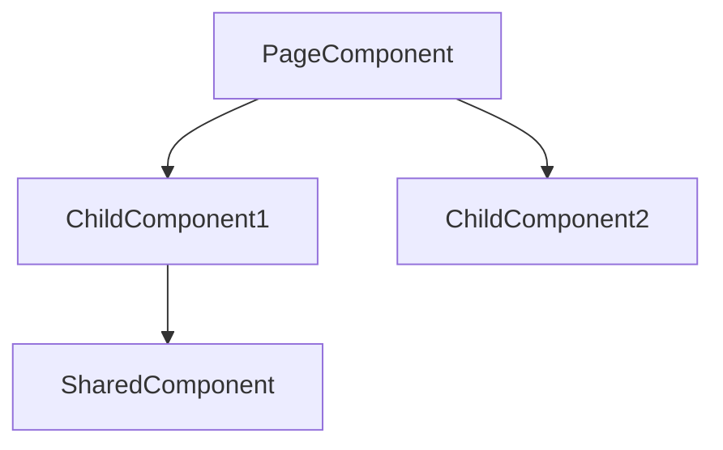

## Anti-Hallucination Requirement

Read: `.claude/skills/shared/anti-hallucination-protocol.md`
Read: `references/confidence-scoring-guide.md`

**Every claimed match MUST have grep-verified evidence.** HALT if confidence <85% — show candidates, never fabricate.

## Workflow

### Step 1: Load Component Index

```bash
# Full scan (rebuild entire index):
node .claude/skills/find-component/scripts/generate-component-index.cjs

# Incremental (only re-scan git-changed component files):
node .claude/skills/find-component/scripts/generate-component-index.cjs --git-changes

# Then read:
Read: docs/component-index.json
```

**When to use which mode:**
- `--git-changes` — fast update after editing components (merges into existing index)
- No flag — full rebuild when index missing, stale, or after major refactors
- Fallback: live grep if index unavailable

### Step 2: Extract Visual Signals from Screenshot

Read: `references/visual-signal-extraction.md`

Read the screenshot. Extract 6 signal types (text, BEM, Material, layout, color, data shape). List each signal with what you ACTUALLY see — never infer.

### Step 3: Bottom-Up Component Search

Read: `references/component-matching-protocol.md`

1. **Reusable components first** — match signals against `platform-core/` and `libs/` components
2. **Domain components** — match against `shared/components/`
3. **Page component** — find parent that composes matched children
4. If no reusable match → search page templates directly

### Step 4: Score Confidence

Read: `references/confidence-scoring-guide.md`

- ≥85% (≥2 grep-verified signals) → report as confirmed match
- <85% → show top candidates with per-signal breakdown, ask user

### Step 5: Build Component Relationship Graph

Output Mermaid diagram:



Verify each edge by reading actual template HTML. Never infer from imports alone.

### Step 6: Report

Output: matched components, file paths (TS/HTML/SCSS), confidence %, Mermaid graph, and any unresolved ambiguities.

## Integration — Pre-Scout Activation (IMPORTANT)

When a screenshot is pasted with UI-related intent (fix, update, find, debug), this skill
runs **BEFORE `/scout`** in any workflow. It narrows the search scope so scout is targeted.

**Auto-activation priority:** `/find-component` → `/scout` → remaining workflow steps

Applies to: `bugfix`, `feature`, `refactor`, `fix-ui`, `verification` workflows.
Output (matched file paths + component graph) feeds directly into scout/investigate steps.
