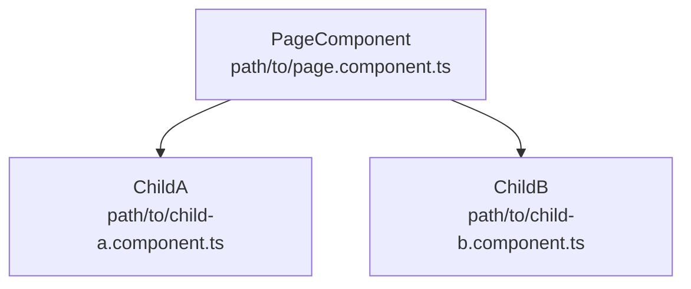

# Component Matching Protocol

4-phase bottom-up algorithm. Find reusable components first, then trace to page component.

## Phase 1: REUSABLE COMPONENT SCAN

Search order (most reusable → least):
1. `Glob: **/libs/platform-core/**/*.component.html` — framework components
2. `Glob: **/libs/apps-domains/**/*.component.html` — domain components
3. `Glob: **/shared/components/**/*.component.html` — app-level shared

For each signal extracted:
```
Grep: pattern="signal-text" glob="*.component.html" path="src/Frontend/libs/"
Grep: pattern="signal-text" glob="*.component.html" path="src/Frontend/apps/**/shared/"
```

Collect matches → score each (see confidence-scoring-guide.md).

## Phase 2: PAGE COMPONENT IDENTIFICATION

**If Phase 1 found children:**
1. Get child component selectors from their `.component.ts` files
2. Grep for those selectors in parent templates:
   ```
   Grep: pattern="<child-selector" glob="*.component.html" path="src/Frontend/apps/"
   ```
3. The template containing the child selector IS the parent page component

**If Phase 1 found nothing:**
1. Search app-level templates directly with text/BEM signals
2. `Glob: **/apps/**/src/app/**/*.component.html`
3. Grep each template for extracted signals

## Phase 3: COMPONENT RELATIONSHIP GRAPH

For matched page component:
1. Read its template HTML
2. List all `<child-selector>` tags found
3. For each child, read ITS template and find grandchildren
4. Output Mermaid diagram:



**VERIFY each edge** by reading actual HTML. Never infer from TS imports.

## Phase 4: REPORT FORMAT

```markdown
## Component Match Report

### Matched Component(s)
| Component | Confidence | File Path |
|-----------|-----------|-----------|
| TaskListComponent | 92% | src/Frontend/.../task-list/ |

### Signal Evidence
| Signal | Type | Found At | Score |
|--------|------|----------|-------|
| "Search tasks" | Text | task-list.component.html:15 | +30% |
| mat-chip-listbox | Material | task-list.component.html:42 | +20% |
| .task-list BEM | BEM Class | task-list.component.html:1 | +25% |

### Component Graph
(Mermaid diagram)

### Files
- TS: `path/to/component.ts`
- HTML: `path/to/component.html`
- SCSS: `path/to/component.scss`
- Store: `path/to/component.store.ts` (if exists)
```

## Fallback: Component Index

If live grep is slow or incomplete:
```bash
node .claude/skills/find-component/scripts/generate-component-index.cjs
Read: docs/component-index.json
```

Match signals against index entries first, then verify with live grep.
