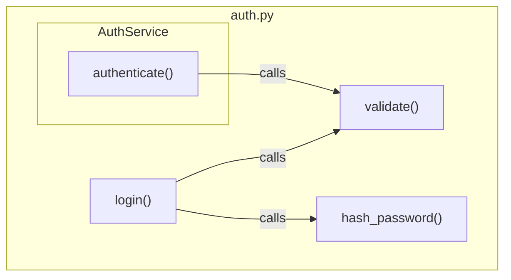

# Export Graph as Mermaid Diagram

Export a single file's internal graph structure from `.code-graph/graph.db` as a Mermaid flowchart in a markdown file.

## Prerequisites

- Graph must be built first: run `/graph-build` if `.code-graph/graph.db` doesn't exist
- Requires Python 3.10+ with tree-sitter, tree-sitter-language-pack, networkx

## Steps

1. **Export file graph as Mermaid** — Run via Bash (positional or `--file` flag both work):

    ```bash
    python .claude/scripts/code_graph export-mermaid <relative-path> --json
    # OR
    python .claude/scripts/code_graph export-mermaid --file <relative-path> --json
    ```

    Default output: `.code-graph/<path-based-unique-name>-graph.md` (e.g., `docs--project-config-graph.md`)

2. **Custom output path** (optional):

    ```bash
    python .claude/scripts/code_graph export-mermaid <relative-path> -o custom-path.md --json
    ```

3. **Report results:** File path, node count, edge count.

## Output Format

````markdown
# Graph: src/auth.py


````

## What's Included

- Functions, classes, and test functions within the file
- Internal call relationships (both caller and callee in the file)
- Class membership shown via nested subgraphs
- Edge types: calls, imports, inherits, implements, tests, depends
- **Non-code files (markdown, JSON):** renders outgoing and incoming `IMPORTS_FROM` edges as a reference graph

## What's Excluded

- External/stdlib function calls (e.g., `parseInt`, `trim`)
- Cross-file relationships for code files (callers from other files)
- CONTAINS edges (shown structurally via subgraphs instead)

## Implicit Edge Types

Mermaid diagrams include implicit edges when present in the graph:

- `MESSAGE_BUS` edges show cross-service message flow
- `TRIGGERS_EVENT` edges show entity-to-event-handler relationships
- `API_ENDPOINT` edges show frontend-to-backend API connections

These edges are rendered alongside structural edges (CALLS, IMPORTS_FROM, INHERITS).

## Use Cases

- Visualize a file's internal function call graph
- Understand code structure before refactoring
- Document architecture in markdown-compatible format
- Review file complexity and coupling

---

## Closing Reminders

- **MANDATORY IMPORTANT MUST ATTENTION** break work into small todo tasks using `TaskCreate` BEFORE starting
- **MANDATORY IMPORTANT MUST ATTENTION** search codebase for 3+ similar patterns before creating new code
- **MANDATORY IMPORTANT MUST ATTENTION** cite `file:line` evidence for every claim (confidence >80% to act)
- **MANDATORY IMPORTANT MUST ATTENTION** add a final review todo task to verify work quality
