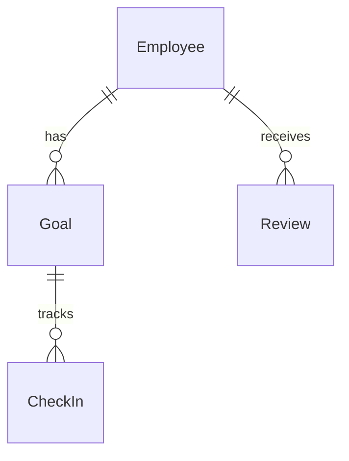

> **[IMPORTANT]** Use `TaskCreate` to break ALL work into small tasks BEFORE starting — including tasks for each file read. This prevents context loss from long files. For simple tasks, AI MUST ATTENTION ask user whether to skip.

<!-- SYNC:critical-thinking-mindset -->

> **Critical Thinking Mindset** — Apply critical thinking, sequential thinking. Every claim needs traced proof, confidence >80% to act.
> **Anti-hallucination:** Never present guess as fact — cite sources for every claim, admit uncertainty freely, self-check output for errors, cross-reference independently, stay skeptical of own confidence — certainty without evidence root of all hallucination.

<!-- /SYNC:critical-thinking-mindset -->

<!-- SYNC:ai-mistake-prevention -->

> **AI Mistake Prevention** — Failure modes to avoid on every task:
>
> - **Check downstream references before deleting.** Deleting components causes documentation and code staleness cascades. Map all referencing files before removal.
> - **Verify AI-generated content against actual code.** AI hallucinates APIs, class names, and method signatures. Always grep to confirm existence before documenting or referencing.
> - **Trace full dependency chain after edits.** Changing a definition misses downstream variables and consumers derived from it. Always trace the full chain.
> - **Trace ALL code paths when verifying correctness.** Confirming code exists is not confirming it executes. Always trace early exits, error branches, and conditional skips — not just happy path.
> - **When debugging, ask "whose responsibility?" before fixing.** Trace whether bug is in caller (wrong data) or callee (wrong handling). Fix at responsible layer — never patch symptom site.
> - **Assume existing values are intentional — ask WHY before changing.** Before changing any constant, limit, flag, or pattern: read comments, check git blame, examine surrounding code.
> - **Verify ALL affected outputs, not just the first.** Changes touching multiple stacks require verifying EVERY output. One green check is not all green checks.
> - **Holistic-first debugging — resist nearest-attention trap.** When investigating any failure, list EVERY precondition first (config, env vars, DB names, endpoints, DI registrations, data preconditions), then verify each against evidence before forming any code-layer hypothesis.
> - **Surgical changes — apply the diff test.** Bug fix: every changed line must trace directly to the bug. Don't restyle or improve adjacent code. Enhancement task: implement improvements AND announce them explicitly.
> - **Surface ambiguity before coding — don't pick silently.** If request has multiple interpretations, present each with effort estimate and ask. Never assume all-records, file-based, or more complex path.

<!-- /SYNC:ai-mistake-prevention -->

**Prerequisites:** **MUST ATTENTION READ** before executing:

<!-- SYNC:scan-and-update-reference-doc -->

> **Scan & Update Reference Doc** — When updating reference docs: (1) Read existing doc first. (2) Scan codebase for current state (grep/glob). (3) Diff findings vs doc content. (4) Update ONLY sections where code diverged from doc. (5) Preserve manual annotations. (6) Update metadata (date, counts). NEVER rewrite entire doc — surgical updates only.

<!-- /SYNC:scan-and-update-reference-doc -->

<!-- SYNC:output-quality-principles -->

> **Output Quality** — Reference docs are injected into AI context. Apply 10 rules: (1) No inventories/counts — AI can grep. (2) No directory trees — AI can glob. (3) No TOCs. (4) Rules > descriptions — "MUST ATTENTION use X" not "X allows you to...". (5) 1 example per pattern. (6) Tables > prose. (7) BAD/GOOD pairs: 2-3 lines each. (8) Primacy-recency anchoring — critical rules in first AND last 5 lines. (9) No checkbox checklists — bullets force reading. (10) Density target: >=8 MUST ATTENTION/NEVER/ALWAYS per 100 lines.

<!-- /SYNC:output-quality-principles -->

## Quick Summary

**Goal:** Scan project codebase and populate `docs/project-reference/domain-entities-reference.md` with domain entities, data models, DTOs, aggregate boundaries, cross-service entity sync maps, and Mermaid ER diagrams. (content auto-injected by hook — check for [Injected: ...] header before reading)

**Workflow:**

1. **Read** — Load current target doc, detect init vs sync mode
2. **Scan** — Discover entities, models, DTOs, relationships via parallel sub-agents
3. **Report** — Write findings to external report file
4. **Generate** — Build/update reference doc from report
5. **Verify** — Validate entity references point to real files

**Key Rules:**

- Generic — works with any framework (.NET, Node.js, Java, Python, game engines, etc.)
- Detect framework first, then scan for framework-specific entity patterns
- For microservices: unify cross-service entities (identify owner vs consumer services)
- Every entity reference must come from actual project files with file:line references
- Detail level: summary + key properties (IDs, FKs, status fields, relationships) — NOT full property listing

**Be skeptical. Apply critical thinking, sequential thinking. Every claim needs traced proof, confidence percentages (Idea should be more than 80%).**

# Scan Domain Entities

## Phase 0: Read & Assess

1. Read `docs/project-reference/domain-entities-reference.md`
2. Detect mode: init (placeholder) or sync (populated)
3. If sync: extract existing sections and note what's already documented

## Phase 1: Plan Scan Strategy

### Detect Project Type & Framework

Scan for project type indicators in this priority order:

1. **Check `docs/project-config.json`** — Use `modules[]` for service paths, `project.languages` for tech stack
2. **Filesystem detection fallback:**

| Indicator                             | Framework   | Entity Patterns to Search                                                              |
| ------------------------------------- | ----------- | -------------------------------------------------------------------------------------- |
| `.csproj`                             | .NET        | `Entity`, `AggregateRoot`, `ValueObject`, `IEntity`, `BaseEntity`, project entity base |
| `package.json` + ORM                  | Node.js     | Mongoose `Schema`, TypeORM `@Entity`, Prisma `model`, Sequelize `define`               |
| `pom.xml` / `build.gradle`            | Java/Kotlin | JPA `@Entity`, Spring Data, Hibernate, `@Table`                                        |
| `requirements.txt` / `pyproject.toml` | Python      | Django `models.Model`, SQLAlchemy, Pydantic `BaseModel`                                |
| `*.proto`                             | Protobuf    | `message` definitions (cross-service contracts)                                        |
| Unity project files                   | Unity       | `ScriptableObject`, `MonoBehaviour` data classes                                       |
| Unreal project files                  | Unreal      | `UObject`, `USTRUCT`, `UCLASS` data types                                              |

3. **Generic fallback** (any project): scan for `class.*Entity`, `class.*Model`, `class.*Dto`, `interface.*Repository`, `schema`, `@table`, `collection`

### Detect Architecture Type

- **Microservices:** Multiple service directories with separate domain layers → enable cross-service entity sync analysis
- **Monolith:** Single domain layer → skip cross-service analysis
- **Modular monolith:** Single deployment but bounded contexts → analyze module boundaries

Use `docs/project-config.json` `modules[]` to identify service boundaries. If unavailable, detect from directory structure.

## Phase 2: Execute Scan (Parallel Sub-Agents)

Launch **3-4 Explore agents** in parallel:

### Agent 1: Domain Entities & Aggregates

- Grep for entity base class inheritance (framework-specific patterns from Phase 1)
- Find aggregate root classes
- Find value objects
- Find enum types used as entity properties
- For each entity: note key properties (ID, foreign keys, status/state fields, timestamps)
- Note file paths with line numbers

### Agent 2: DTOs, ViewModels & Application Layer Models

- Grep for DTO classes (`*Dto`, `*DTO`, `*ViewModel`, `*Response`, `*Request`)
- Find command/query objects that carry entity data
- Identify DTO-to-Entity mapping patterns (who owns mapping, method names)
- Note which DTOs map to which entities

### Agent 3: Database Schemas & Persistence

- Find database collection/table definitions
- Find migration files that create/alter entity tables
- Find index definitions on entities
- Find seed data files
- Identify database technology per service (MongoDB, SQL Server, PostgreSQL, etc.)

### Agent 4: Cross-Service Entity Sync (microservices only)

- Grep for integration event classes (`*IntegrationEvent`, `*Event`, `*Message`)
- Find message bus consumers that sync entity data across services
- Identify shared contracts/DTOs between services
- Map: which entity originates in which service, which services consume it
- Find event handler classes that create/update projected entities

Write all findings to: `plans/reports/scan-domain-entities-{YYMMDD}-{HHMM}-report.md`

## Phase 3: Analyze & Generate

Read the report. Build these sections:

### Target Sections

| Section                      | Content                                                                                           |
| ---------------------------- | ------------------------------------------------------------------------------------------------- |
| **Entity Catalog**           | Table per service/module: entity name, key properties (IDs, FKs, status), base class, file path   |
| **Entity Relationships**     | Mermaid ER diagram per service showing entity relationships (1:N, N:M, 1:1)                       |
| **Cross-Service Entity Map** | Table: entity name, owner service, consumer services, sync mechanism (event name), sync direction |
| **DTO Mapping**              | Table: DTO class → Entity class, mapping approach (manual/auto), file path                        |
| **Aggregate Boundaries**     | Which entities form aggregates, aggregate root identification                                     |
| **Naming Conventions**       | Detected naming patterns (suffixes, prefixes, namespace conventions)                              |

### Entity Catalog Format

For each service/module, produce a table:

```markdown
### {ServiceName} Entities

| Entity   | Key Properties                | Base Class | Relationships          | File                   |
| -------- | ----------------------------- | ---------- | ---------------------- | ---------------------- |
| Employee | Id, CompanyId, UserId, Status | EntityBase | 1:N Goals, 1:N Reviews | `path/Employee.cs:L15` |
```

**Detail level:** Summary + key properties only. Include: IDs, foreign keys, status/state fields, important business fields. Do NOT list every property.

### Cross-Service Entity Map Format (microservices)

When the same entity concept appears in multiple services:

```markdown
| Unified Entity | Owner Service | Consumer Services  | Sync Event           | Direction         |
| -------------- | ------------- | ------------------ | -------------------- | ----------------- |
| Employee       | ServiceA      | ServiceB, Accounts | EmployeeCreatedEvent | Owner → Consumers |
```

### Mermaid ER Diagram Guidelines

- One diagram per service/bounded context (keep diagrams readable)
- One cross-service diagram showing entity sync flows
- Use Mermaid `erDiagram` syntax
- Show only key relationships, not every FK



### Content Rules

- Show actual entity class declarations (3-5 lines) with `file:line` references
- Include count of entities per service
- Group by service/module, not by entity type
- For microservices: highlight cross-service boundaries clearly

## Phase 4: Write & Verify

1. Write updated doc with `<!-- Last scanned: YYYY-MM-DD -->` at top
2. Verify: 5+ entity file paths exist (Glob check)
3. Verify: class names in catalog match actual class definitions (Grep check)
4. Report: sections updated, entities discovered, coverage gaps

---

## Closing Reminders

- **IMPORTANT MUST ATTENTION** break work into small todo tasks using `TaskCreate` BEFORE starting
- **IMPORTANT MUST ATTENTION** search codebase for 3+ similar patterns before creating new code
- **IMPORTANT MUST ATTENTION** cite `file:line` evidence for every claim (confidence >80% to act)
- **IMPORTANT MUST ATTENTION** add a final review todo task to verify work quality
      <!-- SYNC:scan-and-update-reference-doc:reminder -->
- **IMPORTANT MUST ATTENTION** read existing doc first, scan codebase, diff, surgical update only. Never rewrite entire doc.
      <!-- /SYNC:scan-and-update-reference-doc:reminder -->
      <!-- SYNC:output-quality-principles:reminder -->
- **IMPORTANT MUST ATTENTION** follow output quality rules: no counts/trees/TOCs, rules > descriptions, 1 example per pattern, primacy-recency anchoring.
      <!-- /SYNC:output-quality-principles:reminder -->
      <!-- SYNC:critical-thinking-mindset:reminder -->
- **MUST ATTENTION** apply critical thinking — every claim needs traced proof, confidence >80% to act. Anti-hallucination: never present guess as fact.
      <!-- /SYNC:critical-thinking-mindset:reminder -->
      <!-- SYNC:ai-mistake-prevention:reminder -->
- **MUST ATTENTION** apply AI mistake prevention — holistic-first debugging, fix at responsible layer, surface ambiguity before coding, re-read files after compaction.
      <!-- /SYNC:ai-mistake-prevention:reminder -->
