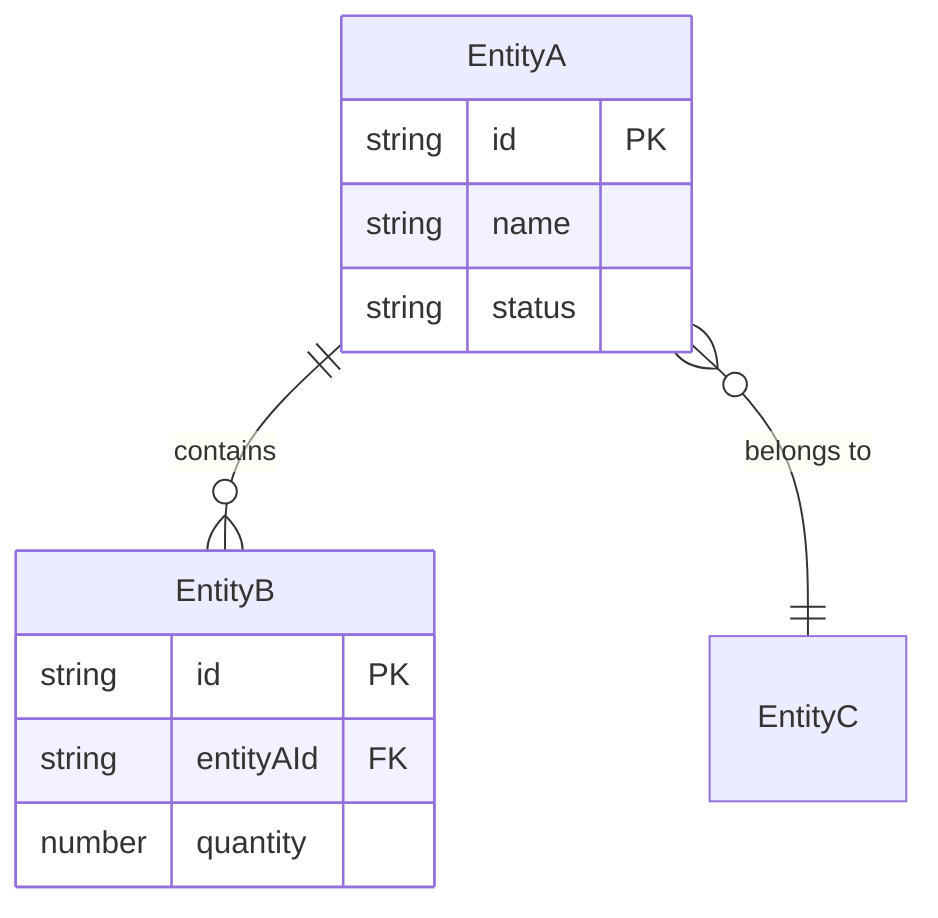
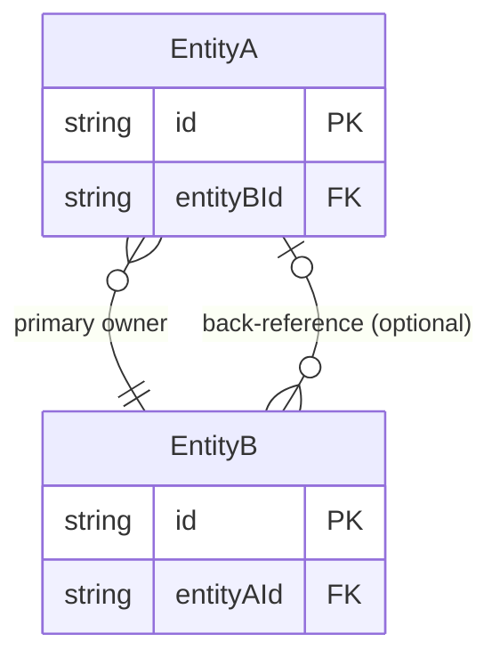

<!-- PROMPT-ENHANCE:STEP-TASK-ANCHOR:START -->

> **[BLOCKING]** Execute skill steps in declared order. NEVER skip, reorder, or merge steps without explicit user approval.
> **[BLOCKING]** Before each step or sub-skill call, update task tracking: set `in_progress` when step starts, set `completed` when step ends.
> **[BLOCKING]** Every completed/skipped step MUST include brief evidence or explicit skip reason.
> **[BLOCKING]** If Task tools are unavailable, create and maintain an equivalent step-by-step plan tracker with the same status transitions.

<!-- PROMPT-ENHANCE:STEP-TASK-ANCHOR:END -->

> **[BLOCKING]** Each phase MUST ATTENTION invoke its `Skill` tool — marking a task `completed` without skill invocation is a workflow violation. NEVER batch-complete validation gates.

<!-- SYNC:critical-thinking-mindset -->

> **Critical Thinking Mindset** — Apply critical thinking, sequential thinking. Every claim needs traced proof, confidence >80% to act.
> **Anti-hallucination:** Never present guess as fact — cite sources for every claim, admit uncertainty freely, self-check output for errors, cross-reference independently, stay skeptical of own confidence — certainty without evidence root of all hallucination.

<!-- /SYNC:critical-thinking-mindset -->

<!-- SYNC:ai-mistake-prevention -->

> **AI Mistake Prevention** — Failure modes to avoid on every task:
>
> - **Check downstream references before deleting.** Deleting components causes documentation and code staleness cascades. Map all referencing files before removal.
> - **Verify AI-generated content against actual code.** AI hallucinates APIs, class names, and method signatures. Always grep to confirm existence before documenting or referencing.
> - **Trace full dependency chain after edits.** Changing a definition misses downstream variables and consumers derived from it. Always trace the full chain.
> - **Trace ALL code paths when verifying correctness.** Confirming code exists is not confirming it executes. Always trace early exits, error branches, and conditional skips — not just happy path.
> - **When debugging, ask "whose responsibility?" before fixing.** Trace whether bug is in caller (wrong data) or callee (wrong handling). Fix at responsible layer — never patch symptom site.
> - **Assume existing values are intentional — ask WHY before changing.** Before changing any constant, limit, flag, or pattern: read comments, check git blame, examine surrounding code.
> - **Verify ALL affected outputs, not just the first.** Changes touching multiple stacks require verifying EVERY output. One green check is not all green checks.
> - **Holistic-first debugging — resist nearest-attention trap.** When investigating any failure, list EVERY precondition first (config, env vars, DB names, endpoints, DI registrations, data preconditions), then verify each against evidence before forming any code-layer hypothesis.
> - **Surgical changes — apply the diff test.** Bug fix: every changed line must trace directly to the bug. Don't restyle or improve adjacent code. Enhancement task: implement improvements AND announce them explicitly.
> - **Surface ambiguity before coding — don't pick silently.** If request has multiple interpretations, present each with effort estimate and ask. Never assume all-records, file-based, or more complex path.

<!-- /SYNC:ai-mistake-prevention -->

---

## What Is Spec Discovery?

Reverse of product discovery — existing codebase → reimplementation-grade spec bundle. Docs describe **what system does and why** — stripped of tech choices, implementation details, language constructs. Any team reads bundle, rebuilds on different stack.

**Use Cases:** AI replatforming, stack migration, compliance docs, knowledge capture, spec-driven bootstrap.

**Scale Reality:** Thousands of files, dozens of modules. Scout-first → plan-decompose → investigate-deeply prevents context overrun, ensures complete coverage.

---

## Quick Summary

**Goal:** Reverse-engineer tech-agnostic spec bundle from existing codebase. Stable output at `docs/specs/{app-bucket}/{system-name}/` — change history in SPEC-CHANGELOG.md.

**Modes:**

| Mode     | Trigger                                                             | Input                                      | Output                                    |
| -------- | ------------------------------------------------------------------- | ------------------------------------------ | ----------------------------------------- |
| `init`   | `docs/specs/{app-bucket}/{system-name}/` not found                  | Full codebase                              | Complete spec bundle from scratch         |
| `update` | `docs/specs/{app-bucket}/{system-name}/` exists + git diff provided | Changed modules                            | Re-extract impacted modules × phases only |
| `audit`  | Explicit request                                                    | Source timestamps vs spec `last_extracted` | SPEC-AUDIT-{date}.md                      |

**Workflow:** `/scout` → `/plan` (operation-group × phase tasks) → `/plan-review` → `/why-review` → `/plan-validate` → `/spec-discovery` (+ Phase F) → `/review-changes` → `/review-artifact` → `/watzup` → `/workflow-end`

**Key Rules:**

- **[BLOCKING]** Read `docs/project-reference/spec-principles.md` — shared spec quality standards, completeness checklists, AI-implementability criteria (read Section 4 completeness checklists before any extraction phase)
- **[BLOCKING]** Run Step 1.5 (Use Case Enumeration) FIRST — then TaskCreate one task per operation group × phase; verify TaskList count ≥ `sum(operation_groups × phase_count)`
- 4+ modules → BLOCKING: spawn all sub-agents in ONE message — NEVER inline single-session
- Context compaction/session resume → `TaskList` FIRST, read completeness tracker, NEVER re-scout/re-plan
- All output tech-agnostic — NEVER framework names, language constructs, class names
- Every claim cites `[Source: file:line]` — mark `[UNVERIFIED]` not blank
- Output path is STABLE (`docs/specs/{app-bucket}/{system-name}/`) — version history in SPEC-CHANGELOG.md, NOT in folder name

---

## Step 0 — Scope Gate (MANDATORY FIRST)

Before reading any code, use `AskUserQuestion`. **3 required (★) — MUST confirm before proceeding. 4 optional — propose auto-default, user can override:**

| Dimension         | Question                                                                                                                                                      | Auto-Default                       |
| ----------------- | ------------------------------------------------------------------------------------------------------------------------------------------------------------- | ---------------------------------- |
| **Scan scope** ★  | Full system (all modules) OR a specific module/service/feature area?                                                                                          | — must confirm                     |
| **Mode** ★        | Fresh init (no existing specs) OR update (specs exist, re-extract impacted) OR audit (check staleness)?                                                       | — must confirm                     |
| **System name** ★ | What is the canonical system name? Choose once — this becomes the stable `docs/specs/{app-bucket}/{system-name}/` path (e.g., `myapp/orders`, `myapp/users`). | — must confirm                     |
| **Output depth**  | Full spec bundle (all 6 phases) OR targeted (select phases)?                                                                                                  | Full bundle (all 6 phases)         |
| **Focus areas**   | Which of: domain model / business rules / API contracts / events / UI flows?                                                                                  | All phases                         |
| **Source entry**  | Where to start? (e.g., main entry files, a named module, a specific directory)                                                                                | Top-level service directory        |
| **Scale hint**    | Approximately how many modules/services does this codebase have? (rough estimate)                                                                             | Scout will determine from registry |

> **Stable Path Contract:** The folder `docs/specs/{app-bucket}/{system-name}/` is the permanent home for this system's spec bundle. NEVER include dates in the path. All change history is captured in `docs/specs/{app-bucket}/{system-name}/SPEC-CHANGELOG.md`. Existing extractions in `specs/{date}-*` folders are legacy — do NOT migrate or delete them; start fresh at the stable path for new runs.

> **Scale routing:** If scope is 1–3 modules → single-session extraction. If scope is 4+ modules → MUST use sub-agent parallel extraction (see Sub-Agent Pattern). If scope is entire large system → MUST use incremental coverage: one module per session.

> **[BLOCKING SCALE GATE]** If `module_count ≥ 4` at the end of Step 2 (Plan): you **MUST** use sub-agent parallel extraction. Attempting single-session inline extraction with 4+ modules is a workflow violation. Do NOT proceed past Step 2 without spawning sub-agents.

<!-- SYNC:cross-service-check -->

> **Cross-Service Check** — Microservices/event-driven: MANDATORY before concluding investigation, plan, spec, or feature doc. Missing downstream consumer = silent regression.
>
> | Boundary            | Grep terms                                                                      |
> | ------------------- | ------------------------------------------------------------------------------- |
> | Event producers     | `Publish`, `Dispatch`, `Send`, `emit`, `EventBus`, `outbox`, `IntegrationEvent` |
> | Event consumers     | `Consumer`, `EventHandler`, `Subscribe`, `@EventListener`, `inbox`              |
> | Sagas/orchestration | `Saga`, `ProcessManager`, `Choreography`, `Workflow`, `Orchestrator`            |
> | Sync service calls  | HTTP/gRPC calls to/from other services                                          |
> | Shared contracts    | OpenAPI spec, proto, shared DTO — flag breaking changes                         |
> | Data ownership      | Other service reads/writes same table/collection → Shared-DB anti-pattern       |
>
> **Per touchpoint:** owner service · message name · consumers · risk (NONE / ADDITIVE / BREAKING).
>
> **BLOCKED until:** Producers scanned · Consumers scanned · Sagas checked · Contracts reviewed · Breaking-change risk flagged

<!-- /SYNC:cross-service-check -->

---

## Step 0.5 — Update Mode Protocol (skip for init)

When mode = `update`, skip Steps 1-2 (Scout + Plan). Instead:

### Step 0.5.1: Load Existing Registry

1. Read `docs/specs/{app-bucket}/{system-name}/00-module-registry.md` — load module catalog
2. Read `docs/specs/{app-bucket}/{system-name}/extraction-plan.md` — load phase coverage map
3. Read `docs/specs/{app-bucket}/{system-name}/README.md` completeness table

### Step 0.5.2: Impact Mapping from Git Diff

Map changed source files → impacted modules × phases:

| Changed File Pattern                      | Impacted Module(s)    | Impacted Phase(s)                                              |
| ----------------------------------------- | --------------------- | -------------------------------------------------------------- |
| `{Module}/Domain/Entities/**`             | That module           | Phase A (domain model) + Phase A.ERD                           |
| `{Module}/Application/UseCaseCommands/**` | That module           | Phase B (business rules — validation), Phase C (API contracts) |
| `{Module}/Application/UseCaseEvents/**`   | That module           | Phase D (events)                                               |
| `{Module}/Service/Controllers/**`         | That module           | Phase C (API contracts)                                        |
| `{Module}/Persistence/**`                 | That module           | Phase B (data constraints)                                     |
| Frontend `{feature}/**`                   | Mapped module         | Phase E (user journeys)                                        |
| Bus message files                         | All consuming modules | Phase D (events)                                               |

### Step 0.5.3: Create Update Tasks

TaskCreate for each impacted module × phase combination. These replace the full N×M plan for update mode.

### Step 0.5.4: Execute Update Tasks

Execute per-task deep investigation for each impacted task (same READ → TRACE → EXTRACT → WRITE → VERIFY protocol as init mode).

### Step 0.5.5: Append to SPEC-CHANGELOG.md

After all update tasks complete:

```markdown
## [{date}] — Update

- Scope: {list of re-extracted modules}
- Phases re-extracted: {list of phases}
- Triggered by: git diff {git_ref} OR workflow-spec-driven-dev update mode
- Source files changed: {list of changed files}
- Spec files updated: {list of updated spec files}
```

---

## Step 0.6 — Audit Mode Protocol (skip for init/update)

When mode = `audit`:

### Step 0.6.1: Load Spec Inventory

For each module in `docs/specs/{app-bucket}/{system-name}/`:

1. Read `{module}/README.md` frontmatter → `last_extracted` date
2. For each spec file (A/B/C/D/E), read frontmatter → `last_extracted` date

### Step 0.6.2: Compare Against Source

For each module:

1. Run `git log --since="{last_extracted}" --name-only -- {source_path}`
2. Record changed files since last extraction

### Step 0.6.3: Impact Classification

| Changed Files Found     | Classification | Action                 |
| ----------------------- | -------------- | ---------------------- |
| Entity files            | Phase A stale  | Flag for re-extraction |
| Validator/command files | Phase B stale  | Flag for re-extraction |
| Controller files        | Phase C stale  | Flag for re-extraction |
| Event/bus files         | Phase D stale  | Flag for re-extraction |
| Frontend files          | Phase E stale  | Flag for re-extraction |

### Step 0.6.4: Write SPEC-AUDIT-{date}.md

Output: `docs/specs/{app-bucket}/{system-name}/SPEC-AUDIT-{date}.md`:

```markdown
# Spec Audit Report — {date}

**System:** {system-name}
**Audit Run:** {date}

## Module Staleness Summary

| Module              | Last Extracted | Source Changes Since                 | Stale Phases | Action             |
| ------------------- | -------------- | ------------------------------------ | ------------ | ------------------ |
| M01 OrderManagement | 2026-04-19     | ValidateOrderService.cs (2026-04-20) | Phase B      | Re-extract Phase B |
| M04 ProductCatalog  | 2026-04-19     | None                                 | —            | ✅ Current         |

## Recommended Update Scope

Estimated update effort: {N} modules × {M} phases = {X} re-extraction tasks

Run: `workflow-spec-driven-dev update` scoped to: {list of stale modules}
```

---

## Step 1 — Holistic Scout (MANDATORY BEFORE ANY EXTRACTION)

**Goal:** Build complete codebase picture at highest level BEFORE reading any module — foundation for plan.

> **HARD GATE:** No extraction until Module Registry produced. Missing registry → plan misses modules → incomplete spec.

### What to Scout

1. **Directory structure** — Map top-level tree: business logic, API entry points, data access, shared utilities
2. **Entry point files** — App bootstrap (config, DI container, router, composition root) — reveals full module surface
3. **Module/service boundaries** — Per module: name, responsibility (1 sentence), file count, layers (presentation/application/domain/infrastructure)
4. **Cross-cutting concerns** — Auth, logging, error handling, caching — which files implement, which modules consume
5. **Data store access points** — Where each store accessed; which modules own which stores
6. **Integration points** — Message bus subscribers/publishers, external HTTP clients, webhook handlers, scheduled jobs

### Output: Module Registry

Create `docs/specs/{app-bucket}/{system-name}/00-module-registry.md`:

```markdown
---
system_name: { system-name }
extracted: { date }
last_updated: { date }
---

# Module Registry

Generated: {date} | Scope: {full-system / module-scoped}

## System Summary

[2-3 sentences: what this system does, who uses it, approximate scale]

## Module Catalog

| #   | Module Name | Responsibility | Layer Structure | File Count (est.) | Data Store | Integration Points |
| --- | ----------- | -------------- | --------------- | ----------------- | ---------- | ------------------ |
| 1   | ...         | ...            | ...             | ...               | ...        | ...                |

## Cross-Cutting Concerns

| Concern | Implementation Location | Consumed By |
| ------- | ----------------------- | ----------- |

## Integration Boundary Map

[Which modules communicate, via what mechanism, in what direction]

## Data Store Ownership

| Store Type | Owner Module(s) | Access Pattern |
| ---------- | --------------- | -------------- |
```

---

## Step 1.5 — Use Case Enumeration + Actor Discovery (MANDATORY — runs after Step 1, before Step 2)

**Goal:** Count ALL operations BEFORE plan. Task count MUST derive from inventory — not module count alone.

> **HARD GATE:** Do NOT proceed Step 2 until Use Case Inventory written for every module. Plan based only on `module_count × phase_count` systematically misses operations in large modules.

### Use Case Enumeration Protocol

For each module discovered in Step 1, run the following grep commands — use ALL patterns that apply to this codebase's architecture:

**Write-side entry points (operations that change data state):**

```
# CQRS command handlers
grep -r "ICommandHandler\|CommandHandler\|ICommand\b" {module_path}/ --include="*.cs" -l

# REST/MVC mutating endpoints
grep -r "\[HttpPost\]\|\[HttpPut\]\|\[HttpPatch\]\|\[HttpDelete\]" {module_path}/ --include="*.cs" -l

# GraphQL mutations
grep -r "Mutation\|[Mm]utation[Rr]esolver" {module_path}/ -l

# Event consumers (event-driven operations)
grep -r "IConsumer\|EventHandler\|MessageHandler\|@KafkaListener\|IMessageConsumer" {module_path}/ -l

# Generic fallback (class-based handlers)
grep -r "class.*Handler\|class.*Command\|class.*Processor" {module_path}/ -l
```

**Read-side entry points (operations that query data):**

```
# CQRS query handlers
grep -r "IQueryHandler\|QueryHandler\|IQuery\b" {module_path}/ --include="*.cs" -l

# REST GET endpoints
grep -r "\[HttpGet\]" {module_path}/ --include="*.cs" -l

# GraphQL query resolvers
grep -r "class.*Query\b\|[Qq]uery[Rr]esolver" {module_path}/ -l

# Generic fallback
grep -r "class.*Query\|class.*Reader\|class.*Finder" {module_path}/ -l
```

**Background + scheduled operations:**

```
grep -r "BackgroundJob\|IJob\b\|ScheduledTask\|ICronJob\|BackgroundService\|IHostedService" {module_path}/ -l
```

### Actor/Role Discovery (feeds Phase E)

Before writing any user stories in Phase E, you MUST know WHO the actors are. Run for each module:

```
# Authorization attributes and policies
grep -r "\[Authorize\]\|\[Permission\]\|RequirePermission\|HasPermission\|IsInRole\|RequireRole" {module_path}/ -l

# Role/permission enums and constants
grep -r "enum.*Role\|enum.*Permission\|RoleEnum\|PermissionEnum\|.*Roles\s*=" {module_path}/ -l

# Policy definitions
grep -r "AddPolicy\|AddAuthorization\|PolicyBuilder" {module_path}/ -l
```

Build actor catalog: list each unique role/actor type found, permission scope, operations they can perform.

### Use Case Inventory Output Format

Append to `docs/specs/{app-bucket}/{system-name}/00-module-registry.md` (add after the Module Catalog table):

```markdown
## Use Case Inventory

| Module    | Write Ops (N) | Read Ops (M) | Event-Driven (K) | Background (J) | Total (N+M+K+J) | Actor Roles       |
| --------- | ------------- | ------------ | ---------------- | -------------- | --------------- | ----------------- |
| Orders    | 12            | 8            | 3                | 2              | 25              | Customer, Admin   |
| Users     | 6             | 4            | 1                | 0              | 11              | Admin, HR Manager |
| **Total** |               |              |                  |                | **36**          |                   |

## Actor Catalog

| Actor / Role | Permission Scope   | Source              |
| ------------ | ------------------ | ------------------- |
| {role-name}  | {what they can do} | [Source: file:line] |
```

**[GATE — BLOCKING before Step 2]:**

- Grand Total (N+M+K+J across all modules) = minimum Phase C spec entry count
- Plan MUST produce enough tasks to cover ALL operations in the inventory
- Any module with Total > 20 MUST be split into operation groups (see Rule 1 below)

### Operation Group Definition

An **operation group** is a batch of ≤20 related operations from the Use Case Inventory for a single module. Group by functional area (e.g., "Order CRUD", "Order Fulfillment", "Order Reporting"). If no clear functional grouping exists, batch alphabetically in groups of ≤20.

A module with 80 operations → ≥4 operation groups → ≥4 Phase C tasks for that module.

---

## Step 2 — Extraction Plan (MANDATORY — MUST BREAK BIG INTO SMALL)

**Goal:** Ordered task list decomposing extraction into smallest independent units. Prevents context overrun.

> **HARD GATE:** `TaskCreate` MUST be called for EVERY task BEFORE extraction begins. No extraction without complete task list.

### Planning Rules

**Rule 1: One task per operation group per phase.**
Operation groups from Use Case Inventory (Step 1.5). Module with 80 ops → 4 groups × 4 phases = 16 tasks.

**Minimum task count formula:** `sum(operation_groups_per_module) × phase_count`. **NEVER** `module_count × phase_count` — undercounts large modules → #1 cause of <10% coverage.

Task format: `"Extract [Phase Name] for [Module Name] — [Group Name] ([N] ops)"`.

**Rule 2: Scope each task ≤50 files / ≤20 operations.**

> 20 ops in one group → split: `"Extract API Contracts for Order Module (Part 1: Fulfillment)"`, `"Part 2: Reporting"`.

**Rule 3: Dependency-order tasks.** Phase A (Domain Model) MUST complete before Phase B (Business Rules) for same module.

**Rule 4: Prioritize by value.** Core business domain first — infrastructure/utility last.

**Rule 5: Each task = focused investigation.** NEVER extract all phases for module in single context pass.

### Plan Output

The plan produces:

1. A task list (created via `TaskCreate`) — one task per operation group × phase combination
2. A `docs/specs/{app-bucket}/{system-name}/extraction-plan.md` file tracking which tasks cover which modules

```markdown
# Extraction Plan

## Task Breakdown

Phase 1 (Domain Model) — {N} tasks

- [ ] Extract Domain Model: Module A
- [ ] Extract Domain Model: Module B
      ...

Phase 2 (Business Rules) — {N} tasks

- [ ] Extract Business Rules: Module A (Part 1: Validation)
- [ ] Extract Business Rules: Module A (Part 2: State Machines)
      ...

## Dependency Map

[Which tasks must complete before others can start]

## Completion Tracker

| Task | Status | Output File | Evidence Lines |
| ---- | ------ | ----------- | -------------- |
```

### Task Count Verification Gate

> **[BLOCKING GATE]** Before proceeding to `/plan-review`:
>
> 1. Run `TaskList` — count all created extraction tasks
> 2. Compute expected minimum using BOTH checks:
>     - **Check A:** `sum(operation_groups_per_module) × phase_count` — derived from Use Case Inventory (Step 1.5)
>     - **Check B:** Phase C task count ≥ Grand Total (N+M+K+J) from Use Case Inventory — every counted operation must map to a Phase C task
> 3. If `TaskList` count < Check A result: plan is **INCOMPLETE** — create missing operation-group tasks
> 4. If Phase C tasks cover fewer operations than Check B: plan is **INCOMPLETE** — create missing tasks
> 5. If both checks pass: proceed to `/plan-review`
>
> **NEVER use `module_count × phase_count` as the minimum** — this undercounts large modules.
> An incomplete task list is not a plan — it is a guarantee of <10% coverage on large modules.

---

## Step 3 — Per-Task Deep Investigation + Extraction

**Goal:** Execute each task as focused, depth-first investigation. Read ALL relevant files before writing any spec line.

> **HARD GATE:** Read target files BEFORE writing. NEVER write spec content from memory or assumption.

### Per-Task Protocol

For each extraction task, follow this sequence:

```
1. READ   — Read all source files in this task's scope (grep → read → understand)
2. TRACE  — Trace code paths: what calls what, what triggers what, what validates what
3. EXTRACT — Extract the relevant spec content (only what this task covers)
4. WRITE  — Write the extracted content to the spec file with [Source: file:line] on every claim
5. VERIFY — Re-read the written spec against the source. Any claim without a source → mark [UNVERIFIED]
6. COMPLETE — Mark the task completed. Move to next task.
```

### Investigation Depth Requirements

| Task Type            | What to Read                                                                                                                                                                                                                                                                                                                                                                                                                                                                                                                                                                                                                           |
| -------------------- | -------------------------------------------------------------------------------------------------------------------------------------------------------------------------------------------------------------------------------------------------------------------------------------------------------------------------------------------------------------------------------------------------------------------------------------------------------------------------------------------------------------------------------------------------------------------------------------------------------------------------------------- |
| Domain Model         | Entity/model files, value object files, aggregate roots, enum definitions, foreign key / navigation property / association fields (for relationship mapping)                                                                                                                                                                                                                                                                                                                                                                                                                                                                           |
| Business Rules       | Validator files, guard clauses in command handlers, entity invariant methods, policy files                                                                                                                                                                                                                                                                                                                                                                                                                                                                                                                                             |
| API Contracts        | **All application-layer entry points — read in this priority order:**<br>1. **CQRS** (if present): command handler files (`UseCaseCommands/`) + query handler files (`UseCaseQueries/`) + event consumer files (`UseCaseEvents/`) + background job files<br>2. **REST/MVC**: controller files + request/response DTO files<br>3. **GraphQL**: resolver files (mutations = write operations, queries = read operations)<br>4. **Scheduled**: job/scheduler/cron files<br>Every operation in the Use Case Inventory (Step 1.5) MUST produce exactly one Phase C spec entry. Missing entries = incomplete spec.                           |
| Integration & Events | Message publisher files, message consumer files, scheduler files, external client files                                                                                                                                                                                                                                                                                                                                                                                                                                                                                                                                                |
| User Journeys        | **Three source types — all required:**<br>1. **Backend operations** (from Phase C completed spec): every write operation → one "I want to perform action" story; every read/GET operation with filter params → one "I want to search/view/filter" story.<br>2. **UI routes** (if frontend exists): route files → component files → templates. Each screen/route = one story about what the user can see or do there.<br>3. **Auth/permission attributes** (actor catalog from Step 1.5): confirm every actor has ≥1 story.<br>**Format required for every story:** "As a [actor from catalog], I want to [action], so that [outcome]." |

### Context Window Management

> **Critical:** 1000+ files — strict per-task discipline prevents context overrun.

- **[BLOCKING] Write output immediately** after each task — NEVER accumulate. Context cutoff loses in-memory; disk writes survive.
- **NEVER load more files than needed** — resist reading adjacent modules
- **Scope too large?** Split further (one file per sub-task)
- **Grep first** to narrow file set — read only matching files
- **Each task = fresh investigation** — NEVER rely on memory from previous task

### Context Compaction / Session Resume Guard

> **[BLOCKING — MANDATORY at every session start or after context compaction]**
>
> 1. `TaskList` BEFORE any other action — find `in_progress`/`pending` tasks; NEVER create duplicates
> 2. Read `docs/specs/{app-bucket}/{system-name}/README.md` completeness table — identify ✅ modules
> 3. Skip re-extraction for ✅ modules — append only to incomplete sections
> 4. Continue from first non-completed task
> 5. NEVER re-run Step 1 (Scout) or Step 2 (Plan) in resumed session — Registry + task list already exist

---

## Phase Extraction Standards (Per-Task Content Requirements)

### Phase A — Domain Model

For each entity/aggregate in scope:

```markdown
### {EntityName}

- **Purpose:** [one sentence — what business concept this represents]
- **Identity:** [auto-generated / natural key: field name]
- **Attributes:**
  | Name | Type | Required | Constraint | Business Meaning |
  |------|------|----------|------------|-----------------|
- **Lifecycle:** [created-modified-deleted / append-only / state machine: list states]
- **Invariants:** [list of rules the entity always enforces — plain language]
- **Domain Events:** [what significant things happen when this entity changes state]
  [Source: path/to/entity-file.ext:line_range]
```

For each value object:

```markdown
### {ValueObjectName}

- **Represents:** [what real-world concept]
- **Attributes:** [name | type | constraint]
- **Immutable:** yes/no
- **Validation:** [what makes an instance valid]
  [Source: path/to/file.ext:line_range]
```

For each aggregate:

```markdown
### {AggregateName} Aggregate

- **Root:** {EntityName}
- **Members:** [list]
- **Consistency Boundary:** [what changes must happen atomically]
- **Invariants Enforced:** [cross-entity rules the aggregate protects]
  [Source: path/to/file.ext:line_range]
```

### Phase A.ERD — Domain Entity Relationship Diagram (Mandatory — run after all entities extracted)

**Why:** ERD is foundation of entire spec bundle — all phases (business rules, API contracts, events) reference entity relationships. Generate once per module group, after Phase A entity extraction, before Phase B.

**Output file:** `docs/specs/{app-bucket}/{system-name}/01-domain-erd.md` (append when multiple modules contribute)

Add the following YAML frontmatter at the top of every spec output file (A/B/C/D/E and ERD):

```yaml
---
module: { module-name }
phase: { A|B|C|D|E }
last_extracted: { date }
extraction_mode: init|update
---
```

**ERD generation protocol:**

```
1. Collect all entities extracted in Phase A for this module
2. For each entity: identify its relationships by reading foreign-key fields,
   navigation/association properties, and collection fields
3. Determine cardinality for each relationship (read source — do NOT assume)
4. Generate Mermaid erDiagram block
5. Append to 01-domain-erd.md with [Source] citations
```

**Mermaid ERD template:**

````markdown
## {ModuleName} Domain ERD

%% [AGGREGATE: {AggregateName}] — root entity listed first



[Source: path/to/entity-files.ext:line_range]
````

**ERD rules (tech-agnostic contract):**

| ❌ Forbidden                                     | ✅ Use Instead                                       |
| ------------------------------------------------ | ---------------------------------------------------- |
| ORM/language types (`Guid`, `List<T>`, `int?`)   | `string`, `number`, `boolean`, `date`, `list`, `map` |
| Class name suffixes (`OrderEntity`, `UserModel`) | Business name only (`Order`, `User`)                 |
| Framework annotations (`[Required]`, `@Column`)  | Omit — captured in Phase A attribute constraints     |
| Module name prefixes (`App_Orders`)              | Business name only (`Orders`)                        |

**Cardinality notation:**

| Notation     | Meaning                      |
| ------------ | ---------------------------- |
| `\|\|--\|\|` | Exactly one to exactly one   |
| `\|\|--o{`   | Exactly one to zero-or-many  |
| `}o--o{`     | Zero-or-many to zero-or-many |
| `\|\|--\|{`  | Exactly one to one-or-many   |

**Cross-module references:** If an entity references an entity from another module (not in current scope), add a stub entity with a comment:

```mermaid
    ExternalEntity {
        string id PK
    }
    %% [CROSS-REF: {source-module-name} — not extracted in this scope]
    LocalEntity }o--|| ExternalEntity : "references"
```

**ERD completeness gate (before marking Phase A.ERD task complete):**

- [ ] Every entity extracted in Phase A appears in the ERD
- [ ] Every relationship has a cardinality — no floating entities without at least one relationship (or documented reason)
- [ ] All aggregate roots are marked with `%% [AGGREGATE: ...]` comment
- [ ] `[Source: file:line]` present for relationship evidence
- [ ] No tech-specific types or class names

**Circular Dependency Handling (ERD):**

When entity A has a FK → entity B AND entity B has a FK → entity A (mutual reference), do NOT omit one side. Represent both directions with directionality comments:

````markdown

````

> Identify ownership direction (FK created first / "owns" relationship) vs navigational back-reference. Document with `%% [CIRCULAR: ...]` comment.

---

### Phase B — Business Rules

```markdown
## {ModuleName} — Business Rules

### Validation Rules: {OperationName}

| Field | Rule | Error Condition | Error Message |
| ----- | ---- | --------------- | ------------- |

[Source: path/to/validator.ext:line_range]

### Authorization Rules

| Operation | Who Can Perform | Condition |
| --------- | --------------- | --------- |

[Source: path/to/policy.ext:line_range]

### Invariants

| #   | Invariant | Always True Because | Enforcement |
| --- | --------- | ------------------- | ----------- |

[Source: path/to/entity.ext:line_range]

### Calculations

| Name | Inputs | Formula / Description | Output |
| ---- | ------ | --------------------- | ------ |

[Source: path/to/file.ext:line_range]

### State Machine: {EntityName} Lifecycle

States: [list with descriptions]
Transitions:
| From State | Event/Trigger | Guard Condition | To State |
|-----------|---------------|-----------------|----------|
[Source: path/to/file.ext:line_range]
```

### Phase C — API Contracts

```markdown
## {ModuleName} — Operations

### {OperationName}

- **Purpose:** [one sentence]
- **Transport:** [HTTP method + path / scheduled / message consumer / CLI]
- **Auth Required:** yes/no | Role: [role] | Permission: [permission]
- **Idempotent:** yes/no — [why]
- **Input:**
  | Field | Type | Required | Constraint | Description |
  |-------|------|----------|------------|-------------|
- **Output (success):**
  | Field | Type | Description |
  |-------|------|-------------|
- **Errors:**
  | Code | Condition | Retryable |
  |------|-----------|-----------|
  [Source: path/to/controller.ext:line_range]
```

### Phase D — Integration & Events

```markdown
## Published Events

### {EventName}

- **Trigger:** [what causes this to be published]
- **Payload:**
  | Field | Type | Description |
  |-------|------|-------------|
- **Ordering:** guaranteed / best-effort
  [Source: path/to/publisher.ext:line_range]

## Consumed Events

### {EventName}

- **Producer:** [system or module name]
- **Processing:** [what this system does when received]
- **Idempotency:** [how duplicate delivery is handled]
- **Failure handling:** [retry? dead-letter? discard?]
  [Source: path/to/consumer.ext:line_range]

## Scheduled Jobs

| Job | Schedule | Purpose | Side Effects | Abort Condition |
| --- | -------- | ------- | ------------ | --------------- |

[Source: path/to/job.ext:line_range]
```

### Phase E — User Journeys

Phase E MUST produce one entry per discovered operation (from Phase C) plus one entry per UI screen. **Minimum output = Phase C operation count for this module.**

Use **actor catalog from Step 1.5** — every story MUST reference a real actor from that catalog, not assumed role.

**User story template (use for each backend operation and each UI screen):**

```markdown
## Journey: {JourneyName}

- **User Story:** As a {actor from actor catalog}, I want to {action verb + object}, so that {business outcome}.
- **Actor:** {exact role name from actor catalog}
- **Operation Type:** write | read | event-driven | background | ui-screen
- **Trigger:** {what starts this journey — user click, API call, system event, schedule, or message}
- **Preconditions:** {what must already exist or be true before this journey begins}
- **Happy Path:**
    1. {Step 1 — observable user or system action}
    2. {Step 2}
       ...
- **Alternative Paths:**
    - {Condition A} → {what happens instead of happy path}
    - {Error/invalid input} → {error message or fallback behavior}
- **Outcome:** {what the actor achieves or what system state changes}
- **Acceptance Criteria:**
    - GIVEN {precondition} WHEN {action} THEN {observable outcome}
    - GIVEN {precondition} WHEN {invalid action} THEN {error outcome}
      [Source: path/to/handler-or-component.ext:line_range]
```

**Per-task Phase E completeness checklist (check BEFORE marking task complete):**

- [ ] Journey count for this task's scope ≥ Phase C operation count in the same scope
- [ ] Every actor in the actor catalog (Step 1.5) has ≥1 journey in Phase E output
- [ ] Every UI route (if frontend exists) has ≥1 screen-story with Operation Type: ui-screen
- [ ] Every GET/query operation with filter parameters has a "search/list/view" story
- [ ] Every journey has `[Source: file:line]` — no journeys from memory or assumption
- [ ] All User Story fields use "As a / I want / So that" format — no free-form narratives

### Phase F — Spec Bundle Assembly

After all per-module tasks complete:

### Step F.4 — Cross-Phase Completeness Gate (BLOCKING before bundle assembly)

> **[BLOCKING]** Do NOT write Phase F bundle files until all 4 gates pass. A bundle assembled over coverage gaps is misleading — it implies completeness that doesn't exist.

| Gate            | Check                                    | Pass Condition                                   | Failure Action                                                                |
| --------------- | ---------------------------------------- | ------------------------------------------------ | ----------------------------------------------------------------------------- |
| **C-gate**      | Phase C total entries across all modules | ≥ Grand Total from Use Case Inventory (Step 1.5) | Create fix task: `"Fill Phase C gap: {module} missing {N} operation entries"` |
| **E-gate**      | Phase E journey count across all modules | ≥ Phase C total entry count                      | Create fix task: `"Fill Phase E gap: {module} missing {N} user stories"`      |
| **Actor-gate**  | Every actor in actor catalog             | Has ≥1 Phase E journey                           | Create fix task: `"Add stories for actor: {role} — currently 0 journeys"`     |
| **Source-gate** | Every Phase C + Phase E entry            | Has `[Source: file:line]`                        | Mark `[UNVERIFIED]` — do NOT silently pass                                    |

If any gate fails: create fix tasks, execute them, then re-check ALL 4 gates before proceeding.
Re-checking runs in the main session — spawn fresh sub-agent only if re-check still fails after one fix cycle.

1. Verify `docs/specs/{app-bucket}/{system-name}/01-domain-erd.md` exists and covers all modules — the ERD is the foundational artifact; missing ERD = incomplete spec bundle
2. Write `docs/specs/{app-bucket}/{system-name}/06-reimplementation-guide.md` — system overview, build order, architecture constraints, data migration notes
3. Write `docs/specs/{app-bucket}/{system-name}/README.md` — index with completeness status table

> **[REQUIRED] Doc Network Links in README.md (index):**
>
> Every spec bundle README.md MUST include a `## Related Documentation` section:
>
> ```markdown
> ## Related Documentation
>
> - **Business Feature Doc:** `docs/business-features/{Module}/README.md`
>   _(primary stakeholder view; Sections 1-14 business context, Section 15 test cases)_
> - **QA Spec Dashboard:** `docs/specs/{Module}/README.md`
>   _(TC execution status, integration test traceability)_
> - **Integration Tests:** `src/Services/{ServiceName}/{ServiceName}.IntegrationTests/`
>   _(subcutaneous tests; each test annotated with [Trait("TestSpec", "TC-{MODULE}-{NNN}")])_
> ```
>
> If the business feature doc or QA dashboard doesn't exist yet, write the path with `(not yet created)`.
> The path is the navigational intent — it guides the next person to create it.

4. Cross-check: every module in the registry has a spec section AND an ERD contribution. Missing modules → `[NOT EXTRACTED — scope excluded]`

### Step F.5: Write SPEC-CHANGELOG.md

Create `docs/specs/{app-bucket}/{system-name}/SPEC-CHANGELOG.md` after first init run:

```markdown
# Spec Changelog: {system-name}

> Change history for the spec bundle at `docs/specs/{app-bucket}/{system-name}/`.
> Each entry records what was extracted, when, and why.

## [{date}] — Initial Extraction (init)

- **Scope:** {full system / module-scoped}
- **Modules:** {N} modules
- **Phases:** {list of phases extracted}
- **Triggered by:** Initial spec-discovery init run
- **Spec files created:** {count}
- **Total lines:** {approx}
- **Open questions:** {count} (see README.md)
```

Append after every subsequent update/audit run per Step 0.5.5 format.

---

## Phase F.5 — Per-Module README Generation

After Phase F bundle assembly, generate a `README.md` for each module folder:

**Output:** `docs/specs/{app-bucket}/{system-name}/{module-id}-{module-name}/README.md`

**Purpose:** Bridge between engineering spec and stakeholder-facing feature docs. Provides navigable summary in 17-section format, linking to detailed A/B/C/D/E files for depth.

### Per-Module README Format

```markdown
---
module: { module-name }
system: { system-name }
last_extracted: { date }
phases_covered: [A, B, C, D, E] # list only completed phases
---

# {Module Name} — Spec Summary

> Tech-agnostic spec. All entity/operation names are business names only.
> Full details: [A-domain-model.md](./A-domain-model.md), [B-business-rules.md](./B-business-rules.md), etc.

## Quick Navigation

| Section                   | Content                   | Detail File                                  |
| ------------------------- | ------------------------- | -------------------------------------------- |
| 1. Domain Model Summary   | Key entities and ERD      | [A-domain-model.md](./A-domain-model.md)     |
| 2. Business Rules Summary | Top validation rules      | [B-business-rules.md](./B-business-rules.md) |
| 3. Operations Summary     | Key API operations        | [C-api-contracts.md](./C-api-contracts.md)   |
| 4. Events Summary         | Published/consumed events | [D-events.md](./D-events.md)                 |
| 5. User Journeys Summary  | Key user flows            | [E-user-journeys.md](./E-user-journeys.md)   |

## Domain Model (Summary)

{Top 3-5 entities with 1-sentence purpose each}

{Mermaid erDiagram — same as in A-domain-model.md, abbreviated to core entities only}

## Business Rules (Top 5)

{Top 5 most important rules, each 1 line, linking to full rule in B-business-rules.md}

## Key Operations (Top 5)

{Top 5 operations — purpose, method+path, auth required — linking to C-api-contracts.md}

## Events (Summary)

{Published events count, consumed events count — link to D-events.md}

## Open Questions

{Any [UNVERIFIED] items or OQ-XX items relevant to this module}
```

**Scope:** Generate README.md only for modules that have at least Phase A or Phase B complete. Skip modules with only Phase E (UI journeys only).

---

## Sub-Agent Pattern (Required for 4+ Modules)

4+ modules → use sub-agents for parallel module extraction:

1. Complete Step 1 (Scout) + Step 2 (Plan) in main context
2. Spawn one sub-agent per module (or group of small modules)
3. Each sub-agent receives: Module Registry, extraction task list, spec output path
4. Sub-agents run parallel, each writing to their module's spec file
5. Main context assembles final bundle from all sub-agent outputs

> **[BLOCKING — PARALLEL SPAWN PROTOCOL]** Spawn ALL module sub-agents in a **SINGLE response** with multiple `Agent` tool calls. Never spawn module sub-agents one at a time sequentially — that eliminates the parallelism benefit and extends wall-clock time by N× for an N-module system.
>
> ```
> Agent(module=Orders, ...)   ← all in ONE message
> Agent(module=Users, ...)    ← same response
> Agent(module=Billing, ...)  ← same response
> ```
>
> Each sub-agent is independent — no shared mutable state, no ordering dependency between modules.

**Sub-Agent Prompt Template:**

```
You are extracting the spec for module: {ModuleName}.

Module Registry: docs/specs/{app-bucket}/{system-name}/00-module-registry.md — read this FIRST to understand your module's boundaries and the full system context.
Your assigned tasks: {list of TaskUpdate IDs for this module — call TaskList to confirm}
Output path: docs/specs/{app-bucket}/{system-name}/{module-id}-{module-name}/

---

MANDATORY PROTOCOLS — apply throughout your entire execution:

> Critical Thinking & Anti-Hallucination — every claim needs traced proof. Confidence >80% → write with [Source]. 60-80% → mark [NEEDS-VERIFY]. <60% → mark [UNVERIFIED]. Never present a guess as fact. Never invent field names, method signatures, or business rules.

> Evidence-Based Reasoning — BLOCKED until: source file read AND file:line citation exists. Forbidden words without proof: "obviously", "I think", "should be", "probably". If you cannot find evidence: write "Insufficient evidence. Verified: [...]. Not verified: [...]."

> Incremental Persistence — MANDATORY: after EACH task completes, append findings to your output file immediately. Never hold content in memory across tasks. Context cutoff loses all in-memory work — disk writes survive.

> Cross-Scope Boundary — HARD GATE: Do NOT read files outside your assigned module's scope. If you discover a dependency on an unlisted module, note it as [CROSS-REF: {module-name} — not in scope] in the spec output and stop — do not follow the reference into that module.

> Tech-Agnostic Output — FORBIDDEN in all spec output: framework names (e.g., Entity Framework, Django), ORM types, language generics (List<T>), nullable annotations (string?), file paths or class names from source, architectural pattern names (CQRS, middleware). Use business-meaning descriptions only.

---

**Use Case Inventory for your module** (from Step 1.5 — read from 00-module-registry.md):
> Your module has: Write Ops (N) = {N}, Read Ops (M) = {M}, Event-Driven (K) = {K}, Background (J) = {J}, **Total = {N+M+K+J}**.
> Phase C MUST produce exactly {N+M+K+J} spec entries for your module.
> Phase E MUST produce ≥ {N+M+K+J} user stories for your module.
> If your assigned tasks cover fewer than {N+M+K+J} operations: your task list is incomplete — STOP and report the gap to the main agent before proceeding.

Per-task execution protocol — follow in order for EACH assigned task:

1. READ   — grep to narrow file set to this task's scope; read only matching files
2. TRACE  — trace code paths: what calls what, what validates what, what triggers what
3. EXTRACT — extract spec content for this phase/module only
4. WRITE  — append to output file immediately with [Source: file:line] on every claim
5. VERIFY — re-read written spec vs source; mark [UNVERIFIED] for any claim without traceable source
6. COMPLETE — call TaskUpdate to mark task completed; move to next task

**Phase A.ERD is mandatory after all Phase A entity extraction tasks complete:**
After writing all entity/aggregate descriptions, generate a Mermaid `erDiagram` and append it to `docs/specs/{app-bucket}/{system-name}/01-domain-erd.md`. The ERD captures all entities in your assigned module, their key attributes (using only `string`/`number`/`boolean`/`date`/`list`/`map` types), relationships with cardinality, and aggregate boundaries (`%% [AGGREGATE: ...]`). Mark any cross-module entity references as `%% [CROSS-REF: {module-name} — not in scope]`. The ERD is the foundational artifact — without it, Phase B and beyond lack a shared entity reference.

Never skip ahead. Never accumulate across tasks. Each task is a fresh investigation.
```

---

## Spec Quality Review (After All Tasks Complete)

Before Phase F bundle assembly, quality-review all generated spec files:

### Review Checklist

For each spec file:

- [ ] Every entity/operation/rule has ≥1 `[Source: file:line]` citation
- [ ] No technology-specific terms (no framework names, ORM types, language constructs)
- [ ] All state machines have complete transitions (no dead-end states without explanation)
- [ ] All operations have ≥1 error case documented
- [ ] All modules from registry covered (none skipped silently)
- [ ] Unverifiable items marked `[UNVERIFIED]` — not left blank
- [ ] **[C-gate]** Phase C entry count ≥ Grand Total from Use Case Inventory (Step 1.5) — no operations silently omitted
- [ ] **[E-gate]** Phase E journey count ≥ Phase C total entry count — every operation has ≥1 user story
- [ ] **[Actor-gate]** Every actor in actor catalog (Step 1.5) appears in ≥1 Phase E journey — no role silently omitted

### Fix Loop

If any check fails:

1. Create fix task: `"Fix spec quality gap: [specific issue] in [spec file]"`
2. Re-investigate relevant source file
3. Add citation or mark `[UNVERIFIED]`
4. Re-run checklist for fixed section

### Fresh Sub-Agent Re-Review Gate (After Any Fix)

> **[BLOCKING]** After any fix loop iteration, the main agent has rationalization bias toward its own output. Do NOT re-review inline.
>
> **Spawn a NEW `Agent` tool call** (`subagent_type: "code-reviewer"`) with:
>
> - Target: all generated spec files in `docs/specs/{app-bucket}/{system-name}/`
> - Protocol: re-read ALL spec files from scratch; check every `[UNVERIFIED]` item; flag any tech-specific term; verify every entity/operation has at least one `[Source: file:line]`
> - Report path: `plans/reports/spec-discovery-review-round{N}-{date}.md`
>
> **Rules:**
>
> - Max 2 fresh sub-agent rounds — if still failing after round 2, escalate via `AskUserQuestion` with:
>     - Explicit list of all remaining `[UNVERIFIED]` items with the file/section where each occurs
>     - Three options: `(1) Accept with gaps — mark all remaining [UNVERIFIED] items explicitly and ship; (2) Narrow scope — re-run extraction only on the 1-2 files still failing (new task); (3) Manual review — hand off gap list to human reviewer`
>     - Do NOT silently loop beyond round 2 — escalation to user is mandatory
> - PASS = fresh sub-agent finds zero `[UNVERIFIED]` items without an explicit exclusion reason AND zero tech-specific terms
> - NEVER reuse a sub-agent across rounds — every iteration spawns a NEW `Agent` call

---

## Tech-Agnostic Output Contract

Every spec bundle document MUST be free of:

| ❌ Forbidden                                           | ✅ Use Instead                                       |
| ------------------------------------------------------ | ---------------------------------------------------- |
| Framework names (Express, Django, etc.)                | "HTTP router", "request handler", "middleware"       |
| ORM/database type names                                | "string", "number", "boolean", "date", "list", "map" |
| Language generics (`List<T>`, `Optional<>`)            | "list of X", "optional X"                            |
| Nullable annotations (`string?`)                       | "X (optional)"                                       |
| Architectural pattern names (CQRS handler, middleware) | "command processor", "request interceptor"           |
| File paths or class names from source                  | Business-name descriptions only                      |
| Stack-specific patterns (IoC container, DI)            | "dependency injection", "service registry"           |

---

## Evidence Standards

Every spec claim MUST have source reference:

```
[Source: path/to/file.ext:line_number]
```

- Attribute types → entity/model layer files
- Validation rules → validator/command layer files
- State transitions → handler/service layer files
- API contracts → controller/router/resolver layer files
- Events → publisher/consumer layer files

**BLOCKED:** Any spec section without source evidence MUST be marked `[UNVERIFIED — needs manual review]`. NEVER invent or assume.

---

## Selective Phase Mode

When the user requests only specific phases:

| User Goal                                | Phases to Run                                                 |
| ---------------------------------------- | ------------------------------------------------------------- |
| "I need the data model only"             | Scout + Plan + Phase A + Phase A.ERD (always included with A) |
| "Extract the API contracts"              | Scout + Plan + Phase A + Phase A.ERD + Phase C                |
| "Document the business rules"            | Scout + Plan + Phase A + Phase A.ERD + Phase B                |
| "Generate acceptance criteria from code" | Scout + Plan + Phase A + Phase A.ERD + Phase E                |
| "Extract the event flow"                 | Scout + Plan + Phase A + Phase A.ERD + Phase D                |
| "Full reimplementation spec"             | Scout + Plan + All phases (A.ERD always runs after A)         |

> **Phase A.ERD is always mandatory when Phase A runs** — the ERD is the foundational artifact every downstream phase references. Never skip it, even in selective mode.
>
> **Selective Phase exception:** Phase A may be omitted ONLY if `A-domain-model.md` already exists for this module from a prior init run — in which case Phase A.ERD also already exists; do NOT re-generate it. Reference the existing ERD file instead. If Phase A IS being run now (new or re-extraction), Phase A.ERD MUST run immediately after.

Scout and Plan ALWAYS mandatory — regardless of phase selection.

---

## Incremental Coverage for Large Systems

For systems too large for single session (>10 modules):

1. **Session 1:** Scout + Plan full system — prioritize by business value
2. **Sessions 2–N:** Extract one module-group per session, update completeness tracker
3. **Final session:** Assemble spec bundle from all module specs

Track completeness in `docs/specs/{app-bucket}/{system-name}/README.md`. Each session appends — NEVER overwrites.

---

## Next Steps

**[BLOCKING]** After completing, use `AskUserQuestion` — DO NOT skip:

- **"/docs-update (Recommended)"** — Sync extracted spec with feature docs + specs dashboard
- **"/watzup"** — Wrap up if extraction is final step
- **"Skip, continue manually"** — user decides

---

## Closing Reminders

- **IMPORTANT MUST ATTENTION [BLOCKING]** Run Step 1.5 (Use Case Enumeration) BEFORE plan — enumerate ALL operations, build actor catalog, write Use Case Inventory to 00-module-registry.md
- **IMPORTANT MUST ATTENTION [BLOCKING]** `TaskCreate` one task per **operation group** per phase (not per module per phase) — verify TaskList count ≥ `sum(operation_groups × phase_count)` before `/plan-review`
- **IMPORTANT MUST ATTENTION [BLOCKING]** Phase A.ERD mandatory — generate Mermaid erDiagram in `01-domain-erd.md` after all entities extracted; foundational artifact all other phases reference
- **IMPORTANT MUST ATTENTION [BLOCKING]** Scout FULL codebase holistically BEFORE plan — plan requires complete module registry
- **IMPORTANT MUST ATTENTION [BLOCKING]** Write spec output after EACH task — NEVER accumulate; large codebases overflow context
- **IMPORTANT MUST ATTENTION [BLOCKING]** 4+ modules → spawn ALL sub-agents in ONE message; inline extraction with 4+ modules is a violation
- **IMPORTANT MUST ATTENTION [BLOCKING]** Confirm scope via `AskUserQuestion` BEFORE Step 1 — NEVER auto-start
- **IMPORTANT MUST ATTENTION [BLOCKING]** Context compaction/session resume → `TaskList` FIRST, read completeness tracker, NEVER re-run scout or plan
- **IMPORTANT MUST ATTENTION [BLOCKING]** After any fix in quality review → spawn fresh `code-reviewer` sub-agent (max 2 rounds) — NEVER inline re-review
- **IMPORTANT MUST ATTENTION [REQUIRED]** All output tech-agnostic — no framework names, no language constructs
- **IMPORTANT MUST ATTENTION [REQUIRED]** Every claim cites `[Source: file:line]` — mark `[UNVERIFIED]` rather than guessing

**Anti-Rationalization:**

| Evasion                                              | Rebuttal                                                                                     |
| ---------------------------------------------------- | -------------------------------------------------------------------------------------------- |
| "Only 2–3 modules, skip sub-agents"                  | BLOCKING SCALE GATE applies at 4+. Count modules first, then decide.                         |
| "Already scouted, skip Step 1.5"                     | Step 1.5 MANDATORY after Step 1. Show Use Case Inventory as proof before proceeding.         |
| "module_count × phase_count is the plan formula"     | NEVER — use `sum(operation_groups × phase_count)`. Module formula undercounts large modules. |
| "Context compacted, re-run scout to rebuild context" | TaskList FIRST. Registry + task list survive compaction. NEVER re-scout in resumed session.  |
| "Wrote spec file, marking complete"                  | VERIFY — re-read written spec against source. Mark `[UNVERIFIED]`, not blank.                |
| "Fresh sub-agent overkill for small fix"             | Mandatory after ANY fix loop. Main agent rationalizes its own output. Max 2 rounds.          |
| "Scope is clear, skip Step 0 AskUserQuestion"        | BLOCKING — NEVER auto-start. Scope, mode, and system name MUST be confirmed first.           |

            <!-- SYNC:critical-thinking-mindset:reminder -->

- **MUST ATTENTION** apply critical thinking — every claim needs traced proof, confidence >80% to act. Anti-hallucination: never present guess as fact.
  <!-- /SYNC:critical-thinking-mindset:reminder -->
  <!-- SYNC:ai-mistake-prevention:reminder -->
- **MUST ATTENTION** apply AI mistake prevention — holistic-first debugging, fix at responsible layer, surface ambiguity before coding, re-read files after compaction.
  <!-- /SYNC:ai-mistake-prevention:reminder -->

**[TASK-PLANNING]** MUST ATTENTION analyze task scope and break into small todo tasks/sub-tasks via TaskCreate before acting.

> **[IMPORTANT]** Break into many small todo tasks systematically before starting — this is critical.

---

## Related Skills

| Skill                        | Relationship                                                                    | When to Call                                                              |
| ---------------------------- | ------------------------------------------------------------------------------- | ------------------------------------------------------------------------- |
| `/feature-docs`              | **Consumer** — ingests spec bundle to produce 17-section business doc           | After spec-discovery init/update, to create the stakeholder layer         |
| `/tdd-spec`                  | **Indirect consumer** — feature-docs Section 15 feeds tdd-spec                  | After feature-docs, to generate test cases from the spec                  |
| `/integration-test`          | **End consumer** — TCs from tdd-spec become integration tests                   | After tdd-spec, to generate actual test code                              |
| `/docs-update`               | **Orchestrator** — runs spec-discovery update as Phase 2.5                      | When code changes need full doc sync (calls spec-discovery automatically) |
| `/review-changes`            | **Trigger** — detects code changes and surfaces doc staleness                   | Run after code changes; it will suggest /docs-update if stale             |
| `/tdd-spec [direction=sync]` | **Dashboard sync** — syncs QA spec dashboard at `docs/specs/{Module}/README.md` | After tdd-spec update, to keep dashboard current                          |

## Standalone Chain

> Outside workflow: follow chain to keep spec layers in sync. Skip steps already current (check file timestamps vs git diff).

```
spec-discovery (you are here)
  │
  ├─ [REQUIRED] → /feature-docs [update mode]
  │     Updates business docs (docs/business-features/) from the new spec bundle.
  │     Skip if: feature docs were updated in same session or no business doc exists yet for this module.
  │
  ├─ [REQUIRED] → /tdd-spec [update mode]
  │     Updates test cases in feature doc Section 15 to reflect changed domain model or rules.
  │     Skip if: spec update was structural only (paths, formatting) with no behavior change.
  │
  ├─ [REQUIRED] → /tdd-spec [direction=sync]
  │     Syncs QA dashboard (docs/specs/{Module}/README.md) with updated Section 15 TCs.
  │
  ├─ [RECOMMENDED] → /integration-test [from-changes mode]
  │     Generates/updates integration test files for TCs that changed.
  │     Skip if: integration tests are maintained separately or not applicable for this service.
  │
  └─ [RECOMMENDED] → /docs-update
        Final orchestration pass to catch any remaining staleness.
        Calls: /feature-docs (Phase 2) → /spec-discovery (Phase 2.5 — already done, fast-exit) → /tdd-spec (Phase 3) → /tdd-spec sync (Phase 4).
```

### Init vs Update Mode Chain

| Mode                        | Chain                                                                                                                    |
| --------------------------- | ------------------------------------------------------------------------------------------------------------------------ |
| **init** (first time)       | spec-discovery init → /feature-docs init → /tdd-spec CREATE → /tdd-spec sync → /integration-test                         |
| **update** (code changed)   | spec-discovery update → /feature-docs update → /tdd-spec UPDATE → /tdd-spec sync → /integration-test verify-traceability |
| **audit** (staleness check) | spec-discovery audit → if stale: run update chain → else: done                                                           |

### Doc Network: What This Skill Creates

Every spec bundle MUST include `## Related Documentation` in `README.md`:

```markdown
## Related Documentation

- **Business Feature Doc:** [docs/business-features/{Module}/README.md](../../../docs/business-features/{Module}/README.md)
- **QA Spec Dashboard:** [docs/specs/{Module}/README.md](../../../docs/specs/{Module}/README.md)
- **Integration Tests:** `src/Services/{Service}/{Service}.IntegrationTests/`
```

On update: verify links present and correct.

<!-- PROMPT-ENHANCE:STEP-TASK-CLOSING:START -->

## Prompt-Enhance Closing Anchors

- **IMPORTANT MUST ATTENTION** follow declared step order for this skill; NEVER skip, reorder, or merge steps without explicit user approval
- **IMPORTANT MUST ATTENTION** for every step/sub-skill call: set `in_progress` before execution, set `completed` after execution
- **IMPORTANT MUST ATTENTION** every skipped step MUST include explicit reason; every completed step MUST include concise evidence
- **IMPORTANT MUST ATTENTION** if Task tools unavailable, maintain an equivalent step-by-step plan tracker with synchronized statuses

<!-- PROMPT-ENHANCE:STEP-TASK-CLOSING:END -->
