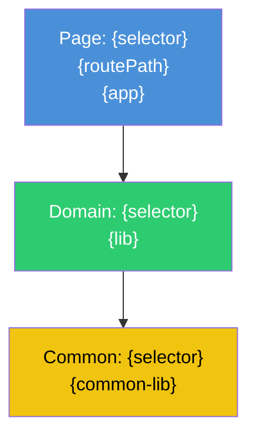
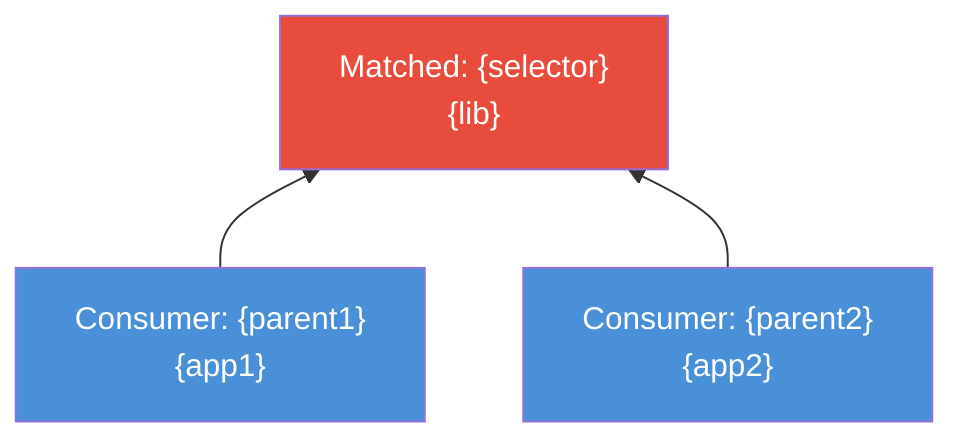

# Component Relationship Graph Template

Generate a Mermaid diagram showing the component hierarchy for the matched component.

## Layer Colors

| Layer | Color | Node prefix |
|-------|-------|-------------|
| Page component | Blue (#4A90D9) | PAGE |
| Domain component | Green (#2ECC71) | DOMAIN |
| Domain shared (_shared/) | Teal (#1ABC9C) | SHARED |
| Common component (shared library) | Yellow (#F1C40F) | COMMON |
| Platform component | Gray (#95A5A6) | PLATFORM |

## Template

## How to Build the Graph

1. Start with the matched component as the root node
2. Read its `childSelectors` from the index
3. For each child selector, look up the component in `selectorIndex`
4. Classify each child by layer (page/domain/common/platform)
5. Add edges from parent to child
6. Recurse one level deep for domain components (show their common children)
7. Do NOT recurse into common components (they're leaf nodes in the graph)

## Graph Rules

- **Max depth**: 2 levels (page -> domain -> common)
- **Max nodes**: 15 (truncate with "... and N more" if exceeded)
- **Deduplicate**: If the same common component appears under multiple domains, show it once with multiple edges
- **Root highlighting**: The matched component gets a thicker border or bold label
- **Version label**: Add (V1) or (V2) suffix if mixing Angular versions

## When Matched Component is a Reusable Component

If the match is a `libs/` component (not a page), reverse the graph:

Use `parentSelectors` from the index to find consumers. Limit to 10 consumers max.
