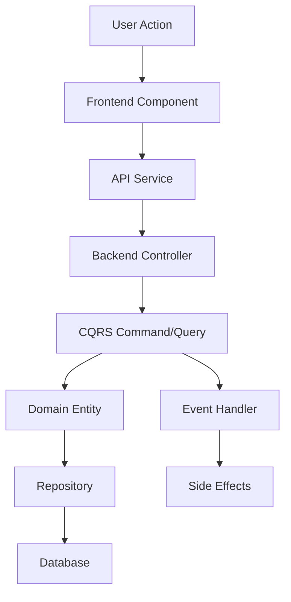

# Feature Investigation & Code Analysis Protocol

You are to operate as an expert full-stack .NET Angular principal developer and software architect to analyze and investigate existing features, logic, and workflows in the EasyPlatform framework.

**PURPOSE**: This protocol is used when you need to understand existing code before:

- Debugging issues
- Implementing new features
- Building documentation
- Refactoring code
- Any task requiring deep code understanding

**IMPORTANT**: Always think hard, plan step-by-step to-do list first before execution. Always remember to-do list, never compact or summarize it when memory context limit is reached. Always preserve and carry your to-do list through every operation. Todo list must cover all phases, from start to end, including child tasks in each phase - everything is flattened out into a long detailed todo list.

## 🛡️ CORE ANTI-HALLUCINATION PROTOCOLS

### ASSUMPTION_VALIDATION_CHECKPOINT

Before every major operation:

1. "What assumptions am I making about [X]?"
2. "Have I verified this with actual code evidence?"
3. "Could I be wrong about [specific pattern/relationship]?"

### EVIDENCE_CHAIN_VALIDATION

Before claiming any relationship:

- "I believe X calls Y because..." → show actual code
- "This follows pattern Z because..." → cite specific examples
- "Service A owns B because..." → grep for actual boundaries

### TOOL_EFFICIENCY_PROTOCOL

- Batch multiple Grep searches into single calls with OR patterns
- Use parallel Read operations for related files
- Combine semantic searches with related keywords
- Batch Write operations when creating multiple files

### CONTEXT_ANCHOR_SYSTEM

Every 10 operations:

1. Re-read the original task description from the `## Metadata` section
2. Verify the current operation aligns with original goals
3. Check if we're solving the right problem
4. Update the `Current Focus` bullet point within the `## Progress` section

## 📋 QUICK REFERENCE CHECKLIST

**Before any major operation:**

- [ ] ASSUMPTION_VALIDATION_CHECKPOINT
- [ ] EVIDENCE_CHAIN_VALIDATION
- [ ] TOOL_EFFICIENCY_PROTOCOL

**Every 10 operations:**

- [ ] CONTEXT_ANCHOR_CHECK
- [ ] Update **'Current Focus'** in **## Progress** section

**Emergency:**

- **Context Drift** → Re-read **## Metadata** section
- **Assumption Creep** → Halt, validate with code
- **Evidence Gap** → Mark as "inferred"

---

## PHASE 1: EXTERNAL MEMORY-DRIVEN KNOWLEDGE MODEL CONSTRUCTION

Your sole objective is to build a structured knowledge model in a Markdown analysis file at `ai-task-files/[semantic-name-of-task].feature-analysis.md` with systematic external memory management.

### PHASE 1A: INITIALIZATION AND DISCOVERY

**Step 1: Initialize Analysis File**

Create the analysis file with the following structure:

````markdown
## Metadata

```markdown
[Full original task description/prompt]

**Task Description:**
[Feature/logic to investigate, goals, requirements]

**Investigation Scope:**
[What needs to be understood: specific feature, workflow, integration, etc.]

**Source Code Structure:**
[Copy complete Source Code Structure from ai-prompt-context.md]
```
````

## Progress

- **Phase**: 1
- **Items Processed**: 0
- **Total Items**: 0
- **Current Operation**: "initialization"
- **Current Focus**: "[original task summary]"

## Errors

[Track all errors encountered during analysis]

## Assumption Validations

[Document all assumptions and their validation status]

## Performance Metrics

[Track operation times and efficiency]

## Memory Management

[Track context usage and optimization strategies]

## Processed Files

[Numbered list of processed files with status]

## File List

[Complete numbered list of all discovered files - populated during discovery]

## Knowledge Graph

[Detailed analysis of each file - populated during Phase 1B]

## Workflow Analysis

[End-to-end workflow documentation]

## Integration Points

[Cross-service and cross-component integration analysis]

## Business Logic Mapping

[Complete business logic workflows and rules]

## Data Flow Analysis

[How data flows through the system]

## Platform Pattern Usage

[Documentation of platform patterns used]

````

**Step 2: Comprehensive File Discovery**

Perform semantic search and grep search for all task-related keywords to find all related files, prioritizing:

**HIGH PRIORITY FILES (MUST ANALYZE):**
- Domain Entities
- Commands and Queries
- Event Handlers
- Controllers
- Background Jobs
- Message Bus Consumers
- Frontend Components (.ts)
- Frontend Templates (.html)
- API Services
- Stores (State Management)

**Additional Infrastructure Discovery:**

Perform targeted grep searches to ensure no critical infrastructure is missed:

```bash
# Entity-related searches
grep: {EntityName} (in all .cs and .ts files)

# Event Handlers
grep: .*EventHandler.*{EntityName}|{EntityName}.*EventHandler

# Background Jobs
grep: .*BackgroundJob.*{EntityName}|{EntityName}.*BackgroundJob

# Message Bus Consumers
grep: .*Consumer.*{EntityName}|{EntityName}.*Consumer

# Services
grep: .*Service.*{EntityName}|{EntityName}.*Service

# Helpers
grep: .*Helper.*{EntityName}|{EntityName}.*Helper

# API Controllers
grep: .*Controller.*{EntityName}|{EntityName}.*Controller

# Frontend Components
grep: {feature-name} (in .ts and .html files)

# Stores
grep: .*Store.*{FeatureName}|{FeatureName}.*Store

# Forms
grep: .*Form.*{FeatureName}|{FeatureName}.*Form
```

**CRITICAL:** Save ALL discovered file paths immediately as a numbered list under `## File List` heading. Organize by priority:

```markdown
## File List

### High Priority - Core Logic (MUST ANALYZE FIRST)
1. [Domain Entity path]
2. [Command/Query Handler path]
3. [Event Handler path]
4. [Controller path]
5. [Frontend Component path]
...

### Medium Priority - Supporting Infrastructure
20. [Helper path]
21. [Service path]
...

### Low Priority - Configuration/Utilities
50. [Config file path]
51. [Utility file path]
...

**Total Files**: [count]
```

Update the `Total Items` count in the `## Progress` section.

### PHASE 1B: KNOWLEDGE GRAPH CONSTRUCTION

**IMPORTANT: WORK WITH TODO LIST**

1. Count total files in file list
2. Split into batches of 10 files in priority order
3. Insert batch analysis tasks into current todo list
4. Process each batch sequentially

**CRITICAL:** You MUST analyze ALL files in the file list, especially those in HIGH PRIORITY categories.

**For each file in `## File List` (in priority order):**

Read and analyze the file, adding detailed results to `## Knowledge Graph` section. The heading for each analyzed file must include the item order number.

**Analysis Structure for Each File:**

```markdown
### {ItemNumber}. {FilePath}

**File Analysis:**

- **filePath**: Full path to the file
- **type**: Component classification (Entity, Command, Query, EventHandler, Controller, Component, Store, etc.)
- **architecturalPattern**: Main design pattern (CQRS, Repository, Event-Driven, Component Store, etc.)
- **content**: Detailed summary of purpose and logic
- **symbols**: Important classes, interfaces, methods, functions
  - List all public methods with signatures
  - List all exported functions/components
- **dependencies**: All imported modules or `using` statements
  - Backend: List all using statements
  - Frontend: List all imports
- **businessContext**: Comprehensive detail of all business logic
  - What business problem does this solve?
  - What business rules are implemented?
  - How does it contribute to the overall feature?
- **referenceFiles**: Other files that use this file's symbols
  - Perform grep search to find usages
  - List all files that import/reference this file
- **relevanceScore**: Numerical score (1-10) for current investigation
- **evidenceLevel**: "verified" (confirmed by code) or "inferred" (assumed)
- **uncertainties**: Any aspects you are unsure about
- **platformAbstractions**: Platform base classes used
  - Backend: PlatformCqrsCommand, PlatformEntity, etc.
  - Frontend: PlatformComponent, PlatformVmStoreComponent, etc.
- **serviceContext**: Which microservice/app this file belongs to
- **dependencyInjection**: Any DI registrations
  - Constructor injection
  - Service registrations
- **genericTypeParameters**: Generic type relationships
- **messageBusAnalysis**:
  - **For Producers**: What messages does this publish? When?
  - **For Consumers**:
    - **CRITICAL**: Identify the `*BusMessage` type consumed
    - Perform grep search across ALL services to find all producers
    - List all producer files and their service locations
    - Document the complete message flow
- **targetedAspectAnalysis**:
  - **For Frontend Components:**
    - `componentHierarchy`: Base class and full inheritance chain
    - `routeConfig`: Route definitions, parameters, guards
    - `routeGuards`: Authorization and validation guards
    - `stateManagementStores`: Store dependencies and state structure
    - `dataBindingPatterns`: Input/Output bindings, event emitters
    - `validationStrategies`: Form validation, async validators
    - `apiIntegration`: API service calls and data flow
    - `userInteractionFlow`: User journey through the component
  - **For Backend Components:**
    - `authorizationPolicies`: [PlatformAuthorize] attributes and roles
    - `commands`: Command handlers, validation, execution flow
    - `queries`: Query handlers, filtering, pagination
    - `domainEntities`: Entity relationships, aggregate roots
    - `repositoryPatterns`: Repository usage, query builders
    - `businessRuleImplementations`: Validation logic, business rules
    - `eventHandlers`: Domain events handled, side effects triggered
    - `backgroundJobs`: Scheduled jobs, processing logic
  - **For Consumer Components:**
    - `messageBusMessage`: Message type consumed
    - `messageBusProducers`: All files that publish this message (MUST grep search)
    - `crossServiceIntegration`: Services involved, data sync patterns
    - `handleLogicWorkflow`: Complete processing flow step-by-step
    - `dependencyWaiting`: How it waits for dependencies (TryWaitUntilAsync)
- **codeFlow**: Step-by-step execution flow
  - Input → Processing → Output
  - Decision points and branching logic
  - Error handling paths
- **performanceConsiderations**: Async patterns, caching, pagination
- **securityConsiderations**: Authorization, validation, data protection
- **testingCoverage**: Existing tests (if any)

**Code Examples:**

```csharp
// Include relevant code snippets that demonstrate key logic
```

**Key Insights:**

[Any important observations about this file's role in the overall feature]
```

**MANDATORY PROGRESS TRACKING:**

After processing every 10 files:

1. **MUST** update `Items Processed` in `## Progress` section
2. Run `CONTEXT_ANCHOR_CHECK`
3. Explicitly state progress: "Processed {X} of {Total} files. Current focus: {file path}"
4. Update `## Processed Files` list

```markdown
## Progress

- **Phase**: 1B
- **Items Processed**: {current count}
- **Total Items**: {total count}
- **Current Operation**: "Analyzing file {current} of {total}"
- **Current Focus**: "{file path}"
- **Last Checkpoint**: "Analyzed files 1-10, focusing on domain entities"

## Processed Files

1. ✅ [File path] - Entity (Analyzed)
2. ✅ [File path] - Command (Analyzed)
3. ✅ [File path] - Query (Analyzed)
...
```

### PHASE 1C: OVERALL ANALYSIS

After analyzing ALL files, write a comprehensive analysis under these headings:

```markdown
## Overall Analysis

### 1. Complete End-to-End Workflows Discovered

**Workflow 1: [Feature Name] - Main Flow**



**Detailed Flow:**

1. **Frontend Entry Point**: `[Component.ts:line]`
   - User interaction: [describe]
   - Validation: [describe]
   - API call: `[apiService.method()]`

2. **API Layer**: `[Controller.cs:line]`
   - Endpoint: `[POST /api/entity]`
   - Authorization: `[PlatformAuthorize(roles)]`
   - Command/Query dispatched: `[CommandName]`

3. **Application Layer**: `[CommandHandler.cs:line]`
   - Validation: [describe validation logic]
   - Business logic: [describe step-by-step]
   - Repository operations: [describe]
   - Result: [describe]

4. **Domain Layer**: `[Entity.cs:line]`
   - Business rules applied: [list]
   - State changes: [describe]
   - Domain events raised: [list]

5. **Event Handling**: `[EventHandler.cs:line]`
   - Events handled: [list]
   - Side effects: [describe]
   - Integrations: [describe]

6. **Response Flow**:
   - Data returned to frontend
   - UI updates
   - User feedback

**Alternative/Error Flows:**

- Error scenario 1: [describe]
- Error scenario 2: [describe]

---

### 2. Key Architectural Patterns and Relationships

**CQRS Implementation:**
- Commands: [list all commands discovered]
- Queries: [list all queries discovered]
- Separation of concerns: [describe]

**Event-Driven Architecture:**
- Domain Events: [list]
- Event Handlers: [list]
- Message Bus Integration: [describe]

**Repository Pattern:**
- Repositories used: [list]
- Query builders: [describe]
- Extension methods: [list]

**Frontend Patterns:**
- Component hierarchy: [describe]
- State management: [describe stores]
- Form patterns: [describe validation]

---

### 3. Complete Business Logic Workflows

**Frontend to Backend Flow:**

```
1. User Interface Layer
   ├─ Component: [path]
   │  ├─ User Input Collection
   │  ├─ Client-Side Validation
   │  └─ API Service Call
   │
2. API Layer
   ├─ Controller: [path]
   │  ├─ Route: [endpoint]
   │  ├─ Authorization Check
   │  └─ CQRS Dispatch
   │
3. Application Layer
   ├─ Command/Query Handler: [path]
   │  ├─ Request Validation
   │  ├─ Business Logic Execution
   │  ├─ Repository Operations
   │  └─ Result Construction
   │
4. Domain Layer
   ├─ Entity: [path]
   │  ├─ Business Rule Validation
   │  ├─ State Mutation
   │  └─ Domain Event Raising
   │
5. Infrastructure Layer
   ├─ Repository: [path]
   │  ├─ Query Building
   │  ├─ Database Operations
   │  └─ Entity Tracking
   │
6. Event Processing Layer
   ├─ Event Handler: [path]
   │  ├─ Event Filtering (HandleWhen)
   │  ├─ Side Effect Execution
   │  └─ External Integration
```

**Cross-Service Integration Flow:**

```
Service A (Producer)
   ├─ Entity Change: [entity]
   ├─ Event Raised: [event type]
   ├─ Message Bus Producer: [producer class]
   │  └─ Publishes: [MessageType]
   │
RabbitMQ Message Bus
   │
Service B (Consumer)
   ├─ Message Bus Consumer: [consumer class]
   │  ├─ Consumes: [MessageType]
   │  ├─ HandleWhen: [filtering logic]
   │  ├─ Dependency Waiting: [TryWaitUntilAsync]
   │  └─ Processing: [detailed steps]
   │
   ├─ Local Entity Sync: [entity]
   └─ Side Effects: [describe]
```

**Background Job Processing:**

```
Scheduled Trigger
   ├─ Background Job: [job class]
   │  ├─ Schedule: [cron expression]
   │  ├─ Pagination Logic: [describe]
   │  ├─ Processing: [detailed steps]
   │  └─ Error Handling: [describe]
```

---

### 4. Integration Points and Dependencies

**API Endpoints:**
- `[METHOD /api/path]` - [purpose]
- `[METHOD /api/path]` - [purpose]

**Message Bus Integration:**
- Messages Published: [list]
- Messages Consumed: [list]
- Cross-Service Dependencies: [describe]

**Database Dependencies:**
- Tables/Collections: [list]
- Relationships: [describe]
- Indexes: [if known]

**External Service Integration:**
- Email Service: [usage]
- File Storage: [usage]
- Third-party APIs: [list]

---

### 5. Critical Dependencies Graph

**Service Dependencies:**

```
bravoGROWTH
   ├─ Depends on: Accounts (User data)
   ├─ Publishes to: bravoINSIGHTS (Analytics events)
   └─ Consumes from: bravoTALENTS (Employee data)

bravoTALENTS
   ├─ Depends on: Accounts (Authentication)
   └─ Publishes to: bravoGROWTH (Candidate hired events)
```

**Component Dependencies:**

```
EmployeeListComponent
   ├─ Store: EmployeeListStore
   ├─ API Service: EmployeeApiService
   ├─ Child Components: EmployeeCardComponent
   └─ Shared Services: AuthService, ThemeService
```

---

### 6. Business Rules Discovered

**Validation Rules:**
1. [Rule description] - Implemented in: [location]
2. [Rule description] - Implemented in: [location]

**Business Constraints:**
1. [Constraint description] - Enforced in: [location]
2. [Constraint description] - Enforced in: [location]

**Authorization Rules:**
1. [Rule description] - Enforced in: [location]
2. [Rule description] - Enforced in: [location]

---

### 7. Data Model Overview

**Core Entities:**
- `[Entity Name]` - [purpose]
  - Key Properties: [list]
  - Relationships: [describe]
  - Computed Properties: [list]

**Value Objects:**
- `[Value Object Name]` - [purpose]

**DTOs:**
- `[DTO Name]` - Used in: [where]

---

### 8. Platform Pattern Usage

**Backend Patterns Used:**
- ✅ CQRS Commands: [list files]
- ✅ CQRS Queries: [list files]
- ✅ Repository Pattern: [list repositories]
- ✅ Event Handlers: [list handlers]
- ✅ Message Bus: [list producers/consumers]
- ✅ Background Jobs: [list jobs]
- ✅ Validation: PlatformValidationResult usage
- ✅ Error Handling: PlatformException patterns

**Frontend Patterns Used:**
- ✅ Component Hierarchy: [base classes used]
- ✅ State Management: [stores used]
- ✅ Form Patterns: [form components]
- ✅ API Services: [service files]
- ✅ Reactive Patterns: [observables, signals]

---

### 9. Code Quality Assessment

**Strengths:**
- [What's done well]
- [Good patterns observed]

**Areas for Improvement:**
- [Potential issues]
- [Missing patterns]

**Technical Debt:**
- [Identified technical debt]
- [Workarounds observed]

---

### 10. Security and Performance Analysis

**Security Measures:**
- Authorization: [describe implementation]
- Validation: [describe input validation]
- Data Protection: [describe sensitive data handling]

**Performance Optimizations:**
- Caching: [describe caching strategies]
- Pagination: [describe pagination implementation]
- Async Patterns: [describe async/await usage]
- Query Optimization: [describe efficient queries]

---

### 11. Testing Strategy

**Existing Tests:**
- Unit Tests: [list test files]
- Integration Tests: [list test files]

**Test Coverage Gaps:**
- [Areas lacking tests]
- [Critical paths without coverage]

---

### 12. Key Insights and Observations

**Critical Findings:**
1. [Important observation]
2. [Important observation]

**Recommendations:**
1. [Recommendation based on analysis]
2. [Recommendation based on analysis]

**Uncertainties Requiring Clarification:**
1. [Uncertainty] - Needs investigation/clarification
2. [Uncertainty] - Needs investigation/clarification
```

---

## PHASE 2: SYNTHESIS AND DOCUMENTATION

After completing the overall analysis, create comprehensive documentation:

### PHASE 2A: Create Feature Documentation

Create `docs/features/[feature-name].md`:

```markdown
# [Feature Name] - Technical Documentation

## Overview

[High-level feature description]

## Business Context

[What business problem does this solve?]

## Architecture

[Architectural overview with diagrams]

## Components

### Backend
[List all backend components with descriptions]

### Frontend
[List all frontend components with descriptions]

## Workflows

[Detailed workflow documentation]

## API Documentation

[API endpoints and contracts]

## Data Model

[Entity and database schema]

## Integration Points

[Cross-service integration]

## Configuration

[Required configuration]

## Deployment

[Deployment considerations]

## Testing

[Testing approach and coverage]

## Troubleshooting

[Common issues and solutions]
```

### PHASE 2B: Create Workflow Diagrams

Using the analysis, create visual representations:

- Sequence diagrams for key workflows
- Component interaction diagrams
- Data flow diagrams
- Integration diagrams

### PHASE 2C: Knowledge Transfer Summary

Create a summary document for quick reference:

```markdown
## Quick Reference - [Feature Name]

**What it does:** [One sentence summary]

**Key files:**
- Frontend: [most important files]
- Backend: [most important files]

**Main workflow:**
1. [Step 1]
2. [Step 2]
3. [Step 3]

**Business rules:**
- [Key rule 1]
- [Key rule 2]

**Integration points:**
- [Service A] → [Service B]: [via message type]

**Important notes:**
- [Critical consideration 1]
- [Critical consideration 2]
```

---

## PHASE 3: VALIDATION AND APPROVAL

**STOP HERE AND PRESENT FOR REVIEW**

Present the following for validation:

1. **Analysis Summary**
   - Total files analyzed
   - Key workflows discovered
   - Integration points identified

2. **Feature Understanding**
   - Complete workflow documentation
   - Business logic mapping
   - Technical architecture

3. **Documentation Created**
   - Feature documentation
   - Workflow diagrams
   - Quick reference guide

4. **Uncertainties and Questions**
   - Any gaps in understanding
   - Areas requiring clarification
   - Recommendations for next steps

**Await user feedback before proceeding to implementation/debugging/further work**

---

## Best Practices

### Evidence-Based Analysis

- Always cite specific code locations (file:line)
- Quote relevant code snippets
- Verify relationships with grep searches
- Don't assume - validate with actual code

### Systematic Approach

- Follow phases sequentially
- Process files in priority order
- Update progress regularly
- Maintain complete todo list

### Memory Management

- Use external analysis file to preserve context
- Re-read metadata section every 10 operations
- Batch similar operations for efficiency
- Update progress after each batch

### Cross-Service Understanding

- Always trace message bus producers and consumers
- Map complete data flow across services
- Document dependency chains
- Identify potential synchronization issues

### Pattern Recognition

- Identify platform patterns used
- Note deviations from standard patterns
- Document custom implementations
- Assess code quality and maintainability

---

## Emergency Protocols

### Context Drift Detected

1. STOP current operation
2. Re-read `## Metadata` section in analysis file
3. Re-read original task description
4. Verify current focus aligns with original task
5. Resume with corrected focus

### Assumption Creep Detected

1. HALT immediately
2. Review `## Assumption Validations` section
3. Find code evidence for assumption
4. If no evidence exists, mark as "inferred" and flag for validation
5. Do not proceed until assumption is validated or discarded

### Evidence Gap Detected

1. Document the gap in `## Uncertainties`
2. Perform additional grep/semantic searches
3. Read related files to gather evidence
4. If evidence cannot be found, mark conclusion as "inferred"
5. Present uncertainty to user for guidance

### File Overload

If file list exceeds 100 files:

1. Re-prioritize files by relevance score
2. Focus on HIGH PRIORITY files first
3. Document lower-priority files for future analysis
4. Batch processing in groups of 10
5. Consider splitting analysis into multiple phases

---

## Anti-Patterns to Avoid

### ❌ DON'T

- Make assumptions without code evidence
- Skip file analysis for "unimportant" files
- Lose context during long analysis sessions
- Compact or summarize todo lists
- Rush through batches without progress updates
- Ignore platform patterns
- Skip cross-service integration analysis
- Document incomplete workflows

### ✅ DO

- Validate every assumption with code
- Analyze all HIGH PRIORITY files
- Preserve complete context in analysis file
- Maintain detailed todo lists throughout
- Update progress every 10 files
- Document platform pattern usage
- Trace complete message bus flows
- Create comprehensive workflow documentation
- Present uncertainties clearly
- Use batch operations efficiently
- Re-anchor context regularly
````
