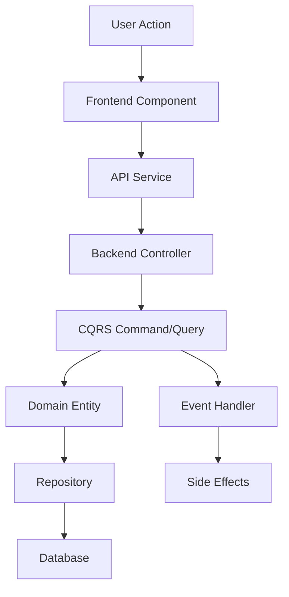

# Debug Issue

**Reported Issues:**

-   **Issue Description:** ${input:issue}
-   **Error Message/Stack Trace:** ${input:error}
-   **Affected Area:** ${input:area:Backend,Frontend,Cross-Service,Database,API}

Use the `debugger` subagent to find the root cause of the issues, then analyze and explain the reports to the user.

**IMPORTANT**: **Do not** implement the fix automatically.
**IMPORTANT:** Analyze the skills catalog and activate the skills that are needed for the task during the process.
**IMPORTANT:** Sacrifice grammar for the sake of concision when writing outputs.
**IMPORTANT:** Always think hard, plan step-by-step todo list first before execution. Always remember todo list, never compact or summarize it when memory context limit reached. Always preserve and carry your todo list through every operation.

---

## 🛡️ CORE ANTI-HALLUCINATION PROTOCOLS

**ASSUMPTION_VALIDATION_CHECKPOINT** - Before every major operation:

1. "What assumptions am I making about [X]?"
2. "Have I verified this with actual code evidence?"
3. "Could I be wrong about [specific pattern/relationship]?"

**EVIDENCE_CHAIN_VALIDATION** - Before claiming any relationship:

-   "I believe X calls Y because..." → show actual code
-   "This follows pattern Z because..." → cite specific examples
-   "Service A owns B because..." → grep for actual boundaries

**TOOL_EFFICIENCY_PROTOCOL**:

-   Batch multiple Grep searches into single calls with OR patterns
-   Use parallel Read operations for related files
-   Combine semantic searches with related keywords
-   Batch Write operations when creating multiple files

**CONTEXT_ANCHOR_SYSTEM** - Every 10 operations:

1. Re-read original task description from `## Metadata` section
2. Verify current operation aligns with original goals
3. Check if we're solving the right problem
4. Update `Current Focus` bullet point in `## Progress` section

**QUICK REFERENCE CHECKLIST:**

Before any major operation:

-   [ ] ASSUMPTION_VALIDATION_CHECKPOINT
-   [ ] EVIDENCE_CHAIN_VALIDATION
-   [ ] TOOL_EFFICIENCY_PROTOCOL

Every 10 operations:

-   [ ] CONTEXT_ANCHOR_CHECK
-   [ ] Update 'Current Focus' in Progress section

Emergency:

-   **Context Drift** → Re-read Metadata section
-   **Assumption Creep** → Halt, validate with code
-   **Evidence Gap** → Mark as "inferred"

---

## CRITICAL: External Memory & Task Management

**For ALL debugging investigations, you MUST:**

1. **Create TODO List FIRST** - Before starting analysis, break down the investigation into small, granular tasks using `manage_todo_list` tool
2. **Create External Analysis Report** - Save progress to prevent context loss:
    - **File Location:** `.ai/workspace/analysis/debug-analysis-{YYMMDD}-{HHMM}-{slug}.md`
    - **Update Frequency:** After completing each TODO task or every 10 operations
    - **Recovery Protocol:** If context is lost, read the most recent analysis file to resume

**Analysis Report Structure:**

````markdown
# Debug Analysis: {Issue Summary}

> Created: {timestamp}
> Status: {in-progress|completed}
> Confidence: {0-100%}

## Metadata

```markdown
[Full original bug description/prompt]

**Task Description:**
[Bug details, symptoms, error messages, stack traces]

**Source Code Structure:**
[Copy complete Source Code Structure from .ai/docs/prompt-context.md]
```
````

## Progress

-   **Phase**: 1
-   **Items Processed**: 0
-   **Total Items**: 0
-   **Current Operation**: "initialization"
-   **Current Focus**: "[original bug diagnosis task]"

## Errors

[Track all errors encountered during analysis]

## Assumption Validations

[Document all assumptions and their validation status]

## Performance Metrics

[Track operation times and efficiency]

## Memory Management

[Track context usage and optimization strategies]

## Processed Files

[Numbered list of processed files with status]

## File List

[Complete numbered list of all discovered files - populated during discovery]

## Knowledge Graph

[Detailed analysis of each file - populated during Phase 1B]

## Error Boundaries

[Error tracing and propagation paths]

## Interaction Map

[Component and service dependencies]

## Platform Error Patterns

[Platform-specific error handling patterns discovered]

## Root Cause Analysis

[Multi-dimensional root cause analysis]

## Fix Strategy

[Comprehensive fix strategy with alternatives]

## TODO Progress

-   [x] Completed task 1
-   [x] Completed task 2
-   [ ] Current task 3
-   [ ] Pending task 4

## Investigation Timeline

{Chronological log of findings with timestamps}

## Evidence Collected

| Source     | Finding | File/Line | Status |
| ---------- | ------- | --------- | ------ |
| Error logs | ...     | path:line | ✅     |
| Code trace | ...     | path:line | 🔄     |

## Hypotheses

1. **Hypothesis 1** - Confidence: 70%
    - Evidence: ...
    - Counter-evidence: ...

## Root Cause Analysis

{Current understanding of the root cause}

## Next Steps

1. {Immediate next action}
2. {Following action}

## Unresolved Questions

-   [ ] Question 1
-   [ ] Question 2

````

**Why This Matters:**
- Long debugging sessions can exceed context window
- External files preserve critical findings
- TODO tracking ensures no steps are skipped
- Enables resumption after interruptions

---

## PHASE 1: EXTERNAL MEMORY-DRIVEN BUG ANALYSIS

**Objective:** Build a structured knowledge model in the analysis file with systematic external memory management.

### PHASE 1A: INITIALIZATION AND DISCOVERY

**MANDATORY FIRST ACTIONS:**
1. **Create TODO list** using `manage_todo_list` tool with all investigation phases
2. **Create analysis report** at `.ai/workspace/analysis/debug-analysis-{YYMMDD}-{HHMM}-{slug}.md`
3. **Initialize Metadata section** with full original prompt in markdown code block
4. **Update TODO status** as each step completes

**🐛 DEBUGGING-SPECIFIC DISCOVERY**

Perform ERROR_BOUNDARY_DISCOVERY focusing on:

1. **Error Tracing Analysis:**
   - Find stack traces in error messages
   - Map error propagation paths
   - Identify error handling patterns
   - Document under `## Error Boundaries`

2. **Component Interaction Debugging:**
   - Discover service dependencies
   - Find relevant endpoints/handlers
   - Analyze request/response flows
   - Document under `## Interaction Map`

3. **Platform Debugging Intelligence:**
   - Find platform error patterns (`PlatformValidationResult`, `PlatformException`)
   - CQRS error paths (Command/Query validation failures)
   - Repository error patterns
   - Document under `## Platform Error Patterns`

**Comprehensive File Discovery:**

Perform semantic search and grep search for all task-related keywords, prioritizing:

**HIGH PRIORITY FILES (MUST ANALYZE):**
- Domain Entities
- Commands and Queries
- Event Handlers
- Controllers
- Background Jobs
- Message Bus Consumers
- Frontend Components (.ts)

**Additional Infrastructure Discovery:**

Perform targeted grep searches:
```bash
# Event Handlers
grep: .*EventHandler.*{EntityName}|{EntityName}.*EventHandler

# Background Jobs
grep: .*BackgroundJob.*{EntityName}|{EntityName}.*BackgroundJob

# Message Bus Consumers
grep: .*Consumer.*{EntityName}|{EntityName}.*Consumer

# Services
grep: .*Service.*{EntityName}|{EntityName}.*Service

# Helpers
grep: .*Helper.*{EntityName}|{EntityName}.*Helper

# All code files
include pattern: **/*.{cs,ts,html}
````

**CRITICAL:** Save ALL discovered file paths immediately as a numbered list under `## File List` heading. Update the `Total Items` count in the `## Progress` section.

**AFTER DISCOVERY:**

-   [ ] **Update analysis report** with all discovered files
-   [ ] **Mark discovery TODO** as completed
-   [ ] **Document search patterns used**

---

### PHASE 1B: SYSTEMATIC FILE ANALYSIS FOR DEBUGGING

**IMPORTANT: WORK WITH TODO LIST**

1. Count total files in file list
2. Split into batches of 10 files in priority order
3. Insert batch analysis tasks into current todo list
4. Process each batch sequentially

**CRITICAL:** You MUST analyze ALL files in the file list, especially those in HIGH PRIORITY categories.

**For each file in `## File List` (in priority order):**

Read and analyze the file, adding detailed results to `## Knowledge Graph` section. The heading for each analyzed file must include the item order number.

**Analysis Structure for Each File:**

````markdown
### {ItemNumber}. {FilePath}

**File Analysis:**

-   **filePath**: Full path to the file
-   **type**: Component classification (Entity, Command, Query, EventHandler, Controller, etc.)
-   **architecturalPattern**: Main design pattern (CQRS, Repository, Event-Driven, etc.)
-   **content**: Summary of purpose and logic
-   **symbols**: Important classes, interfaces, methods
-   **dependencies**: All imported modules or `using` statements
-   **businessContext**: Comprehensive detail of all business logic and how it contributes to requirements
-   **referenceFiles**: Other files that use this file's symbols
-   **relevanceScore**: Numerical score (1-10) for bug investigation
-   **evidenceLevel**: "verified" (confirmed by code) or "inferred" (assumed)
-   **uncertainties**: Any aspects you are unsure about
-   **platformAbstractions**: Platform base classes used (e.g., PlatformCqrsCommand, PlatformComponent)
-   **serviceContext**: Which microservice this file belongs to
-   **dependencyInjection**: Any DI registrations
-   **genericTypeParameters**: Generic type relationships
-   **messageBusAnalysis**:
    -   **CRITICAL FOR CONSUMERS**: When analyzing any Consumer file (files ending with `Consumer.cs` that extend `PlatformApplicationMessageBusConsumer<T>`), identify the `*BusMessage` type used. Then perform a grep search across ALL services to find files that **send/publish** this message type. List all producer files and their service locations in the `messageBusProducers` field. This analysis is crucial for understanding cross-service integration.
-   **targetedAspectAnalysis**:
    -   **For Front-End Components:**
        -   `componentHierarchy`: Base class and inheritance chain
        -   `routeConfig`: Route definitions and parameters
        -   `routeGuards`: Authorization guards
        -   `stateManagementStores`: Store dependencies
        -   `dataBindingPatterns`: Input/Output bindings
        -   `validationStrategies`: Form validation logic
    -   **For Back-End Components:**
        -   `authorizationPolicies`: [PlatformAuthorize] attributes
        -   `commands`: Command handlers and logic
        -   `queries`: Query handlers and logic
        -   `domainEntities`: Entity relationships
        -   `repositoryPatterns`: Repository usage
        -   `businessRuleImplementations`: Validation and business rules
    -   **For Consumer Components:**
        -   `messageBusMessage`: Message type consumed
        -   `messageBusProducers`: Files that publish this message (MUST grep search)
        -   `crossServiceIntegration`: Services involved
        -   `handleLogicWorkflow`: Complete processing flow
-   **errorPatterns**: Exception handling, validation logic, error propagation
-   **stackTraceRelevance**: Relation to any stack traces in bug report
-   **debuggingComplexity**: Difficulty to debug (1-10)
-   **errorPropagation**: How errors flow through this component
-   **platformErrorHandling**: Use of platform error patterns (PlatformValidationResult, etc.)
-   **crossServiceErrors**: Any cross-service error scenarios
-   **validationLogic**: Business rule validation that could fail
-   **dependencyErrors**: Potential dependency failures

**Code Examples:**

```csharp
// Include relevant code snippets that demonstrate key logic
```
````

**Key Insights:**

[Any important observations about this file's role in the bug]

````

**Update Progress After Each File:**

```markdown
## Progress

- **Phase**: 1B
- **Items Processed**: {current count}
- **Total Items**: {total count}
- **Current Operation**: "Analyzing file {current} of {total}"
- **Current Focus**: "{file path}"
````

**MANDATORY PROGRESS TRACKING:**

After processing every 10 files:

1. **MUST** update `Items Processed` in `## Progress` section
2. Run `CONTEXT_ANCHOR_CHECK`
3. Explicitly state progress: "Processed {X} of {Total} files. Current focus: {file path}"
4. Update `## Processed Files` list

---

### PHASE 1C: OVERALL ANALYSIS

After analyzing ALL files, write a comprehensive `## Overall Analysis` section showing:

````markdown
## Overall Analysis

### End-to-End Workflows Discovered

**Workflow 1: [Feature Name] - Main Flow**


````

**Detailed Flow:**

1. **Frontend Entry Point**: `[Component.ts:line]`

    - User interaction: [describe]
    - Validation: [describe]
    - API call: `[apiService.method()]`

2. **API Layer**: `[Controller.cs:line]`

    - Endpoint: `[POST /api/entity]`
    - Authorization: `[PlatformAuthorize(roles)]`
    - Command/Query dispatched: `[CommandName]`

3. **Application Layer**: `[CommandHandler.cs:line]`

    - Validation: [describe validation logic]
    - Business logic: [describe step-by-step]
    - Repository operations: [describe]
    - Result: [describe]

4. **Domain Layer**: `[Entity.cs:line]`

    - Business rules applied: [list]
    - State changes: [describe]
    - Domain events raised: [list]

5. **Event Handling**: `[EventHandler.cs:line]`

    - Events handled: [list]
    - Side effects: [describe]
    - Integrations: [describe]

6. **Response Flow**:
    - Data returned to frontend
    - UI updates
    - User feedback

**Alternative/Error Flows:**

-   Error scenario 1: [describe]
-   Error scenario 2: [describe]

### Key Architectural Patterns

[Document all patterns discovered: CQRS, Event-Driven, Repository, etc.]

### Complete Business Logic Workflows

**Frontend to Backend Flow:**

-   Frontend Component/Form → HTTP Request → Controller API
-   Controller → CQRS Command/Query → Handler
-   Handler → Domain Logic → Repository
-   Repository → Database → Response
-   Event Handlers → Side Effects (Notifications, Message Bus)
-   Background Jobs → Scheduled Processing → Event Handlers

**Cross-Service Integration:**

-   Service A → Message Bus Producer → RabbitMQ
-   RabbitMQ → Message Bus Consumer → Service B
-   Service B → Processing → Event Handlers

### Integration Points and Dependencies

[All service boundaries, API contracts, message bus dependencies]

### Critical Dependencies Graph

[Visualize key dependencies discovered]

````

---

## PHASE 2: MULTI-DIMENSIONAL ROOT CAUSE ANALYSIS & COMPREHENSIVE FIX STRATEGY

**PREREQUISITE:** Ensure ALL files in `## File List` are analyzed. Then read the ENTIRE analysis file.

Perform systematic analysis under `## Root Cause Analysis` heading:

```markdown
## Root Cause Analysis

### 1. Technical Root Causes

**Code Defects:**
- Null reference errors
- Type mismatches
- Logic errors
- Concurrency issues

**Architectural Issues:**
- Improper dependency injection
- Service boundary violations
- Incorrect use of platform patterns

**Probability**: [High/Medium/Low]
**Evidence**: [Cite specific code locations]

### 2. Business Logic Root Causes

**Rule Violations:**
- Business validation failures
- State machine violations
- Workflow errors

**Validation Failures:**
- Missing validation
- Incorrect validation logic
- Validation order issues

**Probability**: [High/Medium/Low]
**Evidence**: [Cite specific validation logic]

### 3. Process Root Causes

**Missing Validation:**
- Unchecked edge cases
- Missing null checks
- Insufficient input validation

**Inadequate Testing:**
- Untested scenarios
- Missing integration tests

**Probability**: [High/Medium/Low]
**Evidence**: [Analysis of test coverage gaps]

### 4. Data Root Causes

**Data Corruption:**
- Invalid data states
- Orphaned references

**Integrity Violations:**
- Foreign key violations
- Unique constraint violations

**Probability**: [High/Medium/Low]
**Evidence**: [Database schema analysis]

### 5. Environmental Root Causes

**Configuration Issues:**
- Missing configuration
- Incorrect environment settings

**Deployment Problems:**
- Version mismatches
- Migration failures

**Probability**: [High/Medium/Low]
**Evidence**: [Configuration file analysis]

### 6. Integration Root Causes

**API Contract Violations:**
- Breaking changes
- Incompatible versions

**Communication Failures:**
- Message bus failures
- Timeout issues
- Cross-service sync problems

**Probability**: [High/Medium/Low]
**Evidence**: [Message bus analysis, API contract review]

### Potential Root Causes (Ranked by Probability)

1. **[Root Cause Name]** - Probability: [High/Medium/Low]
   - **Evidence**: [Code locations, error patterns]
   - **Impact**: [Severity assessment]
   - **Confidence**: [How certain are we?]

2. **[Root Cause Name]** - Probability: [High/Medium/Low]
   - **Evidence**: [Code locations, error patterns]
   - **Impact**: [Severity assessment]
   - **Confidence**: [How certain are we?]

[Continue for all identified root causes...]
````

**Generate Comprehensive Fix Strategy:**

```markdown
## Fix Strategy

### Strategy 1: [Primary Fix Approach]

**Suggested Fix:**

-   Detailed implementation steps
-   Code changes required
-   Files to modify

**Risk Assessment:**

-   **Risk Level**: [High/Medium/Low]
-   **Potential Issues**: [What could go wrong?]
-   **Affected Components**: [List all impacted areas]

**Regression Mitigation:**

-   Existing functionality to preserve
-   Backward compatibility considerations
-   Edge cases to handle

**Testing Strategy:**

-   Unit tests required
-   Integration tests required
-   Manual testing steps
-   Test data requirements

**Rollback Plan:**

-   Steps to revert changes
-   Data rollback considerations
-   Deployment rollback procedure

**Estimated Effort**: [Time estimate]

### Strategy 2: [Alternative Approach]

[Same structure as Strategy 1]

### Strategy 3: [Another Alternative]

[Same structure as Strategy 1]

### Recommended Strategy

**Choice**: Strategy [X]
**Rationale**: [Why this approach is best]
**Trade-offs**: [Compromises being made]
```

---

### PHASE 2.1: VERIFY AND REFACTOR

**Before finalizing the fix strategy:**

1. **Verify Code Patterns:**

    - Review `.github/copilot-instructions.md`
    - Review `.github/instructions/frontend-angular.instructions.md` (for frontend fixes)
    - Review `.github/instructions/backend-dotnet.instructions.md` (for backend fixes)
    - Ensure solution follows established patterns

2. **Verify Clean Code Rules:**

    - Review `.github/instructions/clean-code.instructions.md`
    - Ensure solution follows SOLID principles
    - Verify naming conventions
    - Check responsibility placement
    - Validate architectural compliance

3. **Update Fix Strategy:**
    - Incorporate pattern compliance
    - Adjust implementation to follow platform conventions
    - Document any deviations with justification

---

## PHASE 3: APPROVAL GATE

**STOP HERE AND PRESENT FOR APPROVAL**

Present the following for explicit user approval:

1. **Root Cause Analysis Summary**

    - Top 3 most probable root causes
    - Supporting evidence for each
    - Confidence levels

2. **Recommended Fix Strategy**

    - Chosen approach
    - Implementation steps
    - Risk assessment
    - Testing plan

3. **Impact Assessment**
    - Files to be modified
    - Components affected
    - Potential side effects

**DO NOT PROCEED TO PHASE 4 WITHOUT EXPLICIT APPROVAL**

---

## PHASE 4: DEBUGGING EXECUTION

**Once approved, execute the plan using DEBUGGING_SAFEGUARDS:**

### Execution Checklist

-   [ ] Create feature branch or backup current state
-   [ ] Implement fix following approved strategy
-   [ ] Follow platform patterns from instruction files
-   [ ] Add/update unit tests
-   [ ] Add/update integration tests
-   [ ] Run all tests
-   [ ] Verify no regressions
-   [ ] Update documentation if needed

### Implementation Guidelines

**Platform Pattern Compliance:**

-   Use `PlatformValidationResult` for validation
-   Use `.Then()`, `.With()`, `.EnsureFound()` helpers
-   Follow CQRS command/query patterns
-   Use repository patterns correctly
-   Implement proper error handling

**Code Quality:**

-   Follow clean code rules
-   Add meaningful comments for complex logic
-   Update XML documentation
-   Maintain consistent abstraction levels

**Testing:**

-   Write tests that prove bug is fixed
-   Test edge cases
-   Test error scenarios
-   Verify existing tests still pass

### Documentation

````markdown
## Debugging Validation

### Fix Implemented

**Files Modified:**

1. [File path] - [Changes made]
2. [File path] - [Changes made]

**Root Cause Addressed:**
[Which root cause was fixed and how]

### Verification Steps

**Tests Added/Modified:**

1. [Test name] - [What it verifies]
2. [Test name] - [What it verifies]

**Manual Testing:**

1. [Test scenario] - [Expected result] - [Actual result]
2. [Test scenario] - [Expected result] - [Actual result]

**Regression Checks:**

-   [ ] Existing functionality preserved
-   [ ] No new errors introduced
-   [ ] All tests passing
-   [ ] Performance not degraded

### Success Criteria Met

-   [ ] Bug no longer reproducible
-   [ ] All tests passing
-   [ ] No regressions detected
-   [ ] Code follows platform patterns
-   [ ] Documentation updated

### Rollback Information

**Rollback Command:**

```bash
git checkout [previous-commit-hash]
```
````

**Rollback Notes:**
[Any special considerations for rollback]

```

```

---

## Debugging Best Practices

### Evidence-Based Debugging

-   Start with actual error messages, stack traces, and logs
-   Verify assumptions with code evidence
-   Use grep/semantic search to find all related code
-   Document evidence chain for all conclusions

### Platform Error Patterns

-   Use `PlatformValidationResult` fluent API
-   Chain validation with `.And()`, `.AndAsync()`, `.AndNot()`
-   Use `.EnsureValid()` at call sites
-   Implement proper exception handling with `PlatformException`

### Hypothesis-Driven Investigation

-   Form hypotheses about root causes
-   Test each hypothesis with code evidence
-   Document findings in analysis file
-   Eliminate hypotheses that don't match evidence

### Systematic Approach

-   Follow phases sequentially
-   Don't skip discovery phase
-   Analyze all high-priority files
-   Document everything in analysis file
-   Get approval before implementing

### Memory Management

-   Use external analysis file to preserve context
-   Update progress regularly
-   Re-read metadata section when context drifts
-   Batch operations for efficiency

### Cross-Service Debugging

-   Always trace message bus producers and consumers
-   Verify cross-service data synchronization
-   Check entity event handlers
-   Analyze background job interactions

---

## Emergency Protocols

### Context Drift Detected

1. STOP current operation
2. Re-read `## Metadata` section in analysis file
3. Re-read original bug description
4. Verify current focus aligns with original task
5. Resume with corrected focus

### Assumption Creep Detected

1. HALT immediately
2. Review `## Assumption Validations` section
3. Find code evidence for assumption
4. If no evidence exists, mark as "inferred" and flag for validation
5. Do not proceed until assumption is validated or discarded

### Evidence Gap Detected

1. Document the gap in `## Uncertainties`
2. Perform additional grep/semantic searches
3. Read related files to gather evidence
4. If evidence cannot be found, mark conclusion as "inferred"
5. Present uncertainty to user for guidance

---

## Anti-Patterns to Avoid

### ❌ DON'T

-   Make assumptions without code evidence
-   Skip file analysis for "low-priority" files that may be relevant
-   Implement fixes without approval
-   Ignore platform patterns
-   Skip testing
-   Proceed with uncertainties unresolved
-   Compact or summarize todo lists
-   Lose context during long operations

### ✅ DO

-   Validate every assumption with code
-   Analyze all files in discovery phase
-   Get explicit approval before implementation
-   Follow platform patterns strictly
-   Write comprehensive tests
-   Document all uncertainties
-   Preserve complete todo lists
-   Use external memory (analysis file)
-   Re-anchor context every 10 operations
-   Batch operations for efficiency

---

## Investigation Methodology

### Step 1: Initial Assessment

**MANDATORY FIRST ACTIONS:**

1. **Create TODO list** using `manage_todo_list` tool with all investigation steps
2. **Create analysis report** at `plans/reports/debug-analysis-{YYMMDD}-{HHMM}-{slug}.md`
3. **Update TODO status** as each step completes

**Assessment Checklist:**

-   [ ] Gather symptoms and error messages
-   [ ] Identify affected components and timeframes
-   [ ] Determine severity and impact scope
-   [ ] Check for recent changes or deployments
-   [ ] **Update analysis report** with initial findings

### Step 2: Data Collection

**Critical Search Patterns:**

-   NEVER assume based on first glance
-   ALWAYS verify with multiple search patterns
-   CHECK both static AND dynamic code usage
-   READ actual implementation, not just interfaces
-   TRACE full dependency chains

**Evidence Sources:**

1. Search for error message text
2. Search for class/method names in stack trace
3. Search for related entity/feature names
4. Query relevant databases using appropriate tools (psql for PostgreSQL)
5. Collect server logs from affected time periods
6. Retrieve CI/CD pipeline logs from GitHub Actions using `gh` command
7. Examine application logs and error traces
8. Use `docs-seeker` skill to read the latest docs of packages/plugins

**Codebase Analysis:**

-   If `docs/codebase-summary.md` exists & up-to-date (< 2 days old), read it
-   Otherwise, use `repomix` command to generate comprehensive codebase summary at `./repomix-output.xml` and create/update `./docs/codebase-summary.md`
-   For GitHub repos: `repomix --remote <github-repo-url>`
-   Only if needed: use `/scout:ext` (preferred) or `/scout` (fallback) to search for specific files

**AFTER DATA COLLECTION:**

-   [ ] **Update analysis report** with all evidence collected
-   [ ] **Mark TODO items** as completed
-   [ ] **Document uncertainties** in analysis report

---

### Step 3: Analysis Process

-   [ ] Correlate events across different log sources
-   [ ] Identify patterns and anomalies
-   [ ] Trace execution paths through the system
-   [ ] Analyze database query performance and table structures
-   [ ] Review test results and failure patterns

**Questions to Answer:**

-   [ ] Where does the error originate?
-   [ ] What is the full call chain?
-   [ ] What are the input values?
-   [ ] When did this start happening?
-   [ ] Is this reproducible?

**AFTER ANALYSIS:**

-   [ ] **Update analysis report** with correlation findings
-   [ ] **Update TODO progress**
-   [ ] **Save intermediate conclusions**

---

### Step 4: Root Cause Identification

-   Use systematic elimination to narrow down causes
-   Validate hypotheses with evidence from logs and metrics
-   Consider environmental factors and dependencies
-   Document the chain of events leading to the issue

**AFTER ROOT CAUSE IDENTIFICATION:**

-   [ ] **Update analysis report** with root cause findings
-   [ ] **Document confidence level** (0-100%)
-   [ ] **List all hypotheses** tested (both valid and invalid)
-   [ ] **Mark investigation TODO** as complete

---

**Common BravoSUITE Issues:**

#### Backend Issues

**Validation Failures**

```csharp
// Check: Validation chain in Command.Validate()
// Check: Async validation in Handler.ValidateRequestAsync()
// Check: Entity validation methods
```

**Repository/Query Issues**

```csharp
// Check: Expression composition (AndAlso, OrElse)
// Check: Eager loading (N+1 queries)
// Check: Null reference in navigation properties
```

**Cross-Service Communication**

```csharp
// Check: Message bus consumer HandleWhen() filter
// Check: TryWaitUntilAsync() timeout for dependencies
// Check: LastMessageSyncDate for race conditions
```

**Entity Event Handler Issues**

```csharp
// Check: HandleWhen() is public override async Task<bool>
// Check: Single generic parameter on base class
// Check: Correct CrudAction filter
```

#### Frontend Issues

**State Management**

```typescript
// Check: Store initialization in providers array
// Check: Effect subscription management
// Check: Signal updates triggering change detection
```

**API Calls**

```typescript
// Check: observerLoadingErrorState() usage
// Check: untilDestroyed() for subscription cleanup
// Check: Error handling in tapResponse()
```

**Form Validation**

```typescript
// Check: Async validator conditions (ifAsyncValidator)
// Check: Dependent validations configuration
// Check: Form control initialization timing
```

```

---

### Step 5: Solution Development

**Before Implementing Fixes:**
- [ ] Confirmed root cause with evidence
- [ ] Understood full impact of change
- [ ] Checked for similar issues elsewhere
- [ ] Identified appropriate pattern to follow

**Solution Strategy:**
- Design targeted fixes for identified problems
- Develop performance optimization strategies
- Create preventive measures to avoid recurrence
- Propose monitoring improvements for early detection

**Fix Checklist:**
- [ ] Fix addresses root cause, not symptom
- [ ] No regression introduced
- [ ] Follows platform patterns
- [ ] Error handling added if needed
- [ ] Logging added for future debugging
- [ ] Security implications considered

**AFTER SOLUTION DEVELOPMENT:**
- [ ] **Update analysis report** with proposed solutions
- [ ] **Document fix strategy** in detail
- [ ] **Create recovery plan** if fix fails
- [ ] **Mark solution TODO** as complete

---

## Memory Management Protocol

**Every 10 Operations OR After Each Major Step:**
1. **Update** `plans/reports/debug-analysis-{YYMMDD}-{HHMM}-{slug}.md`
2. **Update TODO list** status using `manage_todo_list`
3. **Save current state** to prevent context loss

**If Context is Lost:**
1. Search for most recent `plans/reports/debug-analysis-*.md`
2. Read the analysis file
3. Check TODO list status
4. Resume from last documented step

**File Naming Pattern:**
- Format: `debug-analysis-{YYMMDD}-{HHMM}-{issue-slug}.md`
- Example: `debug-analysis-250114-1430-employee-list-crash.md`

---

## Reporting Standards

### Comprehensive Summary Report

**1. Executive Summary**
- Issue description and business impact
- Root cause identification
- Recommended solutions with priority levels

**2. Technical Analysis**
- Detailed timeline of events
- Evidence from logs and metrics
- System behavior patterns observed
- Database query analysis results
- Test failure analysis

**3. Actionable Recommendations**
- Immediate fixes with implementation steps
- Long-term improvements for system resilience
- Performance optimization strategies
- Monitoring and alerting enhancements
- Preventive measures to avoid recurrence

**4. Supporting Evidence**
- Relevant log excerpts
- Query results and execution plans
- Performance metrics and graphs
- Test results and error traces

---

## Verification & Testing

**Testing Checklist:**
- [ ] Issue no longer reproducible
- [ ] Related functionality works
- [ ] Edge cases handled
- [ ] Unit tests pass
- [ ] Integration tests pass

**Documentation:**
- [ ] Root cause documented
- [ ] Fix approach explained
- [ ] Prevention measures noted
- [ ] Knowledge shared with team

---

## Confidence Declaration

After investigation, declare:
- **Confidence Level:** [0-100%]
- **Evidence Found:** [List key evidence]
- **Uncertainties:** [List remaining unknowns]
- **Unresolved Questions:** [If any]
- **Recommendation:** [Proceed / Need more investigation / Ask user]

**If confidence < 90%, request user confirmation before making changes.**

---

## Tools & Best Practices

**Available Tools:**
- Database: psql (PostgreSQL), query analyzers
- Log Analysis: grep, awk, sed
- Performance: Profilers, APM tools, monitoring utilities
- CI/CD: GitHub Actions, `gh` command
- Skills: `debugging`, `problem-solving`, `docs-seeker`

**Best Practices:**
- Verify assumptions with concrete evidence
- Consider broader system context
- Document investigation process
- Prioritize by impact and effort
- Test fixes in appropriate environments
- Maintain methodical approach
```
