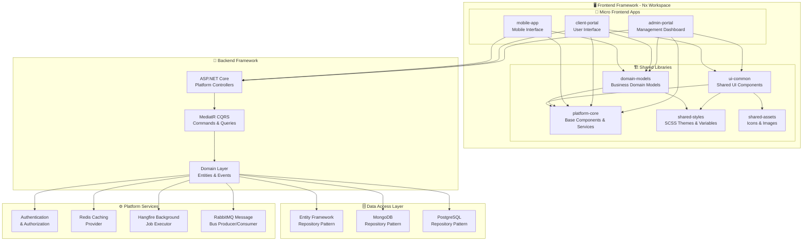
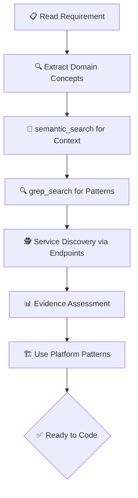

# 🏗️ Easy.Platform Framework - Developer Guide

[](https://dotnet.microsoft.com/download)
[](https://angular.dev/)
[](https://blog.cleancoder.com/uncle-bob/2012/08/13/the-clean-architecture.html)
[](https://martinfowler.com/bliki/CQRS.html)

> **Easy.Platform** is a comprehensive framework for building enterprise applications with **.NET 9 backend** and **Angular 19 frontend**, featuring Clean Architecture, CQRS, Domain-Driven Design, and event-driven patterns.

## 🎯 Quick Navigation

| **👤 I am a...**    | **🚀 Get Started**                          | **📚 Learn More**                           |
| ------------------- | ------------------------------------------- | ------------------------------------------- |
| **New Developer**   | [Quick Setup](#-quick-setup-5-minutes)      | [Learning Path](#-learning-paths)           |
| **AI Coding Agent** | [AI Guidelines](#-ai-agent-quick-reference) | [Decision Trees](#-decision-trees)          |
| **Architect**       | [Architecture](#-platform-architecture)     | [Technical Docs](#-technical-documentation) |
| **Framework User**  | [Usage Guide](#-framework-usage-guide)      | [Code Examples](#-comprehensive-examples)   |

---

## 🏗️ Platform Architecture

Easy.Platform implements **Clean Architecture** with these core principles:

- **Domain-Driven Design**: Rich domain models with business logic
- **CQRS**: Command Query Responsibility Segregation with MediatR
- **Event-Driven Architecture**: Domain events and cross-service messaging
- **Multi-Database Support**: Entity Framework Core, MongoDB, PostgreSQL
- **Microservices Ready**: Modular design for distributed systems

### 🎯 System Architecture



### 🛠️ Technology Stack

| Layer               | Technologies                                      |
| ------------------- | ------------------------------------------------- |
| **Backend Core**    | .NET 9, ASP.NET Core, MediatR, FluentValidation   |
| **Frontend Core**   | Angular 19, TypeScript, RxJS, NgRx ComponentStore |
| **Data Access**     | Entity Framework Core, MongoDB Driver              |
| **Messaging**       | RabbitMQ, Event Bus Patterns                      |
| **Caching**         | Redis, In-Memory Cache                            |
| **Background Jobs** | Hangfire                                          |
| **File Storage**    | Azure Blob Storage, Local File System             |
| **Authentication**  | JWT, OAuth, Custom Authorization                  |

---

## ⚡ Quick Setup (5 Minutes)

### Prerequisites

```bash
# Verify installations
dotnet --version          # Should be 9.0+
node --version            # Should be 20.0+
npm --version             # Should be 10.0+
```

### Framework Installation

#### Option 1: Use Platform Example App

```bash
# Clone and explore the example
cd src/PlatformExampleApp
dotnet build
dotnet run --project PlatformExampleApp.TextSnippet.Api
```

#### Option 2: Create New Project

```bash
# Create new solution using platform templates
dotnet new sln -n MyPlatformApp
mkdir MyPlatformApp.Domain
mkdir MyPlatformApp.Application
mkdir MyPlatformApp.Persistence
mkdir MyPlatformApp.Service

# Add platform package references
dotnet add package Easy.Platform
dotnet add package Easy.Platform.AspNetCore
dotnet add package Easy.Platform.EfCore
```

#### Frontend Setup (Nx Workspace)

```bash
# Create Nx workspace with Angular
npx create-nx-workspace@latest my-platform-workspace --preset=angular --appName=admin-portal --style=scss

cd my-platform-workspace

# Generate additional applications
nx generate @nx/angular:app client-portal
nx generate @nx/angular:app mobile-app

# Generate shared libraries
nx generate @nx/angular:library platform-core
nx generate @nx/angular:library domain-models
nx generate @nx/angular:library ui-common
nx generate @nx/angular:library shared-styles

# Install platform dependencies
npm install @ngrx/component-store rxjs @angular/material ngx-toastr
npm install @angular/cdk @angular/forms @angular/router
```

---

## 🏗️ Frontend Architecture Overview

### 📱 Micro Frontend Structure

The platform uses **Nx workspace** to create a scalable micro frontend architecture:

```
frontend-workspace/
├── apps/                         # Individual applications
│   ├── admin-portal/            # Management dashboard
│   ├── client-portal/           # User interface
│   └── mobile-app/              # Mobile application
│
├── libs/                        # Shared libraries
│   ├── platform-core/           # Core framework components
│   ├── domain-models/           # Business models and DTOs
│   ├── ui-common/               # Shared UI components
│   ├── shared-styles/           # SCSS themes and variables
│   └── shared-assets/           # Icons and images
│
└── tools/                       # Build and development tools
```

### 🎨 Component Hierarchy Architecture

```typescript
// Platform Core Layer (Framework Foundation)
PlatformComponent               // Base: lifecycle, error handling, subscriptions
├── PlatformVmComponent         // + ViewModel integration
├── PlatformFormComponent       // + Reactive forms integration
└── PlatformVmStoreComponent    // + ComponentStore state management

// Application Layer (Your Business Logic)
AppBaseComponent                // + Auth, roles, company context
├── AppBaseVmComponent          // + ViewModel + auth context
├── AppBaseFormComponent        // + Forms + auth + validation
└── AppBaseVmStoreComponent     // + Store + auth + loading/error

// Feature Layer (Implementation)
├── UserManagementComponent extends AppBaseComponent
├── DashboardComponent extends AppBaseVmStoreComponent
├── UserFormComponent extends AppBaseFormComponent
└── DataTableComponent extends AppBaseComponent
```

### 🔄 State Management Philosophy

#### **MVVM with Strict Separation of Concerns**

```typescript
┌─────────────────┐    ┌─────────────────┐    ┌─────────────────┐
│   COMPONENTS    │    │   VIEW MODELS   │    │      STORES     │
│   (Pure UI)     │────│ (Pure Logic)    │────│ (State Management) │
│                 │    │                 │    │                 │
│ • Templates     │    │ • Business      │    │ • API Calls     │
│ • User Events   │    │   Logic         │    │ • Caching       │
│ • UI State      │    │ • Validation    │    │ • Background    │
│                 │    │ • Calculations  │    │   Refresh       │
└─────────────────┘    └─────────────────┘    └─────────────────┘
```

**Core Principle**: Components handle ONLY UI concerns. ALL business logic, data manipulation, and state management belongs in View Model Stores.

---

## 🏗️ Frontend Development Patterns

### 1. Platform Component (Base Foundation)

```typescript
// Base component with automatic subscription cleanup and state management
@Directive()
export abstract class PlatformComponent implements OnInit, AfterViewInit, OnDestroy, OnChanges {
    public destroyed$ = new BehaviorSubject<boolean>(false);
    public status$ = signal(ComponentStateStatus.Pending);

    // Injected platform services (automatically available via inject())
    public toast = inject(ToastrService);
    public translateSrv = inject(PlatformTranslateService);
    public changeDetector = inject(ChangeDetectorRef);
    public elementRef = inject(ElementRef);
    public cacheService = inject(PlatformCachingService);

    ngOnDestroy() {
        this.destroyed$.next(true);
        this.destroyed$.complete();
    }

    // Helper method for automatic subscription cleanup
    public untilDestroyed<T>(): MonoTypeOperatorFunction<T> {
        return takeUntil(this.destroyed$);
    }

    // State signals
    public isStateLoading = computed(() => this.status$() === 'Loading');
    public isStateError = computed(() => this.status$() === 'Error');
    public isStateSuccess = computed(() => this.status$() === 'Success');

    // Multi-request state tracking
    public observerLoadingErrorState<T>(requestKey?: string): OperatorFunction<T, T>;
    public isLoading$(requestKey?: string): Signal<boolean | null>;
}
```

### 2. Platform Store (State Management)

```typescript
// Enhanced state management with caching and lifecycle management
// Uses composition pattern - wraps NgRx ComponentStore internally
@Injectable()
export abstract class PlatformVmStore<TViewModel extends PlatformVm> implements OnDestroy {
    // Internal NgRx ComponentStore (composition, not inheritance)
    private _innerStore?: ComponentStore<TViewModel>;

    // Abstract method to be implemented - returns cache key for state persistence
    protected abstract cachedStateKeyName(): string;

    // Abstract method for initializing/reloading view model
    public abstract initOrReloadVm: (isReload: boolean) => Observable<unknown>;

    // View model constructor for creating new instances
    public abstract vmConstructor: (data?: Partial<TViewModel>) => TViewModel;

    // Built-in state observables
    public readonly isStateLoading$: Observable<boolean>;
    public readonly isStateError$: Observable<boolean>;
    public readonly isStateSuccess$: Observable<boolean>;
    public readonly isStateSuccessOrReloading$: Observable<boolean>;

    // Effect wrapper with automatic loading/error state management
    // NOTE: Do NOT add observerLoadingErrorState() inside your generator - it's added automatically!
    // Pass the requestKey as the 2nd parameter: effectSimple(() => api.call().pipe(tapResponse(...)), 'loadData')
    // Generator receives the UNWRAPPED value (not Observable), with optional isReloading flag
    public effectSimple<ProvidedType = void, ReturnObservableType = unknown>(
        generator: (origin: ProvidedType, isReloading?: boolean) => Observable<ReturnObservableType> | void,
        requestKey?: string | null,
        options?: {
            effectSubscriptionHandleFn?: (sub: Subscription) => unknown;
            notAutoObserveErrorLoadingState?: boolean;
        }
    ) { /* ... automatic observerLoadingErrorState wrapping ... */ }

    // Update state with immutable update pattern
    public updateState(partialState: Partial<TViewModel>): void;

    // Select state with memoization
    public select<R>(selector: (state: TViewModel) => R): Observable<R>;
}

// Real-world example implementation
@Injectable()
export class UserManagementStore extends PlatformVmStore<UserManagementState> {
    constructor(private userApi: UserApiService) {
        super(new UserManagementState()); // REQUIRED: pass defaultState to super()
    }

    // Required: View model constructor
    public vmConstructor = (data?: Partial<UserManagementState>) => new UserManagementState(data);

    // Required: Cache key method
    protected cachedStateKeyName = () => 'UserManagementStore';

    // Required: Initialize/reload view model
    public initOrReloadVm = (isReload: boolean) => this.loadUsers();

    // Effect for loading users
    public loadUsers = this.effectSimple(() => {
        return this.userApi.getUsers().pipe(this.tapResponse(users => this.updateState({ users })));
    });

    // Effect for creating user
    public createUser = this.effectSimple((userData: CreateUserRequest) => {
        return this.userApi.createUser(userData).pipe(
            this.tapResponse(() => {
                this.loadUsers(); // Refresh the list
                // NOTE: toast notifications should be handled in the component, not the store
            })
        );
    });

    // Selectors for reactive UI
    public readonly users$ = this.select(state => state.users);
    public readonly activeUsers$ = this.select(state => state.users.filter(u => u.isActive));
}

class UserManagementState extends PlatformVm {
    users: User[] = [];
    selectedUser?: User;
    filters: UserFilters = {};

    constructor(data?: Partial<UserManagementState>) {
        super();
        Object.assign(this, data);
    }
}
```

### 3. API Service Pattern

```typescript
// Platform API service with automatic error handling and caching
@Injectable({ providedIn: 'root' })
export class UserApiService extends PlatformApiService {
    // Required: Define API base URL as abstract getter
    protected get apiUrl(): string {
        return environment.apiUrl + '/api/User';
    }

    // GET with automatic caching
    public getUsers(params?: GetUsersQuery): Observable<User[]> {
        return this.get<User[]>('', params);
    }

    // POST with validation
    public createUser(request: CreateUserRequest): Observable<CreateUserResponse> {
        return this.post<CreateUserResponse>('', request);
    }

    // PUT for updates
    public updateUser(id: string, request: UpdateUserRequest): Observable<void> {
        return this.put<void>(`/${id}`, request);
    }

    // DELETE with confirmation
    public deleteUser(id: string): Observable<void> {
        return this.delete<void>(`/${id}`);
    }

    // File upload with progress tracking
    public uploadUserAvatar(id: string, file: File): Observable<UploadResponse> {
        return this.postFileMultiPartForm<UploadResponse>(`/${id}/avatar`, { file });
    }
}
```

### 4. Form Components with Validation

```typescript
// Platform form component with two-way binding and validation
@Component({
    selector: 'app-user-form',
    template: `
        <form [formGroup]="formGroup" (ngSubmit)="onSubmit()">
            <mat-form-field>
                <mat-label>Full Name</mat-label>
                <input matInput formControlName="fullName" required />
                <mat-error *ngIf="formGroup.get('fullName')?.hasError('required')"> Full name is required </mat-error>
            </mat-form-field>

            <mat-form-field>
                <mat-label>Email</mat-label>
                <input matInput formControlName="email" type="email" required />
                <mat-error *ngIf="formGroup.get('email')?.hasError('email')"> Please enter a valid email </mat-error>
            </mat-form-field>

            <mat-form-field>
                <mat-label>Role</mat-label>
                <mat-select formControlName="role" required>
                    <mat-option value="user">User</mat-option>
                    <mat-option value="admin">Admin</mat-option>
                    <mat-option value="manager">Manager</mat-option>
                </mat-select>
            </mat-form-field>

            <div class="form-actions">
                <button mat-raised-button color="primary" type="submit" [disabled]="formGroup.invalid || loading()">
                    {{ isEditMode ? 'Update' : 'Create' }} User
                </button>
                <button mat-button type="button" (click)="onCancel()">Cancel</button>
            </div>
        </form>
    `
})
export class UserFormComponent extends AppBaseFormComponent<UserFormVm> {
    @Input() user?: User;
    @Input() isEditMode = false;

    protected initialFormConfig = (): PlatformFormConfig<UserFormVm> => {
        return {
            controls: {
                fullName: new FormControl(this.currentVm().fullName, [Validators.required, Validators.maxLength(100)]),
                email: new FormControl(this.currentVm().email, [Validators.required, Validators.email]),
                role: new FormControl(this.currentVm().role || 'user', [Validators.required]),
                isActive: new FormControl(this.currentVm().isActive ?? true)
            }
        };
    };

    // Custom validation setup in ngOnInit or initialFormConfig
    // NOTE: There is no setupCustomValidation() method in PlatformFormComponent.
    // Use initialFormConfig() for validators, or set up watchers in ngOnInit.
    override ngOnInit() {
        super.ngOnInit();

        // Watch for role changes
        this.formControls('role')
            .valueChanges.pipe(this.untilDestroyed())
            .subscribe(role => {
                this.handleRoleChange(role);
            });
    }

    private createEmailUniqueValidator(): AsyncValidatorFn {
        return (control: AbstractControl): Observable<ValidationErrors | null> => {
            if (!control.value || (this.isEditMode && control.value === this.user?.email)) {
                return of(null);
            }

            return this.userApi.checkEmailExists(control.value).pipe(
                map(exists => (exists ? { emailExists: true } : null)),
                catchError(() => of(null))
            );
        };
    }

    onSubmit() {
        if (this.formGroup.valid) {
            const formData = this.formGroup.value as CreateUserRequest;
            this.save.emit(formData);
        }
    }

    onCancel() {
        this.cancel.emit();
    }

    @Output() save = new EventEmitter<CreateUserRequest>();
    @Output() cancel = new EventEmitter<void>();
}
```

### 5. Complete Feature Implementation

```typescript
// Complete user management feature with store integration
@Component({
    selector: 'app-user-management',
    template: `
        <div class="user-management">
            <!-- Header with actions -->
            <div class="header">
                <h2>User Management</h2>
                <button mat-raised-button color="primary" (click)="openCreateDialog()">
                    <mat-icon>add</mat-icon>
                    Add User
                </button>
            </div>

            <!-- Search and filters -->
            <div class="filters">
                <mat-form-field>
                    <mat-label>Search users</mat-label>
                    <input matInput (input)="onSearchChange($event)" placeholder="Search by name or email" />
                    <mat-icon matSuffix>search</mat-icon>
                </mat-form-field>

                <mat-form-field>
                    <mat-label>Filter by role</mat-label>
                    <mat-select (selectionChange)="onRoleFilterChange($event)">
                        <mat-option value="">All Roles</mat-option>
                        <mat-option value="user">Users</mat-option>
                        <mat-option value="admin">Admins</mat-option>
                        <mat-option value="manager">Managers</mat-option>
                    </mat-select>
                </mat-form-field>
            </div>

            <!-- Loading indicator -->
            <div *ngIf="isLoading()" class="loading-container">
                <mat-spinner diameter="50"></mat-spinner>
                <p>Loading users...</p>
            </div>

            <!-- Error message -->
            <div *ngIf="errorMsg$()" class="error-container">
                <mat-icon color="warn">error</mat-icon>
                <p>{{ errorMsg$() }}</p>
                <button mat-button (click)="retryLoad()">Retry</button>
            </div>

            <!-- User list -->
            <div *ngIf="!isLoading() && !errorMsg$()" class="user-list">
                <mat-card *ngFor="let user of filteredUsers$() | async; trackBy: trackByUserId" class="user-card">
                    <mat-card-header>
                        <div mat-card-avatar class="avatar">
                            
                        </div>
                        <mat-card-title>{{ user.fullName }}</mat-card-title>
                        <mat-card-subtitle>{{ user.email }}</mat-card-subtitle>
                    </mat-card-header>

                    <mat-card-content>
                        <div class="user-details">
                            <span class="role-badge" [class]="'role-' + user.role">
                                {{ user.role | titlecase }}
                            </span>
                            <span class="status-badge" [class.active]="user.isActive" [class.inactive]="!user.isActive">
                                {{ user.isActive ? 'Active' : 'Inactive' }}
                            </span>
                        </div>
                    </mat-card-content>

                    <mat-card-actions align="end">
                        <button mat-button (click)="editUser(user)">
                            <mat-icon>edit</mat-icon>
                            Edit
                        </button>
                        <button mat-button color="warn" (click)="deleteUser(user)" [disabled]="user.role === 'admin'">
                            <mat-icon>delete</mat-icon>
                            Delete
                        </button>
                    </mat-card-actions>
                </mat-card>
            </div>

            <!-- Empty state -->
            <div *ngIf="!isLoading() && !errorMsg$() && (filteredUsers$() | async)?.length === 0" class="empty-state">
                <mat-icon class="empty-icon">people_outline</mat-icon>
                <h3>No users found</h3>
                <p>{{ hasFilters() ? 'Try adjusting your filters' : 'Get started by adding your first user' }}</p>
                <button mat-raised-button color="primary" (click)="openCreateDialog()">Add User</button>
            </div>
        </div>
    `,
    providers: [UserManagementStore]
})
export class UserManagementComponent extends AppBaseVmStoreComponent<UserManagementState, UserManagementStore> {
    private searchSubject = new Subject<string>();
    private roleFilterSubject = new Subject<string>();

    // Reactive filtered users based on search and role filter
    public filteredUsers$ = combineLatest([
        this.store.users$,
        this.searchSubject.pipe(startWith(''), debounceTime(300)),
        this.roleFilterSubject.pipe(startWith(''))
    ]).pipe(
        map(([users, search, roleFilter]) => {
            return users.filter(user => {
                const matchesSearch =
                    !search || user.fullName.toLowerCase().includes(search.toLowerCase()) || user.email.toLowerCase().includes(search.toLowerCase());

                const matchesRole = !roleFilter || user.role === roleFilter;

                return matchesSearch && matchesRole;
            });
        })
    );

    ngOnInit() {
        // Initialize store
        this.store.initOrReloadVm(false);
    }

    onSearchChange(event: Event) {
        const target = event.target as HTMLInputElement;
        this.searchSubject.next(target.value);
    }

    onRoleFilterChange(event: MatSelectChange) {
        this.roleFilterSubject.next(event.value);
    }

    hasFilters(): boolean {
        // Check if any filters are applied
        return (
            this.searchSubject.pipe(take(1)).subscribe(search => search !== '').closed ||
            this.roleFilterSubject.pipe(take(1)).subscribe(role => role !== '').closed
        );
    }

    openCreateDialog() {
        const dialogRef = this.dialog.open(UserFormDialogComponent, {
            width: '500px',
            data: { isEditMode: false }
        });

        dialogRef.afterClosed().subscribe(result => {
            if (result) {
                this.store.createUser(result);
            }
        });
    }

    editUser(user: User) {
        const dialogRef = this.dialog.open(UserFormDialogComponent, {
            width: '500px',
            data: { user, isEditMode: true }
        });

        dialogRef.afterClosed().subscribe(result => {
            if (result) {
                this.store.updateUser(user.id, result);
            }
        });
    }

    deleteUser(user: User) {
        const dialogRef = this.dialog.open(ConfirmDialogComponent, {
            data: {
                title: 'Delete User',
                message: `Are you sure you want to delete ${user.fullName}?`,
                confirmText: 'Delete',
                cancelText: 'Cancel'
            }
        });

        dialogRef.afterClosed().subscribe(confirmed => {
            if (confirmed) {
                this.store.deleteUser(user.id);
            }
        });
    }

    retryLoad() {
        this.store.loadUsers();
    }

    trackByUserId(index: number, user: User): string {
        return user.id;
    }
}
```

### 6. Shared UI Library Structure

```typescript
// libs/ui-common/src/lib/components/
export * from './data-table/data-table.component';
export * from './loading-spinner/loading-spinner.component';
export * from './error-message/error-message.component';
export * from './confirm-dialog/confirm-dialog.component';
export * from './file-upload/file-upload.component';
export * from './date-range-picker/date-range-picker.component';
export * from './user-avatar/user-avatar.component';
export * from './status-badge/status-badge.component';
export * from './search-input/search-input.component';

// libs/ui-common/src/lib/directives/
export * from './auto-focus/auto-focus.directive';
export * from './click-outside/click-outside.directive';
export * from './loading/loading.directive';
export * from './permission/permission.directive';

// libs/ui-common/src/lib/pipes/
export * from './safe-html/safe-html.pipe';
export * from './file-size/file-size.pipe';
export * from './time-ago/time-ago.pipe';
export * from './truncate/truncate.pipe';

// libs/ui-common/src/lib/services/
export * from './dialog/dialog.service';
export * from './notification/notification.service';
export * from './theme/theme.service';
export * from './export/export.service';
```

---

## 🚀 Nx Workspace Best Practices

### 1. Library Dependency Graph

```typescript
// Dependency rules in nx.json
{
  "projectGraph": {
    "dependencies": {
      "admin-portal": ["platform-core", "domain-models", "ui-common"],
      "client-portal": ["platform-core", "domain-models", "ui-common"],
      "mobile-app": ["platform-core", "domain-models"],

      "domain-models": ["platform-core"],
      "ui-common": ["platform-core", "shared-styles"],
      "platform-core": [] // No dependencies - pure foundation
    }
  }
}
```

### 2. Build and Development Scripts

```json
// package.json scripts
{
    "scripts": {
        "start:admin": "nx serve admin-portal --port=4200",
        "start:client": "nx serve client-portal --port=4201",
        "start:mobile": "nx serve mobile-app --port=4202",

        "build:all": "nx run-many --target=build --all",
        "test:all": "nx run-many --target=test --all",
        "lint:all": "nx run-many --target=lint --all",

        "build:admin": "nx build admin-portal --configuration=production",
        "build:client": "nx build client-portal --configuration=production",
        "build:libs": "nx run-many --target=build --projects=platform-core,domain-models,ui-common"
    }
}
```

### 3. Code Generation and Scaffolding

```bash
# Generate new feature module
nx generate @nx/angular:module features/user-management --project=admin-portal

# Generate component with store
nx generate @nx/angular:component features/user-management/user-list --project=admin-portal
nx generate @nx/angular:service features/user-management/user.store --project=admin-portal

# Generate API service in domain library
nx generate @nx/angular:service user/user-api --project=domain-models

# Generate shared component in UI library
nx generate @nx/angular:component data-table --project=ui-common --export
```

---

## 🏗️ Framework Usage Guide

### 🎯 Backend Platform Usage

#### 1. Platform Module System

The foundation of any platform application is the module system:

```csharp
// Define your application module
public class MyApplicationModule : PlatformApplicationModule
{
    public override List<Func<IConfiguration, Type>> GetDependentModuleTypes()
    {
        return [p => typeof(MyDomainModule)];
    }

    // Configure lazy-loaded request context
    protected override Dictionary<string, Func<IServiceProvider, IPlatformApplicationRequestContextAccessor, Task<object?>>>
        LazyLoadRequestContextAccessorRegistersFactory()
    {
        return new()
        {
            { "CurrentUser", GetCurrentUser }
        };
    }

    private static async Task<object?> GetCurrentUser(IServiceProvider provider, IPlatformApplicationRequestContextAccessor accessor)
    {
        return await provider.ExecuteInjectScopedAsync<User>(async (repository, cacheProvider) =>
            await cacheProvider.Get().CacheRequestAsync(
                () => repository.FirstOrDefaultAsync(u => u.Id == accessor.Current.UserId()),
                "currentUser",
                tags: ["user"]));
    }
}
```

#### 2. ASP.NET Core Integration

```csharp
// Startup configuration
public class MyApiAspNetCoreModule : PlatformAspNetCoreModule
{
    public override List<Func<IConfiguration, Type>> GetDependentModuleTypes()
    {
        return [
            p => typeof(MyApplicationModule),
            p => typeof(MyPersistenceModule),
            p => typeof(MyRabbitMqMessageBusModule)
        ];
    }

    protected override string[] GetAllowCorsOrigins(IConfiguration configuration)
    {
        return configuration.GetSection("AllowCorsOrigins").Get<string[]>();
    }
}

// Program.cs
var builder = WebApplication.CreateBuilder(args);
builder.Services.RegisterModule<MyApiAspNetCoreModule>();

var app = builder.Build();
await app.InitPlatformAspNetCoreModule<MyApiAspNetCoreModule>();
app.Run();
```

#### 3. Clean Architecture Layers

##### Domain Layer

```csharp
// Rich domain entity with business logic
[TrackFieldUpdatedDomainEvent]
public sealed class TextSnippet : RootEntity<TextSnippet, string>
{
    [TrackFieldUpdatedDomainEvent]
    public string Content { get; set; } = string.Empty;

    [TrackFieldUpdatedDomainEvent]
    public string Category { get; set; } = string.Empty;

    // Domain logic methods
    public static Expression<Func<TextSnippet, bool>> IsActiveExpr()
        => snippet => !snippet.IsDeleted && !string.IsNullOrEmpty(snippet.Content);

    public PlatformValidationResult<TextSnippet> ValidateForUpdate()
    {
        return this
            .Validate(s => !string.IsNullOrEmpty(s.Content), "Content is required")
            .And(s => s.Content.Length <= 1000, "Content too long");
    }

    public TextSnippet ApplyContentUpdate(string newContent)
    {
        return this.With(s => s.Content = newContent);
    }
}

// Repository interface
public interface ITextSnippetRepository<TEntity> : IPlatformQueryableRepository<TEntity, string>
    where TEntity : class, IEntity<string>, new()
{
}
```

##### Application Layer

```csharp
// CQRS Command
public sealed class SaveTextSnippetCommand : PlatformCqrsCommand<SaveTextSnippetCommandResult>
{
    public string Id { get; set; } = string.Empty;
    public string Content { get; set; } = string.Empty;
    public string Category { get; set; } = string.Empty;

    public override PlatformValidationResult<IPlatformCqrsRequest> Validate()
    {
        return this
            .Validate(cmd => !string.IsNullOrEmpty(cmd.Content), "Content is required")
            .And(cmd => cmd.Content.Length <= 1000, "Content too long")
            .Of<IPlatformCqrsRequest>();
    }
}

// Command Handler
internal sealed class SaveTextSnippetCommandHandler :
    PlatformCqrsCommandApplicationHandler<SaveTextSnippetCommand, SaveTextSnippetCommandResult>
{
    private readonly ITextSnippetRootRepository<TextSnippet> repository;

    public SaveTextSnippetCommandHandler(
        IPlatformApplicationRequestContextAccessor requestContextAccessor,
        IPlatformUnitOfWorkManager unitOfWorkManager,
        Lazy<IPlatformCqrs> cqrs,
        ILoggerFactory loggerFactory,
        IServiceProvider serviceProvider,
        ITextSnippetRootRepository<TextSnippet> repository)
        : base(requestContextAccessor, unitOfWorkManager, cqrs, loggerFactory, serviceProvider)
    {
        this.repository = repository;
    }

    protected override async Task<SaveTextSnippetCommandResult> HandleAsync(
        SaveTextSnippetCommand request, CancellationToken cancellationToken)
    {
        // Step 1: Get existing or create new
        var snippet = await repository.FirstOrDefaultAsync(s => s.Id == request.Id, cancellationToken);
        snippet ??= new TextSnippet { Id = request.Id };

        // Step 2: Apply business logic
        var updatedSnippet = snippet
            .ApplyContentUpdate(request.Content)
            .With(s => s.Category = request.Category)
            .ValidateForUpdate()
            .EnsureValid();

        // Step 3: Track changes and save
        updatedSnippet.AutoAddFieldUpdatedEvent(snippet);
        var savedSnippet = await repository.CreateOrUpdateAsync(updatedSnippet, cancellationToken);

        return new SaveTextSnippetCommandResult { Id = savedSnippet.Id };
    }
}
```

##### Persistence Layer

```csharp
// EF Core implementation
internal sealed class TextSnippetRepository<TEntity>
    : PlatformEfCoreRepository<TEntity, string, MyDbContext>, ITextSnippetRepository<TEntity>
    where TEntity : class, IEntity<string>, new()
{
    public TextSnippetRepository(
        DbContextOptions<MyDbContext> dbContextOptions,
        IServiceProvider serviceProvider)
        : base(serviceProvider)
    {
        // DbContextOptions stored in base class via protected property
    }
}

// MongoDB implementation
internal sealed class TextSnippetMongoRepository<TEntity>
    : PlatformMongoDbRepository<TEntity, string, MyDbContext>, ITextSnippetRepository<TEntity>
    where TEntity : class, IEntity<string>, new()
{
    public TextSnippetMongoRepository(IServiceProvider serviceProvider)
        : base(serviceProvider)
    {
    }
}
```

##### Service Layer

```csharp
// Platform-based controller
[ApiController]
[Route("api/[controller]")]
public class TextSnippetController : PlatformBaseController
{
    [HttpPost]
    public async Task<IActionResult> SaveTextSnippet([FromBody] SaveTextSnippetCommand command)
    {
        var result = await Cqrs.SendCommand(command);
        return Ok(result);
    }

    [HttpGet]
    public async Task<IActionResult> GetTextSnippets([FromQuery] GetTextSnippetsQuery query)
    {
        var result = await Cqrs.SendQuery(query);
        return Ok(result);
    }
}
```

### 🎨 Frontend Platform Usage

#### 1. Component Hierarchy

The platform provides a hierarchical component structure:

```typescript
// Base platform component with automatic cleanup
@Directive()
export abstract class PlatformComponent implements OnDestroy {
    public destroyed$ = new BehaviorSubject<boolean>(false);
    public status$ = signal(ComponentStateStatus.Pending);

    // Injected platform services (automatically available via inject())
    public toast = inject(ToastrService);
    public translateSrv = inject(PlatformTranslateService);
    public changeDetector = inject(ChangeDetectorRef);
    public elementRef = inject(ElementRef);
    public cacheService = inject(PlatformCachingService);

    ngOnDestroy() {
        this.destroyed$.next(true);
        this.destroyed$.complete();
    }

    public untilDestroyed<T>(): MonoTypeOperatorFunction<T> {
        return takeUntil(this.destroyed$);
    }
}

// Enhanced component with view model support
@Directive()
export abstract class PlatformVmComponent<TViewModel extends IPlatformVm> extends PlatformComponent implements OnInit {
    // View model as WritableSignal (lazy-initialized)
    public get vm(): WritableSignal<TViewModel | undefined> {
        /* ... */
    }

    // Abstract method for loading/reloading view model data
    protected abstract initOrReloadVm: (isReload: boolean) => Observable<TViewModel | undefined>;

    // Update view model with partial state or updater function
    public updateVm(partialOrUpdaterFn, onVmChanged?, options?): TViewModel {
        /* ... */
    }

    // Reload view model data
    public reload(): void {
        this.initVm(true);
    }
}
```

#### 2. State Management with Platform Store

```typescript
// Platform store with caching and lifecycle management
// NOTE: Uses COMPOSITION pattern (not inheritance) with ComponentStore
@Injectable()
export abstract class PlatformVmStore<TViewModel extends PlatformVm> implements OnDestroy {
    // Internal ComponentStore - composition pattern
    private _innerStore?: ComponentStore<TViewModel>;

    // Abstract methods for derived stores (MUST implement)
    protected abstract cachedStateKeyName(): string;
    public abstract vmConstructor: (data?: Partial<TViewModel>) => TViewModel;
    public abstract initOrReloadVm: (isReload: boolean) => Observable<any> | void;

    // Automatic state selectors
    public readonly loading$ = this.select(state => state.loading);
    public readonly errorMsg$ = this.select(state => state.errorMsg);

    // Effect wrapper with automatic loading/error handling
    // NOTE: Do NOT add observerLoadingErrorState() inside generator - it's added automatically!
    // Generator receives the UNWRAPPED value (not Observable), with optional isReloading flag
    public effectSimple<ProvidedType = void, ReturnObservableType = unknown>(
        generator: (origin: ProvidedType, isReloading?: boolean) => Observable<ReturnObservableType> | void,
        requestKey?: string | null,
        options?: { effectSubscriptionHandleFn?: (sub: Subscription) => unknown; notAutoObserveErrorLoadingState?: boolean }
    ) { /* automatic observerLoadingErrorState wrapping */ }

    protected observerLoadingErrorState<T>(): MonoTypeOperatorFunction<T> {
        return (source: Observable<T>) =>
            source.pipe(
                tap(() => this.setLoading(true)),
                tap({
                    next: () => this.setLoading(false),
                    error: error => {
                        this.setLoading(false);
                        this.setErrorMsg(this.getErrorMessage(error));
                    }
                })
            );
    }
}

// Example implementation
@Injectable()
export class TextSnippetStore extends PlatformVmStore<TextSnippetState> {
    constructor(private textSnippetApi: TextSnippetApiService) {
        super(new TextSnippetState()); // REQUIRED: pass defaultState to super()
    }

    public vmConstructor = (data?: Partial<TextSnippetState>) => new TextSnippetState(data);
    protected cachedStateKeyName = () => 'TextSnippetStore';

    public initOrReloadVm = (isReload: boolean) => this.loadSnippets();

    // Effect for loading data
    public loadSnippets = this.effectSimple(() => {
        return this.textSnippetApi.getSnippets().pipe(this.tapResponse(snippets => this.updateState({ snippets })));
    });

    // Effect for saving
    public saveSnippet = this.effectSimple((command: SaveTextSnippetCommand) => {
        return this.textSnippetApi.saveSnippet(command).pipe(
            this.tapResponse(() => {
                this.loadSnippets(); // Refresh list after save
            })
        );
    });

    // Selectors
    public readonly snippets$ = this.select(state => state.snippets);
    public readonly selectedSnippet$ = this.select(state => state.selectedSnippet);
}

interface TextSnippetState extends PlatformVm {
    snippets: TextSnippet[];
    selectedSnippet?: TextSnippet;
}
```

#### 3. API Services

```typescript
// Platform API service with automatic error handling
@Injectable({ providedIn: 'root' })
export class TextSnippetApiService extends PlatformApiService {
    // Override abstract getter for base URL
    protected get apiUrl(): string {
        return environment.apiUrl + '/api/TextSnippet';
    }

    // GET with automatic caching and error handling
    public getSnippets(params?: GetTextSnippetsQuery): Observable<TextSnippet[]> {
        return this.get<TextSnippet[]>('', params);
    }

    // POST with validation and error handling
    public saveSnippet(command: SaveTextSnippetCommand): Observable<SaveTextSnippetCommandResult> {
        return this.post<SaveTextSnippetCommandResult>('', command);
    }

    // PUT for updates
    public updateSnippet(id: string, command: UpdateTextSnippetCommand): Observable<void> {
        return this.put<void>(`/${id}`, command);
    }

    // DELETE with confirmation
    public deleteSnippet(id: string): Observable<void> {
        return this.delete<void>(`/${id}`);
    }
}
```

#### 4. Form Components

```typescript
// Platform form component with validation
export abstract class PlatformFormComponent<TFormVm extends IPlatformVm> extends PlatformVmComponent<TFormVm> implements OnInit {
    // Form getter returns typed FormGroup
    public get form(): FormGroup<PlatformFormGroupControls<TFormVm>> {
        /* ... */
    }

    // Form status signal
    public formStatus$: WritableSignal<FormControlStatus> = signal('VALID');

    // Form mode: 'create' | 'update' | 'view'
    public get mode(): PlatformFormMode {
        /* ... */
    }

    // Abstract method for form configuration (MUST implement)
    protected abstract initialFormConfig: () => PlatformFormConfig<TFormVm> | undefined;

    // Helper methods
    public isViewMode(): boolean {
        return this.mode === 'view';
    }
    public isCreateMode(): boolean {
        return this.mode === 'create';
    }
    public isUpdateMode(): boolean {
        return this.mode === 'update';
    }
    public validateForm(): boolean {
        /* marks all as touched, returns valid state */
    }
    public formControls(key: keyof TFormVm): FormControl {
        /* ... */
    }
}

// Example implementation
@Component({
    selector: 'app-text-snippet-form',
    template: `
        <form [formGroup]="form" (ngSubmit)="onSubmit()">
            <mat-form-field>
                <mat-label>Content</mat-label>
                <textarea matInput formControlName="content" rows="4"></textarea>
                <mat-error *ngIf="form.get('content')?.hasError('required')"> Content is required </mat-error>
            </mat-form-field>

            <mat-form-field>
                <mat-label>Category</mat-label>
                <input matInput formControlName="category" />
            </mat-form-field>

            <button mat-raised-button color="primary" type="submit" [disabled]="form.invalid">Save</button>
        </form>
    `
})
export class TextSnippetFormComponent extends PlatformFormComponent<TextSnippetFormVm> {
    // Required: Form configuration
    protected initialFormConfig = (): PlatformFormConfig<TextSnippetFormVm> => ({
        controls: {
            content: new FormControl(this.currentVm().content, [Validators.required, Validators.maxLength(1000)]),
            category: new FormControl(this.currentVm().category, [Validators.required])
        },
        // Optional: Add async validators
        asyncValidators: [customAsyncValidator(this.textSnippetApi)]
    });

    // Required: Load/reload view model data
    protected initOrReloadVm = (isReload: boolean) => of(new TextSnippetFormVm());

    onSubmit() {
        if (this.validateForm()) {
            // Process form data using this.currentVm()
        }
    }
}
```

---

## 📊 Advanced Platform Features

### 🔧 Background Jobs

```csharp
// Platform paged background job for processing large datasets
[PlatformRecurringJob("0 0 * * *")] // Daily at midnight
public class ProcessSnippetsJobExecutor : PlatformApplicationPagedBackgroundJobExecutor
{
    protected override int PageSize => 100;

    // Abstract: Process each page of items
    protected override async Task ProcessPagedAsync(
        int? skipCount, int? pageSize, object? param,
        IServiceProvider serviceProvider, IPlatformUnitOfWorkManager uowManager)
    {
        var repository = serviceProvider.GetRequiredService<ITextSnippetRootRepository<TextSnippet>>();

        var snippets = await repository.GetAllAsync(
            queryBuilder: q => q.Where(TextSnippet.IsActiveExpr())
                .OrderBy(s => s.Id).Skip(skipCount ?? 0).Take(pageSize ?? PageSize));

        await snippets.ParallelAsync(async snippet =>
            await ProcessSnippet(snippet, serviceProvider));
    }

    // Abstract: Total count for pagination
    protected override async Task<int> MaxItemsCount(PlatformApplicationPagedBackgroundJobParam<object?> pagedParam)
    {
        return await ServiceProvider
            .ExecuteInjectScopedAsync<int, ITextSnippetRootRepository<TextSnippet>>(
                async repo => await repo.CountAsync(TextSnippet.IsActiveExpr()));
    }

    private async Task ProcessSnippet(TextSnippet snippet, IServiceProvider sp) { /* ... */ }
}
```

### 📡 Event-Driven Communication

```csharp
// Entity event producer - automatically publishes when entities change
public sealed class TextSnippetEntityEventBusMessageProducer :
    PlatformCqrsEntityEventBusMessageProducer<TextSnippetEntityEventBusMessage, TextSnippet, string>
{
    // Automatically handles entity change events
}

// Entity event consumer - handles cross-service synchronization
public class ProcessTextSnippetEntityEventBusConsumer :
    PlatformApplicationMessageBusConsumer<TextSnippetEntityEventBusMessage>
{
    // Optional: Filter when to process (default returns true)
    public override async Task<bool> HandleWhen(TextSnippetEntityEventBusMessage message, string routingKey)
    {
        return message.Payload?.EntityData != null;
    }

    // Required: Core message handling logic
    public override async Task HandleLogicAsync(TextSnippetEntityEventBusMessage message, string routingKey)
    {
        var entityEvent = message.Payload;
        var snippet = entityEvent.EntityData;

        switch (entityEvent.CrudAction)
        {
            case PlatformCqrsEntityEventCrudAction.Created:
                await HandleSnippetCreated(snippet);
                break;
            case PlatformCqrsEntityEventCrudAction.Updated:
                await HandleSnippetUpdated(snippet);
                break;
            case PlatformCqrsEntityEventCrudAction.Deleted:
                await HandleSnippetDeleted(snippet.Id);
                break;
        }
    }
}
```

### 🗄️ Data Migration

```csharp
// Platform data migration with pagination
public class InitializeSnippetDataMigration : PlatformDataMigrationExecutor<MyDbContext>
{
    public override string Name => "20250101000001_InitializeSnippetData";
    public override DateTime? OnlyForDbsCreatedBeforeDate => new(2025, 02, 01);

    public override async Task Execute(MyDbContext dbContext)
    {
        await InitializeCategories();
        await MigrateExistingSnippets();
    }

    private async Task MigrateExistingSnippets()
    {
        var totalCount = await repository.CountAsync();

        await RootServiceProvider.ExecuteInjectScopedPagingAsync(
            maxItemCount: totalCount,
            pageSize: 100,
            MigrateSnippetsPage);
    }

    private static async Task MigrateSnippetsPage(
        IServiceProvider serviceProvider,
        int pageIndex,
        int pageSize,
        CancellationToken cancellationToken)
    {
        var repository = serviceProvider.GetRequiredService<ITextSnippetRootRepository<TextSnippet>>();

        var snippets = await repository.GetAllAsync(
            queryBuilder: query => query.Skip(pageIndex * pageSize).Take(pageSize),
            cancellationToken: cancellationToken);

        foreach (var snippet in snippets)
        {
            // Apply migration logic
            snippet.Category = DetermineCategory(snippet.Content);
            await repository.UpdateAsync(snippet, cancellationToken: cancellationToken);
        }
    }
}
```

### 📚 Data Seeding

```csharp
// Platform data seeder
public sealed class TextSnippetDataSeeder : PlatformApplicationDataSeeder
{
    private readonly ITextSnippetRootRepository<TextSnippet> repository;

    public TextSnippetDataSeeder(
        IPlatformUnitOfWorkManager unitOfWorkManager,
        IServiceProvider serviceProvider,
        IConfiguration configuration,
        ILoggerFactory loggerFactory,
        IPlatformRootServiceProvider rootServiceProvider,
        ITextSnippetRootRepository<TextSnippet> repository)
        : base(unitOfWorkManager, serviceProvider, configuration, loggerFactory, rootServiceProvider)
    {
        this.repository = repository;
    }

    protected override async Task InternalSeedData(bool isReplaceNewSeed = false)
    {
        await SeedSampleSnippets();
    }

    private async Task SeedSampleSnippets()
    {
        if (await repository.AnyAsync()) return; // Skip if data exists

        var sampleSnippets = new[]
        {
            new TextSnippet { Content = "Sample snippet 1", Category = "Examples" },
            new TextSnippet { Content = "Sample snippet 2", Category = "Templates" }
        };

        foreach (var snippet in sampleSnippets)
        {
            await repository.CreateOrUpdateAsync(snippet);
        }
    }
}
```

---

## 🤖 AI Agent Quick Reference

### 🔍 Investigation Workflow

**ALWAYS follow this sequence when given a task:**



### 🎯 Decision Trees

#### Backend Development

```
Need to add backend feature?
├── New API endpoint? → Use PlatformBaseController + CQRS Command
├── Business logic? → Create Command Handler in Application layer
├── Data access? → Use platform repository pattern
├── Cross-service sync? → Create Entity Event Consumer
├── Scheduled task? → Create PlatformApplicationBackgroundJobExecutor
├── Database migration? → Use PlatformDataMigrationExecutor
└── Data seeding? → Create PlatformApplicationDataSeeder
```

#### Frontend Development

```
Need to add frontend feature?
├── Simple component? → Extend PlatformComponent
├── Complex state? → Use PlatformVmStoreComponent + PlatformVmStore
├── Forms? → Extend PlatformFormComponent with validation
├── API calls? → Create service extending PlatformApiService
└── Cross-component data? → Use ComponentStore patterns
```

### 🏗️ Repository Pattern

**Always use platform repository interfaces:**

```csharp
// ✅ GOOD: Platform repository interface
public interface IMyRepository<TEntity> : IPlatformQueryableRepository<TEntity, string>
    where TEntity : class, IEntity<string>, new()
{
}

// ✅ GOOD: Root repository for aggregates
public interface IMyRootRepository<TEntity> : IPlatformQueryableRootRepository<TEntity, string>
    where TEntity : class, IRootEntity<string>, new()
{
}

// ✅ GOOD: Repository extensions
public static class TextSnippetRepositoryExtensions
{
    public static async Task<List<TextSnippet>> GetActiveSnippetsAsync(
        this ITextSnippetRootRepository<TextSnippet> repository,
        CancellationToken cancellationToken = default)
    {
        return await repository.GetAllAsync(
            TextSnippet.IsActiveExpr(),
            cancellationToken: cancellationToken);
    }
}
```

### 🎯 Code Templates

#### CQRS Command Template

```csharp
// Command
public sealed class Save{Entity}Command : PlatformCqrsCommand<Save{Entity}CommandResult>
{
    public string Name { get; set; } = string.Empty;

    public override PlatformValidationResult<IPlatformCqrsRequest> Validate()
    {
        return this
            .Validate(cmd => !string.IsNullOrEmpty(cmd.Name), "Name is required")
            .Of<IPlatformCqrsRequest>();
    }
}

// Result
public sealed class Save{Entity}CommandResult : PlatformCqrsCommandResult
{
    public string Id { get; set; } = string.Empty;
}

// Handler
internal sealed class Save{Entity}CommandHandler :
    PlatformCqrsCommandApplicationHandler<Save{Entity}Command, Save{Entity}CommandResult>
{
    private readonly IMyRootRepository<{Entity}> repository;

    protected override async Task<Save{Entity}CommandResult> HandleAsync(
        Save{Entity}Command request, CancellationToken cancellationToken)
    {
        // Step 1: Get or create entity
        var entity = await repository.FirstOrDefaultAsync(e => e.Id == request.Id, cancellationToken);
        entity ??= new {Entity} { Id = request.Id };

        // Step 2: Apply changes
        entity.Name = request.Name;

        // Step 3: Save
        var saved = await repository.CreateOrUpdateAsync(entity, cancellationToken);

        return new Save{Entity}CommandResult { Id = saved.Id };
    }
}
```

#### Frontend Component Template

```typescript
// State
interface {Entity}State extends PlatformVm {
    items: {Entity}[];
    selectedItem?: {Entity};
}

// Store
@Injectable()
export class {Entity}Store extends PlatformVmStore<{Entity}State> {
    constructor(private api: {Entity}ApiService) {
        super();
    }

    public vmConstructor = (data?: Partial<{Entity}State>) => new {Entity}State(data);
    protected cachedStateKeyName = () => '{Entity}Store';

    public initOrReloadVm = () => this.load{Entity}s();

    public load{Entity}s = this.effectSimple(() => {
        return this.api.get{Entity}s().pipe(
            this.tapResponse(items => this.updateState({ items }))
        );
    });
}

// Component
@Component({
    selector: 'app-{entity}-list',
    template: `
        @if (vm(); as vm) {
            @for (item of vm.items; track item.id) {
                <div>{{ item.name }}</div>
            }
        }
    `,
    providers: [{Entity}Store]
})
export class {Entity}Component extends PlatformVmStoreComponent<{Entity}State, {Entity}Store> {
    ngOnInit() {
        this.store.load{Entity}s();
    }
}
```

---

## 🏗️ Multi-Database Support

The platform supports multiple database technologies seamlessly:

### Entity Framework Core

```csharp
// EF Core persistence module
public class MyEfCorePersistenceModule : PlatformEfCorePersistenceModule<MyDbContext>
{
    public MyEfCorePersistenceModule(IServiceProvider serviceProvider, IConfiguration configuration)
        : base(serviceProvider, configuration)
    {
    }

    // Required: Configure DbContext options (connection string, provider)
    protected override Action<DbContextOptionsBuilder> DbContextOptionsBuilderActionProvider(IServiceProvider serviceProvider)
    {
        return options => options
            .UseSqlServer(Configuration.GetConnectionString("DefaultConnection"));  // or UseNpgsql() for PostgreSQL
    }

    // Optional: Override full-text search provider (default uses LIKE operation)
    protected override EfCorePlatformFullTextSearchPersistenceService FullTextSearchPersistenceServiceProvider(IServiceProvider serviceProvider)
    {
        // Override to provide custom full-text search implementation for your database provider
        return base.FullTextSearchPersistenceServiceProvider(serviceProvider);
    }
}
```

### MongoDB

```csharp
// MongoDB persistence module
public class MyMongoPersistenceModule : PlatformMongoDbPersistenceModule<MyDbContext>
{
    public MyMongoPersistenceModule(IServiceProvider serviceProvider, IConfiguration configuration)
        : base(serviceProvider, configuration)
    {
    }

    // Required: Configure MongoDB connection options
    protected override void ConfigureMongoOptions(PlatformMongoOptions<MyDbContext> options)
    {
        options.ConnectionString = Configuration.GetSection("MongoDB:ConnectionString").Value;
        options.Database = Configuration.GetSection("MongoDB:Database").Value;
        options.MinConnectionPoolSize = 5;  // Optional: connection pool settings
    }

    // Optional: Override full-text search provider
    protected override MongoDbPlatformFullTextSearchPersistenceService FullTextSearchPersistenceServiceProvider(IServiceProvider serviceProvider)
    {
        return base.FullTextSearchPersistenceServiceProvider(serviceProvider);
    }
}
```

### Repository Implementation

```csharp
// EF Core implementation
public class TextSnippetEfRepository<TEntity>
    : PlatformEfCoreRepository<TEntity, string, MyDbContext>, ITextSnippetRepository<TEntity>
    where TEntity : class, IEntity<string>, new()
{
    public TextSnippetEfRepository(
        DbContextOptions<MyDbContext> dbContextOptions,
        IServiceProvider serviceProvider)
        : base(serviceProvider)  // Only serviceProvider passed to base; dbContextOptions stored in property
    {
    }
}

// MongoDB implementation
public class TextSnippetMongoRepository<TEntity>
    : PlatformMongoDbRepository<TEntity, string, MyDbContext>, ITextSnippetRepository<TEntity>
    where TEntity : class, IEntity<string>, new()
{
    public TextSnippetMongoRepository(IServiceProvider serviceProvider)
        : base(serviceProvider)
    {
    }
}
```

---

## 🔧 Advanced Validation Patterns

### Backend Validation

```csharp
// Command-level validation
public override PlatformValidationResult<IPlatformCqrsRequest> Validate()
{
    return this
        .Validate(cmd => !string.IsNullOrEmpty(cmd.Title), "Title is required")
        .And(cmd => cmd.Title.Length <= 100, "Title too long")
        .And(cmd => cmd.StartDate <= cmd.EndDate, "End date must be after start date")
        .Of<IPlatformCqrsRequest>();
}

// Handler-level async validation
protected override async Task<PlatformValidationResult<SaveEventCommand>> ValidateRequestAsync(
    PlatformValidationResult<SaveEventCommand> requestSelfValidation,
    CancellationToken cancellationToken)
{
    return await requestSelfValidation
        .AndAsync(async cmd => !(await repository.ExistsWithTitleAsync(cmd.Title)),
                 "Event with this title already exists")
        .AndAsync(async cmd => await ValidateVenueAvailability(cmd.VenueId, cmd.StartDate),
                 "Venue not available at this time");
}

// Domain-level validation
public PlatformValidationResult<Event> ValidateForPublishing()
{
    return this
        .Validate(e => !string.IsNullOrEmpty(e.Description), "Description required for publishing")
        .And(e => e.StartDate > DateTime.UtcNow, "Cannot publish past events")
        .And(e => e.MaxAttendees > 0, "Must specify maximum attendees");
}
```

### Frontend Validation

```typescript
// Reactive form validation with startEndValidator
protected initialFormConfig = (): PlatformFormConfig<EventFormVm> => ({
    controls: {
        title: new FormControl(this.currentVm().title, [Validators.required, Validators.maxLength(100)]),
        startDate: new FormControl(this.currentVm().startDate, [Validators.required]),
        endDate: new FormControl(this.currentVm().endDate, [
            Validators.required,
            // startEndValidator validates end > start with date-only comparison
            startEndValidator(
                'invalidDateRange',
                control => control.parent?.get('startDate')?.value,
                control => control.value,
                {
                    allowEqual: false,
                    checkDatePart: 'dateOnly',
                    condition: control => control.value && control.parent?.get('startDate')?.value
                }
            )
        ]),
        maxAttendees: new FormControl(this.currentVm().maxAttendees || 1, [Validators.required, Validators.min(1)])
    },
    // groupValidations triggers validation when related fields change
    groupValidations: [['startDate', 'endDate']],
    // dependentValidations: when startDate changes, endDate is re-validated
    dependentValidations: { endDate: ['startDate'] }
})

// Custom async validator
export function venueAvailabilityValidator(
    eventApi: EventApiService
): AsyncValidatorFn {
    return (control: AbstractControl): Observable<ValidationErrors | null> => {
        if (!control.value?.venueId || !control.value?.startDate) {
            return of(null);
        }

        return eventApi.checkVenueAvailability(control.value.venueId, control.value.startDate)
            .pipe(
                map(available => available ? null : { venueNotAvailable: true }),
                catchError(() => of({ venueCheckFailed: true }))
            );
    };
}
```

---

## 🎯 Performance Optimization

### Backend Performance

```csharp
// Repository optimization with expressions
public static class EventRepositoryExtensions
{
    public static async Task<List<Event>> GetUpcomingEventsAsync(
        this IEventRootRepository<Event> repository,
        int limit = 10,
        CancellationToken cancellationToken = default)
    {
        return await repository.GetAllAsync(
            queryBuilder: query => query
                .Where(Event.IsUpcomingExpr())
                .OrderBy(e => e.StartDate)
                .Take(limit),
            cancellationToken: cancellationToken);
    }

    public static Expression<Func<Event, bool>> IsUpcomingExpr()
        => e => e.StartDate > DateTime.UtcNow && !e.IsCancelled;
}

// Caching with platform cache provider
public async Task<List<Event>> GetFeaturedEventsAsync()
{
    return await cacheProvider.Get().CacheRequestAsync(
        () => repository.GetAllAsync(Event.IsFeaturedExpr()),
        "featured-events",
        TimeSpan.FromMinutes(15),
        tags: ["events", "featured"]);
}

// Background job pagination - override ProcessPagedAsync in PlatformApplicationPagedBackgroundJobExecutor
protected override async Task ProcessPagedAsync(
    int? skipCount, int? pageSize, object? param,
    IServiceProvider serviceProvider, IPlatformUnitOfWorkManager uowManager)
{
    var events = await repository.GetAllAsync(
        queryBuilder: q => q.Where(Event.IsUpcomingExpr())
            .OrderBy(e => e.Id).Skip(skipCount ?? 0).Take(pageSize ?? PageSize));
    await events.ParallelAsync(async e => await ProcessEvent(e, serviceProvider));
}
```

### Frontend Performance

```typescript
// Component optimization
@Component({
    selector: 'app-event-list',
    changeDetection: ChangeDetectionStrategy.OnPush, // ✅ OnPush for performance
    template: `
        <cdk-virtual-scroll-viewport itemSize="100" class="event-viewport">
            @for (event of events(); track event.id) {
                <app-event-card [event]="event" />
            }
        </cdk-virtual-scroll-viewport>
    `
})
export class EventListComponent extends PlatformComponent {
    events = signal<Event[]>([]);

    ngOnInit() {
        // Efficient data loading with caching
        this.eventApi
            .getEvents()
            .pipe(this.untilDestroyed())
            .subscribe(events => this.events.set(events));
    }
}

// Store optimization with selectors
@Injectable()
export class EventStore extends PlatformVmStore<EventState> {
    // Memoized selectors
    public readonly upcomingEvents$ = this.select(state => state.events.filter(e => new Date(e.startDate) > new Date()));

    public readonly featuredEvents$ = this.select(state => state.events.filter(e => e.isFeatured));

    // Debounced search
    public searchEvents = this.effectSimple((searchTerm: string) => {
        return of(searchTerm).pipe(
            debounceTime(300),
            distinctUntilChanged(),
            switchMap(term => this.eventApi.searchEvents(term)),
            this.tapResponse(events => this.updateState({ searchResults: events }))
        );
    });
}
```

---

## 🔒 Security & Authorization

### Backend Security

```csharp
// Authorization policies
public static class AuthorizationPolicies
{
    public const string EventManagerPolicy = "EventManager";
    public const string AdminPolicy = "Admin";
}

// Policy configuration
services.AddAuthorization(options =>
{
    options.AddPolicy(AuthorizationPolicies.EventManagerPolicy,
        policy => policy.RequireRole("EventManager", "Admin"));
    options.AddPolicy(AuthorizationPolicies.AdminPolicy,
        policy => policy.RequireRole("Admin"));
});

// Controller authorization
[ApiController]
[Route("api/[controller]")]
[Authorize]
public class EventController : PlatformBaseController
{
    [HttpPost]
    [Authorize(Policy = AuthorizationPolicies.EventManagerPolicy)]
    public async Task<IActionResult> CreateEvent([FromBody] CreateEventCommand command)
    {
        var result = await Cqrs.SendCommand(command);
        return Ok(result);
    }

    [HttpDelete("{id}")]
    [Authorize(Policy = AuthorizationPolicies.AdminPolicy)]
    public async Task<IActionResult> DeleteEvent(string id)
    {
        await Cqrs.SendCommand(new DeleteEventCommand { Id = id });
        return NoContent();
    }
}

// Command-level authorization
protected override async Task<PlatformValidationResult<CreateEventCommand>> ValidateRequestAsync(
    PlatformValidationResult<CreateEventCommand> requestSelfValidation,
    CancellationToken cancellationToken)
{
    return await requestSelfValidation
        .AndAsync(async cmd => await HasPermissionToCreateEvent(cmd.VenueId),
                 "Insufficient permissions to create event at this venue");
}
```

### Frontend Security

```typescript
// Route guards
@Injectable()
export class EventManagerGuard implements CanActivate {
    constructor(
        private authService: AuthService,
        private router: Router
    ) {}

    canActivate(): Observable<boolean> {
        return this.authService.currentUser$.pipe(
            map(user => {
                if (user?.hasRole('EventManager') || user?.hasRole('Admin')) {
                    return true;
                }
                this.router.navigate(['/unauthorized']);
                return false;
            })
        );
    }
}

// Component-level authorization
@Component({
    selector: 'app-event-actions',
    template: `
        <div class="event-actions">
            @if (canEdit()) {
                <button mat-button (click)="editEvent()">Edit</button>
            }
            @if (canDelete()) {
                <button mat-button color="warn" (click)="deleteEvent()">Delete</button>
            }
        </div>
    `
})
export class EventActionsComponent extends PlatformComponent {
    @Input() event!: Event;

    canEdit(): boolean {
        return this.authService.hasRole('EventManager') || this.authService.currentUserId() === this.event.createdBy;
    }

    canDelete(): boolean {
        return this.authService.hasRole('Admin');
    }
}
```

---

## 🧪 Testing Framework

### Backend Testing

```csharp
// Unit test for command handler
public class SaveEventCommandHandlerTests
{
    private readonly Mock<IEventRootRepository<Event>> mockRepository;
    private readonly SaveEventCommandHandler handler;

    public SaveEventCommandHandlerTests()
    {
        mockRepository = new Mock<IEventRootRepository<Event>>();
        handler = new SaveEventCommandHandler(
            Mock.Of<IPlatformApplicationRequestContextAccessor>(),
            Mock.Of<IPlatformUnitOfWorkManager>(),
            new Lazy<IPlatformCqrs>(() => Mock.Of<IPlatformCqrs>()),
            Mock.Of<ILoggerFactory>(),
            Mock.Of<IServiceProvider>(),
            mockRepository.Object);
    }

    [Fact]
    public async Task HandleAsync_WithValidCommand_ShouldSaveEvent()
    {
        // Arrange
        var command = new SaveEventCommand
        {
            Title = "Test Event",
            StartDate = DateTime.UtcNow.AddDays(1),
            EndDate = DateTime.UtcNow.AddDays(2)
        };

        var savedEvent = new Event { Id = "event-1", Title = "Test Event" };
        mockRepository.Setup(r => r.CreateOrUpdateAsync(It.IsAny<Event>(), It.IsAny<CancellationToken>()))
                     .ReturnsAsync(savedEvent);

        // Act
        var result = await handler.HandleAsync(command, CancellationToken.None);

        // Assert
        result.Should().NotBeNull();
        result.Id.Should().Be("event-1");
        mockRepository.Verify(r => r.CreateOrUpdateAsync(It.IsAny<Event>(), It.IsAny<CancellationToken>()), Times.Once);
    }
}

// Integration test - Subcutaneous CQRS (no HTTP, uses real DI)
[Collection("Database")]
public class SaveEventCommandIntegrationTests : PlatformServiceIntegrationTestWithAssertions<MyApiAspNetCoreModule>
{
    [Fact]
    public async Task SaveEvent_WithValidData_ShouldCreateEntity()
    {
        // Arrange
        var command = new SaveEventCommand
        {
            Title = PlatformIntegrationTestHelper.UniqueName("Integration Test Event"),
            StartDate = DateTime.UtcNow.AddDays(1),
            EndDate = DateTime.UtcNow.AddDays(2)
        };

        // Act - Execute command directly through CQRS (no HTTP)
        var result = await ExecuteCommandAsync(command);

        // Assert
        result.Should().NotBeNull();
        result.Id.Should().NotBeEmpty();
        await AssertEntityExistsAsync<Event>(result.Id);
    }
}
```

### Frontend Testing

```typescript
// Component testing
describe('EventListComponent', () => {
    let component: EventListComponent;
    let fixture: ComponentFixture<EventListComponent>;
    let mockEventStore: jasmine.SpyObj<EventStore>;

    beforeEach(async () => {
        const eventStoreSpy = jasmine.createSpyObj('EventStore', ['loadEvents']);

        await TestBed.configureTestingModule({
            declarations: [EventListComponent],
            providers: [{ provide: EventStore, useValue: eventStoreSpy }]
        }).compileComponents();

        fixture = TestBed.createComponent(EventListComponent);
        component = fixture.componentInstance;
        mockEventStore = TestBed.inject(EventStore) as jasmine.SpyObj<EventStore>;
    });

    it('should load events on init', () => {
        // Act
        component.ngOnInit();

        // Assert
        expect(mockEventStore.loadEvents).toHaveBeenCalled();
    });
});

// Service testing
describe('EventApiService', () => {
    let service: EventApiService;
    let httpMock: HttpTestingController;

    beforeEach(() => {
        TestBed.configureTestingModule({
            imports: [HttpClientTestingModule],
            providers: [EventApiService]
        });

        service = TestBed.inject(EventApiService);
        httpMock = TestBed.inject(HttpTestingController);
    });

    it('should get events', () => {
        // Arrange
        const mockEvents = [
            { id: '1', title: 'Event 1' },
            { id: '2', title: 'Event 2' }
        ];

        // Act
        service.getEvents().subscribe(events => {
            expect(events).toEqual(mockEvents);
        });

        // Assert
        const req = httpMock.expectOne('/api/Event');
        expect(req.request.method).toBe('GET');
        req.flush(mockEvents);
    });
});
```

---

## 📚 Learning Paths

### 🆕 New Developer (Week 1-2)

**Goal**: Understand platform fundamentals and build first feature

**Day 1-2: Platform Exploration**

- ✅ Complete [Quick Setup](#-quick-setup-5-minutes)
- ✅ Run `src/PlatformExampleApp` and explore all features
- ✅ Study the four-layer Clean Architecture structure

**Day 3-4: Core Concepts**

- 📖 Understanding CQRS with command/query handlers
- 📖 Domain entities and business logic placement
- 📖 Repository pattern and data access

**Day 5-7: First Implementation**

- 🔧 Create a simple CRUD operation using platform patterns
- 🎨 Build corresponding frontend component with store
- 📝 Add validation and error handling

### 🔧 Backend Developer Path

**Foundation (Week 1)**

- 🏗️ Clean Architecture layers and responsibilities
- 📡 CQRS implementation with MediatR
- 🗄️ Repository pattern and data access
- ✅ Validation patterns and error handling

**Advanced (Week 2-3)**

- 🔄 Event-driven architecture and messaging
- ⏰ Background jobs and scheduled tasks
- 🔄 Data migration and seeding patterns
- 🧪 Testing strategies and best practices

**Mastery (Week 4+)**

- 🏛️ Domain-driven design implementation
- 📊 Performance optimization techniques
- 🔒 Security and authorization patterns
- 🚀 Multi-database and scaling strategies

### 🎨 Frontend Developer Path

**Foundation (Week 1)**

- 🏗️ Component hierarchy and inheritance
- 🔄 State management with Platform stores
- 📝 Reactive forms and validation
- 🌐 API service patterns

**Advanced (Week 2-3)**

- 🎯 Advanced state management patterns
- 🔧 Custom validators and form builders
- 📱 Responsive design and accessibility
- 🧪 Component and service testing

**Mastery (Week 4+)**

- ⚡ Performance optimization techniques
- 🎨 Advanced UI patterns and animations
- 🔧 Build optimization and deployment
- 📊 Monitoring and error tracking

---

## 🔧 Troubleshooting Guide

### Common Backend Issues

#### Repository Issues

```csharp
// ❌ Problem: Repository not found
// ✅ Solution: Ensure proper registration
services.AddScoped<ITextSnippetRepository<TextSnippet>, TextSnippetRepository<TextSnippet>>();

// ❌ Problem: Database connection errors
// ✅ Solution: Check connection string in your PlatformEfCorePersistenceModule
protected override Action<DbContextOptionsBuilder> DbContextOptionsBuilderActionProvider(IServiceProvider serviceProvider)
{
    return options => options
        .UseSqlServer(Configuration.GetConnectionString("DefaultConnection"));
}
```

#### CQRS Validation Issues

```csharp
// ❌ Problem: Validation not triggered
// ✅ Solution: Override Validate() method and call EnsureValid()
public override PlatformValidationResult<IPlatformCqrsRequest> Validate()
{
    return base.Validate()
        .And(_ => !string.IsNullOrEmpty(Name), "Name is required");
}

// In handler
var validatedCommand = request.EnsureValid();
```

### Common Frontend Issues

#### Store State Issues

```typescript
// ❌ Problem: Store not updating UI
// ✅ Solution: Ensure proper store initialization
ngOnInit() {
    this.store.initOrReloadVm(false);
}

// ❌ Problem: Effects not triggering
// ✅ Solution: Use effectSimple() pattern
public loadData = this.effectSimple(() => {
    return this.api.getData().pipe(
        this.tapResponse(data => this.updateState({ data }))
    );
});
```

#### API Service Issues

```typescript
// ❌ Problem: CORS errors
// ✅ Solution: Configure API base URL correctly
constructor() {
    super();
    this.apiUrl = environment.apiUrl + '/api/MyController';
}

// ❌ Problem: Authentication issues
// ✅ Solution: Ensure auth headers are included
// Platform API service handles this automatically
```

---

## 📊 Performance Guidelines

### Backend Performance

```csharp
// ✅ Use efficient queries with expressions
public static Expression<Func<Event, bool>> ActiveEventsExpr()
    => e => !e.IsDeleted && e.StartDate > DateTime.UtcNow;

// ✅ Implement caching for expensive operations
public async Task<List<Event>> GetFeaturedEventsAsync()
{
    return await cacheProvider.Get().CacheRequestAsync(
        () => repository.GetAllAsync(Event.IsFeaturedExpr()),
        "featured-events",
        TimeSpan.FromMinutes(15));
}

// ✅ Use PlatformApplicationPagedBackgroundJobExecutor for large datasets
// Override ProcessPagedAsync() and MaxItemsCount() for automatic pagination
```

### Frontend Performance

```typescript
// ✅ Use OnPush change detection
@Component({
    changeDetection: ChangeDetectionStrategy.OnPush
})

// ✅ Implement proper cleanup
export class MyComponent extends PlatformComponent {
    // Automatic subscription cleanup via untilDestroyed()
}

// ✅ Use virtual scrolling for large lists
<cdk-virtual-scroll-viewport itemSize="50">
    @for (item of items(); track item.id) {
        <div>{{ item.name }}</div>
    }
</cdk-virtual-scroll-viewport>
```

---

## 📚 Technical Documentation

### 📖 Core Concepts

#### Clean Architecture Implementation

- **Domain Layer**: Business entities, value objects, domain services
- **Application Layer**: Use cases, CQRS handlers, application services
- **Infrastructure Layer**: External concerns (databases, messaging, file storage)
- **Presentation Layer**: API controllers, web endpoints

#### CQRS with MediatR

- **Commands**: Write operations that modify state
- **Queries**: Read operations that return data
- **Handlers**: Process commands and queries
- **Events**: Domain and integration events

#### Repository Pattern

- **Generic repositories**: Platform base implementations
- **Specific repositories**: Domain-specific interfaces
- **Unit of Work**: Transaction management
- **Expression-based queries**: Type-safe query building

### 🎓 Best Practices

#### Code Organization

- Follow consistent naming conventions
- Use dependency injection properly
- Implement proper error handling
- Write comprehensive tests

#### Performance Optimization

- Use async/await consistently
- Implement caching strategies
- Optimize database queries
- Monitor application performance

#### Security Considerations

- Validate all input data
- Implement proper authorization
- Use secure communication protocols
- Follow security best practices

---

## 🔗 External Resources

### Official Documentation

- [ASP.NET Core Documentation](https://docs.microsoft.com/en-us/aspnet/core/)
- [Angular Documentation](https://angular.dev/docs)
- [Entity Framework Core](https://docs.microsoft.com/en-us/ef/core/)
- [MongoDB Driver for .NET](https://docs.mongodb.com/drivers/csharp/)

### Learning Resources

- [Clean Architecture Guide](https://blog.cleancoder.com/uncle-bob/2012/08/13/the-clean-architecture.html)
- [CQRS Pattern](https://martinfowler.com/bliki/CQRS.html)
- [Domain-Driven Design](https://domainlanguage.com/ddd/)
- [Angular Architecture Guide](https://angular.dev/guide/architecture)

### Community Resources

- [Stack Overflow](https://stackoverflow.com/)
- [GitHub Discussions](https://github.com/)
- [Reddit Development Communities](https://reddit.com/r/dotnet)
- [Angular Community](https://community.angular.io/)

---

## 📞 Support & Contribution

### 🆘 Getting Help

1. **Framework Documentation**: Start with this guide and explore examples
2. **Code Examples**: Study `src/PlatformExampleApp` for working implementations
3. **Search Patterns**: Do semantic search for finding existing patterns
4. **Community**: Engage with development teams and communities

### 🤝 Contributing

1. **Follow Patterns**: Use established platform patterns and conventions
2. **Add Tests**: Include unit and integration tests for new features
3. **Document Changes**: Update relevant documentation sections
4. **Code Review**: Participate in code review process

### 📋 Version Information

- **Platform Version**: Easy.Platform 1.0
- **Backend Framework**: .NET 9
- **Frontend Framework**: Angular 19
- **Last Updated**: March 2026
- **Maintainers**: Platform Development Team

---

_This guide provides comprehensive coverage of the Easy.Platform framework. For specific implementation details, refer to the working examples in `src/PlatformExampleApp` and explore the platform source code for advanced patterns and techniques._
