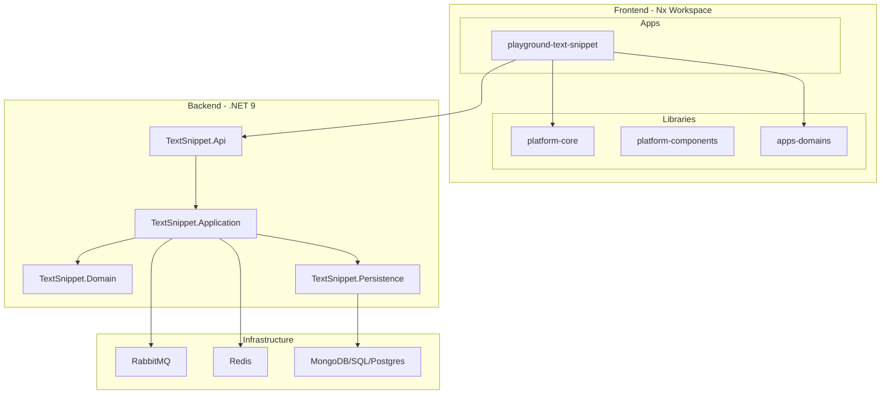

# Easy.Platform Framework

[](https://dotnet.microsoft.com/download)
[](https://angular.io/)
[](https://blog.cleancoder.com/uncle-bob/2012/08/13/the-clean-architecture.html)
[](https://martinfowler.com/bliki/CQRS.html)

> **Easy.Platform** is a comprehensive framework for building enterprise applications with **.NET 9 backend** and **Angular 19 frontend**, featuring Clean Architecture, CQRS, Domain-Driven Design, and event-driven patterns.

## Quick Navigation

| **I am a...**     | **Start Here**                                 | **Learn More**                                    |
| ----------------- | ---------------------------------------------- | ------------------------------------------------- |
| **New Developer** | [Getting Started](docs/getting-started.md)     | [Learning Paths](docs/learning-paths.md)          |
| **Backend Dev**   | [Backend Quickref](docs/backend-quickref.md)   | [CLAUDE.md Patterns](CLAUDE.md#backend-patterns)  |
| **Frontend Dev**  | [Frontend Quickref](docs/frontend-quickref.md) | [CLAUDE.md Patterns](CLAUDE.md#frontend-patterns) |
| **AI Agent**      | [CLAUDE.md](CLAUDE.md)                         | [docs/claude/](docs/claude/)                      |

---

## What is Easy.Platform?

Easy.Platform provides a complete foundation for enterprise application development:

- **Clean Architecture**: Four-layer architecture (Domain, Application, Infrastructure, Presentation) ensuring separation of concerns and testability
- **CQRS Pattern**: Command Query Responsibility Segregation with fluent validation and event-driven side effects
- **Event-Driven Architecture**: Domain events and RabbitMQ message bus for cross-service communication
- **Multi-Database Support**: MongoDB, SQL Server, PostgreSQL with unified repository patterns
- **Angular Integration**: PlatformVmStore state management, base components, and reactive forms

The framework is battle-tested in production enterprise applications and provides patterns for common challenges like background jobs, data migrations, authorization, and multi-tenancy.

---

## Quick Start (30 seconds)

```bash
# Backend
dotnet run --project src/Backend/PlatformExampleApp.TextSnippet.Api

# Frontend
cd src/Frontend && npm install && nx serve playground-text-snippet

# Infrastructure
docker-compose -f src/platform-example-app.docker-compose.yml up -d
```

> **Detailed setup:** [Getting Started Guide](docs/getting-started.md)

---

## Documentation

| Doc                                                    | Purpose                                         |
| ------------------------------------------------------ | ----------------------------------------------- |
| [Getting Started](docs/getting-started.md)             | Prerequisites, setup, commands, troubleshooting |
| [Architecture Overview](docs/architecture-overview.md) | System design, project structure, diagrams      |
| [Backend Quickref](docs/backend-quickref.md)           | Backend decision tree and key patterns          |
| [Frontend Quickref](docs/frontend-quickref.md)         | Frontend decision tree and key patterns         |
| [Learning Paths](docs/learning-paths.md)               | Developer onboarding by role                    |
| [CLAUDE.md](CLAUDE.md)                                 | Complete code patterns, AI agent instructions   |
| **[Business Features](docs/BUSINESS-FEATURES.md)**     | **Module documentation, features, APIs**        |

> **Business Documentation:** For detailed business module documentation (requirements, workflows, APIs, test specs), see [`docs/business-features/`](docs/business-features/) with [`docs/BUSINESS-FEATURES.md`](docs/BUSINESS-FEATURES.md) as the master index.

---

## AI-Assisted Team Collaboration

This project includes a complete team collaboration system for AI agents, supporting agile workflows from idea capture to release.

### Team Roles & Commands

| Role                 | Commands                               | Purpose                                      |
| -------------------- | -------------------------------------- | -------------------------------------------- |
| **Product Owner**    | `/team-idea`, `/team-prioritize`                         | Capture ideas, backlog prioritization        |
| **Business Analyst** | `/team-refine`, `/team-story`                            | PBI refinement, user story creation          |
| **QA Engineer**      | `/team-test-spec`, `/team-test-cases`                    | Test specification, test case generation     |
| **UX Designer**      | `/team-design-spec`, `/team-figma-extract`               | UI specs, Figma design extraction            |
| **QC Specialist**    | `/team-quality-gate`                                     | Pre-dev/QA/release quality gates             |
| **Project Manager**  | `/team-status`, `/team-dependency`, `/team-team-sync`    | Status reports, dependency mapping, meetings |

### Artifact Management

```
team-artifacts/
├── ideas/           # Raw ideas (IDEA-YYMMDD-NNN)
├── pbis/            # Product Backlog Items (PBI-YYMMDD-NNN)
├── test-specs/      # Test specifications (TS-MOD-NNN)
├── design-specs/    # UI/UX specifications
├── qc-reports/      # Quality gate reports
└── templates/       # Artifact templates
```

> **Full guide:** [Team Collaboration Guide](docs/claude/team-collaboration-guide.md)

---

## Architecture Overview



### Technology Stack

| Layer         | Technologies                                  |
| ------------- | --------------------------------------------- |
| **Backend**   | .NET 9, ASP.NET Core, CQRS                    |
| **Frontend**  | Angular 19, TypeScript, RxJS, PlatformVmStore |
| **Data**      | MongoDB, SQL Server, PostgreSQL               |
| **Messaging** | RabbitMQ                                      |
| **Caching**   | Redis                                         |
| **Jobs**      | Hangfire                                      |

> **Full architecture details:** [Architecture Overview](docs/architecture-overview.md)

---

## Project Structure

### Backend

```
src/Platform/                    # Easy.Platform framework
├── Easy.Platform/               # Core (CQRS, validation, repositories)
├── Easy.Platform.AspNetCore/    # ASP.NET Core integration
├── Easy.Platform.MongoDB/       # MongoDB patterns
├── Easy.Platform.RabbitMQ/      # Message bus
└── Easy.Platform.*/             # Other modules

src/Backend/          # Example microservice
├── *.Api/                       # Web API layer
├── *.Application/               # CQRS handlers, jobs, events
├── *.Domain/                    # Entities, domain events
├── *.Infrastructure/            # External concerns (storage, external APIs)
└── *.Persistence*/              # Database implementations
```

### Frontend

```
src/Frontend/       # Angular 19 Nx workspace
├── apps/
│   └── playground-text-snippet/ # Example app
└── libs/
    ├── platform-core/           # Base classes, utilities
    ├── platform-components/     # Reusable UI components
    ├── apps-domains/            # Business domain code
    ├── apps-domains-components/ # Domain-specific components
    └── apps-shared-components/  # Shared app components
```

---

## Key Principles

### Backend

1. **Repository Pattern**: Use `IPlatformQueryableRootRepository<TEntity, TKey>`
2. **Validation**: Use `PlatformValidationResult` fluent API (never throw)
3. **Side Effects**: Use entity event handlers (never in command handlers)
4. **CQRS**: Command + Result + Handler in ONE file
5. **DTO Mapping**: DTOs own mapping via `MapToEntity()`

### Frontend

1. **Component Hierarchy**: `AppBaseComponent` → Feature Component
2. **State Management**: `PlatformVmStore` for complex state
3. **API Services**: Extend `PlatformApiService`
4. **Subscriptions**: Always use `untilDestroyed()`
5. **CSS Naming**: BEM convention (`block__element --modifier`)

> **Complete patterns:** [CLAUDE.md](CLAUDE.md)

---

## Development Commands

```bash
# Backend
dotnet build EasyPlatform.sln
dotnet run --project src/Backend/PlatformExampleApp.TextSnippet.Api
dotnet test [Project].csproj

# Frontend
cd src/Frontend
npm install
nx serve playground-text-snippet
nx build playground-text-snippet
nx test platform-core
```

---

## Getting Help

1. **Study Examples**: `src/PlatformExampleApp` for backend, `playground-text-snippet` for frontend
2. **Search Codebase**: Use grep/glob to find existing patterns
3. **Check Documentation**: `docs/` directory for guides, `CLAUDE.md` for patterns
4. **Read Base Classes**: Check platform-core source for available APIs

---

## Version Information

- **Platform Version**: Easy.Platform 1.0
- **Backend Framework**: .NET 9
- **Frontend Framework**: Angular 19
- **Last Updated**: January 2025

---

_For detailed code patterns and complete examples, see [CLAUDE.md](CLAUDE.md) and the working examples in `src/PlatformExampleApp`._
