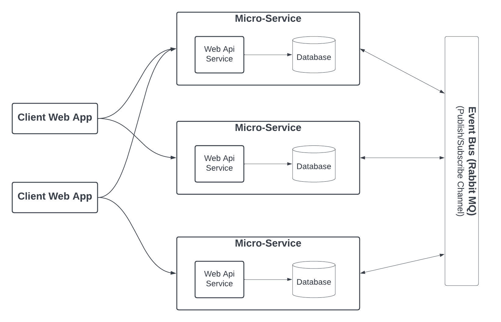
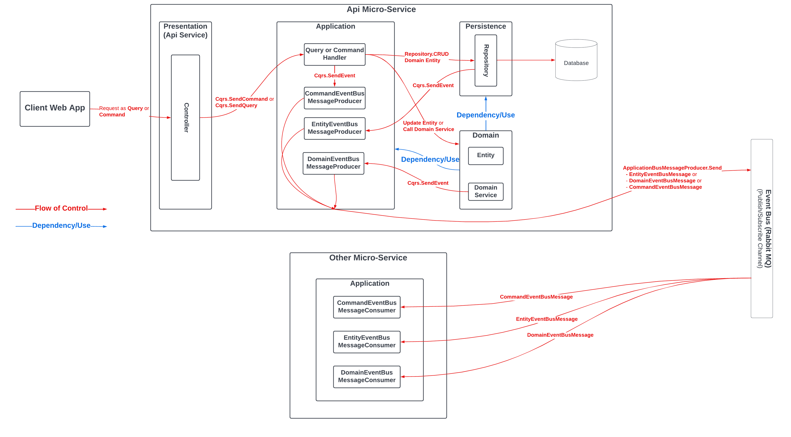
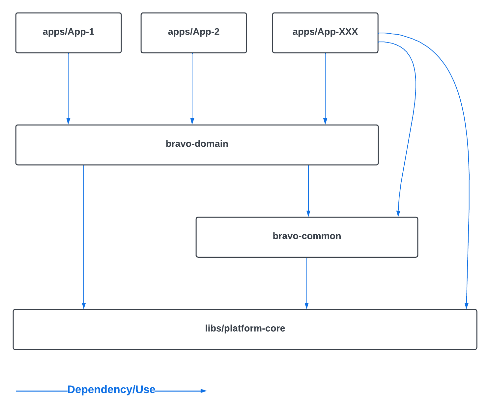

# EasyPlatform-Example

This is a sample .Net Core application, based on microservices architecture and Docker containers.

# Getting Started
These instructions will get you a copy of the project up and running on your local machine for development and testing purposes.
## Prerequisites

What you need to install and how to install them.

-   Install docker: https://docs.docker.com/engine/install/

    -   Copy **./src/.wslconfig** to your users folder to limit ram using by docker. After that you can edit it to change the ram size if you want.

    -   Minimum Docker Ram Limit Requirement to run infrastructures: **3.5GB**

    -   Minimum Docker Ram Limit Requirement to run full system in docker: **5GB**

    -   Every time you change the file, need to shutdown wsl and restart docker. To shutdown wsl run:

        ```
        wsl --shutdown
        ```

-   Install Open SSl: https://slproweb.com/products/Win32OpenSSL.html

-   To Code for Developers:

    -   Install dotnet core 7: https://dotnet.microsoft.com/en-us/download/dotnet/7.0

    -   Install nodejs: https://nodejs.org/en/blog/release/v16.13.0/

    -   Install visual studio 2022: https://visualstudio.microsoft.com/vs/

        -   **[Required]** Install CSharpier visual extension: https://marketplace.visualstudio.com/items?itemName=csharpier.CSharpier

            -   Configure Reformat with CSharpier on Save under Tools | Options | CSharpier | General

        -   **[Recommend]** Install Resharper for visual studio: https://www.jetbrains.com/resharper/

    -   Install visual code: https://code.visualstudio.com/download

        -   Also must install all recommended extensions when open **PlatformExampleAppWeb** which ask to install recommended extensions.

## Running on local

Use built-in command files to run this application demo.

-   **start-dev-platform-example-app.cmd** start the application
    
-   **start-dev-platform-example-app.infrastructure.cmd** start only infrastructure in docker
    
-   And many other files

## Urls

-   Api Server: [http://localhost:5001](http://localhost:5001)
-   Client: [http://localhost:4001](http://localhost:4001)

# Architecture Technical Summary



## Back-end:

-   Event-Driven Microservices
-   Clean Architecture
-   CQRS using [MediatR](https://github.com/jbogard/MediatR "MediatR")
-   Domain Driven Design
-   Unit of Work and Repositories Pattern
-   Technical:
    -   Language: **C#**
    -   Framework: **Dotnet Core 7**, **Asp.Net Core 7**
    -   Database: **Microsoft Sql Server**, **MongoDb**, **PostgreSQL**
    -   Database ORM: **Entity Framework Core**
    -   Others: **Hangfire Background Job**, **Rabbit MQ for message bus**, **Azure File Storage**, **Redis Cache for Distributed Cache**
-   Minimum Course Recommend: https://www.udemy.com/course/build-rest-apis-with-aspnet-core-web-api-entity-framework

## Front-end:

-   Angular - MVVM (Model-View-ViewModel)
-   **State Management** using [Component-store](https://v9.ngrx.io/guide/component-store "Component-store") in WebV2
-   **State Management** using Ngrx in Web (V1)
-   **Dump/Presentation Component** and **Smart/Application Component**
-   **Mono repository** using [Nx](https://nx.dev/ "Nx")
-   **BEM** for css naming convention
-   Technical:
    -   Language: **Javascript, TypeScript, HTML, CSS/SCSS**
    -   Framework: **Angular**
    -   Others: **Rxjs**, **Responsive flex layout using CSS flex**
-   Minimum Course Recommend: https://www.udemy.com/course/the-complete-guide-to-angular-2/

# Back-end Architecture

## Single Backend Microservice Architecture - Clean Architecture


## Microservices More Detail Architecture



## Single Backend Microservice Architecture - Detailed Explain

To learn from example use cases, please look at **PlatformExampleApp** in **src/PlatformExampleApp**

The platform define each module type for each layers, all of them is **PlatformApplicationModule**. One module could depend on many other modules, defined via **ModuleTypeDependencies** method.
Each module has two main method present two main stages: **RegisterServices** and **Init**.

-   **First**: When register a module, all of it's dependent modules will run **RegisterServices** to register all services of each modules.
-   **Second**: When init a module, all of it's dependent modules will run init to execute all of it's necessary logic on init. Example: PersistenceModule run data migration on init. ApplicationModule execute all DataSeeders on init.

Most of the components in a module will be register via assembly convention scanning (via **RegisterAllFromType**). So you just need to define and use it.

**Common term definition**:

-   **Service**: A service is used to do some public or external operation, which either:

    -   Operation/Logic is belong to the layer that service is defined publicly for any other layers could use it. Example: UpdateUserService.
    -   Operation/Logic is belong to external service, which the layer define this service class/interface to use the operation/logic from external service. Example: IEmailService

-   **Helper**: A helper is used to do some **internal and reuseable** logic in a layer. It's like service but private only for the layer define it. Define it when in the layer have some logic which usually need/could be reused. Any layer can have helpers if needed.

-   **Util**: Usually static class, is used to serve a lot of small, common, could be used in any project utility method. Example: DateTimeParserUtil

    -   Utils default grouping by "output" and (many inputs with no inputs could be treat as a main input), either by the output data type, or serve a "functional purpose". Example:
        -   Utils.String should produce string as output.
        -   Utils.FullTextSearchChecker should have functions related to do FullTextSearch.
        -   Utils.Values should only do the functional related to "values of an object" like CopyValues, HasDifferentValues

-   **Extension**: Extensions is place to store "common" functions which any project could use it.
    -   Extension default grouping by working with first "input" type as a main input, extend the functionality for that type. The type must have knowledge about the output.
    -   OR functionality which existing both Output is the main for extension, but in the param existing the main input for the output too.
    -   OR naming extension group by functionality explicitly, because both extension type and output type could not be the main one to group, but the functionality grouping is correctly. Example: EnsureThrowCommonExceptionExtension

**Domain Layer**

This is the core layer, the first layer we usually need to create. The main purpose of this layer is to define the domain objects and domain logic of the application work on based on the requirements. This layer contain:

-   **Entities**: Domain entities and domain logic/constraint/behavior in each entity.
    -   Each entity could include it's sub-class value-object types.
-   **DomainEvent**: Events of a entity (Create/Update/Delete/Change something **inside** an entity). Used to help we know more specific what happened when an entity changed.
    -   **AutoTrackValueUpdatedDomainEvent** and **TrackValueUpdatedDomainEvent** attributes: Help to track specific which property has been changed when an entity is **updated**
    -   Use method **AddDomainEvent** inside an entity to add a domain event before call repository update an entity
    -   Use **FindDomainEvents** and **FindPropertyValueUpdatedDomainEvent** in **PlatformCqrsEntityEvent** when handle entity event to get and check more specific what happened inside an entity CRUD event.
-   **ValueObjects**: Shared value objects (Optional) used by many entities in the domain
-   **Repositories**: Repository (Just abstraction like interfaces) to handle CRUD operation for domain entities.
    -   Entity is allowed to receive repository as params to get data or check it's uniqueness. Entity know about repository. Relationship between entities and repository is mutual relationship.
-   **Services**: Domain Services (Optional) in the domain if any to handle complex domain business related to many entities which that domain logic could not fit in and belonged to just one entity.
    -   **PlatformDomainService** is base class to define a domain service.
    -   Use **SendEvent** in **PlatformDomainService** to send an **domain event**

This layer is core and do not reference or depend to any other layers except common layer or library, base code.

**Application Layer**

This is the core for application business layer, the second layer we usually need to create. This main purpose of this layer is to define specific use case request (command/query) with the request handlers, and all components needed to serve the business of the application. Use **PlatformApplicationModule** to define module for this layer. This layer contains:

-   **Queries (UseCaseQueries)**: Define query and query handler (in CQRS pattern) to serve requests as get/query data only use case. This act like an **application service** to be used by other layers if we do not use CQRS pattern.
-   **Commands (UseCaseCommands)**: Define query and query handler (in CQRS pattern) to serve requests as command which change data (Create/Update/Delete) or create any side-effect (call to external service, for example like sending email) use case. This act like an **application service** to be used by other layers if we do not use CQRS pattern.
-   **Events (UseCaseEvents)**: Define event and event handler (in CQRS pattern) to handle any in-memory internal events (sent by ICqrs). The platform support built-in **CommandEvent** (sent every time a new command is sent) and **EntityEvent** (sent every time an entity is Created/Updated/Deleted).
    -   Use base classes **PlatformCqrsEntityEventApplicationHandler**, **PlatformCqrsDomainEventApplicationHandler**, **PlatformCqrsCommandEventApplicationHandler**, **PlatformCqrsEventApplicationHandler** to define event handlers
    -   Event handlers has **inbox support** via **PlatformCqrsEventInboxBusMessageConsumer**
    -   Event handlers default **SUPPORT INBOX** pattern via **PlatformInboxMessageBusConsumerHelper.HandleExecutingInboxConsumerAsync**, **PlatformCqrsEventInboxBusMessageConsumer**, config via **EnableHandleEventFromInboxBusMessage**
-   **EntityDtos**: Define data transfer object, which each class represent data return for an entity. Because we don't want to return directly entity itself (for many best practice reasons). This is also could be reuse in many query/command result.
-   **DataSeeders**: Define data seeders for the application, which is used to seed default data for the application when the application init.
-   **Infrastructures**: Define many services abstraction interface to be used by the application, usually it is **technical** or **external** services. The actual implementation should be injected from other project to support Inversion of control. Example: IEmailService. Implementation: IAzureEmailService, IAwsEmailService, etc ...
-   **MessageBus**: Define **Producer** and **Consumer** to send and receive bus message from message bus. Message is used to communicate between other micro-services.
    -   Message is mostly **Event** (The service **produce** event is **Leader**, the one will define the message schema class).
    -   Message could be a **\*Request** (The service **consume** the message is Leader, the one will define the message schema class). Usually the service receive request message is common/core micro-service in the system, which could serve some common logic for other feature services could use.
    -   Has **Outbox Pattern** support via **IPlatformOutboxBusMessageRepository**, **PlatformInboxMessageBusConsumerHelper** (for sending messages)
    -   Has **Inbox Pattern** support via **IPlatformInboxBusMessageRepository**, **PlatformOutboxMessageBusProducerHelper** (for storing and processing messages)
-   **BackgroundJob**: Define background job to execute it in the background. It could be trigger manually once or config it automatically run in an interval.
-   **Caching**: Define caching configuration for using caching service to cache data in the application.
-   **Context**: Extend request context to be used in command/query handler or any where in the application via dependency injection. Access the context via **IPlatformApplicationUserContextAccessor**. **Command/Query handler** use it to access the **CurrentUser (IPlatformApplicationUserContext)**
-   **Persistence**: Optional define a interface abstraction for a db context, which could be used directly if you want instead of using unit-of-work and repository.
-   **ValueObjectDtos** (Optional): Shared dto present a value object. This is optional depend on the team decide that do you need to build dto for value object or not. Usually it's not needed.
-   **CqrsPipelineMiddleware** (Optional): Pipeline behavior to surround the inner command/query handler. Used to inject logic before or after any query/command request is sent.

**Presentation Layer**

This is the top front layer to expose the application logic to the outside world. For WebApi, which expose the application logic via Api, then the presentation layer is a web api.

**Persistence Module (Implementation for Repository)**

This is a module (**PlatformPersistenceModule**, **PlatformEfCorePersistenceModule** using Ef core, **PlatformMongoDbPersistenceModule** using Mongo Db) to register the implementation for repository. It also a place to config how domain entity map to database, a place to define Migrations (Database Schema Migration) and DataMigrations (Migrating data only, could support migrate data from other database to it's service database)

-   Override **EnableInboxBusMessage** to config EnableInboxBusMessage. Default is True.
-   Override **EnableOutboxBusMessage** to config EnableInboxBusMessage. Default is True.

**BackgroundJob Module (Implementation for BackgroundJob)**

This is a module (**PlatformBackgroundJobModule**, **PlatformHangfireBackgroundJobModule** using Hangfire) to register and run the implementation for background job.

**MessageBus Module (Implementation for MessageBus)**

This is a module (**PlatformMessageBusModule**, **PlatformRabbitMqMessageBusModule** using RabbitMQ) to register and run the implementation for message bus.

**Caching Module (Implementation for Caching)**

This is a module (**PlatformCachingModule**, **PlatformRedisCacheModule** using Redis) to register and run the implementation for distributed caching data service.

**Any other Infrastructure Module**

These are modules (base from **PlatformInfrastructureModule**) which you could define by yourself to register and run your own infrastructure services (define interface abstraction in the application layer)

---

# Front-end WebV2 Architecture

## General Micro-Apps Architecture



# General Clean Code Rules

## Macro/Structure/Architect

All team members must know all of the current concepts (What, why, responsibility) in the project. NEED to CONFIRM WITH TEAM (What, why, responsibility) when you feel the need to create a NEW CONCEPT.

EXAMPLE some common standard concepts for BACKEND:

-   Domain Layer: Entity, Repository, ValueObject, DomainService, Exceptions, Helpers, Constants

-   Application Layer: ApplicationService, InfrastructureService, Dto (Entity Dto, Command/Request Dto), BackgroundJob (Could be recurring or one-time), CachingService, MessageBus, DataSeeder, Context (RequestContext, CurrentUserRequestContext), Exceptions, Helpers, Constants, Persistence (Optional)

-   Common: Util, Extension, ... (Anything is common which could be used in any project)

-   Persistence: Implement repository, or persistence DB context in the application layer

-   Infrastructure: Implement InfrastructureService

EXAMPLE some common standard concepts for FRONTEND:

-   Domain Layer: Entity/Data Model (Include Validator Rules), ValueObject, Helpers, Constants

-   Application Layer: ApiServices, Component/UiComponent (Smart/Application and Dump/Presentation Component), UiState, DataState, ViewModel, ApplicationContext, UserContext, ErrorHandler

-   Common: Util

Define clearly the relationship between parties. Do not just code anything we want to without caring about dependency and relationships. Example:

-   Application Layer use/depend on/reference to Domain Layer.

-   Common is used by any other layer if they need to

-   Infrastructure depends on ApplicationLayer (Clean Architect using Inversion of Control)

-   Persistence depends on DomainLayer, optionally depend on ApplicationLayer (Clean Architect using Inversion of Control)

-   Common does not depend on any other layers

-   Helper is internal shared logic for a layer. The helper could use Util

-   Application EntityDto knows about Entity and references it, Entity does not reference/know about Dto.

-   Application Service use/reference Helpers. Helpers do not use/reference ApplicationService"

## Micro/CodeFlow

-   Code must have a clear readable step-by-step flow.

    -   The next step code line must use the output variable from the previous step line.

    -   Between steps must have a space.

    -   If one step has from 2 things to get separately, could be run in parallel, place them next to each other without space like a group of code in one step

-   Naming must be very clear. The variable name must describe what are you returning (the adj + noun. Example: allUsers, disabledUsers, deletedUsers. Not just: users)

-   After coding, preview and read the code must be like an instruction you are talking to a child/robot to do something step by step

-   Use the Select (LINQ in C#) or Map (in TypeScript/Javascript) function from a list to build another list. Do not use FOR/FOR EACH LOOP to make a list

-   Understand very clearly the parallel task/code-line and step-by-step flow

-   READ AT LEAST 2 TIMES AGAIN, PROGRAMMING IN THE HEAD FOR A FUNCTION/SERVICE METHOD. READ LIKE HUMAN LANGUAGE

-   A function should have MAXIMUM 10 STEPS

-   REUSE the logic. DO NOT COPY.

-   Logic related to an object of a class should belong to that object class. For example: An entity should have a logic function, and expression. Do not code the logic in the application layer when CHECK on an entity

-   CODE LIKE HUMAN LANGUAGE INSTRUCTION THAT ANYONE CAN GUEST AND UNDERSTAND

## CSS rules

Css/Scss use BEM naming convention. Modifier custom syntax **--[modifier-name]**. Based on OOP principle rules. Still define the Block (Like a class for an object) - Element (Like property of a class in OOP) - Modifier (Like another style/value different compared to default value/style of a class/property )

Example: A **button** component has an **icon** and **text** elements, has a **big** size style and **danger** style.

-   Css should be:

    > .button {
    >
    > &\_\_icon { // Style for icon item. Left it empty if no specific style. Still define the class not just for styling but for defining the object structure.}
    >
    > &\_\_title { // Style for icon item. Left it empty if no specific style. Still define the class not just for styling but for defining the object structure. }
    >
    > &.--big { // Style modifier for button in big style }
    >
    > &.--danger { // Style modifier for error/danger button > style }
    >
    > }

-   Example for html:

    > \<button class="button"\>Default button</button\>

    > \<button class="button --danger"\>Danger button\</button\>

Do not allow to override css style of an element in a block from other block. It violate the OOP rules. Treat the element of a block like the property of a class. On the component/block it self can define how is it elements should be. If you need the component/block has a **custom style**, define a **new modifier** for it.

---

# Backend Code Review Check List

-   ## Common

    -   **Validation**:
        -   Use **PlatformValidationResult<>**. Example:
        ```
        [Any-Object]
            .Validate(must: p => true,  errors: "Error Msg if not true")
            .And(must: p => true, errors: "Error Msg if not true")
            .AndNot(mustNot: p => true,  errors: "Error Msg if true")
            .AndAsync(p => checkSomeThingReturnAsyncBooleanHere(), errors: "Error Msg if not true")
        ```
        -   **Naming Convention**:
            -   **Validate return PlatformValidationResult**: _Validate + XXXX + Valid/HasXXX/IsXXX/NotXXX_
            -   **Ensure VALID return the target object or return VOID**: _Ensure + XXXX + Valid_
            -   **Array/List/Collection naming** must be **plural**
            -   **Naming of thing should not only equal to it's own type without the real context**. Example:
                -   Ex1:
                    -   **Bad**: var user = getUser(p => p.IsManager())
                    -   **Good**: var manager = getUser(p => p.IsManager())
    -   **Code flow**:

        -   Follow **step by step**, input => output, **functional programming**/**fluent programming** principle. Add **Space** between "**Steps**". **Parallel** code flow, which they could be called in parallel, do not depended on each others should be grouped with no space, and the group is considered one step.

            -   **Correct Example**:

            ```
            // Step 1 here,
            // two line is grouped no space because they are not depended and can switch position
            // or could called in parallel
            var a = getA();
            var a1 = getA1();

            // Step 2 here, use ALL output from step 1 including a and a1. Must have a spaced to distinct
            var b = getB(a, a1);

            // Step 3 - Ensure b valid
            // It's ok considered it's as a step, because it use output from step 2. But it's not really correct because it do not return output for next step. This step is like a gate, throw exception if b is not valid. But we could see it as it return the "b" it self, mean that get through this step is "validB"
            b.EnsureValid();

            // Step 4 - Do something with b, like update b
            var updatedB = b.With(_ => _.Property = updatedValue);

            ```

            Improve:

            ```
            // ... continued from Step 1 above

            var b = getB(a, a1);

            var validB = b.EnsureValid()

            // Step 4 - Do something with validB, like update validB
            var updatedB = validB.With(_ => _.Property = updatedValue);

            ```

            Better:

            ```
            // ... continued from Step 1 above

            // Step 2: Get b and also validate and ensure b is valid. Return a valid b.
            var b = getB(a, a1)
                .EnsureValid();

            // Step 3 - Do something with b, like update b
            var updatedB = b.With(_ => _.Property = updatedValue);
            ```

            -   **Bad example**:

            ```
            // Code no step, no flow, mixed with each other
            var a = getA();
            var a1 = getA1();
            var b1FromA1 = GetBFromA1(a1);
            var bFromA = GetBFromA(a);

            var c = GetCFrom_A_bFromA_b1FromA1(a, bFromA, b1FromA1);

            // a to bFromA is 2 step in ONE FUNCTION. DO ONE THING to get b. Should refactor in to new function
            // a1 to bFromA1 is 2 step in ONE FUNCTION. DO ONE THING to get b. Should refactor in to new function
            // They mixed together with no order.
            ```

            Fix

            ```
            // Step 1: Get input for step 2
            var (a, b) = GetAWithB();
            var b1 = GetB1();

            //Step 2
            var c = GetC(a, b, b1);

            function ValueTuple<AType, BType> GetAWithB() {
                var a = getA();

                var b = GetBFromA(a);

                // Return any result class which include both a and b. Example C# ValueTuple
                // or just define a new Class has two properties a and b
                return (a, b);
            }

            function BType GetB1() {
                var a1 = getA1();

                var b1 = GetBFromA1(a1);

                return b1;
            }
            ```

    -   **Wrong Logic/Responsibility**

        -   Common Rule: Logic check something is return boolean using **objectA**, logic get something/calculated or logic in **objectA**, should be defined a function in **objectA** class in most cases.
        -   Need to know that the logic define in an object should only depend on **class/type** which that class could **objectA** and **objectA**. Example:
            -   **Service** could use/depend/know-about **Util**. **Util** could **NOT** use/depend/know-about "**Service**".
            -   **Domain Entity** could use/depend/know-about **repository** of entity which it **is allowed** to depended/use/know-about **in the domain**, example usually **reference via foreign key**.
            -   **Dto** could use/depend/know-about **domain-entity**. **domain-entity** do not use/depend/know-about **Dto**.
        -   **Bad Example**:

        ```
        // The logic on the user which to determine when the user is premium should be long to UserEntity class
        // itself. I know any logic related to myself. The logic could be duplicated on other use cases
        var premiumUser = userRepository.GetUsers().First(user => user.PropA == a && user.PropB == b || user.PropC == c);

        var updatedPremiumUser = premiumUser
            .With(_ => _.PropD = updatedNewDValue);
            .With(_ => _.PropE = updatedNewEValue);

        // The service is validating and ensure valid for the user when update.
        // This is wrong because the UserEntity it self should know when it's valid, when it's not.
        // The logic validation and error message could also be duplicated.
        if (user.PropD >= d) throw new Exception("User could not update ProD to xxx when xxx");
        if (user.PropD >= d1 && user.PropE <= xxx>) throw new Exception("User PropE could not xxx when ProD is xxx");
        if (user.PropF == a && otherRelatedEntityRepo.Get(user.OtherRelatedEntityId).CheckSomeLogic() == false)
            throw new Exception("User PropF could not xxx when OtherRelatedEntity is xxx");

        // Map user to UserDto is NOT RESPONSIBILITY of the using service.
        // If we have another use case which need to use user and return UserDto again, code will be duplicated.
        // The service (which i an objectA for example) is do the RESPONSIBILITY of the object B (which is UserDto). This is very common when coding.
        var userDto = new UserDto() {
            Id = user.Id,
            PropD = user.PropD,
            PropE = user.PropE,
            ...
        };

        return new Result() {
            User = userDto,
            ... other data if needed for the result of this specific use case request service only
            };
        ```

        -   **Good Fixed Example**:

        ```
        // Logic is premium come into IsPremiumExpression belong to UserEntity class
        var premiumUser = userRepository.GetUsers().First(UserEntity.IsPremiumExpression());

        var updatedPremiumUser = await premiumUser
            .With(_ => _.PropD = updatedNewDValue);
            .With(_ => _.PropE = updatedNewEValue)
            .ValidateAsync(otherRelatedEntityRepo); // Logic validate it self come into ValidateAsync belong to UserEntity class

        // Logic create UserDto belong to UserDto in the Create function
        return new Result() {
            User = UserDto.Create(updatedPremiumUser),
            ... other data if needed for the result of this specific use case request service only
            };

        ```

-   ## Commands/Queries

    -   **Base Classes**:
        -   **PlatformCqrsCommand<>**, **PlatformCqrsQuery<>**, **PlatformCqrsPagedQuery<>** for "paging data query"
        -   **PlatformCqrsCommandResult**, **PlatformCqrsQueryResult**, **PlatformCqrsQueryPagedResult<>** for "paging data result"
        -   **PlatformCqrsCommandApplicationHandler**, **PlatformCqrsQueryApplicationHandler**
    -   **Naming Convention**: _Verb + [XXX] + [Command|CommandResult|CommandHandler]_
        -   Example: See **SaveLeaveRequestCommand**
    -   **Command/Query Validation**:
        -   **Self-validation** for Command/Query by **override Validate() function on Command/Query** class. Code is: **public override PlatformValidationResult<IPlatformCqrsRequest> Validate()**
            -   Example: See **SaveLeaveRequestCommand**
        -   **Extended Validation** for Command/Query by command-handler, usually async by get domain data to check it, using **protected override async Task<PlatformValidationResult<[The-Command-Class]>> ValidateRequestAsync** in **PlatformCqrsCommandApplicationHandler**

-   ## Know when/what/how to use which components in platform to solve which cases (See PlatformExampleApp for example)
    -   ### **Common**:
        -   Util
        -   Extensions
        -   Exception
        -   Validations
        -   Cqrs
        -   Dtos
        -   ValueObjects
    -   ### **Domain**:
        -   Entities (RootEntity, AuditedEntity)
        -   Events (CqrsEntityEvent, CqrsDomainEvent)
        -   Exceptions
        -   Repositories
        -   Services
        -   UnitOfWork, UnitOfWorkManager
    -   ### **Application**
        -   BackgroundJob (Infrastructures)
        -   Caching (Infrastructures)
        -   Context
        -   MessageBus (Infrastructures) (Consumers, Producers)
        -   Persistence
        -   Dtos, EntityDtos (PlatformEntityDto)
        -   Cqrs.Events (CommandEventApplicationHandler, DomainEventApplicationHandler, EntityEventApplicationHandler)
            -   **Naming**: Do XXX + **On** + XXX + EventHandler
    -   ### **Infrastructures**
        -   BackgroundJob
        -   Caching
        -   FileStorage
        -   MessageBus
        -   PushNotification
    -   ### **Persistence**
        -   DataMigration
        -   Services
        -   Repositories (Implement from Domain)
        -   UnitOfWork, UnitOfWorkManager (Implement from Domain)

---

# Automation Testing

## Prerequisites:

-   **C# and dotnet 6 fundamentals**
-   **XUnit** test framework for unit testing
-   **Selenium and Selenium.WebDriver** for browser automation testing
    -   **Selenium Grid and Selenium/hub** for remote browser testing using **remote web driver** in docker
-   **SpecFlow** for behavior Driven Testing
    -   **SpecFlow DependencyInjection** using IServiceCollection by SolidToken.SpecFlow package
-   **Fluent Assertions** for more readable assertions

Recommended Course:
https://www.udemy.com/course/modern-dotnet-testing/

## Getting Started

-   Install Dotnet Core 7 Sdk:
    -   https://dotnet.microsoft.com/en-us/download/dotnet/7.0
-   Install docker: https://docs.docker.com/engine/install/
-   Install SpecFlow CLI tool:
    -   https://docs.specflow.org/projects/specflow-livingdoc/en/latest/LivingDocGenerator/Installing-the-command-line-tool.html
    -   Run Command:
        > dotnet tool install --global SpecFlow.Plus.LivingDoc.CLI
-   Install **Specflow for Visual Studio**
    -   https://docs.specflow.org/projects/getting-started/en/latest/GettingStarted/Step1.html
-   Source Code Projects Location: **PlatformExampleApp/PlatformExampleApp.Test**, **PlatformExampleApp/PlatformExampleApp.Test.BDD**
-   Execution Testing Command Files:
    -   **src/start-dev-platform-example-app-AUTOMATION-TEST.cmd**
