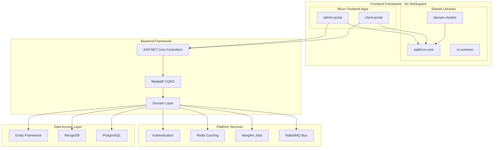
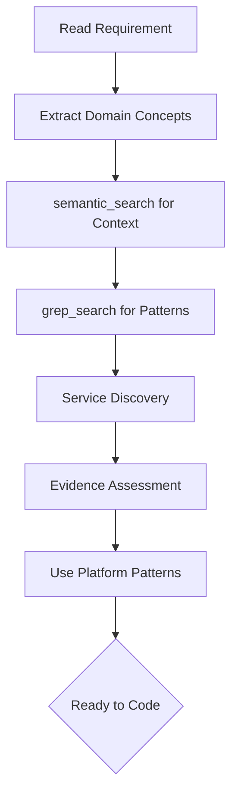

# Easy.Platform Framework - Developer Guide

[](https://dotnet.microsoft.com/download)
[](https://angular.io/)
[](https://blog.cleancoder.com/uncle-bob/2012/08/13/the-clean-architecture.html)
[](https://martinfowler.com/bliki/CQRS.html)

> **Easy.Platform** is a comprehensive framework for building enterprise applications with **.NET 9 backend** and **Angular 19 frontend**, featuring Clean Architecture, CQRS, Domain-Driven Design, and event-driven patterns.

## Quick Navigation

| **I am a...**       | **Get Started**                            | **Learn More**                             |
| ------------------- | ------------------------------------------ | ------------------------------------------ |
| **New Developer**   | [Quick Setup](#quick-setup-5-minutes)      | [Learning Path](#learning-paths)           |
| **AI Coding Agent** | [AI Guidelines](#ai-agent-quick-reference) | [Decision Trees](#decision-trees)          |
| **Architect**       | [Architecture](#platform-architecture)     | [Technical Docs](#technical-documentation) |
| **Framework User**  | [Usage Guide](#framework-usage-guide)      | [Code Examples](#comprehensive-examples)   |

---

## Platform Architecture

Easy.Platform implements **Clean Architecture** with these core principles:

- **Domain-Driven Design**: Rich domain models with business logic
- **CQRS**: Command Query Responsibility Segregation with MediatR
- **Event-Driven Architecture**: Domain events and cross-service messaging
- **Multi-Database Support**: Entity Framework Core, MongoDB, PostgreSQL
- **Microservices Ready**: Modular design for distributed systems

### System Architecture



### Technology Stack

| Layer               | Technologies                                      |
| ------------------- | ------------------------------------------------- |
| **Backend Core**    | .NET 9, ASP.NET Core, MediatR, FluentValidation   |
| **Frontend Core**   | Angular 19, TypeScript, RxJS, NgRx ComponentStore |
| **Data Access**     | Entity Framework Core, MongoDB Driver, Dapper     |
| **Messaging**       | RabbitMQ, Event Bus Patterns                      |
| **Caching**         | Redis, In-Memory Cache                            |
| **Background Jobs** | Hangfire                                          |

---

## Quick Setup (5 Minutes)

### Prerequisites

```bash
dotnet --version    # Should be 9.0+
node --version      # Should be 20.0+
npm --version       # Should be 10.0+
```

### Backend Setup

```bash
cd src/PlatformExampleApp
dotnet build
dotnet run --project PlatformExampleApp.TextSnippet.Api
```

### Frontend Setup (Nx Workspace)

```bash
cd src/PlatformExampleAppWeb
npm install
nx serve playground-text-snippet
```

### Infrastructure

```bash
docker-compose -f src/platform-example-app.docker-compose.yml up -d
```

---

## Frontend Architecture Overview

### Component Hierarchy

```typescript
// Platform foundation layer
PlatformComponent               // Base: lifecycle, subscriptions, signals
├── PlatformVmComponent         // + ViewModel integration
├── PlatformFormComponent       // + Reactive forms integration
└── PlatformVmStoreComponent    // + ComponentStore state management

// Application framework layer
AppBaseComponent                // + Auth, roles, company context
├── AppBaseVmComponent          // + ViewModel + auth context
├── AppBaseFormComponent        // + Forms + auth + validation
└── AppBaseVmStoreComponent     // + Store + auth + loading/error

// Feature implementation
FeatureComponent extends AppBaseVmStoreComponent<State, Store>
```

### State Management Philosophy

```
┌─────────────────┐    ┌─────────────────┐    ┌─────────────────┐
│   COMPONENTS    │    │   VIEW MODELS   │    │      STORES     │
│   (Pure UI)     │────│ (Pure Logic)    │────│ (State Mgmt)    │
└─────────────────┘    └─────────────────┘    └─────────────────┘
```

**Core Principle**: Components handle ONLY UI concerns. ALL business logic, data manipulation, and state management belongs in View Model Stores.

---

## Frontend Development Patterns

### 1. Platform Component API

```typescript
// PlatformComponent
status$: WritableSignal<'Pending'|'Loading'|'Success'|'Error'>;
observerLoadingErrorState<T>(key?: string): OperatorFunction<T, T>;
isLoading$(key?: string): Signal<boolean | null>;
untilDestroyed<T>(): MonoTypeOperatorFunction<T>;
tapResponse<T>(next?, error?, complete?): OperatorFunction<T, T>;

// PlatformVmComponent
vm: WritableSignal<T | undefined>;
currentVm(): T;
updateVm(partial): T;
abstract initOrReloadVm: (isReload: boolean) => Observable<T | undefined>;

// PlatformVmStoreComponent
constructor(public store: TStore) {}
vm: Signal<T | undefined>;
reload(): void;

// PlatformFormComponent
form: FormGroup<PlatformFormGroupControls<T>>;
mode: 'create'|'update'|'view';
validateForm(): boolean;
abstract initialFormConfig: () => PlatformFormConfig<T>;
```

### 2. Component Usage

```typescript
// PlatformComponent
export class ListComponent extends PlatformComponent {
    load() {
        this.api
            .get()
            .pipe(
                this.observerLoadingErrorState('load'),
                this.tapResponse(d => (this.data = d)),
                this.untilDestroyed()
            )
            .subscribe();
    }
}

// PlatformVmStore
@Injectable()
export class MyStore extends PlatformVmStore<MyVm> {
    loadData = this.effectSimple(() => this.api.get().pipe(this.tapResponse(d => this.updateState({ data: d }))));
    readonly data$ = this.select(s => s.data);
}

// PlatformVmStoreComponent
export class ListComponent extends PlatformVmStoreComponent<MyVm, MyStore> {
    constructor(store: MyStore) {
        super(store);
    }
    refresh() {
        this.reload();
    }
}

// PlatformFormComponent
export class FormComponent extends AppBaseFormComponent<FormVm> {
    protected initialFormConfig = () => ({
        controls: { email: new FormControl(this.currentVm().email, [Validators.required], [ifAsyncValidator(() => !this.isViewMode, uniqueValidator)]) },
        dependentValidations: { email: ['name'] }
    });
    submit() {
        if (this.validateForm()) {
            /* save */
        }
    }
}
```

### 3. API Service Pattern

```typescript
@Injectable({ providedIn: 'root' })
export class EntityApiService extends PlatformApiService {
    protected get apiUrl() {
        return environment.apiUrl + '/api/Entity';
    }
    getAll(q?: Query): Observable<Entity[]> {
        return this.get('', q);
    }
    save(cmd: SaveCmd): Observable<Result> {
        return this.post('', cmd);
    }
    search(c: Search): Observable<Entity[]> {
        return this.post('/search', c, { enableCache: true });
    }
}
```

### 4. FormArray Configuration

```typescript
protected initialFormConfig = () => ({
  controls: {
    items: { modelItems: () => vm.items, itemControl: (i, idx) => new FormGroup({ name: new FormControl(i.name, [Validators.required]) }) }
  }
});
```

### 5. Advanced Frontend

```typescript
// @Watch decorator
@Watch('onChanged') public data?: Data;
@WatchWhenValuesDiff('search') public term = '';
private onChanged(v: Data, c: SimpleChange<Data>) { if (!c.isFirstTimeSet) this.update(); }

// RxJS operators
this.search$.pipe(skipDuplicates(500), applyIf(this.enabled$, debounceTime(300)), distinctUntilObjectValuesChanged(), this.untilDestroyed()).subscribe();

// Form validators
new FormControl('', [Validators.required, noWhitespaceValidator, startEndValidator('err', c => c.parent?.get('start')?.value, c => c.value)], [ifAsyncValidator(c => c.valid, uniqueValidator)]);

// Utilities
import { date_format, list_groupBy, list_distinctBy, string_isEmpty, immutableUpdate, deepClone, guid_generate } from '@libs/platform-core';

// PlatformComponent APIs
trackByItem = this.ngForTrackByItemProp<User>('id');
storeSubscription('load', this.data$.subscribe(...));
isLoading$('req1'); getAllErrorMsgs$(['req1', 'req2']);
```

### 6. Store with Caching

```typescript
@Injectable()
export class MyStore extends PlatformVmStore<MyVm> {
    protected get enableCaching() {
        return true;
    }
    protected cachedStateKeyName = () => 'MyStore';
    protected vmConstructor = (d?: Partial<MyVm>) => new MyVm(d);
    protected beforeInitVm = () => this.loadInitialData();
    loadData = this.effectSimple(() =>
        this.api.get().pipe(
            this.observerLoadingErrorState('load'),
            this.tapResponse(d => this.updateState({ data: d }))
        )
    );
}
```

---

## Backend Development Patterns

### 1. Clean Architecture

```csharp
// Domain Layer
public class Employee : RootEntity<Employee, string>
{
    [TrackFieldUpdatedDomainEvent]
    public string Name { get; set; } = "";
    public static Expression<Func<Employee, bool>> IsActiveExpr() => e => e.Status == Status.Active;
}

public class AuditedEmployee : RootAuditedEntity<AuditedEmployee, string, string> { }

// Application Layer - CQRS Handler
public class SaveEmployeeCommandHandler : PlatformCqrsCommandApplicationHandler<SaveEmployeeCommand, SaveEmployeeCommandResult>
{
    protected override async Task<SaveEmployeeCommandResult> HandleAsync(SaveEmployeeCommand req, CancellationToken ct)
    {
        var employee = await repository.GetByIdAsync(req.Id, ct);
        employee.Name = req.Name;
        var saved = await repository.CreateOrUpdateAsync(employee, ct);
        return new SaveEmployeeCommandResult { Id = saved.Id };
    }
}

// Service Layer - Controller
[ApiController, Route("api/[controller]")]
public class EmployeeController : PlatformBaseController
{
    [HttpPost]
    public async Task<IActionResult> Save([FromBody] SaveEmployeeCommand cmd) => Ok(await Cqrs.SendAsync(cmd));
}
```

### 2. Repository Pattern

```csharp
IPlatformQueryableRootRepository<TEntity, TKey>  // Primary
IPlatformRootRepository<TEntity, TKey>           // When queryable not needed

// Extension pattern
public static class EntityRepositoryExtensions
{
    public static async Task<Entity> GetByCodeAsync(this IPlatformQueryableRootRepository<Entity, string> repo, string code, CancellationToken ct = default)
        => await repo.FirstOrDefaultAsync(Entity.CodeExpr(code), ct).EnsureFound();

    public static async Task<List<Entity>> GetByIdsValidatedAsync(this IPlatformQueryableRootRepository<Entity, string> repo, List<string> ids, CancellationToken ct = default)
        => await repo.GetAllAsync(p => ids.Contains(p.Id), ct).EnsureFoundAllBy(p => p.Id, ids);

    public static async Task<string> GetIdByCodeAsync(this IPlatformQueryableRootRepository<Entity, string> repo, string code, CancellationToken ct = default)
        => await repo.FirstOrDefaultAsync(q => q.Where(Entity.CodeExpr(code)).Select(p => p.Id), ct).EnsureFound();
}
```

### 3. Repository API

```csharp
await repository.CreateAsync(entity, ct);
await repository.CreateManyAsync(entities, ct);
await repository.UpdateAsync(entity, ct);
await repository.UpdateManyAsync(entities, dismissSendEvent: false, checkDiff: true, ct);
await repository.CreateOrUpdateAsync(entity, ct);
await repository.CreateOrUpdateManyAsync(entities, ct);
await repository.DeleteAsync(entityId, ct);
await repository.DeleteManyAsync(expr => expr.Status == Status.Deleted, ct);
await repository.GetByIdAsync(id, ct, loadRelatedEntities: p => p.Company);
await repository.FirstOrDefaultAsync(expr, ct);
await repository.GetAllAsync(expr, ct);
await repository.GetByIdsAsync(ids, ct);
var queryBuilder = repository.GetQueryBuilder((uow, q) => q.Where(...).OrderBy(...));
await repository.CountAsync(expr, ct);
await repository.AnyAsync(expr, ct);
```

### 4. Validation Patterns

```csharp
// Sync validation
public override PlatformValidationResult<IPlatformCqrsRequest> Validate()
    => base.Validate()
        .And(_ => Name.IsNotNullOrEmpty(), "Name required")
        .And(_ => Age >= 18, "Must be 18+");

// Async validation
protected override async Task<PlatformValidationResult<SaveCommand>> ValidateRequestAsync(PlatformValidationResult<SaveCommand> v, CancellationToken ct)
    => await v
        .AndAsync(r => repo.GetByIdsAsync(r.Ids, ct).ThenValidateFoundAllAsync(r.Ids, ids => $"Not found: {ids}"))
        .AndNotAsync(r => repo.AnyAsync(p => r.Ids.Contains(p.Id) && p.IsExternal, ct), "Externals not allowed");

// Chained with Of<>
public override PlatformValidationResult<IPlatformCqrsRequest> Validate()
    => this.Validate(p => p.Id.IsNotNullOrEmpty(), "Id required")
        .And(p => p.FromDate <= p.ToDate, "Invalid range")
        .Of<IPlatformCqrsRequest>();

// Ensure pattern
var entity = await repo.GetByIdAsync(id, ct).EnsureFound($"Not found: {id}").Then(x => x.Validate().EnsureValid());
```

### 5. CQRS Command Pattern (Command + Result + Handler in ONE file)

```csharp
public sealed class SaveEntityCommand : PlatformCqrsCommand<SaveEntityCommandResult>
{
    public string Id { get; set; } = "";
    public string Name { get; set; } = "";
    public override PlatformValidationResult<IPlatformCqrsRequest> Validate() => base.Validate().And(_ => Name.IsNotNullOrEmpty(), "Name required");
}

public sealed class SaveEntityCommandResult : PlatformCqrsCommandResult { public EntityDto Entity { get; set; } = null!; }

internal sealed class SaveEntityCommandHandler : PlatformCqrsCommandApplicationHandler<SaveEntityCommand, SaveEntityCommandResult>
{
    protected override async Task<PlatformValidationResult<SaveEntityCommand>> ValidateRequestAsync(PlatformValidationResult<SaveEntityCommand> v, CancellationToken ct)
        => await v.AndAsync(r => repo.GetByIdsAsync(r.RelatedIds, ct).ThenValidateFoundAllAsync(r.RelatedIds, ids => $"Not found: {ids}"));

    protected override async Task<SaveEntityCommandResult> HandleAsync(SaveEntityCommand req, CancellationToken ct)
    {
        var entity = req.Id.IsNullOrEmpty()
            ? req.MapToNewEntity().With(e => e.CreatedBy = RequestContext.UserId())
            : await repo.GetByIdAsync(req.Id, ct).Then(e => req.UpdateEntity(e));
        await entity.ValidateAsync(repo, ct).EnsureValidAsync();
        var saved = await repo.CreateOrUpdateAsync(entity, ct);
        return new SaveEntityCommandResult { Entity = new EntityDto(saved) };
    }
}
```

### 6. Query Pattern

```csharp
public sealed class GetEntityListQuery : PlatformCqrsPagedQuery<GetEntityListQueryResult, EntityDto>
{
    public List<Status> Statuses { get; set; } = [];
    public string? SearchText { get; set; }
}

internal sealed class GetEntityListQueryHandler : PlatformCqrsQueryApplicationHandler<GetEntityListQuery, GetEntityListQueryResult>
{
    protected override async Task<GetEntityListQueryResult> HandleAsync(GetEntityListQuery req, CancellationToken ct)
    {
        var qb = repo.GetQueryBuilder((uow, q) => q
            .Where(e => e.CompanyId == RequestContext.CurrentCompanyId())
            .WhereIf(req.Statuses.Any(), e => req.Statuses.Contains(e.Status))
            .PipeIf(req.SearchText.IsNotNullOrEmpty(), q => searchService.Search(q, req.SearchText, Entity.SearchColumns())));

        var (total, items) = await (
            repo.CountAsync((uow, q) => qb(uow, q), ct),
            repo.GetAllAsync((uow, q) => qb(uow, q).OrderByDescending(e => e.CreatedDate).PageBy(req.Skip, req.Take), ct, e => e.Related)
        );
        return new GetEntityListQueryResult(items, total, req);
    }
}
```

### 7. Event-Driven Side Effects

```csharp
// ❌ WRONG - direct side effect
await repo.CreateAsync(entity, ct);
await notificationService.SendAsync(entity);

// ✅ CORRECT - just save, platform auto-raises event
await repo.CreateAsync(entity, ct);

// Event handler (UseCaseEvents/[Feature]/)
internal sealed class SendNotificationOnCreateHandler : PlatformCqrsEntityEventApplicationHandler<Entity>
{
    public override async Task<bool> HandleWhen(PlatformCqrsEntityEvent<Entity> e)
        => !e.RequestContext.IsSeedingTestingData() && e.CrudAction == PlatformCqrsEntityEventCrudAction.Created;

    protected override async Task HandleAsync(PlatformCqrsEntityEvent<Entity> e, CancellationToken ct)
        => await notificationService.SendAsync(e.EntityData);
}
```

### 8. Entity Pattern

```csharp
[TrackFieldUpdatedDomainEvent]
public sealed class Entity : RootEntity<Entity, string>
{
    [TrackFieldUpdatedDomainEvent] public string Name { get; set; } = "";
    [JsonIgnore] public Company? Company { get; set; }

    public static Expression<Func<Entity, bool>> UniqueExpr(string companyId, string code) => e => e.CompanyId == companyId && e.Code == code;
    public static Expression<Func<Entity, bool>> FilterExpr(List<Status> s) => e => s.ToHashSet().Contains(e.Status!.Value);
    public static Expression<Func<Entity, bool>> CompositeExpr(string companyId) => OfCompanyExpr(companyId).AndAlsoIf(true, () => e => e.IsActive);
    public static Expression<Func<Entity, object?>>[] SearchColumns() => [e => e.Name, e => e.Code];

    // Async expression with external dependency
    public static async Task<Expression<Func<Entity, bool>>> FilterWithLicenseExprAsync(IRepository<License> licenseRepo, string companyId, CancellationToken ct = default)
    {
        var hasLicense = await licenseRepo.HasLicenseAsync(companyId, ct);
        return hasLicense ? PremiumFilterExpr() : StandardFilterExpr();
    }

    [ComputedEntityProperty] public bool IsRoot { get => Id == RootId; set { } }
    [ComputedEntityProperty] public string FullName { get => $"{First} {Last}".Trim(); set { } }

    public static List<string> ValidateEntity(Entity? e) => e == null ? ["Not found"] : !e.IsActive ? ["Inactive"] : [];
}
```

### 9. Entity DTO Pattern

```csharp
public class EmployeeDto : PlatformEntityDto<Employee, string>
{
    public EmployeeDto() { }
    public EmployeeDto(Employee e, User? u) : base(e) { Id = e.Id; Name = e.Name ?? u?.Name ?? ""; }

    public string? Id { get; set; }
    public string Name { get; set; } = "";
    public OrgDto? Company { get; set; }

    public EmployeeDto WithCompany(Org c) { Company = new OrgDto(c); return this; }

    protected override object? GetSubmittedId() => Id;
    protected override string GenerateNewId() => Ulid.NewUlid().ToString();
    protected override Employee MapToEntity(Employee e, MapToEntityModes m) { e.Name = Name; return e; }
}

// Usage
var dtos = employees.SelectList(e => new EmployeeDto(e, e.User).WithCompany(e.Company!));
```

### 10. Fluent Helpers

```csharp
.With(e => e.Name = x).WithIf(cond, e => e.Status = Active)
.Then(e => e.Process()).ThenAsync(async e => await e.ValidateAsync(ct))
.EnsureFound("Not found").EnsureFoundAllBy(x => x.Id, ids).EnsureValidAsync()
.AndAlso(expr).AndAlsoIf(cond, () => expr).OrElse(expr)
.ThenSelect(e => e.Id).ParallelAsync(async i => await Process(i), maxConcurrent: 10)

var (entity, files) = await (repo.CreateOrUpdateAsync(e, ct), files.ParallelAsync(f => Upload(f, ct)));
```

### 11. Full-Text Search

```csharp
var queryBuilder = repository.GetQueryBuilder(q => q
    .Where(t => t.IsActive)
    .PipeIf(req.SearchText.IsNotNullOrEmpty(), q => searchService.Search(q, req.SearchText, Entity.SearchColumns(), fullTextAccurateMatch: true)));

var (total, items) = await (
    repository.CountAsync((uow, q) => queryBuilder(uow, q), ct),
    repository.GetAllAsync((uow, q) => queryBuilder(uow, q).OrderByDescending(e => e.CreatedDate).PageBy(req.Skip, req.Take), ct)
);

// Entity search columns
public static Expression<Func<Entity, object>>[] SearchColumns() => [e => e.Name, e => e.Code];
```

### 12. Cross-Service Communication

```csharp
public class EmployeeEventProducer : PlatformCqrsEntityEventBusMessageProducer<EmployeeEventBusMessage, Employee, string> { }

public class EmployeeEventConsumer : PlatformApplicationMessageBusConsumer<EmployeeEventBusMessage>
{
    protected override async Task HandleLogicAsync(EmployeeEventBusMessage msg) { /* sync logic */ }
}
```

---

## Advanced Platform Features

### Background Jobs

```csharp
[PlatformRecurringJob("0 3 * * *")]
public sealed class PagedJob : PlatformApplicationPagedBackgroundJobExecutor
{
    protected override int PageSize => 50;
    protected override async Task ProcessPagedAsync(int? skip, int? take, object? p, IServiceProvider sp, IPlatformUnitOfWorkManager uow)
        => await repo.GetAllAsync(q => Query(q).PageBy(skip, take)).Then(items => items.ParallelAsync(Process));
    protected override async Task<int> MaxItemsCount(PlatformApplicationPagedBackgroundJobParam<object?> p) => await repo.CountAsync(Query);
}

[PlatformRecurringJob("0 0 * * *")]
public sealed class BatchJob : PlatformApplicationBatchScrollingBackgroundJobExecutor<Entity, string>
{
    protected override int BatchKeyPageSize => 50;
    protected override int BatchPageSize => 25;
    protected override IQueryable<Entity> EntitiesQueryBuilder(IQueryable<Entity> q, object? p, string? k) => q.WhereIf(k != null, e => e.CompanyId == k);
    protected override IQueryable<string> EntitiesBatchKeyQueryBuilder(IQueryable<Entity> q, object? p, string? k) => EntitiesQueryBuilder(q, p, k).Select(e => e.CompanyId).Distinct();
    protected override async Task ProcessEntitiesAsync(List<Entity> e, string k, object? p, IServiceProvider sp) => await e.ParallelAsync(Process);
}

// Scrolling pattern (data affected by processing)
public override async Task ProcessAsync(Param p) => await UnitOfWorkManager.ExecuteInjectScopedScrollingPagingAsync<Entity>(
    ExecutePaged, await repo.CountAsync(q => Query(q, p)) / PageSize, p, PageSize);
```

### Message Bus Consumer

```csharp
internal sealed class EntityConsumer : PlatformApplicationMessageBusConsumer<EntityEventBusMessage>
{
    public override async Task<bool> HandleWhen(EntityEventBusMessage m, string r) => true;
    public override async Task HandleLogicAsync(EntityEventBusMessage m, string r)
    {
        if (m.Payload.CrudAction == Created || (m.Payload.CrudAction == Updated && !m.Payload.EntityData.IsDeleted))
        {
            var (companyMissing, userMissing) = await (
                Util.TaskRunner.TryWaitUntilAsync(() => companyRepo.AnyAsync(c => c.Id == m.Payload.EntityData.CompanyId), maxWaitSeconds: 300).Then(p => !p),
                Util.TaskRunner.TryWaitUntilAsync(() => userRepo.AnyAsync(u => u.Id == m.Payload.EntityData.UserId), maxWaitSeconds: 300).Then(p => !p));
            if (companyMissing || userMissing) return;

            var existing = await repo.FirstOrDefaultAsync(e => e.Id == m.Payload.EntityData.Id);
            if (existing == null) await repo.CreateAsync(m.Payload.EntityData.ToEntity().With(e => e.LastSyncDate = m.CreatedUtcDate));
            else if (existing.LastSyncDate <= m.CreatedUtcDate) await repo.UpdateAsync(m.Payload.EntityData.UpdateEntity(existing).With(e => e.LastSyncDate = m.CreatedUtcDate));
        }
        if (m.Payload.CrudAction == Deleted) await repo.DeleteAsync(m.Payload.EntityData.Id);
    }
}
```

### Data Migration

```csharp
public class MigrateData : PlatformDataMigrationExecutor<DbContext>
{
    public override string Name => "20251022_MigrateData";
    public override DateTime? OnlyForDbsCreatedBeforeDate => new(2025, 10, 22);
    public override bool AllowRunInBackgroundThread => true;

    public override async Task Execute(DbContext db)
    {
        var qb = repo.GetQueryBuilder(q => q.Where(Filter()));
        await RootServiceProvider.ExecuteInjectScopedPagingAsync(await repo.CountAsync(q => qb(q)), 200, ExecutePage, qb);
    }

    static async Task<List<Entity>> ExecutePage(int skip, int take, Func<IQueryable<Entity>, IQueryable<Entity>> qb, IRepo<Entity> r, IPlatformUnitOfWorkManager u)
    {
        using var uow = u.Begin();
        var items = await r.GetAllAsync(q => qb(q).OrderBy(e => e.Id).Skip(skip).Take(take));
        await r.UpdateManyAsync(items, dismissSendEvent: true, checkDiff: false, ct: default);
        await uow.CompleteAsync();
        return items;
    }
}
```

---

## AI Agent Quick Reference

### Investigation Workflow



### Decision Trees

#### Backend Development

```
Need to add backend feature?
├── New API endpoint? → Use PlatformBaseController + CQRS Command
├── Business logic? → Create Command Handler in Application layer
├── Data access? → Use platform repository pattern
├── Cross-service sync? → Create Entity Event Consumer
├── Scheduled task? → Create PlatformApplicationBackgroundJob
└── Database migration? → Use PlatformDataMigrationExecutor
```

#### Frontend Development

```
Need to add frontend feature?
├── Simple component? → Extend PlatformComponent
├── Complex state? → Use PlatformVmStoreComponent + PlatformVmStore
├── Forms? → Extend PlatformFormComponent with validation
├── API calls? → Create service extending PlatformApiService
└── Cross-component data? → Use ComponentStore patterns
```

### Code Templates

#### CQRS Command Template

```csharp
public sealed class Save{E}Command : PlatformCqrsCommand<Save{E}CommandResult> { public string Name { get; set; } = ""; public override PlatformValidationResult<IPlatformCqrsRequest> Validate() => base.Validate().And(_ => Name.IsNotNullOrEmpty(), "Required"); }
internal sealed class Save{E}CommandHandler : PlatformCqrsCommandApplicationHandler<Save{E}Command, Save{E}CommandResult> { protected override async Task<Save{E}CommandResult> HandleAsync(Save{E}Command r, CancellationToken ct) { /* impl */ } }
```

#### Frontend Component Template

```typescript
@Component({ selector: 'app-{e}-list', template: `<app-loading [target]="this">@if (vm(); as vm) { @for (i of vm.items; track i.id) { <div>{{i.name}}</div> } }</app-loading>`, providers: [{E}Store] })
export class {E}Component extends AppBaseVmStoreComponent<{E}State, {E}Store> { ngOnInit() { this.store.load(); } }
```

---

## Authorization

### Backend

```csharp
// Controller
[PlatformAuthorize(PlatformRoles.Admin, PlatformRoles.Manager)]
[HttpPost] public async Task<IActionResult> Save([FromBody] Cmd c) => Ok(await Cqrs.SendAsync(c));

// Handler validation
protected override async Task<PlatformValidationResult<T>> ValidateRequestAsync(...)
    => await v.AndNotAsync(_ => !RequestContext.HasRole(PlatformRoles.Admin), "Admin only")
              .AndAsync(_ => repo.AnyAsync(e => e.CompanyId == RequestContext.CurrentCompanyId()), "Same company");

// Entity filter
public static Expression<Func<E, bool>> AccessExpr(string userId, string companyId) => e => e.UserId == userId || (e.CompanyId == companyId && e.IsPublic);
```

### Frontend

```typescript
// Component
get canEdit() { return this.hasRole(PlatformRoles.Admin) && this.isOwnCompany(); }

// Template
@if (hasRole(PlatformRoles.Admin)) { <button (click)="delete()">Delete</button> }

// Route guard
canActivate(): Observable<boolean> { return this.authService.hasRole$(PlatformRoles.Admin); }
```

---

## Migration Patterns

```csharp
// EF Core
public partial class AddField : Migration { protected override void Up(MigrationBuilder m) { m.AddColumn<string>("Dept", "Employees"); } }

// MongoDB
public class MigrateData : PlatformMongoMigrationExecutor<ServiceDbContext>
{
    public override string Name => "20240115_Migrate";
    public override async Task Execute() => await RootServiceProvider.ExecuteInjectScopedPagingAsync(await repo.CountAsync(q => q.Where(...)), 200,
        async (skip, take, r, u) => { var items = await r.GetAllAsync(q => q.Skip(skip).Take(take)); await r.UpdateManyAsync(items, dismissSendEvent: true); return items; });
}

// Cross-DB migration (first-time setup, use events for ongoing sync)
public class SyncData : PlatformDataMigrationExecutor<TargetDbContext>
{
    public override DateTime? OnlyForDbsCreatedBeforeDate => new(2024, 1, 15);
    public override async Task Execute(TargetDbContext db) => await targetRepo.CreateManyAsync(
        (await sourceDbContext.Entities.Where(e => e.CreatedDate < cutoffDate).ToListAsync()).Select(e => e.MapToTargetEntity()));
}
```

---

## Helper vs Util

```csharp
// Helper (with dependencies)
public class EntityHelper { private readonly IRepo<E> repo; public async Task<E> GetOrCreateAsync(string code, CancellationToken ct) => await repo.FirstOrDefaultAsync(t => t.Code == code, ct) ?? await CreateAsync(code, ct); }

// Util (pure functions)
public static class EntityUtil { public static string FullName(E e) => $"{e.First} {e.Last}".Trim(); public static bool IsActive(E e) => e.Status == Active; }
```

---

## Advanced Backend Patterns

```csharp
.IsNullOrEmpty() / .IsNotNullOrEmpty() / .RemoveWhere(pred, out removed) / .UpsertBy(key, items, update) / .SelectList(sel) / .ThenSelect(sel) / .ParallelAsync(fn, max) / .AddDistinct(item, key)

var entity = dto.NotHasSubmitId() ? dto.MapToNewEntity().With(e => e.CreatedBy = RequestContext.UserId()) : await repo.GetByIdAsync(dto.Id, ct).Then(x => dto.UpdateToEntity(x));

RequestContext.CurrentCompanyId() / .UserId() / .ProductScope() / .HasRequestAdminRoleInCompany()

var (a, b, c) = await (repo1.GetAllAsync(...), repo2.GetAllAsync(...), repo3.GetAllAsync(...));

public sealed class Helper : IPlatformHelper { private readonly IPlatformApplicationRequestContext ctx; public Helper(IPlatformApplicationRequestContextAccessor a) { ctx = a.Current; } }

.With(e => e.Name = x).PipeActionIf(cond, e => e.Update()).PipeActionAsyncIf(async () => await svc.Any(), async e => await e.Sync())

public static Expression<Func<E, bool>> ComplexExpr(int s, string c, int? m) => BaseExpr(s, c).AndAlso(e => e.User!.IsActive).AndAlsoIf(m != null, () => e => e.Start <= Clock.UtcNow.AddMonths(-m!.Value));

// Domain Service Pattern (strategy for permissions)
public static class PermissionService {
    static readonly Dictionary<string, IRoleBasedPermissionCheckHandler> RoleHandlers = ...;
    public static Expression<Func<E, bool>> GetCanManageExpr(IList<string> roles) => roles.Aggregate(e => false, (expr, role) => expr.OrElse(RoleHandlers[role].GetExpr()));
}

// Object Deep Comparison
if (prop.GetValue(entity).IsValuesDifferent(prop.GetValue(existing))) entity.AddFieldUpdatedEvent(prop, oldVal, newVal);

// Task Extensions
task.WaitResult();  // NOT task.Wait() - preserves stack trace
await target.WaitUntilGetValidResultAsync(t => repo.GetByIdAsync(t.Id), r => r != null, maxWaitSeconds: 30);
.ThenGetWith(selector)  // Returns (T, T1)
.ThenIfOrDefault(condition, nextTask, defaultValue)
```

---

## Anti-Patterns to Avoid

### Backend

```csharp
// ❌ Direct cross-service DB access → ✅ Use message bus
// ❌ Custom repository interface → ✅ Use platform repo + extensions
// ❌ Manual validation throw → ✅ Use PlatformValidationResult fluent API
// ❌ Side effects in handler → ✅ Use entity event handlers
// ❌ DTO mapping in handler → ✅ DTO owns mapping via MapToObject()/MapToEntity()

// ✅ Correct DTO mapping
public sealed class ConfigDto : PlatformDto<ConfigValue> { public override ConfigValue MapToObject() => new() { ClientId = ClientId }; }
var config = req.Config.MapToObject().With(p => p.Secret = encrypt(p.Secret));
```

### Frontend

```typescript
// ❌ Direct HttpClient → ✅ Extend PlatformApiService
// ❌ Manual signals → ✅ Use PlatformVmStore
// ❌ Missing untilDestroyed() → ✅ Always use .pipe(this.untilDestroyed())
```

---

## Multi-Database Support

### Entity Framework Core

```csharp
public class MyEfCorePersistenceModule : PlatformEfCorePersistenceModule<MyDbContext>
{
    protected override Action<DbContextOptionsBuilder> DbContextOptionsBuilderActionProvider(IServiceProvider sp)
        => options => options.UseSqlServer(Configuration.GetConnectionString("DefaultConnection"));
}
```

### MongoDB

```csharp
public class MyMongoPersistenceModule : PlatformMongoDbPersistenceModule<MyDbContext>
{
    protected override void ConfigureMongoOptions(PlatformMongoOptions<MyDbContext> options)
    {
        options.ConnectionString = Configuration.GetSection("MongoDB:ConnectionString").Value;
        options.Database = Configuration.GetSection("MongoDB:Database").Value;
    }
}
```

---

## Learning Paths

### New Developer (Week 1-2)

**Day 1-2: Platform Exploration**

- Complete [Quick Setup](#quick-setup-5-minutes)
- Run `src/PlatformExampleApp` and explore all features
- Study the four-layer Clean Architecture structure

**Day 3-4: Core Concepts**

- Understanding CQRS with command/query handlers
- Domain entities and business logic placement
- Repository pattern and data access

**Day 5-7: First Implementation**

- Create a simple CRUD operation using platform patterns
- Build corresponding frontend component with store
- Add validation and error handling

### Backend Developer Path

**Foundation (Week 1)**

- Clean Architecture layers and responsibilities
- CQRS implementation with MediatR
- Repository pattern and data access
- Validation patterns and error handling

**Advanced (Week 2-3)**

- Event-driven architecture and messaging
- Background jobs and scheduled tasks
- Data migration and seeding patterns

### Frontend Developer Path

**Foundation (Week 1)**

- Component hierarchy and inheritance
- State management with Platform stores
- Reactive forms and validation
- API service patterns

**Advanced (Week 2-3)**

- Advanced state management patterns
- Custom validators and form builders
- Component and service testing

---

## Troubleshooting Guide

### Common Backend Issues

```csharp
// ❌ Problem: Repository not found
// ✅ Solution: Ensure proper registration
services.AddScoped<ITextSnippetRepository<TextSnippet>, TextSnippetRepository<TextSnippet>>();

// ❌ Problem: Validation not triggered
// ✅ Solution: Override Validate() method and call EnsureValid()
public override PlatformValidationResult<IPlatformCqrsRequest> Validate()
    => base.Validate().And(_ => !string.IsNullOrEmpty(Name), "Name is required");
```

### Common Frontend Issues

```typescript
// ❌ Problem: Store not updating UI
// ✅ Solution: Ensure proper store initialization
ngOnInit() { this.store.initOrReloadVm(false); }

// ❌ Problem: Effects not triggering
// ✅ Solution: Use effectSimple() pattern
public loadData = this.effectSimple(() =>
    this.api.getData().pipe(this.tapResponse(data => this.updateState({ data }))));
```

---

## Technical Documentation

### Clean Architecture Implementation

- **Domain Layer**: Business entities, value objects, domain services
- **Application Layer**: Use cases, CQRS handlers, application services
- **Infrastructure Layer**: External concerns (databases, messaging, file storage)
- **Presentation Layer**: API controllers, web endpoints

### CQRS with MediatR

- **Commands**: Write operations that modify state
- **Queries**: Read operations that return data
- **Handlers**: Process commands and queries
- **Events**: Domain and integration events

### Repository Pattern

- **Generic repositories**: Platform base implementations
- **Specific repositories**: Domain-specific interfaces
- **Unit of Work**: Transaction management
- **Expression-based queries**: Type-safe query building

---

## External Resources

### Official Documentation

- [ASP.NET Core Documentation](https://docs.microsoft.com/en-us/aspnet/core/)
- [Angular Documentation](https://angular.io/docs)
- [Entity Framework Core](https://docs.microsoft.com/en-us/ef/core/)
- [MongoDB Driver for .NET](https://docs.mongodb.com/drivers/csharp/)

### Learning Resources

- [Clean Architecture Guide](https://blog.cleancoder.com/uncle-bob/2012/08/13/the-clean-architecture.html)
- [CQRS Pattern](https://martinfowler.com/bliki/CQRS.html)
- [Domain-Driven Design](https://domainlanguage.com/ddd/)
- [Angular Architecture Guide](https://angular.io/guide/architecture)

---

## Support & Contribution

### Getting Help

1. **Framework Documentation**: Start with this guide and explore examples
2. **Code Examples**: Study `src/PlatformExampleApp` for working implementations
3. **Search Patterns**: Do semantic search for finding existing patterns

### Version Information

- **Platform Version**: Easy.Platform 1.0
- **Backend Framework**: .NET 9
- **Frontend Framework**: Angular 19
- **Last Updated**: January 2025

---

_This guide provides comprehensive coverage of the Easy.Platform framework. For specific implementation details, refer to the working examples in `src/PlatformExampleApp` and explore the platform source code for advanced patterns and techniques._
