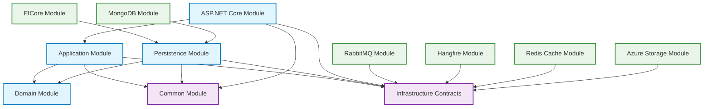
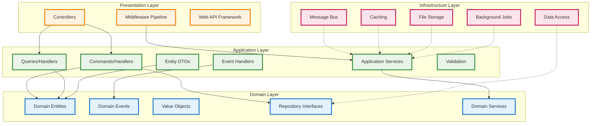
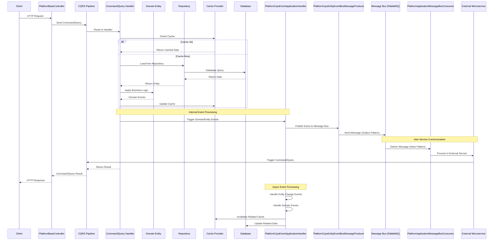

# Easy.Platform Framework Documentation

A comprehensive .NET 8 enterprise framework for building microservices with Clean Architecture, CQRS, and Domain-Driven Design patterns.

## Framework Overview

Easy.Platform is a robust, production-ready framework, designed to accelerate enterprise application development while maintaining clean code principles and architectural best practices.

### Core Technologies

-   **Language**: C# (.NET 8)
-   **Framework**: ASP.NET Core 8
-   **Databases**: Microsoft SQL Server, MongoDB, PostgreSQL
-   **ORM**: Entity Framework Core
-   **Message Bus**: RabbitMQ
-   **Background Jobs**: Hangfire
-   **Caching**: Redis
-   **File Storage**: Azure Blob Storage
-   **Containerization**: Docker & Kubernetes

---

# Architecture Overview

## Easy.Platform Structure

The Easy.Platform follows **Clean Architecture** principles with **Domain-Driven Design (DDD)**, organized into distinct layers and cross-cutting components:

#### **Platform Module Dependencies Graph**


```mermaid
graph TD
    App[Application Module] --> Domain[Domain Module]
    App --> Common[Common Module]
    App --> InfraContracts[Infrastructure Contracts]

    Persistence[Persistence Module] --> Domain
    Persistence --> Common
    Persistence --> InfraContracts

    Presentation[ASP.NET Core Module] --> App
    Presentation --> Common
    Presentation --> InfraContracts

    %% Infrastructure Implementations
    EfCore[EfCore Module] --> Persistence
    MongoDB[MongoDB Module] --> Persistence
    RabbitMQ[RabbitMQ Module] --> InfraContracts
    Hangfire[Hangfire Module] --> InfraContracts
    Redis[Redis Cache Module] --> InfraContracts
    Azure[Azure Storage Module] --> InfraContracts

    %% Styling
    classDef coreLayer fill:#e1f5fe,stroke:#0277bd,stroke-width:2px
    classDef crossCutting fill:#f3e5f5,stroke:#7b1fa2,stroke-width:2px
    classDef infrastructure fill:#e8f5e8,stroke:#388e3c,stroke-width:2px

    class App,Domain,Persistence,Presentation coreLayer
    class Common,InfraContracts crossCutting
    class EfCore,MongoDB,RabbitMQ,Hangfire,Redis,Azure infrastructure
```

#### **Clean Architecture Layer Relationships**


```mermaid
graph TB
    subgraph "Presentation Layer"
        Controllers[Controllers]
        Middleware[Middleware Pipeline]
        WebAPI[Web API Framework]
    end

    subgraph "Application Layer"
        Commands[Commands/Handlers]
        Queries[Queries/Handlers]
        Events[Event Handlers]
        AppServices[Application Services]
        DTOs[Entity DTOs]
        Validation[Validation]
    end

    subgraph "Domain Layer"
        Entities[Domain Entities]
        DomainEvents[Domain Events]
        ValueObjects[Value Objects]
        Repositories[Repository Interfaces]
        DomainServices[Domain Services]
    end

    subgraph "Infrastructure Layer"
        DataAccess[Data Access]
        MessageBus[Message Bus]
        Caching[Caching]
        FileStorage[File Storage]
        BackgroundJobs[Background Jobs]
    end

    %% Dependencies (Clean Architecture rules)
    Controllers --> Commands
    Controllers --> Queries
    Middleware --> AppServices

    Commands --> Entities
    Commands --> Repositories
    Queries --> Entities
    Events --> DomainEvents
    AppServices --> DomainServices
    DTOs --> Entities

    DataAccess -.-> Repositories
    MessageBus -.-> AppServices
    Caching -.-> AppServices
    FileStorage -.-> AppServices
    BackgroundJobs -.-> AppServices

    %% Styling
    classDef presentation fill:#fff3e0,stroke:#f57c00,stroke-width:3px
    classDef application fill:#e8f5e8,stroke:#388e3c,stroke-width:3px
    classDef domain fill:#e3f2fd,stroke:#1976d2,stroke-width:3px
    classDef infrastructure fill:#fce4ec,stroke:#c2185b,stroke-width:3px

    class Controllers,Middleware,WebAPI presentation
    class Commands,Queries,Events,AppServices,DTOs,Validation application
    class Entities,DomainEvents,ValueObjects,Repositories,DomainServices domain
    class DataAccess,MessageBus,Caching,FileStorage,BackgroundJobs infrastructure
```

#### **Component Interaction Flow**


```mermaid
sequenceDiagram
    participant Client
    participant Controller as PlatformBaseController
    participant CQRS as CQRS Pipeline
    participant Handler as Command/Query Handler
    participant Domain as Domain Entity
    participant Repo as Repository
    participant Cache as Cache Provider
    participant DB as Database
    participant EventHandler as PlatformCqrsEventApplicationHandler
    participant BusProducer as PlatformCqrsEntityEventBusMessageProducer
    participant MessageBus as Message Bus (RabbitMQ)
    participant BusConsumer as PlatformApplicationMessageBusConsumer
    participant ExternalService as External Microservice

    Client->>Controller: HTTP Request
    Controller->>CQRS: Send Command/Query
    CQRS->>Handler: Route to Handler
    Handler->>Cache: Check Cache
    alt Cache Hit
        Cache-->>Handler: Return Cached Data
    else Cache Miss
        Handler->>Repo: Load from Repository
        Repo->>DB: Database Query
        DB-->>Repo: Return Data
        Repo-->>Handler: Return Entity
        Handler->>Domain: Apply Business Logic
        Domain-->>Handler: Domain Events
        Handler->>Cache: Update Cache
    end

    Note over Handler,EventHandler: Internal Event Processing
    Handler->>EventHandler: Trigger Domain/Entity Events
    EventHandler->>BusProducer: Publish Event to Message Bus
    BusProducer->>MessageBus: Send Message (Outbox Pattern)

    Note over MessageBus,ExternalService: Inter-Service Communication
    MessageBus->>BusConsumer: Deliver Message (Inbox Pattern)
    BusConsumer->>ExternalService: Process in External Service
    ExternalService->>CQRS: Trigger Command/Query

    Handler-->>CQRS: Return Result
    CQRS-->>Controller: Command/Query Result
    Controller-->>Client: HTTP Response

    Note over EventHandler: Async Event Processing
    EventHandler->>EventHandler: Handle Entity Change Events
    EventHandler->>EventHandler: Handle Domain Events
    EventHandler->>Cache: Invalidate Related Cache
    EventHandler->>DB: Update Related Data
```

### **Core Layers** (Clean Architecture)

**1. Application Layer**

-   CQRS handlers with command, query, and event processing
-   Request context management with custom value storage
-   Data seeding framework with dependency ordering
-   Advanced validation with async chaining patterns
-   Background job scheduling with recurring job support
-   File storage service integration
-   Cache management with tag-based invalidation

**2. Domain Layer**

-   Rich domain models with aggregate root support
-   Repository and Unit of Work patterns
-   Domain event system with automatic field-level change tracking
-   Entity change detection with `[TrackFieldUpdatedDomainEvent]` attribute
-   Optimistic concurrency control with row versioning
-   Domain validation with fluent API extensions

**3. Persistence Layer**

-   Database context abstraction supporting multiple providers
-   Full-text search capabilities with ranking
-   Multi-database transaction coordination
-   Outbox/Inbox pattern for reliable message processing
-   Data migration and seeding infrastructure

**4. Presentation Layer**

-   ASP.NET Core integration through PlatformAspNetCoreModule
-   Standardized API controllers with base controller functionality
-   Comprehensive middleware pipeline for request processing
-   Global exception handling with structured error responses
-   Request context management with correlation tracking
-   OpenAPI/Swagger integration with automatic documentation
-   Health check endpoints with dependency monitoring
-   Performance monitoring and observability features

### **Cross-Cutting Components**

**Common Layer**

-   Shared utilities, validation framework, CQRS base classes
-   DTOs, value objects, and extension methods
-   Thread-safe utilities and helper classes

**Infrastructure Contracts**

-   Abstract interfaces and base classes for infrastructure concerns
-   Service contracts for external systems integration
-   Pluggable architecture for different technology stacks

### **Concrete Infrastructure Implementations**

-   **Easy.Platform.EfCore**: Entity Framework Core persistence implementation
-   **Easy.Platform.MongoDB**: MongoDB persistence implementation
-   **Easy.Platform.RabbitMQ**: RabbitMQ message bus implementation
-   **Easy.Platform.HangfireBackgroundJob**: Hangfire background job implementation
-   **Easy.Platform.AzureFileStorage**: Azure Blob Storage file storage implementation
-   **Easy.Platform.RedisCache**: Redis caching implementation
-   **Easy.Platform.AspNetCore**: ASP.NET Core integration

---

# Getting Started

## Prerequisites

### Docker & Infrastructure

-   Install Docker: https://docs.docker.com/engine/install/
-   Copy **./src/.wslconfig** to your users folder to limit Docker RAM usage
-   **Minimum Docker RAM**: 3.5GB for infrastructure, 5GB for full system
-   Restart Docker after config changes: `wsl --shutdown`

### Development Tools

-   **.NET 8 SDK**: https://dotnet.microsoft.com/download/dotnet/8.0
-   **Node.js**: https://nodejs.org/en/blog/release/v16.13.0/
-   **Visual Studio 2022**: https://visualstudio.microsoft.com/vs/
    -   **Required**: CSharpier extension for code formatting
    -   **Recommended**: ReSharper for enhanced productivity
-   **Visual Studio Code**: https://code.visualstudio.com/download
    -   Install all recommended extensions for PlatformExampleAppWeb

### SSL Certificate

-   Install OpenSSL: https://slproweb.com/products/Win32OpenSSL.html

## Running the Application

**Development Commands:**

-   `start-dev-platform-example-app.cmd` - Start full application
-   `start-dev-platform-example-app.infrastructure.cmd` - Start infrastructure only

**Application URLs:**

-   API Server: [http://localhost:5001](http://localhost:5001)
-   Client: [http://localhost:4001](http://localhost:4001)

---

# Platform Architecture

## Single Microservice Architecture - Clean Architecture


## Platform Module Architecture

The platform defines each module type for each layer as **PlatformApplicationModule**. Modules can depend on other modules via **ModuleTypeDependencies** method.

### Module Lifecycle

**Two Main Stages:**

1. **RegisterServices**: Register all services and dependencies
2. **Init**: Execute initialization logic (migrations, data seeding, etc.)

**Dependency Resolution:**

-   When registering a module, all dependent modules run **RegisterServices** first
-   When initializing, all dependent modules run **Init** to execute necessary setup logic

**Convention-Based Registration:**
Most components register via assembly convention scanning using **RegisterAllFromType**, enabling automatic discovery and registration.

---

# Layer Architecture Details

## Domain Layer

**Purpose**: Define domain objects and business logic based on requirements.

**Components**:

-   **Entities**: Domain entities with business logic, constraints, and behavior

    -   Include sub-class value-object types
    -   Support automatic change tracking with `[TrackFieldUpdatedDomainEvent]`
    -   Can receive repositories as parameters for data access

-   **Domain Events**: Track entity lifecycle and changes

    -   Automatic tracking: `[AutoTrackValueUpdatedDomainEvent]` and `[TrackValueUpdatedDomainEvent]`
    -   Manual events: Use `AddDomainEvent()` in entities
    -   Event discovery: `FindDomainEvents()` and `FindPropertyValueUpdatedDomainEvent()`

-   **Value Objects**: Shared immutable objects used across entities

-   **Repositories**: Abstract interfaces for CRUD operations

    -   Entities can know about repositories (mutual relationship)
    -   Actual implementations in Persistence layer

-   **Domain Services**: Complex business logic spanning multiple entities
    -   Use `PlatformDomainService` base class
    -   Send domain events with `SendEvent()`

**Example Domain Entity**:

```csharp
[TrackFieldUpdatedDomainEvent] // Automatic change tracking
public sealed class Order : RootEntity<Order, string>
{
    public string CustomerId { get; set; } = "";
    public List<OrderItem> Items { get; set; } = [];

    [TrackFieldUpdatedDomainEvent] // Track specific field changes
    public OrderStatus Status { get; set; }

    // Domain business logic
    public void UpdateStatus(OrderStatus newStatus)
    {
        if (!CanTransitionTo(newStatus))
            throw new DomainException($"Cannot transition from {Status} to {newStatus}");

        Status = newStatus;
        AddDomainEvent(new OrderStatusChangedEvent(Id, Status, newStatus));
    }
}
```

## Application Layer

**Purpose**: Define use cases, request handlers, and application business logic using `PlatformApplicationModule`.

**Components**:

-   **Queries (UseCaseQueries)**: Read-only operations with CQRS pattern

    -   Support caching and pagination
    -   Act as application services for data retrieval
    -   Base classes: `PlatformCqrsQuery<>`, `PlatformCqrsPagedQuery<>`, `PlatformCqrsQueryResult`, `PlatformCqrsQueryApplicationHandler`

-   **Commands (UseCaseCommands)**: Write operations that change data or create side effects

    -   Include validation and result objects
    -   Transaction support with automatic rollback
    -   Base classes: `PlatformCqrsCommand<>`, `PlatformCqrsCommandResult`, `PlatformCqrsCommandApplicationHandler`

-   **Events (UseCaseEvents)**: Handle in-memory events sent by CQRS

    -   Built-in: `CommandEvent` (sent with every command) and `EntityEvent` (sent on CRUD operations)
    -   Base classes: `PlatformCqrsEntityEventApplicationHandler`, `PlatformCqrsDomainEventApplicationHandler`
    -   Inbox pattern support for reliable processing via `PlatformCqrsEventInboxBusMessageConsumer`

-   **Entity DTOs**: Data transfer objects representing entities for external consumption

    -   Prevent direct entity exposure
    -   Reusable across queries and commands

-   **Data Seeders**: Initialize default application data

    -   Executed during application initialization
    -   Support dependency ordering

-   **Infrastructure Services**: Abstract interfaces for external services

    -   Examples: `IEmailService`, `IFileStorageService`
    -   Implementations injected via IoC

-   **Message Bus**: Inter-service communication

    -   **Producers**: Send events to other microservices
    -   **Consumers**: Receive and process messages
    -   Outbox/Inbox pattern support for reliability

-   **Background Jobs**: Asynchronous task execution

    -   One-time jobs: Fire-and-forget operations
    -   Recurring jobs: Scheduled with cron expressions

-   **Caching**: Performance optimization through data caching

    -   Tag-based invalidation
    -   Distributed caching with Redis

-   **Request Context**: Access user and session information
    -   `IPlatformApplicationRequestContextAccessor` for dependency injection
    -   Access current user via `CurrentUser (IPlatformApplicationUserContext)`
    -   **CqrsPipelineMiddleware**: Pipeline behaviors for cross-cutting concerns

**Example CQRS Implementation**:

```csharp
// Command
public sealed class CreateOrderCommand : PlatformCqrsCommand<CreateOrderCommandResult>
{
    public string CustomerId { get; set; } = "";
    public List<OrderItemDto> Items { get; set; } = [];

    public override PlatformValidationResult<IPlatformCqrsRequest> Validate()
    {
        return this
            .ValidateNot(CustomerId.IsNullOrEmpty(), "Customer ID is required")
            .ValidateNot(Items.IsNullOrEmpty(), "Order must have items")
            .Of<IPlatformCqrsRequest>();
    }
}

// Command Handler
internal sealed class CreateOrderCommandHandler
    : PlatformCqrsCommandApplicationHandler<CreateOrderCommand, CreateOrderCommandResult>
{
    protected override async Task<CreateOrderCommandResult> HandleAsync(
        CreateOrderCommand request,
        CancellationToken cancellationToken)
    {
        // Business logic with automatic transaction management
        var order = new Order { CustomerId = request.CustomerId };
        await orderRepository.InsertAsync(order, cancellationToken);
        await UnitOfWorkManager.SaveChangesAsync(cancellationToken);

        return new CreateOrderCommandResult { OrderId = order.Id };
    }
}
```

## Persistence Layer

**Purpose**: Implementation layer for repository patterns and data access.

**Implementation Types:**

-   **PlatformEfCorePersistenceModule**: Entity Framework Core implementation for SQL databases
-   **PlatformMongoDbPersistenceModule**: MongoDB implementation for document storage

**Features:**

-   **Inbox/Outbox Patterns**: Configurable message reliability patterns
-   **Connection Pooling**: Optimized database connection management
-   **Migrations**: Database schema and data migration support
-   **Multi-Database Support**: Services can access multiple databases
-   **Repository Implementation**: Concrete implementations of domain repository interfaces
-   **Unit of Work**: Transaction management and change tracking

**Configuration Options:**

-   `EnableInboxBusMessage()`: Configure inbox pattern (default: true)
-   `EnableOutboxBusMessage()`: Configure outbox pattern (default: true)

## Presentation Layer

**Purpose**: Expose application logic to external consumers through Web APIs using `PlatformAspNetCoreModule`.

**Module**: `PlatformAspNetCoreModule` - Comprehensive ASP.NET Core integration providing standardized web hosting, middleware pipeline, and API infrastructure.

**Components**:

-   **Controllers (`PlatformBaseController`)**: Abstract base controller providing standardized platform services

    -   **Dependencies**: CQRS execution, caching, configuration, request context
    -   **Purpose**: Consistent foundation for all API controllers across BravoSUITE microservices
    -   **Pattern**: Dependency injection with platform service abstractions
    -   **Usage**: All API controllers inherit from this base for standardized service access

-   **Middleware Pipeline**: Comprehensive request processing pipeline with platform-specific components

    -   **Exception Handling (`PlatformGlobalExceptionHandlerMiddleware`)**: Global exception capture and standardized error responses
    -   **Request Correlation (`PlatformRequestIdGeneratorMiddleware`)**: Automatic correlation ID generation for distributed tracing
    -   **Performance Monitoring (`PlatformSlowRequestWarningMiddleware`)**: Request timing analysis and slow request detection
    -   **Ordering**: Configured automatically with proper middleware sequence for security and performance

-   **Exception Handling System**: Standardized error response framework

    -   **Error Models**: `PlatformAspNetMvcErrorInfo` and `PlatformAspNetMvcErrorResponse` for consistent API error formats
    -   **Global Handler**: Automatic exception capture with logging and correlation
    -   **Response Formatting**: Structured error responses with request correlation

-   **Request Context Management**: Distributed request context with multiple lifetime modes

    -   **Modes**: PerScope, PerAsyncLocalTaskFlow, PerScopeCombinedWithAsyncLocalTaskFlow
    -   **Features**: User context, correlation tracking, custom value storage
    -   **Integration**: Seamless flow across controllers, services, and async operations

-   **OpenAPI/Swagger Integration**: Comprehensive API documentation and testing

    -   **Bearer Authentication**: `PlatformBearerSecuritySchemeTransformer` for JWT token support
    -   **Automatic Documentation**: Controller and model documentation generation
    -   **Testing Interface**: Built-in Swagger UI for API exploration and testing

-   **CORS Configuration**: Cross-origin resource sharing policies

    -   **Flexible Policies**: Environment-specific CORS configuration
    -   **Security**: Controlled access for web applications and external integrations
    -   **Development Support**: Permissive development policies with production security

-   **HTTP Client Factory**: Standardized HTTP service-to-service communication

    -   **Service Discovery**: Integration with platform service registry
    -   **Resilience**: Built-in retry policies and circuit breakers
    -   **Telemetry**: Automatic request/response logging and tracing

-   **Background Services Integration**: Platform background job execution

    -   **Hosting**: Background service lifecycle management
    -   **Registration**: Automatic discovery and registration of platform background services
    -   **Monitoring**: Health checks and performance monitoring

-   **Configuration Extensions**: Platform-specific ASP.NET Core configuration

    -   **Web Host Builder**: `WebHostBuilderExtensions` for consistent web host setup
    -   **MVC Builder**: `MvcBuilderExtensions` for platform MVC configuration
    -   **Application Builder**: `ConfigureWebApplicationExtensions` for middleware and routing

-   **Constants and Headers**: Standardized HTTP constants

    -   **Common Headers**: `CommonHttpHeaderNames` for consistent header usage
    -   **Platform Standards**: Correlation IDs, authentication headers, custom headers

**Architecture Integration**:

-   **Module Dependencies**: Typically depends on Application, Persistence, and Infrastructure modules
-   **Service Registration**: Automatic registration of ASP.NET Core services and platform components
-   **Initialization**: Middleware pipeline configuration and application startup coordination
-   **Distributed Tracing**: OpenTelemetry integration for request tracing across microservices

**Example Controller Implementation**:

```csharp
[ApiController]
[Route("api/[controller]")]
public class OrderController : PlatformBaseController
{
    public OrderController(
        IPlatformCqrs cqrs,
        IPlatformCacheRepositoryProvider cacheRepositoryProvider,
        IConfiguration configuration,
        IPlatformApplicationRequestContextAccessor requestContextAccessor)
        : base(cqrs, cacheRepositoryProvider, configuration, requestContextAccessor)
    {
    }

    [HttpPost]
    public async Task<IActionResult> CreateOrder([FromBody] CreateOrderCommand command)
    {
        // Execute command through CQRS with automatic validation and logging
        var result = await Cqrs.SendAsync(command);
        return Ok(result);
    }

    [HttpGet("{id}")]
    public async Task<IActionResult> GetOrder(string id)
    {
        // Execute query with caching support
        var query = new GetOrderQuery { OrderId = id };
        var result = await Cqrs.SendAsync(query);
        return Ok(result);
    }
}
```

**Platform Benefits**:

-   **Standardization**: Consistent API patterns across all BravoSUITE microservices
-   **Observability**: Built-in logging, tracing, and performance monitoring
-   **Security**: Integrated authentication, authorization, and CORS policies
-   **Performance**: Caching, compression, and request optimization
-   **Reliability**: Exception handling, correlation tracking, and circuit breakers
-   **Developer Experience**: Rich documentation, testing tools, and consistent patterns

---

## Advanced Features

### Request Context Management

**Purpose**: Access user context, correlation IDs, and custom data throughout request lifecycle.

```csharp
// Set and retrieve context values
requestContextAccessor.SetRequestContextValue("ProcessingOrderId", orderId);
var currentUserId = requestContextAccessor.GetRequestContextValue<string>("UserId");
```

### Lazy-Load Request Context Factory

**Purpose**: Deferred resolution of expensive context values (database queries, API calls) with automatic caching per request. Only executes when first accessed and caches the result for subsequent usage within the same request.

#### 1. Register Factory in Application Module

```csharp
public class TextSnippetApplicationModule : PlatformApplicationModule
{
    protected override Dictionary<string, Func<IServiceProvider, IPlatformApplicationRequestContextAccessor, Task<object?>>> LazyLoadRequestContextAccessorRegistersFactory()
    {
        return new Dictionary<string, Func<IServiceProvider, IPlatformApplicationRequestContextAccessor, Task<object?>>>
        {
            { ApplicationCustomRequestContextKeys.CurrentUserKey, GetCurrentUser },
        };
    }

    private static async Task<object?> GetCurrentUser(IServiceProvider provider, IPlatformApplicationRequestContextAccessor accessor)
    {
        // Use scoped cache for performance within request
        var cacheRepositoryProvider = provider.GetRequiredService<IPlatformCacheRepositoryProvider>();
        var requestContext = accessor.Current;

        // Create cache key with user ID
        var currentUserId = requestContext.UserId();
        if (string.IsNullOrEmpty(currentUserId)) return null;

        return await cacheRepositoryProvider.Get(PlatformCacheRepositoryType.Distributed)
            .CacheRequestAsync(
                async () =>
                {
                    var userRepository = provider.GetRequiredService<IUserRepository>();
                    return await userRepository.GetByIdAsync(currentUserId);
                },
                ApplicationCustomRequestContextKeys.CurrentUserCacheKey(currentUserId),
                (PlatformCacheEntryOptions?)null,
                tags: ApplicationCustomRequestContextKeys.CurrentUserCacheTags(currentUserId));
    }
}

        // Try cache first
        var cachedEmployee = await cacheRepositoryProvider.Get().GetAsync<Employee>(
            cacheKey, cancellationToken: default);
        if (cachedEmployee != null) return cachedEmployee;

        // Load from repository if not cached
        var employeeRepository = serviceProvider.GetRequiredService<IEmployeeRepository>();
        var employee = await employeeRepository.GetByIdAsync(currentEmployeeId, default);

        // Cache with tags for invalidation
        if (employee != null)
        {
            await cacheRepositoryProvider.Get().SetAsync(
                cacheKey,
                employee,
                new[] { ApplicationCustomRequestContextKeys.CurrentEmployeeCacheTag, $"employee_{currentEmployeeId}" },
                TimeSpan.FromMinutes(30),
                default);
        }

        return employee;
    }
}
```

#### 2. Create Extension Methods for Easy Access

```csharp
public static class ApplicationCustomRequestContextKeys
{
    public const string CurrentEmployeeKey = "CurrentEmployee";
    public const string CurrentEmployeeCacheTag = "current_employee";

    // Extension method for easy access
    public static async Task<Employee?> CurrentEmployee(this IPlatformApplicationRequestContext requestContext)
    {
        return requestContext.GetValue<Employee>(CurrentEmployeeKey);
    }

    public static string? CurrentEmployeeId(this IPlatformApplicationRequestContext requestContext)
    {
        return requestContext.CurrentEmployee()?.Id;
    }
}
```

#### 3. Usage in Commands and Queries

```csharp
public class SaveTextSnippetCommandHandler :
    IPlatformCqrsCommandApplicationHandler<SaveTextSnippetCommand>
{
    public async Task<Result> HandleAsync(SaveTextSnippetCommand request, CancellationToken cancellationToken)
    {
        // Lazy-loaded on first access, cached for subsequent calls
        var currentEmployee = await RequestContext.CurrentEmployee();
        if (currentEmployee == null)
            return Result.Error("Employee not found in context");

        // Use employee data for business logic
        var textSnippet = new TextSnippet
        {
            Content = request.Content,
            CreatedBy = currentEmployee.Id,
            CreatedByName = currentEmployee.FullName,
            DepartmentId = currentEmployee.DepartmentId
        };

        // Multiple calls within same request use cached value
        var auditInfo = new AuditInfo
        {
            UserId = currentEmployee.Id,
            UserName = currentEmployee.FullName,
            Action = "CREATE_SNIPPET"
        };

        return await SaveSnippetWithAudit(textSnippet, auditInfo, cancellationToken);
    }
}

public class GetUserTextSnippetsQueryHandler :
    IPlatformCqrsQueryApplicationHandler<GetUserTextSnippetsQuery, List<TextSnippetDto>>
{
    public async Task<Result<List<TextSnippetDto>>> HandleAsync(
        GetUserTextSnippetsQuery request, CancellationToken cancellationToken)
    {
        var currentEmployee = await RequestContext.CurrentEmployee();

        // Filter snippets by current employee
        var snippets = await Repository.GetSnippetsByEmployeeId(currentEmployee.Id, cancellationToken);

        return Result.Success(snippets.Select(s => new TextSnippetDto
        {
            Id = s.Id,
            Content = s.Content,
            CreatedByName = currentEmployee.FullName // Cached employee data
        }).ToList());
    }
}
```

#### Key Benefits:

-   **Performance**: Database query executed only once per request, cached thereafter
-   **Simplicity**: Clean `await RequestContext.CurrentEmployee()` syntax throughout application
-   **Thread-Safe**: Uses `AsyncLocal<T>` for proper request isolation
-   **Automatic Cleanup**: Context automatically cleared when request completes
-   **Dependency Injection**: Full access to scoped services within factory functions

### Entity Change Tracking

**Purpose**: Automatic domain event generation for entity field changes.

```csharp
// Automatic field-level change tracking
[TrackFieldUpdatedDomainEvent]
public class Order : RootEntity<Order, string>
{
    [TrackFieldUpdatedDomainEvent] // Track specific field
    public OrderStatus Status { get; set; }
}

// Handle field changes
public class OrderFieldUpdateHandler : IPlatformCqrsDomainEventApplicationHandler<OrderFieldUpdatedEvent>
{
    public async Task HandleAsync(OrderFieldUpdatedEvent domainEvent, CancellationToken cancellationToken)
    {
        var statusChange = domainEvent.FindFieldUpdatedEvent(nameof(Order.Status));
        if (statusChange != null)
        {
            // Handle status change business logic
        }
    }
}
```

### Advanced Validation with Chaining

**Purpose**: Complex validation scenarios with async support.

```csharp
    protected override Task<PlatformValidationResult<ChangeDataOwnershipTypeCommand>> ValidateRequestAsync(
        PlatformValidationResult<ChangeDataOwnershipTypeCommand> requestSelfValidation,
        CancellationToken cancellationToken
    )
    {
        return requestSelfValidation.AndAsync(ValidateAllUsersValidToChangeDataOwnerCompanyId);
    }
```

### Tag-Based Cache Invalidation

**Purpose**: Sophisticated cache management with selective invalidation.

```csharp
// Cache with tags
await cacheRepositoryProvider.Get().SetAsync(
    cacheKey, data, new[] { "orders", $"customer_{customerId}" }, TimeSpan.FromMinutes(30));

// Invalidate by tags
await cacheRepositoryProvider.Get().RemoveByTagsAsync(
    new[] { "orders", $"customer_{customerId}" }, cancellationToken);
```

### File Storage Operations

**Purpose**: Unified abstraction for cloud file storage.

```csharp
// Upload file
await fileStorageService.UploadAsync(fileKey, stream, contentType, cancellationToken);

// Download file
var stream = await fileStorageService.DownloadAsync(fileKey, cancellationToken);

// List files
var files = await fileStorageService.ListFilesAsync(prefix, cancellationToken);
```

### Data Seeding Framework

**Purpose**: Initialize application data with dependency management.

```csharp
public class OrderingDataSeeder : PlatformApplicationDataSeeder
{
    public override async Task SeedAsync(CancellationToken cancellationToken)
    {
        await SeedProductsAsync(cancellationToken);
        await SeedCustomersAsync(cancellationToken);
        await SeedOrdersAsync(cancellationToken);
    }
}
```

## Platform Benefits

### Scalability

-   **Modular Architecture**: Independent scaling of services
-   **Horizontal Scaling**: Kubernetes-based auto-scaling
-   **Database Flexibility**: Choose optimal database per service

### Maintainability

-   **Clean Architecture**: Clear separation of concerns
-   **Dependency Injection**: Loose coupling between components
-   **Infrastructure Contracts**: Technology-agnostic implementations

### Performance

-   **Advanced Caching**: Tag-based invalidation with Redis
-   **Query Optimization**: EF Core with performance tracking
-   **Background Processing**: Asynchronous job execution

### Reliability

-   **Event-Driven Architecture**: Resilient service communication
-   **Outbox/Inbox Patterns**: Guaranteed message delivery
-   **Transaction Management**: ACID compliance across operations

### Developer Experience

-   **Rich Validation**: Fluent API with async support
-   **Entity Change Tracking**: Automatic domain event generation
-   **Comprehensive Tooling**: Background jobs, file storage, caching
-   **Type Safety**: Strong typing throughout CQRS pipeline

# Web Frontend Documentation - WebV2 Platform-Core

## Technical Stacks

-   Angular 19
-   MVC (Model(ViewModel)-View-Controller)
-   **State Management** using [Component-store](https://v9.ngrx.io/guide/component-store 'Component-store')
-   **Dump/Presentation Component** and **Smart/Application Component**
-   **Mono repository** using [Nx](https://nx.dev/ 'Nx')
-   **BEM** for css naming convention
-   Technical:
    -   Language: **Javascript, TypeScript, HTML, CSS/SCSS**
    -   Framework: **Angular 19 (Modern)**
    -   Others: **Rxjs**, **Responsive flex layout using CSS flex**
-   Minimum Course Recommendation: https://www.udemy.com/course/the-complete-guide-to-angular-2/

## Core Architectural Philosophy - MVVM with Separation of Concerns

The WebV2 platform-core implements a sophisticated **Model-View-ViewModel (MVVM)** architecture with strict separation of concerns:

```
┌─────────────────┐    ┌─────────────────┐    ┌─────────────────┐
│   COMPONENTS    │    │   VIEW MODELS   │    │      STORES     │
│   (Pure UI)     │────│ (Pure Logic)    │────│ (State Management) │
│                 │    │                 │    │                 │
│ • Templates     │    │ • Business      │    │ • API Calls     │
│ • User Events   │    │   Logic         │    │ • Caching       │
│ • UI State      │    │ • Validation    │    │ • Background    │
│                 │    │ • Calculations  │    │   Refresh       │
└─────────────────┘    └─────────────────┘    └─────────────────┘
```

**Core Principle**: Components handle ONLY UI concerns. ALL business logic, data manipulation, and state management belongs in View Model Stores.

## Component Architecture

### 🎨 **Component Hierarchy Design**

```typescript
PlatformComponent (Lifecycle & Error Handling)
├── PlatformVmComponent (View Model Integration)
│   └── PlatformFormComponent (Two-Way Form Binding)
└── PlatformVmStoreComponent (Advanced State Management)
```

### 🔄 **Reactive Two-Way Binding**

-   **Platform Form Components**: Seamless reactive form integration with view models
-   **Automatic Synchronization**: Form controls automatically sync with view model properties
-   **Real-Time Validation**: Built-in validation with immediate feedback

### 💾 **UI State Persistence - "Never Shutdown" Experience**

The platform's view model stores implement sophisticated UI state caching that makes the web application feel like a native desktop app that never shuts down:

**UI State Caching Features:**

-   **Persistent UI State**: View models automatically cache UI state (filters, sorting, pagination, expanded panels, form data)
-   **Session Continuity**: When users navigate away and return, the exact UI state is restored
-   **Form Auto-Save**: Partially completed forms are automatically saved and restored

**Combined with Service Worker Technology:**

```typescript
// View Model Store with UI State Caching
@Injectable()
export class ProductListStore extends PlatformVmStore<ProductListViewModel> {
    // UI state is automatically cached and restored
    protected cachedStateKeyName = () => 'ProductListStore';
}
```

**Native App-Like Experience Benefits:**

-   ✨ **Instant Restoration**: Users can close browser, reopen days later, and find everything exactly as they left it
-   🔄 **Background Sync**: Service worker keeps data fresh even when app is closed
-   📱 **Mobile PWA**: Combined with PWA features, indistinguishable from native mobile apps
-   🚀 **Zero Cold Start**: No loading screens when returning to the app
-   💪 **Offline Resilience**: UI state preserved even during network interruptions
-   🎯 **User Flow Continuity**: Complex multi-step processes can be interrupted and resumed seamlessly

**Implementation Example:**

```typescript
// The magic happens automatically in view model stores
@Component({
    providers: [OrderManagementStore]
})
export class OrderManagementComponent extends PlatformVmStoreComponent {
    // When user returns after days/weeks:
    // - Filter settings restored
    // - Selected orders still selected
    // - Draft order form data intact
    // - Pagination position preserved
    // - Fresh data loaded in background
    // - No interruption to user workflow
}
```

This creates a **"desktop application experience"** where users feel like they're using a professional software that never shuts down, maintains their work context, and simply continues where they left off - the ultimate goal of modern web applications.

## State Management & Core Philosophy

### **Components = Pure UI Only**

```typescript
@Component({
    providers: [UserManagementStore] // Inject store for business logic
})
export class UserManagementComponent extends PlatformVmStoreComponent<UserManagementViewModel> {
    // ✅ GOOD: Component handles ONLY UI events
    onSaveClick() {
        this.store.saveUser(); // Delegate to store
    }

    onFilterChange(filter: string) {
        this.store.updateFilter(filter); // Delegate to store
    }

    // ❌ BAD: No business logic in components
    // onSaveClick() {
    //   if (this.user.age < 18) { // Business logic doesn't belong here!
    //     this.apiService.saveUser(this.user);
    //   }
    // }
}
```

### **Stores = ALL Business Logic**

```typescript
// user.model.ts - The model is responsible for its own validation.
export class User {
    id: string;
    name: string;
    email: string;
    age: number;
    role: 'admin' | 'user';

    constructor(data: Partial<User>) {
        Object.assign(this, data);
    }

    /**
     * Encapsulates all validation and business rules for a User.
     * This method lives with the data it validates.
     * @returns An error message string if invalid, otherwise null.
     */
    public getValidationError(): string | null {
        if (!this.email?.includes('@') || !this.name?.length) {
            return 'Invalid user data: Name and a valid email are required.';
        }
        if (this.age < 18 && this.role === 'admin') {
            return 'Validation Error: Minors cannot be administrators.';
        }
        return null; // All checks passed
    }
}
// user-management.store.ts
@Injectable()
export class UserManagementStore extends PlatformVmStore<UserManagementViewModel> {
    // ✅ Business logic is encapsulated in reactive effects.
    readonly saveUser = this.effect<User>(user$ =>
        user$.pipe(
            switchMap(user => {
                // 1. Delegate validation to the User model itself.
                const validationError = user.getValidationError();
                if (validationError) {
                    // If validation fails, throw an error to be handled by the effect.
                    return throwError(() => new Error(validationError));
                }

                // 2. If valid, proceed with the API call.
                return this.userApi.saveUser(user).pipe(
                    tap(savedUser => {
                        // 3. On success, update the component's state (VM).
                        this.patchState({
                            currentUser: new User(savedUser), // Ensure we work with the model class
                            successMessage: 'User saved successfully!'
                        });
                    })
                );
            })
        )
    );

    // --- Component would call this method ---
    // public onSaveButtonClicked(): void {
    //     // The store is passed a User instance, which knows how to validate itself.
    //     this.saveUser(this.state().currentUser);
    // }
}
```

## Cache-Then-Refresh Strategy

### **Instant Page Switching with Background Refresh**

```typescript
@Injectable()
export class UserListStore extends PlatformVmStore<UserListViewModel> {
    // Define an effect to load users.
    // The `effect` method automatically uses `observerLoadingErrorState`.
    readonly loadUsers = this.effect<void>(trigger$ =>
        trigger$.pipe(
            switchMap(() =>
                // 1. Call the API. The service automatically returns cache first, then fetches fresh data.
                this.userApi.getUsers().pipe(
                    // 2. Update the view model for each emission (first cache, then server data).
                    tap(users => this.patchState({ users }))
                )
            )
        )
    );

    // No manual caching or refresh logic is needed here!
    // To load or reload data, simply call this.loadUsers() from your component.
}
```

**API Service Integration:**

```typescript
@Injectable({ providedIn: 'root' })
export class UserApiService extends PlatformApiService {
    /**
     * Defines the base URL for all requests in this service.
     */
    protected get apiUrl(): string {
        return this.moduleConfig.apiBaseUrl + '/users';
    }

    /**
     * Fetches a list of users. Caching is handled automatically.
     * The base `get` method will first return a cached response if available,
     * then fetch fresh data from the server in the background.
     * @param params - Query parameters for the request.
     */
    public getUsers(params: GetUsersQuery): Observable<PlatformPagedResultDto<User>> {
        // No manual caching operators are needed. It's automatic.
        return this.get<PlatformPagedResultDto<User>>('/list', params).pipe(
            map(result => new PlatformPagedResultDto({ data: result, itemInstanceCreator: item => new User(item) }))
        );
    }

    /**
     * Fetches a single user by their ID.
     * @param userId - The ID of the user to fetch.
     */
    public getUserById(userId: string): Observable<User> {
        return this.get<User>(`/${userId}`, {}).pipe(map(result => new User(result)));
    }

    /**
     * Example of a request where caching should be bypassed to get real-time data.
     * The final boolean parameter `disableCached` controls this behavior.
     */
    public getLiveUserStatus(userId: string): Observable<UserStatus> {
        return this.get<UserStatus>(`/${userId}/status`, {}, undefined, true); // true = disable cache
    }

    /**
     * Example of a POST request. These are not cached by default.
     * @param data - The user data to create or update.
     */
    public saveUser(data: Partial<User>): Observable<User> {
        return this.post<User>('/save', data);
    }
}
```

## Platform Form Component - Two-Way Binding

### **Seamless Reactive Form Integration**

```typescript
// user-profile-form.view-model.ts
export class UserProfileVm extends PlatformVm {
    id: string | null = null;
    username: string = '';
    email: string = '';
    userRole: 'standard' | 'premium' = 'standard';
    bio?: string; // Optional field
    // ... other properties
}

@Component({
    /* ... component metadata ... */
})
export class UserProfileFormComponent extends AppBaseFormComponent<UserProfileVm> {
    // Inject API services needed for async validation
    constructor(private userApiService: UserApiService) {
        super();
    }

    // This is the central method for defining the form's structure and rules.
    protected initialFormConfig = (): PlatformFormConfig<UserProfileVm> => {
        return {
            controls: {
                username: new FormControl(
                    this.currentVm().username,
                    [Validators.required],
                    [
                        // Real-world ASYNC validation: Check if the username is already taken.
                        ifAsyncValidator(
                            () => !this.isViewMode, // Only run validation if not in view mode
                            checkUsernameIsTakenAsyncValidator(
                                'usernameTaken',
                                query => this.userApiService.checkUsernameExists(query),
                                () => ({
                                    username: this.formControls('username').value,
                                    currentUserId: this.currentVm().id
                                })
                            )
                        )
                    ]
                ),
                email: new FormControl(this.currentVm().email, [Validators.required, Validators.email]),
                userRole: new FormControl(this.currentVm().userRole, [Validators.required]),
                bio: new FormControl(this.currentVm().bio, [
                    // Real-world CONDITIONAL validation: Bio is only required for premium users.
                    ifValidator(
                        () => this.currentVm().userRole === 'premium',
                        () => Validators.required
                    )
                ])
            },
            // Dependent validation: Trigger username validation when the email changes, and vice-versa.
            dependentValidations: {
                username: ['email'],
                email: ['username']
            }
        };
    };
}
```

```html
<form [formGroup]="form">
    <!-- Username Field with Async Validation -->
    <mat-form-field>
        <mat-label>Username</mat-label>
        <input matInput formControlName="username" />
        <mat-error *ngIf="formControlsError('username', 'required')">Username is required.</mat-error>
        <mat-error *ngIf="formControlsError('username', 'usernameTaken')">This username is already taken.</mat-error>
    </mat-form-field>

    <!-- Role Selection (which conditionally validates another field) -->
    <mat-radio-group formControlName="userRole">
        <mat-radio-button value="standard">Standard</mat-radio-button>
        <mat-radio-button value="premium">Premium</mat-radio-button>
    </mat-radio-group>

    <!-- Bio Field with Conditional Validation -->
    <mat-form-field>
        <mat-label>Bio</mat-label>
        <textarea matInput formControlName="bio"></textarea>
        <!-- This error only appears if the role is 'premium' AND the field is empty -->
        <mat-error *ngIf="formControlsError('bio', 'required')">A bio is required for premium users.</mat-error>
    </mat-form-field>
</form>
```

## Complete Real-World Example

### **UserManagementComponent with Full MVVM Implementation**

```typescript
// ===== VIEW MODEL =====
export class UserManagementViewModel extends PlatformVm {
    users: User[] = [];
    selectedUser: User | null = null;
    searchFilter: string = '';
    sortColumn: string = 'name';
    sortDirection: 'asc' | 'desc' = 'asc';
    showInactiveUsers: boolean = false;

    // UI State
    isEditMode: boolean = false;
    expandedUserId: string | null = null;

    // Computed properties
    get filteredUsers(): User[] {
        return this.users
            .filter(user => {
                const matchesSearch = user.name.toLowerCase().includes(this.searchFilter.toLowerCase());
                const matchesStatus = this.showInactiveUsers || user.isActive;
                return matchesSearch && matchesStatus;
            })
            .sort((a, b) => {
                const direction = this.sortDirection === 'asc' ? 1 : -1;
                return a[this.sortColumn].localeCompare(b[this.sortColumn]) * direction;
            });
    }

    get selectedUserDisplay(): string {
        return this.selectedUser ? `${this.selectedUser.name} (${this.selectedUser.role})` : 'No user selected';
    }
}

// ===== STORE =====
@Injectable()
export class UserManagementStore extends PlatformVmStore<UserManagementViewModel> {
    constructor(private userApi: UserApiService, private notificationService: NotificationService) {
        super(new UserManagementViewModel());
    }

    protected cachedStateKeyName = () => 'UserManagementStore';

    // Cache-then-refresh data loading
    public initOrReloadVm = (isReload: boolean) => {
        if (!isReload && this.hasCachedData()) {
            this.loadFromCache();
            this.refreshInBackground();
            return this.vm().users;
        }

        return this.loadUsers();
    };

    // Business Logic Methods
    public selectUser(user: User) {
        this.updateVm({
            selectedUser: user,
            isEditMode: false
        });
    }

    public startEditUser(user: User) {
        this.updateVm({
            selectedUser: { ...user }, // Clone for editing
            isEditMode: true
        });
    }

    public saveUser() {
        const user = this.vm().selectedUser;
        if (!user) return;

        // Validation logic
        if (!this.validateUser(user)) {
            return;
        }

        this.setLoading(true, 'saveUser');

        const apiCall = user.id ? this.userApi.updateUser(user) : this.userApi.createUser(user);

        apiCall.pipe(this.handleApiResponse('saveUser')).subscribe({
            next: savedUser => {
                this.updateUserInList(savedUser);
                this.updateVm({
                    selectedUser: savedUser,
                    isEditMode: false
                });
                this.notificationService.showSuccess('User saved successfully');
                this.invalidateCache(); // Refresh cache
            },
            error: error => {
                this.notificationService.showError('Failed to save user');
            }
        });
    }

    public updateSearchFilter(filter: string) {
        this.updateVm({ searchFilter: filter });
        this.saveUIState(); // Persist filter for next session
    }

    public updateSorting(column: string) {
        const currentDirection = this.vm().sortDirection;
        const newDirection = this.vm().sortColumn === column && currentDirection === 'asc' ? 'desc' : 'asc';

        this.updateVm({
            sortColumn: column,
            sortDirection: newDirection
        });
        this.saveUIState();
    }

    public toggleUserExpansion(userId: string) {
        const currentExpanded = this.vm().expandedUserId;
        this.updateVm({
            expandedUserId: currentExpanded === userId ? null : userId
        });
    }

    // Private helper methods
    private validateUser(user: User): boolean {
        if (!user.name?.trim()) {
            this.setError('User name is required', 'saveUser');
            return false;
        }

        if (!user.email?.includes('@')) {
            this.setError('Valid email is required', 'saveUser');
            return false;
        }

        if (user.role === 'admin' && user.department !== 'IT') {
            this.setError('Admin users must be in IT department', 'saveUser');
            return false;
        }

        return true;
    }

    private updateUserInList(savedUser: User) {
        const users = this.vm().users;
        const index = users.findIndex(u => u.id === savedUser.id);

        if (index >= 0) {
            users[index] = savedUser;
        } else {
            users.push(savedUser);
        }

        this.updateVm({ users: [...users] });
    }

    private loadUsers(): Observable<User[]> {
        this.setLoading(true);

        return this.userApi.getUsers().pipe(
            this.handleApiResponse('loadUsers'),
            tap(users => {
                this.updateVm({ users });
                this.setCachedData(users);
            })
        );
    }

    private refreshInBackground() {
        this.setReloading(true);
        this.userApi
            .getUsers()
            .pipe(this.handleApiResponse('backgroundRefresh'))
            .subscribe(users => {
                this.updateVm({ users });
                this.setCachedData(users);
                this.setReloading(false);
            });
    }
}

// ===== COMPONENT =====
@Component({
    selector: 'app-user-management',
    template: `
        <div class="user-management">
            <!-- Search and Filters -->
            <div class="filters">
                <input [value]="vm().searchFilter" (input)="onSearchChange($event)" placeholder="Search users..." />

                <label>
                    <input type="checkbox" [checked]="vm().showInactiveUsers" (change)="onShowInactiveChange($event)" />
                    Show inactive users
                </label>
            </div>

            <!-- User List -->
            <div class="user-list">
                <div class="list-header">
                    <button (click)="onSortChange('name')" [class.active]="vm().sortColumn === 'name'">
                        Name
                        <span *ngIf="vm().sortColumn === 'name'">
                            {{ vm().sortDirection === 'asc' ? '↑' : '↓' }}
                        </span>
                    </button>

                    <button (click)="onSortChange('role')" [class.active]="vm().sortColumn === 'role'">
                        Role
                        <span *ngIf="vm().sortColumn === 'role'">
                            {{ vm().sortDirection === 'asc' ? '↑' : '↓' }}
                        </span>
                    </button>
                </div>

                <div class="user-items">
                    <div
                        *ngFor="let user of vm().filteredUsers; trackBy: trackByUserId"
                        class="user-item"
                        [class.selected]="vm().selectedUser?.id === user.id"
                        [class.expanded]="vm().expandedUserId === user.id"
                    >
                        <div class="user-summary" (click)="onUserSelect(user)">
                            <span class="name">{{ user.name }}</span>
                            <span class="role">{{ user.role }}</span>
                            <span class="status" [class.inactive]="!user.isActive">
                                {{ user.isActive ? 'Active' : 'Inactive' }}
                            </span>

                            <button (click)="onToggleExpand(user.id, $event)" class="expand-btn">
                                {{ vm().expandedUserId === user.id ? '−' : '+' }}
                            </button>
                        </div>

                        <div *ngIf="vm().expandedUserId === user.id" class="user-details">
                            <p>Email: {{ user.email }}</p>
                            <p>Department: {{ user.department }}</p>
                            <p>Joined: {{ user.joinDate | date }}</p>

                            <div class="actions">
                                <button (click)="onEditUser(user)">Edit</button>
                                <button (click)="onDeleteUser(user)" class="danger">Delete</button>
                            </div>
                        </div>
                    </div>
                </div>
            </div>

            <!-- Selected User Panel -->
            <div class="selected-user-panel" *ngIf="vm().selectedUser">
                <h3>{{ vm().selectedUserDisplay }}</h3>

                <div *ngIf="!vm().isEditMode" class="view-mode">
                    <p><strong>Email:</strong> {{ vm().selectedUser.email }}</p>
                    <p><strong>Role:</strong> {{ vm().selectedUser.role }}</p>
                    <p><strong>Department:</strong> {{ vm().selectedUser.department }}</p>

                    <button (click)="onEditUser(vm().selectedUser)">Edit User</button>
                </div>

                <form *ngIf="vm().isEditMode" [formGroup]="formGroup" class="edit-mode">
                    <div class="form-field">
                        <label>Name:</label>
                        <input formControlName="name" [(ngModel)]="vm().selectedUser.name" />
                        <span class="error" *ngIf="getFieldError('name')">{{ getFieldError('name') }}</span>
                    </div>

                    <div class="form-field">
                        <label>Email:</label>
                        <input formControlName="email" [(ngModel)]="vm().selectedUser.email" />
                        <span class="error" *ngIf="getFieldError('email')">{{ getFieldError('email') }}</span>
                    </div>

                    <div class="form-field">
                        <label>Role:</label>
                        <select formControlName="role" [(ngModel)]="vm().selectedUser.role">
                            <option value="user">User</option>
                            <option value="manager">Manager</option>
                            <option value="admin">Admin</option>
                        </select>
                    </div>

                    <div class="form-actions">
                        <button type="button" (click)="onSaveUser()" [disabled]="isLoading('saveUser') || !formGroup.valid">
                            <span *ngIf="isLoading('saveUser')">Saving...</span>
                            <span *ngIf="!isLoading('saveUser')">Save</span>
                        </button>

                        <button type="button" (click)="onCancelEdit()">Cancel</button>
                    </div>

                    <div class="error-message" *ngIf="getErrorMsg('saveUser')">
                        {{ getErrorMsg('saveUser') }}
                    </div>
                </form>
            </div>

            <!-- Loading States -->
            <div class="loading-overlay" *ngIf="isLoading('loadUsers')">
                <div class="spinner">Loading users...</div>
            </div>

            <div class="refresh-indicator" *ngIf="isReloading()">
                <div class="progress-bar">Refreshing data...</div>
            </div>
        </div>
    `,
    providers: [UserManagementStore] // Component-level store instance
})
export class UserManagementComponent extends PlatformVmStoreComponent<UserManagementViewModel> {
    constructor() {
        super(UserManagementStore);
    }

    // ===== UI EVENT HANDLERS (Pure UI Logic Only) =====

    onSearchChange(event: Event) {
        const value = (event.target as HTMLInputElement).value;
        this.store.updateSearchFilter(value);
    }

    onShowInactiveChange(event: Event) {
        const checked = (event.target as HTMLInputElement).checked;
        this.store.updateVm({ showInactiveUsers: checked });
    }

    onSortChange(column: string) {
        this.store.updateSorting(column);
    }

    onUserSelect(user: User) {
        this.store.selectUser(user);
    }

    onToggleExpand(userId: string, event: Event) {
        event.stopPropagation(); // Prevent user selection
        this.store.toggleUserExpansion(userId);
    }

    onEditUser(user: User) {
        this.store.startEditUser(user);
    }

    onSaveUser() {
        this.store.saveUser();
    }

    onCancelEdit() {
        this.store.updateVm({ isEditMode: false });
    }

    onDeleteUser(user: User) {
        if (confirm(`Delete user ${user.name}?`)) {
            this.store.deleteUser(user.id);
        }
    }

    // ===== UI HELPER METHODS =====

    trackByUserId(index: number, user: User): string {
        return user.id;
    }

    protected setupFormControls() {
        return {
            name: [this.vm().selectedUser?.name || '', [Validators.required]],
            email: [this.vm().selectedUser?.email || '', [Validators.required, Validators.email]],
            role: [this.vm().selectedUser?.role || 'user']
        };
    }

    protected onVmChanged() {
        // Update form when view model changes
        if (this.vm().selectedUser && this.formGroup) {
            this.formGroup.patchValue({
                name: this.vm().selectedUser.name,
                email: this.vm().selectedUser.email,
                role: this.vm().selectedUser.role
            });
        }
    }
}
```

## Platform Philosophy Summary

### **🎯 Development Benefits**

-   **Maintainable**: Clear separation makes debugging and testing straightforward
-   **Reusable**: View model stores can be shared across multiple components
-   **Testable**: Business logic isolated in stores can be unit tested independently
-   **Scalable**: Architecture supports complex applications with consistent patterns

### **⚡ Performance Benefits**

-   **Instant Loading**: Cache-then-refresh eliminates loading screens
-   **Efficient Updates**: Only necessary DOM updates with reactive signals
-   **Background Sync**: Fresh data loaded without blocking UI
-   **Memory Efficient**: Intelligent caching prevents memory leaks

### **🔄 User Experience Benefits**

-   **Native Feel**: App never feels like it "restarts" between sessions
-   **Continuous Context**: Work flows are never interrupted
-   **Instant Response**: All interactions feel immediate and responsive
-   **Offline Resilience**: Cached data available even without connectivity

The WebV2 platform-core creates a **true single-page application experience** where the boundaries between web and native apps disappear, providing users with a seamless, professional-grade application that maintains context and performance across all usage scenarios.

# Contributing

## Development Workflow

1. **Setup Environment**: Follow prerequisites and installation guide
2. **Study Examples**: Review PlatformExampleApp for patterns and best practices
3. **Follow Guidelines**: Adhere to clean code principles and naming conventions
4. **Code Review**: Use the provided checklist before submitting changes
5. **Testing**: Ensure both unit tests and BDD tests pass

## Support & Documentation

-   **Platform Documentation**: This document covers core architecture and patterns
-   **Code Examples**: PlatformExampleApp provides comprehensive implementation examples
-   **API Reference**: XML documentation throughout the codebase
-   **Architecture Diagrams**: Visual guides for system understanding

---

_Easy.Platform Framework - Accelerating Enterprise Development with Clean Architecture_
