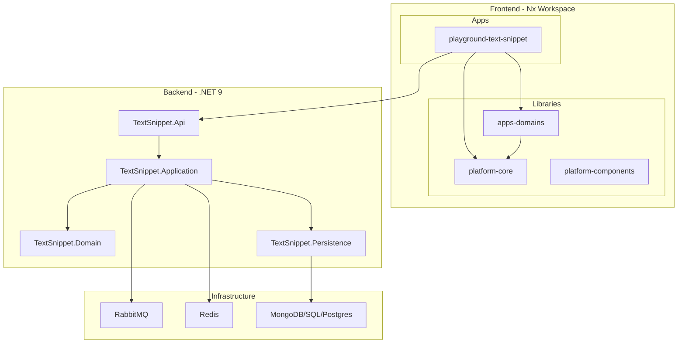

# Architecture Overview

> System architecture and project structure for Easy.Platform.

## Quick Links

- [README.md](../README.md) - Platform overview & quick start
- [CLAUDE.md](../CLAUDE.md) - Code patterns & AI agent instructions
- [Getting Started](./getting-started.md) - Prerequisites and setup

## Core Principles

- **Domain-Driven Design**: Rich domain models with business logic
- **CQRS**: Command Query Responsibility Segregation
- **Event-Driven Architecture**: Domain events and cross-service messaging
- **Multi-Database Support**: MongoDB, SQL Server, PostgreSQL
- **Microservices Ready**: Modular design for distributed systems

## System Architecture



## Technology Stack

| Layer         | Technologies                                  |
| ------------- | --------------------------------------------- |
| **Backend**   | .NET 9, ASP.NET Core, CQRS                    |
| **Frontend**  | Angular 19, TypeScript, RxJS, PlatformVmStore |
| **Data**      | MongoDB, SQL Server, PostgreSQL               |
| **Messaging** | RabbitMQ                                      |
| **Caching**   | Redis                                         |
| **Jobs**      | Hangfire                                      |

## Project Structure

### Backend

```
src/Platform/                    # Easy.Platform framework
├── Easy.Platform/               # Core (CQRS, validation, repositories)
├── Easy.Platform.AspNetCore/    # ASP.NET Core integration
├── Easy.Platform.MongoDB/       # MongoDB patterns
├── Easy.Platform.RabbitMQ/      # Message bus
└── Easy.Platform.*/             # Other modules

src/Backend/          # Example microservice
├── *.Api/                       # Web API layer
├── *.Application/               # CQRS handlers, jobs, events
├── *.Domain/                    # Entities, domain events
├── *.Infrastructure/            # External concerns (storage, external APIs)
├── *.Persistence*/              # Database implementations
└── *.Shared/                    # Cross-service utilities
```

### Frontend

```
src/Frontend/       # Angular 19 Nx workspace
├── apps/
│   └── playground-text-snippet/ # Example app
└── libs/
    ├── platform-core/           # Base classes, utilities
    ├── platform-components/     # Reusable UI components
    ├── apps-domains/            # Business domain code
    ├── apps-domains-components/ # Domain-specific components
    └── apps-shared-components/  # Shared app components
```

## Clean Architecture Layers

| Layer              | Responsibility                                         |
| ------------------ | ------------------------------------------------------ |
| **Domain**         | Business entities, value objects, domain services      |
| **Application**    | Use cases, CQRS handlers, application services         |
| **Infrastructure** | External concerns (databases, messaging, file storage) |
| **Presentation**   | API controllers, web endpoints                         |

## Related Documentation

- [Backend Quickref](./backend-quickref.md) - Backend pattern summary
- [Frontend Quickref](./frontend-quickref.md) - Frontend pattern summary
- [CLAUDE.md](../CLAUDE.md) - Complete code patterns
