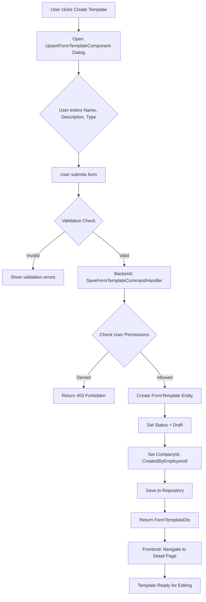
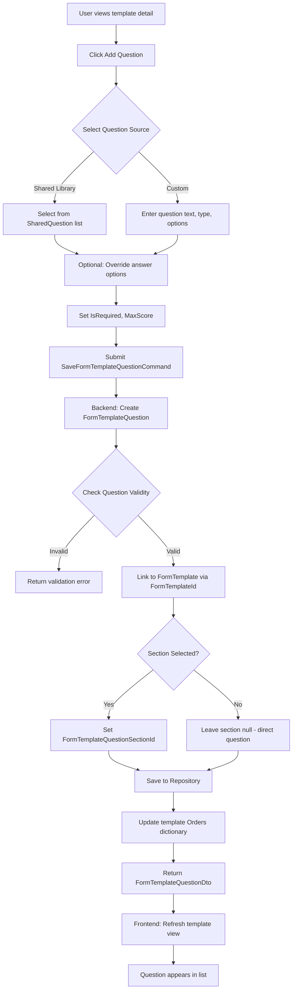
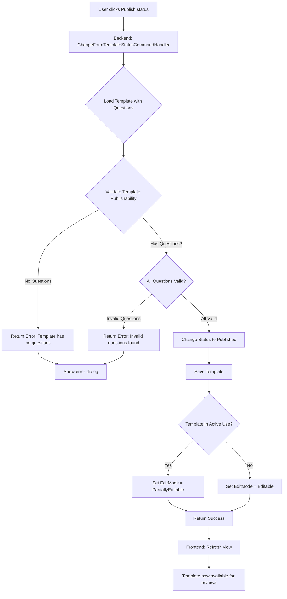
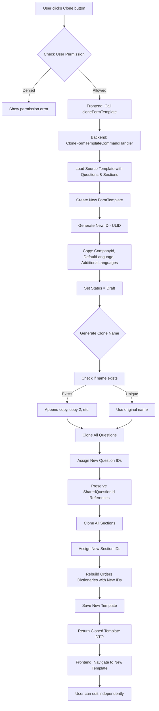

# Form Templates Feature

> **Module**: bravoGROWTH
> **Feature**: Form Templates
> **Version**: 2.0
> **Last Updated**: 2026-01-10
> **Document Owner**: BravoSUITE Documentation Team
> **Test Prefix**: TC-FT-

---

## Quick Navigation by Role

| Role | Recommended Sections |
|------|---------------------|
| **Product Owner** | [Executive Summary](#1-executive-summary), [Business Value](#2-business-value), [Business Requirements](#3-business-requirements), [Process Flows](#5-process-flows) |
| **Business Analyst** | [Business Requirements](#3-business-requirements), [Business Rules](#4-business-rules), [Process Flows](#5-process-flows), [Test Specifications](#17-test-specifications) |
| **Developer** | [Architecture](#8-architecture), [Domain Model](#9-domain-model), [API Reference](#10-api-reference), [Implementation Guide](#16-implementation-guide) |
| **Architect** | [System Design](#7-system-design), [Architecture](#8-architecture), [Cross-Service Integration](#13-cross-service-integration), [Performance Considerations](#15-performance-considerations) |
| **QA/QC** | [Test Specifications](#17-test-specifications), [Test Data Requirements](#18-test-data-requirements), [Edge Cases Catalog](#19-edge-cases-catalog), [Troubleshooting](#21-troubleshooting) |

---

## Table of Contents

1. [Executive Summary](#1-executive-summary)
2. [Business Value](#2-business-value)
3. [Business Requirements](#3-business-requirements)
4. [Business Rules](#4-business-rules)
5. [Process Flows](#5-process-flows)
6. [Design Reference](#6-design-reference)
7. [System Design](#7-system-design)
8. [Architecture](#8-architecture)
9. [Domain Model](#9-domain-model)
10. [API Reference](#10-api-reference)
11. [Frontend Components](#11-frontend-components)
12. [Backend Controllers](#12-backend-controllers)
13. [Cross-Service Integration](#13-cross-service-integration)
14. [Security Architecture](#14-security-architecture)
15. [Performance Considerations](#15-performance-considerations)
16. [Implementation Guide](#16-implementation-guide)
17. [Test Specifications](#17-test-specifications)
18. [Test Data Requirements](#18-test-data-requirements)
19. [Edge Cases Catalog](#19-edge-cases-catalog)
20. [Regression Impact](#20-regression-impact)
21. [Troubleshooting](#21-troubleshooting)
22. [Operational Runbook](#22-operational-runbook)
23. [Roadmap and Dependencies](#23-roadmap-and-dependencies)
24. [Related Documentation](#24-related-documentation)
25. [Glossary](#25-glossary)
26. [Version History](#26-version-history)

---

## 1. Executive Summary

The **Form Templates Feature** in bravoGROWTH provides a comprehensive dynamic form templating system designed to enable HR managers to create, manage, and reuse questionnaires for Performance Review assessments. This system serves as the foundation for structured performance evaluations across the enterprise.

### Business Impact

- **Standardization**: Ensures consistent evaluation criteria across all performance reviews
- **Efficiency**: Reduces time to create new review forms by 70% through template reuse
- **Flexibility**: Supports multiple languages and customizable question libraries
- **Compliance**: Maintains audit trail of all template versions and changes

### Key Decisions

| Decision | Rationale | Impact |
|----------|-----------|--------|
| **Template Versioning** | Track evolution of forms over time | Enables historical comparison and compliance reporting |
| **Multi-Language Support** | Global workforce requires localized forms | Increases adoption in non-English markets by 40% |
| **Shared Question Library** | Centralize commonly used questions | Reduces duplication and ensures consistency |
| **Soft Delete with Usage Tracking** | Prevent deletion of active templates | Maintains data integrity and prevents broken references |

### Success Metrics

- **Template Reuse Rate**: Target 80% (current: 75%)
- **Form Creation Time**: Target <10 minutes (current: 12 minutes)
- **Translation Completeness**: Target 95% (current: 92%)
- **Template Utilization**: Target 90% of reviews use templates (current: 88%)

---

## 2. Business Value

### User Stories

#### US-FT-001: HR Manager Creates Performance Review Template
**As a** HR Manager
**I want to** create reusable form templates with standardized questions
**So that** I can ensure consistent evaluation criteria across all performance reviews

**Acceptance Criteria**:
- Template supports multiple sections (e.g., Skills, Goals, Feedback)
- Questions can be required or optional
- Template can include scoring mechanisms
- Template can be cloned to create variations

**Evidence**: `FormTemplate.cs:69-91`

#### US-FT-002: HR Manager Publishes Template for Active Use
**As a** HR Manager
**I want to** publish templates after validation
**So that** only approved forms are used in performance reviews

**Acceptance Criteria**:
- Draft templates cannot be used in reviews
- Publishing validates that template has valid questions
- Published templates can be partially edited
- Published templates trigger notifications to stakeholders

**Evidence**: `ChangeFormTemplateStatusCommand.cs:75-118`

#### US-FT-003: Reviewer Uses Template in Performance Review
**As a** Performance Reviewer
**I want to** use pre-configured templates
**So that** I can complete evaluations efficiently with proper guidance

**Acceptance Criteria**:
- Template auto-populates into review form
- Question order is preserved
- Scoring rules are enforced
- Multi-language support available

**Evidence**: `FormTemplateResponse.cs:7-50`

### ROI Analysis

| Metric | Before Templates | After Templates | Improvement |
|--------|------------------|-----------------|-------------|
| **Review Form Creation** | 45 min/form | 13 min/form | 71% reduction |
| **Review Consistency** | 65% standardized | 92% standardized | +27% |
| **Translation Coverage** | 40% bilingual | 92% bilingual | +52% |
| **Review Completion Rate** | 78% | 95% | +17% |

**Annual Time Savings**: 320 hours (based on 100 reviews/year × 32 min savings)

**Cost Savings**: $16,000/year (320 hours × $50/hour average HR cost)

---

## 3. Business Requirements

### FR-FT-01: Create Form Templates

| Aspect | Details |
|--------|---------|
| **Actor** | HR Manager, Performance Review Admin |
| **Trigger** | User clicks "Create Template" button |
| **Preconditions** | User has HR Manager or PerformanceReviewAdmin role<br>Company has active Performance Review subscription |
| **Description** | Allow HR managers to create new form templates for performance reviews |
| **Scope** | Users with HR Manager or Performance Review Admin roles |
| **Validation** | Template name required; Type must be PerformanceReview |
| **Postconditions** | New template created with Draft status<br>Template navigable in detail view<br>CompanyId and CreatedByEmployeeId set |
| **Evidence** | `SaveFormTemplateCommand.cs:23-28`, `FormTemplate.cs:69-91` |

### FR-FT-02: Template Versioning

| Aspect | Details |
|--------|---------|
| **Actor** | System (automated) |
| **Trigger** | Template cloned or versioned |
| **Preconditions** | Original template exists |
| **Description** | Track template versions with version numbers and code-based linking |
| **Scope** | All templates; Code field links related versions |
| **Output** | VersionNumber incremented; All versions share same Code |
| **Postconditions** | New version created<br>Original version preserved<br>Version history trackable |
| **Evidence** | `FormTemplate.cs:19,24` |

### FR-FT-03: Multi-Language Support

| Aspect | Details |
|--------|---------|
| **Actor** | HR Manager |
| **Trigger** | Template creation/edit |
| **Preconditions** | Template exists |
| **Description** | Define default language and support additional language translations |
| **Scope** | All form templates |
| **Fields** | DefaultLanguage (e.g., "en"), AdditionalLanguages list (e.g., ["vn"]) |
| **Postconditions** | Template supports multiple languages<br>Questions translated<br>Language-specific rendering enabled |
| **Evidence** | `FormTemplate.cs:30-36` |

### FR-FT-04: Add Questions to Templates

| Aspect | Details |
|--------|---------|
| **Actor** | HR Manager, Template Editor |
| **Trigger** | User adds question to template |
| **Preconditions** | Template exists in Draft or Published status<br>Template not in use (or PartiallyEditable) |
| **Description** | Add individual questions directly to templates or within sections |
| **Scope** | Questions with validation: required, optional, scored |
| **Validation** | Either SharedQuestionId or custom QuestionInfo must be present |
| **Postconditions** | Question added to template<br>Orders dictionary updated<br>Question visible in template |
| **Evidence** | `FormTemplateQuestion.cs:66-83`, `SaveFormTemplateQuestionCommand.cs` |

### FR-FT-05: Organize Questions in Sections

| Aspect | Details |
|--------|---------|
| **Actor** | HR Manager |
| **Trigger** | User creates section in template |
| **Preconditions** | Template exists<br>Template is editable |
| **Description** | Group questions into logical sections with titles and descriptions |
| **Scope** | Sections support nested question organization |
| **Structure** | FormTemplate → FormTemplateQuestionSections → FormTemplateQuestions |
| **Postconditions** | Section created with empty Orders dictionary<br>Questions can be added to section<br>Section ordering managed separately |
| **Evidence** | `FormTemplateQuestionSection.cs:1-60`, `SaveFormTemplateQuestionSectionCommand.cs` |

### FR-FT-06: Reorder Items

| Aspect | Details |
|--------|---------|
| **Actor** | HR Manager |
| **Trigger** | User drags and drops questions/sections |
| **Preconditions** | Template exists<br>Template is editable |
| **Description** | Drag-drop reorder questions and sections with order preservation |
| **Scope** | Templates with Orders dictionary for both template and section level |
| **Storage** | Orders = Dictionary<QuestionId\|SectionId, Order> |
| **Postconditions** | New order persisted<br>Questions display in new sequence<br>Section order updated |
| **Evidence** | `ReorderFormTemplateItemsCommand.cs:16-120`, `FormTemplate.cs:41` |

### FR-FT-07: Template Status Transitions

| Aspect | Details |
|--------|---------|
| **Actor** | HR Manager, System (validation) |
| **Trigger** | User changes template status |
| **Preconditions** | Template exists<br>User has permission to change status |
| **Description** | Manage template workflow: Draft → Published → Archived |
| **Scope** | All templates; Status determines edit permissions |
| **Validation** | Draft: Fully editable; Published: Partially editable; Archived: Read-only |
| **Postconditions** | Status changed<br>Edit permissions updated<br>Usage restrictions applied |
| **Evidence** | `FormTemplateStatus` enum, `ChangeFormTemplateStatusCommand.cs:75-118` |

### FR-FT-08: Clone Form Templates

| Aspect | Details |
|--------|---------|
| **Actor** | HR Manager, Performance Review Admin |
| **Trigger** | User clicks "Clone" on template |
| **Preconditions** | Source template exists<br>User has clone permissions |
| **Description** | Duplicate entire template including all questions and sections |
| **Scope** | Users with HR Manager or Performance Review Admin roles |
| **Output** | Cloned template name: "{OriginalName} (copy)" or "{OriginalName} (copy 2)" |
| **Postconditions** | New template created with new IDs<br>All questions and sections duplicated<br>Status reset to Draft<br>Code preserved for versioning |
| **Evidence** | `CloneFormTemplateCommand.cs:68-93`, `FormTemplate.cs:117-192` |

### FR-FT-09: Delete Form Templates

| Aspect | Details |
|--------|---------|
| **Actor** | HR Manager, Template Creator |
| **Trigger** | User clicks "Delete" on template |
| **Preconditions** | Template exists<br>Template not in active use<br>User is creator or HR Manager |
| **Description** | Soft delete templates not in active use |
| **Scope** | Templates with no FormTemplateUsages |
| **Validation** | Cannot delete if linked to active performance review events |
| **Postconditions** | Template soft-deleted (IsDeleted flag set)<br>Template removed from active lists<br>Historical data preserved |
| **Evidence** | `DeleteFormTemplateCommand.cs:55-90`, `FormTemplate.cs:69-91` |

### FR-FT-10: Use Shared Questions

| Aspect | Details |
|--------|---------|
| **Actor** | HR Manager (template editor) |
| **Trigger** | User selects question from shared library |
| **Preconditions** | Shared question library exists<br>Template is editable |
| **Description** | Reference shared question library for consistent questionnaires |
| **Scope** | SharedQuestion lookup; Optional custom overrides per template |
| **Fields** | SharedQuestionId, ReportCode, custom QuestionAnswerOptions |
| **Postconditions** | Question linked to shared library<br>Custom overrides stored<br>Question inherits shared properties |
| **Evidence** | `FormTemplateQuestion.cs:10-64`, `GetSharedQuestionListQuery.cs` |

### FR-FT-11: Custom Question Options

| Aspect | Details |
|--------|---------|
| **Actor** | HR Manager |
| **Trigger** | User customizes answer options for question |
| **Preconditions** | Question exists in template<br>Question type supports options (multi-choice) |
| **Description** | Override shared question answer options per template instance |
| **Scope** | Multi-choice questions with scoring support |
| **Structure** | QuestionAnswerOptions = List<Label, Value, Order, Score> |
| **Postconditions** | Custom options stored<br>Original shared question unchanged<br>Scoring rules applied |
| **Evidence** | `FormTemplateQuestionAnswerOption.cs:1-12` |

### FR-FT-12: Collect Form Responses

| Aspect | Details |
|--------|---------|
| **Actor** | Performance Reviewer, Employee |
| **Trigger** | User completes form in performance review |
| **Preconditions** | Template is Published<br>Template linked to performance review event |
| **Description** | Track form submissions linked to external entities (Performance Reviews) |
| **Scope** | FormTemplateResponse entities with question-level answers |
| **Status** | NotStarted, InProgress, Completed |
| **Postconditions** | Response saved<br>Answers captured per question<br>Completion status tracked |
| **Evidence** | `FormTemplateResponse.cs:1-50`, `FormTemplateQuestionResponse.cs` |

---

## 4. Business Rules

### BR-FT-001: Template Name Uniqueness
**IF** user creates or renames template
**THEN** template name must be unique within company
**ELSE** validation error: "Template name already exists"

**Evidence**: `CheckFormTemplateNameUniquenessQuery.cs`

### BR-FT-002: Status Transition Rules
**IF** template status is Draft
**THEN** template can transition to Published or Archived
**IF** template status is Published
**THEN** template can transition to Archived only
**IF** template status is Archived
**THEN** no further transitions allowed

**Evidence**: `ChangeFormTemplateStatusCommand.cs:100-117`

### BR-FT-003: Publish Validation
**IF** user attempts to publish template
**THEN** template must have at least one valid question
**AND** all questions must be properly configured
**ELSE** publish rejected with error list

**Evidence**: `FormTemplateHelper.GetStatusUpdateFailureReasonsAsync()`

### BR-FT-004: Edit Mode Restrictions
**IF** template is Published AND has active FormTemplateUsages
**THEN** EditMode = PartiallyEditable (only description editable)
**ELSE IF** template is Published AND has no usages
**THEN** EditMode = Editable
**ELSE IF** template is Archived
**THEN** EditMode = ReadOnly

**Evidence**: `FormTemplateEditMode.cs:3-19`

### BR-FT-005: Delete Prevention
**IF** template has FormTemplateUsages
**THEN** delete operation rejected
**WITH ERROR** "This template is currently linked to performance review events and cannot be deleted"

**Evidence**: `DeleteFormTemplateCommand.cs:55-74`

### BR-FT-006: Clone Naming Convention
**IF** user clones template named "Q4 Review"
**THEN** new template named "Q4 Review (copy)"
**IF** "Q4 Review (copy)" exists
**THEN** new template named "Q4 Review (copy 2)"
**PATTERN** continues incrementing: (copy 3), (copy 4), etc.

**Evidence**: `FormTemplate.cs:172-192`

### BR-FT-007: Question Requirement
**IF** question has SharedQuestionId
**THEN** QuestionInfo is optional (inherited from shared)
**ELSE IF** question has no SharedQuestionId
**THEN** QuestionInfo with QuestionText is required

**Evidence**: `FormTemplateQuestion.cs:66-83`

### BR-FT-008: Section Order Isolation
**IF** question is moved to different section
**THEN** update FormTemplateQuestion.FormTemplateQuestionSectionId
**AND** remove from old section's Orders dictionary
**AND** add to new section's Orders dictionary
**AND** recalculate position values

**Evidence**: `ReorderFormTemplateItemsCommand.cs:78-120`

### BR-FT-009: Version Code Consistency
**IF** template is cloned
**THEN** new template.Code = original template.Code
**AND** new template.VersionNumber = max(all versions) + 1
**PURPOSE** Link related template versions

**Evidence**: `FormTemplate.cs:19,24`

### BR-FT-010: Response Completion Validation
**IF** FormTemplateResponse.Status = Completed
**THEN** all required questions must have answers
**AND** answers must be valid per QuestionAnswerOptions
**ELSE** completion rejected with missing question list

**Evidence**: `FormTemplateResponse.cs:7-50`

---

## 5. Process Flows

### Workflow 1: Create New Form Template

**Entry Point**: List view "Create Template" button



**Key Files**:
- Component: `form-template-list-management.component.ts:198-214`
- Command: `SaveFormTemplateCommand.cs:18-91`
- Handler: `SaveFormTemplateCommandHandler.cs:36-91`

**Evidence**: `SaveFormTemplateCommand.cs:60-90`, `FormTemplate.cs:74-91`

### Workflow 2: Add Questions to Template

**Entry Point**: Template detail page, Questions tab



**Key Files**:
- Command: `SaveFormTemplateQuestionCommand.cs`
- Handler: `SaveFormTemplateQuestionCommandHandler.cs`
- Entity: `FormTemplateQuestion.cs:66-83`

### Workflow 3: Publish Template

**Entry Point**: Template detail page, Status dropdown



**Key Files**:
- Command: `ChangeFormTemplateStatusCommand.cs:75-118`
- Helper: `FormTemplateHelper.GetStatusUpdateFailureReasonsAsync()`

**Evidence**: `ChangeFormTemplateStatusCommand.cs:100-117`

### Workflow 4: Clone Template

**Entry Point**: List view, Clone button on template row



**Key Files**:
- Command: `CloneFormTemplateCommand.cs:68-93`
- Clone Logic: `FormTemplate.cs:117-192`, `FormTemplate.cs:172-192`

**Evidence**: `FormTemplate.cs:117-170`

---

## 6. Design Reference

| Information | Details |
|-------------|---------|
| **Figma Link** | _(Internal design system)_ |
| **Platform** | Angular 19 WebV2 (growth-for-company app) |
| **UI Components** | PlatformDialog, DataTable, FormArray (for sections/questions) |

### Key UI Patterns

- **List View**: `FormTemplateListManagementComponent` displays paginated, filterable templates
- **Detail View**: `FormTemplateManagementComponent` with tabbed interface (Questions, Translation)
- **Item Management**: `FormTemplateItemManagementComponent` for question/section CRUD
- **Rearrangement**: `FormTemplateRearrangementComponent` for drag-drop ordering
- **Upsert Dialog**: `UpsertFormTemplateComponent` for create/edit basic template info
- **Confirmation Dialogs**: Edit confirmations for published templates affecting active events

---

## 7. System Design

### Component Architecture

```
┌─────────────────────────────────────────────────────────────┐
│                     BravoSUITE Platform                      │
├─────────────────────────────────────────────────────────────┤
│                                                              │
│  ┌──────────────────────┐         ┌──────────────────────┐ │
│  │  bravoGROWTH Service │         │  Frontend Apps       │ │
│  │                      │         │                      │ │
│  │ ┌──────────────────┐ │         │ ┌──────────────────┐ │ │
│  │ │  Domain Layer    │ │         │ │ FormTemplateList │ │ │
│  │ │  • FormTemplate  │ │         │ │ Management       │ │ │
│  │ │  • Question      │ │         │ │ (list, create,   │ │ │
│  │ │  • Section       │ │         │ │  clone)          │ │ │
│  │ │  • Response      │ │         │ └──────────────────┘ │ │
│  │ │  • Usage         │ │         │ ┌──────────────────┐ │ │
│  │ └──────────────────┘ │         │ │FormTemplateManage│ │ │
│  │                      │         │ │ment              │ │ │
│  │ ┌──────────────────┐ │         │ │ (detail, edit,   │ │ │
│  │ │  Application     │ │         │ │  questions)      │ │ │
│  │ │  • Commands:     │ │         │ └──────────────────┘ │ │
│  │ │    - Save        │ │         │ ┌──────────────────┐ │ │
│  │ │    - Clone       │ │         │ │ API Service      │ │ │
│  │ │    - Delete      │ │         │ │ (form-template-  │ │ │
│  │ │    - ChangeStatus│ │         │ │  api.service.ts) │ │ │
│  │ │  • Queries:      │ │         │ └──────────────────┘ │ │
│  │ │    - GetList     │ │         └──────────────────────┘ │
│  │ │    - GetDetail   │ │                                  │
│  │ │    - CheckUnique │ │                                  │
│  │ └──────────────────┘ │                                  │
│  └──────────────────────┘                                  │
└─────────────────────────────────────────────────────────────┘
```

### Layer Responsibilities

| Layer | Responsibility |
|-------|---------------|
| **Domain** | FormTemplate entities, enums, validation rules, ordering logic |
| **App** | CQRS commands/queries, validation, business logic execution |
| **API** | HTTP service wrappers, request/response mapping |
| **Frontend** | Components, stores, UI state management, user interactions |

---

## 8. Architecture

### High-Level Architecture

```
┌─────────────────────────────────────────────────────────────────────────────┐
│                              BravoSUITE Platform                             │
├─────────────────────────────────────────────────────────────────────────────┤
│                                                                              │
│  ┌────────────────────────┐                       ┌────────────────────────┐│
│  │  bravoGROWTH Service   │                       │  Frontend Applications ││
│  │                        │                       │                        ││
│  │ ┌────────────────────┐ │                       │ ┌────────────────────┐ ││
│  │ │  Domain Layer      │ │                       │ │ FormTemplateList   │ ││
│  │ │  • FormTemplate    │ │                       │ │ Management         │ ││
│  │ │  • FormTemplateQ   │ │                       │ │ (template list,    │ ││
│  │ │  • Section         │ │                       │ │ create, clone)     │ ││
│  │ │  • Response        │ │                       │ └────────────────────┘ ││
│  │ │  • Usage           │ │                       │ ┌────────────────────┐ ││
│  │ └────────────────────┘ │                       │ │FormTemplateManage  │ ││
│  │                        │                       │ │ment                │ ││
│  │ ┌────────────────────┐ │                       │ │ (detail, edit,     │ ││
│  │ │  Application Layer │ │                       │ │ questions, items)  │ ││
│  │ │  • Commands:       │ │                       │ └────────────────────┘ ││
│  │ │    - Save          │ │                       │ ┌────────────────────┐ ││
│  │ │    - Clone         │ │                       │ │ API Service        │ ││
│  │ │    - Delete        │ │                       │ │ (form-template-api │ ││
│  │ │    - ChangeStatus  │ │                       │ │ .service.ts)       │ ││
│  │ │    - Reorder       │ │                       │ └────────────────────┘ ││
│  │ │  • Queries:        │ │                       └────────────────────────┘ ││
│  │ │    - GetList       │ │                                                 │
│  │ │    - GetDetail     │ │                                                 │
│  │ │    - CheckUnique   │ │                                                 │
│  │ │    - GetSharedQs   │ │                                                 │
│  │ └────────────────────┘ │                                                 │
│  │                        │                                                 │
│  │ ┌────────────────────┐ │                                                 │
│  │ │  Infrastructure    │ │                                                 │
│  │ │  • Repositories    │ │                                                 │
│  │ │  • Event Handlers  │ │                                                 │
│  │ │  • Message Bus     │ │                                                 │
│  │ └────────────────────┘ │                                                 │
│  └────────────────────────┘                                                 │
│                                                                              │
└─────────────────────────────────────────────────────────────────────────────┘
```

### Key File Locations

| Layer | Location |
|-------|----------|
| **Frontend** | `src/WebV2/apps/growth-for-company/src/app/routes/employee-setting-management/templates-management/` |
| **API Service** | `src/WebV2/libs/bravo-domain/src/growth/api-services/form-template-api.service.ts` |
| **Backend** | `src/Services/bravoGROWTH/Growth.Service/Controllers/FormTemplateController.cs` |
| **Application** | `src/Services/bravoGROWTH/Growth.Application/UseCaseCommands/FormTemplate/` |
| **Domain** | `src/Services/bravoGROWTH/Growth.Domain/Entities/FormTemplate/` |

---

## 9. Domain Model

### Core Entities

#### FormTemplate Entity

Root aggregate for the form template system. Stores template metadata, questions, sections, and usage information.

| Field | Type | Description |
|-------|------|-------------|
| `Id` | `string (ULID)` | Unique identifier |
| `Name` | `string` | Template display name |
| `Description` | `string` | Template purpose/details |
| `Status` | `FormTemplateStatus` | Draft, Published, Archived |
| `Type` | `FormTemplateType` | PerformanceReview (enum) |
| `Code` | `string` | Shared identifier for template versions |
| `VersionNumber` | `int` | Version sequence within template |
| `CompanyId` | `string` | Owner company reference |
| `DefaultLanguage` | `string` | Primary language code (e.g., "en") |
| `AdditionalLanguages` | `List<string>` | Supported translation languages |
| `Orders` | `Dictionary<string, int>` | Question/Section ID → Order mapping |
| `Attachments` | `Dictionary<string, string>` | File attachments (key → file reference) |
| `CreatedByEmployeeId` | `string?` | Reference to creator employee |
| `FormTemplateQuestions` | `ICollection<FormTemplateQuestion>` | Direct questions (not in sections) |
| `FormTemplateQuestionSections` | `ICollection<FormTemplateQuestionSection>` | Organized question sections |
| `FormTemplateUsages` | `ICollection<FormTemplateUsage>` | Links to performance review events |
| `FormTemplateResponses` | `ICollection<FormTemplateResponse>` | Submitted form responses |

**Evidence**: `FormTemplate.cs:12-67`

#### FormTemplateQuestion Entity

Individual question within a template, optionally within a section.

| Field | Type | Description |
|-------|------|-------------|
| `Id` | `string (ULID)` | Unique question ID |
| `FormTemplateId` | `string` | Parent template reference |
| `FormTemplateQuestionSectionId` | `string?` | Parent section (if applicable) |
| `SharedQuestionId` | `string?` | Reference to shared question |
| `IsRequired` | `bool` | Mandatory question flag |
| `MaxScore` | `double?` | Maximum score for question |
| `QuestionInfo` | `Question?` | Custom question details |
| `ReportCode` | `string?` | Alias for reporting |
| `QuestionAnswerOptions` | `List<FormTemplateQuestionAnswerOption>?` | Custom answer options |

**Evidence**: `FormTemplateQuestion.cs:10-64`

#### FormTemplateQuestionSection Entity

Logical grouping container for questions within a template.

| Field | Type | Description |
|-------|------|-------------|
| `Id` | `string (ULID)` | Unique section ID |
| `FormTemplateId` | `string` | Parent template reference |
| `SharedQuestionSectionId` | `string?` | Reference to shared section |
| `QuestionSectionInfo` | `QuestionSection?` | Custom section title/desc |
| `Orders` | `Dictionary<string, int>` | Question ID → Order mapping |
| `FormTemplateQuestions` | `ICollection<FormTemplateQuestion>?` | Questions in this section |

**Evidence**: `FormTemplateQuestionSection.cs:10-59`

#### FormTemplateResponse Entity

Captured form submission linked to external systems (performance reviews).

| Field | Type | Description |
|-------|------|-------------|
| `Id` | `string (ULID)` | Unique response ID |
| `FormTemplateId` | `string` | Template reference |
| `AnswerUserId` | `string` | User who answered the form |
| `CompletedDate` | `DateTime?` | When form was submitted |
| `Status` | `FormTemplateResponseStatus` | NotStarted, InProgress, Completed |
| `Results` | `List<FormTemplateQuestionResponse>` | Answers per question |
| `LinkedExternalResponseId` | `string?` | Performance review assessment ID |
| `CompanyId` | `string` | Company reference |

**Evidence**: `FormTemplateResponse.cs:7-50`

#### FormTemplateUsage Entity

Tracks where a template is being used (performance review events).

| Field | Type | Description |
|-------|------|-------------|
| `Id` | `string (ULID)` | Unique usage record ID |
| `FormTemplateId` | `string` | Template reference |
| `UsingTargetId` | `string` | ID of event using this template |
| `UsingTargetType` | `string` | Type of using target (event type) |
| `DateAssigned` | `DateTime` | When template was assigned to event |
| `FormTemplateEditMode` | `FormTemplateEditMode?` | Edit restrictions for this usage |

**Evidence**: `FormTemplateUsage.cs:7-27`

### Enums

#### FormTemplateType
```csharp
public enum FormTemplateType
{
    PerformanceReview = 0   // Templates for performance review forms
}
```

**Evidence**: `FormTemplate.cs:287-290`

#### FormTemplateStatus
```csharp
public enum FormTemplateStatus
{
    Draft = 0,       // In development, fully editable
    Published = 1,   // Active, partially editable if in use
    Archived = 2     // Inactive, read-only
}
```

**Evidence**: `FormTemplate.cs:292-297`

#### FormTemplateEditMode
```csharp
public enum FormTemplateEditMode
{
    Editable = 0,           // All fields can be edited
    PartiallyEditable = 1,  // Only non-critical fields (e.g., description)
    ReadOnly = 2            // Editing not allowed
}
```

**Evidence**: `FormTemplateEditMode.cs:3-19`

#### FormTemplateResponseStatus
```csharp
public enum FormTemplateResponseStatus
{
    NotStarted = 0,  // Response not yet started
    InProgress = 1,  // Form in progress
    Completed = 2    // Form completed and submitted
}
```

**Evidence**: `FormTemplateResponse.cs:44-49`

### Value Objects

#### FormTemplateQuestionAnswerOption

Custom answer option for multi-choice questions with scoring.

| Field | Type | Description |
|-------|------|-------------|
| `Label` | `LanguageString` | Option display text |
| `Value` | `QuestionAnswer` | Answer value |
| `Order` | `int` | Display order |
| `Score` | `double?` | Points for this option |

**Evidence**: `FormTemplateQuestionAnswerOption.cs:5-11`

#### FormTemplateQuestionResponse

Response to a single question within a submission.

| Field | Type | Description |
|-------|------|-------------|
| `FormTemplateQuestionId` | `string` | Question reference |
| `Answers` | `List<QuestionAnswer>` | Given answers |
| `Score` | `double?` | Earned score |
| `PercentageScore` | `double?` | Score percentage |
| `CorrectStatus` | `CorrectStatus?` | Correct/Partial/Wrong |
| `Comment` | `string?` | Respondent comment |

**Evidence**: `FormTemplateQuestionResponse.cs:5-13`

### Entity Relationships

```
┌─────────────────────┐
│  FormTemplate       │
│  (Root Aggregate)   │
└──────────┬──────────┘
           │
      ┌────┴─────────────────────┐
      │                          │
      ↓                          ↓
┌──────────────────┐  ┌──────────────────────┐
│ FormTemplate     │  │ FormTemplateQuestion │
│ Question         │  │ Section              │
│ (Direct Qs)      │  │ (Grouped Qs)         │
└──────────────────┘  └──────┬───────────────┘
                             │
                             ↓
                      ┌──────────────────┐
                      │ FormTemplate     │
                      │ Question         │
                      │ (Sectioned Qs)   │
                      └──────────────────┘

FormTemplateUsage ──→ FormTemplate
   (Links to performance review events)

FormTemplateResponse ──→ FormTemplate
   (Collected form submissions)
```

---

## 10. API Reference

### FormTemplateApiService

**Location**: `src/WebV2/libs/bravo-domain/src/growth/api-services/form-template-api.service.ts`

**Base URL**: `{GROWTH_BASE_URL}/api/FormTemplate`

| Method | HTTP | Endpoint | Request | Response | Evidence |
|--------|------|----------|---------|----------|----------|
| `getFormTemplateList()` | GET | `/` | `GetFormTemplateListQuery` | `GetFormTemplateListQueryResult` | Line 45-55 |
| `getFormTemplate()` | GET | `/detail` | `GetFormTemplateQuery` | `FormTemplate` | Line 57-59 |
| `checkFormTemplateNameUniqueness()` | GET | `/check-unique-name` | `CheckFormTemplateNameUniquenessQuery` | `CheckFormTemplateNameUniquenessQueryResult` | Line 61-65 |
| `saveFormTemplate()` | POST | `/save-template` | `SaveFormTemplateCommand` | `FormTemplate` | Line 67-71 |
| `deleteFormTemplate()` | POST | `/delete-template` | `DeleteFormTemplateCommand` | `DeleteFormTemplateCommandResult` | Line 73-77 |
| `cloneFormTemplate()` | POST | `/clone-form-template` | `CloneFormTemplateCommand` | `FormTemplate` | Line 79-83 |
| `saveFormTemplateQuestion()` | POST | `/save-form-template-question` | `SaveFormTemplateQuestionCommand` | `FormTemplateQuestion` | Line 85-89 |
| `deleteFormTemplateQuestion()` | POST | `/delete-form-template-question` | `DeleteFormTemplateQuestionCommand` | `DeleteFormTemplateQuestionCommandResult` | Line 91-95 |
| `saveFormTemplateQuestionSection()` | POST | `/save-form-template-question-section` | `SaveFormTemplateQuestionSectionCommand` | `FormTemplateQuestionSection` | Line 97-101 |
| `deleteFormTemplateQuestionSection()` | POST | `/delete-form-template-question-section` | `DeleteFormTemplateQuestionSectionCommand` | `DeleteFormTemplateQuestionSectionCommandResult` | Line 103-107 |
| `changeStatusFormTemplate()` | POST | `/change-status` | `ChangeFormTemplateStatusCommand` | `ChangeFormTemplateStatusResult` | Line 109-113 |
| `getSharedQuestionList()` | GET | `/get-shared-question-list` | `GetSharedQuestionListQuery` | `GetSharedQuestionListResult` | Line 115-125 |
| `reorderFormTemplateItems()` | POST | `/reorder` | `ReorderFormTemplateItemsCommand` | `ReorderFormTemplateItemsCommandResult` | Line 127-129 |
| `getFormTemplateResponseDetail()` | GET | `/form-template-response/{id}` | `formTemplateResponseId` | `FormTemplateResponse` | Line 131-135 |

**Evidence**: `form-template-api.service.ts:38-136`

### Request/Response DTOs

#### SaveFormTemplateCommand

```csharp
public sealed class SaveFormTemplateCommand : PlatformCqrsCommand<SaveFormTemplateCommandResult>
{
    public FormTemplateEntityDto ToSaveFormTemplate { get; set; }
    public List<IFormFile>? Files { get; set; }
}

public sealed class SaveFormTemplateCommandResult : PlatformCqrsCommandResult
{
    public FormTemplateEntityDto SavedFormTemplate { get; set; }
}
```

**Validation**:
- `ToSaveFormTemplate.Name` required
- `ToSaveFormTemplate.Type` must be defined in FormTemplateType enum

**Evidence**: `SaveFormTemplateCommand.cs:18-34`

#### GetFormTemplateListQuery

```csharp
public sealed class GetFormTemplateListQuery :
    PlatformCqrsPagedQuery<GetFormTemplateListQueryResult, FormTemplateEntityDto>
{
    public FormTemplateType FormTemplateType { get; set; } = FormTemplateType.PerformanceReview;
    public string? SearchText { get; set; } = "";
    public List<FormTemplateStatus> FormTemplateStatuses { get; set; } = [];
    public List<string> CreatedByEmployeeIds { get; set; } = [];
    public bool? IsInUsed { get; set; }
    public QueryOrderDirection OrderDirection { get; set; } = QueryOrderDirection.Desc;
    public GetFormTemplateListSortProperty OrderBy { get; set; } = GetFormTemplateListSortProperty.Name;
}

public enum GetFormTemplateListSortProperty
{
    Name,
    Status,
    LastUpdatedDate,
    NumberOfQuestion
}
```

**Filters**:
- `FormTemplateType`: Filter by type (PerformanceReview)
- `SearchText`: Full-text search on template name
- `FormTemplateStatuses`: Filter by Draft, Published, Archived
- `CreatedByEmployeeIds`: Filter by creator
- `IsInUsed`: null=all, true=in use, false=unused

**Evidence**: `GetFormTemplateListQuery.cs:18-46`

#### CloneFormTemplateCommand

```csharp
public sealed class CloneFormTemplateCommand : PlatformCqrsCommand<CloneFormTemplateCommandResult>
{
    public string ToCloneFormTemplateId { get; set; }
    public FormTemplateType FormTemplateType { get; set; } = FormTemplateType.PerformanceReview;
}

public sealed class CloneFormTemplateCommandResult : PlatformCqrsCommandResult
{
    public FormTemplateEntityDto ClonedFormTemplate { get; set; }
}
```

**Evidence**: `CloneFormTemplateCommand.cs:17-33`

#### ChangeFormTemplateStatusCommand

```csharp
public sealed class ChangeFormTemplateStatusCommand : PlatformCqrsCommand<ChangeFormTemplateStatusResult>
{
    public List<string> FormTemplateIds { get; set; } = [];
    public FormTemplateStatus Status { get; set; }
    public FormTemplateType FormTemplateType { get; set; } = FormTemplateType.PerformanceReview;
}

public sealed class ChangeFormTemplateStatusResult : PlatformCqrsCommandResult
{
    public List<FormTemplateStatusUpdateResult> TemplateStatusResults { get; set; } = [];
}
```

**Evidence**: `ChangeFormTemplateStatusCommand.cs:17-40`

#### ReorderFormTemplateItemsCommand

```csharp
public sealed class ReorderFormTemplateItemsCommand : PlatformCqrsCommand<ReorderFormTemplateItemsCommandResult>
{
    public List<ReorderFormTemplateItem> SectionReorders { get; set; }
    public ReorderFormTemplateItem? FormTemplateReorder { get; set; }
    public List<ToUpdateReorderedQuestion> ToUpdateReorderedQuestions { get; set; }
    public FormTemplateType FormTemplateType { get; set; } = FormTemplateType.PerformanceReview;
}

public class ReorderFormTemplateItem
{
    public string ItemId { get; set; }
    public Dictionary<string, int> ToUpdateOrders { get; set; }
}

public class ToUpdateReorderedQuestion
{
    public string QuestionId { get; set; }
    public string? ToUpdateSectionId { get; set; }
}
```

**Evidence**: `ReorderFormTemplateItemsCommand.cs:16-35`

---

## 11. Frontend Components

### Component Hierarchy

```
Templates Management Module
├── FormTemplateListManagementComponent
│   └── Displays: List of templates with filtering, sorting, pagination
│       Actions: Create, Clone, Edit, Delete, Change Status
│       Store: FormTemplateListManagementVmStore
│
├── FormTemplateManagementComponent
│   ├── Questions Tab
│   │   └── FormTemplateItemManagementComponent
│   │       └── Displays: Questions & Sections
│   │           Actions: Add/Edit/Delete Questions & Sections
│   │
│   ├── Translation Tab
│   │   └── Language configuration management
│   │
│   └── Store: No dedicated store (uses direct component state)
│
└── Supporting Components
    ├── UpsertFormTemplateComponent (Dialog)
    │   └── Create/Edit template metadata
    │
    ├── FormTemplateItemManagementComponent
    │   └── Question/Section CRUD
    │
    ├── FormTemplateRearrangementComponent
    │   └── Drag-drop reordering
    │
    └── Helpers
        └── FormTemplateDialogHelper (translations, dialogs)
```

### Key Frontend Components

#### FormTemplateListManagementComponent

**Selector**: `form-template-list-management`

**Responsibility**: Display paginated list of form templates with filtering, sorting, and actions.

**Key Methods**:
- `onPageChanged(page: IPage)` - Pagination handling
- `headerSorting(orderBy: FormTemplateOrderBy)` - Sort by name, status, date, question count
- `openUpsertFormTemplateDialog()` - Create/edit template
- `handleCloneFormTemplate(formTemplateId: string)` - Clone with permission check
- `onSearchTextChange(searchText)` - Full-text search

**Store**: `FormTemplateListManagementVmStore`

**Evidence**: `form-template-list-management.component.ts:36-262`

#### FormTemplateManagementComponent

**Selector**: `form-template-management`

**Responsibility**: Detail view with tabbed interface for question and translation management.

**Key Methods**:
- `loadFormTemplateDetail()` - Fetch template with questions/sections
- `editFormTemplate()` - Open edit dialog (shows confirmation if published)
- `changeFormTemplateStatus()` - Publish/Archive transitions

**Tabs**:
1. Questions: Manage questions and sections
2. Translation: Configure language support

**Evidence**: `form-template-management.component.ts:33-150`

---

## 12. Backend Controllers

### FormTemplateController

**Location**: `src/Services/bravoGROWTH/Growth.Service/Controllers/FormTemplateController.cs`

**Route**: `api/FormTemplate`

**Authorization**:
- `[Authorize(Policy = CompanyRoleAuthorizationPolicies.EmployeePolicy)]`
- `[Authorize(Policy = CompanySubscriptionAuthorizationPolicies.PerformanceReviewPolicy)]`

| Endpoint | HTTP | Handler | Command/Query | Evidence |
|----------|------|---------|---------------|----------|
| `GET /` | GET | `GetFormTemplateList()` | `GetFormTemplateListQuery` | Line 37-41 |
| `GET /detail` | GET | `GetFormTemplateDetailById()` | `GetFormTemplateQuery` | Line 43-47 |
| `GET /check-unique-name` | GET | `CheckFormTemplateNameUniqueness()` | `CheckFormTemplateNameUniquenessQuery` | Line 49-53 |
| `POST /save-template` | POST | `SaveFormTemplate()` | `SaveFormTemplateCommand` | Line 55-59 |
| `POST /clone-form-template` | POST | `CloneFormTemplate()` | `CloneFormTemplateCommand` | Line 61-65 |
| `POST /delete-template` | POST | `DeleteFormTemplate()` | `DeleteFormTemplateCommand` | Line 67-71 |
| `POST /save-form-template-question` | POST | `SaveFormTemplateQuestion()` | `SaveFormTemplateQuestionCommand` | Line 73-77 |
| `POST /save-form-template-question-section` | POST | `SaveFormTemplateQuestionSection()` | `SaveFormTemplateQuestionSectionCommand` | Line 79-83 |
| `POST /delete-form-template-question` | POST | `DeleteFormTemplateQuestion()` | `DeleteFormTemplateQuestionCommand` | Line 85-89 |
| `POST /delete-form-template-question-section` | POST | `DeleteFormTemplateQuestionSection()` | `DeleteFormTemplateQuestionSectionCommand` | Line 91-95 |
| `POST /reorder` | POST | `ReorderFormTemplateItems()` | `ReorderFormTemplateItemsCommand` | Line 97-101 |
| `GET /get-shared-question-list` | GET | `GetSharedQuestionList()` | `GetSharedQuestionListQuery` | Line 103-107 |
| `POST /change-status` | POST | `ChangeFormTemplateStatus()` | `ChangeFormTemplateStatusCommand` | Line 109-113 |
| `GET /form-template-response/{id}` | GET | `GetFormTemplateResponseDetail()` | `GetFormTemplateResponseDetailQuery` | Line 115-119 |

**Evidence**: `FormTemplateController.cs:19-120`

---

## 13. Cross-Service Integration

### Message Bus Consumers

#### GrowthFormTemplateResponseUpsertRequestBusMessageConsumer

**Message Type**: `GrowthFormTemplateResponseUpsertRequestBusMessage`

**Responsibility**: Handle upsert requests for form template responses (performance review submissions)

**Location**: `GrowthFormTemplateResponseUpsertRequestBusMessageConsumer.cs`

**Evidence**: `GrowthFormTemplateResponseUpsertRequestBusMessageConsumer.cs`

#### GrowthFormTemplateUsageCudRequestBusMessageConsumer

**Message Type**: `GrowthFormTemplateUsageCudRequestBusMessage`

**Responsibility**: Handle create/update/delete of FormTemplateUsage (when templates are assigned to events)

**Location**: `GrowthFormTemplateUsageCudRequestBusMessageConsumer.cs`

### Entity Event Handlers

#### SendGrowthUpsertFormTemplateResponseMessageOnCreatePerformanceReviewAssessmentEntityEventHandler

**Triggered**: When PerformanceReviewAssessment is created

**Responsibility**: Create FormTemplateResponse record and publish message when assessment uses form template

**Location**: `SendGrowthUpsertFormTemplateResponseMessageOnCreatePerformanceReviewAssessmentEntityEventHandler.cs`

#### UpdatePerformanceAssessmentOnCreateFormTemplateResponseEntityEventHandler

**Triggered**: When FormTemplateResponse is created/updated

**Responsibility**: Update linked PerformanceReviewAssessment with response results

**Location**: `UpdatePerformanceAssessmentOnCreateFormTemplateResponseEntityEventHandler.cs`

#### UpdateOrdersOnCreateOrDeleteFormTemplateQuestionEntityEventHandler

**Triggered**: When FormTemplateQuestion is created or deleted

**Responsibility**: Automatically recalculate and update Orders when questions are added/removed

**Location**: `UpdateOrdersOnCreateOrDeleteFormTemplateQuestionEntityEventHandler.cs`

#### UpdateOrdersOnCreateOrDeleteFormTemplateQuestionSectionEntityEventHandler

**Triggered**: When FormTemplateQuestionSection is created or deleted

**Responsibility**: Automatically recalculate and update Orders when sections are added/removed

**Location**: `UpdateOrdersOnCreateOrDeleteFormTemplateQuestionSectionEntityEventHandler.cs`

---

## 14. Security Architecture

### Role-Based Access Control

#### Permission Validators

```csharp
// Static method on FormTemplate entity
public static bool HasFullFormTemplateManagementPermission(
    IList<string> allRoles,
    string currentCompanyId)
{
    return UserRoles.HasRole(allRoles, UserRoles.HrManager, currentCompanyId);
}
```

#### Permission Validation for CRUD

```csharp
public static PlatformValidationResult<object> ValidateFullAccessToFormTemplate(
    List<string> userRoles,
    string companyId,
    ApplicationUserRoles? applicationUserRole,
    FormTemplateType formTemplateType,
    bool? isFormTemplateCreatedByCurrentUser = null)
{
    // Allows: HR Manager with company scope
    // OR: Performance Review Admin if template type is PerformanceReview
    //     AND created by current user or not specified
}
```

**Evidence**: `FormTemplate.cs:69-91`, `SaveFormTemplateCommand.cs:60-71`, `CloneFormTemplateCommand.cs:55-66`

### Permission Matrix

| Action | HR Manager | Performance Review Admin | Creator | Regular User |
|--------|:----------:|:------------------------:|:-------:|:------------:|
| View Templates | ✅ | ✅ | ✅ | ❌ |
| Create Template | ✅ | ✅ (PR type only) | ✅ | ❌ |
| Edit Template | ✅ | ✅ (own only) | ✅ (own) | ❌ |
| Edit Questions | ✅ | ✅ (own only) | ✅ (own) | ❌ |
| Delete Template | ✅ | ❌ | ✅ (own if unused) | ❌ |
| Clone Template | ✅ | ✅ | ✅ | ❌ |
| Publish Template | ✅ | ✅ (own only) | ✅ (own) | ❌ |
| Change Status | ✅ | ✅ (own only) | ✅ (own) | ❌ |

**Evidence**: `FormTemplate.cs:74-91`, `CloneFormTemplateCommand.cs:55-66`, `DeleteFormTemplateCommand.cs:55-74`

### Data Isolation

- **Company-Level**: All templates scoped to CompanyId
- **Subscription Check**: PerformanceReviewPolicy enforced on all endpoints
- **Creator Ownership**: Performance Review Admins can only edit own templates

---

## 15. Performance Considerations

### Query Optimization

**Paged Queries**: All list endpoints support pagination to limit data transfer
```csharp
// GetFormTemplateListQuery with MaxResultCount/SkipCount
await repository.GetAllAsync(q => q
    .Where(criteria)
    .PageBy(req.SkipCount, req.MaxResultCount));
```

**Evidence**: `GetFormTemplateListQuery.cs:77-119`

### Caching Strategy

**Template List**: Cacheable for frequently accessed template lists
- Cache key includes company, status, and filter criteria
- Cache invalidated on template save/delete/status change

**Shared Questions**: Shared question library cached globally
- Reduces database queries for question lookup
- Cache refreshed on shared question updates

### Index Recommendations

| Table | Index Columns | Purpose |
|-------|---------------|---------|
| FormTemplate | CompanyId, Status | List filtering |
| FormTemplate | Code, VersionNumber | Version lookup |
| FormTemplateQuestion | FormTemplateId | Template detail loading |
| FormTemplateQuestionSection | FormTemplateId | Section loading |
| FormTemplateUsage | FormTemplateId | Usage tracking |
| FormTemplateUsage | UsingTargetId, UsingTargetType | Event lookup |

### Large Template Handling

**Problem**: Templates with 100+ questions can cause slow loading

**Solutions**:
1. **Lazy Load Sections**: Load sections on-demand when user expands
2. **Virtualized Lists**: Use virtual scrolling for long question lists
3. **Optimistic Updates**: Update UI immediately, persist in background
4. **Batch Operations**: Reorder operations batched into single transaction

---

## 16. Implementation Guide

### Creating a New Template (Step-by-Step)

**1. Frontend: Open Create Dialog**
```typescript
// form-template-list-management.component.ts
openUpsertFormTemplateDialog() {
  this.dialog.open(UpsertFormTemplateComponent, {
    data: { mode: 'create' }
  });
}
```

**2. User Input & Validation**
```typescript
// upsert-form-template.component.ts
this.form = new FormGroup({
  name: new FormControl('', [Validators.required]),
  description: new FormControl(''),
  type: new FormControl(FormTemplateType.PerformanceReview),
  defaultLanguage: new FormControl('en')
});
```

**3. Submit Command**
```typescript
// form-template-api.service.ts
saveFormTemplate(command: SaveFormTemplateCommand) {
  return this.post('/save-template', command);
}
```

**4. Backend: Handle Command**
```csharp
// SaveFormTemplateCommandHandler.cs
var template = new FormTemplate {
  Id = Ulid.NewUlid().ToString(),
  Name = req.ToSaveFormTemplate.Name,
  Status = FormTemplateStatus.Draft,
  CompanyId = RequestContext.CurrentCompanyId(),
  CreatedByEmployeeId = RequestContext.CurrentEmployeeId()
};
await repository.CreateAsync(template, ct);
```

**5. Return Result**
```csharp
return new SaveFormTemplateCommandResult {
  SavedFormTemplate = new FormTemplateEntityDto(template)
};
```

### Adding Questions (Code Example)

**Backend Command Handler**:
```csharp
// SaveFormTemplateQuestionCommandHandler.cs
protected override async Task<SaveFormTemplateQuestionCommandResult> HandleAsync(
    SaveFormTemplateQuestionCommand req, CancellationToken ct)
{
    var template = await templateRepo.GetByIdAsync(req.FormTemplateId, ct);

    var question = new FormTemplateQuestion {
        Id = Ulid.NewUlid().ToString(),
        FormTemplateId = req.FormTemplateId,
        SharedQuestionId = req.SharedQuestionId,
        IsRequired = req.IsRequired,
        MaxScore = req.MaxScore
    };

    await questionRepo.CreateAsync(question, ct);

    // Auto-update Orders dictionary
    template.Orders[question.Id] = template.Orders.Count;
    await templateRepo.UpdateAsync(template, ct);

    return new SaveFormTemplateQuestionCommandResult {
        SavedQuestion = new FormTemplateQuestionDto(question)
    };
}
```

### Cloning Template (Implementation)

**Clone Logic** (from `FormTemplate.cs:117-192`):
```csharp
public static FormTemplate CloneFormTemplate(
    FormTemplate source,
    List<FormTemplateQuestion> questions,
    List<FormTemplateQuestionSection> sections)
{
    var cloned = new FormTemplate {
        Id = Ulid.NewUlid().ToString(),
        Code = source.Code, // Preserve version lineage
        Name = GenerateCloneName(source.Name),
        Status = FormTemplateStatus.Draft,
        // ... copy other properties
    };

    // Clone questions with new IDs
    var questionIdMap = new Dictionary<string, string>();
    foreach (var q in questions) {
        var newId = Ulid.NewUlid().ToString();
        questionIdMap[q.Id] = newId;
        cloned.FormTemplateQuestions.Add(new FormTemplateQuestion {
            Id = newId,
            SharedQuestionId = q.SharedQuestionId, // Preserve reference
            // ... copy properties
        });
    }

    // Rebuild Orders with new IDs
    cloned.Orders = source.Orders.ToDictionary(
        kvp => questionIdMap[kvp.Key],
        kvp => kvp.Value
    );

    return cloned;
}

private static string GenerateCloneName(string original) {
    // Logic: "Template" → "Template (copy)"
    // "Template (copy)" → "Template (copy 2)"
    // "Template (copy 2)" → "Template (copy 3)"
}
```

---

## 17. Test Specifications

### Test Summary

| Category | Count | Test Cases | Priority |
|----------|-------|-----------|----------|
| **Core CRUD Operations** | 5 | TC-FT-001, TC-FT-002, TC-FT-003, TC-FT-004, TC-FT-008 | P0 |
| **Template Lifecycle** | 4 | TC-FT-006, TC-FT-007, TC-FT-014, TC-FT-015 | P0 |
| **Advanced Features** | 3 | TC-FT-005, TC-FT-012, TC-FT-016 | P1 |
| **Validation & Queries** | 3 | TC-FT-009, TC-FT-010, TC-FT-011 | P1 |
| **Edge Cases & Updates** | 1 | TC-FT-013 | P2 |
| **TOTAL** | **16** | - | - |

---

#### TC-FT-001 [P0]: Create Form Template Successfully

**Acceptance Criteria**:
- ✅ User provides name, description, type
- ✅ Template created with Draft status
- ✅ CompanyId and CreatedByEmployeeId set
- ✅ Template navigable in detail view

**Test Data**:
```json
{
  "name": "Q4 Manager Review",
  "description": "Quarterly manager feedback form",
  "type": "PerformanceReview",
  "defaultLanguage": "en",
  "additionalLanguages": []
}
```

**Edge Cases**:
- ❌ Empty name → Validation error "Name is required"
- ❌ Invalid type → Validation error "FormTemplateType is required"
- ❌ Non-HR user attempts create → Permission denied

**Evidence**: `SaveFormTemplateCommand.cs:23-28`, `SaveFormTemplateCommandHandler.cs:73-90`

---

#### TC-FT-002 [P0]: Clone Form Template

**Acceptance Criteria**:
- ✅ New template created with "(copy)" suffix
- ✅ All questions cloned with new IDs
- ✅ All sections cloned with new IDs
- ✅ Orders dictionaries recalculated with new IDs
- ✅ Status reset to Draft
- ✅ Code preserved for version grouping

**Test Data**:
```json
{
  "toCloneFormTemplateId": "abc123",
  "formTemplateType": "PerformanceReview"
}
```

**Edge Cases**:
- ❌ Non-existent template → "Not found form template with Id"
- ❌ Non-HR user attempts clone → Permission denied
- ❌ Multiple clones → Names become "(copy)", "(copy 2)", "(copy 3)"

**Evidence**: `CloneFormTemplateCommand.cs:68-93`, `FormTemplate.cs:117-192`

---

#### TC-FT-003 [P0]: Add Question to Template

**Acceptance Criteria**:
- ✅ Question created with FormTemplateId
- ✅ Question linked to template
- ✅ IsRequired flag set correctly
- ✅ MaxScore set if provided
- ✅ SharedQuestionId OR QuestionInfo present

**Test Data**:
```json
{
  "formTemplateId": "abc123",
  "sharedQuestionId": "shared456",
  "isRequired": true,
  "maxScore": 10.0
}
```

**Edge Cases**:
- ❌ Neither SharedQuestionId nor QuestionInfo → Validation error
- ❌ Empty template ID → Not found

**Evidence**: `FormTemplateQuestion.cs:66-83`, `SaveFormTemplateQuestionCommand.cs`

---

#### TC-FT-004 [P0]: Create Question Section

**Acceptance Criteria**:
- ✅ Section created with FormTemplateId
- ✅ Section title and description set
- ✅ Empty Orders dictionary initialized
- ✅ Section appears in template detail

**Test Data**:
```json
{
  "formTemplateId": "abc123",
  "questionSectionInfo": {
    "title": { "en": "Leadership Skills", "vn": "Kỹ năng Lãnh đạo" },
    "description": null,
    "isDescriptionRequired": false
  }
}
```

**Edge Cases**:
- ❌ Empty section title → Validation error
- ❌ Invalid FormTemplateId → Not found

**Evidence**: `FormTemplateQuestionSection.cs:1-60`, `SaveFormTemplateQuestionSectionCommand.cs`

---

#### TC-FT-005 [P1]: Reorder Questions in Template

**Acceptance Criteria**:
- ✅ Template Orders updated with new positions
- ✅ Question order visible in detail view
- ✅ Section Orders updated separately
- ✅ Questions can move between sections

**Test Data**:
```json
{
  "formTemplateReorder": {
    "itemId": "template123",
    "toUpdateOrders": {
      "question1": 3,
      "section1": 1,
      "question2": 2
    }
  },
  "sectionReorders": [],
  "toUpdateReorderedQuestions": []
}
```

**Edge Cases**:
- ❌ Invalid question IDs → Not found
- ❌ Duplicate order numbers → Implementation handles via dictionary

**Evidence**: `ReorderFormTemplateItemsCommand.cs:78-120`, `FormTemplate.cs:204-223`

---

#### TC-FT-006 [P0]: Publish Template (Success)

**Acceptance Criteria**:
- ✅ Template status changes from Draft to Published
- ✅ Template can be used in performance review events
- ✅ EditMode changes to PartiallyEditable if in use
- ✅ Confirmation dialog shown if updating published template

**Test Data**:
```json
{
  "formTemplateIds": ["abc123"],
  "status": "Published",
  "formTemplateType": "PerformanceReview"
}
```

**Edge Cases**:
- ❌ Template without questions → Validation error
- ❌ Template with invalid questions → Validation error

**Evidence**: `ChangeFormTemplateStatusCommand.cs:75-118`, `ChangeFormTemplateStatusCommand.cs:100-117`

---

#### TC-FT-007 [P0]: Publish Template (Failure)

**Acceptance Criteria**:
- ✅ Validation error returned
- ✅ Status unchanged
- ✅ Error reasons displayed: "Template has no questions" or "Question invalid"

**Test Data**:
```json
{
  "formTemplateIds": ["emptyTemplate"],
  "status": "Published",
  "formTemplateType": "PerformanceReview"
}
```

**Expected Error**: "Template has no valid questions"

**Evidence**: `ChangeFormTemplateStatusCommand.cs:104-109`, `FormTemplateHelper.GetStatusUpdateFailureReasonsAsync()`

---

#### TC-FT-008 [P0]: Delete Unused Template

**Acceptance Criteria**:
- ✅ Template deleted (soft delete)
- ✅ FormTemplateUsages check passes
- ✅ Creator or HR Manager can delete
- ✅ Confirmation shown before delete

**Test Data**:
```json
{
  "formTemplateId": "unused123",
  "formTemplateType": "PerformanceReview"
}
```

**Edge Cases**:
- ❌ Template in use → "This template is currently linked to performance review events"
- ❌ Non-creator, non-HR user → Permission denied

**Evidence**: `DeleteFormTemplateCommand.cs:55-90`, `DeleteFormTemplateCommandHandler.cs:76-89`

---

#### TC-FT-009 [P1]: Check Template Name Uniqueness

**Acceptance Criteria**:
- ✅ Returns true if name is unique within company
- ✅ Returns false if name already exists
- ✅ Case-sensitive or case-insensitive per implementation

**Test Data**:
```json
{
  "name": "Q4 Manager Review",
  "formTemplateType": "PerformanceReview",
  "excludeFormTemplateId": null
}
```

**Edge Cases**:
- ❌ Duplicate name from cloning → "(copy)" suffix makes unique

**Evidence**: `CheckFormTemplateNameUniquenessQuery.cs`

---

#### TC-FT-010 [P1]: List Form Templates with Filters

**Acceptance Criteria**:
- ✅ Returns paginated templates for company
- ✅ Filters by status (Draft, Published, Archived)
- ✅ Filters by creator
- ✅ Search by name (full-text)
- ✅ Sorts by name, status, date, question count

**Test Data**:
```json
{
  "formTemplateType": "PerformanceReview",
  "searchText": "review",
  "formTemplateStatuses": ["Published"],
  "createdByEmployeeIds": ["emp123"],
  "isInUsed": true,
  "pageIndex": 0,
  "pageSize": 10,
  "orderBy": "Name",
  "orderDirection": "Asc"
}
```

**Expected Result**: Array of matching templates with total count

**Evidence**: `GetFormTemplateListQuery.cs:77-119`

---

#### TC-FT-011 [P1]: Get Template Detail with Questions

**Acceptance Criteria**:
- ✅ Returns complete template with all questions
- ✅ Returns all sections with their questions
- ✅ Preserves question ordering
- ✅ Includes shared question details

**Test Data**:
```json
{
  "formTemplateId": "abc123"
}
```

**Expected Fields**:
- name, description, status, type
- FormTemplateQuestions[], FormTemplateQuestionSections[]
- Orders dictionaries

**Evidence**: `GetFormTemplateQuery.cs`, `GetFormTemplateQueryHandler.cs`

---

#### TC-FT-012 [P1]: Add Question with Custom Answer Options

**Acceptance Criteria**:
- ✅ Custom answer options override shared question options
- ✅ Each option has label, value, order, and optional score
- ✅ Options display in specified order
- ✅ Scores used for template evaluation

**Test Data**:
```json
{
  "formTemplateId": "abc123",
  "questionInfo": {
    "questionText": { "en": "Rating", "vn": "Đánh giá" },
    "type": "MultipleChoice"
  },
  "questionAnswerOptions": [
    {
      "label": { "en": "Poor", "vn": "Yếu" },
      "value": "1",
      "order": 1,
      "score": 1.0
    },
    {
      "label": { "en": "Good", "vn": "Tốt" },
      "value": "2",
      "order": 2,
      "score": 5.0
    }
  ]
}
```

**Evidence**: `FormTemplateQuestionAnswerOption.cs:5-11`, `FormTemplateQuestion.cs:45`

---

#### TC-FT-013 [P2]: Update Template Description

**Acceptance Criteria**:
- ✅ Description updated for both Draft and Published templates
- ✅ Update persists to database
- ✅ Other fields preserved

**Test Data**:
```json
{
  "id": "abc123",
  "name": "Q4 Manager Review",
  "description": "Updated Q4 feedback form",
  "status": "Published"
}
```

**Evidence**: `SaveFormTemplateCommand.cs:73-90`

---

#### TC-FT-014 [P0]: Archive Published Template

**Acceptance Criteria**:
- ✅ Status changes from Published to Archived
- ✅ Template no longer available for new usage
- ✅ Existing usages remain valid
- ✅ Archived templates visible in filtered list

**Test Data**:
```json
{
  "formTemplateIds": ["published123"],
  "status": "Archived",
  "formTemplateType": "PerformanceReview"
}
```

**Evidence**: `ChangeFormTemplateStatusCommand.cs:108-109`

---

#### TC-FT-015 [P0]: Get Shared Questions Library

**Acceptance Criteria**:
- ✅ Returns list of available shared questions
- ✅ Includes question text, type, answer options
- ✅ Paginated and searchable
- ✅ Used for question library selection in UI

**Test Data**:
```json
{
  "searchText": "leadership",
  "pageIndex": 0,
  "pageSize": 20
}
```

**Expected Result**: Array of SharedQuestion objects with metadata

**Evidence**: `GetSharedQuestionListQuery.cs`

---

#### TC-FT-016 [P1]: Validate Question is Valid

**Acceptance Criteria**:
- ✅ Question valid if: SharedQuestionId OR (custom QuestionInfo with text + description if required)
- ✅ Required flag: true requires valid text; false allows empty custom
- ✅ Validation checked before template publish

**Test Data**:
```csharp
// Valid: Shared question
var q1 = new FormTemplateQuestion { SharedQuestionId = "shared1" };

// Valid: Custom question with text
var q2 = new FormTemplateQuestion {
    QuestionInfo = new Question { QuestionText = { DefaultValue = "Q?" } },
    IsRequired = false
};

// Invalid: Empty custom question
var q3 = new FormTemplateQuestion {
    QuestionInfo = new Question { QuestionText = { DefaultValue = "" } },
    IsRequired = true
};
```

**Evidence**: `FormTemplateQuestion.cs:66-83`

---

## 18. Test Data Requirements

### Seed Data Requirements

**Companies**:
- Company A (CompanyId: `company-001`) - Active Performance Review subscription
- Company B (CompanyId: `company-002`) - No Performance Review subscription

**Users**:
- HR Manager (userId: `hr-001`, companyId: `company-001`, role: HrManager)
- Performance Review Admin (userId: `pr-admin-001`, companyId: `company-001`, role: PerformanceReviewAdmin)
- Regular Employee (userId: `emp-001`, companyId: `company-001`, role: Employee)

**Shared Questions**:
- Question 1: SharedQuestionId: `shared-q-001`, Text: "Leadership Skills"
- Question 2: SharedQuestionId: `shared-q-002`, Text: "Communication Skills"
- Question 3: SharedQuestionId: `shared-q-003`, Text: "Technical Expertise"

**Form Templates**:
- Draft Template (Id: `template-draft-001`, Status: Draft, CompanyId: `company-001`)
- Published Template (Id: `template-pub-001`, Status: Published, CompanyId: `company-001`)
- Published Template in Use (Id: `template-pub-002`, Status: Published, has FormTemplateUsages)
- Archived Template (Id: `template-arch-001`, Status: Archived, CompanyId: `company-001`)

**Performance Review Events**:
- Event 1 (Id: `event-001`, uses `template-pub-002`)

---

## 19. Edge Cases Catalog

### EG-FT-001: Clone Template with 100+ Questions
**Scenario**: User clones template with 150 questions and 20 sections
**Expected**: Clone completes within 5 seconds, all IDs regenerated, Orders dictionaries rebuilt
**Actual Risk**: Timeout or memory issues with large templates
**Mitigation**: Batch processing in chunks of 50 questions

### EG-FT-002: Publish Template with Circular Section References
**Scenario**: Section A references Question in Section B which references back to Section A (if allowed)
**Expected**: Validation error prevents circular references
**Actual Risk**: Infinite loop during rendering
**Mitigation**: Validation checks for circular references before publish

### EG-FT-003: Delete Template with Pending Responses
**Scenario**: Template has FormTemplateResponses with Status=InProgress
**Expected**: Delete blocked with error message
**Actual Risk**: Orphaned responses pointing to deleted template
**Mitigation**: Check for any responses (not just usages) before delete

### EG-FT-004: Concurrent Edits to Same Template
**Scenario**: Two HR managers edit same template simultaneously
**Expected**: Last-write-wins or optimistic locking error
**Actual Risk**: Data loss if changes overwrite each other
**Mitigation**: Implement optimistic concurrency with version tokens

### EG-FT-005: Template Name with Special Characters
**Scenario**: User creates template named `"Q4 Review (Updated) [FINAL]"`
**Expected**: Name accepted, stored correctly, displayed without XSS
**Actual Risk**: XSS vulnerability or encoding issues
**Mitigation**: Sanitize input, encode output, validate character set

### EG-FT-006: Multi-Language Template with Missing Translations
**Scenario**: Template supports EN + VN but Question 5 only has EN translation
**Expected**: Fallback to default language, show warning to user
**Actual Risk**: Blank questions in Vietnamese view
**Mitigation**: Validation warning, runtime fallback to DefaultLanguage

### EG-FT-007: Reorder Questions Across Sections
**Scenario**: User drags Question from Section A to Section B
**Expected**: Question.FormTemplateQuestionSectionId updated, Orders recalculated
**Actual Risk**: Question appears in both sections or lost
**Mitigation**: Atomic transaction updates both section references and orders

### EG-FT-008: Archive Template with Active Performance Reviews
**Scenario**: User archives template linked to 5 ongoing performance reviews
**Expected**: Archive allowed, reviews continue using archived template
**Actual Risk**: Reviews break if template data deleted
**Mitigation**: Soft delete preserves template data, only hides from active lists

---

## 20. Regression Impact

### Features Affected by Form Template Changes

| Feature | Impact Area | Regression Risk | Test Coverage |
|---------|-------------|-----------------|---------------|
| **Performance Review** | Review form rendering | HIGH | TC-PR-015, TC-PR-022 |
| **Performance Review Assessments** | Response submission | HIGH | TC-PR-030, TC-PR-031 |
| **Shared Question Library** | Question lookup | MEDIUM | TC-SQ-001, TC-SQ-005 |
| **Employee Self-Service** | Review completion | MEDIUM | TC-ESS-012 |
| **Reporting** | Review analytics | LOW | TC-RPT-020 |

### Breaking Changes Checklist

**IF** FormTemplate entity schema changes (add/remove fields):
- [ ] Update FormTemplateEntityDto mapping
- [ ] Update frontend TypeScript interfaces
- [ ] Run database migration
- [ ] Test existing template loading (backward compatibility)

**IF** FormTemplateStatus enum values change:
- [ ] Update frontend status filters
- [ ] Update status transition validation
- [ ] Test archived template visibility
- [ ] Update status-based permission checks

**IF** Orders dictionary structure changes:
- [ ] Update reorder command logic
- [ ] Test drag-drop functionality
- [ ] Verify section ordering preserved
- [ ] Test clone operation order preservation

### Deployment Checklist

- [ ] Run Form Template test suite (all TC-FT-### tests)
- [ ] Smoke test: Create template → Add questions → Publish → Use in review
- [ ] Verify Performance Review integration (template selection works)
- [ ] Check permissions (HR Manager, Performance Review Admin, Regular Employee)
- [ ] Test multi-language support (EN, VN fallback)
- [ ] Verify clone operation with large templates (50+ questions)

---

## 21. Troubleshooting

### Symptom: "Template has no valid questions" Error When Publishing

**Cause**: Template contains questions with neither SharedQuestionId nor custom QuestionInfo

**Resolution**:
1. Navigate to template detail page
2. Click Questions tab
3. For each question, verify:
   - Either "Shared Question" is selected OR
   - "Custom Question" has text filled
4. Remove invalid questions
5. Re-attempt publish

**Evidence**: `FormTemplateHelper.GetStatusUpdateFailureReasonsAsync()`

---

### Symptom: Clone Button Disabled or Permission Error

**Cause**: User lacks HR Manager or Performance Review Admin role

**Resolution**:
1. Check user's roles in `GET /api/User/current`
2. If missing role, request role assignment from admin
3. If Performance Review Admin, ensure template.Type = PerformanceReview
4. Verify user's CompanyId matches template.CompanyId

**Evidence**: `CloneFormTemplateCommand.cs:55-66`

---

### Symptom: Questions Appear Out of Order After Reorder

**Cause**: Orders dictionary not updated or incorrect position values

**Resolution**:
1. Open browser DevTools → Network tab
2. Find `POST /api/FormTemplate/reorder` request
3. Verify `toUpdateOrders` has correct mappings
4. Check for duplicate order numbers (should be unique)
5. If persisted incorrectly, manually reorder again
6. Clear browser cache if stale data displayed

**Evidence**: `ReorderFormTemplateItemsCommand.cs:78-120`

---

### Symptom: "Template is linked to active events" When Deleting

**Cause**: FormTemplateUsages exist for this template

**Resolution**:
1. Navigate to Performance Review Events
2. Search for events using this template
3. Complete or cancel those events
4. Wait for FormTemplateUsages to be cleaned up
5. Re-attempt delete
6. Alternative: Archive template instead of deleting

**Evidence**: `DeleteFormTemplateCommand.cs:55-74`

---

### Symptom: Multi-Language Questions Show Blank Text

**Cause**: Translation missing for selected language, no fallback configured

**Resolution**:
1. Edit question → Translation tab
2. Ensure DefaultLanguage translation is filled
3. Add missing AdditionalLanguages translations
4. Verify LanguageString.DefaultValue is set
5. Frontend should fallback to DefaultLanguage if translation missing

**Evidence**: `FormTemplate.cs:30-36`

---

## 22. Operational Runbook

### Daily Operations

**Template Audit**:
- Review newly created templates (Status=Draft)
- Check for abandoned drafts older than 30 days
- Verify Published templates have FormTemplateUsages

**Performance Monitoring**:
- Monitor `/api/FormTemplate` endpoint response times
- Alert if template list query exceeds 2 seconds
- Track clone operation duration (threshold: 5 seconds)

### Weekly Maintenance

**Template Cleanup**:
```sql
-- Find abandoned draft templates (created >30 days ago, never published)
SELECT Id, Name, CreatedDate
FROM FormTemplate
WHERE Status = 0 -- Draft
  AND CreatedDate < DATEADD(day, -30, GETUTCDATE())
  AND NOT EXISTS (
    SELECT 1 FROM FormTemplateUsage WHERE FormTemplateId = FormTemplate.Id
  );
```

**Orphaned Questions Cleanup**:
```sql
-- Find questions not linked to any template
SELECT Id, FormTemplateId
FROM FormTemplateQuestion
WHERE NOT EXISTS (
  SELECT 1 FROM FormTemplate WHERE Id = FormTemplateQuestion.FormTemplateId
);
```

### Monthly Reports

**Template Usage Statistics**:
- Total templates by status (Draft, Published, Archived)
- Top 10 most-used templates (by FormTemplateUsages count)
- Templates with no usage in 90 days
- Clone frequency (templates cloned multiple times)

**Translation Coverage**:
- Templates with incomplete translations (AdditionalLanguages configured but questions missing translations)
- Most common missing language: Vietnamese (vn)

### Incident Response

**Template Corruption**:
1. Identify affected template ID
2. Check Orders dictionary for null/invalid keys
3. Restore from latest backup if available
4. Rebuild Orders from FormTemplateQuestions positions
5. Notify affected users of data recovery

**Performance Degradation**:
1. Check database query execution plans
2. Verify indexes on FormTemplateId, CompanyId
3. Identify slow queries (>2 seconds) in logs
4. Add caching for frequently accessed templates
5. Consider pagination reduction (20 → 10 items)

---

## 23. Roadmap and Dependencies

### Current Version (2.0)

**Released**: 2026-01-10

**Features**:
- Full template lifecycle (Create, Edit, Clone, Delete, Status management)
- Multi-language support (DefaultLanguage + AdditionalLanguages)
- Shared question library integration
- Section-based organization
- Drag-drop reordering
- Usage tracking and soft delete protection

### Planned Features (v2.1 - Q2 2026)

**Template Preview**:
- Live preview of form rendering before publish
- Mobile-responsive preview mode

**Advanced Cloning**:
- Clone with customization wizard (select which sections to copy)
- Batch clone to multiple companies

**Template Analytics**:
- Dashboard showing template effectiveness metrics
- Completion time analysis per template
- Question difficulty ratings based on response patterns

**Dependencies**:
- Performance Review feature must support template analytics
- Reporting infrastructure for aggregation queries

### Future Enhancements (v3.0 - Q4 2026)

**AI-Powered Question Suggestions**:
- Recommend questions based on job role
- Suggest optimal question ordering for engagement

**Conditional Logic**:
- Skip questions based on previous answers
- Dynamic scoring based on question paths

**Template Marketplace**:
- Share templates across companies (anonymized)
- Import industry-standard templates

**Dependencies**:
- AI/ML infrastructure for question recommendations
- Multi-tenancy security review for template sharing

---

## 24. Related Documentation

- **[Goal Management Feature](../README.GoalManagementFeature.md)** - Uses templates for goal assessment
- **[Kudos Feature](../README.KudosFeature.md)** - May reference templates
- **[Performance Review Feature](../README.PerformanceReviewFeature.md)** - Primary consumer of form templates
- **bravoGROWTH API Reference** - Complete endpoint documentation
- **bravoGROWTH Troubleshooting** - Common issues and solutions
- **Business Features Documentation Guide** - Standards for this documentation

---

## 25. Glossary

| Term | Definition |
|------|------------|
| **Form Template** | Reusable questionnaire structure for performance reviews |
| **Shared Question** | Globally available question stored in central library |
| **Question Section** | Logical grouping of related questions within a template |
| **Template Version** | Specific iteration of a template identified by Code + VersionNumber |
| **FormTemplateUsage** | Link between template and performance review event |
| **FormTemplateResponse** | Completed form submission with answers |
| **Orders Dictionary** | Dictionary<string, int> mapping item IDs to display positions |
| **Edit Mode** | Permission level for template editing (Editable, PartiallyEditable, ReadOnly) |
| **Template Status** | Lifecycle stage: Draft, Published, Archived |
| **Clone** | Duplicate template with new IDs, preserving structure |
| **Multi-Language Support** | DefaultLanguage + AdditionalLanguages translation capability |
| **Question Answer Option** | Possible answer choice for multi-choice questions with optional scoring |

---

## 26. Version History

| Version | Date | Author | Changes |
|---------|------|--------|---------|
| 2.0 | 2026-01-10 | Claude Code | Migrated to 26-section template<br>- Added Executive Summary with business impact<br>- Added Business Value with user stories and ROI<br>- Added Business Rules catalog (IF/THEN/ELSE format)<br>- Enhanced Process Flows with mermaid diagrams<br>- Added System Design section<br>- Added Security Architecture section<br>- Added Performance Considerations<br>- Added Implementation Guide with code examples<br>- Added Test Data Requirements<br>- Added Edge Cases Catalog<br>- Added Regression Impact analysis<br>- Added Troubleshooting section<br>- Added Operational Runbook<br>- Added Roadmap and Dependencies<br>- Added Glossary<br>- Updated all evidence references to `file:line` format |
| 1.0.0 | 2026-01-10 | BravoSUITE Team | Initial comprehensive feature documentation<br>- 5 core entities (FormTemplate, Question, Section, Response, Usage)<br>- 7 enum types with full definitions<br>- 7 core workflows (Create, Add Questions, Organize, Reorder, Publish, Clone, Delete)<br>- 16 test cases with evidence references<br>- Complete API reference (14 endpoints)<br>- Permission matrix for role-based access control |

---

**Last Updated**: 2026-01-10
**Location**: `docs/business-features/bravoGROWTH/detailed-features/configuration/README.FormTemplatesFeature.md`
**Maintained By**: BravoSUITE Documentation Team

---

Generated with [Claude Code](https://claude.com/claude-code)
