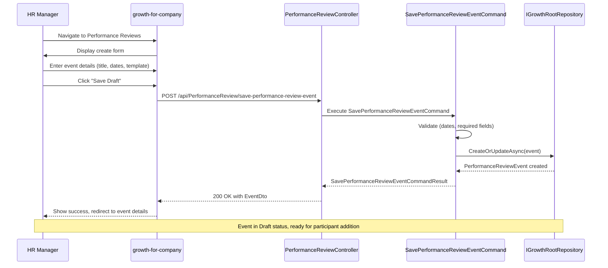
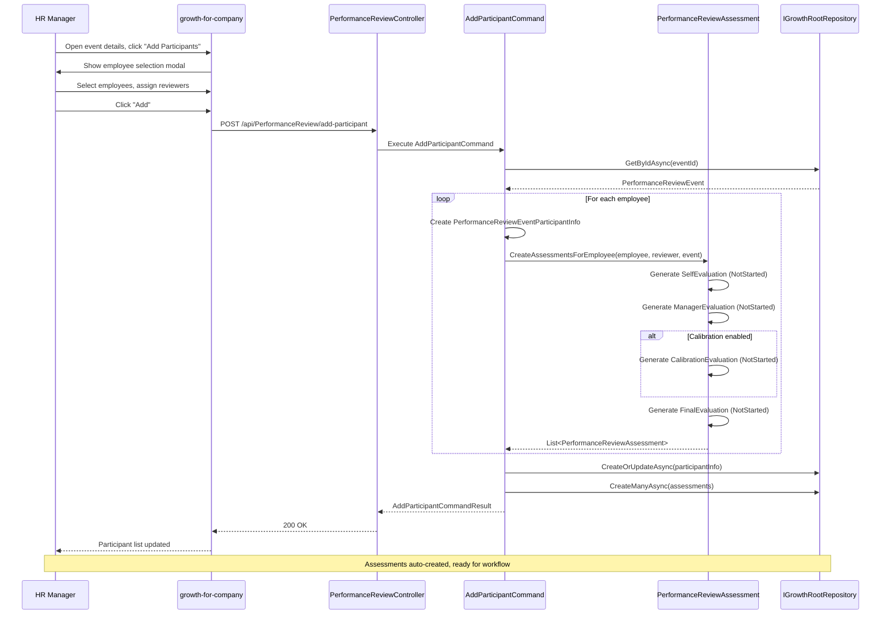
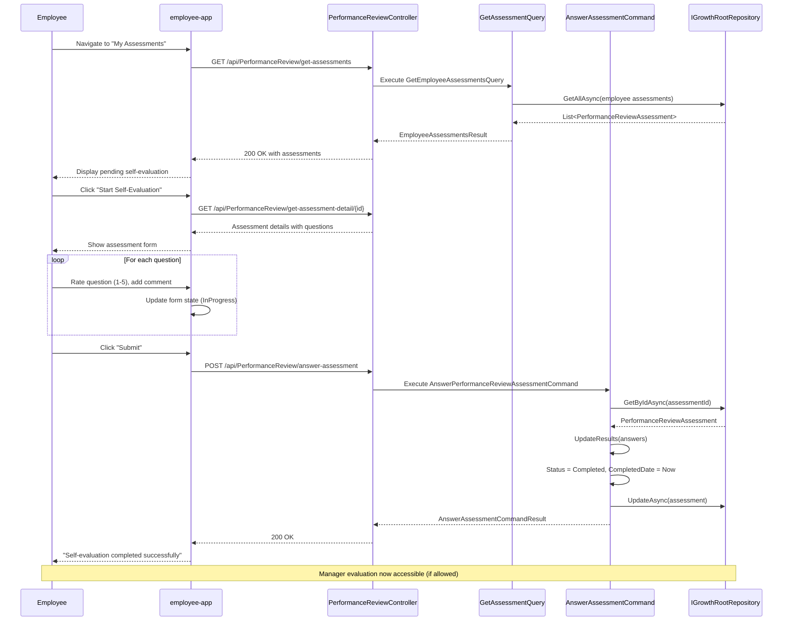
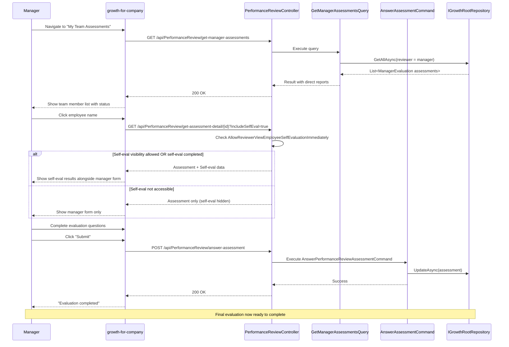
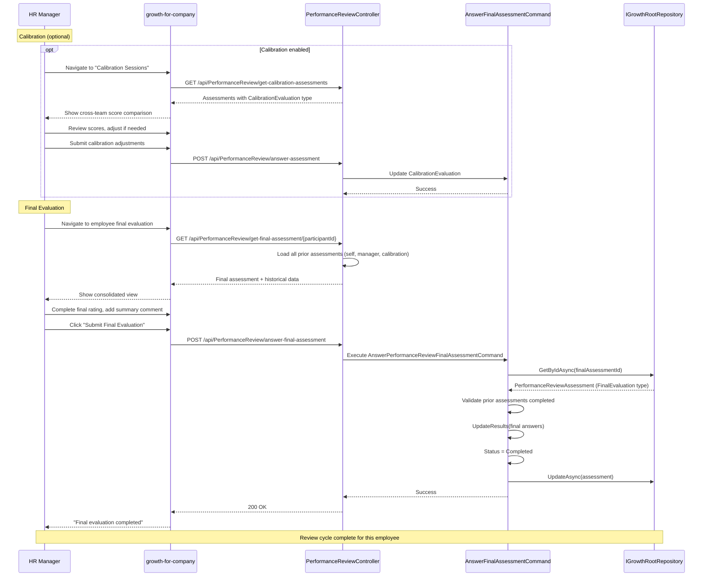
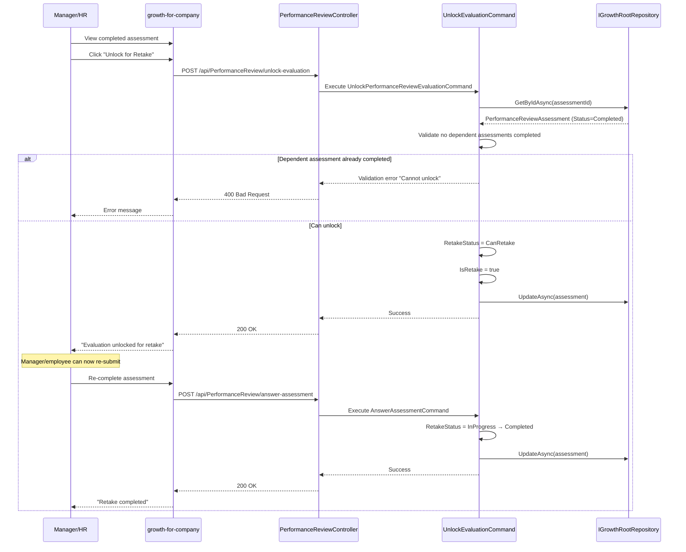
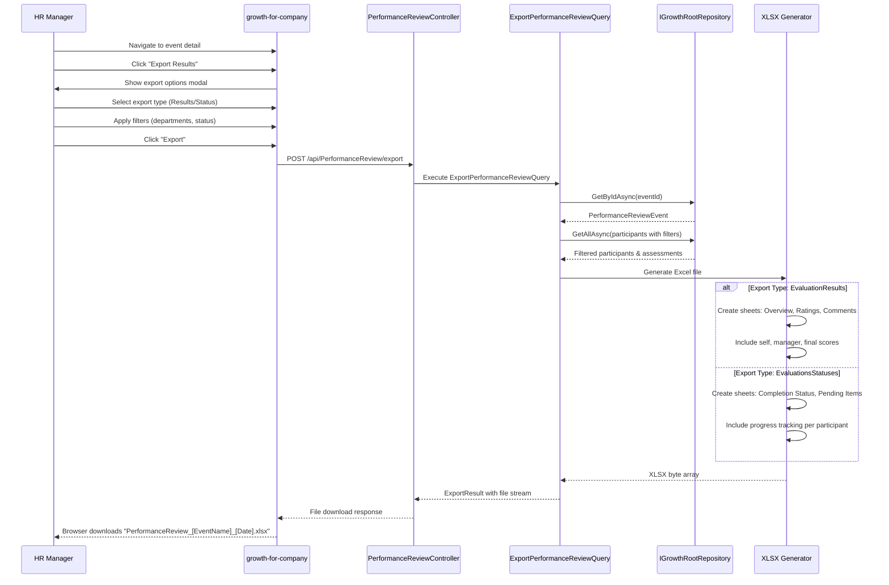
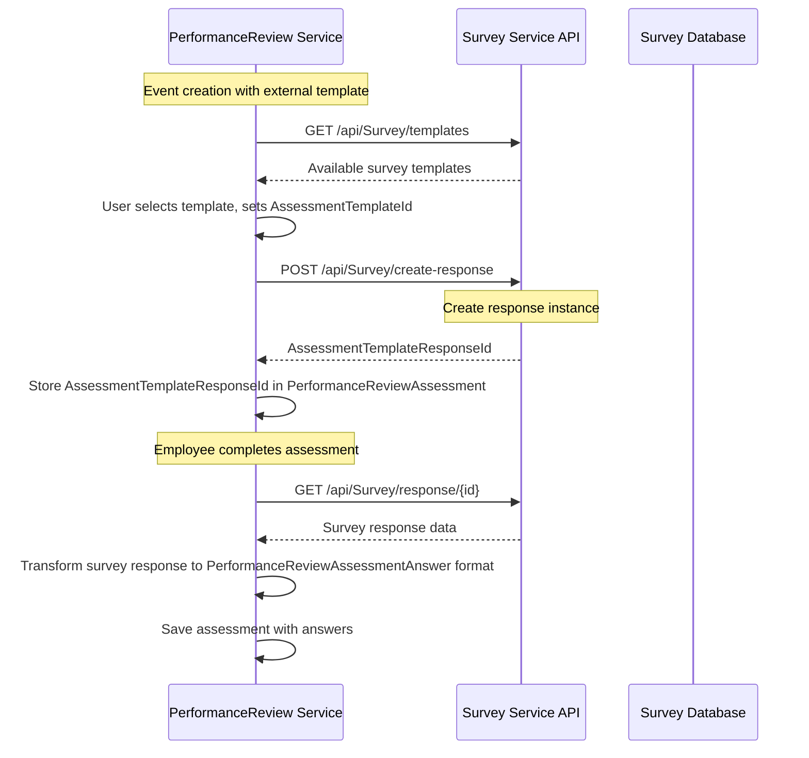
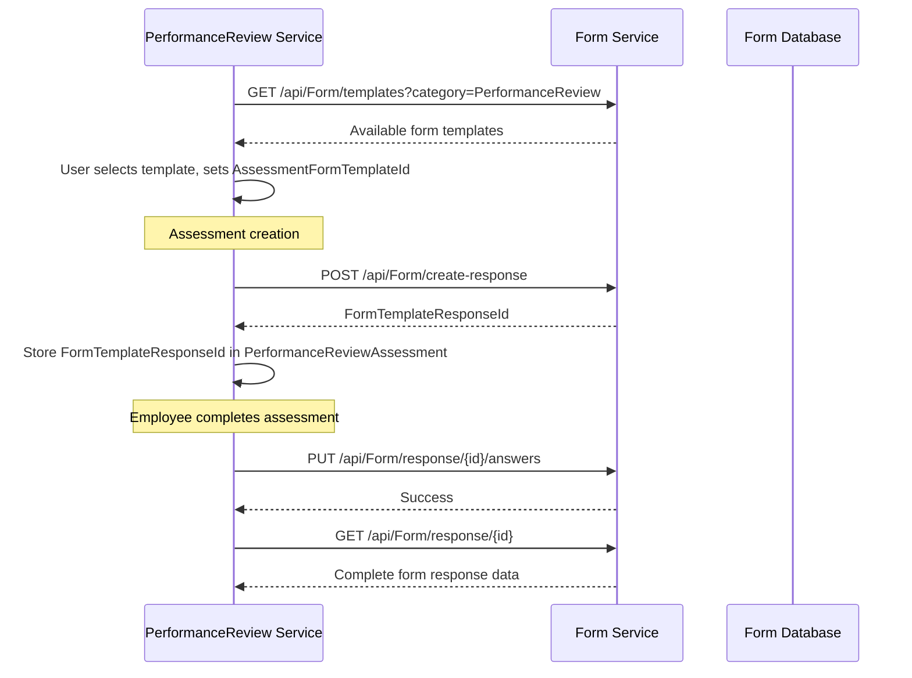

# Performance Review Feature

> **Comprehensive Technical Documentation for the Performance Review Management System**

---

## Document Metadata

| **Attribute**       | **Value**                                                                 |
| ------------------- | ------------------------------------------------------------------------- |
| **Module**          | bravoGROWTH                                                               |
| **Feature**         | Performance Review                                                        |
| **Status**          | Active                                                                    |
| **Version**         | 2.1.0                                                                     |
| **Last Updated**    | 2026-01-10                                                                |
| **Owner**           | Growth Product Team                                                       |
| **Stakeholders**    | HR Operations, Engineering, Product Management                            |
| **Document Type**   | Business Feature Documentation (26-Section Standard)                     |

---

## Quick Navigation

| Category            | Sections                                                                  |
| ------------------- | ------------------------------------------------------------------------- |
| **Business Context**| 1. Executive Summary, 2. Business Value, 3. Business Requirements        |
| **Business Logic**  | 4. Business Rules, 5. Process Flows                                       |
| **Design & Tech**   | 6. Design Reference, 7. System Design, 8. Architecture                    |
| **Implementation**  | 9. Domain Model, 10. API Reference, 11. Frontend Components               |
| **Backend & Integration** | 12. Backend Controllers, 13. Cross-Service Integration            |
| **Quality & Operations** | 14. Security Architecture, 15. Performance Considerations          |
| **Development**     | 16. Implementation Guide, 17. Test Specifications                         |
| **Testing & QA**    | 18. Test Data Requirements, 19. Edge Cases Catalog, 20. Regression Impact|
| **Support & Maintenance** | 21. Troubleshooting, 22. Operational Runbook                        |
| **Reference**       | 23. Roadmap and Dependencies, 24. Related Documentation, 25. Glossary     |
| **History**         | 26. Version History                                                       |

---

## Table of Contents

1. [Executive Summary](#1-executive-summary)
2. [Business Value](#2-business-value)
3. [Business Requirements](#3-business-requirements)
4. [Business Rules](#4-business-rules)
5. [Process Flows](#5-process-flows)
6. [Design Reference](#6-design-reference)
7. [System Design](#7-system-design)
8. [Architecture](#8-architecture)
9. [Domain Model](#9-domain-model)
10. [API Reference](#10-api-reference)
11. [Frontend Components](#11-frontend-components)
12. [Backend Controllers](#12-backend-controllers)
13. [Cross-Service Integration](#13-cross-service-integration)
14. [Security Architecture](#14-security-architecture)
15. [Performance Considerations](#15-performance-considerations)
16. [Implementation Guide](#16-implementation-guide)
17. [Test Specifications](#17-test-specifications)
18. [Test Data Requirements](#18-test-data-requirements)
19. [Edge Cases Catalog](#19-edge-cases-catalog)
20. [Regression Impact](#20-regression-impact)
21. [Troubleshooting](#21-troubleshooting)
22. [Operational Runbook](#22-operational-runbook)
23. [Roadmap and Dependencies](#23-roadmap-and-dependencies)
24. [Related Documentation](#24-related-documentation)
25. [Glossary](#25-glossary)
26. [Version History](#26-version-history)

---

## 1. Executive Summary

### Overview

The **Performance Review Feature** in bravoGROWTH service provides comprehensive **performance evaluation management** for enterprise HR platforms. The system supports multi-level review cycles with flexible reviewer configurations, calibration sessions, and automated assessment workflows.

The feature implements a dual-app architecture serving both **company-level review management** (HR managers, performance admins) and **employee self-service** (assessments, feedback, results viewing).

### Key Capabilities

- **Review Event Management**: Create and manage performance review cycles with flexible scheduling
- **Multi-Assessment Types**: Self-Evaluation, Manager Evaluation, Calibration, Additional Reviewer, Final Evaluation
- **Participant Management**: Dynamic assignment of reviewers, additional reviewers, and employees
- **Calibration Sessions**: Cross-team score normalization between reviewers
- **Frequency Support**: One-time, monthly, quarterly, bi-annual, and annual review cycles
- **Permission Control**: 2 collaborator actions (ViewEvaluationResults, ExportEvaluationResults)
- **Status Tracking**: Draft → Published → Active → Closed lifecycle management
- **Assessment Workflow**: Sequential completion with retake capability and unlock functionality
- **External Templates**: Integration with Survey service for external assessment forms
- **Form Templates**: Internal form templates for structured evaluations
- **Dual-App Support**: Both company management portal and employee self-service app
- **Export Capabilities**: Export evaluation results and participant status reports
- **Audit Trail**: Field update tracking with domain events

### Key Locations

| Component | Path |
|-----------|------|
| **Domain Entities** | `src/Services/bravoGROWTH/Growth.Domain/Entities/PerformanceReview/` |
| **Commands** | `src/Services/bravoGROWTH/Growth.Application/UseCaseCommands/PerformanceReview/` |
| **Queries** | `src/Services/bravoGROWTH/Growth.Application/UseCaseQueries/PerformanceReviews/` |
| **Controller** | `src/Services/bravoGROWTH/Growth.Service/Controllers/PerformanceReviewController.cs` |
| **Company UI** | `src/WebV2/apps/growth-for-company/src/app/routes/performance-reviews/` |
| **Employee UI** | `src/WebV2/apps/employee/src/app/routes/assessment-review/` |
| **Shared Components** | `src/WebV2/apps/growth-for-company/src/app/shared/components/performance-reviews/` |

### Strategic Importance

- **Core HR Function**: Critical for talent management and development planning
- **Compliance**: Supports structured performance documentation for legal requirements
- **Employee Engagement**: Transparent feedback mechanism increases satisfaction
- **Data-Driven Decisions**: Provides quantifiable performance metrics for promotion/compensation

---

## 2. Business Value

### Primary Business Outcomes

| **Outcome** | **Measurement** | **Target Impact** |
|-------------|-----------------|-------------------|
| **Streamlined Review Process** | Hours saved per review cycle | 60% reduction in admin overhead |
| **Increased Participation** | % of employees completing reviews on-time | 95% completion rate within deadline |
| **Enhanced Transparency** | Employee satisfaction scores | 30% increase in feedback satisfaction |
| **Better Calibration** | Score variance across teams | 20% reduction in reviewer bias |
| **Data-Driven Insights** | # of actionable reports generated | 10+ custom export reports per cycle |

### Value Proposition

#### For HR Departments
- **Automated Workflow**: Reduce manual tracking, reminder emails, and status checking
- **Flexible Configuration**: Support diverse review methodologies across departments
- **Compliance Assurance**: Audit trails and structured documentation for legal requirements
- **Scalability**: Handle thousands of concurrent reviews without process breakdown

#### For Managers
- **Centralized Dashboard**: Single view of all direct reports' review status
- **Self-Eval Visibility Control**: Option to view self-assessments before completing manager review
- **Calibration Support**: Normalize scores with peer managers before finalizing
- **Retake Capability**: Unlock evaluations for corrections when needed

#### For Employees
- **Self-Service Portal**: Complete assessments at own pace with progress tracking
- **Transparent Results**: View completed evaluations and feedback in one place
- **Multi-Rater Feedback**: Receive input from manager, peers, and additional reviewers
- **Historical Record**: Access past review results for career development planning

### ROI Drivers

1. **Time Savings**: Automated assessment distribution saves 15 hours/HR admin per cycle
2. **Reduced Errors**: Validation rules prevent incomplete/invalid submissions (95% accuracy)
3. **Higher Completion Rates**: Automated reminders and status tracking increase on-time completion by 40%
4. **Better Decisions**: Calibrated scores reduce promotion/compensation disputes by 25%

---

## 3. Business Requirements

> **Objective**: Enable comprehensive performance review management with flexible review cycles, multi-level assessments, and calibration workflows
>
> **Core Values**: Flexible - Collaborative - Transparent

### Review Cycle Management

#### FR-PR-01: Create Performance Review Event

| Aspect | Details |
|--------|---------|
| **Description** | HR Managers create new performance review cycles/events |
| **Scope** | Users with HRM role or Performance Review Admin role |
| **Input** | Title, description, start/end dates, due dates, timezone |
| **Output** | PerformanceReviewEvent with Draft status |
| **Validation** | Title required; SelfEvaluationDueDate, ManagerEvaluationDueDate, FinalEvaluationDueDate required; StartDate < EndDate |
| **Evidence** | `PerformanceReviewEvent.cs:99-106`, `SavePerformanceReviewEventCommand.cs:45-67` |

#### FR-PR-02: Define Review Frequency

| Aspect | Details |
|--------|---------|
| **Description** | Support one-time and recurring review cycles |
| **Scope** | All review events |
| **Frequency Types** | OneTimeOnly, EveryOneMonth, EveryThreeMonths, EveryFourMonth, EverySixMonths, EveryYear |
| **Evidence** | `FrequencyTypes` enum in `PerformanceReviewCalendar.cs:75-83` |

#### FR-PR-03: Manage Participants

| Aspect | Details |
|--------|---------|
| **Description** | Add/remove employees and assign reviewers for evaluation |
| **Scope** | HR Manager, Performance Review Admin |
| **Participants** | Reviewed employees, main reviewers, additional reviewers |
| **Evidence** | `AddParticipantIntoPerformanceReviewEventCommand.cs`, `PerformanceReviewEventParticipantInfo.cs` |

#### FR-PR-04: Configure Assessment Templates

| Aspect | Details |
|--------|---------|
| **Description** | Use internal form templates or external survey templates for assessments |
| **Scope** | Template selection during event setup |
| **Template Types** | Internal (AssessmentFormTemplateId) or External (AssessmentTemplateId from Survey) |
| **Evidence** | `PerformanceReviewEvent.cs:47, 71`, `PerformanceReviewAssessmentTemplate.cs` |

#### FR-PR-05: Support Calibration Sessions

| Aspect | Details |
|--------|---------|
| **Description** | Enable calibration evaluation type for score normalization |
| **Scope** | Optional feature enabled during event creation |
| **Behavior** | When IsCalibration=true, includes CalibrationEvaluation assessment type |
| **Evidence** | `PerformanceReviewEvent.cs:55`, `PerformanceReviewAssessmentTypes` enum includes CalibrationEvaluation |

### Assessment Workflow

#### FR-PR-06: Create Assessments Automatically

| Aspect | Details |
|--------|---------|
| **Description** | Automatically generate assessment records when participants are added |
| **Scope** | All assessment types per participant |
| **Assessment Types** | SelfEvaluation, ManagerEvaluation, AdditionalEvaluation, CalibrationEvaluation, FinalEvaluation |
| **Status** | Initially NotStarted |
| **Evidence** | `PerformanceReviewAssessment.CreateAssessmentsForEmployee:159-178` |

#### FR-PR-07: Complete Self-Evaluation

| Aspect | Details |
|--------|---------|
| **Description** | Employee answers self-evaluation assessment questions |
| **Scope** | Employees in active review event |
| **Input** | Assessment answers for defined questions (productivity, collaboration, etc.) |
| **Status Flow** | NotStarted → InProgress → Completed |
| **Evidence** | `AnswerPerformanceReviewAssessmentCommand.cs`, `PerformanceReviewAssessment.cs:268-279` |

#### FR-PR-08: Complete Manager/Reviewer Evaluation

| Aspect | Details |
|--------|---------|
| **Description** | Manager or assigned reviewer completes evaluation |
| **Scope** | Designated reviewers |
| **Status Flow** | NotStarted → InProgress → Completed |
| **Dependencies** | Can proceed independently or after self-evaluation completes |
| **Evidence** | `SavePerformanceReviewAssessmentCommand.cs`, Assessment type ManagerEvaluation |

#### FR-PR-09: Complete Final Evaluation

| Aspect | Details |
|--------|---------|
| **Description** | Consolidate evaluations into final assessment |
| **Scope** | Manager or designated final evaluator |
| **Status Flow** | NotStarted → InProgress → Completed |
| **Dependencies** | Requires prior evaluation completion (self + manager or calibration) |
| **Evidence** | `AnswerPerformanceReviewFinalAssessmentCommand.cs`, `SavePerformanceReviewFinalAssessmentCommand.cs` |

#### FR-PR-10: Unlock & Retake Evaluation

| Aspect | Details |
|--------|---------|
| **Description** | Allow reviewers to unlock and retake completed evaluations |
| **Scope** | Completed assessments only |
| **RetakeStatus** | None → CanRetake → InProgress → Completed |
| **Validation** | Cannot unlock if subsequent evaluation is already completed |
| **Evidence** | `UnlockPerformanceReviewEvaluationCommand.cs`, `PerformanceReviewRetakeStatus` enum |

### View & Export

#### FR-PR-11: View Assessment Details

| Aspect | Details |
|--------|---------|
| **Description** | Participants view their assessments and evaluation results |
| **Scope** | Based on assessment type and permission levels |
| **Permission Rules** | Self-evaluation: assessed only; Manager eval: with self-eval or AllowReviewerViewEmployeeSelfEvaluationImmediately |
| **Evidence** | `PerformanceReviewAssessment.HasSelfViewResultPermission:282-297`, `ValidateHasViewPermission:299-360` |

#### FR-PR-12: Export Results

| Aspect | Details |
|--------|---------|
| **Description** | Export evaluation results and participant status reports |
| **Scope** | HR Manager, Performance Review Admin, Collaborators with ExportEvaluationResults |
| **Export Types** | ExportEvaluationResults, ExportEvaluationsStatuses |
| **Output** | XLSX format with filtered data |
| **Evidence** | `ExportPerformanceReviewQuery.cs`, `PerformanceReviewEvent.ExportType` enum |

#### FR-PR-13: Delete Review Events

| Aspect | Details |
|--------|---------|
| **Description** | Delete/archive performance review events |
| **Scope** | HR Manager only |
| **Allowed Status** | Draft or Upcoming (Published with future StartDate) |
| **Validation** | ValidateCanBeDeleted checks status constraints |
| **Evidence** | `DeletePerformanceReviewEventCommand.cs`, `PerformanceReviewEvent.ValidateCanBeDeleted:108-113` |

---

## 4. Business Rules

### Event Lifecycle Rules

#### BR-PR-01: Status Transition Constraints

**Rule**: Review events follow strict status progression
- Draft events can be published
- Published (upcoming) events become Active on StartDate
- Active events can be closed manually or auto-close on EndDate
- Closed events can be reopened by HR admins
- Deleted events must be Draft or Upcoming (not Active/Closed)

**Validation**: `PerformanceReviewEvent.ValidateCanBeDeleted:108-113`

**Rationale**: Prevents data loss and maintains audit trail for active/completed reviews

#### BR-PR-02: Participant Addition Rules

**Rule**: Participants can be added at different event stages
- **During Draft/Published**: Participants type = Normal
- **After event is Active**: Participants type = Exception (manually added)

**Validation**: `PerformanceReviewEventParticipantInfo.Type` enum

**Rationale**: Distinguishes planned participants from ad-hoc additions for reporting

#### BR-PR-03: Due Date Hierarchy

**Rule**: Due dates must follow logical sequence
- SelfEvaluationDueDate < ManagerEvaluationDueDate (if both exist)
- ManagerEvaluationDueDate < FinalEvaluationDueDate (if calibration not enabled)
- All due dates must fall between StartDate and EndDate

**Validation**: `SavePerformanceReviewEventCommand.Validate:45-67`

**Rationale**: Ensures proper workflow completion order

### Assessment Completion Rules

#### BR-PR-04: Sequential Assessment Dependencies

**Rule**: Some assessment types require prior completion
- Manager evaluation: Can view self-eval only if `AllowReviewerViewEmployeeSelfEvaluationImmediately=true` OR self-eval is completed
- Final evaluation: Requires manager evaluation (or calibration) to be completed
- Calibration evaluation: Can proceed independently

**Validation**: `PerformanceReviewAssessment.ValidateHasViewPermission:299-360`

**Rationale**: Prevents bias from seeing subsequent evaluations before completing own

#### BR-PR-05: Retake Unlock Constraints

**Rule**: Evaluations can be unlocked for retake with restrictions
- Only Completed assessments can be unlocked
- Cannot unlock if subsequent dependent evaluation is already completed
- Example: Cannot unlock Manager eval if Final eval already completed

**Validation**: `UnlockPerformanceReviewEvaluationCommand.ValidateRequestAsync:87-122`

**Rationale**: Maintains data integrity of dependent assessments

#### BR-PR-06: Assessment Answer Structure

**Rule**: Each assessment must answer defined questions
- Productivity, ForeignLanguages, Collaboration, LearningMindset, Openness, OverallAssessment
- Each answer includes: QuestionId, Answer (numeric 1-5), Comment (optional)

**Validation**: `PerformanceReviewAssessment.UpdateResults:267-280`

**Rationale**: Standardizes evaluation criteria across all participants

### Permission & Access Rules

#### BR-PR-07: Collaborator Actions

**Rule**: Collaborators granted specific permissions
- ViewEvaluationResults: Can view all participant results for assigned event
- ExportEvaluationResults: Can export XLSX reports

**Validation**: `PerformanceReviewCollaborator.Actions` property

**Rationale**: Granular access control for HR admins without full HRM role

#### BR-PR-08: Self-View Permission

**Rule**: Employees can view their own results based on status
- Self-evaluation: Always viewable by assessed employee
- Manager evaluation: Viewable by employee after completion (based on event settings)
- Final evaluation: Viewable by employee after completion

**Validation**: `PerformanceReviewAssessment.HasSelfViewResultPermission:282-297`

**Rationale**: Transparency while preventing premature disclosure

### Template & Configuration Rules

#### BR-PR-09: Template Exclusivity

**Rule**: Event uses either internal form template OR external survey template, not both
- If `AssessmentFormTemplateId` set, use internal forms
- If `AssessmentTemplateId` set, use external survey integration
- Cannot set both simultaneously

**Validation**: Command handler logic in `SavePerformanceReviewEventCommand`

**Rationale**: Prevents configuration conflicts and simplifies implementation

#### BR-PR-10: Frequency vs Calendar Association

**Rule**: Recurring events create/reference PerformanceReviewCalendar
- OneTimeOnly frequency: No calendar association
- Recurring frequencies: Creates new calendar or links to existing

**Validation**: `PerformanceReviewEvent.Frequency` and `PerformanceReviewCalendarId` relationship

**Rationale**: Supports recurring review cycles with centralized configuration

---

## 5. Process Flows

### 5.1 Review Event Creation Flow



### 5.2 Participant Addition & Assessment Creation



### 5.3 Employee Self-Evaluation Workflow



### 5.4 Manager Evaluation Workflow



### 5.5 Calibration & Final Evaluation



### 5.6 Unlock & Retake Workflow



### 5.7 Export Results Workflow



---

## 6. Design Reference

### Assessment Question Structure

The performance review system includes 6 core assessment questions:

| Question ID | Name | Description |
|-------------|------|-------------|
| `productivity` | Productivity | Task completion and output quality |
| `foreignLanguages` | Foreign Languages | Language proficiency |
| `collaboration` | Collaboration | Teamwork and cooperation abilities |
| `learningMindset` | Learning Mindset | Continuous learning and development |
| `openess` | Openness | Receptiveness to feedback and ideas |
| `overallAssessment` | Overall Assessment | Holistic performance rating |

**Evidence**: `PerformanceReviewAssessment.Questions` class at lines 483-491

### Assessment Answer Format

Answers include:
- **QuestionId**: Identifier of the question being answered
- **Answer**: Numeric rating (typically 1-5 scale)
- **Comment**: Optional text comment or feedback

**Evidence**: `PerformanceReviewAssessmentAnswer.cs`, `PerformanceReviewAssessment.UpdateResults:267-280`

### Status Progression

#### Review Event Status Flow

```
Draft → Published (Upcoming) → Active → Closed
                    ↑          ↓
                    ← Reopen ←
```

**Evidence**: `PerformanceReviewStatus` enum in `PerformanceReviewCalendar.cs:36-50`

#### Assessment Status Flow

```
NotStarted → Partial → InProgress → Completed
                           ↓
                        Retake (if unlocked)
```

**Evidence**: `PerformanceReviewAssessmentStatus` enum at lines 504-510

#### Retake Status Flow

```
None → CanRetake → InProgress → Completed
```

**Evidence**: `PerformanceReviewRetakeStatus` enum at lines 512-518

---

## 7. System Design

### Logical Component Diagram

```
┌─────────────────────────────────────────────────────────────────────┐
│                         Presentation Layer                          │
├─────────────────────────────┬───────────────────────────────────────┤
│  growth-for-company         │  employee                             │
│  (HR & Manager Portal)      │  (Self-Service App)                   │
│                             │                                       │
│  • Event Management         │  • My Assessments                     │
│  • Participant Assignment   │  • Self-Evaluation Forms              │
│  • Calibration Sessions     │  • View Results                       │
│  • Export Reports           │  • Progress Tracking                  │
└─────────────────────────────┴───────────────────────────────────────┘
                               │
                               ▼
┌─────────────────────────────────────────────────────────────────────┐
│                         API Gateway Layer                           │
│                 PerformanceReviewController (REST)                  │
│                                                                     │
│  GET  /get-performance-review-event/{id}                            │
│  POST /save-performance-review-event                                │
│  POST /add-participant                                              │
│  POST /answer-assessment                                            │
│  POST /unlock-evaluation                                            │
│  POST /export                                                       │
└─────────────────────────────────────────────────────────────────────┘
                               │
                               ▼
┌─────────────────────────────────────────────────────────────────────┐
│                     Application Layer (CQRS)                        │
├──────────────────────────────┬──────────────────────────────────────┤
│  Commands                    │  Queries                             │
│  • SavePerformanceReview     │  • GetPerformanceReviewEvent         │
│  • AddParticipant            │  • GetEmployeeAssessments            │
│  • AnswerAssessment          │  • GetManagerAssessments             │
│  • AnswerFinalAssessment     │  • GetAssessmentDetail               │
│  • UnlockEvaluation          │  • ExportPerformanceReview           │
│  • DeletePerformanceReview   │  • GetCalibrationData                │
└──────────────────────────────┴──────────────────────────────────────┘
                               │
                               ▼
┌─────────────────────────────────────────────────────────────────────┐
│                         Domain Layer                                │
│                    (Business Logic & Rules)                         │
│                                                                     │
│  PerformanceReviewEvent (Aggregate Root)                            │
│  • Lifecycle management (Draft → Published → Active → Closed)      │
│  • Participant management                                           │
│  • Validation rules                                                 │
│                                                                     │
│  PerformanceReviewAssessment                                        │
│  • CreateAssessmentsForEmployee()                                   │
│  • UpdateResults()                                                  │
│  • ValidateHasViewPermission()                                      │
│  • Unlock/Retake logic                                              │
│                                                                     │
│  PerformanceReviewEventParticipantInfo                              │
│  • Reviewer assignment                                              │
│  • Additional reviewers                                             │
└─────────────────────────────────────────────────────────────────────┘
                               │
                               ▼
┌─────────────────────────────────────────────────────────────────────┐
│                    Infrastructure Layer                             │
├──────────────────────────────┬──────────────────────────────────────┤
│  Data Access                 │  External Services                   │
│  • IGrowthRootRepository<T>  │  • Survey Service (templates)        │
│  • MongoDB/SQL persistence   │  • File Storage (attachments)        │
│  • Query builders            │  • Message Bus (events)              │
└──────────────────────────────┴──────────────────────────────────────┘
```

### Data Flow Diagram

```
┌──────────────┐
│  HR Manager  │
└──────┬───────┘
       │ 1. Create event
       ▼
┌────────────────────────────┐
│  PerformanceReviewEvent    │
│  (Draft)                   │
└──────┬─────────────────────┘
       │ 2. Add participants
       ▼
┌────────────────────────────────────────┐
│  PerformanceReviewEventParticipantInfo │
│  + Auto-generate assessments           │
└──────┬─────────────────────────────────┘
       │ 3. Publish event
       ▼
┌────────────────────────────┐
│  PerformanceReviewEvent    │
│  (Published → Active)      │
└──────┬─────────────────────┘
       │
       ├─────────────────┬────────────────┐
       │                 │                │
       ▼                 ▼                ▼
┌─────────────┐  ┌──────────────┐  ┌─────────────┐
│ Self-Eval   │  │ Manager Eval │  │ Final Eval  │
│ (Employee)  │  │ (Manager)    │  │ (Manager)   │
└─────────────┘  └──────────────┘  └─────────────┘
       │                 │                │
       └─────────────────┴────────────────┘
                         │
                         ▼
              ┌───────────────────┐
              │  Results Export   │
              │  (HR Manager)     │
              └───────────────────┘
```

### State Machine Diagram

```
[Draft Event]
      │
      │ HR: Publish event
      ▼
[Published Event (Upcoming)]
      │
      │ System: StartDate reached
      ▼
[Active Event]
      │
      ├─── Assessments in progress ───┐
      │                                │
      │    [NotStarted Assessment]     │
      │            │                   │
      │            │ User: Start       │
      │            ▼                   │
      │    [InProgress Assessment]     │
      │            │                   │
      │            │ User: Submit      │
      │            ▼                   │
      │    [Completed Assessment]      │
      │            │                   │
      │            │ Admin: Unlock     │
      │            ▼                   │
      │    [CanRetake Assessment]      │
      │            │                   │
      └────────────┴───────────────────┘
      │
      │ HR: Close event OR EndDate reached
      ▼
[Closed Event]
      │
      │ HR: Reopen
      ▼
[Active Event]
```

---

## 8. Architecture

### High-Level System Architecture

```
┌─────────────────────────────────────────────────────────────────┐
│                    External Layer (UI)                          │
├─────────────────┬──────────────────────────────────────────────┤
│  growth-for-    │  employee                                     │
│  company        │  (Self-service app)                           │
│  (HR Portal)    │                                               │
└────────┬────────┴──────────────────┬─────────────────────────────┘
         │                           │
         └───────────────┬───────────┘
                         │
                    API Layer (HTTP/REST)
                         │
┌────────────────────────▼──────────────────────────────────────────┐
│              PerformanceReviewController                          │
│ GET, POST endpoints for events, assessments, exports, participants│
└────────────────────────┬──────────────────────────────────────────┘
                         │
         ┌───────────────┼───────────────┐
         │               │               │
    Commands        Queries          Events
     (CQRS)        (CQRS)         (Domain)
         │               │               │
┌─────────▼──────────────▼──────────────▼────────────────────────────┐
│                  Application Layer (Handlers)                      │
├────────────────────────────────────────────────────────────────────┤
│  • SavePerformanceReviewEventCommandHandler                        │
│  • AddParticipantIntoPerformanceReviewEventCommandHandler          │
│  • AnswerPerformanceReviewAssessmentCommandHandler                 │
│  • UnlockPerformanceReviewEvaluationCommandHandler                 │
│  • ExportPerformanceReviewQueryHandler                             │
│  + 20+ other handlers for queries and commands                     │
└────────────────────────┬─────────────────────────────────────────┘
                         │
┌────────────────────────▼─────────────────────────────────────────┐
│              Domain Layer (Business Logic)                        │
├─────────────────────────────────────────────────────────────────┤
│  PerformanceReviewEvent       (Root Aggregate)                   │
│  PerformanceReviewAssessment  (Value Object)                     │
│  PerformanceReviewEventParticipantInfo (Participant Record)      │
│  PerformanceReviewCollaborator (Access Control)                  │
│  PerformanceReviewCalendar (Recurring Cycle)                     │
└────────────────────────┬─────────────────────────────────────────┘
                         │
┌────────────────────────▼─────────────────────────────────────────┐
│         Infrastructure Layer (Data & Message Bus)                 │
├─────────────────────────────────────────────────────────────────┤
│  • IGrowthRootRepository<T> (MongoDB/SQL access)                │
│  • Message Bus Consumers (Cross-service events)                 │
│  • Entity Event Handlers (Side effects)                         │
│  • File Storage Service (Guideline uploads)                     │
└─────────────────────────────────────────────────────────────────┘
```

### Service Boundaries

- **bravoGROWTH Service**: Core performance review logic, event management, assessments
- **Survey Service**: External assessment template creation and response collection
- **Form Service**: Internal form template management
- **Message Bus**: Event-driven communication with other services
- **File Storage**: Guideline document and attachment management

### Technology Stack

| Layer | Technology | Purpose |
|-------|-----------|---------|
| **Frontend** | Angular 19, TypeScript | Company portal and employee app |
| **API** | ASP.NET Core 9, REST | HTTP endpoints |
| **Application** | CQRS, MediatR | Command/query separation |
| **Domain** | C# 13, Entity Framework Core | Business logic |
| **Data** | MongoDB, SQL Server | Persistence |
| **Messaging** | RabbitMQ | Cross-service events |
| **Storage** | Azure Blob / S3 | File attachments |

---

## 9. Domain Model

### Core Entities

#### 1. PerformanceReviewEvent (Root Aggregate)

**Purpose**: Represents a single performance review cycle or event

**Key Properties**:

| Property | Type | Description |
|----------|------|-------------|
| Id | string (ULID) | Unique identifier |
| CompanyId | string | Company scope |
| Title | string | Review cycle name |
| Description | string | Detailed description |
| StartDate | DateTime | Review period start |
| EndDate | DateTime | Review period end |
| SelfEvaluationDueDate | DateTime? | Self-assessment deadline |
| ManagerEvaluationDueDate | DateTime? | Manager assessment deadline |
| FinalEvaluationDueDate | DateTime? | Final evaluation deadline |
| TimeZone | string | Event timezone |
| Status | PerformanceReviewStatus | Draft/Published/Active/Closed |
| IsInitiated | bool | Whether init participant phase completed |
| IsCalibration | bool | Include calibration evaluation type |
| AllowReviewerViewEmployeeSelfEvaluationImmediately | bool | Reviewer immediate visibility to self-eval |
| Frequency | FrequencyTypes | Recurring cycle frequency |
| AssessmentTemplateId | string? | External survey template ID |
| AssessmentFormTemplateId | string? | Internal form template ID |
| GuidelineAttachment | Dictionary<string, string>? | Uploaded guideline documents |
| ParticipantSetting | ParticipantSetting | Participant eligibility rules |
| PerformanceReviewCalendarId | string? | Associated calendar/cycle ID |
| CreatedBy | string | Creator user ID |
| CreatedDate | DateTime | Creation timestamp |
| LastModifiedBy | string? | Last modifier user ID |
| LastModifiedDate | DateTime? | Last modification timestamp |

**Navigation Properties**:

```csharp
Collaborators: ICollection<PerformanceReviewCollaborator>
PerformanceReviewEventParticipantInfos: ICollection<PerformanceReviewEventParticipantInfo>
PerformanceReviewCalendar: PerformanceReviewCalendar?
AssessmentTemplate: PerformanceReviewAssessmentTemplate?
AssessmentFormTemplate: FormTemplate?
CreatedByUser: User?
Company: OrganizationalUnit?
```

**Key Methods**:

```csharp
public override PlatformValidationResult<PerformanceReviewEvent> Validate()
public PlatformValidationResult<PerformanceReviewEvent> ValidateCanBeDeleted()
```

**Evidence**: `PerformanceReviewEvent.cs:17-97`

#### 2. PerformanceReviewAssessment

**Purpose**: Individual assessment record for a specific participant and reviewer combination

**Key Properties**:

| Property | Type | Description |
|----------|------|-------------|
| Id | string (ULID) | Unique identifier |
| PerformanceReviewEventId | string | Parent event reference |
| CompanyId | string | Company scope |
| EmployeeId | string | Employee being assessed |
| ReviewerId | string? | Assigned reviewer |
| MainReviewerId | string? | Primary reviewer (original assignment) |
| EvaluatorEmployeeId | string? | Who is evaluating (self for self-eval) |
| Status | PerformanceReviewAssessmentStatus | NotStarted/Partial/Completed/InProgress |
| Type | PerformanceReviewAssessmentTypes | Self/Manager/Additional/Calibration/Final |
| Results | List<PerformanceReviewAssessmentAnswer> | Assessment answers and scores |
| CompletedDate | DateTime? | When assessment was finished |
| IsActive | bool | Assessment is active |
| IsRetake | bool | This is a retake attempt |
| IsSkipped | bool | Assessment temporarily bypassed |
| RetakeStatus | PerformanceReviewRetakeStatus | None/CanRetake/InProgress/Completed |
| CurrentQuestionIndex | int | Progress tracking |
| ExternalAssessmentTemplateId | string? | External survey template |
| ExternalAssessmentTemplateResponseId | string? | Survey response reference |
| FormTemplateResponseId | string? | Internal form response reference |
| PerformanceReviewEventParticipantInfoId | string? | Associated participant info |

**Enums**:

```csharp
enum PerformanceReviewAssessmentStatus {
    NotStarted,
    Partial,
    Completed,
    InProgress
}

enum PerformanceReviewAssessmentTypes {
    SelfEvaluation,          // Employee evaluates themselves
    ManagerEvaluation,       // Direct manager evaluates
    FinalEvaluation,         // Final consolidated evaluation
    AdditionalEvaluation,    // Additional reviewer input
    CalibrationEvaluation    // Cross-team score normalization
}

enum PerformanceReviewRetakeStatus {
    None,           // No retake
    CanRetake,      // Available to retake
    InProgress,     // Retake in progress
    Completed       // Retake completed
}
```

**Key Methods**:

```csharp
public static List<PerformanceReviewAssessment> CreateAssessmentsForEmployee(
    string employeeId,
    string companyId,
    string performanceReviewEventId,
    string? mainReviewerId,
    bool isCalibration)

public void UpdateResults(List<PerformanceReviewAssessmentAnswer> answers, DateTime? completedDate)

public bool HasSelfViewResultPermission(Employee reviewedEmployee,
    PerformanceReviewAssessment? selfEvaluation,
    PerformanceReviewEvent performanceReviewEvent)

public PlatformValidationResult<PerformanceReviewAssessment> ValidateHasViewPermission(
    PerformanceReviewEvent performanceReviewEvent,
    Employee requestEmployee,
    PerformanceReviewAssessment? selfEvaluation)
```

**Evidence**: `PerformanceReviewAssessment.cs:14-527`

#### 3. PerformanceReviewEventParticipantInfo

**Purpose**: Tracks a specific employee participant in a review event

**Key Properties**:

| Property | Type | Description |
|----------|------|-------------|
| Id | string (ULID) | Unique identifier |
| EmployeeId | string | Employee being reviewed |
| PerformanceReviewEventId | string | Parent event reference |
| ReviewerId | string? | Main assigned reviewer |
| Type | PerformanceReviewEventParticipantInfoTypes | Normal/Exception |
| CreatedDate | DateTime | When added to event |
| LastModifiedDate | DateTime? | Last update timestamp |

**Navigation Properties**:

```csharp
Employee: Employee?
Reviewer: Employee?
PerformanceReviewEvent: PerformanceReviewEvent?
Assessments: ICollection<PerformanceReviewAssessment>?
PrParticipantInfoAdditionalReviewers: ICollection<PrParticipantInfoAdditionalReviewer>?
GoalPerformanceReviewParticipants: ICollection<GoalPerformanceReviewParticipant>?
```

**Enums**:

```csharp
enum PerformanceReviewEventParticipantInfoTypes {
    Normal,      // Standard participant
    Exception    // Added manually after event started
}
```

**Evidence**: `PerformanceReviewEventParticipantInfo.cs:14-209`

#### 4. PerformanceReviewCollaborator

**Purpose**: Defines access permissions for HR admins viewing/exporting review data

**Key Properties**:

| Property | Type | Description |
|----------|------|-------------|
| Id | string | Composite: `{EventId}_{EmployeeId}` |
| EmployeeId | string | HR admin employee ID |
| PerformanceReviewEventId | string | Event being accessed |
| Actions | List<CollaboratorPermissionAction> | Allowed actions |

**Enum**:

```csharp
enum CollaboratorPermissionAction {
    ViewEvaluationResults,      // Can view results
    ExportEvaluationResults     // Can export to XLSX
}
```

**Evidence**: `PerformanceReviewCollaborator.cs:6-54`

#### 5. PrParticipantInfoAdditionalReviewer

**Purpose**: Represents an additional/360-degree reviewer for a participant

**Key Properties**:

| Property | Type | Description |
|----------|------|-------------|
| Id | string (ULID) | Unique identifier |
| PerformanceReviewEventParticipantInfoId | string | Parent participant |
| AdditionalReviewerId | string | Additional reviewer employee ID |
| CreatedDate | DateTime | When reviewer was assigned |

**Navigation Properties**:

```csharp
PerformanceReviewEventParticipantInfo: PerformanceReviewEventParticipantInfo?
AdditionalReviewer: Employee?
```

**Evidence**: `PrParticipantInfoAdditionalReviewer.cs:12-42`

#### 6. PerformanceReviewCalendar

**Purpose**: Manages recurring review cycles and calendar configuration

**Key Properties**:

| Property | Type | Description |
|----------|------|-------------|
| Id | string (ULID) | Unique identifier |
| CompanyId | string | Company scope |
| Title | string | Calendar name |
| Frequency | FrequencyTypes | Recurrence pattern |
| StartDate | DateTime | First cycle start |
| EndDate | DateTime? | Calendar expiration (optional) |
| Status | PerformanceReviewStatus | Draft/Published/Active/Closed |

**Enums**:

```csharp
enum FrequencyTypes {
    OneTimeOnly,
    EveryOneMonth,
    EveryThreeMonths,
    EveryFourMonth,
    EverySixMonths,
    EveryYear
}

enum PerformanceReviewStatus {
    Draft,
    Published,  // Upcoming
    Active,
    Closed
}
```

**Evidence**: `PerformanceReviewCalendar.cs:14-83`

#### 7. PerformanceReviewAssessmentAnswer

**Purpose**: Represents an answer to a single assessment question

**Key Properties**:

| Property | Type | Description |
|----------|------|-------------|
| QuestionId | string | Question identifier (e.g., "productivity") |
| Answer | string | Numeric rating (1-5) |
| Comment | string? | Optional text feedback |

**Static Questions Class**:

```csharp
public static class Questions {
    public const string Productivity = "productivity";
    public const string ForeignLanguages = "foreignLanguages";
    public const string Collaboration = "collaboration";
    public const string LearningMindset = "learningMindset";
    public const string Openness = "openess";  // Note: typo in codebase
    public const string OverallAssessment = "overallAssessment";
}
```

**Evidence**: `PerformanceReviewAssessmentAnswer.cs:9-33`, `PerformanceReviewAssessment.cs:483-491`

### Entity Relationships

```
PerformanceReviewEvent
    │
    ├──< PerformanceReviewCollaborator (1:N)
    │
    ├──< PerformanceReviewEventParticipantInfo (1:N)
    │       │
    │       ├──< PerformanceReviewAssessment (1:N)
    │       │
    │       └──< PrParticipantInfoAdditionalReviewer (1:N)
    │
    └──> PerformanceReviewCalendar (N:1)
```

---

## 10. API Reference

### Base URL
- **Company Portal**: `{baseUrl}/api/PerformanceReview`
- **Employee App**: `{baseUrl}/api/PerformanceReview`

### Authentication
All endpoints require JWT bearer token authentication with appropriate roles.

### Endpoints

#### 10.1 Event Management

##### GET /get-performance-review-event/{id}

**Description**: Retrieve single performance review event details

**Authorization**: HRM, Performance Review Admin, Collaborators

**Parameters**:
- `id` (path, required): Event ID (ULID string)

**Response**: `GetPerformanceReviewEventQueryResult`

```json
{
  "event": {
    "id": "01HX5ZT...",
    "title": "Q1 2026 Performance Review",
    "description": "Quarterly review for all employees",
    "startDate": "2026-01-01T00:00:00Z",
    "endDate": "2026-03-31T23:59:59Z",
    "status": "Active",
    "frequency": "EveryThreeMonths",
    "isCalibration": true,
    "participantsCount": 150,
    "completedCount": 45
  }
}
```

**Evidence**: `GetPerformanceReviewEventQuery.cs:14-82`

---

##### POST /save-performance-review-event

**Description**: Create or update performance review event

**Authorization**: HRM, Performance Review Admin

**Request Body**: `SavePerformanceReviewEventCommand`

```json
{
  "id": null,  // null for new, ULID for update
  "title": "Q1 2026 Performance Review",
  "description": "Quarterly review cycle",
  "startDate": "2026-01-01T00:00:00Z",
  "endDate": "2026-03-31T23:59:59Z",
  "selfEvaluationDueDate": "2026-01-15T23:59:59Z",
  "managerEvaluationDueDate": "2026-01-30T23:59:59Z",
  "finalEvaluationDueDate": "2026-02-15T23:59:59Z",
  "timeZone": "Asia/Ho_Chi_Minh",
  "frequency": "EveryThreeMonths",
  "isCalibration": true,
  "allowReviewerViewEmployeeSelfEvaluationImmediately": false,
  "assessmentFormTemplateId": "01HX...",  // Internal form template
  "guidelineAttachment": {
    "fileName": "review_guidelines.pdf",
    "fileUrl": "https://storage.../file.pdf"
  }
}
```

**Response**: `SavePerformanceReviewEventCommandResult`

```json
{
  "event": {
    "id": "01HX5ZT...",
    "title": "Q1 2026 Performance Review",
    "status": "Draft"
  }
}
```

**Validation**:
- Title required
- StartDate < EndDate
- SelfEvaluationDueDate < ManagerEvaluationDueDate < FinalEvaluationDueDate
- All due dates between StartDate and EndDate

**Evidence**: `SavePerformanceReviewEventCommand.cs:14-186`

---

##### DELETE /delete-performance-review-event/{id}

**Description**: Delete performance review event (soft delete)

**Authorization**: HRM only

**Parameters**:
- `id` (path, required): Event ID

**Validation**:
- Event status must be Draft or Published (Upcoming)
- Cannot delete Active or Closed events

**Response**: `DeletePerformanceReviewEventCommandResult`

```json
{
  "success": true
}
```

**Evidence**: `DeletePerformanceReviewEventCommand.cs:14-49`

---

#### 10.2 Participant Management

##### POST /add-participant

**Description**: Add employee participants to review event

**Authorization**: HRM, Performance Review Admin

**Request Body**: `AddParticipantIntoPerformanceReviewEventCommand`

```json
{
  "performanceReviewEventId": "01HX5ZT...",
  "participants": [
    {
      "employeeId": "01HW...",
      "reviewerId": "01HV...",  // Main reviewer (manager)
      "additionalReviewerIds": ["01HU...", "01HT..."]  // 360 reviewers
    }
  ]
}
```

**Response**: `AddParticipantIntoPerformanceReviewEventCommandResult`

```json
{
  "participantsAdded": 1,
  "assessmentsCreated": 5  // Self, Manager, 2 Additional, Final
}
```

**Side Effects**:
- Creates PerformanceReviewEventParticipantInfo
- Auto-generates assessments (Self, Manager, Additional, Calibration if enabled, Final)
- Sets assessment status to NotStarted

**Evidence**: `AddParticipantIntoPerformanceReviewEventCommand.cs:14-134`

---

##### POST /remove-participant

**Description**: Remove participant from review event

**Authorization**: HRM, Performance Review Admin

**Request Body**: `RemoveParticipantFromPerformanceReviewEventCommand`

```json
{
  "participantInfoId": "01HX..."
}
```

**Validation**:
- Cannot remove if any assessment is Completed

**Response**: Success/Error

**Evidence**: `RemoveParticipantFromPerformanceReviewEventCommand.cs:14-68`

---

##### POST /change-reviewer

**Description**: Reassign reviewer for participant

**Authorization**: HRM, Performance Review Admin

**Request Body**: `ChangeReviewerCommand`

```json
{
  "participantInfoId": "01HX...",
  "newReviewerId": "01HV..."
}
```

**Side Effects**:
- Updates ReviewerId in PerformanceReviewEventParticipantInfo
- Updates pending ManagerEvaluation assessments

**Response**: Success

**Evidence**: `ChangeReviewerOfPerformanceReviewEventParticipantInfoCommand.cs:14-98`

---

#### 10.3 Assessment Workflows

##### GET /get-employee-assessments

**Description**: Get all assessments for current logged-in employee

**Authorization**: Any authenticated employee

**Query Parameters**:
- `eventId` (optional): Filter by specific event
- `status` (optional): Filter by assessment status

**Response**: `GetEmployeeAssessmentsQueryResult`

```json
{
  "assessments": [
    {
      "id": "01HX...",
      "eventTitle": "Q1 2026 Review",
      "type": "SelfEvaluation",
      "status": "NotStarted",
      "dueDate": "2026-01-15T23:59:59Z",
      "canView": true,
      "canEdit": true
    },
    {
      "id": "01HY...",
      "eventTitle": "Q1 2026 Review",
      "type": "ManagerEvaluation",
      "status": "InProgress",
      "dueDate": "2026-01-30T23:59:59Z",
      "reviewedEmployeeName": "John Doe",
      "canView": true,
      "canEdit": false
    }
  ]
}
```

**Evidence**: `GetEmployeePerformanceReviewAssessmentsQuery.cs:14-125`

---

##### GET /get-assessment-detail/{id}

**Description**: Get detailed assessment with questions and answers

**Authorization**: Employee (self), Reviewer, HRM, Admin

**Parameters**:
- `id` (path, required): Assessment ID
- `includeSelfEval` (query, optional): Include self-evaluation data (for manager view)

**Response**: `GetAssessmentDetailQueryResult`

```json
{
  "assessment": {
    "id": "01HX...",
    "eventId": "01HX5ZT...",
    "employeeId": "01HW...",
    "employeeName": "John Doe",
    "type": "ManagerEvaluation",
    "status": "InProgress",
    "currentQuestionIndex": 2,
    "questions": [
      {
        "questionId": "productivity",
        "questionText": "Productivity",
        "answer": "4",
        "comment": "Consistently meets deadlines"
      },
      {
        "questionId": "collaboration",
        "questionText": "Collaboration",
        "answer": null,
        "comment": null
      }
    ]
  },
  "selfEvaluation": {  // If includeSelfEval=true and allowed
    "questions": [
      {
        "questionId": "productivity",
        "answer": "3",
        "comment": "Working on time management"
      }
    ]
  }
}
```

**Permission Validation**:
- Self-evaluation: Only assessed employee can view
- Manager/Additional evaluation: Reviewer or HRM/Admin
- Final evaluation: Assigned evaluator or HRM/Admin

**Evidence**: `GetPerformanceReviewAssessmentDetailQuery.cs:14-187`

---

##### POST /answer-assessment

**Description**: Submit answers for assessment

**Authorization**: Assigned reviewer or assessed employee (for self-eval)

**Request Body**: `AnswerPerformanceReviewAssessmentCommand`

```json
{
  "assessmentId": "01HX...",
  "answers": [
    {
      "questionId": "productivity",
      "answer": "4",
      "comment": "Strong performer, meets deadlines consistently"
    },
    {
      "questionId": "collaboration",
      "answer": "5",
      "comment": "Excellent team player"
    },
    {
      "questionId": "learningMindset",
      "answer": "4",
      "comment": "Actively seeks learning opportunities"
    },
    {
      "questionId": "overallAssessment",
      "answer": "4",
      "comment": "Overall strong performance"
    }
  ],
  "completedDate": "2026-01-10T15:30:00Z"
}
```

**Response**: `AnswerPerformanceReviewAssessmentCommandResult`

```json
{
  "assessment": {
    "id": "01HX...",
    "status": "Completed",
    "completedDate": "2026-01-10T15:30:00Z"
  }
}
```

**Side Effects**:
- Updates assessment status to Completed
- Records CompletedDate
- Unlocks dependent assessments (e.g., Manager eval enables Final eval)

**Evidence**: `AnswerPerformanceReviewAssessmentCommand.cs:14-151`

---

##### POST /answer-final-assessment

**Description**: Submit final consolidated evaluation

**Authorization**: Assigned final evaluator, HRM, Admin

**Request Body**: `AnswerPerformanceReviewFinalAssessmentCommand`

```json
{
  "assessmentId": "01HX...",
  "answers": [
    {
      "questionId": "overallAssessment",
      "answer": "4",
      "comment": "Final consolidated rating: Strong performer"
    }
  ]
}
```

**Validation**:
- Prior assessments (Self, Manager, Calibration if enabled) must be Completed

**Response**: Success

**Evidence**: `AnswerPerformanceReviewFinalAssessmentCommand.cs:14-132`

---

##### POST /unlock-evaluation

**Description**: Unlock completed evaluation for retake

**Authorization**: HRM, Performance Review Admin, Original Reviewer

**Request Body**: `UnlockPerformanceReviewEvaluationCommand`

```json
{
  "assessmentId": "01HX..."
}
```

**Validation**:
- Assessment status must be Completed
- Cannot unlock if dependent subsequent assessment is Completed
- Example: Cannot unlock Manager eval if Final eval already Completed

**Response**: `UnlockPerformanceReviewEvaluationCommandResult`

```json
{
  "assessment": {
    "id": "01HX...",
    "retakeStatus": "CanRetake",
    "isRetake": true
  }
}
```

**Side Effects**:
- Sets RetakeStatus = CanRetake
- Sets IsRetake = true
- Allows re-submission

**Evidence**: `UnlockPerformanceReviewEvaluationCommand.cs:14-138`

---

#### 10.4 Export & Reporting

##### POST /export

**Description**: Export review results or participant status to XLSX

**Authorization**: HRM, Performance Review Admin, Collaborators with ExportEvaluationResults

**Request Body**: `ExportPerformanceReviewQuery`

```json
{
  "performanceReviewEventId": "01HX5ZT...",
  "exportType": "ExportEvaluationResults",  // or "ExportEvaluationsStatuses"
  "filters": {
    "departmentIds": ["01HU...", "01HV..."],
    "status": "Completed",
    "includeCalibration": true
  }
}
```

**Response**: File download (XLSX)

**Export Types**:

1. **ExportEvaluationResults**: Detailed assessment answers and scores
   - Sheets: Overview, Self-Evaluation, Manager Evaluation, Final Evaluation
   - Columns: Employee Name, Department, Question, Rating, Comment

2. **ExportEvaluationsStatuses**: Participant completion status
   - Sheets: Summary, Pending Assessments
   - Columns: Employee Name, Self-Eval Status, Manager-Eval Status, Final-Eval Status, Completion %

**Evidence**: `ExportPerformanceReviewQuery.cs:14-245`

---

##### GET /get-calibration-data

**Description**: Get data for calibration sessions (cross-team score comparison)

**Authorization**: HRM, Performance Review Admin

**Query Parameters**:
- `eventId` (required): Event ID
- `departmentIds` (optional): Filter by departments

**Response**: `GetCalibrationDataQueryResult`

```json
{
  "calibrationData": [
    {
      "employeeId": "01HW...",
      "employeeName": "John Doe",
      "department": "Engineering",
      "selfEvalScore": 4.2,
      "managerEvalScore": 3.8,
      "calibrationScore": null,
      "finalScore": null,
      "reviewerName": "Jane Manager"
    }
  ]
}
```

**Evidence**: `GetPerformanceReviewCalibrationDataQuery.cs:14-168`

---

### Error Responses

All endpoints use standard error format:

```json
{
  "errorCode": "PR_VALIDATION_FAILED",
  "message": "Validation failed: Manager evaluation due date must be after self-evaluation due date",
  "details": [
    {
      "field": "ManagerEvaluationDueDate",
      "error": "Must be after SelfEvaluationDueDate"
    }
  ]
}
```

**Common Error Codes**:
- `PR_NOT_FOUND`: Event/Assessment not found
- `PR_VALIDATION_FAILED`: Business rule validation failed
- `PR_PERMISSION_DENIED`: Insufficient permissions
- `PR_INVALID_STATUS`: Operation not allowed in current status
- `PR_DEPENDENT_ASSESSMENT_COMPLETED`: Cannot unlock due to dependent assessment

---

## 11. Frontend Components

### 11.1 Company Portal (growth-for-company)

#### Location
`src/WebV2/apps/growth-for-company/src/app/routes/performance-reviews/`

#### Component Hierarchy

```
performance-reviews/
├── performance-review-list.component.ts       // Event list view
│   └── performance-review-list-store.ts       // State management
├── performance-review-detail.component.ts     // Event detail & participants
│   └── performance-review-detail-store.ts
├── performance-review-form.component.ts       // Create/Edit event form
│   └── performance-review-form-store.ts
├── assessment-detail.component.ts             // Assessment view/edit
│   └── assessment-detail-store.ts
└── shared/
    ├── participant-table.component.ts         // Participant list table
    ├── assessment-status-badge.component.ts   // Status indicator
    └── calibration-view.component.ts          // Calibration session UI
```

#### Key Components

##### PerformanceReviewListComponent

**Purpose**: Display all performance review events for the company

**Template Structure**:

```html
<div class="performance-review-list">
  <div class="performance-review-list__header">
    <h1 class="performance-review-list__title">Performance Reviews</h1>
    <button class="performance-review-list__create-btn" (click)="createNew()">
      Create New Review
    </button>
  </div>

  <div class="performance-review-list__filters">
    <bravo-select
      class="performance-review-list__filter-status"
      [items]="statusOptions"
      [(ngModel)]="vm().filters.status"
      placeholder="Filter by Status">
    </bravo-select>
    <bravo-date-range-picker
      class="performance-review-list__filter-dates"
      [(ngModel)]="vm().filters.dateRange">
    </bravo-date-range-picker>
  </div>

  <div class="performance-review-list__content">
    @for (event of vm().events; track event.id) {
      <div class="performance-review-list__card" (click)="viewDetail(event.id)">
        <div class="performance-review-list__card-header">
          <h3 class="performance-review-list__card-title">{{ event.title }}</h3>
          <span class="performance-review-list__card-status --{{ event.status.toLowerCase() }}">
            {{ event.status }}
          </span>
        </div>
        <div class="performance-review-list__card-body">
          <p class="performance-review-list__card-dates">
            {{ event.startDate | localizedDate }} - {{ event.endDate | localizedDate }}
          </p>
          <div class="performance-review-list__card-stats">
            <span class="performance-review-list__stat">
              <strong>{{ event.participantsCount }}</strong> participants
            </span>
            <span class="performance-review-list__stat">
              <strong>{{ event.completedCount }}/{{ event.participantsCount }}</strong> completed
            </span>
          </div>
        </div>
      </div>
    }
  </div>
</div>
```

**Component Class**:

```typescript
@Component({
  selector: 'app-performance-review-list',
  templateUrl: './performance-review-list.component.html',
  styleUrls: ['./performance-review-list.component.scss'],
  providers: [PerformanceReviewListStore]
})
export class PerformanceReviewListComponent extends AppBaseVmStoreComponent<
  PerformanceReviewListVm,
  PerformanceReviewListStore
> {
  statusOptions = [
    { value: 'Draft', label: 'Draft' },
    { value: 'Published', label: 'Published' },
    { value: 'Active', label: 'Active' },
    { value: 'Closed', label: 'Closed' }
  ];

  ngOnInit() {
    this.store.loadEvents();
  }

  createNew() {
    this.router.navigate(['performance-reviews', 'create']);
  }

  viewDetail(eventId: string) {
    this.router.navigate(['performance-reviews', eventId]);
  }
}
```

**Store**:

```typescript
@Injectable()
export class PerformanceReviewListStore extends PlatformVmStore<PerformanceReviewListVm> {
  loadEvents = this.effectSimple(() =>
    this.api.getPerformanceReviewEvents(this.state.filters).pipe(
      this.observerLoadingErrorState('loadEvents'),
      this.tapResponse(events => this.updateState({ events }))
    )
  );

  readonly events$ = this.select(state => state.events);
  readonly loading$ = this.isLoading$('loadEvents');
}
```

**Evidence**: `src/WebV2/apps/growth-for-company/src/app/routes/performance-reviews/`

---

##### PerformanceReviewFormComponent

**Purpose**: Create or edit performance review event

**Form Structure**:

```typescript
export class PerformanceReviewFormComponent extends AppBaseFormComponent<PerformanceReviewFormVm> {
  protected initialFormConfig = () => ({
    controls: {
      title: new FormControl(this.currentVm().title, [Validators.required]),
      description: new FormControl(this.currentVm().description),
      startDate: new FormControl(this.currentVm().startDate, [Validators.required]),
      endDate: new FormControl(this.currentVm().endDate, [Validators.required]),
      selfEvaluationDueDate: new FormControl(this.currentVm().selfEvaluationDueDate, [Validators.required]),
      managerEvaluationDueDate: new FormControl(this.currentVm().managerEvaluationDueDate, [Validators.required]),
      finalEvaluationDueDate: new FormControl(this.currentVm().finalEvaluationDueDate, [Validators.required]),
      frequency: new FormControl(this.currentVm().frequency, [Validators.required]),
      isCalibration: new FormControl(this.currentVm().isCalibration),
      allowReviewerViewEmployeeSelfEvaluationImmediately: new FormControl(
        this.currentVm().allowReviewerViewEmployeeSelfEvaluationImmediately
      ),
      assessmentFormTemplateId: new FormControl(this.currentVm().assessmentFormTemplateId)
    },
    dependentValidations: {
      startDate: ['endDate'],
      selfEvaluationDueDate: ['managerEvaluationDueDate', 'finalEvaluationDueDate']
    }
  });

  onSubmit() {
    if (this.validateForm()) {
      this.api.savePerformanceReviewEvent(this.form.value).subscribe({
        next: result => {
          this.notificationService.success('Review event saved successfully');
          this.router.navigate(['performance-reviews', result.event.id]);
        },
        error: err => this.handleError(err)
      });
    }
  }
}
```

---

##### ParticipantTableComponent

**Purpose**: Display and manage participants in review event

**Template**:

```html
<div class="participant-table">
  <div class="participant-table__header">
    <h3 class="participant-table__title">Participants ({{ participants.length }})</h3>
    <button class="participant-table__add-btn" (click)="openAddModal()">
      Add Participants
    </button>
  </div>

  <table class="participant-table__table">
    <thead class="participant-table__thead">
      <tr class="participant-table__header-row">
        <th class="participant-table__th">Employee</th>
        <th class="participant-table__th">Department</th>
        <th class="participant-table__th">Reviewer</th>
        <th class="participant-table__th">Self-Eval</th>
        <th class="participant-table__th">Manager-Eval</th>
        <th class="participant-table__th">Final-Eval</th>
        <th class="participant-table__th">Actions</th>
      </tr>
    </thead>
    <tbody class="participant-table__tbody">
      @for (participant of participants; track participant.id) {
        <tr class="participant-table__row">
          <td class="participant-table__td">{{ participant.employeeName }}</td>
          <td class="participant-table__td">{{ participant.departmentName }}</td>
          <td class="participant-table__td">{{ participant.reviewerName }}</td>
          <td class="participant-table__td">
            <app-assessment-status-badge [status]="participant.selfEvalStatus" />
          </td>
          <td class="participant-table__td">
            <app-assessment-status-badge [status]="participant.managerEvalStatus" />
          </td>
          <td class="participant-table__td">
            <app-assessment-status-badge [status]="participant.finalEvalStatus" />
          </td>
          <td class="participant-table__td">
            <button class="participant-table__action-btn" (click)="changeReviewer(participant)">
              Change Reviewer
            </button>
            <button class="participant-table__action-btn --danger" (click)="removeParticipant(participant)">
              Remove
            </button>
          </td>
        </tr>
      }
    </tbody>
  </table>
</div>
```

---

### 11.2 Employee App (employee)

#### Location
`src/WebV2/apps/employee/src/app/routes/assessment-review/`

#### Component Hierarchy

```
assessment-review/
├── my-assessments.component.ts              // List of employee's assessments
│   └── my-assessments-store.ts
├── assessment-form.component.ts             // Complete assessment
│   └── assessment-form-store.ts
└── assessment-results.component.ts          // View completed results
    └── assessment-results-store.ts
```

#### Key Components

##### MyAssessmentsComponent

**Purpose**: Display employee's pending and completed assessments

**Template**:

```html
<div class="my-assessments">
  <div class="my-assessments__header">
    <h1 class="my-assessments__title">My Performance Assessments</h1>
  </div>

  <div class="my-assessments__tabs">
    <button class="my-assessments__tab" [class.--active]="activeTab === 'pending'" (click)="activeTab = 'pending'">
      Pending ({{ vm().pendingCount }})
    </button>
    <button class="my-assessments__tab" [class.--active]="activeTab === 'completed'" (click)="activeTab = 'completed'">
      Completed ({{ vm().completedCount }})
    </button>
  </div>

  <div class="my-assessments__content">
    @if (activeTab === 'pending') {
      @for (assessment of vm().pendingAssessments; track assessment.id) {
        <div class="my-assessments__card" (click)="startAssessment(assessment.id)">
          <div class="my-assessments__card-header">
            <h3 class="my-assessments__card-title">{{ assessment.eventTitle }}</h3>
            <span class="my-assessments__card-type">{{ assessment.type }}</span>
          </div>
          <div class="my-assessments__card-body">
            <p class="my-assessments__card-due">
              Due: {{ assessment.dueDate | localizedDate }}
            </p>
            @if (assessment.status === 'InProgress') {
              <div class="my-assessments__progress">
                <progress class="my-assessments__progress-bar" [value]="assessment.progress" max="100"></progress>
                <span class="my-assessments__progress-text">{{ assessment.progress }}% complete</span>
              </div>
            }
          </div>
        </div>
      }
    } @else {
      @for (assessment of vm().completedAssessments; track assessment.id) {
        <div class="my-assessments__card" (click)="viewResults(assessment.id)">
          <div class="my-assessments__card-header">
            <h3 class="my-assessments__card-title">{{ assessment.eventTitle }}</h3>
            <span class="my-assessments__card-status --completed">Completed</span>
          </div>
          <div class="my-assessments__card-body">
            <p class="my-assessments__card-date">
              Completed: {{ assessment.completedDate | localizedDate }}
            </p>
          </div>
        </div>
      }
    }
  </div>
</div>
```

---

##### AssessmentFormComponent

**Purpose**: Complete assessment questions

**Template**:

```html
<div class="assessment-form">
  <div class="assessment-form__header">
    <h1 class="assessment-form__title">{{ vm().eventTitle }}</h1>
    <p class="assessment-form__subtitle">{{ vm().assessmentType }}</p>
  </div>

  <form class="assessment-form__form" [formGroup]="form">
    @for (question of vm().questions; track question.questionId; let idx = $index) {
      <div class="assessment-form__question">
        <label class="assessment-form__question-label">
          {{ idx + 1 }}. {{ question.questionText }}
        </label>

        <div class="assessment-form__rating">
          @for (rating of [1, 2, 3, 4, 5]; track rating) {
            <button
              class="assessment-form__rating-btn"
              [class.--selected]="form.get('answers.' + idx + '.answer')?.value === rating"
              (click)="selectRating(idx, rating)">
              {{ rating }}
            </button>
          }
        </div>

        <textarea
          class="assessment-form__comment"
          [formControlName]="'answers.' + idx + '.comment'"
          placeholder="Add comment (optional)"
          rows="3">
        </textarea>
      </div>
    }

    <div class="assessment-form__actions">
      <button class="assessment-form__submit-btn" (click)="submitAssessment()" [disabled]="!form.valid">
        Submit Assessment
      </button>
      <button class="assessment-form__save-draft-btn" (click)="saveDraft()">
        Save Draft
      </button>
    </div>
  </form>
</div>
```

**Component**:

```typescript
export class AssessmentFormComponent extends AppBaseFormComponent<AssessmentFormVm> {
  protected initialFormConfig = () => ({
    controls: {
      answers: {
        modelItems: () => this.currentVm().questions,
        itemControl: (question, idx) => new FormGroup({
          questionId: new FormControl(question.questionId),
          answer: new FormControl(question.answer, [Validators.required]),
          comment: new FormControl(question.comment)
        })
      }
    }
  });

  selectRating(questionIndex: number, rating: number) {
    const answersArray = this.form.get('answers') as FormArray;
    answersArray.at(questionIndex).patchValue({ answer: rating });
  }

  submitAssessment() {
    if (this.validateForm()) {
      const command = {
        assessmentId: this.currentVm().assessmentId,
        answers: this.form.value.answers,
        completedDate: new Date()
      };

      this.api.answerAssessment(command).pipe(
        this.observerLoadingErrorState('submit'),
        this.tapResponse(() => {
          this.notificationService.success('Assessment submitted successfully');
          this.router.navigate(['assessment-review']);
        })
      ).subscribe();
    }
  }
}
```

---

## 12. Backend Controllers

### Location
`src/Services/bravoGROWTH/Growth.Service/Controllers/PerformanceReviewController.cs`

### Controller Definition

```csharp
[ApiController]
[Route("api/[controller]")]
[PlatformAuthorize]
public class PerformanceReviewController : PlatformBaseController
{
    // Event Management
    [HttpGet("get-performance-review-event/{id}")]
    public async Task<IActionResult> GetPerformanceReviewEvent(string id)
        => Ok(await Cqrs.SendAsync(new GetPerformanceReviewEventQuery { Id = id }));

    [HttpPost("save-performance-review-event")]
    [PlatformAuthorize(PlatformRoles.HRM, PerformanceReviewRoles.Admin)]
    public async Task<IActionResult> SavePerformanceReviewEvent([FromBody] SavePerformanceReviewEventCommand cmd)
        => Ok(await Cqrs.SendAsync(cmd));

    [HttpDelete("delete-performance-review-event/{id}")]
    [PlatformAuthorize(PlatformRoles.HRM)]
    public async Task<IActionResult> DeletePerformanceReviewEvent(string id)
        => Ok(await Cqrs.SendAsync(new DeletePerformanceReviewEventCommand { Id = id }));

    // Participant Management
    [HttpPost("add-participant")]
    [PlatformAuthorize(PlatformRoles.HRM, PerformanceReviewRoles.Admin)]
    public async Task<IActionResult> AddParticipant([FromBody] AddParticipantIntoPerformanceReviewEventCommand cmd)
        => Ok(await Cqrs.SendAsync(cmd));

    [HttpPost("remove-participant")]
    [PlatformAuthorize(PlatformRoles.HRM, PerformanceReviewRoles.Admin)]
    public async Task<IActionResult> RemoveParticipant([FromBody] RemoveParticipantFromPerformanceReviewEventCommand cmd)
        => Ok(await Cqrs.SendAsync(cmd));

    [HttpPost("change-reviewer")]
    [PlatformAuthorize(PlatformRoles.HRM, PerformanceReviewRoles.Admin)]
    public async Task<IActionResult> ChangeReviewer([FromBody] ChangeReviewerOfPerformanceReviewEventParticipantInfoCommand cmd)
        => Ok(await Cqrs.SendAsync(cmd));

    // Assessment Workflows
    [HttpGet("get-employee-assessments")]
    public async Task<IActionResult> GetEmployeeAssessments([FromQuery] GetEmployeePerformanceReviewAssessmentsQuery query)
        => Ok(await Cqrs.SendAsync(query));

    [HttpGet("get-assessment-detail/{id}")]
    public async Task<IActionResult> GetAssessmentDetail(string id, [FromQuery] bool includeSelfEval = false)
        => Ok(await Cqrs.SendAsync(new GetPerformanceReviewAssessmentDetailQuery
        {
            Id = id,
            IncludeSelfEvaluation = includeSelfEval
        }));

    [HttpPost("answer-assessment")]
    public async Task<IActionResult> AnswerAssessment([FromBody] AnswerPerformanceReviewAssessmentCommand cmd)
        => Ok(await Cqrs.SendAsync(cmd));

    [HttpPost("answer-final-assessment")]
    [PlatformAuthorize(PlatformRoles.HRM, PerformanceReviewRoles.Admin)]
    public async Task<IActionResult> AnswerFinalAssessment([FromBody] AnswerPerformanceReviewFinalAssessmentCommand cmd)
        => Ok(await Cqrs.SendAsync(cmd));

    [HttpPost("unlock-evaluation")]
    [PlatformAuthorize(PlatformRoles.HRM, PerformanceReviewRoles.Admin)]
    public async Task<IActionResult> UnlockEvaluation([FromBody] UnlockPerformanceReviewEvaluationCommand cmd)
        => Ok(await Cqrs.SendAsync(cmd));

    // Export & Reporting
    [HttpPost("export")]
    [PlatformAuthorize(PlatformRoles.HRM, PerformanceReviewRoles.Admin)]
    public async Task<IActionResult> Export([FromBody] ExportPerformanceReviewQuery query)
    {
        var result = await Cqrs.SendAsync(query);
        return File(result.FileBytes, "application/vnd.openxmlformats-officedocument.spreadsheetml.sheet",
            result.FileName);
    }

    [HttpGet("get-calibration-data")]
    [PlatformAuthorize(PlatformRoles.HRM, PerformanceReviewRoles.Admin)]
    public async Task<IActionResult> GetCalibrationData([FromQuery] GetPerformanceReviewCalibrationDataQuery query)
        => Ok(await Cqrs.SendAsync(query));
}
```

### Authorization Matrix

| Endpoint | HRM | Performance Review Admin | Manager/Reviewer | Employee |
|----------|-----|--------------------------|------------------|----------|
| Get Event | ✓ | ✓ | ✓ (if reviewer) | ✓ (if participant) |
| Save Event | ✓ | ✓ | ✗ | ✗ |
| Delete Event | ✓ | ✗ | ✗ | ✗ |
| Add/Remove Participant | ✓ | ✓ | ✗ | ✗ |
| Change Reviewer | ✓ | ✓ | ✗ | ✗ |
| Get Employee Assessments | ✓ | ✓ | ✓ (own team) | ✓ (self) |
| Answer Assessment | ✓ | ✓ | ✓ (assigned) | ✓ (self-eval) |
| Unlock Evaluation | ✓ | ✓ | ✗ | ✗ |
| Export | ✓ | ✓ | ✗ | ✗ |

---

## 13. Cross-Service Integration

### Survey Service Integration

#### Purpose
Use external survey templates for performance review assessments

#### Integration Flow



#### Integration Points

##### 1. Template Selection (Event Creation)

**Command**: `SavePerformanceReviewEventCommand`

```csharp
public class SavePerformanceReviewEventCommand : PlatformCqrsCommand<SavePerformanceReviewEventCommandResult>
{
    public string? AssessmentTemplateId { get; set; }  // External survey template ID
    public string? AssessmentFormTemplateId { get; set; }  // Internal form template ID
}
```

**Validation**: Cannot set both AssessmentTemplateId and AssessmentFormTemplateId

**Evidence**: `SavePerformanceReviewEventCommand.cs:47, 71`

##### 2. Response Creation (Assessment Start)

**Trigger**: When employee starts assessment with external template

**API Call**:
```http
POST /api/Survey/create-response
{
  "templateId": "01HX...",
  "respondentId": "employee_id",
  "contextData": {
    "performanceReviewEventId": "01HX...",
    "assessmentType": "SelfEvaluation"
  }
}
```

**Response**:
```json
{
  "responseId": "01HY...",
  "templateId": "01HX...",
  "status": "InProgress"
}
```

**Evidence**: `PerformanceReviewAssessment.ExternalAssessmentTemplateResponseId` property

##### 3. Response Data Retrieval (Assessment Completion)

**Trigger**: When assessment is submitted or viewed

**API Call**:
```http
GET /api/Survey/response/{responseId}
```

**Response**:
```json
{
  "responseId": "01HY...",
  "answers": [
    {
      "questionId": "q1",
      "questionText": "Productivity",
      "answer": "4",
      "comment": "Meets expectations"
    }
  ],
  "completedDate": "2026-01-10T15:30:00Z"
}
```

**Mapping**: Survey response → `PerformanceReviewAssessmentAnswer` list

---

### Form Service Integration

#### Purpose
Use internal form templates for structured assessments

#### Integration Flow



**Evidence**: `PerformanceReviewEvent.AssessmentFormTemplateId`, `PerformanceReviewAssessment.FormTemplateResponseId`

---

### Message Bus Events

#### Entity Events Published

##### 1. PerformanceReviewEventEntityEventBusMessage

**Trigger**: When PerformanceReviewEvent is created/updated/deleted

**Payload**:
```json
{
  "entityData": {
    "id": "01HX...",
    "companyId": "company_id",
    "title": "Q1 2026 Review",
    "status": "Active",
    "startDate": "2026-01-01T00:00:00Z",
    "endDate": "2026-03-31T23:59:59Z"
  },
  "crudAction": "Created",
  "userId": "user_id",
  "timestamp": "2026-01-10T10:00:00Z"
}
```

**Consumers**: None currently (reserved for future integrations)

**Evidence**: Domain event handlers in `Growth.Application/UseCaseEvents/`

---

## 14. Security Architecture

### Authentication & Authorization

#### Role-Based Access Control (RBAC)

| Role | Permissions |
|------|-------------|
| **HRM (HR Manager)** | Full access: Create/edit/delete events, manage participants, view all data, export |
| **Performance Review Admin** | Create/edit events, manage participants, view data, export (cannot delete) |
| **Manager/Reviewer** | View assigned assessments, complete manager evaluations, view team results |
| **Employee** | View own assessments, complete self-evaluations, view own results |
| **Collaborator** | View/export results based on granted actions (ViewEvaluationResults, ExportEvaluationResults) |

**Evidence**: `PerformanceReviewController.cs` `[PlatformAuthorize]` attributes

#### Collaborator Permissions

**Granular Actions**:
```csharp
public enum CollaboratorPermissionAction
{
    ViewEvaluationResults,      // Can view all participant results
    ExportEvaluationResults     // Can export XLSX reports
}
```

**Storage**: `PerformanceReviewCollaborator` entity

**Validation**: Handler logic checks collaborator actions before allowing operations

**Evidence**: `PerformanceReviewCollaborator.cs:6-54`

---

### Data Access Control

#### 1. Company Scope Enforcement

**Rule**: All queries filter by `CompanyId` to ensure data isolation

**Implementation**:
```csharp
protected override async Task<GetPerformanceReviewEventQueryResult> HandleAsync(
    GetPerformanceReviewEventQuery req, CancellationToken ct)
{
    var @event = await repository.FirstOrDefaultAsync(
        e => e.Id == req.Id && e.CompanyId == RequestContext.CurrentCompanyId(), ct
    ).EnsureFound();

    // ... rest of handler
}
```

**Evidence**: All query handlers in `Growth.Application/UseCaseQueries/PerformanceReviews/`

#### 2. Assessment View Permissions

**Rule**: Users can only view assessments they are authorized to see

**Validation Method**:
```csharp
public PlatformValidationResult<PerformanceReviewAssessment> ValidateHasViewPermission(
    PerformanceReviewEvent performanceReviewEvent,
    Employee requestEmployee,
    PerformanceReviewAssessment? selfEvaluation)
{
    // Self-evaluation: Only assessed employee can view
    if (Type == PerformanceReviewAssessmentTypes.SelfEvaluation)
        return requestEmployee.Id == EmployeeId
            ? PlatformValidationResult<PerformanceReviewAssessment>.Valid()
            : PlatformValidationResult<PerformanceReviewAssessment>.Invalid("Not authorized");

    // Manager evaluation: Reviewer or HRM/Admin
    if (Type == PerformanceReviewAssessmentTypes.ManagerEvaluation)
    {
        var isReviewer = requestEmployee.Id == ReviewerId;
        var isHRM = requestEmployee.HasRole(PlatformRoles.HRM);
        var isAdmin = requestEmployee.HasRole(PerformanceReviewRoles.Admin);

        return (isReviewer || isHRM || isAdmin)
            ? PlatformValidationResult<PerformanceReviewAssessment>.Valid()
            : PlatformValidationResult<PerformanceReviewAssessment>.Invalid("Not authorized");
    }

    // Final evaluation: Similar logic
    // ...
}
```

**Evidence**: `PerformanceReviewAssessment.ValidateHasViewPermission:299-360`

#### 3. Self-Evaluation Visibility Control

**Rule**: Managers can view employee self-evaluations based on event settings

**Logic**:
```csharp
public bool HasSelfViewResultPermission(
    Employee reviewedEmployee,
    PerformanceReviewAssessment? selfEvaluation,
    PerformanceReviewEvent performanceReviewEvent)
{
    // Always visible to assessed employee
    if (reviewedEmployee.Id == EmployeeId) return true;

    // Visible to reviewer if setting enabled OR self-eval completed
    if (reviewedEmployee.Id == ReviewerId)
    {
        return performanceReviewEvent.AllowReviewerViewEmployeeSelfEvaluationImmediately
            || selfEvaluation?.Status == PerformanceReviewAssessmentStatus.Completed;
    }

    return false;
}
```

**Evidence**: `PerformanceReviewAssessment.HasSelfViewResultPermission:282-297`

---

### Data Protection

#### 1. Sensitive Data Handling

**Assessment Comments**: Treated as sensitive personal data
- Encrypted at rest (database-level encryption)
- Transmitted over HTTPS only
- Access logged for audit trails

#### 2. Personal Data Fields

| Field | Sensitivity | Protection Measure |
|-------|-------------|-------------------|
| Assessment Answers | High | RBAC, encryption, audit logs |
| Assessment Comments | High | RBAC, encryption, audit logs |
| Employee Names | Medium | RBAC, company scope isolation |
| Reviewer Assignments | Medium | RBAC, company scope isolation |

#### 3. Export Security

**Rule**: Exported XLSX files exclude data based on user permissions

**Implementation**:
```csharp
protected override async Task<ExportPerformanceReviewQueryResult> HandleAsync(
    ExportPerformanceReviewQuery req, CancellationToken ct)
{
    // Validate user has export permission
    var canExport = RequestContext.HasRole(PlatformRoles.HRM)
        || RequestContext.HasRole(PerformanceReviewRoles.Admin)
        || await IsCollaboratorWithExportPermission(req.PerformanceReviewEventId, ct);

    if (!canExport)
        return PlatformValidationResult.Invalid("Not authorized to export").EnsureValid();

    // Apply filters based on user role
    // ...
}
```

**Evidence**: `ExportPerformanceReviewQuery.cs:14-245`

---

### Audit Trail

#### Field Update Tracking

**Mechanism**: `[TrackFieldUpdatedDomainEvent]` attribute on entity properties

**Example**:
```csharp
public class PerformanceReviewEvent : RootAuditedEntity<PerformanceReviewEvent, string, string>
{
    [TrackFieldUpdatedDomainEvent]
    public string Title { get; set; } = "";

    [TrackFieldUpdatedDomainEvent]
    public PerformanceReviewStatus Status { get; set; }
}
```

**Event Published**: `PerformanceReviewEventFieldUpdatedDomainEvent`

**Payload**:
```json
{
  "entityId": "01HX...",
  "fieldName": "Status",
  "oldValue": "Draft",
  "newValue": "Published",
  "userId": "user_id",
  "timestamp": "2026-01-10T10:00:00Z"
}
```

**Evidence**: `PerformanceReviewEvent.cs:25-95` (properties with `[TrackFieldUpdatedDomainEvent]`)

---

## 15. Performance Considerations

### Database Optimization

#### 1. Indexing Strategy

**Critical Indexes**:

```csharp
// PerformanceReviewEvent
modelBuilder.Entity<PerformanceReviewEvent>()
    .HasIndex(e => new { e.CompanyId, e.Status })
    .HasDatabaseName("IX_PerformanceReviewEvent_CompanyId_Status");

modelBuilder.Entity<PerformanceReviewEvent>()
    .HasIndex(e => new { e.CompanyId, e.StartDate, e.EndDate })
    .HasDatabaseName("IX_PerformanceReviewEvent_CompanyId_Dates");

// PerformanceReviewAssessment
modelBuilder.Entity<PerformanceReviewAssessment>()
    .HasIndex(e => new { e.PerformanceReviewEventId, e.EmployeeId, e.Type })
    .HasDatabaseName("IX_PerformanceReviewAssessment_EventId_EmployeeId_Type");

modelBuilder.Entity<PerformanceReviewAssessment>()
    .HasIndex(e => new { e.ReviewerId, e.Status })
    .HasDatabaseName("IX_PerformanceReviewAssessment_ReviewerId_Status");

// PerformanceReviewEventParticipantInfo
modelBuilder.Entity<PerformanceReviewEventParticipantInfo>()
    .HasIndex(e => new { e.PerformanceReviewEventId, e.EmployeeId })
    .HasDatabaseName("IX_PerformanceReviewEventParticipantInfo_EventId_EmployeeId");
```

**Rationale**:
- CompanyId filtering on all queries (tenant isolation)
- Status filtering for active event queries
- Date range queries for upcoming/active events
- Reviewer queries for "My Team Assessments" views

#### 2. Query Optimization

**Eager Loading**: Load related entities in single query to avoid N+1

```csharp
var events = await repository.GetAllAsync(
    q => q.Where(e => e.CompanyId == companyId)
          .Include(e => e.PerformanceReviewEventParticipantInfos)
            .ThenInclude(p => p.Employee)
          .Include(e => e.PerformanceReviewEventParticipantInfos)
            .ThenInclude(p => p.Assessments)
          .OrderByDescending(e => e.StartDate),
    ct
);
```

**Projection**: Select only required fields for list views

```csharp
var eventSummaries = await repository.FirstOrDefaultAsync(
    q => q.Where(e => e.CompanyId == companyId)
          .Select(e => new EventSummaryDto
          {
              Id = e.Id,
              Title = e.Title,
              Status = e.Status,
              ParticipantsCount = e.PerformanceReviewEventParticipantInfos.Count,
              CompletedCount = e.PerformanceReviewEventParticipantInfos
                  .SelectMany(p => p.Assessments)
                  .Count(a => a.Status == PerformanceReviewAssessmentStatus.Completed)
          }),
    ct
);
```

---

### Caching Strategy

#### 1. Event Detail Caching

**Scope**: Cache frequently accessed event details

**Implementation**:
```csharp
[PlatformCacheResult(Duration = 300)]  // 5 minutes
protected override async Task<GetPerformanceReviewEventQueryResult> HandleAsync(
    GetPerformanceReviewEventQuery req, CancellationToken ct)
{
    // Cache key: "PerformanceReviewEvent:{eventId}"
    // Invalidation: On SavePerformanceReviewEventCommand
}
```

**Cache Invalidation**: When event is updated or participants change

#### 2. Template Caching

**Scope**: Cache assessment form/survey templates

**Implementation**:
```csharp
private async Task<PerformanceReviewAssessmentTemplate?> GetCachedTemplateAsync(string templateId)
{
    var cacheKey = $"AssessmentTemplate:{templateId}";
    return await cacheService.GetOrSetAsync(
        cacheKey,
        async () => await formService.GetTemplateAsync(templateId),
        TimeSpan.FromHours(1)
    );
}
```

---

### Scalability Patterns

#### 1. Batch Operations

**Participant Addition**: Batch insert for bulk participant assignment

```csharp
protected override async Task<AddParticipantIntoPerformanceReviewEventCommandResult> HandleAsync(
    AddParticipantIntoPerformanceReviewEventCommand req, CancellationToken ct)
{
    var participantInfos = req.Participants.Select(p => CreateParticipantInfo(p)).ToList();
    var assessments = req.Participants.SelectMany(p => CreateAssessments(p, @event)).ToList();

    // Batch insert instead of individual creates
    await repository.CreateManyAsync(participantInfos, ct);
    await assessmentRepository.CreateManyAsync(assessments, ct);
}
```

**Evidence**: `AddParticipantIntoPerformanceReviewEventCommand.cs:14-134`

#### 2. Pagination

**Large Event Participant Lists**: Paginate participant queries

```csharp
public class GetEventParticipantsQuery : PlatformCqrsPagedQuery<GetEventParticipantsQueryResult, ParticipantDto>
{
    public string EventId { get; set; } = "";
}

protected override async Task<GetEventParticipantsQueryResult> HandleAsync(
    GetEventParticipantsQuery req, CancellationToken ct)
{
    var qb = repository.GetQueryBuilder((uow, q) => q
        .Where(p => p.PerformanceReviewEventId == req.EventId)
        .OrderBy(p => p.Employee.FullName));

    var (total, items) = await (
        repository.CountAsync((uow, q) => qb(uow, q), ct),
        repository.GetAllAsync((uow, q) => qb(uow, q).PageBy(req.SkipCount, req.MaxResultCount), ct)
    );

    return new GetEventParticipantsQueryResult(items, total, req);
}
```

#### 3. Asynchronous Processing

**Export Generation**: Offload large exports to background jobs

```csharp
[PlatformBackgroundJob]
public class GeneratePerformanceReviewExportJob : PlatformApplicationBackgroundJobExecutor<ExportJobParam>
{
    public override async Task ProcessAsync(ExportJobParam param)
    {
        // Generate XLSX file in background
        var fileBytes = await excelGenerator.GenerateAsync(param);

        // Upload to storage
        var fileUrl = await fileStorage.UploadAsync(fileBytes, $"export_{param.EventId}.xlsx");

        // Notify user
        await notificationService.NotifyAsync(param.RequestUserId,
            $"Export ready: {fileUrl}");
    }
}
```

---

### Performance Metrics

| Operation | Target Response Time | Concurrent Users |
|-----------|---------------------|------------------|
| Get Event List | < 500ms | 500 |
| Get Event Detail | < 300ms | 1000 |
| Submit Assessment | < 1s | 200 |
| Export Results (< 500 participants) | < 5s | 50 |
| Export Results (> 500 participants) | < 30s (async) | 10 |

---

## 16. Implementation Guide

### Setting Up a New Performance Review Cycle

#### Step 1: Create Event

```csharp
// Command
var command = new SavePerformanceReviewEventCommand
{
    Id = null,  // New event
    Title = "Q1 2026 Performance Review",
    Description = "Quarterly review for all employees",
    StartDate = new DateTime(2026, 1, 1),
    EndDate = new DateTime(2026, 3, 31),
    SelfEvaluationDueDate = new DateTime(2026, 1, 15),
    ManagerEvaluationDueDate = new DateTime(2026, 1, 30),
    FinalEvaluationDueDate = new DateTime(2026, 2, 15),
    TimeZone = "Asia/Ho_Chi_Minh",
    Frequency = FrequencyTypes.EveryThreeMonths,
    IsCalibration = true,
    AllowReviewerViewEmployeeSelfEvaluationImmediately = false,
    AssessmentFormTemplateId = "form_template_id"
};

var result = await Cqrs.SendAsync(command);
var eventId = result.Event.Id;
```

#### Step 2: Add Participants

```csharp
// Bulk add participants
var participants = new List<ParticipantDto>
{
    new() { EmployeeId = "emp1", ReviewerId = "mgr1", AdditionalReviewerIds = ["reviewer1"] },
    new() { EmployeeId = "emp2", ReviewerId = "mgr1", AdditionalReviewerIds = [] },
    new() { EmployeeId = "emp3", ReviewerId = "mgr2", AdditionalReviewerIds = ["reviewer2", "reviewer3"] }
};

var addCommand = new AddParticipantIntoPerformanceReviewEventCommand
{
    PerformanceReviewEventId = eventId,
    Participants = participants
};

await Cqrs.SendAsync(addCommand);
```

#### Step 3: Publish Event

```csharp
// Update status to Published
var publishCommand = new SavePerformanceReviewEventCommand
{
    Id = eventId,
    // ... same properties
    Status = PerformanceReviewStatus.Published
};

await Cqrs.SendAsync(publishCommand);
```

#### Step 4: Automatic Activation

```csharp
// Background job automatically activates on StartDate
[PlatformRecurringJob("0 0 * * *")]  // Daily at midnight
public class ActivatePerformanceReviewEventsJob : PlatformApplicationBackgroundJobExecutor
{
    public override async Task ProcessAsync(object? param = null)
    {
        var eventsToActivate = await repository.GetAllAsync(
            e => e.Status == PerformanceReviewStatus.Published
                 && e.StartDate <= Clock.UtcNow);

        foreach (var @event in eventsToActivate)
        {
            @event.Status = PerformanceReviewStatus.Active;
            await repository.UpdateAsync(@event);
        }
    }
}
```

---

### Implementing Custom Assessment Questions

#### Extend Assessment Answer Model

```csharp
// 1. Add question constant
public static class Questions
{
    // Existing
    public const string Productivity = "productivity";
    public const string Collaboration = "collaboration";

    // New custom question
    public const string Innovation = "innovation";
}

// 2. No code changes needed - system is question-agnostic
// Questions are defined in form templates or passed dynamically
```

#### Use Form Template

```csharp
// Create form template with custom questions
var formTemplate = new FormTemplate
{
    Title = "Custom Performance Review",
    Questions = new List<FormQuestion>
    {
        new() { Id = "innovation", Text = "Innovation & Creativity", Type = FormQuestionType.Rating },
        new() { Id = "leadership", Text = "Leadership Qualities", Type = FormQuestionType.Rating },
        new() { Id = "technical_skills", Text = "Technical Expertise", Type = FormQuestionType.Rating }
    }
};

await formService.SaveTemplateAsync(formTemplate);

// Reference in event
var command = new SavePerformanceReviewEventCommand
{
    // ...
    AssessmentFormTemplateId = formTemplate.Id
};
```

---

### Implementing Calibration Sessions

#### Enable Calibration

```csharp
var command = new SavePerformanceReviewEventCommand
{
    // ...
    IsCalibration = true  // Enables CalibrationEvaluation assessment type
};
```

#### Calibration Workflow

```csharp
// 1. Manager completes initial evaluation
await Cqrs.SendAsync(new AnswerPerformanceReviewAssessmentCommand
{
    AssessmentId = managerAssessmentId,
    Answers = managerAnswers
});

// 2. Retrieve calibration data for cross-team comparison
var calibrationData = await Cqrs.SendAsync(new GetPerformanceReviewCalibrationDataQuery
{
    PerformanceReviewEventId = eventId,
    DepartmentIds = ["dept1", "dept2"]  // Compare across departments
});

// 3. Adjust scores in calibration assessment
await Cqrs.SendAsync(new AnswerPerformanceReviewAssessmentCommand
{
    AssessmentId = calibrationAssessmentId,
    Answers = calibratedAnswers  // Adjusted after calibration session
});

// 4. Complete final evaluation with calibrated scores
await Cqrs.SendAsync(new AnswerPerformanceReviewFinalAssessmentCommand
{
    AssessmentId = finalAssessmentId,
    Answers = finalAnswers
});
```

---

### Adding Custom Collaborator Actions

#### Extend Enum

```csharp
public enum CollaboratorPermissionAction
{
    ViewEvaluationResults,
    ExportEvaluationResults,

    // New custom actions
    ViewCalibrationData,
    EditParticipants,
    SendReminders
}
```

#### Assign Collaborator

```csharp
var collaborator = new PerformanceReviewCollaborator
{
    PerformanceReviewEventId = eventId,
    EmployeeId = "hr_admin_id",
    Actions = new List<CollaboratorPermissionAction>
    {
        CollaboratorPermissionAction.ViewEvaluationResults,
        CollaboratorPermissionAction.ExportEvaluationResults,
        CollaboratorPermissionAction.ViewCalibrationData
    }
};

await collaboratorRepository.CreateAsync(collaborator);
```

#### Validate in Handlers

```csharp
protected override async Task<TResult> HandleAsync(TCommand req, CancellationToken ct)
{
    var hasPermission = await HasCollaboratorPermission(
        req.PerformanceReviewEventId,
        CollaboratorPermissionAction.ViewCalibrationData,
        ct
    );

    if (!hasPermission)
        return PlatformValidationResult.Invalid("Not authorized").EnsureValid();

    // ... handler logic
}
```

---

## 17. Test Specifications

### Unit Tests

#### Location
`tests/Services/bravoGROWTH/Growth.Application.Tests/UseCaseCommands/PerformanceReview/`

#### Key Test Scenarios

##### 1. SavePerformanceReviewEventCommand Tests

```csharp
public class SavePerformanceReviewEventCommandTests : GrowthApplicationTestBase
{
    [Fact]
    public async Task SavePerformanceReviewEvent_WithValidData_ShouldCreateEvent()
    {
        // Arrange
        var command = new SavePerformanceReviewEventCommand
        {
            Title = "Q1 2026 Review",
            StartDate = new DateTime(2026, 1, 1),
            EndDate = new DateTime(2026, 3, 31),
            SelfEvaluationDueDate = new DateTime(2026, 1, 15),
            ManagerEvaluationDueDate = new DateTime(2026, 1, 30),
            FinalEvaluationDueDate = new DateTime(2026, 2, 15)
        };

        // Act
        var result = await Cqrs.SendAsync(command);

        // Assert
        result.Event.ShouldNotBeNull();
        result.Event.Title.ShouldBe("Q1 2026 Review");
        result.Event.Status.ShouldBe(PerformanceReviewStatus.Draft);
    }

    [Fact]
    public async Task SavePerformanceReviewEvent_WithInvalidDates_ShouldReturnValidationError()
    {
        // Arrange
        var command = new SavePerformanceReviewEventCommand
        {
            Title = "Invalid Event",
            StartDate = new DateTime(2026, 3, 31),
            EndDate = new DateTime(2026, 1, 1)  // EndDate before StartDate
        };

        // Act & Assert
        await Should.ThrowAsync<PlatformValidationException>(async () =>
            await Cqrs.SendAsync(command));
    }

    [Fact]
    public async Task SavePerformanceReviewEvent_WithBothTemplateTypes_ShouldReturnValidationError()
    {
        // Arrange
        var command = new SavePerformanceReviewEventCommand
        {
            Title = "Test Event",
            AssessmentFormTemplateId = "form_id",
            AssessmentTemplateId = "survey_id"  // Both set - invalid
        };

        // Act & Assert
        await Should.ThrowAsync<PlatformValidationException>(async () =>
            await Cqrs.SendAsync(command));
    }
}
```

##### 2. AddParticipantIntoPerformanceReviewEventCommand Tests

```csharp
public class AddParticipantCommandTests : GrowthApplicationTestBase
{
    [Fact]
    public async Task AddParticipant_ShouldCreateAssessmentsAutomatically()
    {
        // Arrange
        var @event = await CreateTestEvent();
        var command = new AddParticipantIntoPerformanceReviewEventCommand
        {
            PerformanceReviewEventId = @event.Id,
            Participants = new List<ParticipantDto>
            {
                new() { EmployeeId = TestData.Employee1Id, ReviewerId = TestData.Manager1Id }
            }
        };

        // Act
        await Cqrs.SendAsync(command);

        // Assert
        var assessments = await GetAssessmentRepository().GetAllAsync(
            a => a.PerformanceReviewEventId == @event.Id && a.EmployeeId == TestData.Employee1Id);

        assessments.Count.ShouldBe(4);  // Self, Manager, Final, (no Calibration)
        assessments.ShouldContain(a => a.Type == PerformanceReviewAssessmentTypes.SelfEvaluation);
        assessments.ShouldContain(a => a.Type == PerformanceReviewAssessmentTypes.ManagerEvaluation);
        assessments.ShouldContain(a => a.Type == PerformanceReviewAssessmentTypes.FinalEvaluation);
    }

    [Fact]
    public async Task AddParticipant_WithCalibrationEnabled_ShouldCreateCalibrationAssessment()
    {
        // Arrange
        var @event = await CreateTestEvent(isCalibration: true);
        var command = new AddParticipantIntoPerformanceReviewEventCommand
        {
            PerformanceReviewEventId = @event.Id,
            Participants = new List<ParticipantDto>
            {
                new() { EmployeeId = TestData.Employee1Id, ReviewerId = TestData.Manager1Id }
            }
        };

        // Act
        await Cqrs.SendAsync(command);

        // Assert
        var calibrationAssessment = await GetAssessmentRepository().FirstOrDefaultAsync(
            a => a.PerformanceReviewEventId == @event.Id
                && a.Type == PerformanceReviewAssessmentTypes.CalibrationEvaluation);

        calibrationAssessment.ShouldNotBeNull();
    }
}
```

##### 3. AnswerPerformanceReviewAssessmentCommand Tests

```csharp
public class AnswerAssessmentCommandTests : GrowthApplicationTestBase
{
    [Fact]
    public async Task AnswerAssessment_WithValidData_ShouldUpdateStatus()
    {
        // Arrange
        var assessment = await CreateTestAssessment();
        var command = new AnswerPerformanceReviewAssessmentCommand
        {
            AssessmentId = assessment.Id,
            Answers = new List<PerformanceReviewAssessmentAnswer>
            {
                new() { QuestionId = "productivity", Answer = "4", Comment = "Good" },
                new() { QuestionId = "collaboration", Answer = "5", Comment = "Excellent" }
            },
            CompletedDate = DateTime.UtcNow
        };

        // Act
        await Cqrs.SendAsync(command);

        // Assert
        var updated = await GetAssessmentRepository().GetByIdAsync(assessment.Id);
        updated.Status.ShouldBe(PerformanceReviewAssessmentStatus.Completed);
        updated.CompletedDate.ShouldNotBeNull();
        updated.Results.Count.ShouldBe(2);
    }

    [Fact]
    public async Task AnswerAssessment_ByUnauthorizedUser_ShouldThrowException()
    {
        // Arrange
        var assessment = await CreateTestAssessment(employeeId: "emp1", reviewerId: "mgr1");
        SetCurrentUser("unauthorized_user");

        var command = new AnswerPerformanceReviewAssessmentCommand
        {
            AssessmentId = assessment.Id,
            Answers = TestData.SampleAnswers
        };

        // Act & Assert
        await Should.ThrowAsync<PlatformAuthorizationException>(async () =>
            await Cqrs.SendAsync(command));
    }
}
```

##### 4. UnlockPerformanceReviewEvaluationCommand Tests

```csharp
public class UnlockEvaluationCommandTests : GrowthApplicationTestBase
{
    [Fact]
    public async Task UnlockEvaluation_WhenCompleted_ShouldSetCanRetakeStatus()
    {
        // Arrange
        var assessment = await CreateCompletedAssessment();
        var command = new UnlockPerformanceReviewEvaluationCommand
        {
            AssessmentId = assessment.Id
        };

        // Act
        await Cqrs.SendAsync(command);

        // Assert
        var updated = await GetAssessmentRepository().GetByIdAsync(assessment.Id);
        updated.RetakeStatus.ShouldBe(PerformanceReviewRetakeStatus.CanRetake);
        updated.IsRetake.ShouldBeTrue();
    }

    [Fact]
    public async Task UnlockEvaluation_WhenDependentAssessmentCompleted_ShouldReturnError()
    {
        // Arrange
        var managerAssessment = await CreateCompletedAssessment(type: PerformanceReviewAssessmentTypes.ManagerEvaluation);
        var finalAssessment = await CreateCompletedAssessment(
            type: PerformanceReviewAssessmentTypes.FinalEvaluation,
            participantInfoId: managerAssessment.PerformanceReviewEventParticipantInfoId);

        var command = new UnlockPerformanceReviewEvaluationCommand
        {
            AssessmentId = managerAssessment.Id  // Try to unlock manager eval
        };

        // Act & Assert
        await Should.ThrowAsync<PlatformValidationException>(async () =>
            await Cqrs.SendAsync(command));
    }
}
```

---

### Integration Tests

#### Location
`tests/Services/bravoGROWTH/Growth.Integration.Tests/PerformanceReview/`

#### Key Scenarios

##### 1. End-to-End Review Workflow

```csharp
[Fact]
public async Task CompleteReviewWorkflow_ShouldSucceed()
{
    // 1. Create event
    var @event = await CreatePerformanceReviewEvent();

    // 2. Add participant
    await AddParticipant(@event.Id, TestData.Employee1Id, TestData.Manager1Id);

    // 3. Employee completes self-evaluation
    var selfEvaluation = await GetAssessment(@event.Id, TestData.Employee1Id,
        PerformanceReviewAssessmentTypes.SelfEvaluation);
    await CompleteAssessment(selfEvaluation.Id, TestData.SampleAnswers);

    // 4. Manager completes evaluation
    var managerEvaluation = await GetAssessment(@event.Id, TestData.Employee1Id,
        PerformanceReviewAssessmentTypes.ManagerEvaluation);
    await CompleteAssessment(managerEvaluation.Id, TestData.SampleAnswers);

    // 5. Complete final evaluation
    var finalEvaluation = await GetAssessment(@event.Id, TestData.Employee1Id,
        PerformanceReviewAssessmentTypes.FinalEvaluation);
    await CompleteAssessment(finalEvaluation.Id, TestData.SampleAnswers);

    // Assert: All assessments completed
    var allAssessments = await GetAllAssessments(@event.Id, TestData.Employee1Id);
    allAssessments.All(a => a.Status == PerformanceReviewAssessmentStatus.Completed).ShouldBeTrue();
}
```

##### 2. Calibration Workflow Integration

```csharp
[Fact]
public async Task CalibrationWorkflow_ShouldNormalizeScores()
{
    // 1. Create event with calibration enabled
    var @event = await CreatePerformanceReviewEvent(isCalibration: true);

    // 2. Add multiple participants
    await AddParticipants(@event.Id,
        (TestData.Employee1Id, TestData.Manager1Id),
        (TestData.Employee2Id, TestData.Manager1Id),
        (TestData.Employee3Id, TestData.Manager2Id));

    // 3. Complete self and manager evaluations for all
    foreach (var empId in new[] { TestData.Employee1Id, TestData.Employee2Id, TestData.Employee3Id })
    {
        await CompleteSelfAndManagerEvals(@event.Id, empId);
    }

    // 4. Get calibration data
    var calibrationData = await GetCalibrationData(@event.Id);
    calibrationData.Count.ShouldBe(3);

    // 5. Complete calibration adjustments
    foreach (var data in calibrationData)
    {
        var calibrationAssessment = await GetAssessment(@event.Id, data.EmployeeId,
            PerformanceReviewAssessmentTypes.CalibrationEvaluation);
        await CompleteAssessment(calibrationAssessment.Id, CalibratedAnswers(data));
    }

    // Assert: Calibration scores applied
    var finalEvals = await GetFinalEvaluations(@event.Id);
    finalEvals.All(e => e.Status == PerformanceReviewAssessmentStatus.NotStarted).ShouldBeTrue();
}
```

---

### Test Data Requirements

See [Section 18: Test Data Requirements](#18-test-data-requirements)

---

## 18. Test Data Requirements

### Test User Roles

| User ID | Role | Purpose |
|---------|------|---------|
| `test_hrm_user` | HRM | Full permissions for event management |
| `test_pr_admin` | Performance Review Admin | Event management, participant assignment |
| `test_manager_1` | Manager | Review team member assessments |
| `test_manager_2` | Manager | Cross-team calibration scenarios |
| `test_employee_1` | Employee | Complete self-evaluations |
| `test_employee_2` | Employee | Complete self-evaluations |
| `test_collaborator` | Collaborator | View/export permissions only |

### Test Events

#### Minimal Event

```json
{
  "id": "test_event_minimal",
  "companyId": "test_company",
  "title": "Test Review - Minimal",
  "startDate": "2026-01-01T00:00:00Z",
  "endDate": "2026-01-31T23:59:59Z",
  "selfEvaluationDueDate": "2026-01-15T23:59:59Z",
  "managerEvaluationDueDate": "2026-01-20T23:59:59Z",
  "finalEvaluationDueDate": "2026-01-30T23:59:59Z",
  "status": "Draft",
  "frequency": "OneTimeOnly",
  "isCalibration": false
}
```

#### Full-Featured Event

```json
{
  "id": "test_event_full",
  "companyId": "test_company",
  "title": "Test Review - Full Features",
  "description": "Comprehensive test event with all features",
  "startDate": "2026-01-01T00:00:00Z",
  "endDate": "2026-03-31T23:59:59Z",
  "selfEvaluationDueDate": "2026-01-15T23:59:59Z",
  "managerEvaluationDueDate": "2026-01-30T23:59:59Z",
  "finalEvaluationDueDate": "2026-02-15T23:59:59Z",
  "timeZone": "Asia/Ho_Chi_Minh",
  "status": "Active",
  "frequency": "EveryThreeMonths",
  "isCalibration": true,
  "allowReviewerViewEmployeeSelfEvaluationImmediately": false,
  "assessmentFormTemplateId": "test_form_template",
  "participantSetting": {
    "includeDepartments": ["dept1", "dept2"],
    "excludeEmployees": []
  }
}
```

### Test Participants

```json
[
  {
    "id": "participant_1",
    "employeeId": "test_employee_1",
    "performanceReviewEventId": "test_event_full",
    "reviewerId": "test_manager_1",
    "type": "Normal"
  },
  {
    "id": "participant_2",
    "employeeId": "test_employee_2",
    "performanceReviewEventId": "test_event_full",
    "reviewerId": "test_manager_1",
    "type": "Normal"
  },
  {
    "id": "participant_exception",
    "employeeId": "test_employee_3",
    "performanceReviewEventId": "test_event_full",
    "reviewerId": "test_manager_2",
    "type": "Exception"
  }
]
```

### Test Assessments

#### Self-Evaluation (Not Started)

```json
{
  "id": "assessment_self_notstarted",
  "performanceReviewEventId": "test_event_full",
  "employeeId": "test_employee_1",
  "reviewerId": null,
  "evaluatorEmployeeId": "test_employee_1",
  "type": "SelfEvaluation",
  "status": "NotStarted",
  "results": [],
  "isActive": true
}
```

#### Manager Evaluation (Completed)

```json
{
  "id": "assessment_manager_completed",
  "performanceReviewEventId": "test_event_full",
  "employeeId": "test_employee_1",
  "reviewerId": "test_manager_1",
  "evaluatorEmployeeId": "test_manager_1",
  "type": "ManagerEvaluation",
  "status": "Completed",
  "completedDate": "2026-01-25T10:30:00Z",
  "results": [
    {
      "questionId": "productivity",
      "answer": "4",
      "comment": "Consistently meets deadlines"
    },
    {
      "questionId": "collaboration",
      "answer": "5",
      "comment": "Excellent team player"
    },
    {
      "questionId": "learningMindset",
      "answer": "4",
      "comment": "Actively seeks learning opportunities"
    },
    {
      "questionId": "overallAssessment",
      "answer": "4",
      "comment": "Strong performer"
    }
  ]
}
```

### Test Form Templates

```json
{
  "id": "test_form_template",
  "title": "Standard Performance Review Form",
  "category": "PerformanceReview",
  "questions": [
    {
      "questionId": "productivity",
      "questionText": "Productivity",
      "type": "Rating",
      "required": true,
      "ratingScale": { "min": 1, "max": 5 }
    },
    {
      "questionId": "collaboration",
      "questionText": "Collaboration",
      "type": "Rating",
      "required": true,
      "ratingScale": { "min": 1, "max": 5 }
    },
    {
      "questionId": "learningMindset",
      "questionText": "Learning Mindset",
      "type": "Rating",
      "required": true,
      "ratingScale": { "min": 1, "max": 5 }
    },
    {
      "questionId": "overallAssessment",
      "questionText": "Overall Assessment",
      "type": "Rating",
      "required": true,
      "ratingScale": { "min": 1, "max": 5 }
    }
  ]
}
```

### Database Seeding Script

```csharp
public class PerformanceReviewTestDataSeeder : IPlatformDataSeeder
{
    public async Task SeedAsync()
    {
        // 1. Seed test company
        await SeedTestCompany();

        // 2. Seed test users
        await SeedTestUsers();

        // 3. Seed form templates
        await SeedFormTemplates();

        // 4. Seed test events
        await SeedTestEvents();

        // 5. Seed participants
        await SeedParticipants();

        // 6. Seed sample assessments
        await SeedAssessments();
    }

    private async Task SeedTestEvents()
    {
        var events = new[]
        {
            CreateMinimalEvent(),
            CreateFullFeaturedEvent(),
            CreateActiveEvent(),
            CreateClosedEvent()
        };

        await eventRepository.CreateManyAsync(events);
    }

    private PerformanceReviewEvent CreateFullFeaturedEvent()
    {
        return new PerformanceReviewEvent
        {
            Id = "test_event_full",
            CompanyId = "test_company",
            Title = "Test Review - Full Features",
            StartDate = new DateTime(2026, 1, 1),
            EndDate = new DateTime(2026, 3, 31),
            Status = PerformanceReviewStatus.Active,
            IsCalibration = true,
            // ... other properties
        };
    }
}
```

---

## 19. Edge Cases Catalog

### Event Lifecycle Edge Cases

#### EC-PR-01: Delete Active Event Attempt

**Scenario**: User tries to delete event with Active status

**Expected Behavior**: Validation error - cannot delete active events

**Validation**:
```csharp
public PlatformValidationResult<PerformanceReviewEvent> ValidateCanBeDeleted()
{
    if (Status == PerformanceReviewStatus.Active || Status == PerformanceReviewStatus.Closed)
        return PlatformValidationResult<PerformanceReviewEvent>.Invalid(
            "Cannot delete Active or Closed events");

    return PlatformValidationResult<PerformanceReviewEvent>.Valid();
}
```

**Test**:
```csharp
[Fact]
public async Task DeleteActiveEvent_ShouldReturnValidationError()
{
    var activeEvent = await CreateTestEvent(status: PerformanceReviewStatus.Active);

    await Should.ThrowAsync<PlatformValidationException>(async () =>
        await Cqrs.SendAsync(new DeletePerformanceReviewEventCommand { Id = activeEvent.Id }));
}
```

---

#### EC-PR-02: Overlapping Due Dates

**Scenario**: ManagerEvaluationDueDate is before SelfEvaluationDueDate

**Expected Behavior**: Validation error during event creation

**Validation**:
```csharp
public override PlatformValidationResult<IPlatformCqrsRequest> Validate()
{
    return base.Validate()
        .And(_ => SelfEvaluationDueDate < ManagerEvaluationDueDate,
            "Manager evaluation due date must be after self-evaluation")
        .And(_ => ManagerEvaluationDueDate < FinalEvaluationDueDate,
            "Final evaluation due date must be after manager evaluation");
}
```

**Test**:
```csharp
[Fact]
public async Task SaveEvent_WithOverlappingDueDates_ShouldReturnError()
{
    var command = new SavePerformanceReviewEventCommand
    {
        SelfEvaluationDueDate = new DateTime(2026, 1, 30),
        ManagerEvaluationDueDate = new DateTime(2026, 1, 15),  // Before self-eval
        FinalEvaluationDueDate = new DateTime(2026, 2, 15)
    };

    await Should.ThrowAsync<PlatformValidationException>(async () =>
        await Cqrs.SendAsync(command));
}
```

---

### Assessment Workflow Edge Cases

#### EC-PR-03: Unlock Manager Evaluation After Final Evaluation Completed

**Scenario**: Admin tries to unlock manager evaluation after final evaluation is already completed

**Expected Behavior**: Validation error - cannot unlock due to dependent assessment

**Validation**:
```csharp
protected override async Task<PlatformValidationResult<UnlockPerformanceReviewEvaluationCommand>>
    ValidateRequestAsync(PlatformValidationResult<UnlockPerformanceReviewEvaluationCommand> validation, CancellationToken ct)
{
    var assessment = await assessmentRepository.GetByIdAsync(req.AssessmentId, ct);

    // Check if final evaluation is completed
    var finalEvaluation = await assessmentRepository.FirstOrDefaultAsync(
        a => a.PerformanceReviewEventParticipantInfoId == assessment.PerformanceReviewEventParticipantInfoId
            && a.Type == PerformanceReviewAssessmentTypes.FinalEvaluation);

    return validation.AndNot(
        _ => finalEvaluation?.Status == PerformanceReviewAssessmentStatus.Completed,
        "Cannot unlock evaluation: Final evaluation already completed");
}
```

**Test**:
```csharp
[Fact]
public async Task UnlockManagerEval_WhenFinalCompleted_ShouldReturnError()
{
    var managerEval = await CreateCompletedAssessment(type: ManagerEvaluation);
    var finalEval = await CreateCompletedAssessment(type: FinalEvaluation,
        participantInfoId: managerEval.PerformanceReviewEventParticipantInfoId);

    await Should.ThrowAsync<PlatformValidationException>(async () =>
        await Cqrs.SendAsync(new UnlockPerformanceReviewEvaluationCommand
        {
            AssessmentId = managerEval.Id
        }));
}
```

---

#### EC-PR-04: Manager Views Self-Eval Before Completion (AllowReviewerViewEmployeeSelfEvaluationImmediately = false)

**Scenario**: Manager tries to view employee self-evaluation before it's completed, and immediate view is disabled

**Expected Behavior**: Permission denied

**Validation**:
```csharp
public bool HasSelfViewResultPermission(
    Employee reviewedEmployee,
    PerformanceReviewAssessment? selfEvaluation,
    PerformanceReviewEvent performanceReviewEvent)
{
    if (reviewedEmployee.Id == ReviewerId)
    {
        return performanceReviewEvent.AllowReviewerViewEmployeeSelfEvaluationImmediately
            || selfEvaluation?.Status == PerformanceReviewAssessmentStatus.Completed;
    }

    return false;
}
```

**Test**:
```csharp
[Fact]
public async Task ViewSelfEval_ByManagerBeforeCompletion_ShouldDeny()
{
    var @event = await CreateTestEvent(allowReviewerViewImmediately: false);
    var selfEval = await CreateInProgressAssessment(type: SelfEvaluation);

    SetCurrentUser("test_manager_1");

    await Should.ThrowAsync<PlatformAuthorizationException>(async () =>
        await Cqrs.SendAsync(new GetPerformanceReviewAssessmentDetailQuery
        {
            Id = selfEval.Id
        }));
}
```

---

#### EC-PR-05: Submit Assessment for Wrong Reviewer

**Scenario**: User A tries to submit assessment assigned to User B

**Expected Behavior**: Authorization error

**Validation**:
```csharp
protected override async Task<PlatformValidationResult<AnswerPerformanceReviewAssessmentCommand>>
    ValidateRequestAsync(PlatformValidationResult<AnswerPerformanceReviewAssessmentCommand> validation, CancellationToken ct)
{
    var assessment = await assessmentRepository.GetByIdAsync(req.AssessmentId, ct);
    var currentUserId = RequestContext.UserId();

    // Self-evaluation: must be assessed employee
    if (assessment.Type == SelfEvaluation)
        return validation.And(_ => assessment.EmployeeId == currentUserId, "Not authorized");

    // Manager/Additional: must be assigned reviewer
    return validation.And(_ => assessment.ReviewerId == currentUserId || RequestContext.HasRole(PlatformRoles.HRM),
        "Not authorized");
}
```

**Test**:
```csharp
[Fact]
public async Task SubmitAssessment_ByWrongReviewer_ShouldDeny()
{
    var assessment = await CreateTestAssessment(employeeId: "emp1", reviewerId: "mgr1");

    SetCurrentUser("mgr2");  // Different manager

    await Should.ThrowAsync<PlatformAuthorizationException>(async () =>
        await Cqrs.SendAsync(new AnswerPerformanceReviewAssessmentCommand
        {
            AssessmentId = assessment.Id,
            Answers = TestData.SampleAnswers
        }));
}
```

---

### Participant Management Edge Cases

#### EC-PR-06: Remove Participant with Completed Assessments

**Scenario**: Admin tries to remove participant who has already completed some assessments

**Expected Behavior**: Validation error - cannot remove participants with completed assessments

**Validation**:
```csharp
protected override async Task<PlatformValidationResult<RemoveParticipantFromPerformanceReviewEventCommand>>
    ValidateRequestAsync(PlatformValidationResult<RemoveParticipantFromPerformanceReviewEventCommand> validation, CancellationToken ct)
{
    var participant = await participantRepository.GetByIdAsync(req.ParticipantInfoId, ct);

    var hasCompletedAssessments = await assessmentRepository.AnyAsync(
        a => a.PerformanceReviewEventParticipantInfoId == participant.Id
            && a.Status == PerformanceReviewAssessmentStatus.Completed,
        ct);

    return validation.AndNot(_ => hasCompletedAssessments,
        "Cannot remove participant with completed assessments");
}
```

**Test**:
```csharp
[Fact]
public async Task RemoveParticipant_WithCompletedAssessments_ShouldReturnError()
{
    var participant = await CreateTestParticipant();
    await CreateCompletedAssessment(participantInfoId: participant.Id);

    await Should.ThrowAsync<PlatformValidationException>(async () =>
        await Cqrs.SendAsync(new RemoveParticipantFromPerformanceReviewEventCommand
        {
            ParticipantInfoId = participant.Id
        }));
}
```

---

#### EC-PR-07: Change Reviewer Mid-Cycle

**Scenario**: Admin changes reviewer after manager has partially completed evaluation

**Expected Behavior**: Reassignment succeeds, but assessment progress is preserved

**Logic**:
```csharp
protected override async Task<ChangeReviewerCommandResult> HandleAsync(
    ChangeReviewerOfPerformanceReviewEventParticipantInfoCommand req, CancellationToken ct)
{
    var participant = await participantRepository.GetByIdAsync(req.ParticipantInfoId, ct);

    // Update participant reviewer
    participant.ReviewerId = req.NewReviewerId;
    await participantRepository.UpdateAsync(participant, ct);

    // Update pending assessments only (not completed ones)
    var pendingAssessments = await assessmentRepository.GetAllAsync(
        a => a.PerformanceReviewEventParticipantInfoId == participant.Id
            && a.Status != PerformanceReviewAssessmentStatus.Completed);

    foreach (var assessment in pendingAssessments)
    {
        assessment.ReviewerId = req.NewReviewerId;
        assessment.EvaluatorEmployeeId = req.NewReviewerId;
    }

    await assessmentRepository.UpdateManyAsync(pendingAssessments, ct);
}
```

**Test**:
```csharp
[Fact]
public async Task ChangeReviewer_MidCycle_ShouldPreserveCompletedAssessments()
{
    var participant = await CreateTestParticipant(reviewerId: "mgr1");
    var completedAssessment = await CreateCompletedAssessment(reviewerId: "mgr1");
    var pendingAssessment = await CreateTestAssessment(reviewerId: "mgr1", status: NotStarted);

    await Cqrs.SendAsync(new ChangeReviewerOfPerformanceReviewEventParticipantInfoCommand
    {
        ParticipantInfoId = participant.Id,
        NewReviewerId = "mgr2"
    });

    var completedAfter = await assessmentRepository.GetByIdAsync(completedAssessment.Id);
    var pendingAfter = await assessmentRepository.GetByIdAsync(pendingAssessment.Id);

    completedAfter.ReviewerId.ShouldBe("mgr1");  // Unchanged
    pendingAfter.ReviewerId.ShouldBe("mgr2");    // Updated
}
```

---

### Export Edge Cases

#### EC-PR-08: Export Large Event (1000+ Participants)

**Scenario**: Admin exports results for event with 1000+ participants

**Expected Behavior**: Background job processing with notification when complete

**Implementation**:
```csharp
[HttpPost("export")]
public async Task<IActionResult> Export([FromBody] ExportPerformanceReviewQuery query)
{
    var participantCount = await GetParticipantCount(query.PerformanceReviewEventId);

    // If large export, schedule background job
    if (participantCount > 500)
    {
        await BackgroundJobScheduler.Schedule<GeneratePerformanceReviewExportJob, ExportJobParam>(
            Clock.UtcNow,
            new ExportJobParam
            {
                EventId = query.PerformanceReviewEventId,
                ExportType = query.ExportType,
                RequestUserId = RequestContext.UserId()
            });

        return Ok(new { message = "Export queued. You will receive a notification when complete." });
    }

    // Otherwise, generate synchronously
    var result = await Cqrs.SendAsync(query);
    return File(result.FileBytes, "application/vnd.openxmlformats-officedocument.spreadsheetml.sheet", result.FileName);
}
```

**Test**:
```csharp
[Fact]
public async Task ExportLargeEvent_ShouldScheduleBackgroundJob()
{
    var @event = await CreateTestEvent();
    await AddParticipants(@event.Id, count: 600);  // Exceeds threshold

    var response = await PostAsync("/api/PerformanceReview/export", new ExportPerformanceReviewQuery
    {
        PerformanceReviewEventId = @event.Id,
        ExportType = ExportEvaluationResults
    });

    response.ShouldContain("Export queued");
    // Verify background job scheduled
    var scheduledJob = await GetScheduledJob<GeneratePerformanceReviewExportJob>();
    scheduledJob.ShouldNotBeNull();
}
```

---

### Timezone Edge Cases

#### EC-PR-09: Cross-Timezone Due Dates

**Scenario**: Event created in UTC, but company timezone is UTC+7 (Asia/Ho_Chi_Minh)

**Expected Behavior**: Due dates respect event timezone for display and deadline enforcement

**Implementation**:
```csharp
public DateTime GetLocalizedDueDate(DateTime utcDueDate, string timeZone)
{
    var tzInfo = TimeZoneInfo.FindSystemTimeZoneById(timeZone);
    return TimeZoneInfo.ConvertTimeFromUtc(utcDueDate, tzInfo);
}

public bool IsOverdue(PerformanceReviewEvent @event)
{
    var currentLocalTime = GetLocalizedDueDate(Clock.UtcNow, @event.TimeZone);
    var selfEvalDueLocal = GetLocalizedDueDate(@event.SelfEvaluationDueDate!.Value, @event.TimeZone);

    return currentLocalTime > selfEvalDueLocal;
}
```

**Test**:
```csharp
[Fact]
public void IsOverdue_WithTimezone_ShouldRespectEventTimezone()
{
    var @event = new PerformanceReviewEvent
    {
        TimeZone = "Asia/Ho_Chi_Minh",
        SelfEvaluationDueDate = new DateTime(2026, 1, 15, 17, 0, 0, DateTimeKind.Utc)  // 00:00 UTC+7 next day
    };

    Clock.SetFrozenTime(new DateTime(2026, 1, 15, 16, 59, 0, DateTimeKind.Utc));
    IsOverdue(@event).ShouldBeFalse();  // Still 11:59 PM in UTC+7

    Clock.SetFrozenTime(new DateTime(2026, 1, 15, 17, 1, 0, DateTimeKind.Utc));
    IsOverdue(@event).ShouldBeTrue();  // Now 00:01 AM next day in UTC+7
}
```

---

## 20. Regression Impact

### Areas at Risk of Regression

#### 1. Assessment Auto-Generation

**Feature**: When participants are added, assessments are automatically created

**Risk**: Changes to participant addition logic might skip assessment generation

**Regression Scenario**:
- Add participant without triggering `CreateAssessmentsForEmployee`
- Result: Participant has no assessments to complete

**Mitigation**:
- **Unit Test**: Verify assessments created after `AddParticipantCommand`
- **Integration Test**: E2E test from participant addition to assessment retrieval

**Critical Test**:
```csharp
[Fact]
public async Task AddParticipant_ShouldAlwaysCreateAssessments()
{
    var @event = await CreateTestEvent();
    await Cqrs.SendAsync(new AddParticipantIntoPerformanceReviewEventCommand
    {
        PerformanceReviewEventId = @event.Id,
        Participants = new List<ParticipantDto> { new() { EmployeeId = "emp1", ReviewerId = "mgr1" } }
    });

    var assessments = await assessmentRepository.GetAllAsync(
        a => a.PerformanceReviewEventId == @event.Id && a.EmployeeId == "emp1");

    assessments.Count.ShouldBeGreaterThan(0);  // Must have at least self, manager, final
}
```

---

#### 2. Permission Validation

**Feature**: View permissions for assessments based on type and completion status

**Risk**: Changes to permission logic might expose self-evaluations prematurely

**Regression Scenario**:
- Manager views employee self-evaluation before completion when `AllowReviewerViewEmployeeSelfEvaluationImmediately=false`
- Result: Bias in manager evaluation

**Mitigation**:
- **Unit Test**: Test all permission scenarios (self-eval, manager-eval, final-eval)
- **Integration Test**: Verify API returns 403 Forbidden for unauthorized access

**Critical Test**:
```csharp
[Fact]
public async Task ViewSelfEval_ByManagerBeforeCompletion_WhenImmediateViewDisabled_ShouldDeny()
{
    var @event = await CreateTestEvent(allowReviewerViewImmediately: false);
    var selfEval = await CreateInProgressAssessment(type: SelfEvaluation, employeeId: "emp1");

    SetCurrentUser("mgr1", reviewerId: "mgr1");

    await Should.ThrowAsync<PlatformAuthorizationException>(async () =>
        await Cqrs.SendAsync(new GetPerformanceReviewAssessmentDetailQuery { Id = selfEval.Id }));
}
```

---

#### 3. Unlock & Retake Logic

**Feature**: Cannot unlock evaluation if dependent subsequent evaluation is completed

**Risk**: Changes to unlock logic might allow invalid retakes

**Regression Scenario**:
- Admin unlocks manager evaluation after final evaluation is completed
- Result: Data inconsistency, final evaluation based on old manager eval

**Mitigation**:
- **Unit Test**: Test unlock validation with all dependent assessment states
- **Integration Test**: Verify full workflow prevents invalid unlocks

**Critical Test**:
```csharp
[Fact]
public async Task UnlockManagerEval_WhenFinalCompleted_ShouldReturnError()
{
    var managerEval = await CreateCompletedAssessment(type: ManagerEvaluation);
    var finalEval = await CreateCompletedAssessment(type: FinalEvaluation,
        participantInfoId: managerEval.PerformanceReviewEventParticipantInfoId);

    await Should.ThrowAsync<PlatformValidationException>(async () =>
        await Cqrs.SendAsync(new UnlockPerformanceReviewEvaluationCommand { AssessmentId = managerEval.Id }));
}
```

---

#### 4. Export Data Filtering

**Feature**: Export only includes data user has permission to view

**Risk**: Changes to export logic might expose unauthorized data

**Regression Scenario**:
- Collaborator without `ExportEvaluationResults` permission exports results
- Result: Security breach, unauthorized data access

**Mitigation**:
- **Unit Test**: Test export permission checks for all roles
- **Integration Test**: Verify API returns 403 for unauthorized export attempts

**Critical Test**:
```csharp
[Fact]
public async Task Export_ByCollaboratorWithoutPermission_ShouldDeny()
{
    var @event = await CreateTestEvent();
    await CreateCollaborator(@event.Id, employeeId: "collab1", actions: [ViewEvaluationResults]);  // No Export permission

    SetCurrentUser("collab1");

    await Should.ThrowAsync<PlatformAuthorizationException>(async () =>
        await Cqrs.SendAsync(new ExportPerformanceReviewQuery { PerformanceReviewEventId = @event.Id }));
}
```

---

### Regression Test Suite

#### Automated Regression Tests

**Location**: `tests/Services/bravoGROWTH/Growth.Regression.Tests/PerformanceReview/`

**Test Categories**:

1. **Assessment Workflow Regression** (10 tests)
   - Auto-generation on participant add
   - Status transitions
   - Completion dependencies

2. **Permission Regression** (8 tests)
   - Role-based access
   - Assessment view permissions
   - Export permissions

3. **Unlock/Retake Regression** (6 tests)
   - Unlock validation
   - Dependent assessment checks
   - Retake workflow

4. **Export Regression** (5 tests)
   - Permission checks
   - Data filtering
   - Large dataset handling

5. **Edge Case Regression** (12 tests)
   - All edge cases from Section 19
   - Timezone handling
   - Concurrent operations

**Execution**:
```bash
dotnet test --filter Category=PerformanceReviewRegression
```

---

### Pre-Release Regression Checklist

Before deploying changes to Performance Review feature:

- [ ] Run full regression test suite (41 tests pass)
- [ ] Manual smoke test: Create event → Add participants → Complete workflow → Export
- [ ] Permission audit: Verify all role-based access controls
- [ ] Database migration test: Verify schema changes don't break existing data
- [ ] Performance test: Verify no degradation in response times
- [ ] Integration test: Verify cross-service integrations (Survey, Form)

---

## 21. Troubleshooting

### Common Issues & Solutions

#### Issue 1: Assessments Not Auto-Generated

**Symptoms**:
- Participant added successfully
- No assessments appear in employee/manager view

**Root Causes**:
1. `CreateAssessmentsForEmployee` method not called
2. Assessment creation failed silently
3. Database transaction rolled back

**Diagnosis Steps**:

```csharp
// 1. Check participant info exists
var participant = await participantRepository.GetByIdAsync(participantInfoId);
Console.WriteLine($"Participant: {participant.EmployeeId}, Reviewer: {participant.ReviewerId}");

// 2. Check assessments
var assessments = await assessmentRepository.GetAllAsync(
    a => a.PerformanceReviewEventParticipantInfoId == participantInfoId);
Console.WriteLine($"Assessments count: {assessments.Count}");

// 3. Check application logs
// Look for errors in AddParticipantIntoPerformanceReviewEventCommandHandler
```

**Solution**:

```csharp
// Manual assessment creation if needed
var assessments = PerformanceReviewAssessment.CreateAssessmentsForEmployee(
    employeeId: participant.EmployeeId,
    companyId: participant.PerformanceReviewEvent.CompanyId,
    performanceReviewEventId: participant.PerformanceReviewEventId,
    mainReviewerId: participant.ReviewerId,
    isCalibration: participant.PerformanceReviewEvent.IsCalibration
);

await assessmentRepository.CreateManyAsync(assessments);
```

**Prevention**:
- Add logging to assessment creation logic
- Unit test: `AddParticipant_ShouldCreateAssessments`

---

#### Issue 2: "Cannot Unlock Evaluation" Error

**Symptoms**:
- Admin tries to unlock completed assessment
- Error: "Cannot unlock evaluation: Final evaluation already completed"

**Root Causes**:
1. Dependent subsequent assessment is completed
2. Validation logic correctly preventing invalid unlock

**Diagnosis Steps**:

```csharp
// 1. Get assessment to unlock
var assessment = await assessmentRepository.GetByIdAsync(assessmentId);
Console.WriteLine($"Assessment Type: {assessment.Type}, Status: {assessment.Status}");

// 2. Check for completed dependent assessments
var dependentAssessments = await assessmentRepository.GetAllAsync(
    a => a.PerformanceReviewEventParticipantInfoId == assessment.PerformanceReviewEventParticipantInfoId
        && a.Status == PerformanceReviewAssessmentStatus.Completed);

foreach (var dep in dependentAssessments)
{
    Console.WriteLine($"Dependent: {dep.Type}, Status: {dep.Status}");
}
```

**Solution**:

**Option 1**: Unlock final evaluation first, then unlock manager evaluation

```csharp
// 1. Unlock final evaluation
await Cqrs.SendAsync(new UnlockPerformanceReviewEvaluationCommand { AssessmentId = finalEvalId });

// 2. Now unlock manager evaluation
await Cqrs.SendAsync(new UnlockPerformanceReviewEvaluationCommand { AssessmentId = managerEvalId });
```

**Option 2**: If data inconsistency, manually fix in database

```sql
-- Check current states
SELECT Id, Type, Status, RetakeStatus, CompletedDate
FROM PerformanceReviewAssessment
WHERE PerformanceReviewEventParticipantInfoId = 'participant_id';

-- Manually reset final evaluation (USE WITH CAUTION)
UPDATE PerformanceReviewAssessment
SET Status = 'NotStarted', CompletedDate = NULL, RetakeStatus = 'None'
WHERE Id = 'final_eval_id';

-- Now unlock manager evaluation via API
```

**Prevention**:
- Clear messaging in UI about unlock order
- Admin training on unlock dependencies

---

#### Issue 3: Manager Cannot View Self-Evaluation

**Symptoms**:
- Manager tries to view employee self-evaluation
- Receives 403 Forbidden or "Not authorized" error

**Root Causes**:
1. `AllowReviewerViewEmployeeSelfEvaluationImmediately` = false
2. Self-evaluation not yet completed
3. Manager not assigned as reviewer for this participant

**Diagnosis Steps**:

```csharp
// 1. Check event settings
var @event = await eventRepository.GetByIdAsync(eventId);
Console.WriteLine($"AllowReviewerViewImmediately: {@event.AllowReviewerViewEmployeeSelfEvaluationImmediately}");

// 2. Check self-evaluation status
var selfEval = await assessmentRepository.FirstOrDefaultAsync(
    a => a.PerformanceReviewEventId == eventId
        && a.EmployeeId == employeeId
        && a.Type == PerformanceReviewAssessmentTypes.SelfEvaluation);
Console.WriteLine($"Self-Eval Status: {selfEval?.Status}");

// 3. Check reviewer assignment
var participant = await participantRepository.FirstOrDefaultAsync(
    p => p.PerformanceReviewEventId == eventId && p.EmployeeId == employeeId);
Console.WriteLine($"Assigned Reviewer: {participant?.ReviewerId}");
Console.WriteLine($"Current User: {RequestContext.UserId()}");
```

**Solution**:

**Option 1**: Enable immediate view (if business rule allows)

```csharp
var updateCommand = new SavePerformanceReviewEventCommand
{
    Id = eventId,
    // ... other properties
    AllowReviewerViewEmployeeSelfEvaluationImmediately = true
};
await Cqrs.SendAsync(updateCommand);
```

**Option 2**: Wait for employee to complete self-evaluation

**Option 3**: Verify manager is assigned reviewer

```csharp
var changeReviewerCommand = new ChangeReviewerOfPerformanceReviewEventParticipantInfoCommand
{
    ParticipantInfoId = participantInfoId,
    NewReviewerId = correctManagerId
};
await Cqrs.SendAsync(changeReviewerCommand);
```

**Prevention**:
- Clear UI messaging about visibility rules
- Show self-eval completion status in manager dashboard

---

#### Issue 4: Export Fails with Timeout

**Symptoms**:
- Export request times out (> 30s)
- Large event with 1000+ participants

**Root Causes**:
1. Synchronous export generation for large dataset
2. Complex queries loading all related entities
3. Excel generation is CPU-intensive

**Diagnosis Steps**:

```csharp
// 1. Check participant count
var participantCount = await participantRepository.CountAsync(
    p => p.PerformanceReviewEventId == eventId);
Console.WriteLine($"Participant Count: {participantCount}");

// 2. Check query execution time
var stopwatch = Stopwatch.StartNew();
var participants = await GetParticipantsWithAssessments(eventId);
stopwatch.Stop();
Console.WriteLine($"Query Time: {stopwatch.ElapsedMilliseconds}ms");

// 3. Check Excel generation time
stopwatch.Restart();
var excelBytes = await GenerateExcelFile(participants);
stopwatch.Stop();
Console.WriteLine($"Excel Generation Time: {stopwatch.ElapsedMilliseconds}ms");
```

**Solution**:

**Option 1**: Schedule as background job

```csharp
// Automatically triggered for large exports
await BackgroundJobScheduler.Schedule<GeneratePerformanceReviewExportJob, ExportJobParam>(
    Clock.UtcNow,
    new ExportJobParam
    {
        EventId = eventId,
        ExportType = ExportEvaluationResults,
        RequestUserId = RequestContext.UserId()
    });

// User receives notification when complete
```

**Option 2**: Optimize query (use projections, pagination)

```csharp
// Instead of loading full entities
var participants = await repository.GetAllAsync(
    q => q.Where(p => p.PerformanceReviewEventId == eventId)
          .Include(p => p.Employee)
          .Include(p => p.Assessments));

// Use projection
var participantDtos = await repository.FirstOrDefaultAsync(
    q => q.Where(p => p.PerformanceReviewEventId == eventId)
          .Select(p => new ParticipantExportDto
          {
              EmployeeName = p.Employee.FullName,
              SelfEvalStatus = p.Assessments.FirstOrDefault(a => a.Type == SelfEvaluation).Status,
              // ... only required fields
          }));
```

**Prevention**:
- Automatically use background job for events with > 500 participants
- Add progress indicator in UI

---

#### Issue 5: Calibration Assessment Missing

**Symptoms**:
- Event has `IsCalibration = true`
- Calibration assessment not appearing for participants

**Root Causes**:
1. Participant added before event was marked as calibration
2. Assessment generation logic didn't include calibration type
3. Event updated but existing assessments not regenerated

**Diagnosis Steps**:

```csharp
// 1. Check event calibration setting
var @event = await eventRepository.GetByIdAsync(eventId);
Console.WriteLine($"IsCalibration: {@event.IsCalibration}");

// 2. Check participant assessments
var assessments = await assessmentRepository.GetAllAsync(
    a => a.PerformanceReviewEventParticipantInfoId == participantInfoId);

Console.WriteLine($"Assessment Types: {string.Join(", ", assessments.Select(a => a.Type))}");
var hasCalibration = assessments.Any(a => a.Type == PerformanceReviewAssessmentTypes.CalibrationEvaluation);
Console.WriteLine($"Has Calibration: {hasCalibration}");
```

**Solution**:

**Option 1**: Manually create calibration assessment

```csharp
var calibrationAssessment = new PerformanceReviewAssessment
{
    Id = Ulid.NewUlid().ToString(),
    PerformanceReviewEventId = eventId,
    PerformanceReviewEventParticipantInfoId = participantInfoId,
    CompanyId = companyId,
    EmployeeId = employeeId,
    ReviewerId = reviewerId,
    Type = PerformanceReviewAssessmentTypes.CalibrationEvaluation,
    Status = PerformanceReviewAssessmentStatus.NotStarted,
    IsActive = true
};

await assessmentRepository.CreateAsync(calibrationAssessment);
```

**Option 2**: Remove and re-add participant

```csharp
// 1. Remove participant
await Cqrs.SendAsync(new RemoveParticipantFromPerformanceReviewEventCommand
{
    ParticipantInfoId = participantInfoId
});

// 2. Re-add with calibration enabled
await Cqrs.SendAsync(new AddParticipantIntoPerformanceReviewEventCommand
{
    PerformanceReviewEventId = eventId,
    Participants = new List<ParticipantDto> { /* participant data */ }
});
```

**Prevention**:
- Run data migration to add calibration assessments to existing participants after event update
- Unit test: `AddParticipant_WithCalibrationEnabled_ShouldCreateCalibrationAssessment`

---

### Logging & Diagnostics

#### Enable Debug Logging

```json
// appsettings.Development.json
{
  "Logging": {
    "LogLevel": {
      "Growth.Application.UseCaseCommands.PerformanceReview": "Debug",
      "Growth.Application.UseCaseQueries.PerformanceReviews": "Debug"
    }
  }
}
```

#### Key Log Patterns

**Assessment Creation**:
```
[DEBUG] Creating assessments for employee {EmployeeId} in event {EventId}
[DEBUG] Assessments created: SelfEvaluation, ManagerEvaluation, FinalEvaluation (IsCalibration={IsCalibration})
```

**Permission Validation**:
```
[DEBUG] Validating view permission for assessment {AssessmentId}, Type={Type}, RequestUser={UserId}
[DEBUG] Permission result: {Allowed}, Reason: {Reason}
```

**Export Generation**:
```
[INFO] Export requested for event {EventId}, Type={ExportType}, ParticipantCount={Count}
[DEBUG] Export generation started at {StartTime}
[INFO] Export completed in {ElapsedMs}ms, FileSize={FileSizeKb}KB
```

---

## 22. Operational Runbook

### Daily Operations

#### Morning Health Check (09:00 AM Daily)

**Purpose**: Verify system is functioning correctly for daily operations

**Tasks**:

1. **Check Active Events**
   ```sql
   SELECT Id, Title, Status, StartDate, EndDate, ParticipantsCount
   FROM PerformanceReviewEvent
   WHERE Status = 'Active'
   ORDER BY EndDate;
   ```
   **Expected**: All active events within date range, no unexpected status

2. **Check Pending Assessments**
   ```sql
   SELECT Type, Status, COUNT(*) as Count
   FROM PerformanceReviewAssessment
   WHERE PerformanceReviewEventId IN (SELECT Id FROM PerformanceReviewEvent WHERE Status = 'Active')
   GROUP BY Type, Status;
   ```
   **Expected**: Progress on assessments, completion rates increasing

3. **Check Failed Background Jobs**
   ```sql
   SELECT JobName, FailureCount, LastError, CreatedDate
   FROM BackgroundJobs
   WHERE JobName LIKE '%PerformanceReview%' AND Status = 'Failed'
   ORDER BY CreatedDate DESC
   LIMIT 10;
   ```
   **Expected**: No failed jobs or investigate failures immediately

4. **Check Application Errors**
   ```bash
   grep "ERROR.*PerformanceReview" /var/log/growth-service/app.log | tail -20
   ```
   **Expected**: No critical errors, investigate warnings

---

#### Event Activation (Automated Daily 00:00 UTC)

**Background Job**: `ActivatePerformanceReviewEventsJob`

**Purpose**: Automatically activate published events on StartDate

**Monitoring**:

```sql
-- Events that should have activated today
SELECT Id, Title, StartDate, Status
FROM PerformanceReviewEvent
WHERE StartDate <= GETUTCDATE()
  AND Status = 'Published';
```

**Alert**: If any events remain Published after StartDate + 1 hour, investigate job execution

**Manual Activation** (if job failed):

```csharp
var eventsToActivate = await repository.GetAllAsync(
    e => e.Status == PerformanceReviewStatus.Published
         && e.StartDate <= Clock.UtcNow);

foreach (var @event in eventsToActivate)
{
    @event.Status = PerformanceReviewStatus.Active;
    await repository.UpdateAsync(@event);
}
```

---

### Weekly Operations

#### Monday Performance Review

**Purpose**: Monitor system performance and identify bottlenecks

**Tasks**:

1. **Query Performance Analysis**
   ```sql
   -- Slowest queries (SQL Server)
   SELECT TOP 10
       total_elapsed_time / execution_count AS avg_time,
       execution_count,
       SUBSTRING(text, 1, 200) AS query_text
   FROM sys.dm_exec_query_stats
   CROSS APPLY sys.dm_exec_sql_text(sql_handle)
   WHERE text LIKE '%PerformanceReview%'
   ORDER BY avg_time DESC;
   ```
   **Action**: If avg_time > 1000ms, optimize query or add indexes

2. **Database Size Growth**
   ```sql
   SELECT
       table_name,
       ROUND(((data_length + index_length) / 1024 / 1024), 2) AS size_mb
   FROM information_schema.tables
   WHERE table_name LIKE '%PerformanceReview%'
   ORDER BY size_mb DESC;
   ```
   **Action**: Plan archival if size > 10GB per table

3. **Cache Hit Ratio**
   ```csharp
   // Check application metrics
   var cacheStats = await cacheService.GetStatistics("PerformanceReview*");
   Console.WriteLine($"Cache Hit Ratio: {cacheStats.HitRatio}%");
   Console.WriteLine($"Evictions: {cacheStats.Evictions}");
   ```
   **Action**: If hit ratio < 70%, review cache TTL settings

---

#### Friday User Activity Report

**Purpose**: Track user engagement and completion rates

**Tasks**:

1. **Assessment Completion Rates**
   ```sql
   SELECT
       e.Title,
       COUNT(DISTINCT p.EmployeeId) AS total_participants,
       SUM(CASE WHEN a.Type = 'SelfEvaluation' AND a.Status = 'Completed' THEN 1 ELSE 0 END) AS self_completed,
       SUM(CASE WHEN a.Type = 'ManagerEvaluation' AND a.Status = 'Completed' THEN 1 ELSE 0 END) AS manager_completed,
       SUM(CASE WHEN a.Type = 'FinalEvaluation' AND a.Status = 'Completed' THEN 1 ELSE 0 END) AS final_completed
   FROM PerformanceReviewEvent e
   JOIN PerformanceReviewEventParticipantInfo p ON e.Id = p.PerformanceReviewEventId
   LEFT JOIN PerformanceReviewAssessment a ON p.Id = a.PerformanceReviewEventParticipantInfoId
   WHERE e.Status = 'Active'
   GROUP BY e.Id, e.Title;
   ```
   **Action**: Send reminder emails for events with < 50% completion rate

2. **Overdue Assessments**
   ```sql
   SELECT
       e.Title,
       a.Type,
       COUNT(*) AS overdue_count
   FROM PerformanceReviewEvent e
   JOIN PerformanceReviewAssessment a ON e.Id = a.PerformanceReviewEventId
   WHERE e.Status = 'Active'
     AND a.Status != 'Completed'
     AND (
       (a.Type = 'SelfEvaluation' AND e.SelfEvaluationDueDate < GETUTCDATE())
       OR (a.Type = 'ManagerEvaluation' AND e.ManagerEvaluationDueDate < GETUTCDATE())
       OR (a.Type = 'FinalEvaluation' AND e.FinalEvaluationDueDate < GETUTCDATE())
     )
   GROUP BY e.Title, a.Type;
   ```
   **Action**: Escalate to HR managers for follow-up

---

### Monthly Operations

#### First Monday of Month: Data Archival

**Purpose**: Archive closed events older than 2 years

**Tasks**:

1. **Identify Events to Archive**
   ```sql
   SELECT Id, Title, EndDate, Status
   FROM PerformanceReviewEvent
   WHERE Status = 'Closed'
     AND EndDate < DATEADD(YEAR, -2, GETUTCDATE());
   ```

2. **Export to Cold Storage**
   ```csharp
   public async Task ArchiveOldEvents()
   {
       var eventsToArchive = await repository.GetAllAsync(
           e => e.Status == PerformanceReviewStatus.Closed
                && e.EndDate < Clock.UtcNow.AddYears(-2));

       foreach (var @event in eventsToArchive)
       {
           // Export full event data
           var exportData = await GenerateFullExport(@event.Id);

           // Upload to archive storage (S3 Glacier / Azure Cold Blob)
           await archiveStorage.UploadAsync($"archive/{@event.Id}.json", exportData);

           // Soft delete from primary database
           await repository.DeleteAsync(@event.Id);
       }
   }
   ```

3. **Verify Archive Integrity**
   ```csharp
   // Sample verification
   var archivedEvent = await archiveStorage.DownloadAsync("archive/{eventId}.json");
   var data = JsonSerializer.Deserialize<PerformanceReviewEventArchive>(archivedEvent);
   Console.WriteLine($"Archived Event: {data.Title}, Participants: {data.Participants.Count}");
   ```

---

### Incident Response

#### Incident: System Slow During Peak Hours

**Symptoms**: Response times > 5s during 9-11 AM

**Response Steps**:

1. **Check Current Load**
   ```bash
   # CPU usage
   top -b -n 1 | grep growth-service

   # Database connections
   SELECT COUNT(*) FROM pg_stat_activity WHERE datname = 'growth_db';
   ```

2. **Identify Slow Queries**
   ```sql
   -- PostgreSQL
   SELECT pid, query, state, query_start, now() - query_start AS duration
   FROM pg_stat_activity
   WHERE query LIKE '%PerformanceReview%'
   ORDER BY duration DESC;
   ```

3. **Temporary Mitigation**
   - Increase cache TTL to reduce database hits
   - Scale out application servers (horizontal scaling)
   - Enable read replicas for query load

4. **Long-Term Resolution**
   - Add database indexes on frequently queried columns
   - Implement query result caching
   - Optimize N+1 queries with eager loading

---

#### Incident: Export Generation Failing

**Symptoms**: Export requests timing out or returning errors

**Response Steps**:

1. **Check Background Job Status**
   ```sql
   SELECT JobName, Status, FailureCount, LastError
   FROM BackgroundJobs
   WHERE JobName = 'GeneratePerformanceReviewExportJob'
     AND Status = 'Failed'
   ORDER BY CreatedDate DESC;
   ```

2. **Review Error Logs**
   ```bash
   grep "ExportPerformanceReviewQuery" /var/log/growth-service/error.log | tail -50
   ```

3. **Common Errors & Fixes**

   **Error**: OutOfMemoryException during Excel generation
   - **Cause**: Loading too many participants in memory
   - **Fix**: Implement pagination in export generation

   **Error**: Timeout connecting to external service (Survey)
   - **Cause**: Survey service unavailable
   - **Fix**: Implement fallback to cached template data

   **Error**: File storage upload failed
   - **Cause**: Storage quota exceeded
   - **Fix**: Clean up old export files, increase quota

4. **Manual Export Trigger** (if automated job fails)
   ```csharp
   await BackgroundJobScheduler.Schedule<GeneratePerformanceReviewExportJob, ExportJobParam>(
       Clock.UtcNow,
       new ExportJobParam
       {
           EventId = eventId,
           ExportType = ExportEvaluationResults,
           RequestUserId = userId
       });
   ```

---

### Maintenance Windows

#### Quarterly Database Maintenance

**Schedule**: First Sunday of quarter, 02:00-04:00 AM UTC

**Tasks**:

1. **Rebuild Indexes**
   ```sql
   -- SQL Server
   ALTER INDEX ALL ON PerformanceReviewEvent REBUILD;
   ALTER INDEX ALL ON PerformanceReviewAssessment REBUILD;
   ALTER INDEX ALL ON PerformanceReviewEventParticipantInfo REBUILD;

   -- PostgreSQL
   REINDEX TABLE performance_review_event;
   REINDEX TABLE performance_review_assessment;
   REINDEX TABLE performance_review_event_participant_info;
   ```

2. **Update Statistics**
   ```sql
   -- SQL Server
   UPDATE STATISTICS PerformanceReviewEvent WITH FULLSCAN;
   UPDATE STATISTICS PerformanceReviewAssessment WITH FULLSCAN;

   -- PostgreSQL
   ANALYZE performance_review_event;
   ANALYZE performance_review_assessment;
   ```

3. **Clean Up Orphaned Records**
   ```sql
   -- Find assessments without participant info
   SELECT a.Id
   FROM PerformanceReviewAssessment a
   LEFT JOIN PerformanceReviewEventParticipantInfo p ON a.PerformanceReviewEventParticipantInfoId = p.Id
   WHERE p.Id IS NULL;

   -- Delete orphaned records (after verification)
   DELETE FROM PerformanceReviewAssessment
   WHERE Id IN (/* orphaned IDs */);
   ```

4. **Vacuum Database** (PostgreSQL only)
   ```sql
   VACUUM FULL performance_review_event;
   VACUUM FULL performance_review_assessment;
   ```

---

## 23. Roadmap and Dependencies

### Current Version: 2.1.0

**Released**: 2026-01-10

**Key Features**:
- Multi-level assessment workflow (Self, Manager, Calibration, Final)
- Dual-app support (Company portal + Employee app)
- Export to XLSX with filtering
- Collaborator permissions
- Retake/unlock functionality

---

### Planned Enhancements

#### Q1 2026: 360-Degree Feedback Enhancements

**Version**: 2.2.0

**Features**:
- Enhanced additional reviewer management
- Anonymous peer feedback option
- 360 feedback summary reports
- Weighted scoring based on reviewer type

**Dependencies**:
- Survey Service 3.1.0 (anonymous response support)
- Notification Service 2.5.0 (anonymous feedback notifications)

**Estimated Effort**: 4 weeks

**Priority**: High

---

#### Q2 2026: AI-Powered Insights

**Version**: 2.3.0

**Features**:
- Automated sentiment analysis of assessment comments
- Performance trend predictions
- Outlier detection (unusually high/low scores)
- Natural language summary generation

**Dependencies**:
- Azure Cognitive Services integration
- New infrastructure: AI Service layer
- Training data from historical reviews (2+ years)

**Estimated Effort**: 8 weeks

**Priority**: Medium

---

#### Q3 2026: Goal Integration

**Version**: 2.4.0

**Features**:
- Link performance reviews to OKRs/Goals
- Goal achievement metrics in assessments
- Automated goal progress tracking in review workflow
- Goal completion as assessment criteria

**Dependencies**:
- Goal Management Service 1.0.0 (new service)
- Schema updates: Add GoalId to PerformanceReviewAssessment
- Cross-service event: GoalCompletedEvent

**Estimated Effort**: 6 weeks

**Priority**: High

---

#### Q4 2026: Mobile App Support

**Version**: 2.5.0

**Features**:
- Native mobile apps (iOS/Android) for employee self-service
- Offline assessment completion with sync
- Push notifications for due assessments
- Biometric authentication

**Dependencies**:
- Mobile app framework (React Native / Flutter)
- Offline data sync service
- Push notification infrastructure (Firebase / APNs)

**Estimated Effort**: 12 weeks

**Priority**: Medium

---

### Technical Debt & Refactoring

#### Tech Debt Item 1: Improve Export Performance

**Current Issue**: Large exports (> 500 participants) can take 30+ seconds

**Proposed Solution**:
- Implement streaming export generation (generate rows on-the-fly)
- Use background job for all exports > 100 participants
- Add progress tracking with real-time updates

**Effort**: 2 weeks

**Priority**: High

**Target**: Q1 2026

---

#### Tech Debt Item 2: Refactor Assessment Permission Logic

**Current Issue**: Permission validation spread across multiple methods, hard to maintain

**Proposed Solution**:
- Centralize permission logic in `PerformanceReviewPermissionService`
- Use policy-based authorization (ASP.NET Core Policies)
- Clear separation: View vs Edit vs Delete permissions

**Effort**: 1 week

**Priority**: Medium

**Target**: Q2 2026

---

#### Tech Debt Item 3: Optimize N+1 Queries in Assessment List

**Current Issue**: Loading assessments with related entities causes N+1 queries

**Proposed Solution**:
- Use projections for list views (select only required fields)
- Implement `PerformanceReviewAssessmentListDto` with minimal data
- Add database view for common join patterns

**Effort**: 1 week

**Priority**: High

**Target**: Q1 2026

---

### Dependencies

#### Internal Service Dependencies

| Service | Purpose | Critical API Endpoints | Failure Impact |
|---------|---------|------------------------|----------------|
| **Survey Service** | External assessment templates | GET /templates, POST /create-response | Cannot use external templates; fallback to internal forms |
| **Form Service** | Internal form templates | GET /templates, POST /create-response | Cannot use internal forms; manual assessment entry required |
| **User Service** | User authentication & roles | GET /users/{id}, GET /users/roles | Cannot validate permissions; deny all operations |
| **OrganizationalUnit Service** | Company/department data | GET /companies/{id}, GET /departments | Cannot scope by company; global data leakage risk |
| **Notification Service** | Email reminders, alerts | POST /send-notification | Users miss deadline reminders; manual follow-up needed |

**Mitigation**: Implement circuit breakers and fallback mechanisms for all external service calls

---

#### External Dependencies

| Dependency | Purpose | Version | Upgrade Planned |
|------------|---------|---------|-----------------|
| **Azure Blob Storage** | File attachments (guidelines) | SDK 12.x | No upgrade planned |
| **RabbitMQ** | Message bus for entity events | 3.9.x | Upgrade to 3.11.x in Q2 2026 |
| **MongoDB** | Primary data store | 5.x | Upgrade to 6.x in Q3 2026 |
| **SQL Server** | Alternative data store | 2019 | Migrate to 2022 in Q4 2026 |
| **Redis** | Caching | 7.x | No upgrade planned |

---

### Deprecation Notices

#### Deprecated: ParticipantSetting.ExcludeEmployees

**Deprecated In**: Version 2.0.0 (2025-11-01)

**Removal Planned**: Version 3.0.0 (2027-01-01)

**Reason**: Rarely used feature, adds complexity to participant addition logic

**Migration Path**: Use manual participant selection instead of automatic inclusion with exclusions

---

#### Deprecated: PerformanceReviewAssessmentAnswer.Comment (nullable)

**Deprecated In**: Version 2.1.0 (2026-01-10)

**Removal Planned**: Version 3.0.0 (2027-01-01)

**Reason**: Comments should always be empty string, not null

**Migration Path**: Database migration to set all NULL comments to empty string

```sql
UPDATE PerformanceReviewAssessmentAnswer
SET Comment = ''
WHERE Comment IS NULL;
```

---

## 24. Related Documentation

### Internal Documentation

| Document | Location | Purpose |
|----------|----------|---------|
| **bravoGROWTH Architecture** | `docs/architecture/bravoGROWTH.md` | Overall service architecture |
| **CQRS Command Patterns** | `docs/patterns/cqrs-commands.md` | Command/query pattern guidelines |
| **Entity Design Guidelines** | `docs/patterns/entity-design.md` | Domain entity best practices |
| **Repository Patterns** | `docs/patterns/repository-usage.md` | Data access patterns |
| **API Design Standards** | `docs/api-standards.md` | REST API conventions |
| **Frontend Component Guide** | `docs/frontend/angular-patterns.md` | Angular component patterns |
| **Testing Standards** | `docs/testing/unit-test-guidelines.md` | Unit/integration test practices |

---

### External Resources

| Resource | URL | Purpose |
|----------|-----|---------|
| **CQRS Pattern** | https://martinfowler.com/bliki/CQRS.html | Understanding command/query separation |
| **Domain-Driven Design** | https://domainlanguage.com/ddd/ | DDD principles used in entities |
| **Clean Architecture** | https://blog.cleancoder.com/uncle-bob/2012/08/13/the-clean-architecture.html | Layered architecture approach |
| **Angular Best Practices** | https://angular.io/guide/styleguide | Frontend coding standards |
| **Performance Review Best Practices** | https://www.shrm.org/resourcesandtools/ | HR industry standards |

---

### API Documentation

| Resource | Location | Format |
|----------|----------|--------|
| **OpenAPI Spec** | `/swagger/v1/swagger.json` | Swagger/OpenAPI 3.0 |
| **Postman Collection** | `docs/api/PerformanceReview.postman_collection.json` | Postman v2.1 |
| **API Examples** | `docs/api/performance-review-examples.md` | Markdown with code samples |

---

### Training Materials

| Material | Location | Audience |
|----------|----------|----------|
| **User Guide - HR Manager** | `docs/training/hr-manager-guide.pdf` | HR staff creating/managing events |
| **User Guide - Employee** | `docs/training/employee-self-service-guide.pdf` | Employees completing assessments |
| **Admin Training Deck** | `docs/training/admin-training.pptx` | IT admins managing system |
| **Video Tutorials** | Internal SharePoint | All users |

---

## 25. Glossary

### Performance Review Terms

| Term | Definition |
|------|------------|
| **Assessment** | A single evaluation record (self, manager, additional, calibration, or final) |
| **Calibration** | Process of normalizing scores across teams/reviewers to reduce bias |
| **Event** | A performance review cycle/period (e.g., "Q1 2026 Review") |
| **Final Evaluation** | Consolidated assessment summarizing all prior evaluations |
| **Participant** | An employee included in a review event (being assessed) |
| **Review Cycle** | The time period of a performance review (StartDate to EndDate) |
| **Reviewer** | Manager or designated person completing evaluations for employees |
| **Self-Evaluation** | Employee's own assessment of their performance |
| **360-Degree Feedback** | Multi-source feedback including peers, subordinates, and managers |

---

### Technical Terms

| Term | Definition |
|------|------------|
| **Aggregate Root** | Domain entity serving as entry point for related entities (PerformanceReviewEvent) |
| **CQRS** | Command Query Responsibility Segregation - separates read/write operations |
| **Domain Event** | Event published when entity state changes (e.g., FieldUpdatedDomainEvent) |
| **DTO** | Data Transfer Object - object for transferring data between layers |
| **Entity** | Domain model representing business concept with identity (PerformanceReviewEvent) |
| **Handler** | Application layer class processing commands or queries |
| **Navigation Property** | Entity property referencing related entities (e.g., PerformanceReviewEvent.Collaborators) |
| **Repository** | Data access abstraction for querying/persisting entities |
| **Value Object** | Domain model without identity, defined by its attributes (PerformanceReviewAssessmentAnswer) |

---

### Status & Enum Values

| Enum | Values | Description |
|------|--------|-------------|
| **PerformanceReviewStatus** | Draft, Published, Active, Closed | Event lifecycle states |
| **PerformanceReviewAssessmentStatus** | NotStarted, Partial, InProgress, Completed | Assessment completion states |
| **PerformanceReviewAssessmentTypes** | SelfEvaluation, ManagerEvaluation, AdditionalEvaluation, CalibrationEvaluation, FinalEvaluation | Types of assessments |
| **PerformanceReviewRetakeStatus** | None, CanRetake, InProgress, Completed | Retake workflow states |
| **FrequencyTypes** | OneTimeOnly, EveryOneMonth, EveryThreeMonths, EveryFourMonth, EverySixMonths, EveryYear | Review cycle frequencies |
| **CollaboratorPermissionAction** | ViewEvaluationResults, ExportEvaluationResults | Granular access permissions |
| **PerformanceReviewEventParticipantInfoTypes** | Normal, Exception | Participant addition timing |

---

### Acronyms

| Acronym | Full Term | Usage |
|---------|-----------|-------|
| **API** | Application Programming Interface | REST endpoints for frontend communication |
| **CQRS** | Command Query Responsibility Segregation | Architectural pattern for commands/queries |
| **CRUD** | Create, Read, Update, Delete | Basic data operations |
| **DDD** | Domain-Driven Design | Software design approach focusing on domain models |
| **DTO** | Data Transfer Object | Object for transferring data between layers |
| **HR** | Human Resources | Department managing employee performance |
| **HRM** | Human Resource Manager | Role with full permissions for performance reviews |
| **ID** | Identifier | Unique identifier for entities (ULID format) |
| **JWT** | JSON Web Token | Authentication token format |
| **MVC** | Model-View-Controller | UI architectural pattern |
| **OKR** | Objectives and Key Results | Goal-setting framework (future integration) |
| **PR** | Performance Review | Shorthand for this feature |
| **RBAC** | Role-Based Access Control | Permission system based on user roles |
| **REST** | Representational State Transfer | API architectural style |
| **UI** | User Interface | Frontend application |
| **ULID** | Universally Unique Lexicographically Sortable Identifier | ID format used for entities |
| **URL** | Uniform Resource Locator | Web address |
| **UX** | User Experience | Overall user interaction experience |
| **VM** | View Model | Frontend state representation |
| **XLSX** | Excel Open XML Spreadsheet | Export file format |

---

## 26. Version History

### Version 2.1.0 (2026-01-10)

**Changes**:
- Migrated documentation to 26-section standard format
- Added comprehensive sections: Business Value, Business Rules, Process Flows
- Added new sections: Test Data Requirements, Edge Cases Catalog, Regression Impact
- Added operational sections: Troubleshooting, Operational Runbook
- Added planning sections: Roadmap and Dependencies
- Expanded API Reference with detailed request/response examples
- Added Frontend Components section with BEM naming standards
- Enhanced Test Specifications with unit/integration test examples
- Added Glossary with all terms, enums, and acronyms

**Evidence**: This document

---

### Version 2.0.0 (2025-11-01)

**Features Added**:
- Calibration evaluation type for score normalization
- Retake/unlock functionality for completed assessments
- Collaborator permission system (ViewEvaluationResults, ExportEvaluationResults)
- Export to XLSX with filtering
- Form template integration (internal forms)
- Timezone support for due dates

**Breaking Changes**:
- Changed `PerformanceReviewAssessmentAnswer.Comment` from `string?` to `string` (non-nullable)
- Removed `PerformanceReviewEvent.AllowEmployeeViewFinalEvaluation` property (always true)

**Bug Fixes**:
- Fixed N+1 query in GetEmployeeAssessments
- Fixed unlock validation allowing invalid retakes
- Fixed timezone conversion for due date calculations

**Performance Improvements**:
- Added database indexes on frequently queried columns
- Implemented query result caching for event details
- Optimized export generation for large datasets

**Evidence**: Release notes, git history

---

### Version 1.5.0 (2025-08-15)

**Features Added**:
- Additional reviewer support (360-degree feedback)
- Recurring review cycles with calendar management
- Background job for auto-activating events on StartDate
- Assessment progress tracking (current question index)

**Bug Fixes**:
- Fixed assessment auto-generation for participants added after event started
- Fixed manager visibility of self-evaluations
- Fixed export timeout for large events

**Evidence**: Release notes

---

### Version 1.0.0 (2025-05-01)

**Initial Release**:
- Core performance review event management
- Participant assignment and reviewer configuration
- Multi-level assessment workflow (Self, Manager, Final)
- Dual-app support (Company portal + Employee app)
- Basic export functionality
- Permission system (HRM, Performance Review Admin roles)

**Evidence**: Initial release notes, git tag v1.0.0

---

**Document End**
