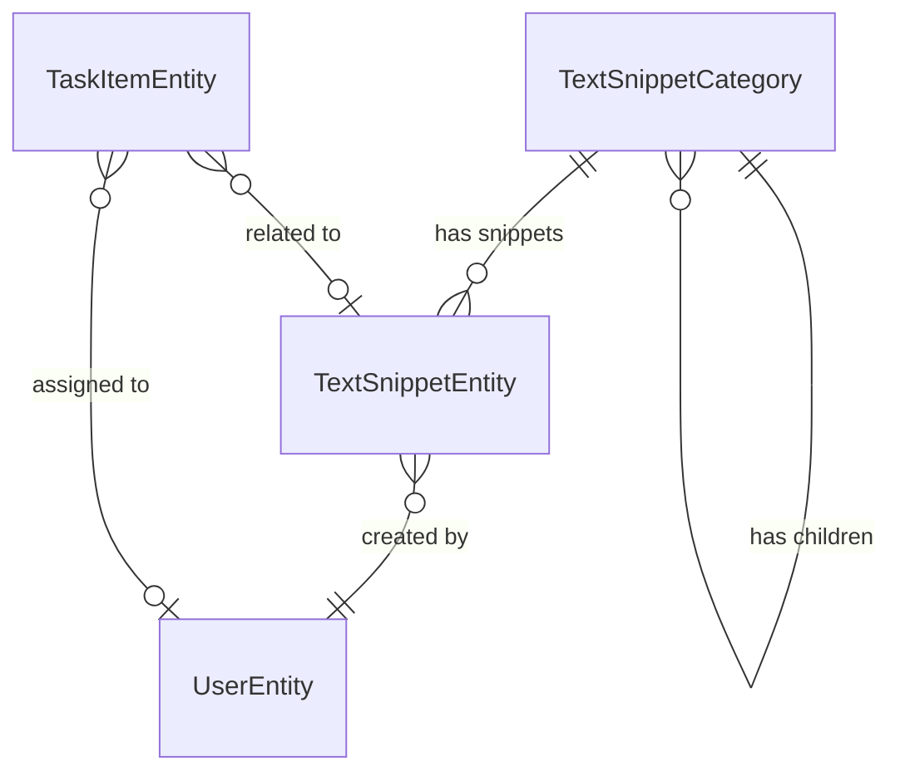

<!-- Last scanned: 2026-06-12 -->

# Domain Entities Reference

**Final Purpose:** Give AI an accurate, evidence-cited map of the TextSnippet domain model (entities, value objects, DTOs, relationships, persistence) so generated code reuses the correct base classes, mapping ownership, and naming — never inventing new patterns.

**Critical rules:** All entities MUST extend `RootEntity<TEntity, TPrimaryKey>` or `RootAuditedEntity<TEntity, TPrimaryKey, TUserId>`. DTOs MUST own mapping via `PlatformEntityDto<TEntity, TKey>.MapToEntity()`. Value objects MUST extend `PlatformValueObject<T>` and override `Validate()`. Logic belongs in entity, NOT handler/component.

## Entity Base Class Hierarchy

| Base Class                                         | Provides                                                 | When to Use                             |
| -------------------------------------------------- | -------------------------------------------------------- | --------------------------------------- |
| `RootEntity<TEntity, TPrimaryKey>`                 | Id, UniqueCompositeId, Validator, DomainEvents           | Simple entities without audit trails    |
| `RootAuditedEntity<TEntity, TPrimaryKey, TUserId>` | + CreatedBy, CreatedDate, LastUpdatedBy, LastUpdatedDate | Entities needing full audit trail       |
| `IRowVersionEntity`                                | ConcurrencyUpdateToken                                   | Entities needing optimistic concurrency |

Defined in: `src/Platform/Easy.Platform/Domain/Entities/Entity.cs:759` and `AuditedEntity.cs:170`

## TextSnippet Service — Entity Catalog

| Entity              | Key Properties                                                                                                           | Base Class                                | File                                                        |
| ------------------- | ------------------------------------------------------------------------------------------------------------------------ | ----------------------------------------- | ----------------------------------------------------------- |
| TextSnippetEntity   | Id, SnippetText, FullText, CreatedByUserId (FK→User), CategoryId (FK→Category), Status, Tags, ViewCount, IsDeleted       | `RootAuditedEntity` + `IRowVersionEntity` | `src/Backend/.../Domain/Entities/TextSnippetEntity.cs:22`   |
| TextSnippetCategory | Id, Name, Description, ParentCategoryId (self-ref FK), SortOrder, IsActive, IconName, ColorCode                          | `RootAuditedEntity` + `IRowVersionEntity` | `src/Backend/.../Domain/Entities/TextSnippetCategory.cs:25` |
| TaskItemEntity      | Id, Title, Description, Status, Priority, DueDate, AssigneeId, RelatedSnippetId (FK→Snippet), SubTasks (JSON), IsDeleted | `RootAuditedEntity` + `IRowVersionEntity` | `src/Backend/.../Domain/Entities/TaskItemEntity.cs:28`      |
| UserEntity          | Id, FirstName, LastName, Email, DepartmentId, DepartmentName, IsActive                                                   | `RootEntity`                              | `src/Backend/.../Domain/Entities/User.cs:5`                 |
| MultiDbDemoEntity   | Id, Name                                                                                                                 | `RootEntity`                              | `src/Backend/.../Domain/Entities/MultiDbDemoEntity.cs:8`    |

### Enums

| Enum               | Values                                         | Used By                  |
| ------------------ | ---------------------------------------------- | ------------------------ |
| `SnippetStatus`    | Draft=0, Published=1, Archived=2               | TextSnippetEntity.Status |
| `TaskItemStatus`   | Todo=0, InProgress=1, Completed=2, Cancelled=3 | TaskItemEntity.Status    |
| `TaskItemPriority` | Low=0, Medium=1, High=2, Critical=3            | TaskItemEntity.Priority  |

### Value Objects

| Value Object                | Properties                                          | Storage                         | File                                                                 |
| --------------------------- | --------------------------------------------------- | ------------------------------- | -------------------------------------------------------------------- |
| `ExampleAddressValueObject` | Number, Street                                      | Owned entity (EF OwnsOne)       | `src/Backend/.../Domain/ValueObjects/ExampleAddressValueObject.cs:6` |
| `SubTaskItem`               | Id, Title, IsCompleted, Order, CompletedDate, Notes | JSON in TaskItemEntity.SubTasks | `src/Backend/.../Domain/Entities/TaskItemEntity.cs:529`              |

> `SubTaskItem` extends `PlatformValueObject<SubTaskItem>` and overrides `Validate()` (value objects use `Validate()`, NOT `GetValidator()`). File: `TaskItemEntity.cs:529`, validator `TitleValidator()` at `:562`.

### Associated Entities (Composite Views)

`TextSnippetAssociatedEntity` extends `TextSnippetEntity` — adds `CreatedByUser` (UserEntity) for joined queries without code duplication. File: `src/Backend/.../Domain/AssociatedEntities/TextSnippetAssociatedEntity.cs:9`

## Entity Relationships



| From                | To                  | Type           | FK               | On Delete                  |
| ------------------- | ------------------- | -------------- | ---------------- | -------------------------- |
| TextSnippetEntity   | TextSnippetCategory | N:1            | CategoryId       | SetNull                    |
| TextSnippetCategory | TextSnippetCategory | N:1 (self-ref) | ParentCategoryId | Restrict                   |
| TaskItemEntity      | TextSnippetEntity   | N:1            | RelatedSnippetId | SetNull                    |
| TextSnippetEntity   | UserEntity          | N:1            | CreatedByUserId  | (conceptual, no EF config) |
| TaskItemEntity      | UserEntity          | N:1            | AssigneeId       | (conceptual, no EF config) |

**Navigation properties** (auto-load helpers, not stored): `TextSnippetEntity.SnippetCategory` (`[PlatformNavigationProperty(nameof(CategoryId))]`, `TextSnippetEntity.cs:67`) and `TaskItemEntity.RelatedSnippet` (`[JsonIgnore]`, `TaskItemEntity.cs:87`).

## Aggregate Boundaries

Single service: **TextSnippet**. All domain entities live in `PlatformExampleApp.TextSnippet.Domain/Entities/`. Each entity is its own aggregate root (extends `RootEntity`/`RootAuditedEntity`). Cross-entity references use FK IDs, NOT nested aggregates.

- **TextSnippetEntity** — aggregate root, owns Address (value object), references Category and User by ID
- **TextSnippetCategory** — aggregate root, self-referencing hierarchy (parent/children)
- **TaskItemEntity** — aggregate root, owns SubTasks (value object list as JSON), references Snippet and User by ID
- **UserEntity** — aggregate root, referenced by Snippet and TaskItem
- **MultiDbDemoEntity** — aggregate root, isolated entity for multi-DB demo

## DTO Mapping

**Rule:** DTOs MUST own mapping. Entity DTOs extend `PlatformEntityDto<TEntity, TKey>` and override `MapToEntity()`. Value object DTOs extend `PlatformDto<T>` and override `MapToObject()`.

| DTO                            | Entity                    | Base Class                                       | Mapping                   | File                                                           |
| ------------------------------ | ------------------------- | ------------------------------------------------ | ------------------------- | -------------------------------------------------------------- |
| `TextSnippetEntityDto`         | TextSnippetEntity         | `PlatformEntityDto<TextSnippetEntity, string>`   | Constructor + MapToEntity | `.../Application/Dtos/EntityDtos/TextSnippetEntityDto.cs:17`   |
| `TextSnippetCategoryDto`       | TextSnippetCategory       | `PlatformEntityDto<TextSnippetCategory, string>` | Constructor + MapToEntity | `.../Application/Dtos/EntityDtos/TextSnippetCategoryDto.cs:15` |
| `TaskItemEntityDto`            | TaskItemEntity            | `PlatformEntityDto<TaskItemEntity, string>`      | Constructor + MapToEntity | `.../Application/Dtos/EntityDtos/TaskItemEntityDto.cs:16`      |
| `SubTaskItemDto`               | SubTaskItem               | (plain class)                                    | MapToValueObject()        | `.../Application/Dtos/EntityDtos/TaskItemEntityDto.cs:331`     |
| `ExampleAddressValueObjectDto` | ExampleAddressValueObject | `PlatformDto<ExampleAddressValueObject>`         | MapToObject()             | `.../Application/Dtos/ExampleAddressValueObjectDto.cs:6`       |

### DTO Pattern: With\* Fluent Methods

DTOs use `With*()` methods for optional related data loading and `WithIf()` for conditional loading:

```csharp
// src/Backend/.../Application/Dtos/EntityDtos/TextSnippetEntityDto.cs:250
public static TextSnippetEntityDto FromEntityWithRelated(
    TextSnippetEntity entity,
    TextSnippetCategory? category = null,
    string? createdByUserName = null)
{
    return new TextSnippetEntityDto(entity)
        .WithIf(category != null, dto => dto.WithCategory(category))
        .WithIf(createdByUserName.IsNotNullOrEmpty(), dto => dto.WithCreatedByUser(createdByUserName));
}
```

## Cross-Service Entity Map (Message Bus)

Architecture: single-service (TextSnippet), RabbitMQ message bus for entity-event propagation + free-format messaging. Inbox/Outbox pattern ensures reliable delivery.

| Message                                | Base Class                                                     | Producer                                   | Consumer                                                   | Purpose                   |
| -------------------------------------- | -------------------------------------------------------------- | ------------------------------------------ | ---------------------------------------------------------- | ------------------------- |
| `TextSnippetEntityEventBusMessage`     | `PlatformCqrsEntityEventBusMessage<TextSnippetEntity, string>` | `TextSnippetEntityEventBusMessageProducer` | `SnippetTextEntityEventBusConsumer`                        | Entity change propagation |
| `DemoSendFreeFormatEventBusMessage`    | `PlatformTrackableBusMessage`                                  | Command handler                            | `DemoSendFreeFormatEventBusMessageCommandEventBusConsumer` | Free-format demo          |
| `DemoAskDoSomethingRequestBusMessage`  | `PlatformTrackableBusMessage`                                  | —                                          | `DemoAskDoSomethingRequestBusMessageConsumer`              | Request-reply demo        |
| `DemoSomethingHappenedEventBusMessage` | `PlatformTrackableBusMessage`                                  | —                                          | `DemoSomethingHappenedEventBusMessageConsumer`             | Event notification demo   |

### Entity Event Handlers (Application Layer)

| Handler                                                                | Reacts To                      | Purpose             | File                             |
| ---------------------------------------------------------------------- | ------------------------------ | ------------------- | -------------------------------- |
| `ClearCacheOnSaveSnippetTextEntityEventHandler`                        | TextSnippetEntity save         | Cache invalidation  | `.../UseCaseEvents/ClearCaches/` |
| `SendNotificationOnPublishSnippetEventHandler`                         | TextSnippetEntity publish      | Notification        | `.../UseCaseEvents/Snippet/`     |
| `UpdateCategoryStatsOnSnippetChangeEventHandler`                       | TextSnippetEntity change       | Category stats sync | `.../UseCaseEvents/Snippet/`     |
| `DemoDoSomeDomainEntityLogicActionOnSaveSnippetTextEntityEventHandler` | TextSnippetEntity save         | Demo domain logic   | `.../UseCaseEvents/`             |
| `DemoUsingFieldUpdatedDomainEventOnSnippetTextEntityEventHandler`      | TextSnippetEntity field update | Demo field tracking | `.../UseCaseEvents/`             |

### Platform Infrastructure Entities

| Entity                     | Purpose                                                            | File                                                                                             |
| -------------------------- | ------------------------------------------------------------------ | ------------------------------------------------------------------------------------------------ |
| `PlatformOutboxBusMessage` | Outbox pattern — stores pending bus messages for reliable delivery | `src/Platform/Easy.Platform/Application/MessageBus/OutboxPattern/PlatformOutboxBusMessage.cs:12` |
| `PlatformInboxBusMessage`  | Inbox pattern — deduplicates consumed bus messages                 | `src/Platform/Easy.Platform/Application/MessageBus/InboxPattern/PlatformInboxBusMessage.cs:12`   |

## Persistence

### Repository Pattern

Generic repository interfaces per domain boundary. MUST use `ITextSnippetRootRepository<TEntity>` for write operations.

```csharp
// src/Backend/.../Domain/Repositories/ITextSnippetRepository.cs:6,11
// Two interfaces: a non-root base + the root repository that composes it.
public interface ITextSnippetRepository<TEntity> : IPlatformQueryableRepository<TEntity, string>
    where TEntity : class, IEntity<string>, new() { }

public interface ITextSnippetRootRepository<TEntity> : IPlatformQueryableRootRepository<TEntity, string>, ITextSnippetRepository<TEntity>
    where TEntity : class, IRootEntity<string>, new() { }
```

### Repository Extensions

| Extension Class                           | Entity              | Key Methods                                                    | File                                                                     |
| ----------------------------------------- | ------------------- | -------------------------------------------------------------- | ------------------------------------------------------------------------ |
| `TextSnippetRepositoryExtensions`         | TextSnippetEntity   | GetByUniqueExprAsync, EnsureFound, Projected queries           | `.../Repositories/Extensions/TextSnippetRepositoryExtensions.cs`         |
| `TextSnippetCategoryRepositoryExtensions` | TextSnippetCategory | GetByIdValidatedAsync, Hierarchical queries                    | `.../Repositories/Extensions/TextSnippetCategoryRepositoryExtensions.cs` |
| `TaskItemRepositoryExtensions`            | TaskItemEntity      | GetByIdValidatedAsync, Aggregate queries, Time-based filtering | `.../Repositories/Extensions/TaskItemRepositoryExtensions.cs`            |

### Database Support

| Provider                        | Module                             | Path                                                                 |
| ------------------------------- | ---------------------------------- | -------------------------------------------------------------------- |
| EF Core (SQL Server/PostgreSQL) | TextSnippet.Persistence            | `src/Backend/PlatformExampleApp.TextSnippet.Persistence/`            |
| MongoDB                         | TextSnippet.Persistence.Mongo      | `src/Backend/PlatformExampleApp.TextSnippet.Persistence.Mongo/`      |
| PostgreSQL-specific             | TextSnippet.Persistence.PostgreSql | `src/Backend/PlatformExampleApp.TextSnippet.Persistence.PostgreSql/` |

### EF Core Entity Configurations

| Configuration                            | Indexes                                                            | File                                                                             |
| ---------------------------------------- | ------------------------------------------------------------------ | -------------------------------------------------------------------------------- |
| `TextSnippetEntityConfiguration`         | SnippetText (unique), CategoryId, Status, IsDeleted                | `.../Persistence/EntityConfigurations/TextSnippetEntityConfiguration.cs`         |
| `TextSnippetCategoryEntityConfiguration` | ParentCategoryId, IsActive, (ParentCategoryId+Name unique)         | `.../Persistence/EntityConfigurations/TextSnippetCategoryEntityConfiguration.cs` |
| `TaskItemEntityConfiguration`            | Status, Priority, AssigneeId, DueDate, IsDeleted, RelatedSnippetId | `.../Persistence/EntityConfigurations/TaskItemEntityConfiguration.cs`            |

## Frontend Data Models

| Model                     | Backend Entity    | File                                                                                                  |
| ------------------------- | ----------------- | ----------------------------------------------------------------------------------------------------- |
| `TextSnippetDataModel`    | TextSnippetEntity | `src/Frontend/libs/apps-domains/text-snippet-domain/src/lib/data-models/text-snippet.data-model.ts:3` |
| `TaskItemDataModel`       | TaskItemEntity    | `src/Frontend/libs/apps-domains/text-snippet-domain/src/lib/data-models/task-item.data-model.ts:123`  |
| `SubTaskItemDataModel`    | SubTaskItem       | `src/Frontend/libs/apps-domains/text-snippet-domain/src/lib/data-models/task-item.data-model.ts:86`   |
| `TaskStatisticsDataModel` | (computed)        | `src/Frontend/libs/apps-domains/text-snippet-domain/src/lib/data-models/task-item.data-model.ts:297`  |

## Naming Conventions

| Pattern               | Convention                                   | Example                                          |
| --------------------- | -------------------------------------------- | ------------------------------------------------ |
| Entity class          | `{Name}Entity` or plain `{Name}`             | `TextSnippetEntity`, `TextSnippetCategory`       |
| Entity DTO            | `{EntityName}Dto` or `{EntityName}EntityDto` | `TextSnippetEntityDto`, `TextSnippetCategoryDto` |
| Value object          | `{Name}ValueObject`                          | `ExampleAddressValueObject`                      |
| Value object DTO      | `{Name}Dto`                                  | `ExampleAddressValueObjectDto`, `SubTaskItemDto` |
| Repository interface  | `I{Domain}RootRepository<TEntity>`           | `ITextSnippetRootRepository<TextSnippetEntity>`  |
| Repository extensions | `{EntityName}RepositoryExtensions`           | `TextSnippetRepositoryExtensions`                |
| Entity configuration  | `{EntityName}EntityConfiguration`            | `TextSnippetEntityConfiguration`                 |
| Event handler         | `{Action}On{Event}EventHandler`              | `ClearCacheOnSaveSnippetTextEntityEventHandler`  |
| Bus message           | `{EntityName}EntityEventBusMessage`          | `TextSnippetEntityEventBusMessage`               |
| Frontend data model   | `{EntityName}DataModel`                      | `TextSnippetDataModel`, `TaskItemDataModel`      |

## Closing Reminders

**IMPORTANT MUST ATTENTION Final Purpose:** accurate evidence-cited domain map so AI reuses correct base classes, mapping ownership, naming — never invents patterns.
**IMPORTANT MUST ATTENTION** Entities MUST extend `RootEntity` or `RootAuditedEntity`; add `IRowVersionEntity` for optimistic concurrency.
**IMPORTANT MUST ATTENTION** DTOs MUST own mapping via `MapToEntity()`/`MapToObject()` — NEVER map in handlers.
**IMPORTANT MUST ATTENTION** Value objects MUST extend `PlatformValueObject<T>` and override `Validate()` (NOT `GetValidator()`) — e.g. `SubTaskItem`, `ExampleAddressValueObject`.
**IMPORTANT MUST ATTENTION** Business logic MUST live in entity, NOT handler/component.
**IMPORTANT MUST ATTENTION** Side effects MUST go in EntityEventHandlers under `UseCaseEvents/`, NEVER in command handlers.
