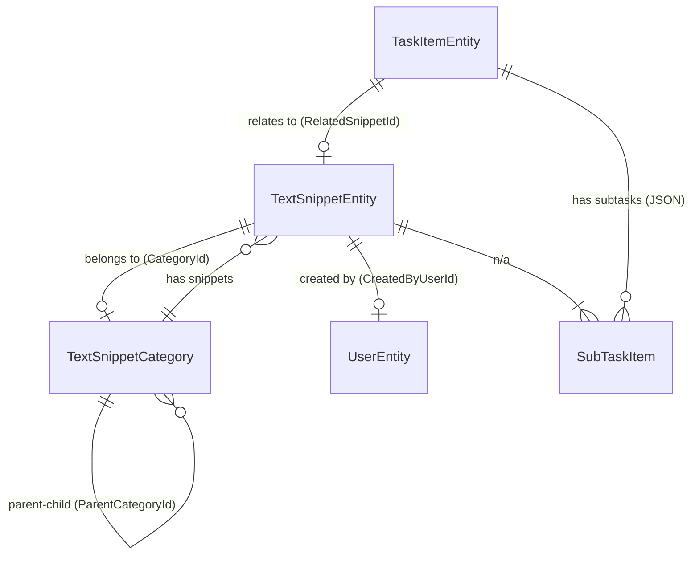
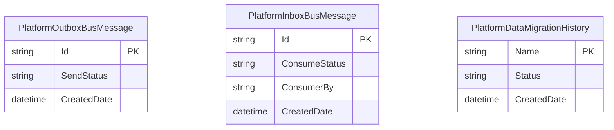

<!-- Last scanned: 2026-03-15 -->

# Domain Entities Reference

> Easy.Platform — .NET 9 Framework + PlatformExampleApp (TextSnippet)

## Quick Summary

**Goal:** Canonical reference for all domain entities, value objects, DTO mappings, and persistence patterns in the Easy.Platform framework and PlatformExampleApp.

**Entity Hierarchy (decision tree):**

```
Need aggregate root?  → RootEntity<T, TKey>
  + audit trail?      → RootAuditedEntity<T, TKey, TUserId>
Non-root entity?      → Entity<T, TKey>
  + audit trail?      → AuditedEntity<T, TKey, TUserId>
```

**Key Patterns:**

- All aggregate roots extend `RootEntity<>` or `RootAuditedEntity<>` — never `Entity<>` directly
- Validation lives in entities via `IValidatableEntity<TEntity>` + `PlatformValidationResult` fluent API
- Side effects via domain event handlers in `UseCaseEvents/`, NEVER in command handlers
- DTOs own mapping via `PlatformEntityDto<TEntity, TKey>.MapToEntity()`, NEVER map in handlers
- Value objects embedded as JSON columns (SubTasks, Address, Tags)
- Cross-aggregate references use string FKs, not navigation objects in commands
- Domain events accumulated within aggregate root, published after save

**Counts:** 5 domain entities + 3 infrastructure entities | 4 value objects | 6 enums

**Contents:** [Entity Hierarchy](#entity-hierarchy) | [Platform Framework Entities](#platform-framework-entities) | [Example App Entities](#platformexampleapp-textsnippet-entities) | [Value Objects](#value-objects) | [Entity Relationships](#entity-relationships) | [DTO Mapping](#dto-mapping) | [Cross-Service Entity Map](#cross-service-entity-map) | [Aggregate Boundaries](#aggregate-boundaries) | [Naming Conventions](#naming-conventions)

---

## Entity Hierarchy

Layered base class hierarchy supporting validation, domain events, audit trails, and optimistic concurrency.

```
IEntity
├── IEntity<TPrimaryKey>
│   ├── Entity<TEntity, TPrimaryKey>              # Base with validation + domain events
│   │   ├── AuditedEntity<T, TKey, TUserId>       # Non-root with audit trail
│   │   └── RootEntity<TEntity, TPrimaryKey>       # Aggregate root marker
│   │       └── RootAuditedEntity<T, TKey, TUserId> # Aggregate root + audit
│   └── IRootEntity<TPrimaryKey>                   # Aggregate root interface
└── ISupportDomainEventsEntity                     # Domain event support
```

**Key Interfaces:**

| Interface                     | Purpose                                           | File                                                       |
| ----------------------------- | ------------------------------------------------- | ---------------------------------------------------------- |
| `IEntity<TPrimaryKey>`        | Typed primary key contract                        | `src/Platform/Easy.Platform/Domain/Entities/Entity.cs:220` |
| `IRootEntity<TPrimaryKey>`    | Aggregate root marker                             | `Entity.cs:748`                                            |
| `IFullAuditedEntity<TUserId>` | CreatedBy/LastUpdatedBy + dates                   | `AuditedEntity.cs:75`                                      |
| `IRowVersionEntity`           | Optimistic concurrency (`ConcurrencyUpdateToken`) | `IRowVersionEntity.cs`                                     |
| `ISupportDomainEventsEntity`  | Domain event accumulation                         | `Entity.cs:305`                                            |
| `IUniqueCompositeIdSupport`   | Natural/composite key support                     | `Entity.cs:462`                                            |
| `IValidatableEntity<TEntity>` | Entity validation contract                        | `Entity.cs:286`                                            |

**Key Attributes:**

| Attribute                        | Purpose                                                        |
| -------------------------------- | -------------------------------------------------------------- |
| `[TrackFieldUpdatedDomainEvent]` | Auto-generates field change domain events on marked properties |
| `[ComputedEntityProperty]`       | Read-only calculated property (not persisted)                  |
| `[PlatformNavigationProperty]`   | Lazy/explicit-load navigation property                         |
| `[PlatformIgnoreCheckValueDiff]` | Excluded from value diff comparisons                           |

---

## Platform Framework Entities

Infrastructure entities for messaging and migration support.

### PlatformOutboxBusMessage

Outgoing messages for reliable delivery via RabbitMQ (outbox pattern).

| Property               | Type              | Purpose                                     |
| ---------------------- | ----------------- | ------------------------------------------- |
| Id                     | string (max 400)  | Primary key                                 |
| JsonMessage            | string            | Serialized message payload                  |
| MessageTypeFullName    | string (max 1000) | Type for deserialization                    |
| RoutingKey             | string (max 500)  | Message routing                             |
| SendStatus             | SendStatuses enum | New, Processing, Processed, Failed, Ignored |
| RetriedProcessCount    | int?              | Retry counter                               |
| NextRetryProcessAfter  | DateTime?         | Scheduled retry time                        |
| CreatedDate            | DateTime          | Creation timestamp                          |
| LastSendDate           | DateTime          | Last send attempt                           |
| ConcurrencyUpdateToken | string?           | Optimistic concurrency                      |

- **Base:** `RootEntity<PlatformOutboxBusMessage, string>`, `IRowVersionEntity`
- **File:** `src/Platform/Easy.Platform/Application/MessageBus/OutboxPattern/PlatformOutboxBusMessage.cs:12`

### PlatformInboxBusMessage

Received messages for idempotent processing (inbox pattern).

| Property               | Type                 | Purpose                                     |
| ---------------------- | -------------------- | ------------------------------------------- |
| Id                     | string (max 400)     | Primary key                                 |
| JsonMessage            | string               | Serialized payload                          |
| MessageTypeFullName    | string (max 1000)    | Type for deserialization                    |
| ProduceFrom            | string               | Source service                              |
| RoutingKey             | string (max 500)     | Message routing                             |
| ConsumerBy             | string               | Consumer type name                          |
| ConsumeStatus          | ConsumeStatuses enum | New, Processing, Processed, Failed, Ignored |
| RetriedProcessCount    | int?                 | Retry counter                               |
| ForApplicationName     | string?              | Target application filter                   |
| CreatedDate            | DateTime             | Creation timestamp                          |
| ConcurrencyUpdateToken | string?              | Optimistic concurrency                      |

- **Base:** `RootEntity<PlatformInboxBusMessage, string>`, `IRowVersionEntity`
- **File:** `src/Platform/Easy.Platform/Application/MessageBus/InboxPattern/PlatformInboxBusMessage.cs:12`

### PlatformDataMigrationHistory

Tracks data migration execution state.

| Property               | Type           | Purpose                                        |
| ---------------------- | -------------- | ---------------------------------------------- |
| Name                   | string         | Migration identifier (PK via GetId())          |
| Status                 | Statuses? enum | New, Processing, Processed, Failed, SkipFailed |
| LastProcessingPingTime | DateTime?      | Processing alive ping                          |
| LastProcessError       | string?        | Error details                                  |
| CreatedDate            | DateTime       | Creation timestamp                             |
| ConcurrencyUpdateToken | string?        | Optimistic concurrency                         |

- **Implements:** `IRowVersionEntity` (not `IEntity`)
- **File:** `src/Platform/Easy.Platform/Persistence/DataMigration/PlatformDataMigrationHistory.cs:8`

---

## PlatformExampleApp TextSnippet Entities

### TextSnippetEntity

Core domain entity — text snippet with categorization, publishing, and full-text search.

| Property               | Type                      | Purpose                                |
| ---------------------- | ------------------------- | -------------------------------------- |
| Id                     | string                    | Primary key (ULID)                     |
| SnippetText            | string (max 100)          | Short text, tracked for changes        |
| FullText               | string (max 4000)         | Full content                           |
| Status                 | SnippetStatus             | Draft (0), Published (1), Archived (2) |
| CategoryId             | string?                   | FK → TextSnippetCategory               |
| Tags                   | List\<string\>            | Tagging (JSON stored)                  |
| ViewCount              | int                       | Analytics counter                      |
| PublishedDate          | DateTime?                 | When published                         |
| IsDeleted              | bool                      | Soft delete flag                       |
| FullTextSearch         | string?                   | Indexed for full-text search           |
| CreatedByUserId        | string                    | FK → UserEntity (demo)                 |
| Title                  | string                    | Display title                          |
| Address                | ExampleAddressValueObject | Embedded value object                  |
| TimeOnly               | TimeOnly                  | Demo time field                        |
| ConcurrencyUpdateToken | string?                   | Optimistic concurrency                 |

**Computed (not persisted):** `WordCount`, `IsRecentlyModified`, `DisplayTitle`, `IsPublished`
**Navigation:** `SnippetCategory` (TextSnippetCategory)
**Audit:** CreatedBy, LastUpdatedBy, CreatedDate, LastUpdatedDate (inherited)

- **Base:** `RootAuditedEntity<TextSnippetEntity, string, string>`, `IRowVersionEntity`
- **File:** `src/Backend/PlatformExampleApp.TextSnippet.Domain/Entities/TextSnippetEntity.cs:22`

### TextSnippetCategory

Hierarchical category with self-referencing parent-child structure.

| Property               | Type               | Purpose                         |
| ---------------------- | ------------------ | ------------------------------- |
| Id                     | string             | Primary key                     |
| Name                   | string (max 200)   | Category name, tracked          |
| Description            | string? (max 1000) | Optional description            |
| ParentCategoryId       | string?            | Self-referencing FK (hierarchy) |
| SortOrder              | int                | Display order                   |
| IsActive               | bool               | Active flag, tracked            |
| IconName               | string?            | UI icon identifier              |
| ColorCode              | string?            | Hex color for UI                |
| ConcurrencyUpdateToken | string?            | Optimistic concurrency          |

**Computed:** `IsRootCategory`, `DisplayName`
**Navigation:** `ParentCategory`, `ChildCategories` (self), `Snippets` (TextSnippetEntity collection)

- **Base:** `RootAuditedEntity<TextSnippetCategory, string, string>`, `IRowVersionEntity`
- **File:** `src/Backend/PlatformExampleApp.TextSnippet.Domain/Entities/TextSnippetCategory.cs:25`

### TaskItemEntity

Task management entity with subtasks, assignment, and soft delete.

| Property               | Type                | Purpose                                                |
| ---------------------- | ------------------- | ------------------------------------------------------ |
| Id                     | string              | Primary key                                            |
| Title                  | string (max 200)    | Task title                                             |
| Description            | string? (max 4000)  | Task description                                       |
| Status                 | TaskItemStatus      | Todo (0), InProgress (1), Completed (2), Cancelled (3) |
| Priority               | TaskItemPriority    | Low (0), Medium (1), High (2), Critical (3)            |
| StartDate              | DateTime?           | Planned start                                          |
| DueDate                | DateTime?           | Due date                                               |
| CompletedDate          | DateTime?           | Actual completion                                      |
| AssigneeId             | string?             | Assigned user                                          |
| RelatedSnippetId       | string?             | FK → TextSnippetEntity                                 |
| EstimatedHours         | decimal?            | Estimated effort                                       |
| ActualHours            | decimal?            | Actual effort                                          |
| Tags                   | List\<string\>      | Tagging (JSON)                                         |
| IsDeleted              | bool                | Soft delete                                            |
| DeletedDate            | DateTime?           | Deletion timestamp                                     |
| DeletedById            | string?             | Who deleted                                            |
| SubTasks               | List\<SubTaskItem\> | Embedded value objects (JSON)                          |
| ConcurrencyUpdateToken | string?             | Optimistic concurrency                                 |

**Computed:** `IsOverdue`, `DaysUntilDue`, `SubTasksCompletionPercent`, `CanBeCompleted`
**Navigation:** `RelatedSnippet` (TextSnippetEntity)

- **Base:** `RootAuditedEntity<TaskItemEntity, string, string>`, `IRowVersionEntity`
- **File:** `src/Backend/PlatformExampleApp.TextSnippet.Domain/Entities/TaskItemEntity.cs:28`

### UserEntity

Simple user entity for authentication/demo purposes.

| Property       | Type   | Purpose                 |
| -------------- | ------ | ----------------------- |
| Id             | string | Primary key             |
| FirstName      | string | First name              |
| LastName       | string | Last name               |
| Email          | string | Email address           |
| DepartmentId   | string | Department reference    |
| DepartmentName | string | Department display name |
| IsActive       | bool   | Active flag             |

**Computed:** `FullName`

- **Base:** `RootEntity<UserEntity, string>` (sealed, no audit trail)
- **File:** `src/Backend/PlatformExampleApp.TextSnippet.Domain/Entities/User.cs:5`

### MultiDbDemoEntity

Demonstration entity for multi-database storage patterns.

| Property | Type   | Purpose         |
| -------- | ------ | --------------- |
| Id       | string | Primary key     |
| Name     | string | Demo name field |

- **Base:** `RootEntity<MultiDbDemoEntity, string>` (sealed)
- **File:** `src/Backend/PlatformExampleApp.TextSnippet.Domain/Entities/MultiDbDemoEntity.cs:8`

### TextSnippetAssociatedEntity

Associated entity pattern — inherits TextSnippetEntity, adds loaded related data.

- **Base:** `TextSnippetEntity` (inheritance, not separate table)
- **Purpose:** Fluent builder to attach `CreatedByUser` without separate DTO
- **File:** `src/Backend/PlatformExampleApp.TextSnippet.Domain/AssociatedEntities/TextSnippetAssociatedEntity.cs:9`

---

## Value Objects

### Platform Framework

| Value Object  | Properties                                                          | File                                                              |
| ------------- | ------------------------------------------------------------------- | ----------------------------------------------------------------- |
| `Address`     | StreetNumber, Street, Ward, District, City, State, Country, ZipCode | `src/Platform/Easy.Platform/Common/ValueObjects/Address.cs:6`     |
| `FullName`    | FirstName, MiddleName, LastName                                     | `src/Platform/Easy.Platform/Common/ValueObjects/FullName.cs:8`    |
| `Translation` | Template, Params (Dictionary)                                       | `src/Platform/Easy.Platform/Common/ValueObjects/Translation.cs:5` |

**Base class:** `PlatformValueObject<TValueObject>` — equality by value (JSON string), immutable semantics.
**File:** `src/Platform/Easy.Platform/Common/ValueObjects/Abstract/PlatformValueObject.cs:25`

### Example App

| Value Object                | Properties                                                 | File                                                                                            |
| --------------------------- | ---------------------------------------------------------- | ----------------------------------------------------------------------------------------------- |
| `ExampleAddressValueObject` | Number, Street                                             | `src/Backend/PlatformExampleApp.TextSnippet.Domain/ValueObjects/ExampleAddressValueObject.cs:6` |
| `SubTaskItem`               | Id (ULID), Title, IsCompleted, Order, CompletedDate, Notes | `src/Backend/PlatformExampleApp.TextSnippet.Domain/Entities/TaskItemEntity.cs:529`              |

---

## Entity Relationships

### TextSnippet Service ER Diagram



**Relationship Details:**

| From                | To                        | Type       | FK               | On Delete          |
| ------------------- | ------------------------- | ---------- | ---------------- | ------------------ |
| TextSnippetEntity   | TextSnippetCategory       | N:1        | CategoryId       | SET NULL           |
| TextSnippetCategory | TextSnippetCategory       | N:1 (self) | ParentCategoryId | RESTRICT           |
| TaskItemEntity      | TextSnippetEntity         | N:1        | RelatedSnippetId | SET NULL           |
| TaskItemEntity      | SubTaskItem               | 1:N        | Embedded JSON    | CASCADE (implicit) |
| TextSnippetEntity   | ExampleAddressValueObject | 1:1        | Owned/JSON       | CASCADE (implicit) |

### Platform Infrastructure ER Diagram



---

## DTO Mapping

### Framework Pattern

DTOs extend `PlatformEntityDto<TEntity, TId>` which provides:

- `MapToEntity()` — maps DTO to entity with mode awareness (`MapToEntityModes`)
- `MapToNewEntity()` — creates new entity instance
- `GetSubmittedId()` — detects create vs update (null = create)
- `Validate()` — DTO-level validation before mapping

Value object DTOs extend `PlatformDto<TMapForObject>` with `MapToObject()`.

### Example App DTO Mapping Table

| DTO Class                      | Entity                    | Mapping                           | File                                                       |
| ------------------------------ | ------------------------- | --------------------------------- | ---------------------------------------------------------- |
| `TextSnippetEntityDto`         | TextSnippetEntity         | `PlatformEntityDto.MapToEntity()` | `Application/Dtos/EntityDtos/TextSnippetEntityDto.cs:17`   |
| `TextSnippetCategoryDto`       | TextSnippetCategory       | `PlatformEntityDto.MapToEntity()` | `Application/Dtos/EntityDtos/TextSnippetCategoryDto.cs:15` |
| `TaskItemEntityDto`            | TaskItemEntity            | `PlatformEntityDto.MapToEntity()` | `Application/Dtos/EntityDtos/TaskItemEntityDto.cs:16`      |
| `SubTaskItemDto`               | SubTaskItem               | Manual (no base)                  | `Application/Dtos/EntityDtos/TaskItemEntityDto.cs:331`     |
| `ExampleAddressValueObjectDto` | ExampleAddressValueObject | `PlatformDto.MapToObject()`       | `Application/Dtos/ExampleAddressValueObjectDto.cs:6`       |

All DTO paths relative to `src/Backend/PlatformExampleApp.TextSnippet.Application/`.

**DTO Patterns:**

- Fluent `With*()` methods for optional data loading (e.g., `WithCategory()`, `WithCreatedByUser()`)
- Static factory `FromEntityWithRelated()` for batch entity-to-DTO with related data
- `BuildHierarchy()` on TextSnippetCategoryDto for tree construction

### Frontend TypeScript Models

| Model                     | Backend DTO                  | File                                                                                     |
| ------------------------- | ---------------------------- | ---------------------------------------------------------------------------------------- |
| `TextSnippetDataModel`    | TextSnippetEntityDto         | `libs/apps-domains/text-snippet-domain/src/lib/data-models/text-snippet.data-model.ts:3` |
| `TaskItemDataModel`       | TaskItemEntityDto            | `libs/apps-domains/text-snippet-domain/src/lib/data-models/task-item.data-model.ts:123`  |
| `SubTaskItemDataModel`    | SubTaskItemDto               | `task-item.data-model.ts:86`                                                             |
| `TaskStatisticsDataModel` | GetTaskStatisticsQueryResult | `task-item.data-model.ts:297`                                                            |

Frontend paths relative to `src/Frontend/`.

---

## Cross-Service Entity Map

Single-service (TextSnippet) application. Cross-service communication demonstrated via RabbitMQ message bus patterns.

| Entity            | Owner                              | Sync Mechanism                                        | Direction | Purpose                                             |
| ----------------- | ---------------------------------- | ----------------------------------------------------- | --------- | --------------------------------------------------- |
| TextSnippetEntity | TextSnippet Service                | TextSnippetEntityEventBusMessage via RabbitMQ         | Outbound  | Entity CRUD events published for external consumers |
| MultiDbDemoEntity | TextSnippet Service (secondary DB) | TransferSnippetTextToMultiDbDemoEntityNameDomainEvent | Internal  | Cross-database data sync demo                       |

### Event-Driven Side Effects

| Event Handler                                  | Trigger Entity    | Action                           |
| ---------------------------------------------- | ----------------- | -------------------------------- |
| SendNotificationOnPublishSnippetEventHandler   | TextSnippetEntity | Notify on Status → Published     |
| UpdateCategoryStatsOnSnippetChangeEventHandler | TextSnippetEntity | Update TextSnippetCategory stats |
| ClearCacheOnSaveSnippetTextEntityEventHandler  | TextSnippetEntity | Clear search cache               |

Event handlers located in `src/Backend/PlatformExampleApp.TextSnippet.Application/UseCaseEvents/`.

---

## Aggregate Boundaries

| Aggregate Root               | Owned Entities/VOs                                        | Boundary                                 |
| ---------------------------- | --------------------------------------------------------- | ---------------------------------------- |
| **TextSnippetEntity**        | ExampleAddressValueObject (embedded), List\<string\> Tags | Snippet + address + tags as single unit  |
| **TextSnippetCategory**      | (none embedded)                                           | Category with self-referencing hierarchy |
| **TaskItemEntity**           | List\<SubTaskItem\> (embedded JSON)                       | Task + subtasks as single unit           |
| **UserEntity**               | (none)                                                    | Standalone user reference                |
| **MultiDbDemoEntity**        | (none)                                                    | Demo entity in secondary database        |
| **PlatformOutboxBusMessage** | (none)                                                    | Outbox message lifecycle                 |
| **PlatformInboxBusMessage**  | (none)                                                    | Inbox message lifecycle                  |

**Aggregate rules:**

- All aggregate roots extend `RootEntity<>` or `RootAuditedEntity<>`
- Cross-aggregate references use string FK (not navigation objects in commands)
- Value objects embedded as JSON columns (SubTasks, Address, Tags)
- Domain events accumulated within aggregate root, published after save

---

## Naming Conventions

| Pattern              | Convention                                   | Examples                                              |
| -------------------- | -------------------------------------------- | ----------------------------------------------------- |
| Entity class         | `{Name}Entity`                               | `TextSnippetEntity`, `TaskItemEntity`, `UserEntity`   |
| Value object         | `{Name}ValueObject` or `{Name}`              | `ExampleAddressValueObject`, `SubTaskItem`            |
| Entity DTO           | `{EntityName}Dto` or `{EntityName}EntityDto` | `TextSnippetEntityDto`, `TaskItemEntityDto`           |
| Value object DTO     | `{ValueObject}Dto`                           | `ExampleAddressValueObjectDto`, `SubTaskItemDto`      |
| Repository interface | `I{Service}Repository<TEntity>`              | `ITextSnippetRepository<TEntity>`                     |
| Root repository      | `I{Service}RootRepository<TEntity>`          | `ITextSnippetRootRepository<TEntity>`                 |
| Command              | `{Verb}{Entity}Command`                      | `SaveSnippetTextCommand`, `DeleteTaskItemCommand`     |
| Query                | `{Verb}{Entity}Query`                        | `SearchSnippetTextQuery`, `GetTaskListQuery`          |
| Event handler        | `{Action}On{Trigger}EventHandler`            | `SendNotificationOnPublishSnippetEventHandler`        |
| Bus message          | `{Entity}EventBusMessage`                    | `TextSnippetEntityEventBusMessage`                    |
| Enum                 | Inside entity or standalone                  | `SnippetStatus`, `TaskItemStatus`, `TaskItemPriority` |
| Frontend model       | `{Entity}DataModel`                          | `TextSnippetDataModel`, `TaskItemDataModel`           |
| Frontend API         | `{Entity}Api`                                | `TextSnippetApi`, `TaskItemApi`                       |

---

## Persistence Summary

| Entity                   | SQL Server                 | PostgreSQL             | MongoDB                     |
| ------------------------ | -------------------------- | ---------------------- | --------------------------- |
| TextSnippetEntity        | EF Core + FTS (`CONTAINS`) | EF Core + tsvector GIN | Native + text index         |
| TextSnippetCategory      | EF Core                    | EF Core                | Native + ascending indexes  |
| TaskItemEntity           | EF Core                    | EF Core                | (not configured separately) |
| UserEntity               | EF Core                    | EF Core                | Native                      |
| MultiDbDemoEntity        | N/A                        | N/A                    | Separate MongoDB context    |
| PlatformOutboxBusMessage | EF Core (auto)             | EF Core (auto)         | Native (auto)               |
| PlatformInboxBusMessage  | EF Core (auto)             | EF Core (auto)         | Native (auto)               |

**Persistence projects:**

- `src/Backend/PlatformExampleApp.TextSnippet.Persistence/` — SQL Server (EF Core)
- `src/Backend/PlatformExampleApp.TextSnippet.Persistence.PostgreSql/` — PostgreSQL (EF Core)
- `src/Backend/PlatformExampleApp.TextSnippet.Persistence.Mongo/` — MongoDB
- `src/Backend/PlatformExampleApp.TextSnippet.Persistence.MultiDbDemo.Mongo/` — Secondary MongoDB

**Entity counts:** 5 domain entities + 2 framework infrastructure entities + 1 migration tracker = **8 total**
**Value objects:** 2 framework + 2 app = **4 total**
**Enums:** 6 total (SnippetStatus, TaskItemStatus, TaskItemPriority, SendStatuses, ConsumeStatuses, MigrationStatuses)

---

## Closing Reminders

- **MUST** use `RootEntity<>` or `RootAuditedEntity<>` for aggregate roots — never persist a non-root `Entity<>` directly
- **MUST** place validation in entities via `IValidatableEntity<TEntity>` + `PlatformValidationResult` fluent API — never throw exceptions for validation
- **MUST** implement side effects as domain event handlers in `UseCaseEvents/` — never in command handlers
- **MUST** let DTOs own mapping via `PlatformEntityDto.MapToEntity()` / `PlatformDto.MapToObject()` — never map in handlers or controllers
- **MUST** use string FKs for cross-aggregate references and embed value objects as JSON columns
